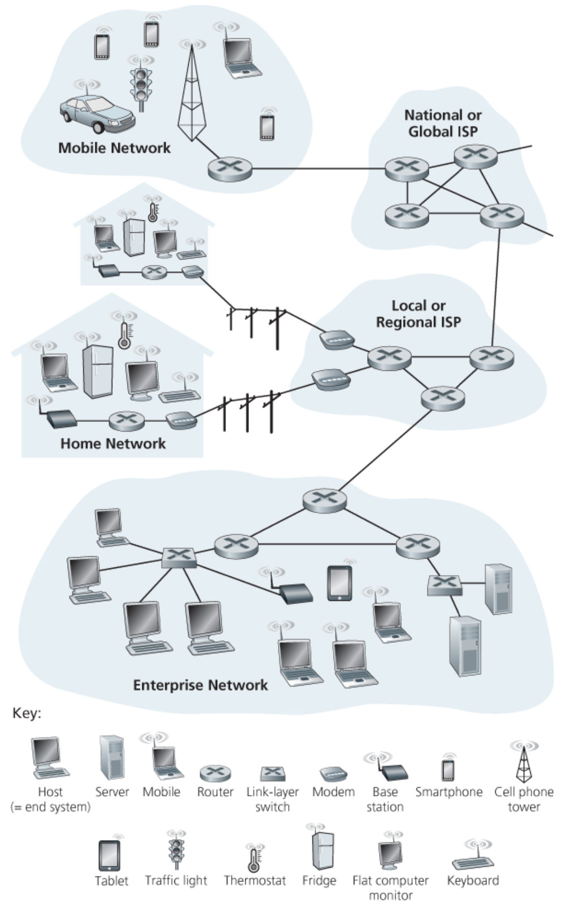
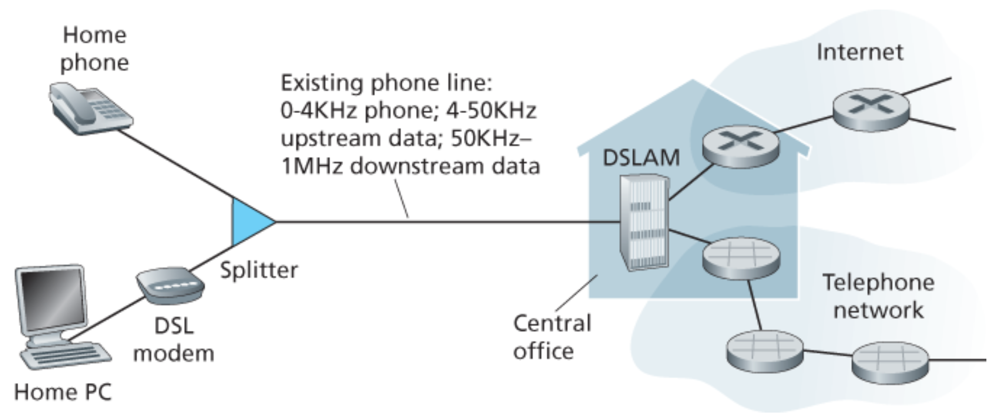
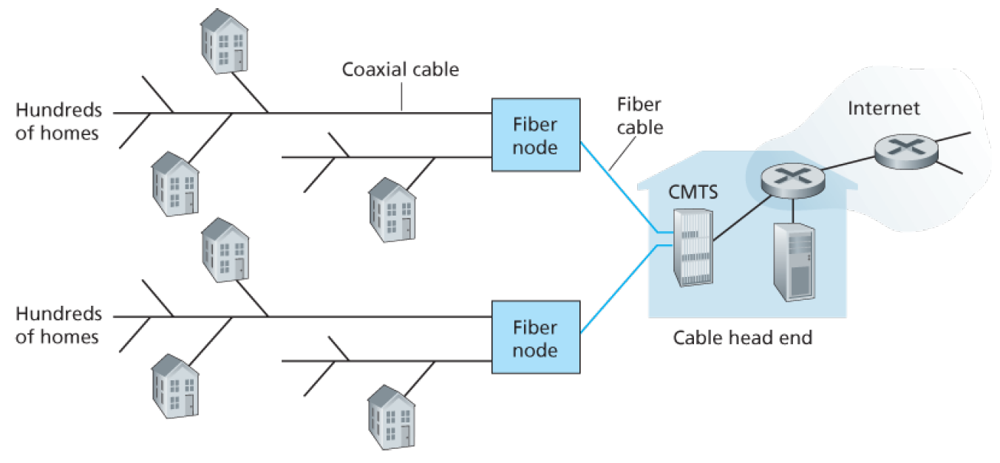
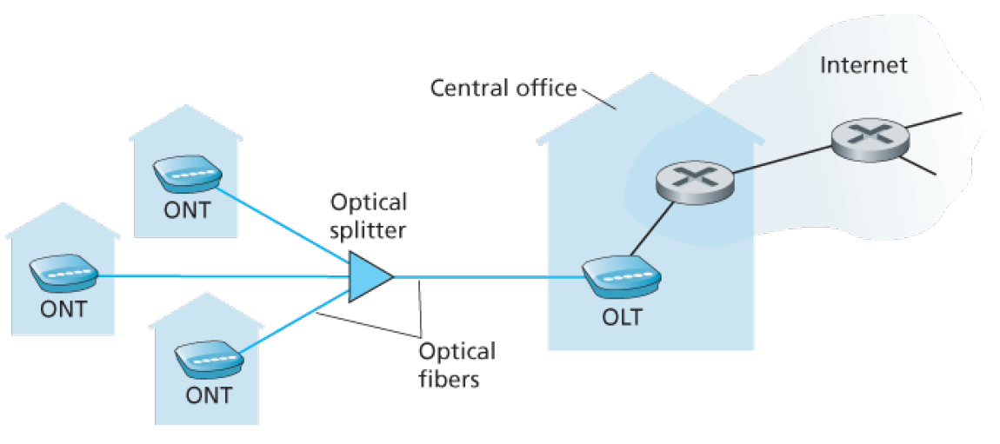
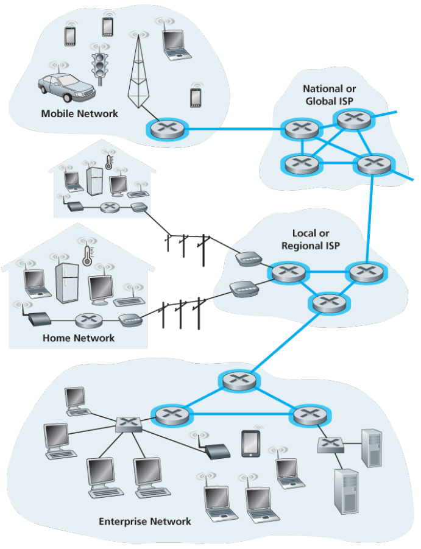
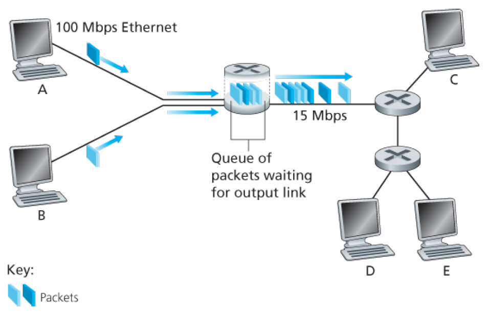
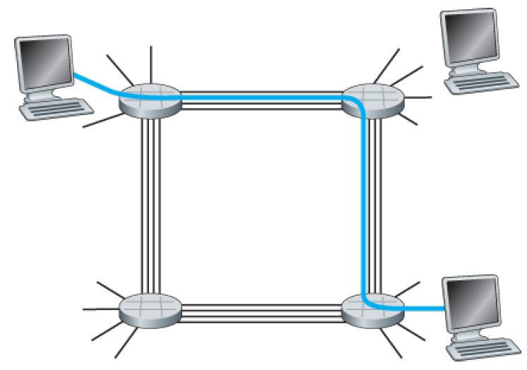
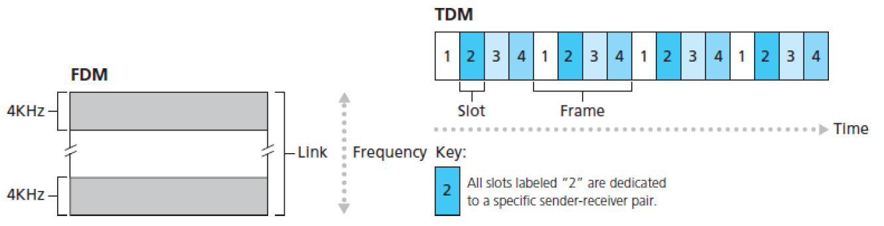
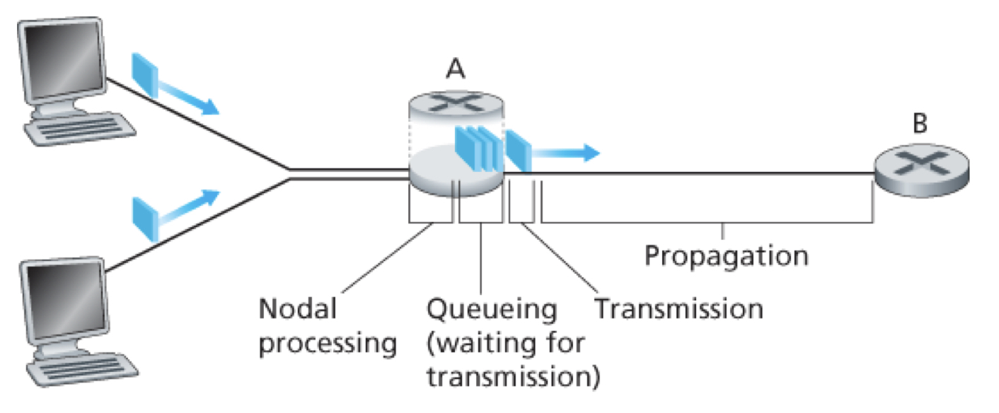
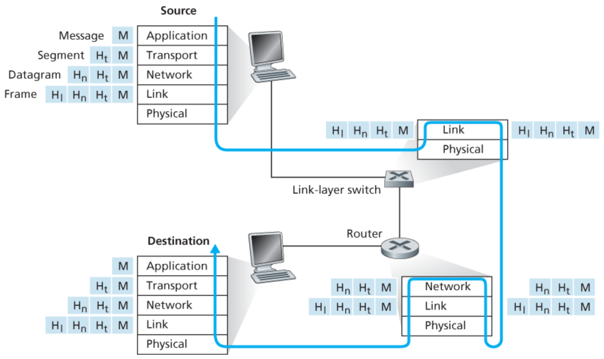

# Computer Networks - Chapter 1 (Book)
- Author: Ruben Schenk
- Date: 02.03.2021
- Contact: ruben.schenk@inf.ethz.ch

# 1. Computer Networks and the Internet
## 1.1 What Is the Internet?
### 1.1.1 A Nuts-and-Bolts Description

The Internet is a computer network that interconnects billions of computing devices through the world. In Internet jargon, all of these devices are called `hosts` or `end systems`.  
End systems are connected by a network of `communication links` and `packet switches`. Different links can transmit data at different rates, with the `transmission rate` of a link measured in bits/second. 

`Packages` are packages of information, put together by a sending end system. The sequence of communication links and packet switches traversed by a packet from the sending end system to the receiving end system is known as a `route` or `path` through the network.

End systems access the Internet through `Internet Service Providers (ISPs)`, including residential ISPs such as local cable or telephone companies, corporate ISPs, university ISPs etc.  
End systems, packet switches, and other pieces of the Internet run `protocols` that control the sending and receiving of information within the internet. The `Transmission Control Protocol (TCP)` and the `Internet Protocol (IP)` are two of the most important protocols in the Internet.

### 1.1.2 A Services Description
We can also describe the Internet from an entirely different angle - namely, as *an infrastructure that provides services to applications*. The applications are said to be `distributed applications`, since they involve multiple end systems that exchange data with each other.

End systems attached to the Internet provide a `socket interface` that specifies how a program running on one end system asks the Internet infrastructure to deliver data to a specific destination program running on another system.

### 1.1.3 What Is a Protocol?
#### Network Protocols
All activity in the Internet that involves two or more communicating remote entities is governed by a protocol. Protocols are running everywhere in the Internet.
> A **protocol** defines the format and the order of messages exchanged between two or more communicating entities, as well as the actions taken on the transmission and/or receipt of a message or other event.

## 1.2 The Network Edge
 

In this book, end systems are also refered to as `hosts` because they host (that is, *run*) application programs such as a Web browser program, a Web server program etc.   Hosts are sometimes further divided into two categories: `clients` and `servers`. Informally, clients tend to be desktop and mobile PCs, smartphones and so one, whereas servers tend to be more powerful machines that store and distribute Web pages, stream video, relay e-mail, and so on.

### 1.2.1 Acess Networks
#### Home Access: DSL, Cable, FFTH, Dial-Up, and Satellite

Today, the most prevalent types of broadband residential acess are `digital subscriber line (DSL)` and cable. A residence typically obtains DSL Internet access from the same local telephone company (*telco*) that provides its wired local phone access.  
Each customer's DSL modem uses the existing telephone line (twisted-pair copper wire) to exchange data with a digital subscriber line access multiplexer (*DSLAM*) located in the telco's local central office (*CO*).

The residential telephone line carries both data and traditional telephone signals simultaneously, which are encoded in different frequencies:
* A high-speed downstream channel, in the 50 kHz to 1 MHz band
* A medium-speed upstream channel, in the 4 kHz to 50kHz band
* An ordinary two-way telephone channel, in the 0 to 4 kHz band

 

On the customer side, a splitter separates the data and telephone signals arriving to the home and forwards the data signal to the DSL modem. On the telco side, in the CO, the DSLAM separates the data and phone signals and sends the data into the Internet.

While DSL makes use of the telco's existing local telephone infrastructure, `cable internet access` makes use of the cable television company's existing cable television infrastructure.  
As illustrated in the following figure, fiber optics connect the cable head end to the neighbourhood-level junctions, from which traditional coaxial cable is then used to reach individual houses and appartements. At the cable head end, the cable modem termination system (CMTS) serves a similar function as the DSL network's DSLAM - turning the analog signal sent from the cable modems in many downstream homes back into digital format.

 

One important characteristic of cable Internet access is that it is a *shared broadcast medium*. In particular, every packet sent by the head end travels downstream on every link to every home and every packet sent by a home travels on the upstream channel to the head end.  
For this reason, if several users are simultaneously downloading a video file on the downstream channel, the actual rate at which each user receives its video file will be significantly lower than the aggregate cable downstream rate.

An up-and-coming technology that provides even higher speeds is `fiber to the fome (FTTH)`. As the name suggests, the FTTH concept is simple - provide an optical fiber path from the CO directly to the home.

 

### 1.2.2 Physical Media

Consider a bit traveling from one end system, through a series of links and routers, to another end system. The source end system first transmits the bit, and shortly thereafter the first router in the series receives the bit. The first router then transmits the bit, and shortly thereafter the second router receives the bit, and so on. Thus our bit, when traveling from source to destination, passes through a series of *transmitter-receiver pairs*. For each transmitter-receiver pair, the bit is sent across a `physical medium`.

Physical media fall into two categories: `guided media` and `unguided media`. With guided media, the waves are guided along a solid medium, such as a fiber-optic cable, a twisted-pair copper wire, or a coaxial cable. With unguided media, the waves propagate in the atmosphere and in outer space, such as in a wireless LAN or a digital satellite channel.

#### Twisted-Pair Copper Wire
The least expensive and most commonly used guided transmission medium is twisted-pair copper wire. Twisted pair consists of two insulated copper wires, each about 1 mm thick, arranged in a regular spiral patternt. The wires are twisted together to reduce the electrical interference from similar pairs close by.

#### Coaxial Cable
Coaxial cable consists of two copper conductors, but the two conudctors are concentric rather than parallel. It is commonly used in cable television systems. 

#### Fiber Optics
An optical fiber is a thin, flexible medium that conducts pulses of light, with each pulse representing a bit. They are immune to elegtromagnetic interference, have very slow signal attenuation up to 100 kilometers, and are very hard to tap.

#### Terrestrial Radio Channels
Radio channels carry signal in the electromagnetic spectrum. They are an attractive medium because they require no physical wire to be installed, can penetrate walls, provide connectivity to a mobile user, and can potentially carry a signal for long distances.

#### Satellite Radio Channels
A communication satellite links two or more Earth-based microwave transmitter/receivers, known as *ground stations*. Two types of satellites are used ind communications: `geostationary satellites` and `low-earth orbiting (LEO) satellites`.  
Geostationary satellites permanently remain above the same spot on Earth at 36'000 km above Earth's surface. This huge distance from ground station through satellite back to ground station introduces a substantial signal propagation delay of 280 miliseconds.  
LEO satellites are placed much closer to Earth and do not remain permanently above one spot on Eart. Therefore, to provide continuous coverage to an area, many satellites need to be placed in orbit.

## 1.3 The Network Core
The `network core` is the mesh of packet switches and links that interconnects the Internet's end systems. The following figure highlights the network core with thick lines:

 

### 1.3.1 Packet Switching
To send a message from a source end system to a destination end system, the source breaks long messges into smaller chunks of data known as `packets`. Between sourceand destination, each packet travels through communication links and `packet switches` (for which there are two predominant types, `routers` and `link-layer switches`).

#### Store-and-Forward Transmission
Most packet switches use `store-and-forward transmission` at the inputs to the links. Store-and-forward transmission means that the packet switch must receive the entire packet before it can begin to transmit the first bit of the packet onto the outbound link.

If we consider the general case of sending one packet of length $L$ bits from source to destination over a path consisting of $N$ links each of rate $R$ (thus, there are $N-1$ routers between source and destination). Then the `end-to-end delay` is given by:
$$d_{end-to-end} = \frac{NL}{R}$$

#### Queuing Delays and Packet Loss
Each packet switch has multiple links attached to it. For each attached link, the packet switch has an `output buffer` (also called `output queue`), which stores packets that the router is about to send into that link. Thus, in addition to the store-and-forward delays, packets suffer output buffer `queuing delays`.

 

Since the amount of buffer space is finite, an arriving packet may find that the buffer is completely full with other packets waiting for transmission. In this case, `packet loss` will occur - either the arriving packet or one of the already queued packets will be dropped.

#### Forwarding Tables and Routing Protocols
One might ask, how the router determines which link it should forward a packet to. In the Internet, every end system has an address called an IP address. When a source end system wants to send a packet to a destination end system, the source includes the destination's IP address in the packet's header. 

More specifically, each router has a `forwarding table` that maps destination addresses (or portions of those) to that router's outbound links.

### 1.3.2 Circuit Switching
There are two fundamental approaches to moving data through a network of links and switches: `circuit switching` and `packet switching`. 

In circuit-switched networks, the resources needed along a path (buffers, link transmission rate) to provide for communication between the end systems are *reserved* for the duration of the communication session between the systems. In packet-switched networks, these resources are *not* reserved.

The picture below illustrates a circuit-switched network. The hosts are each directly connected to one of the switches. When two hosts want to communicate, the network establishes a dedicated `end-to-end connection` between the two hosts.

 

Different from circuit-switching, in a packet-switched network, a package is sent into the network without reserving any link resources whatsoever. If one of the links is congested because other packets need to be transmitted over the link at the same time, then the packet will have to wait in a buffer at the sending side of the transmission link and suffer a delay.

#### Multiplexing in Circuit-Switched Networks
A circuit in a link is implemented with either `frequency-division multiplexing (FDM)`or `time-division multiplexing (TDM)`  
With FDM, the frequency spectrum of a link is divided up among the connections established across the link. Specifically, the link dedicates a frequency band to each connection for the duration of the connection.  
For a TDM link, time is divided into frames of fixed duration, and each frame is divided into a fixed number of time slots. When the network establishes a connection across a link, the network ddeicates one time slot in every frame to this connection. These slots are dedicated for the sole use of that connection, with one time slot available for use (in every frame) to transmit the connection's data.

 

Proponents of packet switching have always argued that circuit switching is wasteful because the dedicated circuits are idle during `silent periods`. For example, when one person in a telephone call stops talking, the idle network resources cannot be used by other ongoing connections.

## 1.4 Delay, Loss, and Throughput in Packet-Switched Networks
### 1.4.1 Overview of Delay in Packet-Switched Networks

Recall that a packet starts in a host, passes through a series of routers, and ends its journey in another host. As a packet travels from one node to the subsequent node along this path, the packet suffers from several types of delays at each node along the path. The most important of these delays are the `nodal processing delay`, `queuing delay`, `transmission delay`, and `propagation delay`. Together, these delays accumulate to give a `total nodaly delay`.

 

#### Processing Delay
The time required to examine the packet's header and determine where to direct the packet is part of the `processing delay`. The processing delay may also include other factors, such as the time needed to check for bit-level errors in a packet.

#### Queuing Delay
At the queue, the packet experiences a `queuing delay` as it waits to be transmitted onto the link. The length of the queuing delay of a specific packet will depend on the number of earlier-arriving packets that are queued and waiting for transmission onto the link.

#### Transmission Delay
Denote the length of the packet by $L$ bits, and denote the transmission rate of the link from router A to router B by $R$ bits/second. The `transmission delay` is therefore given by $L / R$. This is the amount of time required to push (that is, transmit) all of the packet's bits into the link.

#### Propagation Delay
The time required to propagate from the beginning of the link to router B is the `propagation delay`. The bit propagates at the propagation speed of the link. The propagation delay is the distance between two routers divided by the propagation speed, that is $d / s$.

#### Nodal Delay
If we let $d_{proc}, \, d_{queue}, \, d_{trans}$ and $d_{prop}$ denote the processing, queuing, transmission, and propagation delays, then the `total nodal delay` is given by:

$$d_{nodal} = d_{proc} + d_{queue} + d_{trans} + d_{prop}$$

### 1.4.2 Queuing Delay and Packet Loss
Unlike the processing, transmission, and propagation delay, the queuing delay can vary from packet to packet. For example, if 10 packets arrive at an empty queue at the same time, the first packet transmitted will suffer no queuing delay, while the last packet transmitted will suffer relatively large queuing delay.

Let $a$ (in packets/second) denote the average rate at which packets arrive at the queue. Recall that $R$ is the transmission rate in bits/second. Also, we assume for simplicity, that all packets consist of $L$ bits. Then the `average rate` at which bits arrive at the queue is $La$ bits/second.

The ration $La/R$, called the `traffic intensity`, often plays an important role in estimating the extent of the queuing delay. If $La/R > 1$, then the average rate at which bits arrive at the queue exceeds the rate at which the bits can be transmitted from the queue and the queuing delay (without bond) will reach infinity.

#### Packet Loss
In reality a queue preceding link has finite capacity, although the queuing capacity greatly depends on the router design and cost. With no place to store such a packet, a router will `drop` that packet. That is, the packet will be `lost`.

### 1.4.3 End-to-End Delay
Suppose there are $N-1$ routers between the source host and the destination host. Let's also suppose the queuing delays are negligible, the processing delay at each router and at the source host is $d_{proc}$, the transmission rate out of each router and out of the source host is $d_{trans}$, and the propagation on each link is $d_{prop}$. The nodaly delays accumulate and give an `end-to-end delay`:

$$d_{end-end} = N(d_{proc} + d_{trans} + d_{prop})$$

### 1.4.4 Throughput in Computer Networks
To define throughput, consider transferring a large file from Host A to Host B across a computer network. The `instantaneous throughput` at any instant of time is the rate, in bits/second, at which Host B is receiving the file.  
If the file consists of $F$ bits and the transfer takes $T$ seconds for Host B to receive all $F$ bits, then the `average throughput` of the file transfer is $F/T$ bits/second.

Consider the throughput for a file transfer from the server to the client. Let $R_s$ denote the rate of the link between the server and the router, and $R_c$ denote the rate of the link between the router and the client. For a simple two-link network, the throughput is $\min\{R_c, \, R_s\}$, that is, the transmission rate of the `bottleneck link`. Having determined the throughput, we can now approximate the time it takes to transfer a large file of $F$ bits from server to client as $F/ \min \{R_s, \, R_c \}$.

## 1.5 Protocol Layers and Their Service Models

### 1.5.1 Layered Architecture
A layered architecture allows us to discuss a well-defined, specific part of a large and complex system. As long as the layer provides the same service to the layer above it, and uses the same services from the layer below it, the remainder of the system remains unchanged when a layer's implementation is changed.

#### Protocol Layering
To provide structure to the design of network protocols, network designers organize protocols - and the network hardware and software that implement the protocols - in `layers`.  
We are again inerested in the `services` that a layer offers to the layer above - the so called `service model` of a layer.

A protocl layer can be implemented in software, in hardware, or in a combination of the two. Application-layer protocols - such as HTTP and SMTP - are almost always implemented in software in the end systems, and so are transport-layer protocols. Because the physical layer and data link layers are responsible fro handling communication over a specific link, they are typically implemented in a network interface card associated with a given link. The network layer is often a mixed implementation of hardware and software.

When taken together, the protocols of the various layers are called the `protocol stack`.

#### Application Layer
The application layer is where network applications and their application-layer protocols reside. The Internet's application layer includes many protocols, such as the HTTP protocol, SMTP, and FTP.  
An application-layer protocol is distributed over multiple end systems. We refer to a packet of information exchanged using such a protocl as a `message`.

#### Transport Layer
The Internet's transport layer transports application-layer messages between application endpoints. In the Internet there are two transport protocols, TCP and UDP, either of which can transport application-layer messages.  
We'll refer to a transport-layer packet as a `segment`.

#### Network Layer
The Internet's network layer is responsible for moving network-layer packets known as `datagrams` from one host to another. The network layer provides the service of delivering the segment to the transport layer in the destination host.

#### Link Layer
The Internet's network layer routes a datagram through a series of routers  between the source and destination. At each node, the network layer passes the datagram down to the link layer, which delivers the datagram to the next node along the route.  
We'll refer to the link-layer packets as `frames`.

#### Physical Layer
The job of the physical layer is to move the individual bits within the frame from one node to the next. The protocols in this layer are again link dependent and further depend on the actual transmission medium of the link.

 