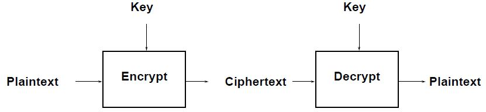
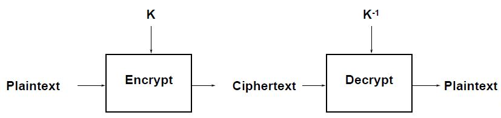

**Computer Networks - Lecture 21 & 22**

- Author: Ruben Schenk
- Date: 15.06.2021
- Contact: ruben.schenk@inf.ethz.ch

## 6.5 LAN Switching

Modern Ethernet is based on the usage of switches rather than multiple access, i.e., hosts are connected with to switch ports. We distinguish three types of devices:

- `Hub/Repeater`: Only at the physical layer, strengthens the signal.
- `Switch`: At the link layer, looks where to forward the packet.
- `Router`: At the network layer.

### 6.5.1 Inside a Switch

A `switch`:

- uses frame addresses to connect input port to the right output port. It allows fro multiple frames to be switched in parallel.
- ports are full-duplex, allowing for both input and output. There is no multiple access control.
- in case there is contention, there are both input and output buffers. On overload, frames are lost.

Switches and hubs have replaced shared cable of classic Ethernet, since they provide a better reliability and scalable performance.

### 6.5.2 Switch Forwarding

A switch needs to find the right output port for the destination address in the Ethernet frame.

#### Backward Learning

Switches use a port/table to forward frames and they generate the table as follows:

1. To fill the table, it looks at the source address of the input frames.
2. To forward, it sends it to the port, or else broadcasts it to all ports.

This method works as long as there are no loops in the system.

#### Switch Spanning Tree

One solution to loops in the network are spanning trees.  
Switches collectively find a `spanning tree` for the topology and then only forward to along the tree. When a frame is *broadcasted*, it goes all the way up to the root and then all the way down to all the branches.

**Spanning Tree Algorithm**

1. Elect a root node of the tree (the switch with the lowest address)
2. Grow tree as shortest distances from the root (using the lowest address to break distance ties)
3. Turn off ports for forwarding if they are not on the spanning tree

# 7. Physical Layer

The `physical layer` concerns how signals are used to transfer message bits over a link. We want to send digital signals but the medium we use uses analog signals.

## 7.1 Properties of Media

### 7.1.1 Link Model

WE abstract the physical model as follows: We consider the `rate` (or bandwidth) in bits/second and the `delay` or `latency` in seconds as the key properties of such a physical channel.

#### Message Latency

The `message latency` $L$ consists of two parts:

- `Transmission delay` $T$: The time used to put a $M$ bit message on the wire:
  
  $$
    T = \frac{M \, [\text{bits}]}{Rate \, [\text{bits/sec}]} = \frac{M}{R} \, [\text{sec}]
  $$
- `Propagation delay` $P$: The time used for the bits to propagate across the wire:
  
  $$
    P = \frac{length}{speed \, of \, signals} = \frac{length}{\frac{2}{3}c} = D \, [\text{sec}]
  $$

This yields a total latency or delay of $L = \frac{M}{R} + D$. For rates we use powers of $10$, for storage/data sizes we use powers of $2$.

#### Bandwidth-Delay Product

The amount of data in flight is the `bandwidth.delay product`, given by $BD = R \cdot D$, and is measured in either bits or messages.

### 7.1.2 Types of Media

We introduce the following different types of media:

- *Wires - Twisted Pair*: Used in LANs and telephone lines. Twists reduce radiated signals and effects of external interference.
- *Wires - Coaxial Cable*: A copper core shielded by insulating material, braided outer conductor and protective plastic covering. Provides a better performance due to better shielding.
- *Fiber*: Long, thin, pure strands of glass allow for enormous bandwidths over long distances. Works by having a light source at one end and a photo-detector on the other end. Transmits at around $\frac{2}{3}c$.
- *Wireless*: Sender radiates signal over and entire region into all directions. This potentially leads to interference.

## 7.2 Simple Signal Propagation

Analog signals are used to encode digital bits. A signal over time can be represented by its frequency components (called *Fourier analysis*). As signals `propagate over a wire`, the following happens:

1. The signal is delayed (since it propagates at $\frac{2c}{3}$)
2. The signal is attenuated
3. Frequencies above a cutoff are highly attenuated
4. Noise is added to the signal

When a signal, however, is `propagated over fiber`, the light propagates with very low loss in three very wide frequency bands (furthermore, at these frequencies the attenuation is very low).

Signals that are sent over `wireless` travel at the speed of light, spread out and attenuate at a fast rate. Multiple signals on the same frequency

## 7.3 Modulation Schemes

We need signals to represent bits. One way to do this is the `Non-Return to Zero (NRZ)` scheme. In this scheme, high voltage ($+V$) represents a $1$, low voltage ($-V$) represents a $0$.

This simple scheme uses only 2 levels, if we were to increase it to 4 levels, it could support 2 bits per symbol.

### 7.3.1 Clock Recovery

The receiver needs frequent signal transitions to decode bits. It needs to know how many $0$'s in a row were transmitted. This can be hard for very long sequences of $0$'s.

For that reason, the `4B/5B Clock Recovery` maps every 4 data bits into 5 code bits while eliminating long runs of $0$'s. This is done with an encoding table, and each string that is mapped to has at most 3 zeros in a row.  
Another approach is to invert signal on a $1$ to break long runs of $1$'s, which is called `NRZI`.

### 7.3.2 Passband Modulation

We have so far only seen `baseband modulation` for wires, which can be applied when a signal is sent directly on a wire.  
However, these signals do not propagate well on fiber or on wireless, so we need to send at higher frequencies. This is exactly what `passband modulation` does: It carries a signal by modulating a carrier (a signal oscillated at a desired frequency). This modulation happens by changing *amplitude, frequency*, and *phase*.

## 7.4 Fundamental Limits

Key properties of a channel include bandwidth $B$, signal strength $S$, and noise strength $N$. It holds that:

- The rate of transitions is limited by $B$
- The number of signal levels that can be distinguished is limited by $S$ and $N$.

### 7.4.1 Nyquist Limit

The maximum symbol rate is $2B$ (on alternating $1$s and $0$s). Thus, if there are $V$ signal levels, ignoring noise, the maximum bit rate is:

$$
R = 2B \log_2 B \, [\text{bits / sec}]
$$

### 7.4.2 Shannon Capacity

How many levels that can be distinguished depends on the `signal-to-noise ration` (or $S/N$). `SNR` is given on a log-scale in deciBEls according to:

$$
\text{SNR}_{\text{dB}} = 10 \log_{10}(S / N)
$$

The `Shannon limit` for a capacity $C$ is the maximum information carrying rate of the channel and is given by:

$$
C = B \log_2 \Big (1 + \frac{S}{N} \Big ) \, [\text{bits / sec}]
$$

### 7.4.3 Digital Subscriber Line (DSL)

`DSL` reuses a twisted pair telephone line to the home. Since only the lowest $4 \text{ kHz}$ of approximately $2 \text{ MHz}$ of bandwidth are used by the telephone service, the rest can be used for different purposes.

DSL uses passband modulation which creates separate bands for up- and downstream with different bandwidth sizes. The modulation varies both amplitude and phase. On high SNR, there are up to 15 bits per symbol, where as on low SNR, there is only 1 bit per symbol, so the connection is slower.

# 8. Routing Security

## 8.1 Basic Security Properties

### 8.1.1 Terminology

We define the following meanings for the 4 key terms:

- `Secrecy`: Keep data hidden from unintended receivers.
- `Confidentiality`: Keep someone else's data secret.
- `Privacy`: Keep data about a person secret.
- `Anonymity`: Keep the identity of a protocol participant secret.

Furthermore, we want to distinguish the following terms:

- `Data Integrity`: Ensure that data is *correct* and prevent unauthorized or improper changes.
- `Entity Authentication/Identification`: Verifies the identity of another protocol participant.
- `Data Authentication`: Ensures that data originates from a claimed sender.

## 8.2 Basic Cryptographic Mechanisms

### 8.2.1 Symmetric Encryption Primitives

In this protocol, the following holds:

- Encryption key $E_K$ = decryption key $D_K$
- *Encryption*: $E_K$(plaintext) = ciphertext
- *Decryption*: $D_K$(ciphertext) = plaintext

We write $\{\text{plaintext} \}_K$ for $E_K$(plaintext).

 

### 8.2.2 Asymmetric Encryption Primitives

In this protocol, the following holds:

- Encryption key $K$ is publicly know: `public key`
- Decryption key $K^{-1}$ is secret: `private key`
- *Encryption*: $E_K$(plaintext) = ciphertext
- *Decryption*: $D_{K^{-1}}$(ciphertext) = plaintext

We write $\{\text{plaintext} \}_K$ for $E_K$(plaintext).

 

### 8.2.3 Symmetric vs Asymmetric Encryption

We make the following observations:

- *Symmetric Encryption*
  - Need shared secret key
  - 100'000'000 ops/s

- *Asymmetric Encryption*
  - Need authentic public key
  - 1000 signatures/s or 10'000 verify/s

## 8.3 Security For Routing Protocols

### 8.3.1 Intra-Domain Routing

To perform an attack on link-state protocols, one only needs to compromise *one* router or one routing adjacency since link-state protocols rely on flooding.

In both cases, the attacker obtains a complete network view and the ability to inject messages network-wide.

The solution is quite simple: One simply needs to rely on cryptography. We only need to send authenticated announcements and cryptographically protect topology information.

### 8.3.2 Inter-Domain Routing

We look at the lack of security of `BGP`, the problems that follow from this and their solutions.

#### BGP does not validate the origin of advertisements

Regional Internet Registries assign IP address blocks. However, the origination of a prefix into BGP must be proper, i.e., by the AS who owns the prefix.

This is, however, not checked by BGP. So what's to stop someone else, i.e. another AS, from originating the prefix? This process is known as `Prefix Hijacking`.
