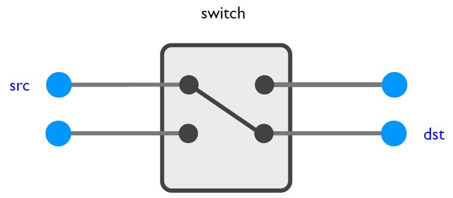
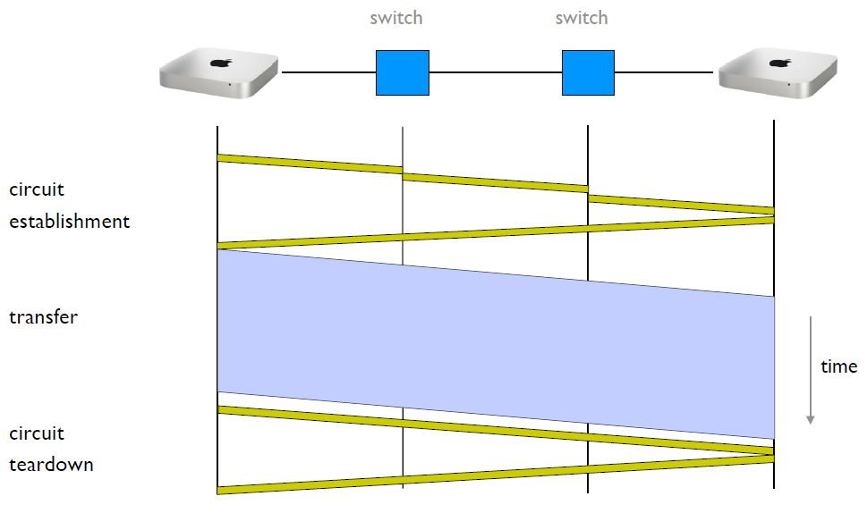
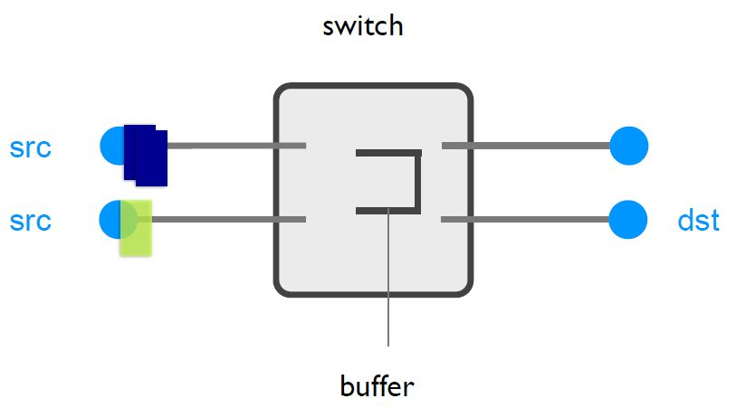

**Computer Networks - Lecture 1 & 2**

- Author: Ruben Schenk
- Date: 01.06.2021
- Contact: ruben.schenk@inf.ethz.ch

## Course Structure

### Module 1

- Part 1: Overview & Principles
- Part 2: Applications
- Part 3: Transport
- Part 4: Algorithms

# 1. Overview & Principles

## 1.1 What is a network made of?

A `network` consists of three basic components:

- `End systems`: Send an receive data, such as computers, smartphones, etc.
- `Switches / Routers`: Forward data to the desired destination.
- `Links`:  Connect the routers and switches and end systems.

A `Digital Subscriber Line (DSL)` brings high bandwidth to households over *phone lines*. Another common access type is using `Cable Access Technologies (CATV)`, where a cable provider is connected via a fiber cable to some distribution center and from there via copper cable to different households. The fiber cable is shared between many different households.

## 1.2 How is a network shared?

An `Internet Service Provider (ISP)` such as Swisscom benefits from sharing by `statistical multiplexing`. They might have a 100 mbps line on which they make subscriptions of 5 mbps. Knowing that it is very unlikely that every user is active at the same time, they send out more contracts that theoretically supported (that is, more than 20 contracts in our example). An `oversubscription` of x100 is generally accepted.

### 1.2.1 Resource Sharing

We differ between two types of resource sharing:

- `Reservation`: Reserve the bandwidth you need in advance, happens at the flow-level. Implemented by `circuit-switching`.
- `On-demand`: Send data whenever you need, happens at the packet-level. Implemented by `packet-switching`.

For each network flow we define $P$ has the peak flow rate and $A$ as the average flow rate. The problem with *reservation* is that we must reserve a flow of $P$, however the level of utilization is only $\frac{A}{P}$. We therefore put the general rule:

- *Reservation makes sense* if $\frac{P}{A}$ is small.
- *Reservation wastes capacity* if $\frac{P}{A}$ is big.

#### 12.2.1 Circuit Switching

`Circuit switching` relies on the `Resource Reservation Protocol`. The source end system "asks" along the circuit to the desired destination each switch whether or not it can provide the desired speed. If each switch agrees, the circuit is established. Inside each switch, the circuit is "reserved" according to the following figure:

 

There exist many kinds of circuits, we introduce the following two types:

- `Time-based multiplexing`: We divide the whole frequency of a link into different time slots and allocate one slot per circuit.
- `Frequency-based multiplexing`: We divide the frequency of our link into different frequency bands and allocate one or more bands per circuit.

We might combine the two types mentioned above together.

Example: The figure below shows an example of data transfer using circuit switching:

 

Problems with circuit switching:

- The circuit is `mostly idle` when we're only sending traffic bursts.
- If we shorten the transfer time, a lot of time is wasted during circuit establishment and teardown.
- We require a new circuit setup upon a failure of a switch in the circuit.

Pros with circuit switching:

- We have predictable performance.
- Once established, we have a simple and fast mechanism to send data.

#### 12.2.2 Packet Switching

Data transfer is done using independent `packets`. Each packet contains a destination. At each switch, the packet is forwarded according ot its destination, as seen in the following figure.

 

To absorb transient overload, each switch needs a buffer.

Pros of packet switching:

- Packet switching `routes around trouble`.
- Efficiently uses resources.

Problems with packet switching:

- Unpredictable performance.
- Requires buffer management and congestion control.

> The internet uses **packet switching** and we will focus on this for the rest of the course.

## 1.3 How does communication in a network happen?

Assume there are two people, Alice and Bob, which wish to exchange some data over the internet. To exchange data, the use a set of `network protocols`. A protocol is like a *conversational convention*.

### 1.3.1 Network Layer Model

To provide structure to the design of network protocols, internet communication can be decomposed into 5 independent `layer`:

- L5 - Application layer: Provides network access, exchanges `messages` between processes. Protocol: HTTP, SMTP, FTP, etc.
- L4 - Transport layer: Provides end-to-end delivery, transports `segments` between end systems. Protocol: TCP, UDP, etc.
- L3 - Network layer: Provides a global best-effort delivery, moves `packets` around the network. Protocol: IP.
- L2 - Link layer: Provides local best-effort delivery, moves `frames` across a link. Protocol: Ethernet, Wifi, DSL, LTE, etc.
- L1 - Physical layer: Provides physical transfer of bits, moves `bits` around a physical medium. Protocol: TWister pair, fiber, coaxial cable, etc.

> Each layer provides *a service to the layer above* by using the *services of the layer directly below it*.

Each layer takes messages from the layer above, and `encapsulates` them with its own header and/or trailer.
