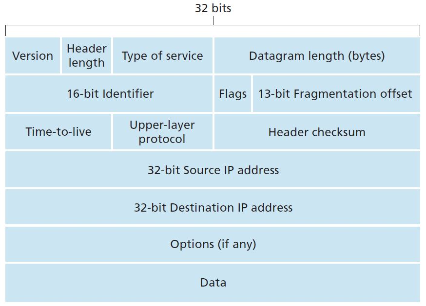
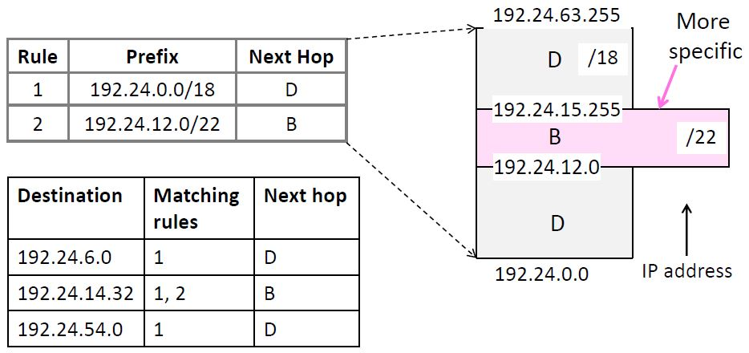
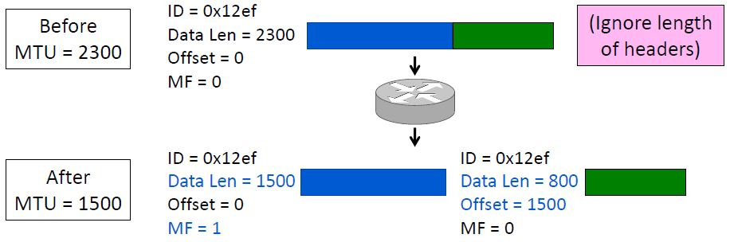
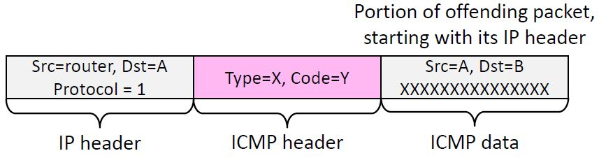
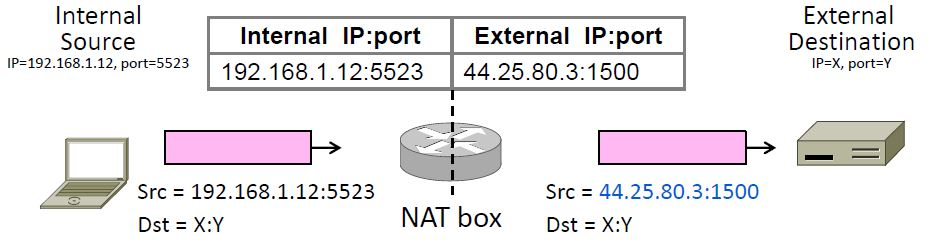
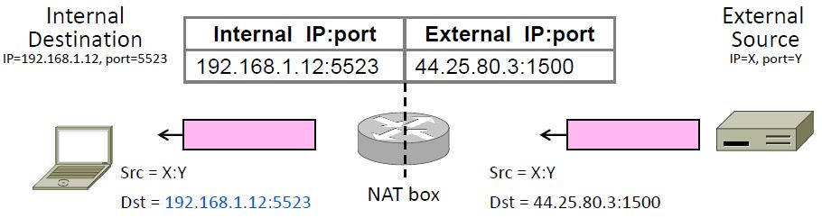
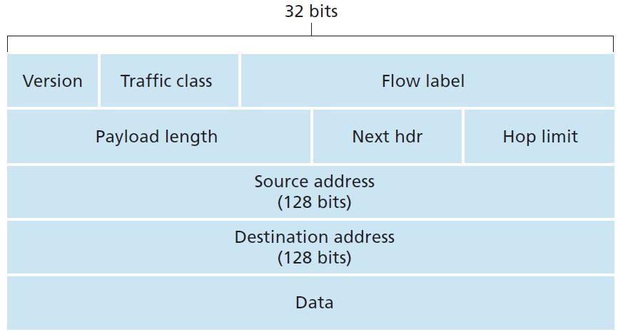

**Computer Networks - Lecture 13 & 14**

- Author: Ruben Schenk
- Date: 07.06.2021
- Contact: ruben.schenk@inf.ethz.ch

# 5. Network Layer

The `network-layer protocols` are among the most challenging in the protocol stack. The network layer can be decomposed into two interacting parts, the `data plane` and the `control plane`.

The primary role of the network layer is deceptively simple - to move packets to appropriate output links from a sending to a receiving host. For that there are two functions:

- `Forwarding`: A packet arrives at some input link of a router and needs to be moved to an appropriate link. This one of the functions of the *data plane* and happens router-locally.
- `Routing`: Network layer must determine a route a packet takes as it flow from sender to receiver. This is a network-wide operation that is very complex and expensive and is part of the *control plane*.

## 5.1 Network Service Models

The `network service model` specifies what service the network layer provides to the transport layer and how it is implemented. We distinguish a `connectionless datagram service` like IP and a `connection-oriented virtual circuits service`.

Both models are implemented with `store-and-forward packet switching`:

- Routers receive complete packets, store them temporarily (if necessary) before forwarding it. Most of the time *statistical multiplexing* is used to share the link bandwidth over time.

The switching element provides an internal buffer for each output port to handle contention.

### 5.1.1 Datagram Model

Each (IP) packet contains a destination address. This is used by the router to forward each packet individually on different paths. For this, we consult the `forwarding table` which is keyed by the address and stores the next hop for each destination address.

The datagram model uses the `internet protocol (IP)` which is based on datagrams and carries source and destination address in each packet.

### 5.1.2 Virtual Circuit Model

The virtual circuit model uses circuit switching, but in a virtual sense: there is no bandwidth reservation but rather statistical sharing of links. There are three phases in a virtual circuit:

1. *Connection establishment*: Circuit is set up, i.e., path is chosen and the circuit information is stored in the routers.
2. *Data transfer*: Circuit is used, i.e., packets are forwarded along the path.
3. *Connection teardown*: Circuit is deleted, i.e., circuit information is removed from routers.

Each packet thus only needs to carry a short label that identifies the circuit. This label, however, has no global meaning and is link specific, such that at every router it needs to be translated. The forwarding tables are keyed by the circuits identifier and returns the output port the circuit uses.

### 5.1.3 Multi-Protocol Label Switching

ISPs use the virtual circuit switching technology by setting up circuits in their backbone ahead of time. When a packet enters the network, it adds a 4 byte MPLS label to the IP packet and removes it upon leaving the network.

The advantage MPLS offers are:

- Potential increase of switching speed since the IP header is not needed.
- MPLS provides the ability to forward packets along routes that would not be possible using the standard IP routing protocols.

The following table provides a short summary over the advantages and disadvantages of both network service models:

| **Issue**          | **Datagram**                | **Virtual Circuit**        |
| :----------------- | :-------------------------- | :------------------------- |
| Setup Phase        | Not needed                  | Required                   |
| Router state       | Per destination             | Per connection             |
| Addresses          | Packet carries full address | Packet carries short label |
| Routing            | Per packet                  | Per circuit                |
| Failures           | Easier to mask              | Difficult to mask          |
| Quality of service | Difficult to add            | Easier to add              |

## 5.2 Internet Protocol - Version 4 (IPv4)

### 5.2.1 IP Datagram

Most of the fields of a IPv4 datagram are self-explanatory, the rest is explained in short here:

- *Type of Service*: Allows to distinguish between different types of datagrams, e.g., real-time (VoIP) vs non-real time (FTP)
- *Datagram length*: Total length of datagram in bytes, at max $2^{16}$ bytes, but normally not larger than 1500 to fit into an Ethernet frame.
- *Fragmentation offset and flags*: Used for IP fragmentation.
- *Protocol*: Specifies the transport layer protocol (TCP or UDP).
- *Options* Allows the IP header to be extended but leads to processing overhead (not included in IPv6 anymore).

 

### 5.2.2 IP Addresses and Prefixes

> An `IPv4 address` is a 32-bit number written in *dotted-quad* notation `a.b.c.d` where $a, \, b, \, c,$ and $d$ are 8-bit numbers.

IP addresses are allocated in `prefixes`. Addresses in an $L$-bit prefix have the same top $L$ bits. Thus, there are $2^{32-L}$ addresses in an $L$-bit. IP prefixes are written in IP address notation, e.g., `128.13.0.0/16` denotes the first address in the prefix ($L = 16$ in this case).

We say a prefix is *more specific* if it is longer, and hence has a smaller number of IP addresses. A *less specific* prefix has a shorter prefix and hence a larger number of IP addresses.

The first and last address of a prefix are typically not used since they have a special function:

- *Network Identifier*: First address in a prefix, e.g., `128.13.0.0` for `128.13.0.0/16`.
- *Broadcast Address*: Last address in a prefix, e.g., `128.13.255.255` for `128.13.0.0/16`.

Prefixes are also specified by using a `network mask`. Performing a logical AND on the two produces the prefix (i.e. the network identifier). Example: `255.255.255.0` is the network mask for a 24-bit prefix.

### 5.2.3 IP Forwarding

Each router uses a forwarding table that lists the next-hop address for *IP prefixes*. Note that this may lead to overlapping prefixes in the table, i.e., an entry might list a more specific prefix than another entry. This leads to the following rule:

> The `Longest Prefix Matching` forwarding rule is described as follows: For each packet, find the longest (most specific) prefix that contains the destination address and forward the packet to the next-hop router for that prefix.

 

#### Host Forwarding

Since routers do all the routing, hosts have to send remote traffic to the nearest router. For that, they use a small forwarding table, consisting only of two entries: Note that `0.0.0.0/0` represents a `default route`. Any other prefix is more specific and is thus captured first by the longest prefix matching rule.

| **Prefix**            | **Next-Hop Destination** |
| :-------------------- | :----------------------- |
| My own network prefix | Directly send to that IP |
| `0.0.0.0/0`           | Send to router           |

### 5.2.4 IP Helper Protocols

In order for IP forwarding to work, we still need to fill in some gaps, namely how, e.g., hosts get their IP addresses and how IP is mapped to link addresses.

#### Getting IP Addresses - Dynamic Host Configuration Protocol (DHCP)

When a node wakes up for the first time it doesn't know its IP address, the network prefix or the IP of the default router and the address of the DNS resolver. We use `DHCP` to automatically configure those addresses.

DHCP leases IP addresses to nodes and provides other important parameters, such as the network prefix, the `default gateway (local router address)` and various servers (DNS, time, etc.). DHCP is a client-server application that uses UDP ports 67 and 68 and can therefore snoop on these ports for messages. DHCP works as follows:

1. The client sends a $\text{DISCOVER}$ broadcast message with the address bits all being $1$, i.e. the IP address `255.255.255.255` and `ff:ff:ff:ff:ff:ff` for Ethernet/MAC address.
2. The server answers with an $\text{OFFER}$ message, offering a few IP addresses as well as other options.
3. The client chooses one of the offers and requests with a $\text{REQUEST}$ message.
4. The server responds with an $\text{ACK}$ such that the client can use the configuration.

Renewing an existing lease is as easy as sending a $\text{REQUEST}$ message and getting back an $\text{ACK}$.

#### Address Resolution Protocol - ARP

We consider the following problem: A node needs the link layer address to send a frame over a local link, but how does it get the destination link address from the destination IP address?

An ARP module is a sending host that takes any IP address *on the same LAN* as input, and returns the corresponding MAC address, meaning that it only resolves IP addresses for hosts and router interfaces that are on the same subnet. This works as follows:

1. The node sends a $\text{REQUEST}$ broadcast message with an IP address.
2. The target that uses this IP address replies with its MAC address.

### 5.2.5 Packet Fragmentation and MTU

When connecting networks with different maximum packet sized we need to split up packets, or discover the largest size we can use.  
We can thus either use `fragmentation` to split up large packets or use `discovery` to find the largest packet size that fits on the network path.

#### IPv4 Fragmentation

Routers fragment packets that are too large and the receiving host reassembles to reduce the load on routers. For that, there are multiple fields in the IP header (identification, flags, fragment offset, fragment length, etc.). The splitting procedure works as follows:

1. Break the data that is contained into pieces.
2. Copy the IP header into the previously split pieces and adjust the length.
3. Set the offset to indicate the position and set the MF flag on all pieces except for the last.

 

#### Path MTU Discovery

IP uses `path MTU discovery` today. The host tests the path with a large packet and the routers provide feedback. If the packet is too large, the router tells the host what size would fit. This is implemented in ICMP with the DF flag, such that ICMP can provide the necessary feedback messages and error messages in general, e.e., when something goes wrong during forwarding.

### 5.2.6 Internet Control Message Protocol (ICMP)

ICMP is a companion protocol to IP, they are implemented together and ICMP sits on to of IP.  
IF the router encounters some error while forwarding, the ICMP sends back a report to the IP source address and discards the problematic packet.

#### ICMP Message Format

A ICMP message is carried in an IP packet and has a type, code, and a checksum. As a payload it often carries the start of the offending packet:

 

## 5.3 Network Address Translation (NAT)

The layering principle means that routers should not look beyond the IP header, e.g., the TCP segment is not looked at. However, in modern networks there are many `middleboxes` that sit inside the network but perform processing beyond what IP does on packets to add new functionality. Examples are NAT boxes, Firewalls or Intrusion Detection Systems.

### 5.3.1 NAT box

A `NAT box` connects an internal network to an external network. That way, many internal hosts can be connected to the external network using a single external IP address. This way, the home network looks like a single computer.

### 5.3.2 How NAT works

The NAT box keeps a table where it stores a mapping between internal and external (address, port) tuples.

| **Internal IP : Port** | **External IP : Port** |
| :--------------------: | :--------------------: |
| `192.168.1.12:5523`    | `44.25.80.3:1500`      |
| `192.168.1.13:1234`    | `44.25.80.3:1501`      |
| `192.168.2.20:1234`    | `44.25.80.3:1502`      |

The mapping is created as the first packet from the client into the external network is being sent, i.e., when a new TCP connection is opened. If connections go to different destinations, it is possible to use the same port numbers, since returning packets will also contain the destinations IP address and thus make it able to distinguish the connection using the same port.

#### Sending a Packet

 

#### Receiving a Packet

 

## 5.4 IPv6

 

Some important changes in the header are:

- *Streamlined header processing*: No option fields mean fixed size of 40 bytes in the header, which allows for faster processing.
- *Flow labelling*: Allows for grouping of packets that belong to the same floe, e.g. packets in a video stream or for a high-priority user.
- *Traffic class*: Allows to give priority to certain datagrams within a flow from certain applications.
