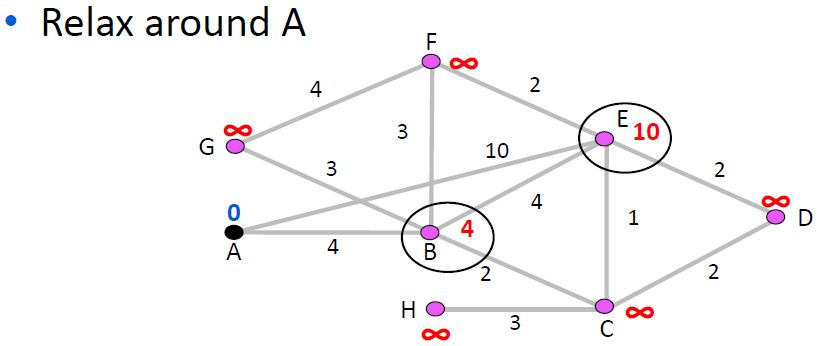

**Computer Networks - Lecture 15 & 16**

- Author: Ruben Schenk
- Date: 08.06.2021
- Contact: ruben.schenk@inf.ethz.ch

### 5.4.1 IPv6 Addresses

Since the IPv4 address space is running out and there is still room for different improvements there is IPv6, which features 128-bit addresses, which are denoted in 8 groups of 4 hexadecimal digits. Leading zeros are omitted and groups of zeros can be replaced by a second colon.

Example: `2001:0db8:0000:0000:0000:ff00:0042:8329` may be written as `2001:db8::ff0:42:8329`. Remember that we may only remove *one* groupe of consecutive zeros, e.g., `2001:0db8:0000:0000:1a12:0000:0000:1a13` may either be written as `2001:db8::1a12:0:0:1a13` or as `2001:db8:0:0:1a12::1a13`.

### 5.4.2 Tunneling

The goal of `IPv6 tunneling` is to allow IPv6 communication over IPv4. We want a *tunnel* to act as a single link across an IPv4 network. We encapsulate an IPv6 packet as payload into an IPv4 packet. The IPv6 is extracted as soo as it reaches an IPv6 link.

## 5.5 Routing

The goal for any `routing algorithm`, no matter which routing scheme it uses, is that it should obey the following properties:

- *Correctness*: Finds paths that work
- *Efficient paths*: The given path should be minimal for some metric
- *Fair paths*: The path doesn't starve any nodes
- *Fast convergence*: The path recovers quickly after changes
- *Scalability*: Works well as the network grows large

### 5.5.1 Shortest Path Routing (Dijkstra Algorithm)

To find a `shortest path` we do the following steps:

1. Assign each link a *cost* (distance).
2. Define the best path between each pair of nodes as the path that has the lowest total cost.
3. Pick randomly to break any ties.

One property when choosing the shortest path as described above, is that *sub-paths of shortest paths are also shortest paths*.

We furthermore define a `sink tree` of some node as the union of all shortest paths (i.e. the shortest path from each node) to the destination node.

The following figures show an example of how to use `Dijkstra's Algorithm`:

 
 
 
 

(*Some intermediate steps are left out*)

 

### 5.5.2 Hierarchical Routing

There are several key impacts of routing growth, listed below:

- Forwarding tables grow
- Routing messages grow
- Routing computation grows

Some techniques to scale routing are:

1. IP prefixes (route to block of hosts, not individual hosts)
    - We group hosts under an IP prefix and connect them directly to the router, this way there is only one entry needed for all hosts.
2. Network hierarchy (route to network regions)
    - The idea is to introduce a larger routing unit. We then route first to the region, then to the IP prefix within the region.
3. IP prefix aggregation (combine and split prefixes)
