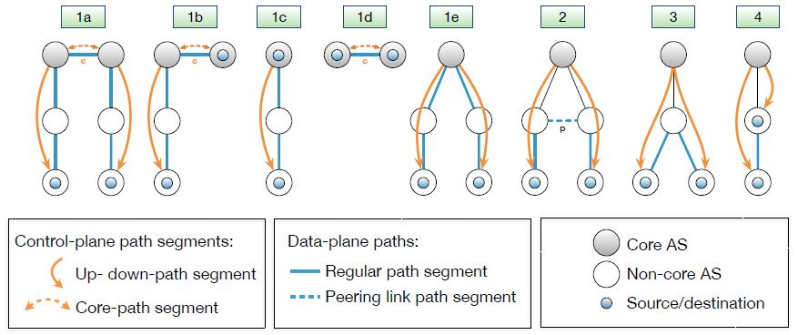

**Computer Networks - Lecture 23 & 24**

- Author: Ruben Schenk
- Date: 17.06.2021
- Contact: ruben.schenk@inf.ethz.ch

#### BGP Does not validate the content of advertisements

We might get `bogus AS paths` by removing a part of an AS path, for example turning '701 3715 88' into '701 88'. This way we can for example avoid AS 3715 or help AS 88 look like it is closer to the Internet's core.

We might also add ASes to the path, e.g. turning '701 88' into '701 3715 88'. This way we can trigger loop detection in AS 3715 or making our AS look like it has richer connectivity.

#### Proposed enhancements

We could develop a `secure BGP`, with *origin authentication* and *cryptographic signatures*. `BGPsec` adds the following:

- *Address attestations*: Claims the right to originate a prefix, is signed and distributed out-of-band, and is checked through delegation chain from ICANN.
- *Route attestations*: Distributed as an attribute in BGP update messages, and signed by each AS as route traverses the network.
- *Resource Public-Key Infrastructure (RPKI)*: Per-prefix certificate issued by Regional Internet Registries (RIR), and used to authenticate the first AS hop through Route Origin Authorization (ROA).

# 9. SCION - A Secure Multipath Interdomain Routing Architecture

## 9.1 SCION Principles

`SCION` is based on the following principles:

- Stateless packet forwarding
- Instant convergence routing
- Path-aware networking
- Multi-path communication
- High security through design and formal verification
- Sovereignty and transparency for trust roots

## 9.2 SCION Overview

### 9.2.1 Control Plane: How to find end-to-end paths?

One first approach to scalability is `Isolation Domains (ISDs)`:

- Isolation Domains (ISDs) are grouped ASes
- There is an `ISD core`, which are the ASes that manage the ISD
- A `core AS` is an AS that is part of the ISD core
- Each ISD defines their `TRC (Trust Root Configuration)`, which contains the root cryptographic keys to verify ISD operations

#### Path Exploration

`Beaconing` describes one way of intra-ISD path exploration:

- Core ASes initiate `Path-segment Construction Beacons (PCBs)`, also called *beacons*
- PCBs traverse the ISD as a flood to reach downstream ASes
- Each AS receives multiple PCBs representing path segments to a core AS

A `PCB` contains an info field with the PCB creation time. Each AS on the path adds to this:

- Its AS name
- A hop field for data-plane forwarding including:
  - Link identifiers
  - Expiration time
  - Message Authentication Code
- An AS signature

PCBs contain `path segments` that can be used as communication paths to communicate with the core AS that initiated it. We differ between:

- `Up-path segments`: PCB is used from AS to core AS
- `Down-path segments`: PCB is used from core AS to AS

#### Path Registration

`Up-path segment registration` works the following way:

- AS selects path segments to announce as *up-path segments* for local hosts
- Up-path segments are registered at local path servers

`Down-path segment registration` works as follows:

- AS selects path segments to announce as down-path segments for others to use to communicate with AS
- Down-path segments are uploaded to core path server in the core AS

### 9.2.2 Data Plane: How to send packets?

#### Path lookup

The following steps are performed by a host to `obtain path segments (path lookup)`:

1. The host $H$ contacts RAINS server with a name it wants to look up:
   1. $H \to RAINS : \text{www.scion-architecture.net}$
   2. $RAINS \to H : \text{ISD X, AS Y, local address Z}$
2. Host contacts local path server to query path segments
   1. $H \to PS : \text{ISD X, AS Y}$
   2. $PS \to H : \text{up-path, core-path, down-path segments}$
3. Host combines path segments to obtain an end-to-end path

#### Path combination

The following path combinations are possible in SCION:

 

#### SCION Packet Header

The  `SCION common header` encodes the following attributes:

- Version
- Destination and Source address types
- Total packet and header length
- Pointer to current info and hop fields
- Next header type field
