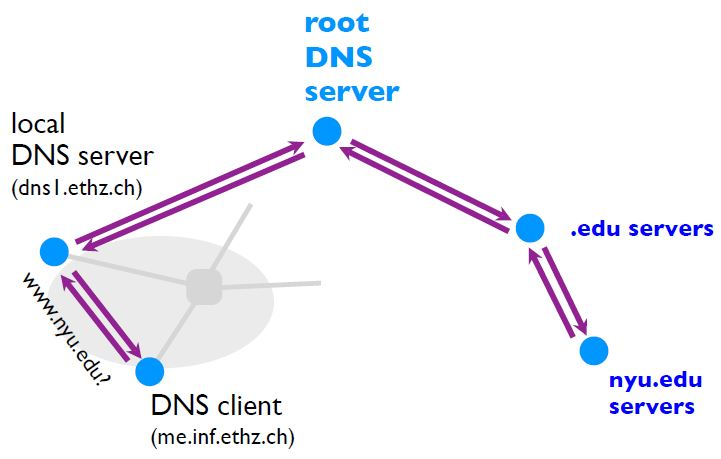
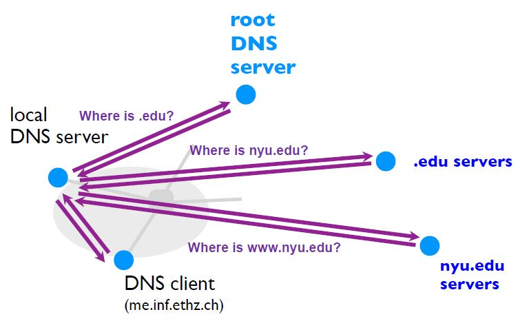

**Computer Networks - Lecture 3&4**

- Author: Ruben Schenk
- Date: 01.06.2021
- Contact: ruben.schenk@inf.ethz.ch

### 1.3.2 The End-End Principle

If no reliable transport is provided, every application that needs reliability has to engineer it from scratch, which is a wasteful effort. However it also wouldn't make sense for the network layer to provide reliable delivery, since it is a burden for applications that rely on speed and not on reliability.

The solution to this problem is the `end-end principle`. We allow unreliable steps (e.g., the network layer is best effort), but the destination end system checks the received data and tells the source end system to retry on failure.

## 1.4 How do we characterize communication and its performance?

A network connection is characterized by its `delay`, `loss rate`, and `throughput`.

### 1.4.1 Sources of Network Delays

Each packet suffers from several types of delays at each node along the path:

- Transmission delay
- Propagation delay
- Processing delay (tends to be very small)
- Queuing delay

Those add up to the `total delay`.

> The `transmission delay` is the amount of time required to push all bits onto the link:
>
>$$
>   \text{Transmission Delay [sec]} = \frac{\text{packet size [\# bits]}}{\text{link bandwidth [\# bits/sec]}}
>$$

> The `propagation delay` is the amount of time required for a bit to travel to the end of the link:
>
> $$
>   \text{Propagation Delay [sec]} = \frac{\text{link length [m]}}{\text{propagation speed [m/sec]}}
> $$

> The `queuing delay` is the amount of time a packet waits in a buffer to be transmitted on a link. It is the hardest to evaluate and is characterized with statistical measures.

We introduce the following notations and terms:

- Average packet arrival rate: $a \text{ [packet/sec]}$
- Transmission rate of outgoing link: $R \text{ [bit/sec]}$
- Fixed packet length: $L \text{ [bit]}$
- Average bits arrival rate: $La \text{ [bit/sec]}$
- `Traffic intensity`: $\frac{La}{R}$

When the traffic intensity is $> 1$, the queue will increase without bound, and so does the queuing delay.

In practice, queues are not infinite. There is therefore an *upper bound on the queuing delay* which is given by $\frac{NL}{R}$, where $N$ is the number of packets the queue can fit at once.

> The `throughput` is the rate at which a host receives data:
>
> $$
>   \text{Average Throughput [\# bits/sec]} = \frac{\text{data size [\# bits]}}{\text{transfer time [sec]}}
> $$

To compute the throughput, one has to consider the `bottleneck link`. The throughput will be equal to the the transmission rate of the slowest link.

# 2. Application Layer

## 2.1 Domain Name Service (DNS) - How do we name and discover services?

The Internet has one global system for *addressing hosts* (IP) and *naming hosts* (domain names), called the `Domain Name Service (DNS)`. DNS provides a mapping between domain names and IP addresses.

We might map names to more than one IP for `load-balancing` or vice-versa, map an IP to more than one name to `reuse infrastructure`.

### 2.1.1 Naming Structure

Web addresses are `hierarchical`. We read the from right to left.  
At the top sits the `Top Level Domain (TLD)`, such as .com, .org, .net, .ch, etc. `Domains` such as .epfl, .ethz, .nzz, etc. are subtrees of the TLD. A `name` such as inf.ethz.ch represents a *leaf-to-root path* in the hierarchy.

### 2.1.2 Management

The DNS system is is administrated over a hierarchy of authority over names:

- Root servers are managed by the IANA.
- TLDs are managed by private or non-profit organizations (for example, .ch is managed by the *Swiss Education & Research Network*).
- Domains managed by ISPs or local organizations, such as the ETH Zürich Informatikdienste ICT-Networks for .ethz.

### 2.1.3 Infrastructure

There are 13 root servers, named from $a$ to $m$, which are managed professionally and serve as the root. Instances of the $k$-root server are hosted in more than 75 locations worldwide, two of them in Switzerland (Zurich and Geneva).

To `scale` root servers, operators rely on `BGP anycast` (Internet's routing protocol). This enables seamless replication of resources by finding the shortest-paths. If several locations announce the same prefix, then routing will deliver the packets to the "closest" location.

To ensure `availability`, each domain must have at least a primary and secondary DNS server. This has the following advantages:

- It ensures name service availability.
- It allows DNS queries to be load-balanced.
- On a timeout, clients can use an alternate server.

In order for DNS lookups to work, we have to ensure that:

- Each nameserver knows the address of the root server.
- Each root server knows the address of all TLD server.
- Each TLD server knows the address of all its domains.

### 2.1.4 Resource Records

The DNS server stores resource records that are tuples of the form $(name, \, value, \, type, \, TTL)$. We show the different types of records in the following table:

| **Record Type** | **Name**   | **Value**              |
| :-------------- | :--------- | :--------------------- |
| A               | hostname   | IP address             |
| NS              | domain     | DNS server name        |
| MX              | domain     | Mail server name       |
| CNAME           | alias      | Canonical name         |
| PTR             | IP address | Corresponding hostname |

### 2.1.5 DNS Resolution

`DNS resolution` can either be *recursive* or *iterative*:

#### Recursive

The client offloads the task of resolving to the next server. This is never (exclusively) used in practice, root servers to actually not allows recursive queries on them.

 

#### Iterative

The DNS client sends a query to the local DNS server. The local DNS server then handles the rest, but each sever it queries returns the information it has directly back to the local DNS server.

 

### 2.1.5 Caching

TO reduce resolution times, DNS relies on `caching`. DNS server cache responses to former queries. Authoritative servers associate a lifetime to each record, the so called `Time-To-Live (TTL)`. The DNS records can only be cached for TTL seconds, after which they must be cleared.
