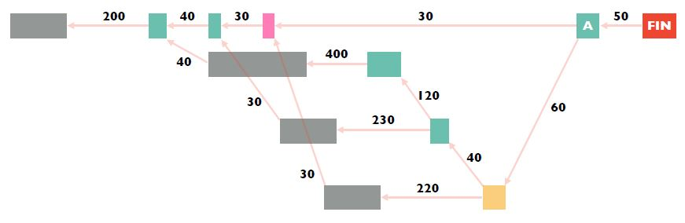

**Computer Networks - Lecture 5 & 6**

- Author: Ruben Schenk
- Date: 01.06.2021
- Contact: ruben.schenk@inf.ethz.ch

## 2.2 The Web - How do you see weather.com?

THe WWW as we know it consists of three major components:

- *Infrastructure*: Client/Browser, servers, proxies, etc.
- *Content*: Objects, such as files, pictures, videos, etc, organized in websites, which is a collection of objects.
- Implementation: URL, HTTP, etc.

### 2.2.1 URL

A `Uniform Resource Locator (URL)` refers to an Internet resource and is of the form:

```http
    protocol:://hostname[:port]/directory_path/resource
```

The URL consists of the following components:

- `protocol`: HTTP(S), FTP, SMTP, etc.
- `hostname`: DNS name or IP address.
- `port`: Defaults most often to protocols standard (HTTP:80 and HTTPS:443).
- `directory_path/resource`: Identify the resource at the destination.

### 2.2.2 HTTP

The `Hypertext Transfer Protocol (HTTP)` is a rather simple *synchronous request-response protocol*. It is layered over a bidirectional byte stream (almost always TCP), text-based (ASCII) and stateless, which means it maintains no information about past client requests.

HTTP sends two kinds of messages:

#### HTTP Request Message

<br>

The request header specifies a `method` field, which can be one of the three following values:

- `GET`: Requests the server to return a resource.
- `HEAD`: Same as the GET method nut only asks for the header of the resource.
- `POST`: Requests that the server accepts provided data.

The request `header fields` are of variable lengths, but still human readable. They can hold the following information:

- Authorization info.
- Acceptable document types/encodings.
- Senders.
- If-Modified-Since.
- User Agent, i.e., client software
- etc.

#### HTT Answer Message

<br>

The response message holds a 3-digit `status` fields which can be one of the following values:

| **3-digit response code** | **status**    |
| :-----------------------: | :------------ |
| $1XX$                     | informational |
| $2XX$                     | success       |
| $3XX$                     | redirection   |
| $4XX$                     | client error  |
| $5XX$                     | server error  |

For example, the error codes $404$ and $505$ correspond to the reason phrase *Not Found* and $200$ corresponds to *OK*.

Answer messages might include the following additional header fields:

- Location
- Content encoding
- Content length
- Content type
- Last-Modified
- etc.

### 2.2.3 Cookies

HTTP is stateless, however, some applications (like E-Commerce) need or want some kind of information about the previous requests from the same client. That is what `cookies` are used for. They store a state of the client on behalf of the server.

### 2.2.4 Speeding up the Web

Webpages today have very complex dependencies between different files such as html files, css files, JS files etc.

We can estimate the `load time` of a webpage by modelling the above mentioned dependencies as a DAG. Nodes are tasks (such as loading dependencies) and arcs indicate a "must-happen-before" dependency. The weights of the arcs represent the times it takes to complete the preceding task. Finally, we can model the load time as the `critical path (time)`:

1. Sort nodes topologically.
2. Process tasks in reverse order: Each task's finish time is the $\max$ over the tasks it depends on plus the time it takes to complete it.

Example: We might as what the longest A-start distance is:

<br>

This can be determined by $\max{(d_{\text{pink} + 30}, d_{\text{yellow}} + 60)}$ and then recursively determining the same for $d_{\text{pink}}$ and $d_{\text{yellow}}$.

There are a lot of possible ways to `speed up` Web browsing, such as:

- Simplify, restructure, and redesign Web pages.
  - USe efficient image codes.
  - Inline JSS and CSS.
- Use faster computing devices.
- Increase network bandwidth.
- Make the networks RTTs smaller.
- etc.

Two other approaches for speeding up Web browsing are:

#### Simplifying Network Protocols

A naive HTTP connection opens a TCP connection for each of $n$ objects. This requires about $2n \text{ RTTs}$. We introduce several different approaches to solve this problem:

- We might use `multiple parallel` ($M$) TCP connections, thus only needing $\frac{2n}{M}$ RTTs.
- We might use a `persistent connection` across multiple requests which leads to $n + 1$ RTTs.
- We might `pipeline requests` in an asynchronous way and pack them into batches that fit into one TCP segment. For small segments this uses only $2$ RTTs.

#### Caching

We might cache often used content at a server. HTTP allows for `conditional requests`, that is, a client conditionally requests a resource using the "if-modified-since" header in the HTTP requests.  
The server compares this against the "last modified" time of the resource and returns either *Not Modified* or *OK* with the latest version.

We may perform caching and one of the following three different locations:

- Client: Browser cache.
- Close to the client: Forward proxy or via a Content Distribution Network (CDN), managed by the ISPs.
- Close to the destination: Reverse proxy.

### 2.2.5 Replication

The idea behind `replication` is to duplicate popular content all around the globe. This has the following effects:

- Spreads the load on sever, for example, across multiple data-centers.
- Places content closer to clients.
- Helps to speed up some uncachable content.

`Akamai` is one of the largest CDNs in the world. It used a combination of `pull caching`, which is a direct result of client requests, and `push replication`, which is done when high access rates are expected. 

## 2.3 Internet Video - How does video streaming work?

The general goal for internet video is to have the best quality without experiencing load times.

### 2.3.1 End-End Workflow

We `encode` a video stream into different bitrates offering different levels of qualities and resolutions. The content is then *replicated* using a CDN. Finally, a video player will pick bitrates adaptively by estimating the connection's available bandwidth.

The video is not fetched as an entire file but rather in chunks of some short time (maybe 1 second pieces). This way the bitrate can be adapted as the available bandwidth changes.

One big problem is, that estimating the bandwidth is really hard. Available bandwidth often has large variation.
