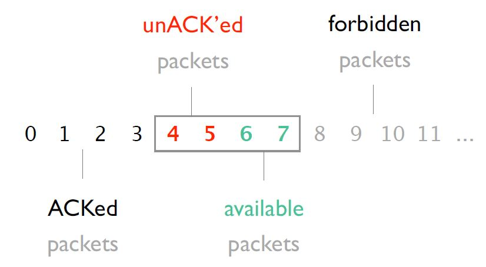
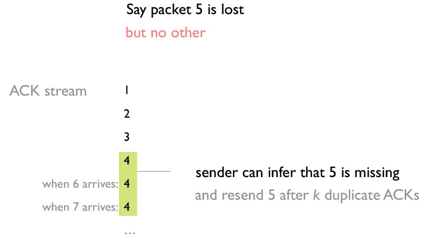

**Computer Networks - Lecture 5 & 6**

- Author: Ruben Schenk
- Date: 01.06.2021
- Contact: ruben.schenk@inf.ethz.ch

# 3. Transport Layer

## 3.1 What do we need in the transport layer? (Principles)

What do we actually need in the transport layer?

- Network should be kept minimal, i.e., easy to build, broadly applicable
- We need a global `best-effort` packet delivery service
- Applications should be restricted to app-specific functionality
- We need data delivery to the correct application, which means that the transport needs to demultiplex incoming data
- We need files or byte-streams abstractions for applications
- Reliable transfer if needed
- No overloading at the receiver and at the network

## 3.2 How do we build reliable transport? (Reliable Transport)

### 3.2.1 Principles of Reliable Transport

Since the Internet is an unreliable environment, packets may get *lost*, *corrupted*, *reordered*, or even *duplicated*.

> A `reliable transport protocol` should enable communication with the following properties:
>
>- *Correctness*: Packets should be received in the same order and without any gap
>- *Timeliness*: It should minimize the time until data is transferred.
>- *Efficiency*: It should minimize the use of bandwidth by not sending too many packets.

We might define the `correctness` of a reliable transport design the following way:

- A reliable transport design is `correct` if a packet is *always resent* if the previous packet was lost or corrupted. A packet *may be resent* at other times.

We can state the following equivalent condition:

- A reliable transport system is correct $\Leftrightarrow$ The system resends all lost or corrupted packets.

### 3.2.2 First Approach to Designing a Reliable Transport Protocol

Our first approach to designing a reliable transport protocol starts the following way:

```
Alice:

    for word in list:
        send_packet(word);
        set_timer();

        upon timer going of:
            if no ACK received:
                send_packet(word);
                reset_timer();
        
        upon receiving ACK:
            pass;

Bob:

    receive_packet(p);
    if check(p.payload) == p.checksum:
        send_ack();

        if word not delivered:
            deliver_word(word);
    else:
        pass;
```

### 3.2.3 Improvements to our Design

We might improve the above idea in the following two ways:

- We can improve *timeliness* by sending multiple packets at the same time.
  - We need to add a `sequence number` inside each packet.
  - We need to add `buffers` to the sender and receiver.
    - Sender stores packets that were sent and not yet acknowledged.
    - REceiver stores out-of-sequence packets that he received.
- We can introduce *flow control* via a `sliding window`. This ways the receiver wont be overwhelmed when we send multiple packets.
  - The sender keeps a list of sequence numbers it can send, known as the `sending window`.
  - The receiver keeps a list of acceptable sequence numbers, known as the `receiving window`.
  - The sender and receiver negotiate the window size, it must be that $\text{sending window} \leq \text{receiving window}$.

The following figure shows an example of the *senders* view with a window composed of 4 packets:

<br>

The timeliness depends on the size of the sending window. But how do we determine the "perfect" size for it? One way to answer this question is with the `bandwidth-delay-product (BDP)`:

- If Alice and Bob were connected by a link with a bandwidth of $X \text{ Mbps}$ and a RTT of $d$ seconds, then the window size should be $X \cdot d \text{ Mb}$ to maximize timeliness.

### 3.2.4 Receiver Feedback

There are three different ways me may encode feedback in ACKs:

- Individual ACKs: received 1, received 2, received3, received 5
  - Pros: We know the fate of each packet, we have a simple window algorithm, it is not sensitive to reordering.
  - Con: Loss of an ACK packet causes unnecessary retransmission.
- `Cumulative ACKs`: received up to 3
  - We trigger a resend after $k$ duplicate ACKs as seen in the figure below. However it is not exactly clear what to resend (only the missing ACK? Or everything after it too?)
- Full information ACKs: received up to 3 and received 5
  - Fixes the problem of cumulative ACKS since it makes missing packets explicit.

<br>

### 3.2.5 Fairness

`Fairness` means that when $n$ entities use the transport mechanism, the available bandwidth is allocated in a fair manner. We might use an equal-per-flow, which means we divide the available bandwidth evenly over each data stream, however this is not fair per se.  
A universally agree upon minimal goal is to avoid `starvation`, which can be reached with equal-per-flow.

One approach is the max-min fair allocation:

> The `max-min fair allocation` is such that the lowest demand is maximized, after that the second lowest is maximized, and so on.

The max-min fair allocation can easily be computed the following way:

1. Start with flow at rate 0.
2. Increase the flows until there is a new bottle neck in the network.
3. Hold the fixed rate of the flows that are bottlenecked.
4. Go to step 2 for the remaining flows.

### 3.2.6 Corruption, Reordering, Delay and Duplication

#### Corruption

Dealing with `corruption` is easy. We simply rely on a checksum and treat corrupted packets as lost.

#### Reordering

The problem of `reordering` depends on the type of ACKs used:

- Individual: No problem
- Full feedback: No problem
- Cumulative: 

## 3.3 How does the Internet's transport work?

## 3.4 Sockets: the application and the transport interface