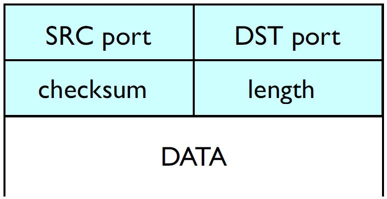
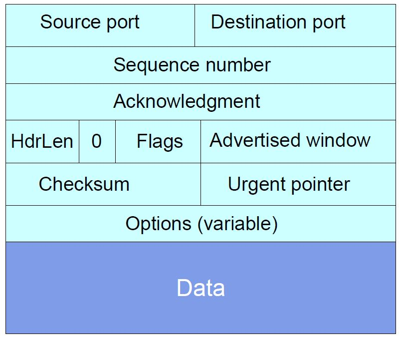
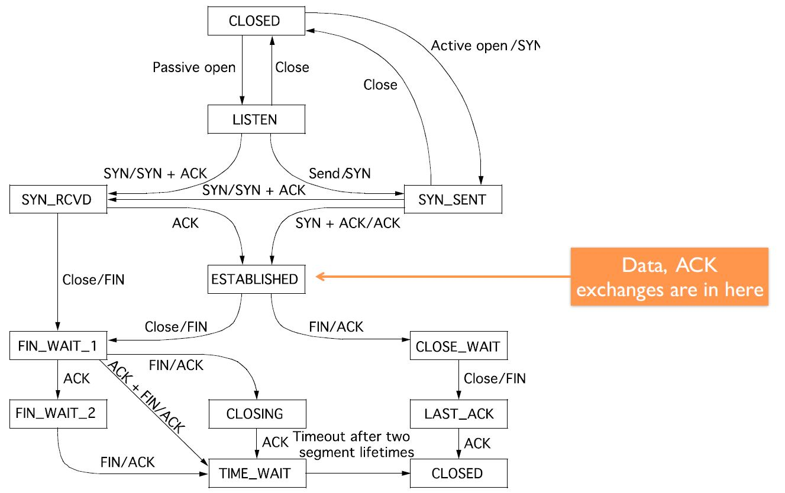

**Computer Networks - Lecture 7 & 8**

- Author: Ruben Schenk
- Date: 01.06.2021
- Contact: ruben.schenk@inf.ethz.ch

# 3. Transport Layer

## 3.1 What do we need in the transport layer? (Principles)

What do we actually need in the transport layer?

- Network should be kept minimal, i.e., easy to build, broadly applicable
- We need a global `best-effort` packet delivery service
- Applications should be restricted to app-specific functionality
- We need data delivery to the correct application, which means that the transport needs to demultiplex incoming data
- We need files or byte-streams abstractions for applications
- Reliable transfer if needed
- No overloading at the receiver and at the network

## 3.2 How do we build reliable transport? (Reliable Transport)

### 3.2.1 Principles of Reliable Transport

Since the Internet is an unreliable environment, packets may get *lost*, *corrupted*, *reordered*, or even *duplicated*.

> A `reliable transport protocol` should enable communication with the following properties:
>
>- *Correctness*: Packets should be received in the same order and without any gap
>- *Timeliness*: It should minimize the time until data is transferred.
>- *Efficiency*: It should minimize the use of bandwidth by not sending too many packets.

We might define the `correctness` of a reliable transport design the following way:

- A reliable transport design is `correct` if a packet is *always resent* if the previous packet was lost or corrupted. A packet *may be resent* at other times.

We can state the following equivalent condition:

- A reliable transport system is correct $\Leftrightarrow$ The system resends all lost or corrupted packets.

### 3.2.2 First Approach to Designing a Reliable Transport Protocol

Our first approach to designing a reliable transport protocol starts the following way:

```
Alice:

    for word in list:
        send_packet(word);
        set_timer();

        upon timer going of:
            if no ACK received:
                send_packet(word);
                reset_timer();
        
        upon receiving ACK:
            pass;

Bob:

    receive_packet(p);
    if check(p.payload) == p.checksum:
        send_ack();

        if word not delivered:
            deliver_word(word);
    else:
        pass;
```

### 3.2.3 Improvements to our Design

We might improve the above idea in the following two ways:

- We can improve *timeliness* by sending multiple packets at the same time.
  - We need to add a `sequence number` inside each packet.
  - We need to add `buffers` to the sender and receiver.
    - Sender stores packets that were sent and not yet acknowledged.
    - REceiver stores out-of-sequence packets that he received.
- We can introduce *flow control* via a `sliding window`. This ways the receiver wont be overwhelmed when we send multiple packets.
  - The sender keeps a list of sequence numbers it can send, known as the `sending window`.
  - The receiver keeps a list of acceptable sequence numbers, known as the `receiving window`.
  - The sender and receiver negotiate the window size, it must be that $\text{sending window} \leq \text{receiving window}$.

The following figure shows an example of the *senders* view with a window composed of 4 packets:

<br>

The timeliness depends on the size of the sending window. But how do we determine the "perfect" size for it? One way to answer this question is with the `bandwidth-delay-product (BDP)`:

- If Alice and Bob were connected by a link with a bandwidth of $X \text{ Mbps}$ and a RTT of $d$ seconds, then the window size should be $X \cdot d \text{ Mb}$ to maximize timeliness.

### 3.2.4 Receiver Feedback

There are three different ways me may encode feedback in ACKs:

- Individual ACKs: received 1, received 2, received3, received 5
  - Pros: We know the fate of each packet, we have a simple window algorithm, it is not sensitive to reordering.
  - Con: Loss of an ACK packet causes unnecessary retransmission.
- `Cumulative ACKs`: received up to 3
  - We trigger a resend after $k$ duplicate ACKs as seen in the figure below. However it is not exactly clear what to resend (only the missing ACK? Or everything after it too?)
- Full information ACKs: received up to 3 and received 5
  - Fixes the problem of cumulative ACKS since it makes missing packets explicit.

<br>

### 3.2.5 Fairness

`Fairness` means that when $n$ entities use the transport mechanism, the available bandwidth is allocated in a fair manner. We might use an equal-per-flow, which means we divide the available bandwidth evenly over each data stream, however this is not fair per se.  
A universally agree upon minimal goal is to avoid `starvation`, which can be reached with equal-per-flow.

One approach is the max-min fair allocation:

> The `max-min fair allocation` is such that the lowest demand is maximized, after that the second lowest is maximized, and so on.

The max-min fair allocation can easily be computed the following way:

1. Start with flow at rate 0.
2. Increase the flows until there is a new bottle neck in the network.
3. Hold the fixed rate of the flows that are bottlenecked.
4. Go to step 2 for the remaining flows.

### 3.2.6 Corruption, Reordering, Delay and Duplication

#### Corruption

Dealing with `corruption` is easy. We simply rely on a checksum and treat corrupted packets as lost.

#### Reordering

The problem of `reordering` depends on the type of ACKs used:

- Individual: No problem
- Full feedback: No problem
- Cumulative: Can lead to creating duplicate ACKs

#### Delays

Long `delays` can lead to useless timeouts, for *all* designs.

#### Duplicates

Packet `duplicates` can lead to duplicate ACKs whose effects will depend on the type of ACKs used:

- Individual: No problem
- Full feedback: No problem
- Cumulative: Same problem as with reordering

### 3.2.7 Go-Back-N Protocol

The `Go-Back-N (GBN)` protocol is a simple sliding window protocol using cumulative ACKs:

- Principle: Receiver should be as simple as possible.
- Receiver: Delivers packets in-order to the upper layer. For each received segment, the receiver ACKs the last in-order packet delivered (cumulative).
- Sender: Uses a single timer to detect loss, resets the timer at each ACK. Upon a timeout, the sender resend all $W$ packets, starting with the lost one, where $W$ is the size of the sliding window.

### 3.2.8 Selective Repeat

The `Selective Repeat (SR)` protocol avoids unnecessary retransmissions by using per-packet ACKs.

- Principle: Avoids unnecessary retransmissions
- Receiver: Acknowledge each packet, in-order or not, buffer out-of-order packets.
- Sender: Uses a per-packet timer to detect loss. Upon a loss, only the lost packet is resent.

## 3.3 How does the Internet's transport work?

### 3.3.1 UDP

`UDP` is a simple extension of IP that only allows for data delivery to the correct application (optionally with checksums for corruption detection).

A UDP packet simply consists of 4 header fields and one variable length data field, as seen in the figure below:

<br>

UDP is thus an unreliable, connectionless protocol for data transfer. Although there is no recovery from losses, reordering, etc., UDP is very good for certain types of application like DNS, Gaming or VoIP, due to the following reasons:

- There is no connection establishment delay like in TCP (3-way handshake)
- The small header leads to a small packet overhead which results in faster delivery.
- Since there is no connection state, no timers, etc., UDP provides better scalability.

### 3.3.2 TCP

> `TCP` is a *connection-oriented, reliable byte-stream* transport service.

Reliability requires keeping the state at both the sender (in the form of timers and send buffers) and at the receiver (in the form of a receive buffer). Each byte-stream is called `connection/session` and has their own connection state.

#### TCP Design Choices

- **ACKs**: TCP uses byte sequence number and cumulative ACKs
- **Checksums**: TCP does checksum
- **Timeout/Retransmission**: Retransmission are based on timeouts and duplicate ACKs. Timeouts are based on an estimate of the RTT.
- **Sliding Window Flow Control**: Allows for $W$ contiguous bytes to be in transfer.
- **Timer**: When a timer for a packet goes off, we resend the packet and double the timeout period. On three duplicate ACKs we can initiate a `fast retransmit`.

#### TCP Header

In order for a TCP packet to be sent over the network, it has to be wrapped into an IP packet, which cannot be bigger than the `maximum transmission unit (MTU)` (e.g. 1500 bytes for Ethernet).  
A TCP packet consists of a `TCP header` of at least 20 bytes, shown in the figure below, and the TCP segment, which contains the data. Thus, the TCP segment is at most `maximum segment size (MSS)` bytes long, where $\text{MSS} = \text{MTU} - \text{(IP header size)} - \text{(TCP header size)}$.

<br>

#### ACKing and Sequence Numbers

If the sender sends a packet containing $B$ bytes and starting at sequence number $X$, then the bytes in the packet are $X, \, X+1,..., \, X+B-1$.  
Upon the receipt of the packet, the receiver sends an ACK:

- If all data prior to $X$ was already received, then the ACK acknowledges $X + B$, since $X + B$ is *the next expected byte*.
- If the highest contiguous byte received is $Y$ (smaller than $X$), then the ACK acknowledges $Y + 1$, even if it has been ACKed before.

The `sequence number` field thus holds the starting byte offset of the data carried in the segment. The `acknowledgment number` field denotes what byte is expected next.

#### Sliding Window Flow Control

The `Advertised Window` field holds the number $W$ of bytes which can be sent beyond the *next expected byte*. The receiver uses this field to prevent the sender from overflowing its buffer since it limits the number of bytes the sender can have in flight.

#### Transfer Speed

We finish our discussion of TCP with a simple example of computing the transfer speed. Assume the following:

- $W$ in bytes is the sliding window size, assumed to be constant
- $RTT$ in seconds is the round-trip-time, assumed to be constant
- $B$ in bytes/second is the bandwidth of the link

We distinguish two cases:

- $W/RTT < B$, then the transfer speed is $W / RTT$
- Otherwise, the transfer speed is $B$

### 3.3.3 Connection Establishment

To establish a TCP connection, each host generates its `ISN (initial sequence number)` and then they exchange it in a so called `3-way handshake`:

1. Host $A$ sends a `SYN` packet (with the SYN flag set) and its ISN in the sequence number field.
2. Host $B$ returns a `SYN ACK` packet (with the SYN and ACK flag set) and its ISN in the sequence number field. The acknowledgment number is set to $A$'s ISN + 1.
3. Host $A$ sends an ACK to acknowledge the SYN ACK and can now start sending data.

If the SYN packet gets lost, no SYN ACK will arrive and thus the SYN packet will be simply retransmitted. The only problem with this is that it's totally unclear how far away the receiver is and it therefore is hard to set a timeout period. The default wait is 3 seconds.

### 3.3.4 Connection Teardown

#### Normal Termination - One Side at a Time

Host $A$ sends a packet with the `FIN` flag set and waits to receive an ACK from host $B$. As soon as that happens, $A$ closes its side of the connection, the connection is now *half-closed*. $A$ can still receive bytes from $B$.  
If $B$ sends a FIN as well, the connection is fully closed as soon as $A$ sends back an ACK.

#### Normal Termination - Both Together

Same as before, but when $A$ sends its FIN packet, $B$ responds with both FIN and ACK set. A then sends back a final packet with ACK flag set and the connection is closed.

### 3.3.5 TCP State Transition Diagram

The following figure shows a summary of the TCP state transitions:

<br>
