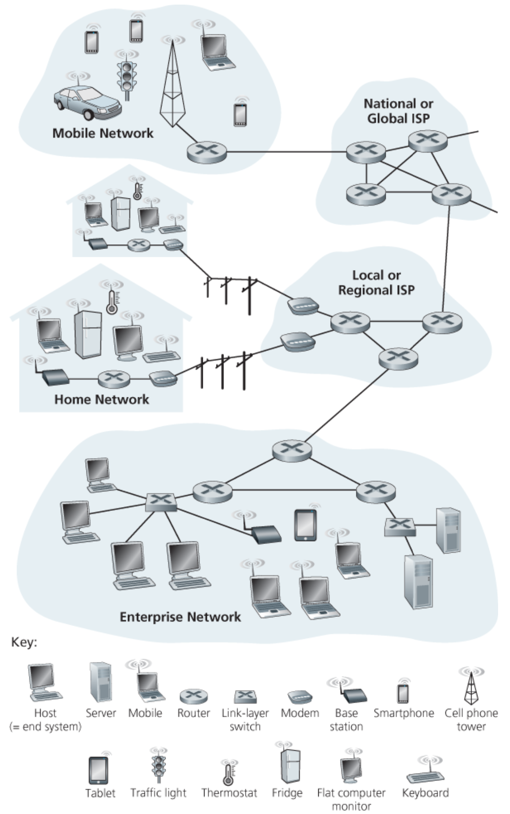
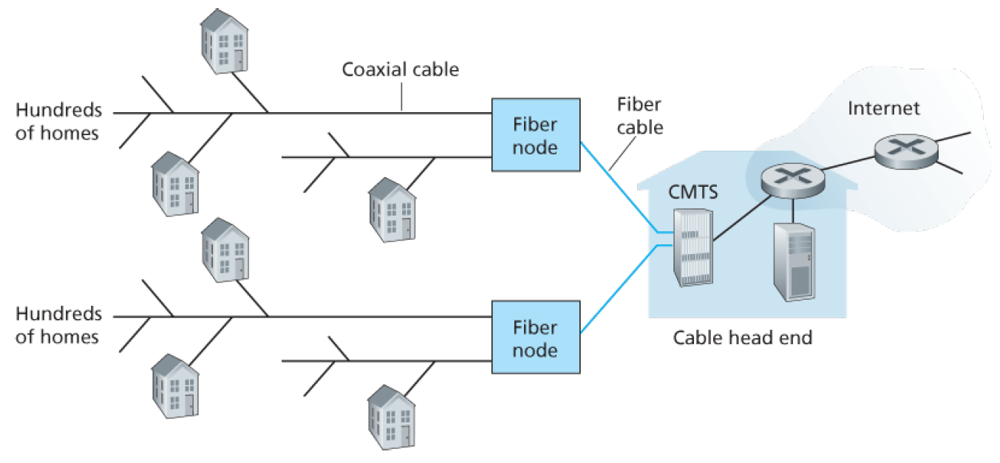
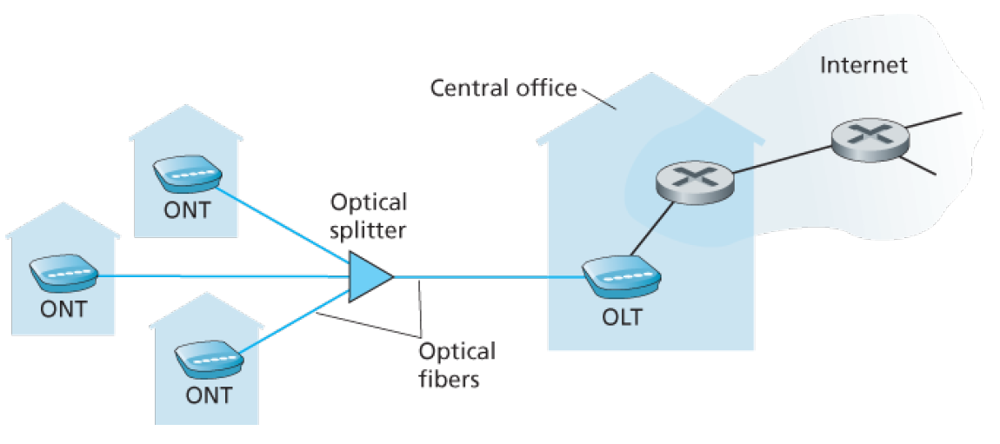

# Computer Networks - Week 1 (Book)
# 1. Computer Networks and the Internet
## 1.1 What Is the Internet?
### 1.1.1 A Nuts-and-Bolts Description

The Internet is a computer network that interconnects billions of computing devices through the world. In Internet jargon, all of these devices are called `hosts` or `end systems`.  
End systems are connected by a network of `communication links` and `packet switches`. Different links can transmit data at different rates, with the `transmission rate` of a link measured in bits/second. 

`Packages` are packages of information, put together by a sending end system. The sequence of communication links and packet switches traversed by a packet from the sending end system to the receiving end system is known as a `route` or `path` through the network.

End systems access the Internet through `Internet Service Providers (ISPs)`, including residential ISPs such as local cable or telephone companies, corporate ISPs, university ISPs etc.  
End systems, packet switches, and other pieces of the Internet run `protocols` that control the sending and receiving of information within the internet. The `Transmission Control Protocol (TCP)` and the `Internet Protocol (IP)` are two of the most important protocols in the Internet.

### 1.1.2 A Services Description
We can also describe the Internet from an entirely different angle - namely, as *an infrastructure that provides services to applications*. The applications are said to be `distributed applications`, since they involve multiple end systems that exchange data with each other.

End systems attached to the Internet provide a `socket interface` that specifies how a program running on one end system asks the Internet infrastructure to deliver data to a specific destination program running on another system.

### 1.1.3 What Is a Protocol?
#### Network Protocols
All activity in the Internet that involves two or more communicating remote entities is governed by a protocol. Protocols are running everywhere in the Internet.
> A **protocol** defines the format and the order of messages exchanged between two or more communicating entities, as well as the actions taken on the transmission and/or receipt of a message or other event.

## 1.2 The Network Edge
 

In this book, end systems are also refered to as `hosts` because they host (that is, *run*) application programs such as a Web browser program, a Web server program etc.   Hosts are sometimes further divided into two categories: `clients` and `servers`. Informally, clients tend to be desktop and mobile PCs, smartphones and so one, whereas servers tend to be more powerful machines that store and distribute Web pages, stream video, relay e-mail, and so on.

### 1.2.1 Acess Networks
#### Home Access: DSL, Cable, FFTH, Dial-Up, and Satellite

Today, the most prevalent types of broadband residential acess are `digital subscriber line (DSL)` and cable. A residence typically obtains DSL Internet access from the same local telephone company (*telco*) that provides its wired local phone access.  
Each customer's DSL modem uses the existing telephone line (twisted-pair copper wire) to exchange data with a digital subscriber line access multiplexer (*DSLAM*) located in the telco's local central office (*CO*).

The residential telephone line carries both data and traditional telephone signals simultaneously, which are encoded in different frequencies:
* A high-speed downstream channel, in the 50 kHz to 1 MHz band
* A medium-speed upstream channel, in the 4 kHz to 50kHz band
* An ordinary two-way telephone channel, in the 0 to 4 kHz band

 

On the customer side, a splitter separates the data and telephone signals arriving to the home and forwards the data signal to the DSL modem. On the telco side, in the CO, the DSLAM separates the data and phone signals and sends the data into the Internet.

While DSL makes use of the telco's existing local telephone infrastructure, `cable internet access` makes use of the cable television company's existing cable television infrastructure.  
As illustrated in the following figure, fiber optics connect the cable head end to the neighbourhood-level junctions, from which traditional coaxial cable is then used to reach individual houses and appartements. At the cable head end, the cable modem termination system (CMTS) serves a similar function as the DSL network's DSLAM - turning the analog signal sent from the cable modems in many downstream homes back into digital format.

 

One important characteristic of cable Internet access is that it is a *shared broadcast medium*. In particular, every packet sent by the head end travels downstream on every link to every home and every packet sent by a home travels on the upstream channel to the head end.  
For this reason, if several users are simultaneously downloading a video file on the downstream channel, the actual rate at which each user receives its video file will be significantly lower than the aggregate cable downstream rate.

An up-and-coming technology that provides even higher speeds is `fiber to the fome (FTTH)`. As the name suggests, the FTTH concept is simple - provide an optical fiber path from the CO directly to the home.

 

### 1.2.2 Physical Media

Consider a bit traveling from one end system, through a series of links and routers, to another end system. The source end system first transmits the bit, and shortly thereafter the first router in the series receives the bit. The first router then transmits the bit, and shortly thereafter the second router receives the bit, and so on. Thus our bit, when traveling from source to destination, passes through a series of *transmitter-receiver pairs*. For each transmitter-receiver pair, the bit is sent across a `physical medium`.

Physical media fall into two categories: `guided media` and `unguided media`. With guided media, the waves are guided along a solid medium, such as a fiber-optic cable, a twisted-pair copper wire, or a coaxial cable. With unguided media, the waves propagate in the atmosphere and in outer space, such as in a wireless LAN or a digital satellite channel.

#### Twisted-Pair Copper Wire
The least expensive and most commonly used guided transmission medium is twisted-pair copper wire. Twisted pair consists of two insulated copper wires, each about 1 mm thick, arranged in a regular spiral patternt. The wires are twisted together to reduce the electrical interference from similar pairs close by.

#### Coaxial Cable
Coaxial cable consists of two copper conductors, but the two conudctors are concentric rather than parallel. It is commonly used in cable television systems. 

#### Fiber Optics
An optical fiber is a thin, flexible medium that conducts pulses of light, with each pulse representing a bit. They are immune to elegtromagnetic interference, have very slow signal attenuation up to 100 kilometers, and are very hard to tap.

#### Terrestrial Radio Channels
Radio channels carry signal in the electromagnetic spectrum. They are an attractive medium because they require no physical wire to be installed, can penetrate walls, provide connectivity to a mobile user, and can potentially carry a signal for long distances.

#### Satellite Radio Channels
A communication satellite links two or more Earth-based microwave transmitter/receivers, known as *ground stations*. Two types of satellites are used ind communications: `geostationary satellites` and `low-earth orbiting (LEO) satellites`.  
Geostationary satellites permanently remain above the same spot on Earth at 36'000 km above Earth's surface. This huge distance from ground station through satellite back to ground station introduces a substantial signal propagation delay of 280 miliseconds.  
LEO satellites are placed much closer to Earth and do not remain permanently above one spot on Eart. Therefore, to provide continuous coverage to an area, many satellites need to be placed in orbit.