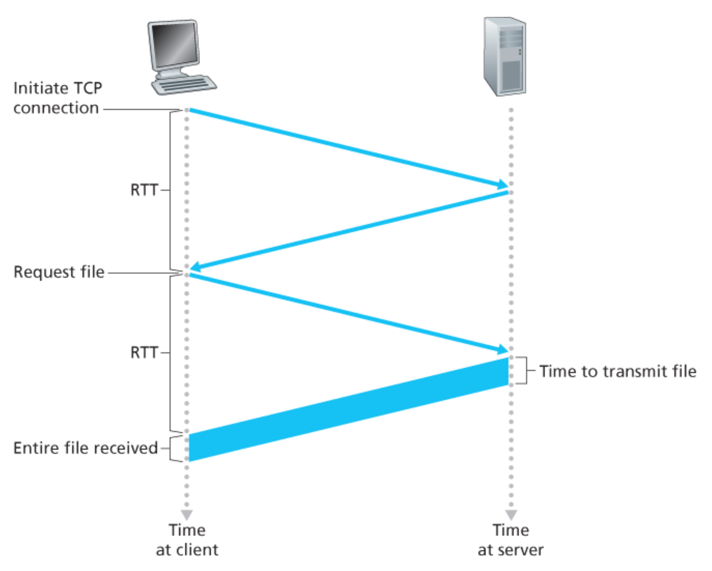
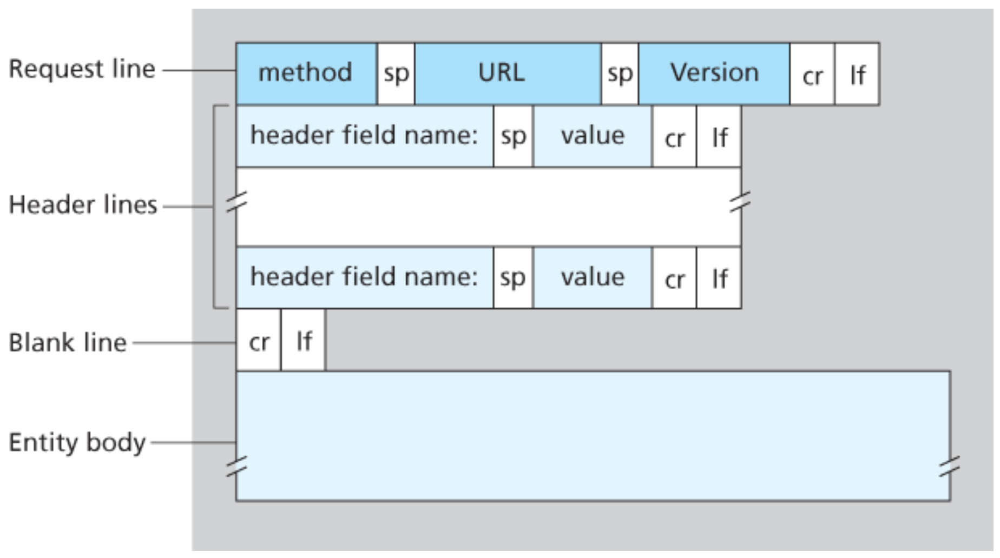
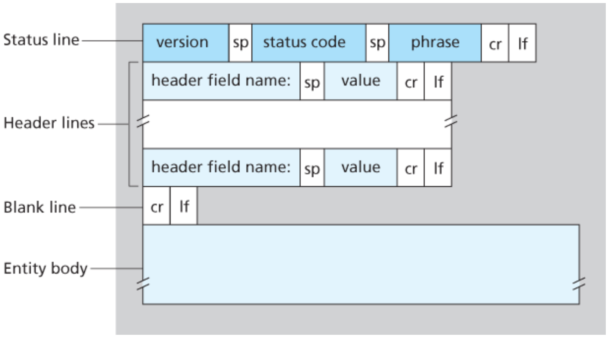
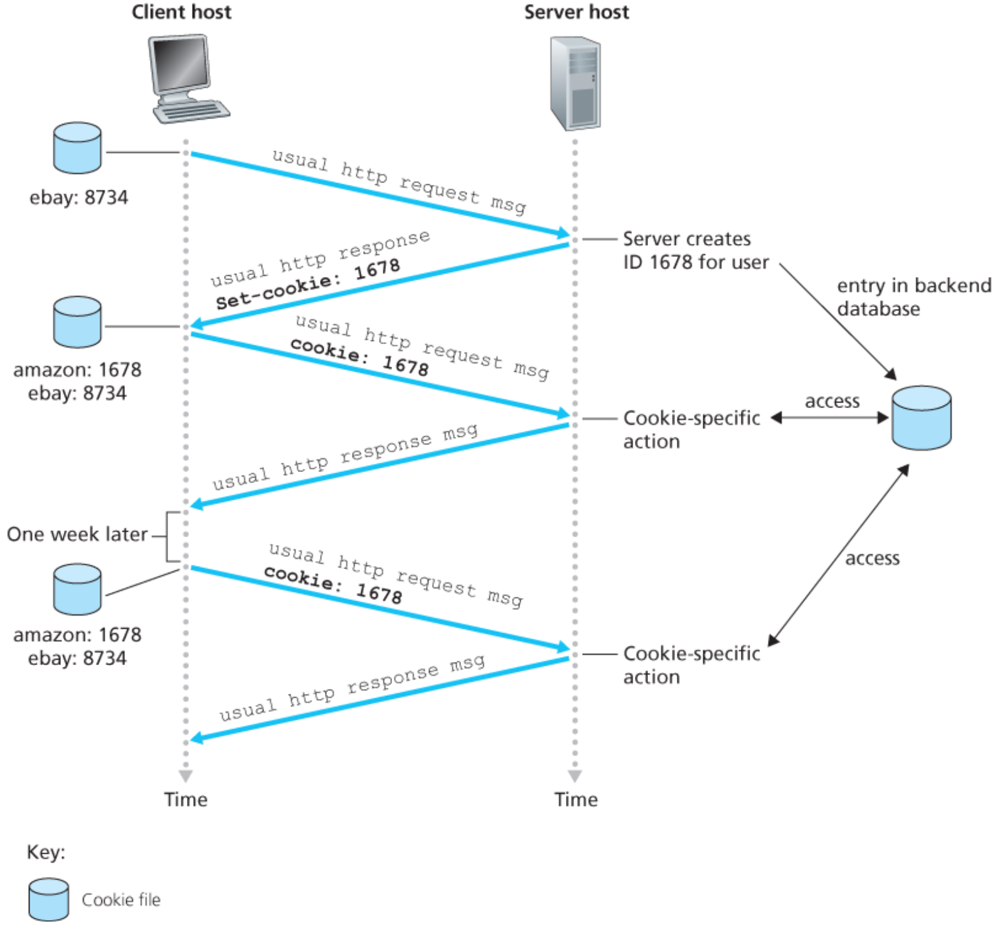
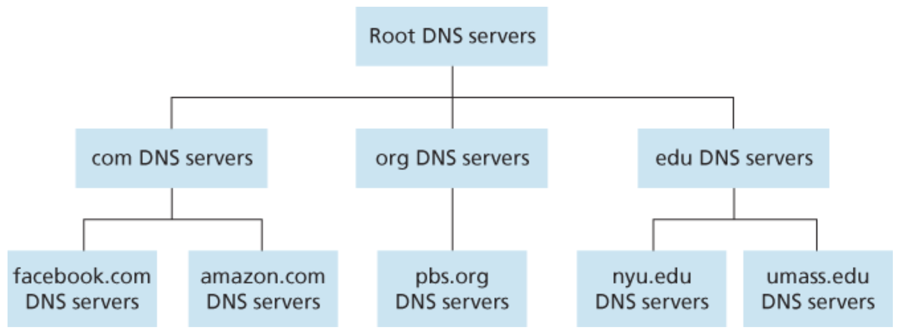
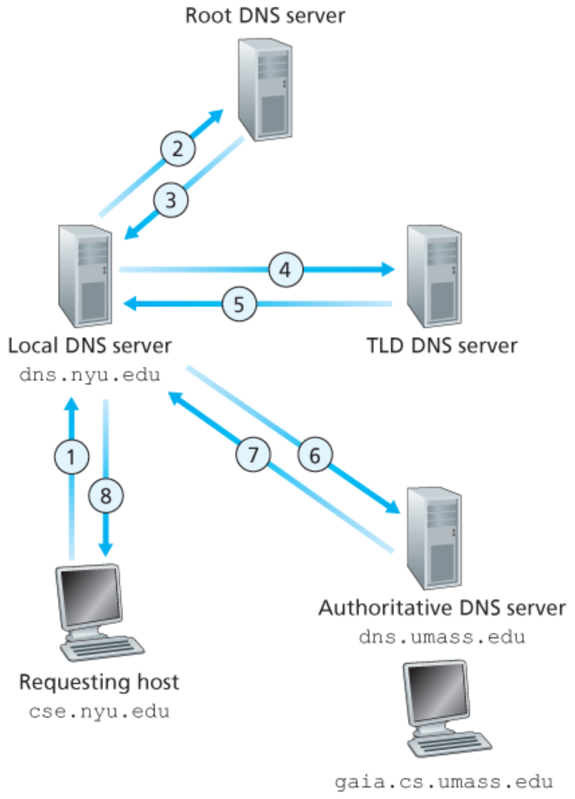
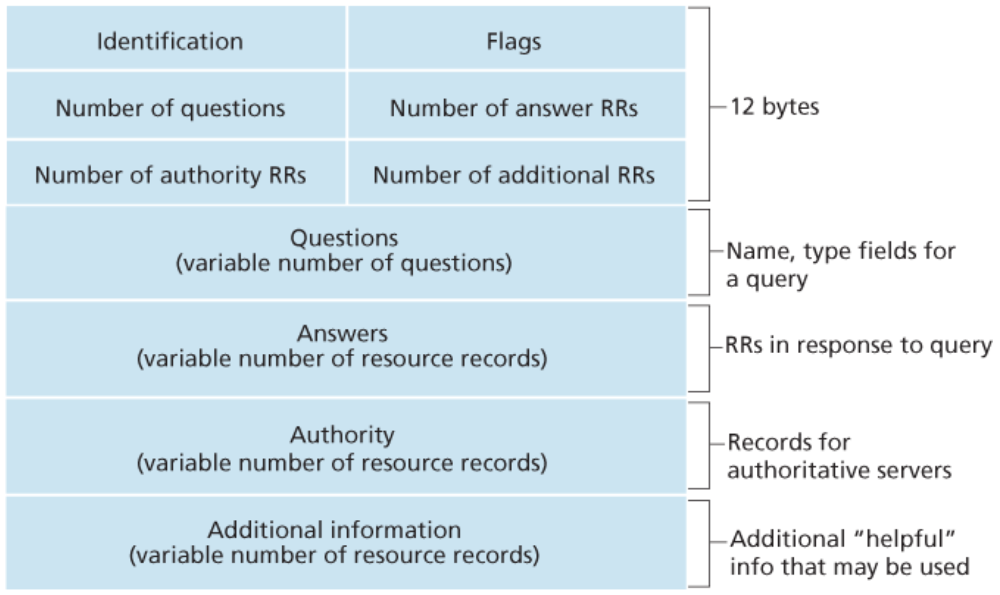

# Computer Networks - Week 2 & 3 (Book)
- Author: Ruben Schenk
- Date: 16.03.2021
- Contact: ruben.schenk@inf.ethz.ch

# 2. Application Layer

## 2.2 The Web and HTTP

### 2.2.1 Overview of HTTP
The `HyperText Transfer Protocol (HTTP)`, the Web's application-layer protocol, is at the heart of the Web. The client program and server program, which both implement HTTP, talk to each other by exchanging HTTP messages. HTTP defines the structure of these messages and how the client and server exchange the messages.

A `Web page` consists of objects. An `object` is simply a file - such as an HTML file, a JPEG image, or a video clip - that is addressable by a single URL.

Because `Web browsers` implement the client side of HTTP, we will use the words *browser* and *client* interchangeably. `Web servers`, which implement the server side of HTTP, house Web objects, each addressable by a URL.

When a user requests a Web page, the browser sends HTTP request messages for the objects in the page to the server. The server receives the requests and responds with HTTP response messages that contain the objects. HTTP uses TCP as its underlying transport protocol.

It is important to note that the server sends requested files to clients without storing any state information about the client. Because an HTTP server maintains no information about the clients, HTTP is said to be a `stateless protocol`.

### 2.2.2 Non-Persistent and Persistent Connections
When the client-server interaction is taking place over TCP, the application developer needs to make a decision - should each request/response pair be sent over a *separate* TCP connection, or should all of the requests and their corresponding responses be sent over the *same* TCP connection? In the former approach, the application is said to use `non-persistent connections`; and in the latter approach, `persistent connections`.

#### HTTP with Non-Persistent Connections
Let's suppose a Web page consists of a base HTML file and 10 JPEG images, and that all 11 of these objects reside on the same server. Assume non-persistent connections, where each TCP connection is closed after the server sends the object - the connection does not persist for other objects. Thus, in the assumed example, when a user requests the Web page, 11 TCP connections are generated.

To this end, we define the `round-trip time (RTT)`, which is the time it takes for a small packet to travel from client to server and then back to the client. The RTT includes packet-propagation delays, packet-queuing delays in intermediate routers and switches, and packet-processing delays.

<br>

Thus, roughly, the `total response time` is two RTTs plus the transmission time at the server of the HTML file.

#### HTTP with Persistent Connections
Non-persistent connections have some shortcomings:

1. For each connection (aka for each object), TCP buffers must be allocated and TCP variables must be kept in both the client and server. This can place a significant burden on the Web server.
2. Each object suffers a delivery delay of two RTTs - one RTT to establish the TCP connection and one RTT to request and receive an object.

With HTTP 1.1 persistent connections, the server leaves the TCP connection open after sending a response. Subsequent requests and responses between the same client and server can be sent over the same connection. Typically, the HTTP server closes a connection when it isn't used for a certain time.

The default mode of HTTP uses persistent connections with pipelining.

### 2.2.3 HTTP Message Format
The HTTP specifications include the definitions of the HTTP message formats. There are two types of HTTP messages, request messages and response messages.

#### HTTP Request Message
Below we provide a typical HTTP request message:

```http

GET /somedir/page.html HTTP/1.1
Host: www.someschool.edu
Connection: close
User-agent: Mozilla/5.0
Accept-language: fr

```

Although this particular request message has five lines, a request message can have many more lines or as few as one line. The first line of an HTTP request message is called the `request line`; the subsequent lines are called the `header lines`. The request line has three fields: the method field, the URL field, and the HTTP version field. The method field can take on  several different values, including `GET`, `POST`, `HEAD`, `PUT`, and `DELETE`.

Let's look closer at the header lines in the example:
- `Host`: specifies the host on which the object resides
- `Connection: close`: tells the server that it doesn't bother with persistent connections
- `User-agent`: specifies the user agent, that is, the browser type making the HTTP request
- `Accept-language`: indicates that the user prefers to receive a French version of the object, if such an object exists on the server

The general form of an HTTP request message looks as follows:

<br>

The `HEAD` method is similar to the `GET` method with the difference being, that the sever responds only with an HTTP message and leaves out the requested object (often used for debugging).<br>
The `PUT` method is often used in conjunction with Web publishing tools and forms. It allows a user to upload an object to a specific path on a specific Web server.<br>
The `DELETE` method allows a user, or an application, to delete an object on a Web server.

#### HTTP Response Message
The HTTP response message below could be the response to the example request message from above:

```http

	HTTP/1.1 200 OK
	Connection: close
	Date: Tue, 18 Aug 2015 15:44:04 GMT
	Server: Apache/2.2.3 (CentOS)
	Last-Modified: Tue, 18 Aug 2015 15:11:03 GMT
	Content-Length: 6821
	Content-Type: text/html

	(data data data data data ...)

```

The message has three sections: an initial `status line`, six `header lines`, and then the `entitiy body`. The entitiy body contains the requested object itself. The status line has three fields: the protocol version field, a status code, and a corresponding status message.

Let's look closer at the header lines of our example:
- `Connection: close`: indicates that the server is going to close the TCP connection after sending the message
- `Date`: indicates the time and date when the HTTP response was created and sent by the server
- `Server`: indicates that the message was generated by an Apache Web server
- `Last-Modified`: indicates the date and time when the object was created or last modified
- `Content-Length`: indicates the number og bytes in the object being sent
- `Content-Type`: indicates that the object in the entity body is HTML text

<br>

Some common status codes and associated phrases include:
- `200 OK`: Request succeeded and the information is returned in the response.
- `301 Moved Permanently`: Requested object has been permanently moved, the new URL is specified in `Location` header of the response message.
- `400 Bad Request`: Generic error code indicating that the request could not be understood by the server.
- `404 Not Found`: The requested document does not exists on this server.
- `505 HTTP Version Not Supported`: The requested HTTP protocol version is not supported by the server.

### 2.2.4 User-Server Interaction: Cookies
We mentioned above that an HTTP server is stateless. However, it is often desireable for a Web site to identify users, either because the server wishes to restrict user access or beause it wants to serve content as a function of the user identity. For these purposes, HTTP uses `cookies`.

Cookie technology has four components: (1) a cookie header line in the HTTP response message, (2) a cookie header line in the HTTP request message, (3) a cookie file kept on the user's end system and managed by the user's browser, and (4) a back-end database at the Web site.

<br>

Suppose Susan contacts `Amazon.com` for the first time. When the request comes in, the Amazon Web server creates a unique identification number for Susan and stores it in its back-end database. The Amazon Web server then responds to Susan's browser, including in the HTTP response a `Set-cookie` header, which contains the id number. The header might be:

```http

	Set-cookie: 1678

```

As Susan continues to browse the Amazon site, each time she requests a Web page, her browser consults her cookie file, extracts her id number for this site, and puts a cookie header linea in the HTTP request as follows:

```http

	Cookie: 1678

```

Although the Amazon Web site does not encessarily know Susan's name, it knows exactly which pages user 1678 visited, in which order, and at what times!

### 2.2.5 Web Caching
A `Web cache` - also called a `proxy server` - is a network that satisfies HTTP requests on the behalf of an origin Web server. The Web cache has its own disk storage and keeps copies of recently requested objects in this storage.

Typically a Web cache is purchased and installed by an ISP. For example, a university might install a cache on its campus network and configure all of the campus browsers to point to the cache.

There are two main reasons to deploy Web caching in the Internet:
1. A Web cache can substantially reduce the response time for a client request.
2. Web caches can substantially reduce traffic on an institution's access link to the Internet.

#### The Conditional GET
HTTP has a mechanism that allows a cache to verify that its objects are up to date. This mechanism is called the `conditional GET`. An HTTP request message is a so-called conditional GET message if (1) the request message uses the `GET` method and (2) the request message includes an `If-Modified-Since` header line.

Let's walk through an example: First, on behalf of a requesting browser, a proxy cache sends a request message to a web server:

```http

	GET /fruit/kiwi.gif HTTP/1.1
	Host: www.exotiquecuisine.com

```

Second, the Web server sends a response message with the requested object to the cache:

```http

	HTTP/1.1 200 OK
	Date: Sat, 3 Oct 2015 15:39:29
	Server: Apache/1.3.0 (Unix)
	Last-Modified: Wed, 9 Sep 2015 09:23:24
	Content-Type: image/gif

	(data data data data data ...)

```

Third, one week later, another browser requests the same object via the cache. The cache performs an up-to-date check by issuing a conditional GET. Specifically, the cache sends:

```http

	GET /fruit/kiwi.gif HTTP/1.1
	Host: www.exotiquecuisine.com
	If-modified-since: Wed, 9 Sep 2015 09:23:24

```

Suppose the object has not been modified since 9 Sep 2015 09:23:24. Then, fourth, the Web server sends a response message to the cache:

```http
	
	HTTP/1.1 304 Not Modified
	Date: Sat, 10 Oct 2015 15:39:29
	Server: Apache/1.3.0 (Unix)

	(empty entity body)

```

## 2.4 DNS - The Internet's Directory Service
Just as humans can be identified in many ways, so too can Internet hosts. One identifier for a host is its `hostname`. But because those consist of variable-length alphanumeric characters, they would be difficult to process by routers. For these reasons, hosts are also identified by so-called `IP addresses`.

An IP address consists of four bytes in a hierarchical structure. An IP address looks like `121.7.106.83`, where each period separates one of the bytes expressed in decimal notation from `0` to `255`.

### 2.4.1 Services Provided by DNS
We have just seen that there are two ways to identify a host - by a hostname and by an IP address. This fact results in a need of a directory service that translates hostnames to IP addresses. This is the main task of the Internet's `domain name system (DNS)`.

The DNS is (1) a distributed database implemented in a hierarchy of `DNS servers`, and (2) an application-layer protocol that allows hosts to query the distributed database. The DNS protocol runs over UDP and uses port 53.

DNS provides a few other important services in addition to translating hostnames to IP addresses:
- `Host aliasing`: A host with a complicated hostname can have one or more alias names. For example, `relay1.west-coast.enterprise.com` could have an alias such as `enterprise.com`. In this case, the first hostname is called the `canonical hostname`.
- `Mail server aliasing`: DNS can be invoked by a mail application to obtain the canonical hostname for a supplied alias hostname as well as the IP address of the host.
- `Load distribution`: DNS is also used to perform load distribution among replicated servers, such as replicated Web servers. For replicated Web servers, a set of IP addresses is thus associated with one canonical hostname.

### 2.4.2 Overview of How DNS Works
Suppose some application needs to translate a hostname that needs to be translated. The application will invoke the client side of DNS, specifying the hostname that needs to be translated. DNS in the user's host then takes over, sending a query message into the network. After a delay, DNS in the user's host receives a DNS reply message that provides the desired mapping.

A simple design for DNS would have one DNS server that contains all the mappings. The problem with this `centralized design` include:
- *Single point of failure*: If the DNS server crashes, so does the Internet.
- *Traffic volume*: A single DNS would have to handle all DNS queries.
- *Distant centralized database*: A single DNS server cannot be "close" to all the querying clients.
- *Maintenance*: The single DNS server would have to keep records for all Internet hosts.

#### A Distributed, Hierarchical Database
In order to deal with the issue of scale, the DNS uses a large number of servers, organized in a hierarchical fashion distributed around the world. To a first approximation, there are three classes of DNS servers - root DNS servers, top-level domain (TLD) DNS servers, and authoritative DNS servers - organized in a hierarchy as show in the figure below:

<br>

Let's take a closer look at these three classes of DNS servers:
- `Root DNS servers`: There are over 400 root name servers scattered all over the world. These root name servers are managed by 13 different organizations.
- `Top-level domain (TLD) servers`: For each of the top-level domains - such as `.com`, `.org`, or `.edu` - there is a TLD server (or server cluster).
- `Authoritative DNS servers`: Every organization with publicly accessible hosts on the Internet must provide publicly accessible DNS records that map the names of those hosts to IP addresses.

There is also another important type of DNS server called the `local DNS server`. A local DNS server does not strictly belong to the hierarchy of servers but is nevertheless central to the DNS architecture. Each ISP - such as a residential ISP or an institutional ISP - has a local DNS server.

Let's look at an example where the host `cse.nyu.edu` desires the IP address of `gaia.cs.umass.edu`. Then the sent queries are shown in the picture below:

<br>

The example above makes use of both `recursive queries` and `iterative queries`. The query *(1)* is a recursive query, since it asks `dns.nyu.edu` to obtain the mapping on its behalf. The subsequent queries are all iterative since all of the replies are directly returned to `dns.nyu.edu`.

#### DNS Caching
The idea behind `DNS caching` is very simple. In a query chain, when a DNS server receives a DNS reply, it can cache the mapping in its local memory. If a hostname/IP address pair is cached in a DNS server and another query arrives to the DNS server for the same hostname, the DNS server can provide the desired IP address, even if it is not authoritative for the hostname.

A local DNS server can also cache the IP address of TLD servers, thereby allowing the local DNS server to bypass the root DNS servers in a query chain.

### 2.4.3 DNS Records and Messages
The DNS servers that together implement the DNS distributed database store `resource records (RRs)`, including RRs that provide hostname-to-IP address mappings.

A resource record is a four-tuple that contains the following fields:

```http
(Name, Value, Type, TTL)
```

`TTL` is the time to live of the resource record. It determines when a resource should be removed from a cache. The meaning of `Name` and `Value` depend on `Type`:
- `Type = A`: Then `Name` is a hostname and `Value` is the IP address for the hostname. Thus, a Type A record provides the standard hostname-to-IP address mapping. Example: `(relay1.bar.foo.com, 145.37.93.126, A)`
- `Type = NS`: Then `Name` is a domain and `Value` is the hostname of an authoritative DNS server that knows how to obtain the IP addresses for hosts in the domain. Example: `(foo.com, dns.foo.com, NS)`
- `Type = CNAME`: Then `Value` is the canonical hostname for the alias hostname `Name`. Example: `(foo.com, realy1.bar.foo.com, CNAME)`
- `Type = MX`: Then `Value` is a canonical hostname for the alias hostname `Name`. Note that by using the MX record, a company can have the same aliased name for its mail server and for one of its other servers.

If a DNS server is authoritative for a particular hostname, then the DNS server will contain the Type A record for the hostname. If a server is not authoritative for a hostname, then the server will contain a Type NS record for the domain that includes the hostname. It will also contain a Type A record that provides the IP address of the DNS server in the `Value` field of the NS record.

#### DNS Messages
Earlier in this section, we referred to DNS query and reply messages. These are the only two kinds of DNS messages.
- The first 12 bytes is the `header section`, which has a number of fields. The first field is a 16-bit number that identifies the query. 
- Furthermore there are a number of flags in the `flag field`:
	- 1-bit query/reply flag indicates whether the message is a query (0) or a reply (1)
	- 1-bit authoritative flag is set in a reply message when a DNS server is authoritative for the queried name
	- 1-bit recursion-desired flag, set when a client desires that the DNS server performs recursion when it doesn't have the record.
	- 1-bit recursion-available field, set in a reply if the DNS server supports recursion.
- In the header, there are also four `number-of fields`. These fields indicate the number of occurences of the four types of data sections that follow the header.
- The `question section` contains information about the query that is being made. This section includes (1) a name field that contains the name that is being queried, and (2) a type field that indicates the type of question being asked about the name.
- In a reply from a DNS server, the `answer section` contains the resource records for the name that was originally queried. A reply can return multiple RRs in the answer, since a hostname can have multiple IP addresses.
- The `authority section` contains records of other authoritative servers.
- The `additional section` contains other helpful records.

<br>

#### Inserting Records into the DNS Database
A `registrar` is a commercial entity that verifies the uniqueness of the domain name, enters the domain name into the DNS database.

When you register, let's say, the domain name `networkutopia.com` with some registrar, you also need to provide the registrar with the names and IP addresses of your primary and secondary authoritative DNS servers. For each of these two authoritative DNS servers, the registrar would then make sure that a Type NS and a Type A record are entered into the TLD com servers:

```http
	(networkutopia.com, dns1.networkutopia.com, NS)
	(dns1.networkutopia.com, 212.212.212.1, A)
```

## 2.6 Video Streaming and Content Distribution Networks