# Computer Networks - Week 4 & 5 (Book)
- Author: Ruben Schenk
- Date: 18.03.2021
- Contact: ruben.schenk@inf.ethz.ch

# 3. Transport Layer
Residing between the application and network layer, the `transport layer` is a central piece of the layered network architecture. It has the critical role of providing communication services directly to the application processes running on different hosts.

## 3.1 Introduction and Transport-Layer Services
A transport-layer protocol provides for `logical communication` between application processes running on different hosts. By logical communication, we mean that from an application's perspective, it is as if the hosts running the processes were directly connected.

Transport-layer protocols are implemented in the end systems but not in network routers.<br>
On the sending side, the transport layer converts the application-layer messages it receives from a sending application process into transport-layer packets, known as transport-layer `segments`. This is done by breaking the application messages into smaller chunks and adding a `transport-layer header` to each chunk. The transport layer then passes the segment to the network layer at the sending end system, where the segment is encapuslated within a network-layer packet (called a `datagram`) and sent to the destination.<br>
On the receiving side, the network layer extracts the transport-layer segment from the datagram and passes the segment up to the transport layer.

### 3.1.1 Relationship Between Transport and Network Layers
Recall that the transport layer lies just above the network layer in the protocol stack. Whereas a transport-layer protocol provdes a logical communication between *processes* running on different hosts, a network-layer protocol provides logical communication betwenn *hosts*.

Within and end system, a transport protocol moves messages from application processes to the network edge (that is, the network layer) and vice versa, but it doesn't have any say about how the messages are moved within the network core.

The services that a transport protocol can provide are often constrained by the service model of the underlying network-layer protocol. If the network-layer protocol cannot provide delay or bandwidth guarantess for transport-layer segments sent between hosts, then the transport-layer protocol cannot provide delay or bandwidth guarantees for application messages sent between processes.

### 3.1.2 Overview of the Transport Layer in the Internet
Recall that the Internet makes two distinct transport-layer protocols available to the application layer. One of these protocols is `UPD (User Datagram Protocol)`, which provides an unreliable, connectionless service to the invoking application. The second of these protocols is `TCP (Transmission Control Protocol)`, which provides a reliable, connection-oriented service to the invoking application.

Before we proceed with our brief introduction of UDP and TCP, it will be useful to say a few words about Internet's network layer. The Internet's `network-layer protocol` has a name - `IP`, for `Internet Protocol`. IP provides logical communication between hosts. The IP service model is a `best-effort delivery service`. This means that IP makes its "bestt effort" to deliver segments between communicating hosts, *but it makes no guarantees*. In particular, it does not guarantee segment delivery, it does not guarantee oderly delivery of segments, and it does not guarantee the integrity of the data. For these reasons, IP is said to be an `unreliable service`. We also mention here that every host has at least one `network-layer address`, a so called `IP address`.

The most fundamental responsibility of UDP and TCP is to extend IP's delivery service between two end systems to a delivery service between two processes running on the end sysstems. Extending host-to-host delivery to process-to-process delivery is called `transport-layer multiplexing` and `demultiplexing`. UDP and TCP also provide integrity checking by including error-detection fields in their segment's headers.

These are the only two services UDP provides. In particular, like IP, UDP is an unreliable service.

TCP, on the other hand, offers several additional services to applications:
- It provides `reliable data transfer`. TCP ensures that data is delivered from sending processes to receiving processes, correctly and in order.
- It provides `congestion control`. Loosely speaking, TCP congestion control prevents any one TCP connection from swamping the links and routers between communicating hosts with an excessive amount of traffic.

## 3.2 Multiplexing and Demultiplexing
At the destination host, the transport layer receives segments from the network layer just below. The transport layer has the responsibility of delivering the data in these segments to the appropriate application process running in the host. Let's examine how this is done:

First recall that a process can have one or more `sockets`, doors through which data passes from the network to the process and vice versa. The transport layer in the receiving host does not actually deliver data directly to a process, but instead to an intermediary socket. To identify a socket, each socket has a unique identifier.

Each transport-layer segment has a set of fields in the segment for the purpose of socket identification. At the receiving end, the transport layer examines these fields to identify the receiving socket and then directs the segment to that socket. This job of delivering the data to the correct socket is called `demultiplexing`. The job of gathering data chunks from different sockets, encapsulating them with header information and passing the resulting segments to the network layer is called `multiplexing`.

Let us examine how multiplexing and demultiplexing is actually done:<br>
We know that transport-layer multiplexing requires (1) that sockets have unique identifiers, and (2) that each segment has special fields that indicate the socket to which the segment is to be delivered. These special fields are the `source port number field` and the `destination port number field`.

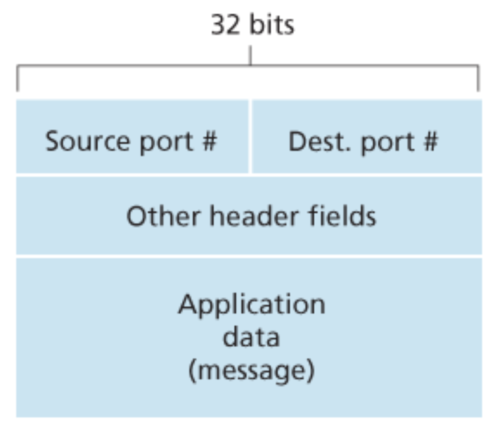<br>

Each port number is a 16-bit number, ranging from 0 to 65'535. The port numbers ranging from 0 to 1023 are called `well-known port numbers` and are restricted, which means that they are reserved for use by well-known application protocols such as HTTP (port number 80) and FTP (port number 21).

#### Connectionless Multiplexing and Demultiplexing
We can describe UDP multiplexing/demultiplexing as follows. Suppose a process in Host A, with UDP port 19157, wants to send a chunk of application data to process with UDP port 42069 in Host B:
1. The transport layer in Host A creates a transport-layer segment that includes the applciation data, the source port number (19157), the destination port number (42069).
2. The transport layer passes the resulting segment to the network layer.
3. The network layer encapsulates the segment in an IP datagram and tries to deliver the segment to the receiving host.
4. If the segment arrives at the receiving Host B, the transport layer examines the destination port number (42069).
5. Finally, the transport layer at the receiving Host B delivers the segment to its socket identified by port 42069.

It is important to note that a UPD socket is fully identified by a two-tuple consisting of a destination IP address and a destiantion port number.

#### Connection-Oriented Multiplexing and Demultiplexing
One subtle difference between a TCP socket and a UDP socket is that a TCP socket is identified by a four-tuple: source IP address, source port number, destination IP address, and destination port number. And therefore, in contrast with UDP, two arriving TCP segments with different source IP addresses or source port numbers will be directed to two different sockets.

Establishing a TCP connection looks something like this:
1. The TCP server application has a "welcoming socket", that waits for connection establishment requests from TCP clients on port number 12000.
2. The TCP client creates a socket and sends a connection establishment request segment, which is nothing more than a TCP segment with destination port number 12000 and a special connection establishment bit set in the TCP header.
3. When the host receives the incoming connection request segment, it locates the server process that is waiting to accept a connection and then creates a new socket.
4. The transport layer at the server also notes the following four values: (1) the source port number in the segment, (2) the IP address of the source host, (3) the destination port number in the segment, and (4) its own IP address. The newly created connection socket is identified by these four values.

In summary, when a TCP segment arrives at the host, all four fields, as described above, are used to direct (`demultiplex`) the segment to the appropriate socket.

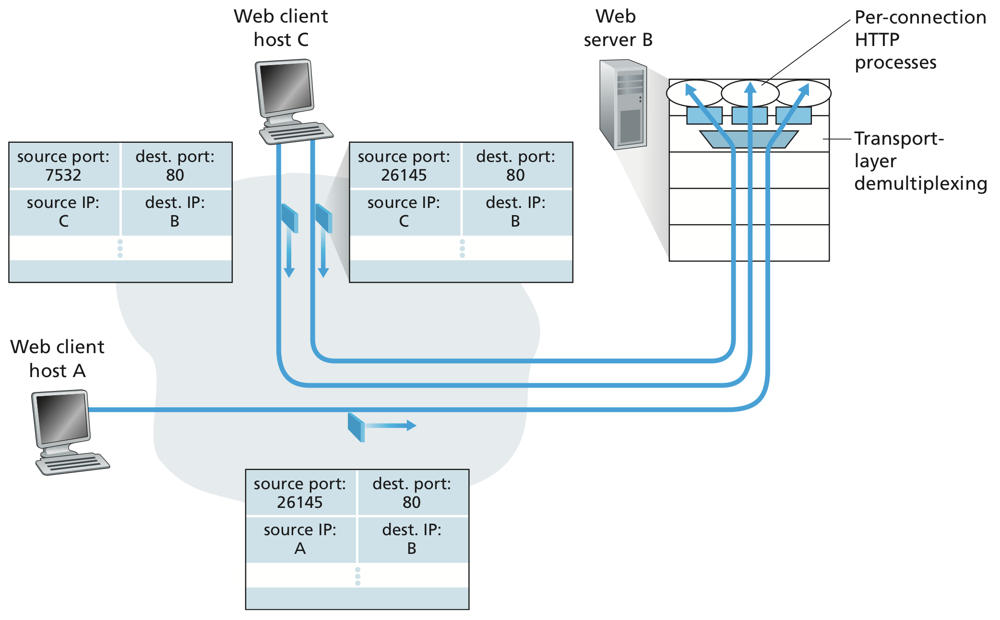<br>

#### Web Servers and TCP
Consider a host running a Web server, such as an Apache Web server, on port 80. When clients send segments to the server, _all_ segments will have destination port 80.
Furthermore, if the client and server are using persistent HTTP, then throughout the duration of the connection the client and server exchange HTTP messages via the same server socket. However, if the client and server use non-persistent HTTP, then a new TCP connection is created and closed for every request/response, and hence, a new socket is created and later closed for every request/response.

## 3.3 Connectionless Transport: UDP
`UDP` does just as little as a transport protocol can do. Aside from the multiplexing/demultiplexing function and some light error checking, it adds nothing to IP.

UDP takes messages from the application process, attaches source and destination port number fields for the multiplexing/demultiplexing service, and passes the resulting segment onto the network layer. The network layer encapsulates the transport-layer segment into an IP datagram and then makes a best-effort attempt to deliver the segment to the receiving host. <br>
Note that with UDP there is no handshaking between sending and receiving transport-layer entities before sending a segment. For this reason, UDP is said to be `connectionless`.

Following some reasons why an application developer would ever choose UDP rather than TCP:
- *Finer application-level control over what data is sent, and when*: Under UDP, as soon as an application process passes data to UDP, UDP will package the data inside a UDP segment and immediately pass the segment to the networky layer. TCP, on the other hand, has a congestion-control mechanism that throttles the transport-layer TCP sender.
- *No connection establishment*: As we'll discuss later, TCP uses a three-way handshake before it starts to transfer data. UDP just blasts away without any formal preliminaries. Thus UDP does not introduce any delay to establish a connection.
- *No connection state*: TCP maintains connection state in the end systems. This connection state includes receive and send buffers, congestion-control parameters, and sequence and acknowledgment number parameters. UDP, on the other hand, does not maintain connection state. For this reason, a server devoted to a particular application can typically support many more active clients when the applciation runs over UDP rather than TCP.
- *Small packet header overhead*: The TCP segment has 20 bytes of header overhead, whereas UDP has only 8 bytes of overhead.

### 3.3.1 UDP Segment Structure
The UDP segment structure is shown in the figure below. The application data occupies the `data field` of the UDP segment. The `UDP header` has only four fields, each consisting of two bytes. The `port numbers` allow the destination host to pass the application data to the correct process. The `length field` specifies the number of bytes in the UDP segment (header plus data). The `checksum` is used by the receiving host to check whether errors have been introduced into the segment.

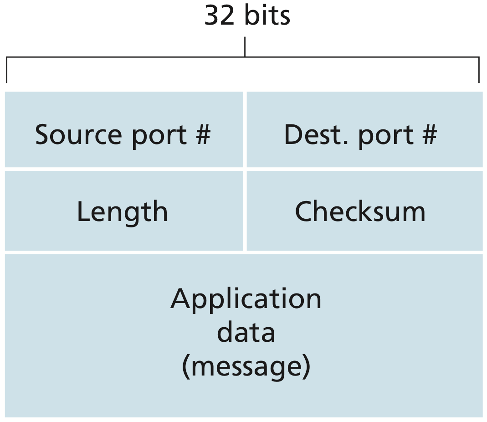<br>

### 3.3.2 UDP Checksum
The UDP checksum provides for error detection. That is, the checksum is used to determine whether bits within the UDP segment have been altered as it moved from source to destination.

UDP at the sender side performs the 1s complement of the sum of all the 16-bit words in the segment, with any overflow encountered during the sum being wrapped around. This result is put in the ckecksum field of the UDP segment. At the receiver, all four 16-bit words are added, including the checksum. If no errors are introduced into the packet, then clearly the sum at the receiver will be `1111111111111111`. If one of the bits is a `0`, then we know that errors have been introduced into the packet.

Given that neither link-by-link reliability nor in-memory error detection is guaranteed, UDP must provide error detection at the transport layer, on an end-end basis. This is an example of the celebrated `end-end principle` in system design.

## 3.4 Principles of Reliable Data Transfer
The problem of implementing reliable data transfer occurs not only at the transport layer, but also at the link layer and the application layer as well. With a `reliable` channel, not transferred data bits are corrupted (flipped from 0 to 1, or vice versa) or lost, and all are delivered in the order in which they were sent.

It is the responsibility of a `reliable data transfer protocol` to implement this service abstraction. This task is made difficult by the fact that the layer below the reliable data transfer protocol may be unreliable.

In the following sections we consider only the case of unidirectional data transfer, that is, data transfer from the sending to the receiving side. The case of reliable bidirectional data transfer is conceptually no more difficult.

### 3.4.1 Building a Reliable Data Transfer Protocol
#### Reliable Data Transfer over a Perfectly Reliable Channel: rdt1.0
We first consider the simplest case, in which the underlying channel is completely reliable. The protocol itself, which we'll call `rdt1.0`, is trivial. The `finite-state machine (FSM)` for the `rdt1.0` sender and receiver is shown in the picture below.

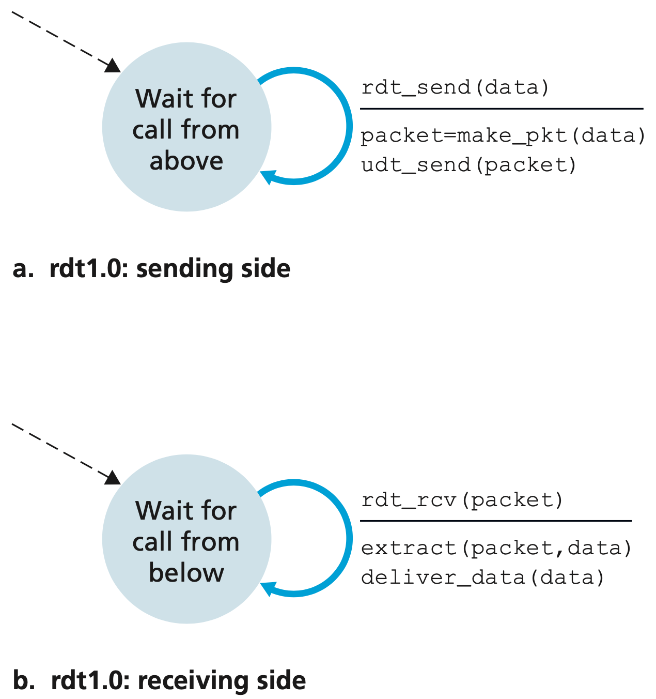<br>

##### Reliable Data Transfer over a Channel with Bit Errors: rdt2.0
A more realistic model of the underlying channel is one in which bits in a packet may be corrupted. Such bit errors typically occur in the physical components of a network as a packet is transmitted, propagates, or is buffered.

We might imagine a message-dictation protocol where the message taker might say "OK" after each understood sentence (`positive acknowledgment`) or "Please repeat that" after each not understood sentence (`negative acknowledgment`). <br>
These control messages allow the receiver to let the sender know what has been received correctly, and what has been received in error and thus requires repeating. Data transfer protocols based on such retransmission are known  as `ARQ (Automatic Repeat reQuest) protocols`.

Fundamentally, three additional protocol capabilities are required in ARQ protocols to handle the presence of bit errors:
- `Error detection`: First, a mechanism is needed to allow the receiver to detect when bit errors have occured.
- `Receiver feedback`: The positive (`ACK`) and negative (`NAK` acknowledgment replies are examples of such feedback.
- `Retransmission`: A packet that is received in error at the receiver will be retransmitted by the sender.

The figure below shows the FSM representation of `rdt2.0`, a data transfer protocol employing error detection, positive acknowledgments, and negative acknowledgments.

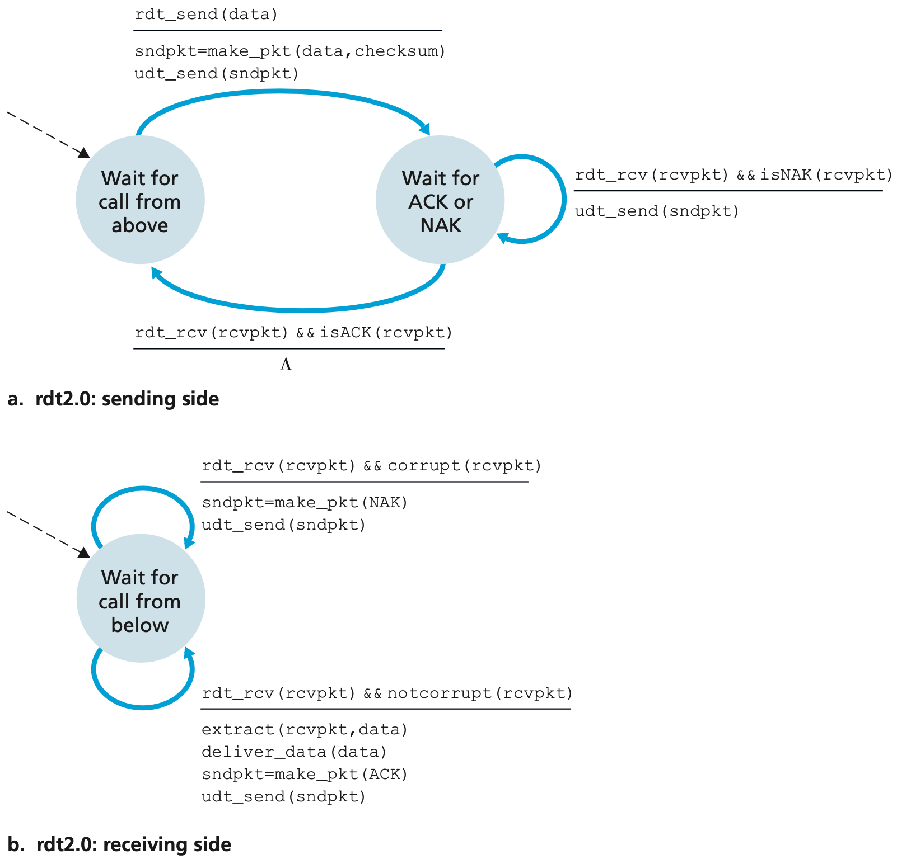<br>

It is important to note that when the sender is in the wait-for-ACK-or-NAK state, it cannot get more data from the upper layer. Thus, the sender will not send a new piece of data until it is sure that the receiver has correctly received the current packet. Because of this behavior, protocols such as `rdt2.0` are known as `stop-and-wait` protocols.

Protocol `rdt2.0` may look as if it works but, unfortunately, it has a fatal flaw. In particular, we haven't accounted for the possibility that the ACK or NAK packet could be corrupted. We will need to add checksum bits to ACK/NAK packets in order to detect such errors. The more difficult question is how the protocol should recover from errors in ACK and NAK packets.

A simple solution to this new problem is to add a new field to the data packet and have the sender number its data packets by putting a `sequence number` into this field. The receiver then need only check this sequence number to determine whether or not the received packet is a retransmission. For our simple example, a 1-bit sequence number will suffice.

The figure below shows the FSM description for `rdt2.1`, our fixed version of `rdt2.0`. <br>
**rdt2.1 sender**

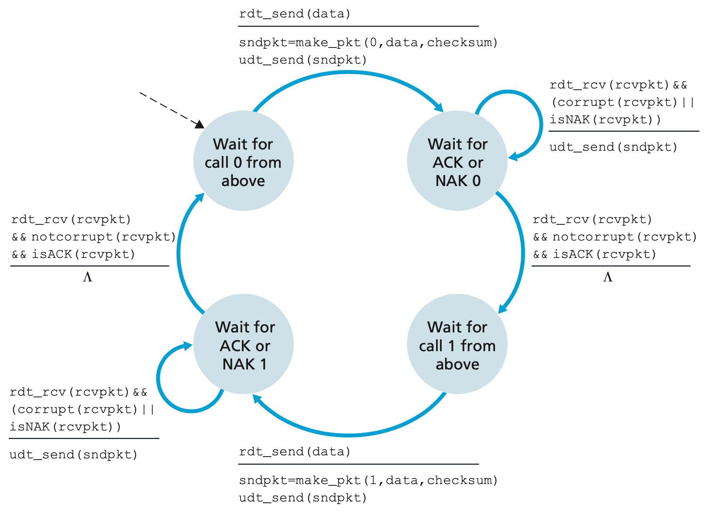<br>

**rdt2.1 receiver**

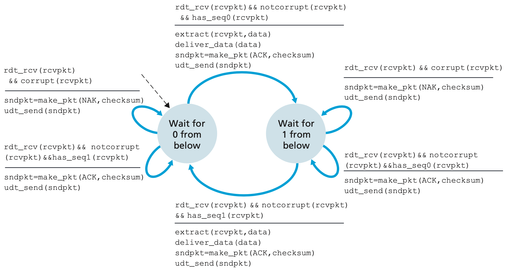<br>

We can accomplish the same effect as a NAK if, instead of sending a NAK, we send an ACK for the last correctly received packet. A sender that receives two ACKs for the same packet knows that the receiver did not correctly receive the packet following the packet that is beeing ACKed twice.

#### Reliable Data Transfer over a Lossy Channel with Bit Errors: rdt3.0
Suppose now that in addition to corrupting bits, the underlying channel can `lose packets` as well, a not-uncommon event in today's computer networks. Two additional concerns must now be addressed by the protocol: how to detect packet loss and what to do when a packet loss occurs.

Suppose that the sender transmits a data packet and either that packet, or the receiver's ACK of that packet, gets lost. In either case, no reply is forthcoming at the sender from the receiver. If the sender is willing to wait long enough so that it is certain that a packet has been lost, it can simply retransmit the data packet. But how long must the sender wait to be certain that something has been lost?

The approach adopted in practice is for the sender to judiciously choose a time value such that packet loss is likely, although not guaranteed, to have happened.If an ACK is not received within this time, the packet is retransmitted.

The figure below shows the sender FSM for `rdt3.0`, a protocol that reliably tranfers data over a channel that can corrupt or lose packets.

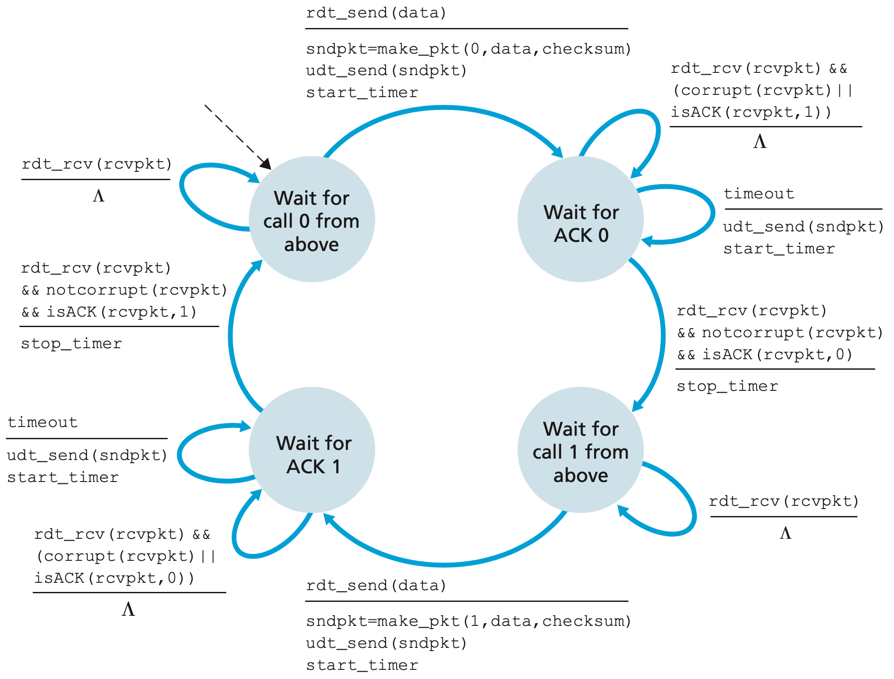<br>

Becuase the packet sequence numbers alternate between 0 and 1, protocol `rdt3.0` is sometimes known as the `alternating-bit protocol`.

### 3.4.2 Pipelined Reliable Data Transfer Protocols
Protocol `rdt3.0` is a functionally correct protocol. At the heart of `rdt3.0`'s performance problem is the fact that it is a stop-and-wait protocol.

The solution to this particular performance problem is rather simple: Rather than operate in a stop-and-wait manner, the sender is allowed to send multiple packets without waiting for acknowledgments. Since the many in-transit sender-to-receiver packets can be visualized as filling a pipeline, this technique is known as `pipelining`. Pipelining has the following consequences for reliable data trasnfer protocols:
- The range of sequence numbers must be increased, since each in-transit packet must have a unique sequence number.
- The sender and receiver sides of the protocols may have to buffer more than one packet. Minimally, the sender will have to buffer packets that have been transmitted but not yet acknowledged.
- The manner in which a protocol responds to lost, corrupted, and overly delayed packets must be adjusted. Two basic approaches toward piepelined error recovery can be identified: `Go-Back-N` and `selective repeat`.

### 3.4.3 Go-Back-N (GBN)
In a `Go-Back-N (GBN) protocol`, the sender is allowed to transmit multiple packets without waiting for an acknowledgment, but is constrained to have no more than some maximum allowable number, `N`, of unacknowledged packets in the pipeline.

The figure below shows the sender's view of the range of sequence numbers in GBN protocol.

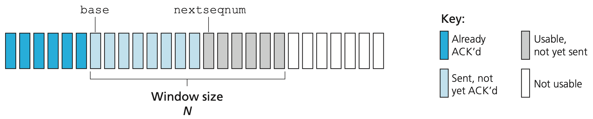<br>

If we define `base` to be the sequence number of the oldest unacknowledged packet and `nextseqnum` to be the smallest unused sequence number. Sequence numbers in the interval `[0, base-1]` correspond therefore to packets that have been transmitted and acknowledged. The interval `[base, nextseqnum-1]` corresponds to packets that have been sent but not yet acknowledged. Sequence numbers in the interval `[nextseqnum, base+N-1]` can be used for packets that can be sent immediately, should data arrive from the upper layer. Finally, sequence numbers greater than or equal to `base+N` cannot be used until an acknowledged packet currently in the pipeline has been acknowledged. <br>
As the protocol operates, the window slides forward over the sequence number space. For this reason, $N$ is often referred to as the `window size` and the GBN protocol itself as a `sliding-window protocol`.

The two figures below give an extended FSM description of the sender and receiver sides of an ACK-based, NAK-free, GBN protocol.

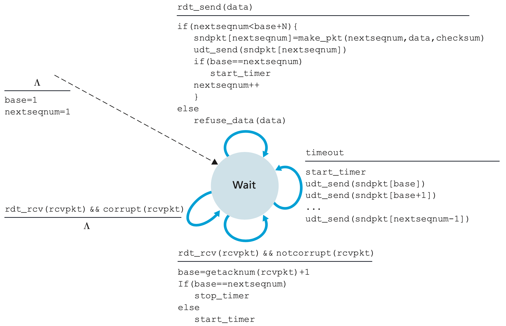<br>

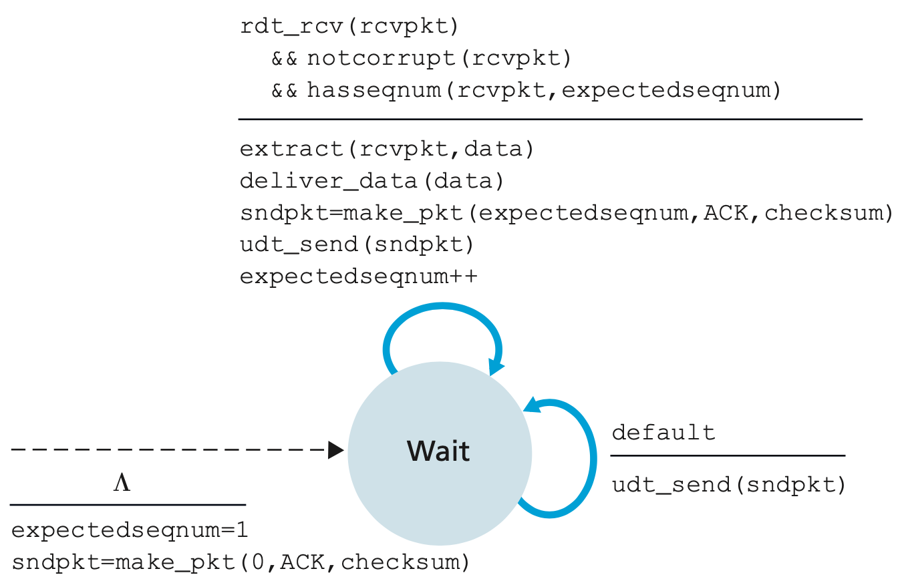<br>

The GBN sender must respond to three types of events:
- *Invocation from above*: When `rdt_send()` is called from above, the sender first checks to see if the window is full. If the window is not full, a packet is created and sent, and variables are appropriately updated. If the window is full, the sender simply returns the data back to the upper layer.
- *Receipt of an ACK*: In our GBN protocol, an acknowledgment for a packet with the sequence number $n$ will be takren to be a `cumulative acknowledgment`, indicating that all packets with sequence number up to and including $n$ have been correctly received.
- *A timeout event*: The protocol's name is derived from the sender's behavior in the presence of lost or overly delayed packets. If a timeout occurs, the sender resends all packets that have been previously sent but that have not yet been acknowledged.

The receiver's actions in GBN are also simple. If a apcket with the sequence number $n$ is received correctly and is in order, the receiver sends an ACK for packet $n$ and delivers the data portion of the packet to the upper layer. In all other cases, the receiver discards the packet and resends an ACK for the most recently received in-order packet.

It is important to note, that in our GBN protocol, the receiver discards out-of-order packets. The advantage of this approach is the simplicity of receiver buffering - the receiver need not buffer any out-of-order packets.

### 3.4.4 Selective Repeat (SR)
There are scenarios in which GBN itself suffers from performance problems. In particular, when the window size and bandwidth-delay product are both large, many packets can be in the pipeline. A single packet error can thus cause GBN to retransmit a large number of packets.

As the name suggests, selective-repeate protocols avoid unnecessary retransmissions by having the sender retransmit only those packets that it suspects were received in error at the receiver. The SR receiver will acknowledge a correctly received packet whether or not it is in order. Out-of-order packets are buffered until any missing packets are received, at which point a batch of packets can be delivered in order to the upper layer.

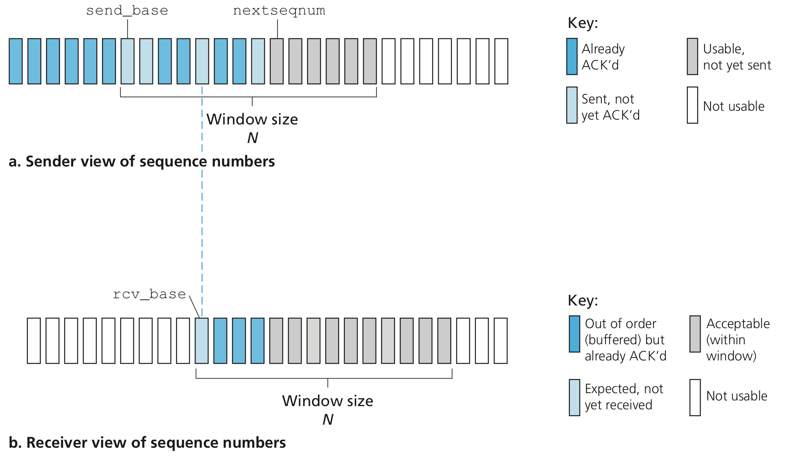<br>

**SR sender events and actions:**
1. *Data received from above*: When data is received from above, the SR sender checks the next available sequence number for the packet. If the sequence number is within the sender's window, the data is packetized and sent.
2. *Timeout*: Timers are again used to protect against lost packets. However, each pacvket must now have its own logical timer, since only a single packet will be transmitted on timeout.
3. *ACK received*: If an ACK is received, the SR sender marks that packet as having been received, provided it is in the window.

**SR receiver events and actions:**
1. *Packet with sequence number in* `[rcv_base, rcv_base+N-1]` *is correctly received*: In this case, the received packet falls within the receiver's window and a selective ACK packet is returned to the sender.If the packet was not previously received, it is buffered. If this packet has a sequence number equal to the base of the receive window, then this packet, and any previously buffered and consecutively numbered packets are delivered to the upper layer.
2. *Packet with sequence number in* `[rcv_base-N, rcv_base-1]` *is correctly received*: In this case, an ACK must be generated, even though this is a packet that the receiver has previously acknowledged.
3. *Otherwise*: Ignore the packet.

## 3.5 Connection-Oriented Transport: TCP
Now that we have covered the underlying principles of reliable data transfer, let's turn to `TCP` - the Internet's transport-layer, connection-oriented, reliable transport protocol. In this section, we'll see that in order to provide reliable data transfer, TCP relies on many of the underlying principles discussed in the previous section.

### 3.5.1 The TCP Connection
TCP is said to be `connection-oriented` because before one application process can begin to send data to another, the two processes must first "handshake" with each other - that is, they must send some preliminary segments to each other to establish the parameters of the ensuing data transfer.

A TCP connection provides a `full-duplex service`: If there is a TCP connection between Process A on one host and Process B on anothert host, then application-layer data can flow from Process A to Process B at the same time as applciation-layer data flows from Process B to Process A. A TCP connection is also alway `point-to-point`, that is, between a single sender and a single receiver.

Let's now take a look at how a *TCP connection is established*. Suppose a process running in one host wants to initiate a connection with another process in another host. TCP in the client then proceeds to establish a TCP connection with TCP in the server. The client first sends a special TCP segment, the server responds with a second special TCP segment, and finally the client responds again with a third special segment. This connection-establishment procedure is often referred to as a `three-way handshake`.

Let's consider the sending of data from the client process to the server process. The client process passes a stream of data through the socket. After that, the data is in the hands of TCP running in the client. TCP directs this data to the connection's `send buffer`. From time to time, TCP will grab chunks of data from the send buffer and pass the data to the network layer. The maximum amount of data that can be grabbed and placed in a segment is limited by the `maximum segment size (MSS)`. The MSS is typically set by first determining the length of the largest link-layer frame that can be sent by the local sending host (the so-called `maximum transmission unit (MTU))`, and then setting the MSS to ensure that a TCP segment plus the TCP/IP header length will fit into a single link-layer frame.

TCP pairs each chunk of client data with a TCP header, thereby forming `TCP segments`. The segments are passed down to the network layer, where they are separately ecapsulated within networky-layer IP datagrams. The IP datagrams are then sent into the network. When TCP receives a segment at the other end, the segment's data is placed in the TCP connection's receive buffer. The application reads the stream of data from this buffer.

### 3.5.2 TCP Segment Structure
The TCP segment consists of header fields and a data field. The data field contains a chunk of application data. As mentioned above, the MSS limits the maximum size of a segment's data field.

As with UDP, the header includes `source and destination port numbers`, which are used for multiplexing/demultiplexing data from/to upper-layer applications. Also, as with UDP, the header incldues a `checksum field`. A TCP segment header also contains the following fields:
- The 32-bit `sequence number field` and the 32-bit `acknowledgment number field` are used by the TCP sender and receiver in implementing a reliable data transfer service.
- The 16-bit `receive window field` is used for flow control.
- The 4-bit `header length field` specifies the length of the TCP header in 32-bit words.
- The optional and variable-length `options field` is used when a sender and receiver negotiate the maximum segment size (MSS) or as a window scaling factor for use in high-speed networks.
- The `flag field` contains 6 bits:
	- The `ACK bit` is used to indicate that a value carried in the acknowledgment field is valid.
	- The `RST, SYN,` and `FIN`bits are used for connection setup and teardown.
	- The `CWR` and `ECE` bits are used in explicit congestion notification.
	- Setting the `PSH` bit indicates that the receiver should pass the data to the upper layer immediately.
	- The `URG` bit is used to indicate that there is data in this segment that the sending-side upper-layer entitiy has marked as "urgent".

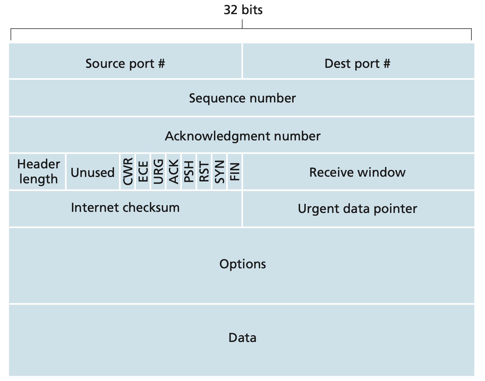<br>

#### Sequence Numbers and Acknowledgment Numbers
Two of the most important fields in the TCP segment header are the sequence number field and the acknowledgment number field. These fields are critical part of TCP's reliable data transfer service. The `sequence number for a segment` is therefore the byte-stream number of the first byte in the segment. For the acknowledgment number we consider Host A and Host B sending data from one to each other. Each of the segments that arrive from Host B have a sequence number for the data flowing from B to A. The `acknowledgment number` that Host A puts in its segment is the sequence number of the next byte Host A is expencting from Host B.

Because TCP only acknowledges bytes up to the first missing byte in the stream, TCP is said to provide `cumulative acknowledgments`.

### 3.5.3 Round-Trip time Estimation and Timeout
TCP, like our `rdt` protocol in the previous section, uses a timeout/retransmit mechanism to recover from lost segments. One of the most obvious questions is the `length of the timeout intervals`. Clearly, the timeout should be larger than the connection's round-trip time (RTT), that is, the time from when a segment is sent until it is acknowledged.

#### Estimating the Round-Trip Time
The sample RTT, denoted `SampleRTT`, for a segment is the amount of time between when the segment is sent and when an acknowledgment for the segment is received. Instead of measuring a `SampleRTT` for every transmitted segment, most TCP implementations take only one `SampleRTT` measurement at a time. Furthermore, TCP maintains an average, called `EstimatedRTT`, of the `SampleRTT` values. Upon obtaining a new `SampleRTT`, TCP updates `EstimatedRTT` according to the following formula:

$$\text{EstimatedRTT} = (1 - \alpha) \cdot \text{EstimatedRTT} + \alpha \cdot \text{SampleRTT}$$

The recommended value of $\alpha$ is $\alpha = 0.125$. <br>
In addition to having an estimate of the RTT, it is also valuable to have a measure of the variability of the RTT. We define the RTT variation, `DevRTT`, as an estimate of how much `SampleRTT` typically deviates from `EstimatedRTT`:

$$\text{DevRTT} = (1- \beta) \cdot \text{DevRTT} + \beta \cdot | \text{SampleRTT} - \text{EstimatedRTT} |$$

If the `SampleRTT` values have little fluctuation, `DevRTT` will be small. On the other hand, if there is a lot of fluctuation, `DevRTT` will be large. The recommended value of $\beta$ is $0.25$.

#### Setting and Managing the Retransmission Timeout Interval
All of the above meantioned measurements are taken into account in TCP's method for determining the retransmission timeout interval:

$$\text{TimeoutInterval} = \text{EstimatedRTT} + 4 \cdot \text{DevRTT}$$

An initial `TimeoutInterval` value of 1 second is recommended.

### 3.5.4 Reliable Data Transfer
Recall that the Internet's network-layer service (IP service) is unreliable. IP does not guarantee datagram delivery, does not guarantee in-order delivery of datagrams, and does not guarantee the integrity of the data in the datagrams. TCP, however, creates a `reliable data transfer service` on top of IP's unreliable best-effort service. TCP's reliable data transfer service ensures that the data stream that a process reads out of its TCP receive buffer is uncorrupted, without gaps, without duplication, and in sequence.

In our earlier developement of reliable data transfer techniques, it was conceptually easiest to assume that an individual timer is associated with each transmitted but not yet acknowledged segment. While this is great in theory, timer management can require considerable overhead. Thus, the recommended TCP timer management procedures use only a single retransmission timer, even if there are multiple transmitted but not yet acknowledged segments.

The code below presents a highly simplified description of a TCp sender. We see that there are three major events related to data transmission and retransmissio in the TCP sender: data received from application above, timer timeout, and ACK receipt.

```pseudocode
	NextSeqNum = InitialSeqNumber;
	SendBase = InitialSeqNumber;

	loop(forever) {
		switch(event) {
			event: data received from application above
				create TCP segment with sequence number NextSeqNum
				if(timer currently not running) {
					start timer
				}
				pass segment to IP
				nextSeqNum = NextSeqNum + length(data)
				break;
			
			event: timer timeout
				retransmit not-yet-acknowledged segment with
					smallest sequence number
				start timer
				break;
			
			event: ACK received, with ACK field value of y
				if(y > SendBase) {
					SendBase = y
					if(there are currently any not-yet-acknowledged segments) {
						start timer
					}
				}
				break,
		}
	} /* end of forever loop */
```
Upon occurrence of the first major event, TCP `receives data from the application`, encapsulates the data in a segment, and passes the segment to IP.<br>
The second major event is the `timeout`. TCP responds to the timeout event by retransmitting the segment that caused the timeout. TCP then restarts the timer.<br>
The third major event that must be handled by the TCP sender is the arrival of an acknowledgment segment (ACK) from the receiver.

TCP uses `cumulative acknowledgments`, so that $y$ acknowledges the receipt of all bytes before byte number $y$. If $y > \text{SendBase}$, then the ACK is acknowledging one or more previously unacknowledged segments. thus the sender updates its `SendBase` variable.

#### Doubling the Timeout Interval
The first modification that most TCP implementations employ concerns the length of the timout interval after a timer expiration. In this modification, whenever the timeout event occurs, TCP retransmits the not-yet-acknowledged segment with the smallest sequence number, as described above. But each time TCP retransmits, it sets the next timeout interval to twice the previous value. Thus the intervals grow exponentially after each retransmission.


## 3.6 Principles of Congestion Control


## 3.7 TCP Congestion Control