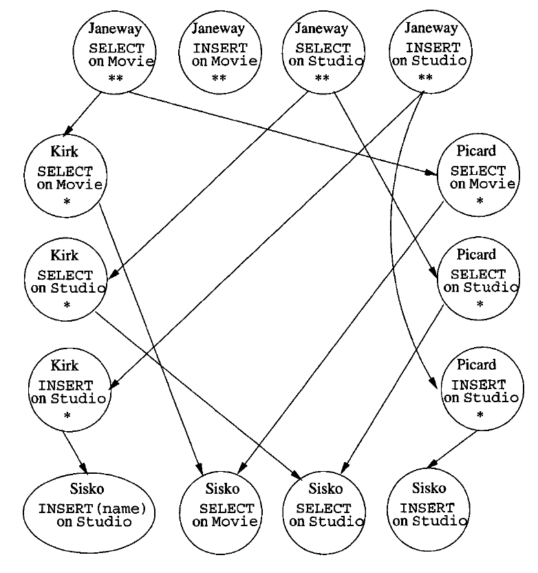
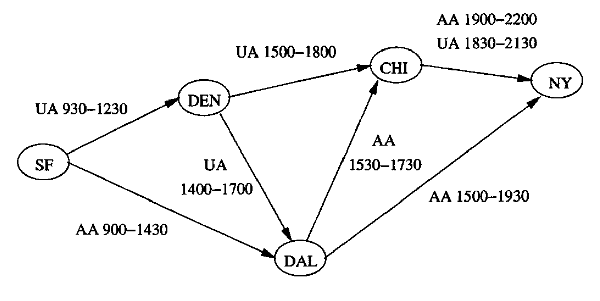

# Data Modelling and Databases - Chapter 10 (Book)
- Author: Ruben Schenk
- Date: 13.05.2021
- Contact: ruben.schenk@inf.ethz.ch

# 10. Advanced Topics in Relational Databases
## 10.1 Security and User Authorization in SQL
SQL postulates the existence of `authorization ID's`, which are essentially user names. SQL also has a special authorization ID called `PUBLIC`, which includes any user. Authroiztaion ID's may be granted privileges, much as they would be in the file system environment maintained by an operating system.

### 10.1.1 Privileges
SQL defines nine types of privileges: SELECT, INSERT, DELETE, UPDATE, REFERENCES, USAGE, TRIGGER, EXECUTE, and UNDER.

The first four of these apply to a relation, which may be either a base table or a view. As their names imply, they give the holder of the privilege the right to query (select from) the relation, insert into the relation, delete from the relation, and update tuples of the realtion, respectively.  
SELECT, INSERT, and UPDATE may also have an associated list of attributes, for instance, SELECT(name, addr). If so, then only those attributes may be seen in a selection, specified in an insertion, or changed in an update, respectively.

The REFERENCES privilege on a relation is the right to refer to that relation in an integrity constraint. These constraints may take any of the forms mentioned in Chapter 7, such as assertions, attribute- or tuple-based checks, or referential integrity constraints. The REFERENCES privilege may also have an attached list of attributes, in which case only those attributes may be referenced in a constraint.

USAGE is aprivilege that applies to several kinds of schema elements other than relations and assertions. It is the right to use that element in one's own declarations.

The TRIGGER privilege on a relation is the right to define triggers on that relation.

EXECUTE is the right to execute a piece of code, such as a PSM procedure or function.

Finally, UNDER is the right to create subtypes of a given type.

### 10.1.2 Creating Privileges
There are two aspects to the awarding of privileges: how they are created initially, and how they are passed from user to user.  
First, SQL elements such as schemas or modules have an owner. The owner of something has all privileges associated with that thing. There are three points at which ownership is established in SQL:
1. When a schema is created, it and all the tables and other schema elements in it are owned by the user who created it.
2. When a session is initiated by a CONNECT statement, there is an opportunity to indicated the user with an AUTHORIZATION clause.
3. When a module is created, there is an option to give it an owner by using an AUTHORIZATION clause.

### 10.1.3 The Privilege-Checking Process
As we saw above, each module, schema, and session has an associated user. In SQL terms, there is an associated authorization ID for each. Any SQL operation has two parties:
1. The database elements upon which the operation is performed and
2. The agent that causes the operation.

The privileges available to the agent derive from a particular authorization ID called the `current authorization ID`. That ID is either
1. The module authorization ID, if the module that the agent is executing has an authorization ID, or
2. The session authorization ID if not.

We may execute the SQL operation only if the current authorization ID possesses all the privileges needed to carry out the operation on the database elements involved.

### 10.1.4 Granting Privileges
So far, the only way we have seen to have privileges on a database element is to be the creator or owner of that element. SQL provides a `GRANT` statement to allow one user to give a privilege to another. The first user retains the privilege granted, as well. Thus, `GRANT` can be thought of as "*copy a privilege*".

There is one important difference between granting privileges and copying. Each privilege has an associated `grant option`. That is, one user may have a privilege like SELECT on table *Movies* "with grant option". Then the first user may grant the privilege SELECT on *Movies* to a third user.

A `grant statement` has the form:

```sql
    GRANT <privilege list> ON <database element> TO <user list>
```

possibly followed by `WITH GRANT OPTION`.  
The database element is typically a relation, either a base table or a view. If it is another kind of element, the name of the element is preceded by the type of that element, e.g., ASSERTION.

### 10.1.5 Grant Diagrams
Because of the complex web of grants and overlapping privileges that may result from a sequence of grants, it is useful to represent grants by a graph called a `grant diagram`. A SQL system maintains a representation of this diagram to keep track of both privileges and their origins.

The nodes of a grant idagram correspond to a user and a privilege. A user may hold two privileges, one of which is strictly more general than the other (e.g., SELECT on $R$ and SELECT on $R(A)$). These two privileges are also represented by two different nodes.

If user $U$ grnats privileges $P$ to user $V$, and this grant was based on the fact that $U$ holds privilege $Q$ ($Q$ could be $P$ with hte grant option, or it could be some generalization of $P$), then we create an arc from the node for $U/Q$ to the node $V/P$.

Example: Following an example of a grant diagram:

<br>

### 10.1.6 Revoking Privileges
A granted privilege can be revoked at any time. The revoking of privileges may be required to `cascade`, in the sense that revoking a privilege with the grant option that has been passed on to other users may require those privileges to be revoked too. The simple form of a `revoke statement` begins with:

```sql
    REVOKE <privilege list> ON <database element> FROM <user list>
```

The statement ends with one of the following:
1. `CASCADE`. If chosen, then when the specified privileges are revoked, we also revoke any privileges that were granted only because of the revoked privileges.
2. `RESTRICT`. In this case, the revoke statement cannot be executed if the cascading rule described in the previous item would result in the revoking of any privileges due to the revoked privileges having been passed on to others.

It is permissible to replace `REVOKE` by `REVOKE GRANT OPTION FOR`, in which case the core privileges themselves remain, but the option to grant them to others removed.

## 10.2 Recursion in SQL
### 10.2.1 Defining Recursive Relations in SQL
The `WITH` statement in SQL allows us to define temporary relations, recursive or not. To define a recursive relation, the relation can be used within the WITH statement itself. A simple form of the WITH statement is:

```sql
    WITH R AS <definition of R> <query involving R>
```

That is, one defines a temporary relation named $R$, and then uses $R$ in some query. The temporary relation is not available outside the query that is part of the WITH statement.

Example: The figure below shows a graph representing some flights of two hypothetical airlines.

<br>

The simplest recursive question we can ask is "For what pairs of cities $(x, y)$ is it possible to get from city $x$ to city $y$ by taking one or more flights?" Before writing this query in recursive SQL, it is useful to express the recursion in the Datalog notation of Section 5.3.

The following two Datalog rules describe a relation $Reaches(x,y)$  that contains exactly these pairs of cities.

$$
Reaches(x,y) \leftarrow Flights(a,x,y,d,r) \\
Reaches(x,y) \leftarrow Reaches(x,z) \land Reaches(z,y)
$$

The first rule says that $Reaches$ contains those pairs of cities for which there is a direct flight from the first to the second. The airline $a$, departure time $d$, and arrival time $r$ ar arbitrary in this rule. The second rule says that if you can reach from city $x$ to city $z$ and you can reach from $z$ to city $y$, then you can reach from $x$ to $y$.

From the two Datalog rules for $Reaches$ we can develop a SQL query that produces the relation $Reaches$. This SQL query places the Datalog rules for $Reaches$ in a WITH statement, and follows it by a query:

```sql
    /* Code 10.8: Recursive definitions in SQL. */
    WITH RECURSIVE Reaches(frm, to) AS
            (SELECT from, to FROM Flights)
        UNION
            (SELECT R1.frm, R2.to
             FROM Reaches R1, Reaches R2
             WHERE R1.to = R2.frm)
    SELECT * FROM Reaches;
```

### 10.2.2 Problematic Expressions in Recursive SQL
The SQL standard for recursion does not allow an arbitrary collection of mutually recursive relations to be written in a WITH clause. There is a small matter that the standard requires only that *linear* recursion be supported.

Furthermore, to be a legal SQL recursion, the definition of a recursive relation $R$ may be involve only the use of mutually recursive relation $S$ (including $R$ itself) if that use is *monotone in $S$. A use of $S$ is `monotone` if adding an arbitrary tuple to $S$ might add one or more tuples to $R$, or it might leave $R$ unchanged, but it can never cause any tuple to be deleted from $R$.