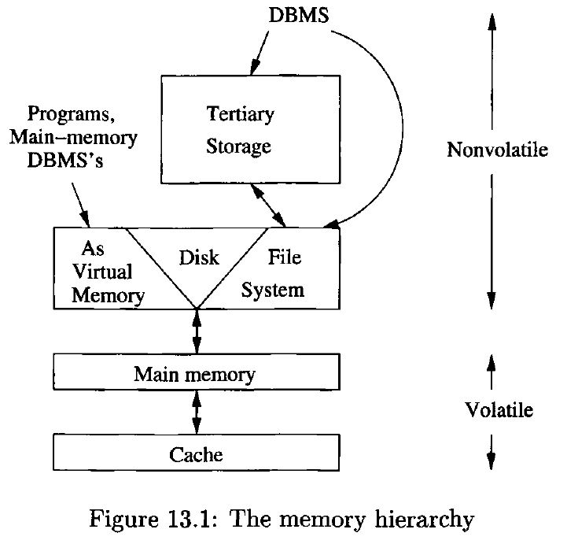
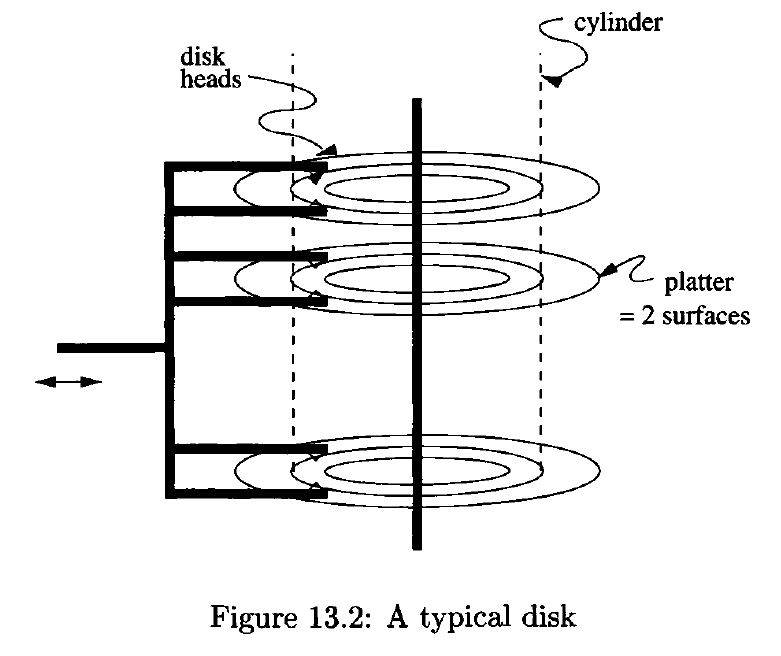
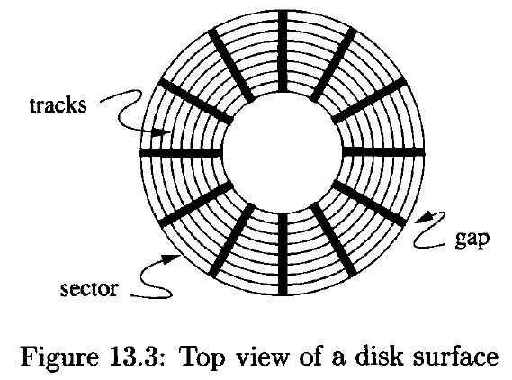
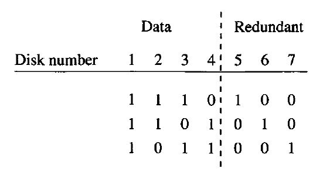
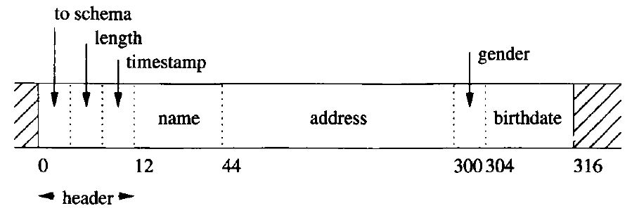
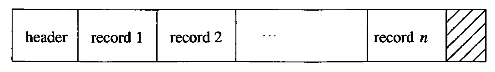
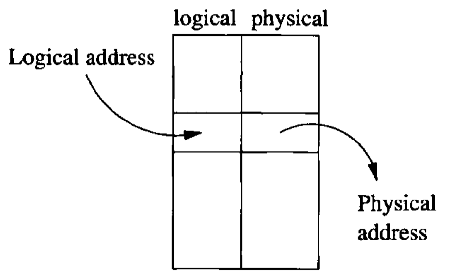
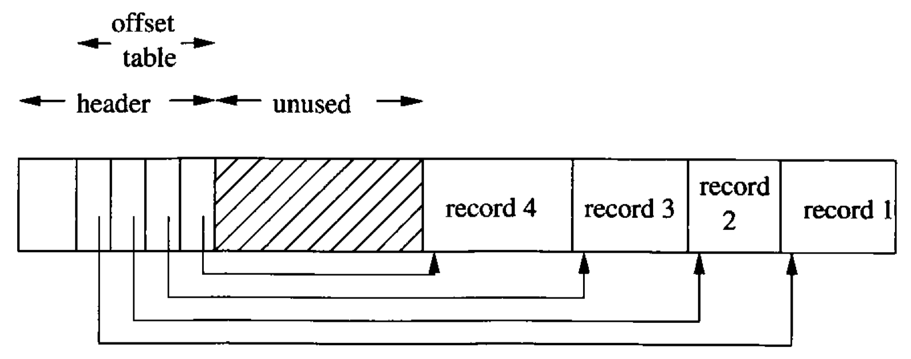

# Data Modelling and Databases - Chapter 13 (Book)

- Author: Ruben Schenk
- Date: 18.05.2021
- Contact: ruben.schenk@inf.ethz.ch

# 13. Secondary Storage Management

Database systems always involve secondary storage - the disks and other device that store large amounts of data that persist over time. This chapter summarizes what we need to know about how a typical computer system manages storage. We review the memory hierarchy of devices with progressively slower access but larger capacity.

## 13.1 The Memory Hierarchy

We begin this section by examining the memory hierarchy of a computer system. We then focus on disks, by far the most common device at the "secondary-storage" level of the hierarchy.

### 13.1.1 The Memory Hierarchy

A schematic of the `memory hierarchy` ish shown in the figure below:

<br>

*Figure 13.1: The memory hierarchy.*

Here are brief descriptions of the levels, from the lowest, or fastest-smallest level, up.

1. `Cache`: A typical machine has a megabyte or more of cache storage. `On-board cache` is found on the same chip as the microprocessor itself, and additional `level-2 cache` is found on another chip. Cached data can be accessed by the processor in a *few nanoseconds*.
2. `Main Memory`: In the center of the action is the computer's main memory. We may think of everything that happens in the computer - instruction executions and data manipulations - as working on information that is resident in main memory. Typical times to move data from main memory to the processor oe cache are in the *10-100 nanosecond* range.
3. `Secondary Storage`: Secondary storage is typically magnetic disk, a device we shall consider in detail in Section 13.2. In 2008, single disk units have capacities of up to a terabyte. The time to transfer a single byte between disk and main memory is around *10 milliseconds*.
4. `Tertiary Storage`: There are databases much larger than what can be stored on the disk(s) of a single machine, or even several machines. To serve such needs, tertiary storage devices have been developed to hold data volumes measured in terabytes. Retrieval takes *seconds or minutes*, but capacities in the petabyte range are possible.

### 13.1.2 Transfer of Data Between Levels

Normally, data moves between adjacent levels of the hierarchy. At the secondary and tertiary levels, accessing the desired data or finding the desired place to store data takes a great deal of time.

Important for understanding the operation of a database system is the fact that the disk is organized into `disk blocks` (or just *blocks*, or as in operating systems, *pages*) of perhaps 4-64 kilobytes. Entire blocks are moved to or from a continuous section of main memory called a `buffer`.  
At a lower level, movement between main memory and cache is by units of `cache lines`, typically 32 or consecutive bytes. The hope is that entire cache lines will be used together.

### 13.1.3 Volatile and Nonvolatile Storage

An additional distinction among storage devices is whether they are `volatile` or `nonvolatile`. A volatile device "forgets" what is stored in it when the power goes off. A nonvolatile device, on the other hand, is expected to keep its contents intact even for long periods when the device is turned off or there is a power failure.

Magnetic and optical materials hold their data in the absence of power. Thus, essentially all secondary and tertiary storage devices are nonvolatile. On the other hand, main memory is generally volatile.

### 13.1.4 Virtual Memory

Typical software executes in `virtual-memory`, an address space that is typically 32 bits, i.e., there are $2^{32}$ bytes, or 4 gigabytes, in a virtual memory. The operating system manages virtual memory, keeping some of it in main memory and the rest on the disk.

The path in Fig. 13.1 does not represent the typical way data in a database is managed, since a DBMS manages the data itself. However, there is increasing interest in `main-memory database system`, which do indeed manage their data through virtual memory, relying on the operating system to bring needed data into main memory through the paging mechanism.

## 13.2 Disks

The use of secondary storage is one of the important characteristics of a DBMS, and secondary storage is almost exclusively based on magnetic disks. Thus, we must examine the operation of disks in detail.

### 13.2.1 Mechanics of Disks

The two principal moving pieces of a disk drive are shown in Fig. 13.2 below. They are a `disk assembly` and a `head assembly`. The disk assembly consists of one or more circular `platters` that rotate around a central spindle. The upper and lower surfaces of the platters are covered with a thin layer of magnetic material, on which bits are stored.

The disk is organized into `tracks`, which are concentric circles on a single platter. The tracks that are at fixed radius from the center, among all the surfaces, form one `cylinder`.

Tracks are organized into `sectors`, which are segments of the circle separated by `gaps` that are not magnetized to represent either $0$'s or $1$'s.

<br>

*Figure 13.2.: A typical disk.*

<br>

*Figure 13.3: Top view of a disk surface.*

The second movable piece shown in Fig 13.2, the head assembly, holds the `disk heads`. For each surface there is one head, riding extremely close to the surface but never touching it. A head reads the magnetism passing under it, and can also alter the magnetism to write information on the disk.

Example: The *Megatron 747* disk has the following characteristics, which are typical of a large vintage-2008 disk drive:

- There are eight platters providing sixteen surfaces.
- There are $2^{16}$, or $65'536$, tracks per surface.
- There are (on average) $2^8 = 256$ sectors per track.
- There are $2^{12} = 4096$ bytes per sector.

The capacity of the disk is the product of 16 surfaces, times 65'536 tracks, times 265 sectors, times 4096 bytes, or $2^{40}$ bytes. The Megatron 747 is thus a terabyte disk.

### 13.2.2 The Disk Controller

One or more disk drives are controlled by a `disk controller`, which is a small processor capable of:

1. Controlling the mechanical actuator that moves the head assembly, to position the heads at a particular radius.
2. Selecting a sector from among all those in the cylinder at which the heads are positioned.
3. Transferring bits between the desired sector and the computer's main memory.
4. Possibly, buffering an entire track or more in local memory of the disk controller.

### 13.2.3 Disk Access Characteristics

`Accessing` (reading or writing) a block requires three steps, and each step has an associated delay.

1. The disk controller positions the head assembly at the cylinder containing the track on which the block is located. The time to do so is the `seek time`.
2. The disk controller waits while the first sector of the block moves under the head. This time is called the `rotational latency`.
3. All the sectors and the gaps between them pass under the head, while the disk controller reads or writes data in these sectors. This delay is called the `transfer time`.

The sum of the seek time, rotational latency, and transfer time is the `latency` of the disk.

## 13.3 Accelerating Access to Secondary Storage

Just because a disk takes an average of, say, 10 milliseconds to access a block, it does not follow that an application such as a database system will get the data it requests 10 milliseconds after the request is sent to the disk controller.  
In the worst case, a request for a disk access arrives more than once every 10 milliseconds, and these requests back up indefinitely. In that case, the `scheduling latency` becomes infinite.

There are several things we can do to decrease the average time a disk access takes, and thus improve the `throughput`. 

We consider a number of techniques for speeding up typical database accesses to disk:
1. Place blocks that are accessed together on the same cylinder, so we can often avoid seek time.
2. Divide the data among several smaller disks rather than one large one.
3. "Mirror" a disk: making two or more copies of the data on different disks. This strategy lets us access several blocks at once.
4. Use a disk-scheduling algorithm, either in the operating system, in the DBMS, or in the disk controller.
5. Prefetch blocks to main memory in anticipation of their later use.

### 13.3.1 The I/O Model of Computation

Let us imagine a simple computer running a DBMS and trying to serve a number of users. For the moment, assume our computer has one processor, one disk controller, and one disk. The database itself is much too large to fit in main memory.  
The following rule, which defines the `I/O model of computation`, can be assumed:

> `Dominance of I/O cost`: The time taken to perform a disk access is much larger than the time likely to be used manipulating the data in main memory. Thus, the number of block accesses (*Disk I/O's*) is a good approximation to the time needed by the algorithm and should be minimized.

### 13.3.2 Organizing Data by Cylinders

Since seek time represents about half the time it takes to access a block, it makes sense to store data that is likely to be accessed together, such as relations, on a single cylinder, or on as many adjacent cylinders as are needed. In fact, if we choose to read all the blocks on a single track or on a cylinder consecutively, then we can neglect all but the first seek time and the first rotational latency.

### 13.3.3 Using Multiple Disks

We can often improve the performance of our system if we replace one disk, with many heads locked together, by several disks with their independent heads.

Using several disks can increase the ability of a database system to handle heavy loads of disk-access requests. However, as long as the system is not overloaded, there is no change in how long it takes to perform any single block access. If we have several disks, then the technique know as `striping` will speed up access to large database objects - those that occupy a large number of blocks.

### 13.3.4 Mirroring Disks

There are situations where it makes sense to have two or more disks hold identical copies of data. The disks are said to be `mirrors` of each other. One important motivation is that the data will survive a head crash by either disk, since it is still readable on a mirror of the disk that crashed.

If we have $n$ disks, each holding the same data, then the rate at which we can read blocks goes up by a factor of $n$, since the disk controller can assign a read request to any of the $n$ disks.

### 13.3.5 Disk Scheduling and the Elevator Algorithm

Another effective way to improve the throughput of a disk system is to have the disk controller choose which of several requests to execute first.

A simple and effective way to schedule large numbers of block requests is known as the `elevator algorithm`. We think of the disk head as making sweeps across the disk, from innermost to outermost cylinder and then back again, just as an elevator makes vertical sweeps from the bottom to top of a building and back again.  As heads pass a cylinder, they stop if there are one or more requests for blocks on that cylinder. All those blocks are read or written, as requested.

### 13.3.6 Prefetching and Large-Scale Buffering

Our final suggestion for speeding up some secondary-memory algorithm is called `prefetching` or sometimes `double buffering`. In some applications we can predict the order in which blocks will be requested from disk. If so, then we can load them into main memory buffers before they are needed.

## 13.4 Disk Failures

In this section we shall consider the ways in which disks can fail and what can be done to mitigate these failures.

1. The most common form of failure is an `intermittent failure`, where an attempt to read or write a sector is unsuccessful, but with repeated tries we are able to read or write successfully.
2. A more serious form of failure is one in which a bit or bits are permanently corrupted, and it becomes impossible to read a sector correctly no matter how many times we try. This form of error is called `media decay`.
3. A related type of error is a `write failure`, where we attempt to write a sector, but we can neither write successfully nor can we retrieve the previously written sector.
4. The most serious form of disk failure is a `Disk crash? , where the entire disk becomes unreadable, suddenly and permanently.

### 13.4.1 Intermittent Failures

An intermittent failure occurs if we try to read a sector, but the correct content of that sector is not delivered to the disk controller.

Similarly, the controller may attempt to write a sector, but the contents of the sector are not what was intended. The only way to check that the write was correct is to let the disk go around again and read the sector.  
However, instead of performing the complete comparison at the disk controller, it is simpler to read the sector and see if a good sector was read.

### 13.4.2 Checksums

How a reading operation can determine the good/bad status of a sector may appear mysterious at first. Each sector has some additional bits, called the `checksum`, that are set depending oh the values of the data bits stored in that sector. IF, on reading, we find that the checksum is not proper for the data bits, then we know there is an error in reading.

### 13.4.3 Stable Storage

While checksums will almost certainly detect the existence of a media failure or a failure to read or write correctly, it does not help us correct the error.

To deal with this problem, we can implement a policy known as `stable storage` on a disk or on several disks. The general idea is that sectors are paired, and each pair represents one sector-contents $X$. We shall refer to the pair of sectors representing $X$ as the "left" and "right" copies, $X_L$ and $X_R$.

We shall assume that if the read function returns a good value $w$ for either $X_L$ or $X_R$, then $w$ is the true value of $X$. The stable-storage writing policy is:

1. Write the value of $X$ into $X_L$. Check that the value has status "good", ie.e. the parity-check bits are correct in the written copy. IF after a set number of write attempts, we have not successfully written $X$ into $X_L$, assume that there is a media failure in this sector.
2. Repeat $(1)$ for $X_R$.

The stable-storage reading policy is to alternate trying to read $X_L$ and $X_R$, until a good value is returned.

### 13.4.4 Error-Handling Capabilities of Stable Storage

The policies described in the previous section are capable of compensating for several different kinds of errors. We shall outline them here:

1. `Media failures`: IF, after storing $X$ in sectors $X_L$ and $X_R$, one of them undergoes a media failure and becomes permanently unreadable, we can always read $X$ from the other.
2. `Write failure`: Suppose that as we write $X$, there is a system failure. When the system becomes available and we examine $X_L$ and $X_R$, we are sure to be able to determine either the old or new value of $X$.

### 13.4.5 Recover from Disk Crashes

The most serious mode of failure for disks is the "disk crash" or "head crash", where data is permanently destroyed. If the data was not backed up on another medium, such as a tape backup system, then there is nothing we can do to recover the data.

Several schemes have been developed to reduce the risk of data loss by disk crashes. The common term for this class of strategies is `Redundant Arrays of Independent Disks (RAID)`.

The rate at which disk crashes occur is generally measured by the `mean time to failure`, the time after which 50% of a population of disks can be expected to fail and be unrecoverable.  
In the remainder of this section, we shall study the most common schemes. Each of these schemes starts with one or more disks that hold the data (we call these the `data disks`) and adding one or more disks that hold information that is completely determined by the contents of the data disks. The latter are called `redundant disks`.

### 13.4.6 Mirroring as a Redundancy Technique

The simplest scheme is to mirror each disk. We shall call one of the disks the `data disk`, while the other is the `redundant disk`. Mirroring, as a protection against data loss, is often referred to as `RAID level 1`.

### 13.4.7 Parity Blocks

While mirroring disks is an effective way to reduce the probability of a disk crash involving data loss, it used as many redundant disks as there are data disks. Another approach, often called `RAID level 4`, uses only one redundant disk, no matter how many data disks there are.

In the redundant disk, the $i$th block consists of parity checks for the $i$th blocks of all the data disks. That is, the $j$th bits of all the $i$th blocks, including both the data disks and the redundant disk, must have an even number of $1$'s among them.

#### Reading

Reading blocks from a data disk is no different from reading blocks from any disk.

#### Writing

When we write a new block of data disk, we need not only to change that block, but we need to change the corresponding block of the redundant disk so it continues to hold the parity checks for the corresponding blocks of all the data disks.

#### Failure Recovery

Let us consider what we would do if one of the disks crashed. If it is the redundant disk, we swap in anew disk, and recompute the redundant blocks. If the failed disk is one of the data disks, then we need to swap in a good disk and recompute its data from the other disks.

Since we know that the number of $1$'s among corresponding bits of all disks is even, it follows that:

- The bit in any position is the modulo-2 sum of all the bits in the corresponding positions of all the other disks.

### 13.4.8 An Improvement: RAID 5

The RAID level 4 strategy effectively preserves data unless there are two almost simultaneous disk crashes.  
However, as we observed, the rule for recovery is the same as for the data disks and redundant disks: take the modulo-2 sum of corresponding bits of the other disks. Thus, we do not have to treat one disk as the redundant disk and the others as data disks. Rather, we could treat each disk as the redundant disk for some of the blocks. This improvement os often called `RAID level 5`.

### 13.4.9 Coping With Multiple Disk Crashes

There is a theory of error-correcting codes that allows us to deal with any number of disk crashes - data or redundant - if we use enough redundant disks. This strategy leads to highest RAID "level", `RAID level 6`.

<br>

*Figure 13.10: Redundancy patter for a system that can recover from two simultaneous disk crashed.*

The meaning of each of the three rows of $0$'s and $1$'s is that if we look at the corresponding bits from all seven disks, and restrict our attention to those disks that have $1$ in that row, then the modulo-2 sum of these bits must be $0$.

For the matrix of *Fig. 13.10*, this rule implies:

1. The bits of disk 5 are the modulo-2 sum of the corresponding bits of disks 1, 2, and 3.
2. The bits of disk 6 are the modulo-2 sum of the corresponding bits of disks 1, 2, and 4.
3. The bits of disk 7 are the modulo-2 sum of the corresponding bits of disks 1, 3, and 4.

## 13.5 Arranging Data on Disk

We now turn to the matter of how disks are used to store databases. A data element such as a tuple or object is represented by a `record`, which consists of consecutive bytes in some disk block.

It is normal for a disk block to hold only elements of one relation, although there are organizations where blocks hold on tuples of several relations.

### 13.5.1 Fixed-Length Records

The simplest sort of record consists of fixed-length `fields`, one for each attribute of the represented tuple.  
It is common to begin all fields at a multiple of 4 or 8, as appropriate. Space not used by the previous field is wasted.

Often, the record begins with a `header`, a fixed-length region where information about the record itself is kept. For example, we may want to keep in the record:

1. A pointer to the schema for the data stored in the record.
2. The length of the record.
3. Timestamps indicating the time the record was last modified, or last read.
4. Pointers to the fields of the record.

```sql
    /* Code 13.15: A SQL table declaration. */
    CREATE TABLE MovieStar(
        name CHAR(30) PRIMARY KEY,
        address VARCHAR(255),
        gender CHAR(1),
        birthdate DATE
    );
```

Example: *Code 13.15.* repeats our running *MovieStar* schema. Let us assume all fields must start at a byte that is a multiple of four. Tuples of this relation have a header and the following four fields:

1. The first field is for *name*, and this field requires 30 bytes. We allocate therefore 32 bytes for the *name*.
2. The next attribute is *address*. A *VARCHAR* attribute requires a fixed-length segment of bytes,w ith one more byte than the maximum length for the string's endmarker. Thus, we need 256 bytes for *address*.
3. Attribute *gender* is a single byte. We allocate therefore 4 bytes.
4. Attribute *birthdate* is a SQL *DATE* value, which is a 10-byte string. We shall allocate 12 bytes to its field.

The header of the record will hold:

1. A pointer to the record schema.
2. The record length.
3. A timestamp indicating when the record was created.

We shall assume each of these items is 4 bytes long. *Fig. 13.16* shows the layout of the record for a *MovieStar* tuple. The length of the record is 316 bytes.

<br>

*Figure 13.16: Layout of records for tuples of the MovieStar* relation. *

### 13.5.2 Packing Fixed-Length Records into Blocks

Records representing tuples of a relation are stored in blocks of the disk and moved into main memory when we need to access or update them. The layout of a block that holds records is suggested in the figure below:

<br>

*Figure 13.17: A typical block holding records.*

In addition to the records, there is a `block header` holding information such as:

1. Links to one or more other blocks that are part of a network of blocks.
2. Information about the role played by this block in such a network.
3. Information about which relation the tuples of this block belong to.
4. A "directory" giving the offset of each record in the block.
5. Timestamps indicating the time of the block's last modification and/or access.

## 13.6 Representing Block and Record Addresses

When in main memory, the address of a block is the virtual-memory address of its first byte, and the address of a record within that block is the virtual-memory address of the first byte of that record.

### 13.6.1 Addresses in Client-Server Systems

Commonly, a database system consists of a `server` process that provides data from secondary storage to one or more `client` processes that are applications using the data.

The client application uses a conventional "virtual" address space, typically 32 bits, or about 4 billion different addresses.s

The server's data lives in a `database address space`. The addresses of this space refer to blocks, and possibly to offsets within the block. There are several way that addresses in this address space can be represented:

1. `Physical Addresses`. These are byte strings that let us determine the place within the secondary storage system where the block or record can be found. One or more bytes of the physical address are used to indicate each of:

    - The host to which the storage is attached,
    - An identifier for the disk or other device on which the block is located,
    - The number of the cylinder of the disk,
    - The number of the track within the cylinder,
    - The number of the block within the track, and
    - The offset of the beginning of the record within the block.

2. `Logical Address`. Each block or record has a "logical address", which is an arbitrary string of bytes of some fixed length. A `map table`, stored on disk in a known location, relates logical to physical addresses, as suggested in the figure below:

<br>

*Figure 13.18: A map table translates logical to physical addresses.*

### 13.6.2 Logical and Structured Addresses

One might wonder what the purpose of logical addresses could be. All the information needed for a physical address is found in the map table, and following logical pointers to records requires consulting the map table and then going to the physical address.  
If we use a map table, then all pointers to the record refer to this map table, and all we have to do when we move or delete the record is to change the entry for that record in the table.

Many combinations of logical and physical addresses are possible as well, yielding `structured address schemes`. For instance, one could use a physical address for the block, and add the key value for the record being referred to.

A similar, and very useful, combination of physical and logical addresses is to keep in each block an `offset table` that holds the offsets of the records within the block as shown in the figure below:

<br>

### 13.6.3 Pointer Swizzling

Often, pointers or addresses are part of records. This situation is not typical for records that represent tuples of a relation, but it is common for tuples that represent objects.s

As we mentioned earlier, every block, record, object, or other referenceable data item has two forms of address: its `database address` in the server's address space, and a `memory address` if the item is currently copied in virtual memory.  
When in secondary storage, we must use the database address. When the item is in the main memory, we can refer to the item by either its database address or its memory address.

Following a database address is much more time-consuming. We need a table that translates from all those database addresses that are currently in virtual memory to their current memory address. Such a table is called a `translation table`.

To avoid the cost of translating from database addresses to memory addresses, several techniques have been developed that are collectively known as `pointer swizzling`. The general idea is that when we move a block from secondary to main memory, pointers within the block may be "swizzled", that is, translated from the database address space to the virtual address space.

### 13.6.4 Returning Blocks to Disk

When a block is moved from memory back to disk, any pointers within that block must be "unswizzled", that is, their memory address must be replaced by the corresponding database address.

### 13.6.5 Pinned Records and Blocks

A block in memory is said to be `pinned` if it cannot at the moment be written back to disk safely. A bit telling whether or not a block is pinned can be located in the header of the block.

If block $B_1$ has within it a swizzled pointer to some data item in block $B_2$, then we must be very careful about moving block $B_2$ back to disk and reusing its main-memory buffer. The reason is that, should we follow the pointer in $B_1$, it will lead us to the buffer, which no longer holds $B_2$.  
A block, like $B_2$, that is referred to by a swizzled pointer from somewhere else is therefore pinned.

Therefore, when we write a block back to disk, we not only need to "unswizzle" any pointers in that block, but also make sure it is not pinned.

## 13.7 Variable-Length Data and Records

Until now, we have made the simplifying assumptions that records have a fixed schema, and that the schema is a list of fixed-length fields. However, in practice, we also may wish to represent:

1. `Data items whose size varies`
2. `Repeating fields`
3. `Variable-format records`
4. `Enormous fields`

### 13.7.1 Records With Variable-Length Fields

If one or more fields of a record have variable length, then the record must contain enough information to let us find any field of the record. A simple but effective scheme is to put all fixed-length fields ahead of the variable-length fields. We then place in the record header:

1. The length of the record.
2. Pointers to the beginnings of all the variable-length fields other than the first.

### 13.7.2 Records With Repeating Fields

A similar situation occurs if a record contains a variable number of occurrences of a field $F$, but the field itself is of fixed length.  It is sufficient to group all occurrences of field $F$ together and put in the record header a pointer to the first. If $F$ is of length $L$, then we add to the offset for the field $F$ all integer multiplies of $L$, starting at $0$, then $L$, $2L$, $3L$, and so on.

### 13.7.3 Variable-Format Records

An even more complex situation occurs when records do not have a fixed schema. The simplest representation of variable-format records is a sequence of `tagged fields`, each of which consists of the value of the field preceded by information about the role of this field, such as:

1. The attribute or field name,
2. The type of the field, if it is not apparent from the field name and some readily available schema information, and
3. The length of the field, if it is not apparent from the type.

### 13.7.4 Records That Do Not Fit in a Block

Today, DBMS's frequently are used to manage datatypes with large values, often values that do not fit in one block. Typical examples are video or audio clips.

The portion of a record that appears in one block is called a `record fragment`. A record with two or more fragments is called `spanned`, and records that do not cross a block boundary are `unspanned`.  

### 13.7.5 BLOBs

Now, let us consider the representation of truly large values for records or fields of records. The common example includes images in various formats, movies in formats such as MPEG, or signals of all sorts.  
Such values are often called `binary, large objects` or `BLOBs`.

A BLOB must be stored on a sequence of blocks. Often we prefer that these blocks are allocated consecutively on a cylinder or cylinders of the disk, so the BLOB may be retrieved efficiently.  
Moreover, it is possible that the BLOB needs to be retrieved so quickly, that storing it on one disk does not allow us to retrieve it fast enough. Then, it is necessary to `stripe` the BLOB across several disks, that is, to alternate blocks of the BLOB among these disks.

### 13.7.6 Column Stores

An alternative to storing tuples as records is to store each column as a record. Since an entire column of a relation may occupy far more than a single block, these records may span many blocks, much as long files do.

If we store relations by columns, it is often possible to `compress` data, then the values all have a known type. For example, an attribute *gender* in a relation might have type *CHAR(1)*, but we would use four bytes in a tuple-based record. However, if all we are storing is a sequence of *gender* values, then it would make sense to store the column by a sequence of bits. If we did so, we would compress the data by a factor of 32.

## 13.8 Record Modifications

Insertions, deletions, and updates of records often create special problems. These problems are most severe when the records change their length, but they come up even when records and fields are all of fixed length.

### 13.8.1 Insertion

If we can find room for the inserted record in the block at hand, then we simply slide the records within the block and adjust the pointers in the offset table.  
However, there may be no room in the block for the new record, in which case we have to find room outside the block. There are two major approaches to solving this problem, as well as combinations of these approaches:

1. `Find space on a "nearby" block`: For example, if block $B_1$ has no available space for a record that needs to be inserted in sorted order into that block, then look at the following block $B_2$.
2. `Create an overflow block`: In this scheme, each block $B$ has in its header a place for a pointer to an `overflow` block where additional records that theoretically belong in $B$ can be placed.

### 13.8.2 Deletion

When we delete a record, we may be able to reclaim its space. We need to make use of this fact by either sliding around blocks  by changing the offset or by maintaining an available-space list in the block header.

There is one additional complication involved in deletion which we must remember. There may be pointers to the deleted record, and if so, we don't want these pointers to dangle or wind up pointing to a new record that is put into the place of the deleted record.  
The usual technique is to place a `tombstone` in place of the record. This tombstone is permanent, it must exist until the entire database is reconstructed.

### 13.8.3 Update

When a fixed length record is updated, there is no effect on the storage system, because we know it can occupy exactly the same space it did before the update.

If the update record is longer than the old version, then we may need to create more space on its block. This process may involve sliding records or even the creation of an overflow block.  
Conversely, if the record shrinks because of the update, we have the same opportunities as with a deletion to recover or consolidate space.

## 13.9 Summary of Chapter 13

#### Memory Hierarchy

A computer system uses storage components ranging over many orders of magnitude in speed, capacity, and cost per bit.

#### Disks/Secondary Storage

`Secondary storage` devices are principally magnetic disks with multigigabyte capacities.

#### Blocks and Sectors

Tracks are divided into sectors, which are separated by unmagnetized gaps. Sectors are the unit of reading and writing from the disk. Blocks are logical units of storage used by an application such as DBMS.

#### Disk Controller

The disk controller is a processor that controls one or more disk units.

#### Disk Access Time

The latency of a disk is the time between a request to read or write a block, and the time the access is completed.

#### Speeding Up Disk Access

The techniques for accessing disk blocks faster include dividing the data among several disks (striping), mirroring disks, and organizing data that will be accessed together by tracks or cylinders.

#### Elevator Algorithm

We can also speed accesses by queueing access requests and handling them in an order that allows the heads to make one sweep across the disk.

#### Disk Failure Modes

To avoid loss of data, systems must be able to handle errors. The principal types of disk failure are intermittent, permanent, and the disk crash, where the entire disk becomes unreadable.

#### Checksums

By adding a parity check, intermittent failures and permanent failures can be detected, although not corrected.

#### Stable Storage

By making two copies of all data and being careful about the order in which those copies are written, a single disk can be used to protect against almost all permanent failures of a single sector.

#### RAID

These schemes allow data to survive a disk crash.

#### Records

Records are composed of several fields plus a record header. The header contains information about the record, possibly including such matters as a timestamp, schema information, and a record length.

#### Blocks

Records are generally stored within blocks. A block header, with information about that block, consumes some of the space in the block, with the remainder occupied by one or more records.

#### Spanned Records

If records are longer than blocks, or we wish to make use of leftover space within blocks, then we can break records into two or more fragments, one on each block.

#### BLOBs

Very large values, such as images and videos, are called BLOBs. These values must be stored across many blocks and many require specialized storage techniques such as reserving a cylinder or striping the blocks of the BLOB.

#### Database Addresses

Data managed by a DBMS is found among several storage devices, typically disks. To locate blocks and records in this storage system, we can use physical addresses, which are a description of the device number, cylinder track, sector(s), and possibly byte within a sector.

#### Pointer Swizzling

When disk blocks are brought to main memory, the database addresses need to be translated to memory addresses, if pointers are to be followed. The translation is called swizzling.

#### Tombstones

When a record is deleted, pointers to it will dangle. A tombstone in place of the deleted record warns the system that the record is no longer there.

#### Pinned Blocks

For various reasons, including the fact that a block may contain sizzled pointers, it may be unacceptable to copy a block from memory back to its place on disk.
