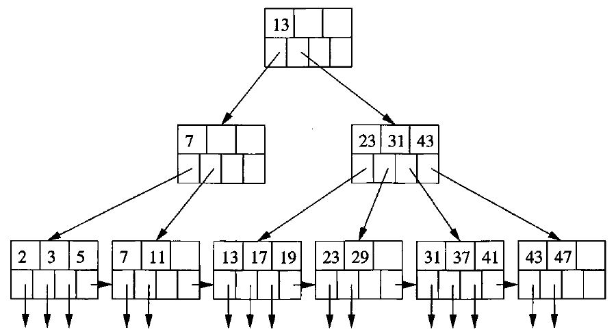
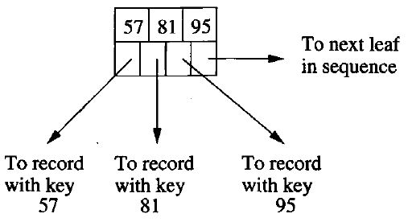
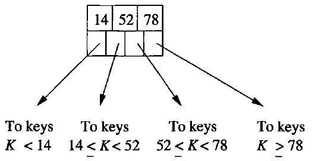
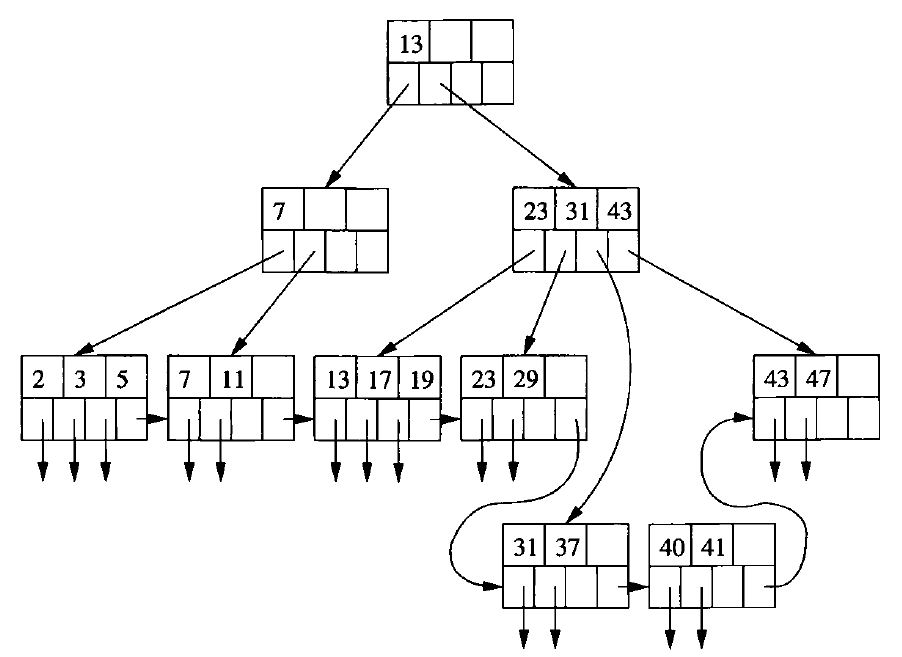
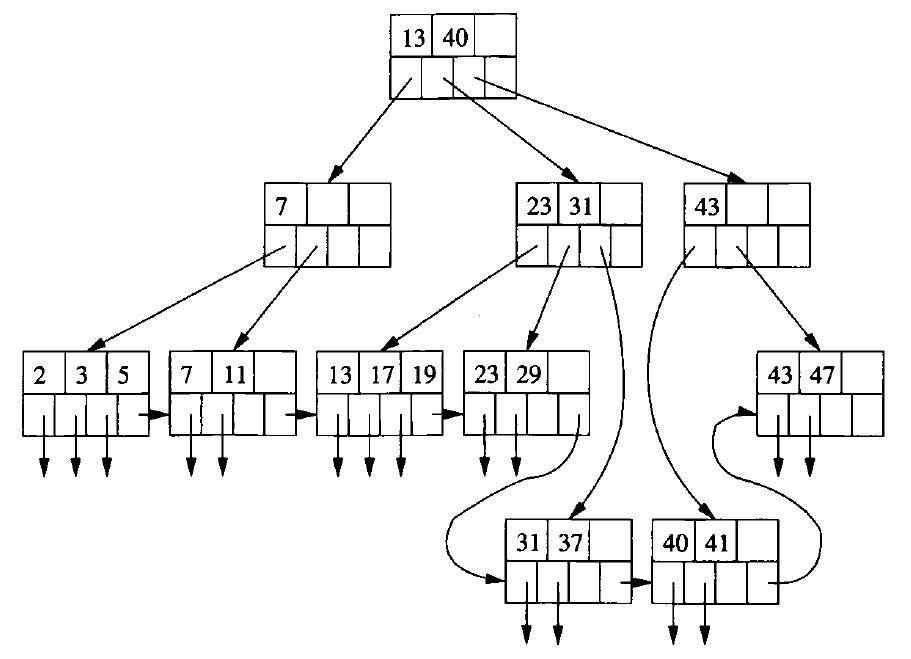
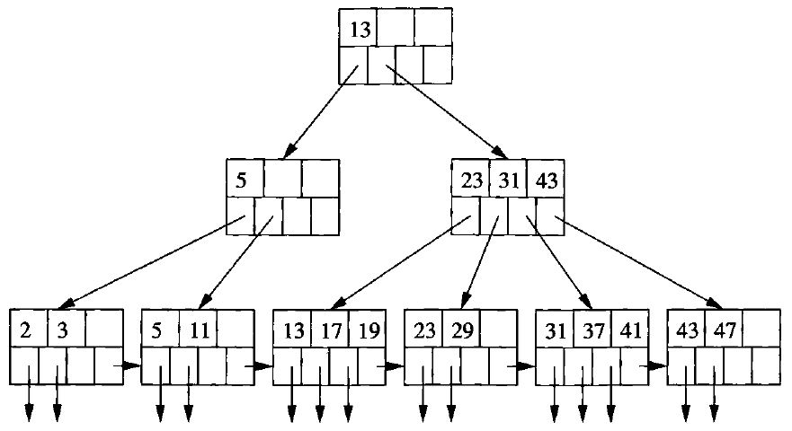
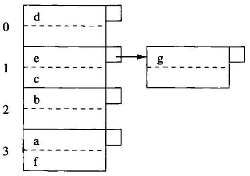

# Data Modelling and Databases - Chapter 14 (Book)

- Author: Ruben Schenk
- Date: 20.05.2021
- Contact: ruben.schenk@inf.ethz.ch

# 14. Index Structures

## 14.1 Index-Structure Basics

Storage structures consist of `files`, which are similar to the files used by operating systems. A `data file` may be used to store a relation, for example. The data file may have one or more `index files`. Each index file associates values of the search key with pointers to the data-file records that have that value for the attribute of the search key.

### 14.1.1 Sequential Files

A `sequential file` is created by sorting the tuples of a relation by their primary key. The tuples are then distributed among blocks, in this order.

### 14.1.2 Dense Indexes

If records are sorted, we can build on them a `dense index`, which is a sequence of blocks holding only the key of the records and pointers to the records themselves.

Since keys and pointers presumably take much less space than complete records, we expect to use many fewer blocks for the index than the file itself.

Example: Fig. 14.2 below suggests a dense index on a sorted file.

<br>

*Figure 14.2: A dense index file (left) on a sequential data file (right).*

Given key value $K$, we search the index blocks for $K$, and when we find it, we follow the associated pointer to the record with key $K$.  
Since the keys are sorted, we can use binary search to find $K$. If there are $n$ blocks of the index, we only look at $\log_2 n$ of them.

### 14.1.3 Sparse Indexes

A `sparse index` typically has only one key-pointer pair per block of the data file. You can only use a sparse index if the data file is sorted by the search key, while a dense index can be used for any search key.

Example: Fig. 14.3 below shows a sparse index.

<br>

*Figure 14.3: A sparse index on a sequential file.*

To find the record with a search-key value $K$, we search the sparse index for the largest key less than or equal to $K$. Since the index file is sorted by key, binary search can locate this entry. We follow the associated pointer to a data block. Now, we must search this block for the record with key $K$.

### 14.1.4 Multiple Levels of Index

An index file can cover many blocks. By putting an index on the index, we can make the use of the first level index more efficient.

Fig. 14.4 below extends Fig. 14.3 by adding a second index level. The same idea would let us place a third-level index on the second level, and so on.

<br>

*Figure 14.4: Adding a second level of sparse index.*

### 14.1.5 Secondary Indexes

A `secondary index` is distinguished from the primary index in that a secondary index does not determine the placement of records in the data file. Rather, the secondary index tells us the current location of records.

Therefore, secondary indexes are always `dense`. Since they do not influence location, we could not use it to predict the location of any record whose key was not mentioned in the index file explicitly.

Example: Fig. 14.5 below shows a typical secondary file. The data file is shown with two records per block. The records have only their search key shown.

<br>

*Figure 14.5: A secondary index.*

### 14.1.6 Applications of Secondary Indexes

A common structure needing secondary indexes is the `clustered file` which we shall explore in the following example:

Example: Consider our standard movie and studio relations:

```sql
    Movie(title, year, length, genre, studioName, producerCNum)
    Studio(name, address, presCNum)
```

Suppose further that the most common form of query is:

```sql
    SELECT title, year
    FROM Movie, Studio
    WHERE presCNum = zzz AND Movie.studioName = Studio.name;
```

That is, given the president of a studio (through his presCNum given by $zzz$), we need to find all the movies made by that studio. 

We can create a `clustered file structure` for both relations *Studio* and *Movie*, as suggested by Fig. 14.6 below. Following each *Studio* tuple are all the *Movie* tuples for all the movies owned by that studio.

<br>

*Figure 14.6: A clustered file with each studio clustered with the movies made by that studio.*

### 14.1.7 Indirection in Secondary Indexes

A convenient way to avoid repeating values is to use a level of indirection, called `buckets`, between the secondary index file and the data file. 

As shown in Fig. 14.7. below, there is one pair of each search key $K$. The pointer of this pair goes to a position in a "bucket file", which holds the "bucket" for $K$. Following this position, until the next position pointed to by the index, are pointers to all the records with search-key value $K$.

<br>

*Figure 14.7: Saving space by using indirection in a secondary index.*

### 14.1.8 Document Retrieval and Inverted Indexes

*Left out.*

## 14.2 B-Trees

While one or two levels of index are often very helpful in speeding up queries, there is a more general structure that is commonly used in commercial systems. This family of data structures is called `B-trees`, and the particular variant that is most often used is known as a `B+ tree`. In essence:

- B-trees automatically maintain as many levels of index as appropriate for the size of the file being indexed.
- B-trees manage the space on the blocks they use so that every block is between half used and completely full.

### 14.2.1 The Structure of B-Trees

A B-tree organizes its blocks into a tree that is `balanced`, meaning that all paths from the root to a leaf have the same length. Fig. 14.13 shows an entire B-tree as an example.

<br>

*Figure 14.13: A B-tree.*

There is a parameter $n$ associated with each B-tree index, and this parameter determines the layout of all blocks of the B-tree. Each block will have space for $n$ search-key values and $n+1$ pointers.

There are several important rules about what can appear in the blocks of a B-tree:

- The keys in leaf nodes are copies of keys from the data file.
- At the root, there are at least two used pointers.
- At a leaf, the last pointer points to the next block to with the next higher keys. Among the other $n$ pointers in a leaf block, at least $\lfloor (n+1) /2 \rfloor$ of these pointers are used and point to data records. An example of a leaf node is shown in Fig. 14.11.
- At an interior node, all $n + 1$ pointers can be used to point to B-tree blocks at the next lower level. At least $\lceil (n+1) / 2 \rceil$ of them are actually used. An example of an interior node is shown in Fig. 14.12.

<br>

*Figure 14.11: A typical leaf of a B-tree.*

<br>

*Figure 14.12: A typical interior node of a B-tree.*

### 14.2.2 Applications of B-Trees

The B-tree is a powerful tool for building indexes. The sequence of pointers at the leaves of a B-tree can play the role of any of the pointer sequences coming out of an index file that we learned about in Section 14.1. Here are some examples:

1. The search key of the B-tree is the primary key for the data file, and the index is dense. That is, there is one key-pointer pair in a leaf for every record of the data file.
2. The data file is sorted by its primary key, and the B-tree is a sparse index with one key-pointer pair at a leaf for each block of the data file.
3. The data file is sorted by an attribute that is not a key, and this attribute is the search key for the B-tree. For each key value $K$ that appears in the data file there is one key-pointer pair at a leaf.

### 14.2.3 Lookup in B-Trees

We for now suppose that the B-tree is a dense index, so every search-key value that appears in the data file will also appear at a leaf.  
Suppose we have a B-tree index and we want to find a record with search-key value $K$. We search for $K$ recursively, starting at the root and ending at a leaf. The search procedure is:

**BASIS:** If we are at a leaf, look among the keys there. If the $i$th key is $K$, then the $i$th pointer will take us to the desired record.

**INDUCTION:** If we are at an interior node with keys $K_1, \, K_2,..., \, K_n$, follow the rules given in Section 14.2.1 to decide which of the children of this node should next be examined. That is, there is only one child that could lead to a leaf with key $K$. If $K < K_1$, then it is the first child, if $K_1 \leq K \leq < K_2$, it is the second child, and so on. Recursively apply the search procedure at this child.

### 14.2.4 Range Queries

B-trees are useful not only for queries in which a single value of the search key is sought, but for queries in which a range of values are asked for, called `range queries`.

If we want to find all keys in the range $[a, \, b]$ at the leaves of a B-tree, we do a lookup to find the key $a$. Whether or not it exists, we are led to a leaf where $a$ could be, and we search the leaf for keys that are $a$ or greater. Each such key we find has an associated pointer to one of the records whose key is in the desired range. As long as we do not find a key greater than $b$ in the current block, we follow the pointer to the next leaf and repeat our search for keys in the range $[a, \, b]$.

### 14.2.5 Insertion Into B-Trees

The insertion is, in principle, recursive:

- We try to find a place for the new key in the appropriate leaf, and we put it there if there is room.
- If there is no room in the proper leaf, we split the leaf into two and divide the keys between the two new nodes, so each is half full or just over half full.
- The splitting of nodes at one level appears to the level above as if a new key-pointer pair needs to be inserted at the higher level. We may just recursively apply this strategy to insert at the next level.
- As an exception, if we try to insert into the root, and there is no room, then we split the root into two nodes and create a new root at the next higher level.

When we split a node and insert it into its parent, we need to be careful how the keys are managed. First, suppose $N$ is a leaf whose capacity is $n$ keys. Also suppose we are trying to insert an $(n+1)$st key and its associated pointer. We create a new node $M$, which will be the sibling of $N$, immediately to its right. The first $\lceil (n+1) / 2 \rceil$ key-pointer pairs, in sorted order of the keys, remain with $N$, while the other key-pointer pairs move to $M$. Note that both nodes $N$ and $M$ are left with a sufficient number of key-pointer pars - at least $\lfloor (n+1) / 2 \rfloor$ pairs.  
Now, suppose $N$ is an interior node whose capacity is $n$ keys and $n+1$ pointers, and $N$ has just been assigned $n+2$ pointers because of a node splitting below. We do the following:

1. Create a new node $M$, which will be the sibling of $N$, immediately to its right.
2. Leave at $N$ the first $\lceil (n+2) / 2 \rceil$ pointers, in sorted order, and move to $M$ the remaining $\lfloor (n+2) / 2 \rfloor$ pointers.
3. The first $\lceil n / 2 \rceil$ keys stay with $N$, while the last $\lfloor n / 2 \rfloor$ keys move to $M$. Note that there is always one key in the middle left over, it goes with neither $N$ nor $M$. The leftover key $K$ indicates the smallest key reachable via the first of $M$'s children. Although this key doesn't appear in $N$ or $M$, it is associated with $M$, in the sense that it represents the smallest key reachable via $M$. Therefore $K$ will be inserted into the parent of $N$ and $M$ to divide searches between those two nodes.

Example: Fig. 14.15 and Fig. 14.16 below show how the insertion of key $40$ would work in our example B-tree.

<br>

*Figure 14.15: Beginning the insertion of key 40.*

<br>

*Figure 14.16: Completing the insertion of key 40.*

### 14.2.6 Deletion From B-Trees

If the B-tree node from which a deletion occurred still has at least the minimum number of keys and pointers, then there is nothing more to be done. However, it is possible that the node was right at the minimum occupancy before the deletion, so after deletion the constraint on the number of keys is violated. We then need to do one of two things for a node $N$ whose contents are subminimum, one case requires a requires a recursive deletion up the tree:

1. If one of the adjacent siblings of node $N$ has more than the minimum number of keys and pointers, then one key-pointer can be moved to $N$, keeping the order of keys intact. Possibly, the keys at the parent of $N$ must be adjusted to reflect the new situation. 
2. The hard case is when neither adjacent sibling can be used ot provide an extra key for $N$. However, in that case, we have two adjacent nodes, $N$ and a sibling $M$, the latter has the minimum number of keys and the former has fewer than the minimum. Therefore, together they have no more keys and pointers than are allowed in a single node. We merge these two nodes, effectively deleting one of them. We need to adjust the keys at the parent, and then delete a key and pointer at the parent. If the parent is still full enough, then we are done. If not, then we recursively apply the deletion algorithm at the parent.

Example: Fig. 14.17 below shows hwo deleting of key $7$ would look like in our example B-tree.

<br>

*Figure 14.17: Deletion of key 7.*

### 14.2.7 Efficiency of B-Trees

B-trees allow lookup, insertion, and deletion of records using very few disk I/O's per file operation. First, we should observe that if $n$, the number of keys per block, is reasonably large, then splitting and merging of blocks will be rare events.

However, every search of records with a given search key requires us to go from the root down to a leaf, to find a pointer to the record. Since we are only reading B-tree blocks, the number of disk I/O's will be the number of levels the B-tree has, plus the one (for lookup) or two (for insert or delete) disk I/O's needed for manipulation of the record itself.  
For a typical size of keys, pointers, and blocks, three levels are sufficient for all but the largest databases. Thus, we shall generally take $3$ as the number of levels for a B-tree.

## 14.3 Hash Tables

We assume the reader has seen the hash table used as a main-memory data structure. In such a structure there is a `hash function h` that takes a search key (the `hash key`) as an argument and computes from it an integer in the range $0$ to $B-1$, where $B$ is the number of `buckets`. A `bucket array`, which is an array indexed from $0$ to $B-1$, holds the headers of $B$ linked lists, one for each bucket of the array. If a record has a search key $K$, then we store the record by linking it to the bucket list for the bucket numbered $h(K)$.

### 14.3.1 Secondary-Storage Hash Tables

A `hash table` holding a very large number of records and kept in secondary storage, differs from the main-memory version in small but important ways. First, the bucket array consists of blocks, rather than pointers to the headers of lists.

Records that are hashed by the has function $h$ to a certain bucket are put in the block for that bucket. If a bucket has too many records, a chain of overflow blocks can be added to the bucket to hold more records.

Example: Fig. 14.20 below shows a hash table. To keep our illustrations simple, we assume that a block can hold only two records, and that $B = 4$. For example, $h(d) = 0$ and $h(b) = 2$.

<br>

*Figure 14.20: A hash table.*

### 14.3.2 Insertion Into a Hash Table

When a new record with search key $K$ must be inserted, we compute $h(K)$. If the bucket numbered $h(K)$ has space, then we insert the record into the block for this bucket, or into one of the overflow blocks on its chain if there is no room in the first block. If none of the blocks of the chain for bucket $h(K)$ has room, we add a new overflow block to the chain and store a new record there.

Example: Suppose we add to the hash table of Fig. 14.20 a record with key $g$, and $h(g) = 1$. The insertion is shown in Fig. 14.21 below.

<br>

### 14.3.3 Hash-Table Deletion

Deletion of the record with search key $K$ follows the same pattern as insertion. We go to the bucket numbered $h(K)$ and search for records with that search key. Any that we find are deleted. If we are able to move records around among blocks, then after deletion we may optionally consolidate the blocks of a bucket into one fewer block.

### 14.3.4 Efficiency of Hash Table Indexes

Ideally, there are enough buckets that most of them fit on one block. If so, then the typical lookup takes only one disk I/O, and insertion or deletion from the file takes only two disk I/O's.

However, if the file grows, then we shall eventually reach a situation where there are many blocks in the chain for a typical bucket. If so, then we need to search a long list of blocks, taking at least one disk I/O per block.

The hash tables we have examined so fare are called `static hash tables`, because $B$, the number of buckets, never changes. However, there are several kind s of `dynamic hash tables`, where $B$ is allowed to vary so it approximates the number of records divided by the number of records that fit on a block.

### 14.3.5 Extensible Hash Tables

Our first approach to dynamic hashing is called `extensible hash tables`. The major additions to the simpler static hash table structure are:

1. There is a level of indirection for the buckets. That is, an array of pointers to blocks represents the buckets, instead of the array holding thd data blocks themselves.
2. The array of pointers can grow. Its length is always a power of $2$, so in a growing step the number of buckets doubles.
3. However, there does not have to be a data block for each bucket. Certain buckets can share a block if the total number or records in those buckets can fit in the block.
4. The hash function $h$ computes for each key a sequence of $k$ bits for some large $k$, say 32. However, the bucket numbers will at all times use some smaller number of bits, say $i$ bits, from the beginning or end of this sequence. The bucket array will have $2^i$ entries when $i$ is the number of bits used.

### 14.3.6 Insertion Into Extensible Hash Tables

*Left out.*

### 14.3.7 Linear Hash Tables

*Left out.*

### 14.3.8 Insertion Into Linear Hash Tables

*Left out.*
