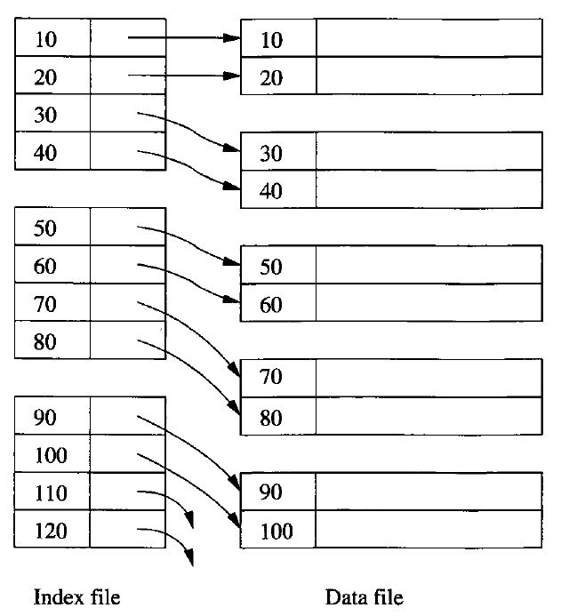
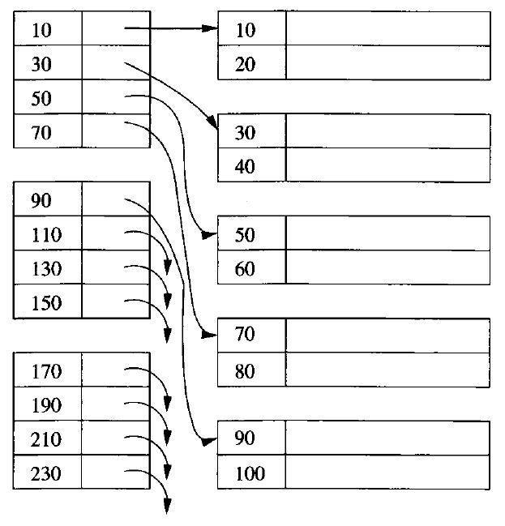
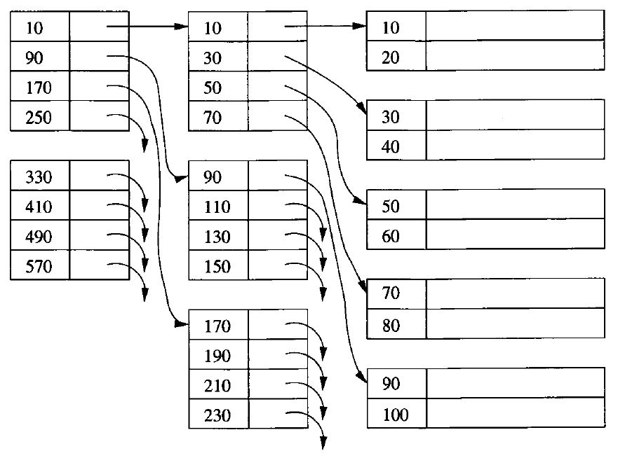
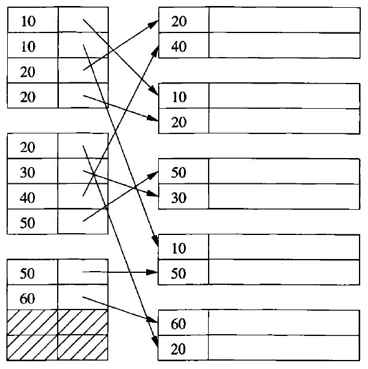
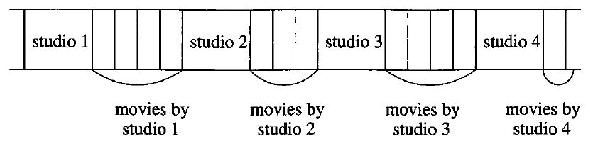
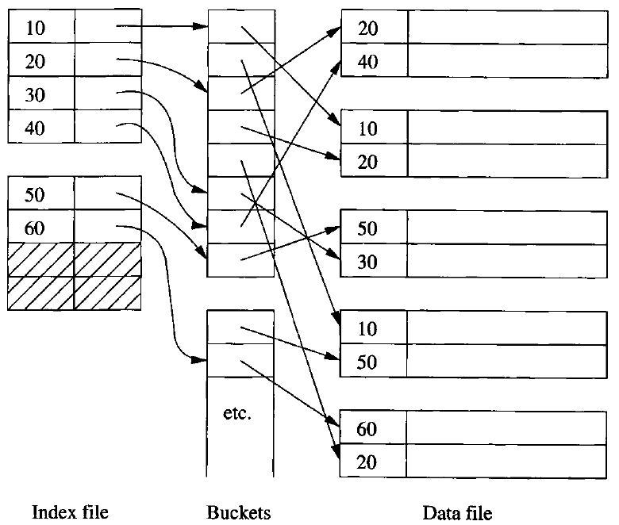

# Data Modelling and Databases - Chapter 14 (Book)

- Author: Ruben Schenk
- Date: 20.05.2021
- Contact: ruben.schenk@inf.ethz.ch

# 14. Index Structures

## 14.1 Index-Structure Basics

Storage structures consist of `files`, which are similar to the files used by operating systems. A `data file` may be used to store a relation, for example. The data file may have one or more `index files`. Each index file associates values of the search key with pointers to the data-file records that have that value for the attribute of the search key.

### 14.1.1 Sequential Files

A `sequential file` is created by sorting the tuples of a relation by their primary key. The tuples are then distributed among blocks, in this order.

### 14.1.2 Dense Indexes

If records are sorted, we can build on them a `dense index`, which is a sequence of blocks holding only the key of the records and pointers to the records themselves.

Since keys and pointers presumably take much less space than complete records, we expect to use many fewer blocks for the index than the file itself.

Example: Fig. 14.2 below suggests a dense index on a sorted file.

<br>

*Figure 14.2: A dense index file (left) on a sequential data file (right).*

Given key value $K$, we search the index blocks for $K$, and when we find it, we follow the associated pointer to the record with key $K$.  
Since the keys are sorted, we can use binary search to find $K$. If there are $n$ blocks of the index, we only look at $\log_2 n$ of them.

### 14.1.3 Sparse Indexes

A `sparse index` typically has only one key-pointer pair per block of the data file. You can only use a sparse index if the data file is sorted by the search key, while a dense index can be used for any search key.

Example: Fig. 14.3 below shows a sparse index.

<br>

*Figure 14.3: A sparse index on a sequential file.*

To find the record with a search-key value $K$, we search the sparse index for the largest key less than or equal to $K$. Since the index file is sorted by key, binary search can locate this entry. We follow the associated pointer to a data block. Now, we must search this block for the record with key $K$.

### 14.1.4 Multiple Levels of Index

An index file can cover many blocks. By putting an index on the index, we can make the use of the first level index more efficient.

Fig. 14.4 below extends Fig. 14.3 by adding a second index level. The same idea would let us place a third-level index on the second level, and so on.

<br>

*Figure 14.4: Adding a second level of sparse index.*

### 14.1.5 Secondary Indexes

A `secondary index` is distinguished from the primary index in that a secondary index does not determine the placement of records in the data file. Rather, the secondary index tells us the current location of records.

Therefore, secondary indexes are always `dense`. Since they do not influence location, we could not use it to predict the location of any record whose key was not mentioned in the index file explicitly.

Example: Fig. 14.5 below shows a typical secondary file. The data file is shown with two records per block. The records have only their search key shown.

<br>

*Figure 14.5: A secondary index.*

### 14.1.6 Applications of Secondary Indexes

A common structure needing secondary indexes is the `clustered file` which we shall explore in the following example:

Example: Consider our standard movie and studio relations:

```sql
    Movie(title, year, length, genre, studioName, producerCNum)
    Studio(name, address, presCNum)
```

Suppose further that the most common form of query is:

```sql
    SELECT title, year
    FROM Movie, Studio
    WHERE presCNum = zzz AND Movie.studioName = Studio.name;
```

That is, given the president of a studio (through his presCNum given by $zzz$), we need to find all the movies made by that studio. 

We can create a `clustered file structure` for both relations *Studio* and *Movie*, as suggested by Fig. 14.6 below. Following each *Studio* tuple are all the *Movie* tuples for all the movies owned by that studio.

<br>

*Figure 14.6: A clustered file with each studio clustered with the movies made by that studio.*

### 14.1.7 Indirection in Secondary Indexes

A convenient way to avoid repeating values is to use a level of indirection, called `buckets`, between the secondary index file and the data file. 

As shown in Fig. 14.7. below, there is one pair of each search key $K$. The pointer of this pair goes to a position in a "bucket file", which holds the "bucket" for $K$. Following this position, until the next position pointed to by the index, are pointers to all the records with search-key value $K$.

<br>

*Figure 14.7: Saving space by using indirection in a secondary index.*

### 14.1.8 Document Retrieval and Inverted Indexes

*Left out.*
