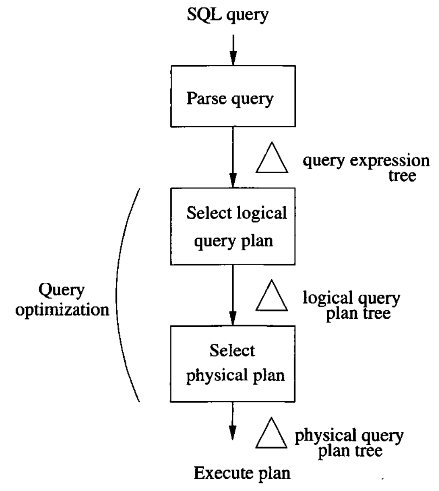
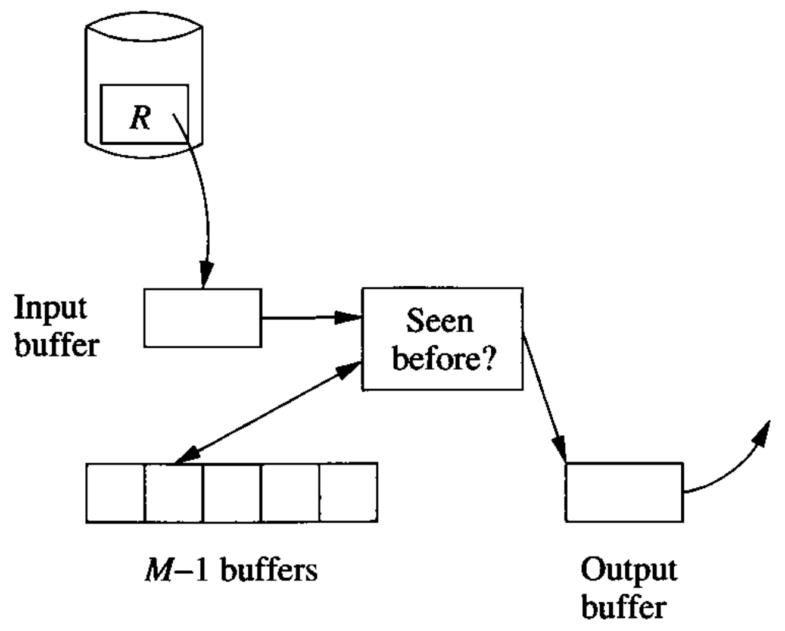

# Data Modelling and Databases - Chapter 15 (Book)

- Author: Ruben Schenk
- Date: 24.05.2021
- Contact: ruben.schenk@inf.ethz.ch

# 15. Query Execution

The `query processor` is the group of components of a DBMS that turns user queries and data-modification commands into a sequence of database operations and executes those operations.

#### Preview of Query Compilation

To set the context for query execution, we offer a very brief outline of the content of the next chapter:

1. `Parsing`. A `parse tree` for the query is constructed.
2. `Query Rewrite`. The parse tree is converted to an initial query plan, which is usually an algebraic representation of the query.
3. `Physical Plan Generation`. The abstract query plan from (2), often called a `logical query plan`, is turned into a `physical query plan` by selecting algorithms to implement each of the operators of the logical plan, and by selecting an order of execution for these operators.

Parts (2) and (3) are often called the `query optimizer`, and these are the hard parts of the query compilation.

<br>

*Figure 15.2: Outline of query compilation.*

## 15.1 Introduction to Physical-Query-Plan Operators

### 15.1.1 Scanning Tables

Perhaps the most basic thing we can do in a physical query plan is to read the entire contents of a relation $R$. There are two basic approaches to locating the tuples of a relation $R$:

1. In many cases, the relation $R$ is stored in an area of secondary memory, with its tuples arranged in blocks. The blocks containing the tuples of $R$ are known to the system, and it is possible to get the blocks one by one. This operation is called `table-scan`.
2. If there is an index on any attribute of $R$, we may be able to use this index to get all the tuples of $R$. This operation is called `index-scan`.

### 15.1.2 Sorting While Scanning Tables

The physical-query-plan operator `sort-scan` takes a relation $R$ and a specification of the attributes on which the sort is to be made, and produces $R$ in that sorted order. There are several ways that sort-scan can be implemented, for example if there is a B-tree index on the attribute to be sorted by.

### 15.1.3 The Computation Model for Physical Operators

We shall use the number of disk I/O's as our measure of cost for an operation. When comparing algorithms for the same operations, we shall make an assumption that may be surprising at first:

- We assume that the arguments of any operator are found on disk, but the result of the operator is left in main memory.

### 15.1.4 Parameters for Measuring Costs

Now, let us introduce the parameters (sometimes called statistics) that we use to express the cost of an operator.

$M$ will denote the number of main-memory buffers available to an execution of a particular operator.  
We shall furthermore make the simplifying assumption that data is accessed one block at a time from disk.  
There are three parameter families, $B$, $T$, and $V$:

- When describing the size of a relation $R$, we most often are concerned with the number of blocks that are needed to hold all the tuples of $R$. This number of blocks will be denoted $B(R)$. Usually, we assume that $R$ is `clustered`, that is, it is stored in $B$ blocks or in approximately $B$ blocks.
- Sometimes, we also need to know the number of tuples in $R$, and we denote this quantity by $T(R)$.
- Finally, we shall sometimes want to refer to the number of distinct values that appear in a column of a relation. If $R$ is a relation, and one of its attributes is $a$, then $V(R, \, a)$ is the number of distinct values of the column for $a$ in $R$.

### 15.1.5 I/O Cost for Scan Operators

IF relation $R$ is clustered, then the number of disk I/O's for the table-scan operator is approximately $B$. Likewise, if $R$ fits in main-memory, we can implement sort-scan by reading $R$ into memory and performing an in-memory sort, again requiring only $B$ disk I/O's.

However, if $R$ is distributed among tuples of other relations, then a table-scan for $R$ may require reading as many blocks as there are tuples of $R$, that is, the I/O cost is $T$.

### 15.1.6 Iterators for Implementation of Physical Operators

Many physical operators can be implemented as an `iterator`, which is a group of three methods that allows a consumer of the result of the physical operator to get the result one tuple at a time. The three methods forming the iterator for an operation are:

1. `Open()`. This method starts the process of getting tuples, but does not get a tuple.
2. `GetNext()`. This method returns the next tuple in the result and adjusts data structures as necessary to allow subsequent tuples to be obtained.
3. `Close()`. This method ends the iteration after all tuples, or all tuples that the consumer wanted, have been obtained.

Example: Perhaps the simplest iterator is the one that implements the table-scan operator. Fig. 15.3 sketches the three methods for this iterator.

```sql
    Open() {
        b := the first block of R;
        t := the first tuple of block b;
    }

    GetNext() {
        IF (t is past the last tuple on block b) {
            increment b to the next block;
            IF (there is no next block) {
                RETURN NotFound;
            } ELSE /* b is a new block */ {
                t := first tuple on block b;
            }
        } /* now we are ready to return t and increment */
        oldt := t;
        increment t to the next tuple of b;
        RETURN oldt;
    }

    CLOSE() {

    }
```

*Figure 15.3: Iterator methods for the table-scan operator over relation R.*

Example: Let us consider another example of how iterators can be combined by calling other iterators. The operation is the bag union $R \cup S$, in which we produce first all the tuples of $R$ and then all the tuples of $S$, without regard for the existence of duplicates. The iterator methods for the union are sketched in Fig. 15.4.

```sql
    Open() {
        R.Open();
        CurRel := R;
    }

    GetNext() {
        IF (CurRel = R) {
            t := R.GetNext();
            IF (t <> NotFound) /* R is not exhausted */ {
                RETURN T;
            } ELSE /* R is exhausted */ {
                S.Open;
                CurRel = S;
            }
        }
        /* here, we must read from S */
        RETURN S.GetNext();
        /* notice that if S is exhausted, S.GetNext()
        will return NotFound, which is the correct
        action for our GetNext as well */
    }

    Close() {
        R.Close();
        S.Close();
    }
```

*Figure 15.4: Building a union iterator from iterators $\mathcal{R}$ and $\mathcal{S}$.*

## 15.2 One-Pass Algorithms

The choice of algorithm for each operator is an essential part of the process of transforming a logical query plan into a physical query plan. While many algorithms for operators have been proposed, they largely fall into three classes:

1. Sorting-based methods
2. Hash-based methods
3. Index-based methods

In addition, we can divide algorithms for operators into three "degrees" of difficulty and cost:

1. Some methods involve reading the data only once from disk. These are the `one-pass` algorithms.
2. Some methods work for data that is too large to fit in available main memory bur not for the largest imaginable data sets. These `two-pass` algorithms are characterized by reading data a first time from disk, processing it in some way, writing it to disk, and then reading it a second time for further processing during the second pass.
3. Some methods work without a limit on the size of the data. These methods use three or more passes to do their jobs, and are natural, recursive generalizations of the two-pass algorithms.

In this section, we shall concentrate on the one-pass methods. HEre and subsequently, we shall classify operators into three broad groups:

1. `Tuple-at-a-time, unary operations`. These operations - selection and projection - do not require an entire relation, or even a large part of it, in memory at once.
2. `Full-relation, unary operations`. These one-argument operations require seeing all or most of the tuples in memory at once, so one-pass algorithms are limited to relations that are approximately of size $M$ or less. The operations of this class are $\gamma$ (the grouping operator) and $\delta$ (the duplicate-elimination operator).
3. `Full-relation, binary operations`. All other operations are in this class: set and bag versions of union, intersection, difference, joins, and products.

### 15.2.1 One-Pass Algorithms for Tuple-at-a-Time Operations

The tuple-at-a-time operations $\phi (R)$ and $\pi (R)$ have obvious algorithms, regardless of whether the relation fits in main memory. WE read the blocks of $R$ one at a time into an input buffer, perform the operation on each tuple, and move the selected tuple or the projected tuples to the output buffer.

### 15.2.2 One-Pass Algorithms for Unary, Full-Relation Operations

Now, let us consider the unary operations that apply to relations as a whole, rather than to one tuple at a time: duplicate elimination ($\sigma$) and grouping ($\gamma$).

#### Duplicate Elimination

To eliminate duplicates, we can read each block of $R$ one at a time, but for each tuple we need to make a decision as to whether we have already seen this tuple before or not. To support this decision, we need to keep in memory one copy of every tuple we have seen. One memory buffer holds one block of $R$'s tuples, and the remaining $M-1$ buffers can be used to hold a single copy of every tuple seen so far.  
When a new tuple from $R$ is considered, we compare it with all tuples seen so far, and if it is not equal to any of these tuples we both copy it to the output and add it to the in-memory list of tuples we have seen.

<br>

*Figure 15.6: Managing memory for a one-pass duplicate-elimination.*

#### Grouping

A grouping operation $\gamma_L$ gives us zero or more grouping attributes and presumably one or more aggregated attributes. If we create in main memory one entry for each group, then we can scan the tuples of $R$, one block at a time. The `entry` for a group consists of values for the grouping attributes and an accumulated value or values for each aggregations.  
When all tuples of $R$ have been read into the input buffer and contributed to the aggregations for their group, we can produce the output by writing the tuple for each group.

### 15.2.3 One-Pass Algorithms for Binary Operations

*Left out.*

## 15.3 Nested-Loop Joins

### 15.3.1 Tuple-Based Nested-Loop Join

The simplest variation of nested-loop join has loops that range over individual tuples of the relations involved. In this algorithm, which we call `tuple-based nested-loop join`, we compute the join $R(X, \, Y) \Join S(Y, \, Z)$ as follows:

```
    FOR each tuple s in S DO
        FOR each tuple r in R DO
            IF r and s join to make a tuple t THEN
                output t;
```

If we are careless about how we buffer the blocks of relations $R$ and $S$, then this algorithm could require as many as $T(R)T(S)$ disk I/O's.

### 15.3.2 An Iterator for Tuple-Based Nested-Loop Join

One advantage of a nested-loop join is that it fits well into an iterator framework, and thus allows us to avoid storing intermediate relations on disk in some situations.

### 15.3.3 Block-Based Nested-Loop Join Algorithm

We can improve on the tuple-based nested-loop join of Section 15.3.1 if we compute $R \Join S$ by:

1. Organizing access to both argument relations by blocks, and
2. Using as much main memory as we can store tuples belonging to the relation $S$, the relation of the outer loop.

The algorithm of Fig. 15.8 is sometimes called "nested-block join". We shall continue to call it simply `nested-loop join`, since it is the variant of the nested-loop idea most commonly implemented in practice.

```
    FOR each chunk of M-1 block of S DO BEGIN
        read these blocks into main-memory buffers;
        organize their tuples into a search structure whose
            search key is the common attributes of R and S;
        FOR each block b of R DO BEGIN
            read b into main memory;
            FOR each tuple t of b DO BEGIN
                find the tuples of S in main memory that join with t;
                output the join of t with each of these tuples;
            END;
        END;
    END;
```

*Figure 15.8: The nested-loop join algorithm.*

### 15.3.4 Analysis of Nested-Loop Join

*Left out.*

### 15.3.5 Summary of Algorithms so Far

The main-memory and disk I/O's requirements for the algorithms we have discussed in Sections 15.2 and 15.3 are shown in Fig. 15.9 below:

| Operators                                  | Approximate $M$ required | Disk I/O      | Section |
| :----------------------------------------- | :----------------------: | :-----------: | :-----: |
| $\phi, \, \pi$                             | 1                        | $B$           | 15.2.1  |
| $\gamma, \, \delta$                        | $B$                      | $B$           | 15.2.2  |
| $\cup, \, \cap, \, -, \, \times. \, \Join$ | $\min(B(R), \, B(S))$    | $B(R) + B(S)$ | 15.2.3  |
| $\Join$                                    | any $M \geq 2$           | $B(R)B(S)/M$  | 15.3.3  |

*Figure 15.9: Main memory and disk I/O requirements for one-pass and nested-loop algorithms.*

## 15.4 Two-Pass Algorithms Based on Sorting
