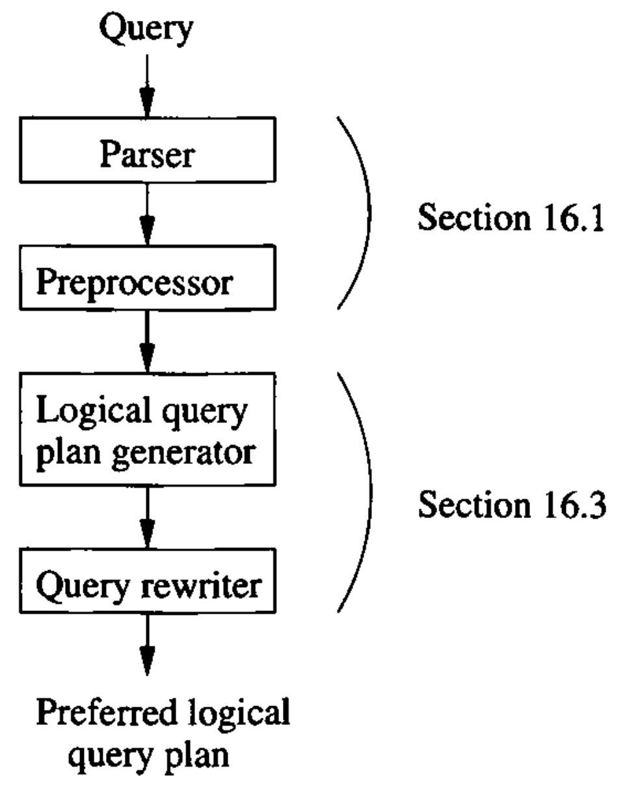
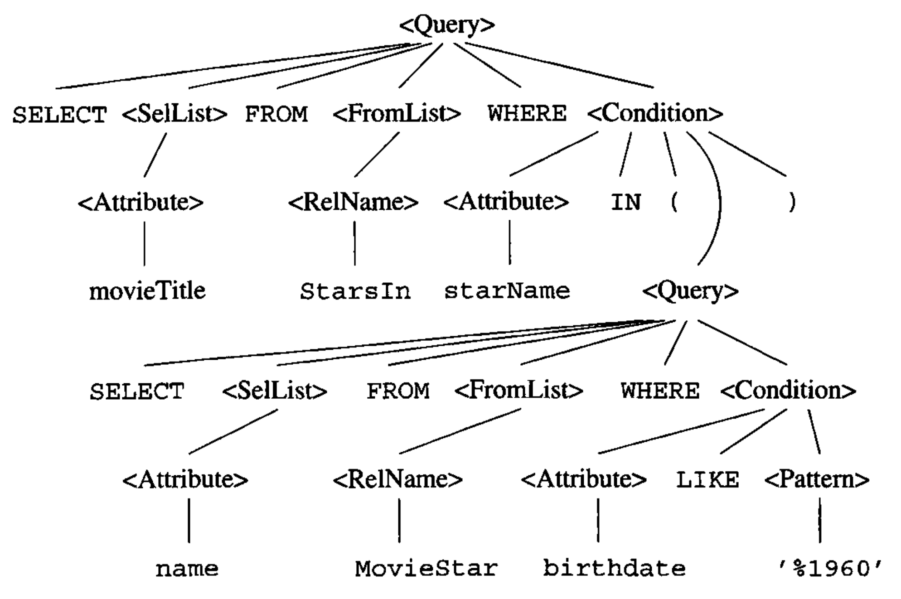
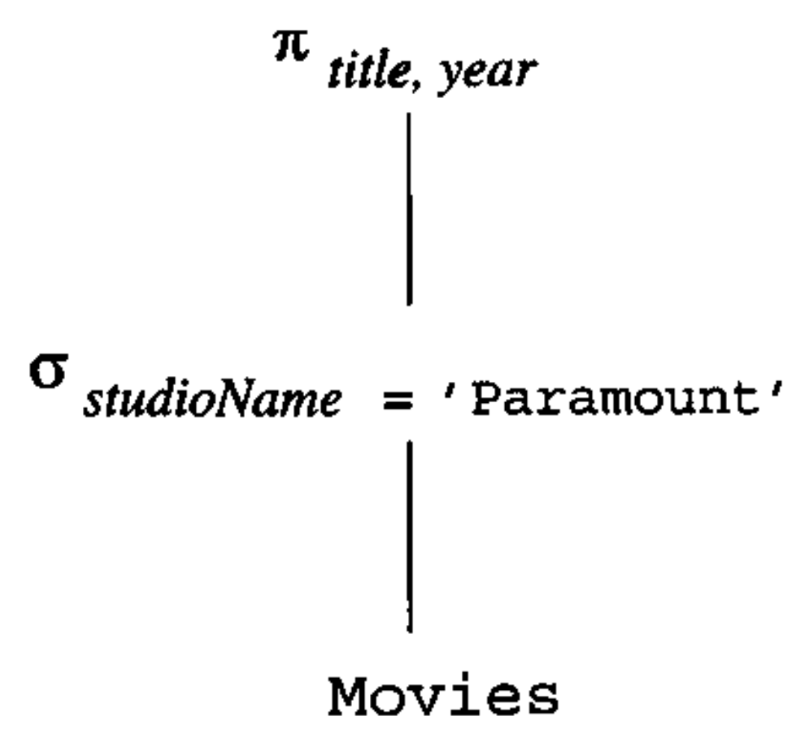
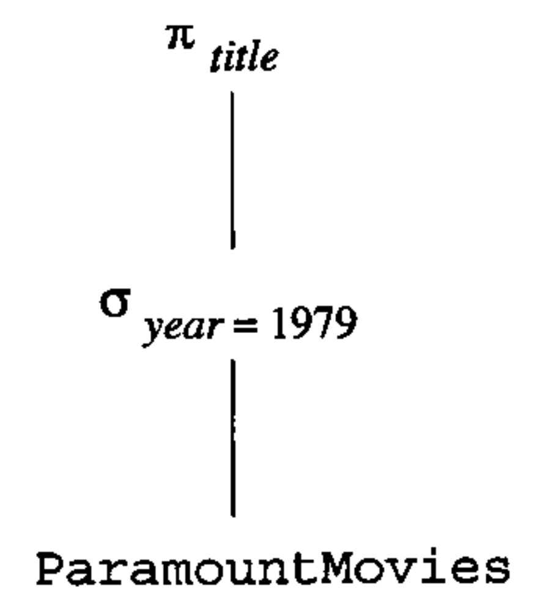
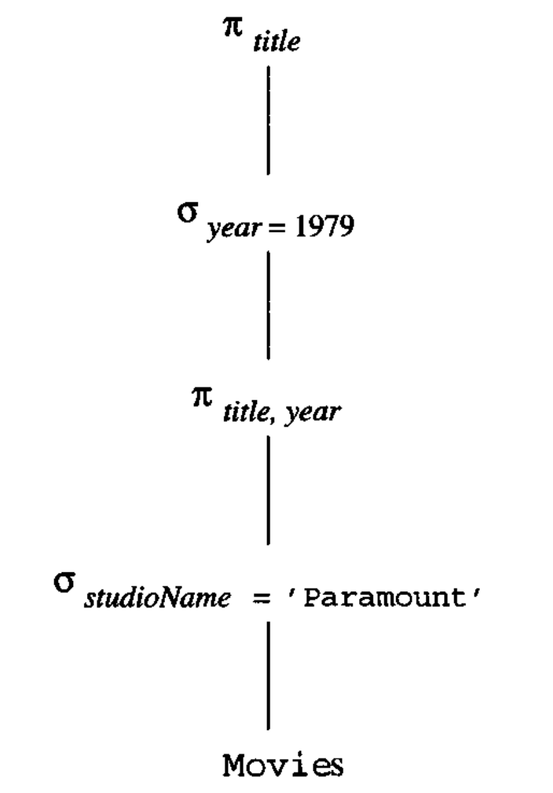

# Data Modelling and Databases - Chapter 16 (Book)

- Author: Ruben Schenk
- Date: 25.05.2021
- Contact: ruben.schenk@inf.ethz.ch

# 16. The Query Compiler

We shall now take up the architecture of the query compiler and its optimizer. There are three broad steps that the query processor must take:

1. The query, written in a language like SQL, is `parsed`, that is, turned into a parse tree representing the structure of the query in a useful way.
2. The parse tree is transformed into an expression tree of relational algebra, which we term a `logical query plan`.
3. The logical query plan must be turned into a `physical query plan`, which indicates not only the operations performed, but the order in which they are performed, the algorithm used to perform each step, etc.

## 16.1 Parsing and Preprocessing

The first stages of query compilation are illustrated in Fig. 16.1:

<br>

### 16.1.1 Syntax Analysis and Parse Trees

Tje job of the parser is to take text written in a language such as SQL and convert it to a `parse tree`, which is a tree whose nodes correspond to either:

1. `Atoms`, which are lexical elements such as keywords (e.g. *SELECT*), names of attributes or relations, constants, parentheses, operators such as $+$ or $<$, and other schema elements, or
2. `Syntactic categories`, which are names for families of query subparts. WE shall represent syntactic categories by triangular brackets around a name. For example, $<\text{Query}>$ will be used to represent some queries in the common select-from-where form, and $<\text{Condition}>$ will represent any expression that is a condition.

If a node is an atom, then it has no children. However, if the node is a syntactic category, then its children are described by one of the `rules` of the grammar for the language.

### 16.1.2 A Grammar for a Simple Subset of SQL

We shall illustrate the parsing process by giving some rules that describe a small subset of SQL queries.

#### Queries

The syntactic category $<\text{Query}>$ is intended to represent some of the queries of SQL. We give it only one rule:

```sql
 <Query> ::= SELECT <SelList> FROM <FromList> WHERE <Condition>
```

Symbol $::=$ means "*can be expressed as*"

Note this rule does not provide for the various optional clauses such as *GROUP BY, HAVING,* or *ORDER BY*, nor for options such as *DISTINCT* after *SELECT*, nor for query expressions using *UNION, JOIN,* or other binary operators.

#### Select-Lists

```sql
    <SelList> ::= <Attribute>, <SelList>
    <SelList> ::= <Attribute>
```

These two rules say that a select-list can be any comma-separated list of attributes. Either a single attribute or an attribute, a comma, and any list of on ore more attributes.

#### From-Lists

```sql
    <FromList> ::= <Relation>, <FromList>
    <FromList> ::= <Relation>
```

Here, a from-list is defined to be any comma-separated list of relations.

#### Conditions

The rules we shall use are:

```sql
    <Condition> ::= <Condition> AND <Condition>
    <Condition> ::= <Attribute> IN ( <Query> )
    <Condition> ::= <Attribute> = <Attribute>
    <Condition> ::= <Attribute> LIKE <Pattern>
```

Although we have listed more rules for conditions than for other categories, these rules only scratch the surface of the forms of conditions.

#### Base Syntactic Categories

Syntactic categories $<\text{Attribute}>$, $<\text{Relation}>$, and $<\text{Pattern}>$ are special, in that they are not defined by grammatical rules, but by rules about the atoms for which they can stand:

- $<\text{Attribute}>$ can be any string of characters that identifies an attribute of the current database schema.
- $<\text{Relation}>$ can be replaced by any string of characters that makes sense as a relation in the current schema.
- $<\text{Pattern}>$ can be replaced by any quoted string that is a legal SQL patter.

Example: REcall two relations from the running movies example:

```sql
    StarsIn(movieTitle, movieYear, starName)
    MovieStar(name, address, gender, birthdate)
```

Our study of parsing and query rewriting will center around the query "*find the titles of movies that have at least one star born in 1960*".  
The SQL for this variation of the query is shown in Fig. 16.2:

```sql
    SELECT movieTitle
    FROM StarsIn
    WHERE starName IN (
        SELECT name
        FROM MovieStar
        WHERE birthdate LIKE '%1960'
    )
```

*Figure 16.2: Find the movies with stars born in 1960.*

The parse tree for the query of Fig. 16.2, according to the grammar we have sketched, is shown in Fig. 16.3:

<br>

*Figure 16.3: The parse tree for Fig. 16.2.*

### 16.1.3 The Processor

The `preprocessor` has several important functions. If a relation used in the query is actually a virtual viw, then each use of this relation in the form-list must be replaced by a parse tree that describes the view.

The preprocessor is also responsible for `semantic checking`. Even if the query is valid syntactically, it actually may violate one or more semantic rules on the use of names. For instance, the preprocessor must:

1. `Check relation uses`: Every relation mentioned in a FROM-clause must be a relation or view in the current schema.
2. `Check and resolve attribute uses`: Every attribute that is mentioned in the SELECT- or WHERE-clause must be an attribute of some relation in the current scope.
3. `Check types`: All attributes must be of a type appropriate to their uses.

### 16.1.4 Preprocessing Queries Involving Views

When an operand in a query is a virtual view, the preprocessor needs to replace the operand by a piece of parse tree that represents how the view is constructed from base tables.

To form the query over base tables, we substitute, for each leaf in the tree for $Q$ that is a view, the root of a copy of the three that defines that view.

Example: Let us consider the view definition of a previous example. Recall the definition of view *ParamountMovies* is:

```sql
    CREATE VIEW ParamountMovies AS
        SELECT title, year
        FROM Movies
        WHERE studioName = 'Paramount';
```

The tree in Fig. 16.7 is relational-algebra expression for the query:

<br>

*Figure 16.7: Expression tree for view ParamountMovies.*

The query of our previous example was:

```sql
    SELECT title
    FROM ParamountMovies
    WHERE year = 1979;
```

This query has the expression tree shown in Fig. 16.8 below:

<br>

*Figure 16.8: Expression tree for the query.*

We substitute the tree of Fig. 16.7 for the leaf *ParamountMovies* in Fig 16.8. The resulting thee is shown in Fig 16.9 below:

<br>

*Figure 16.9: Expressing the query in terms of base tables.*

## 16.2 Algebraic Laws for Improving Query Plans

### 16.2.1 Commutative and Associative Laws