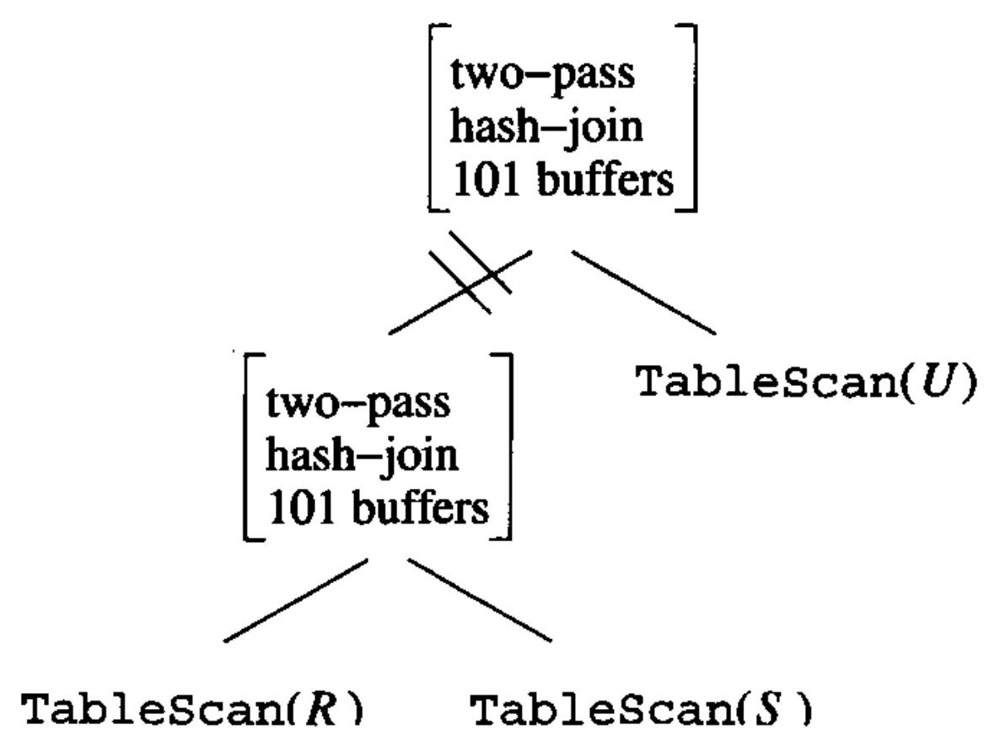

# Data Modelling and Databases - Chapter 16 (Book)

- Author: Ruben Schenk
- Date: 25.05.2021
- Contact: ruben.schenk@inf.ethz.ch

# 16. The Query Compiler

We shall now take up the architecture of the query compiler and its optimizer. There are three broad steps that the query processor must take:

1. The query, written in a language like SQL, is `parsed`, that is, turned into a parse tree representing the structure of the query in a useful way.
2. The parse tree is transformed into an expression tree of relational algebra, which we term a `logical query plan`.
3. The logical query plan must be turned into a `physical query plan`, which indicates not only the operations performed, but the order in which they are performed, the algorithm used to perform each step, etc.

## 16.1 Parsing and Preprocessing

The first stages of query compilation are illustrated in Fig. 16.1:

<br>

### 16.1.1 Syntax Analysis and Parse Trees

Tje job of the parser is to take text written in a language such as SQL and convert it to a `parse tree`, which is a tree whose nodes correspond to either:

1. `Atoms`, which are lexical elements such as keywords (e.g. *SELECT*), names of attributes or relations, constants, parentheses, operators such as $+$ or $<$, and other schema elements, or
2. `Syntactic categories`, which are names for families of query subparts. WE shall represent syntactic categories by triangular brackets around a name. For example, $<\text{Query}>$ will be used to represent some queries in the common select-from-where form, and $<\text{Condition}>$ will represent any expression that is a condition.

If a node is an atom, then it has no children. However, if the node is a syntactic category, then its children are described by one of the `rules` of the grammar for the language.

### 16.1.2 A Grammar for a Simple Subset of SQL

We shall illustrate the parsing process by giving some rules that describe a small subset of SQL queries.

#### Queries

The syntactic category $<\text{Query}>$ is intended to represent some of the queries of SQL. We give it only one rule:

```sql
 <Query> ::= SELECT <SelList> FROM <FromList> WHERE <Condition>
```

Symbol $::=$ means "*can be expressed as*"

Note this rule does not provide for the various optional clauses such as *GROUP BY, HAVING,* or *ORDER BY*, nor for options such as *DISTINCT* after *SELECT*, nor for query expressions using *UNION, JOIN,* or other binary operators.

#### Select-Lists

```sql
    <SelList> ::= <Attribute>, <SelList>
    <SelList> ::= <Attribute>
```

These two rules say that a select-list can be any comma-separated list of attributes. Either a single attribute or an attribute, a comma, and any list of on ore more attributes.

#### From-Lists

```sql
    <FromList> ::= <Relation>, <FromList>
    <FromList> ::= <Relation>
```

Here, a from-list is defined to be any comma-separated list of relations.

#### Conditions

The rules we shall use are:

```sql
    <Condition> ::= <Condition> AND <Condition>
    <Condition> ::= <Attribute> IN ( <Query> )
    <Condition> ::= <Attribute> = <Attribute>
    <Condition> ::= <Attribute> LIKE <Pattern>
```

Although we have listed more rules for conditions than for other categories, these rules only scratch the surface of the forms of conditions.

#### Base Syntactic Categories

Syntactic categories $<\text{Attribute}>$, $<\text{Relation}>$, and $<\text{Pattern}>$ are special, in that they are not defined by grammatical rules, but by rules about the atoms for which they can stand:

- $<\text{Attribute}>$ can be any string of characters that identifies an attribute of the current database schema.
- $<\text{Relation}>$ can be replaced by any string of characters that makes sense as a relation in the current schema.
- $<\text{Pattern}>$ can be replaced by any quoted string that is a legal SQL patter.

Example: REcall two relations from the running movies example:

```sql
    StarsIn(movieTitle, movieYear, starName)
    MovieStar(name, address, gender, birthdate)
```

Our study of parsing and query rewriting will center around the query "*find the titles of movies that have at least one star born in 1960*".  
The SQL for this variation of the query is shown in Fig. 16.2:

```sql
    SELECT movieTitle
    FROM StarsIn
    WHERE starName IN (
        SELECT name
        FROM MovieStar
        WHERE birthdate LIKE '%1960'
    )
```

*Figure 16.2: Find the movies with stars born in 1960.*

The parse tree for the query of Fig. 16.2, according to the grammar we have sketched, is shown in Fig. 16.3:

<br>

*Figure 16.3: The parse tree for Fig. 16.2.*

### 16.1.3 The Processor

The `preprocessor` has several important functions. If a relation used in the query is actually a virtual viw, then each use of this relation in the form-list must be replaced by a parse tree that describes the view.

The preprocessor is also responsible for `semantic checking`. Even if the query is valid syntactically, it actually may violate one or more semantic rules on the use of names. For instance, the preprocessor must:

1. `Check relation uses`: Every relation mentioned in a FROM-clause must be a relation or view in the current schema.
2. `Check and resolve attribute uses`: Every attribute that is mentioned in the SELECT- or WHERE-clause must be an attribute of some relation in the current scope.
3. `Check types`: All attributes must be of a type appropriate to their uses.

### 16.1.4 Preprocessing Queries Involving Views

When an operand in a query is a virtual view, the preprocessor needs to replace the operand by a piece of parse tree that represents how the view is constructed from base tables.

To form the query over base tables, we substitute, for each leaf in the tree for $Q$ that is a view, the root of a copy of the three that defines that view.

Example: Let us consider the view definition of a previous example. Recall the definition of view *ParamountMovies* is:

```sql
    CREATE VIEW ParamountMovies AS
        SELECT title, year
        FROM Movies
        WHERE studioName = 'Paramount';
```

The tree in Fig. 16.7 is relational-algebra expression for the query:

<br>

*Figure 16.7: Expression tree for view ParamountMovies.*

The query of our previous example was:

```sql
    SELECT title
    FROM ParamountMovies
    WHERE year = 1979;
```

This query has the expression tree shown in Fig. 16.8 below:

<br>

*Figure 16.8: Expression tree for the query.*

We substitute the tree of Fig. 16.7 for the leaf *ParamountMovies* in Fig 16.8. The resulting thee is shown in Fig 16.9 below:

<br>

*Figure 16.9: Expressing the query in terms of base tables.*

## 16.2 Algebraic Laws for Improving Query Plans

### 16.2.1 Commutative and Associative Laws

A `commutative law` about an operator says that it does not matter in which order you present the arguments of the operator, the result will be the same. For instance, $+$ and $\times$ are commutative operators of arithmetic. More precisely, $x+y = y+x$ and $x \times y = y \times x$ for any number $x$ and $y$.

An `associative law` about an operator says that we may group two uses of the operator either from the left or the right. For instance $+$ and $\times$ are associative arithmetic operations, meaning that $(x + y) + z = (x + (y + z))$ and $(x \times y) \times z = x \times (y \times z)$.

Several operators of relational algebra are both associative and commutative. Particularly:

- $R \times S = S \times R$ and $(R \times S) \times T = R \times (S \times T)$
- $R \Join S = S \Join R$ and $(R \Join S) \Join T = R \Join (S \Join T)$
- $R \cup S = S \cup R$ and $(R \cup S) \cup T = R \cup (S \cup T)$
- $R \cap S = S \cap R$ and $(R \cap S) \cap T = R \cap (S \cap T)$

Note that these laws hold for both sets and bags.

### 16.2.2 Laws Involving Selection

Since selections tend to reduce the size of relations markedly, one of the most important rules of efficient query processing is to move the selections down the tree as far as they will go without changing what the expression does.

Our first two laws for $\sigma$ are the `splitting laws`:

- $\sigma_{C_1 \text{ AND } C_2} (R) = \sigma_{C_1}(\sigma_{C_2}(R))$
- $\sigma_{C_1 \text{ OR } C_2} = (\sigma_{C_1}(R)) \cup_S (\sigma_{C_2}(R))$

However, the second law, for $\text{OR}$, only work if the relation $R$ is a set.  
Notice that the order of $C_1$ and $C_2$ is flexible. WE can swap the order of any sequence of $\sigma$ operators:

- $\sigma_{C_1}(\sigma_{C_2}(R)) = \sigma_{C_2}(\sigma_{C_1}(R))$

The next family of laws involving $\sigma$ allows us to push selections through the binary operators: product, union, intersection, difference, and join. There are three types of laws:

1. For union, the selection must be pushed to both arguments.
2. For a difference, the selection must be pushed to the first argument and optionally may be pushed to the second.
3. For the other operators it is only required that the selection be pushed to one argument.

Thus, the law for union is:

- $\sigma_{C}(R \cup S) = \sigma_{C}(R) \cup \sigma_C (S)$

For difference, one version of the law is:

- $\sigma_C(R - S) = \sigma_C(R) - S$
- $\sigma_C(R - S) = \sigma_C(R) - \sigma_C(S)$

The next laws allow the selection to be pushed to one or both arguments. We shall show the laws below assuming that the relation $R$ has all the attributes mentioned in $C$:

- $\sigma_C(R \times S) = \sigma_C(R) \times S$
- $\sigma_C(R \Join S) = \sigma_C(R) \Join S$
- $\sigma_C (R \Join_D S) = \sigma_C(R) \Join_D S$
- $\sigma_C(R \cap S) = \sigma_C(R) \cap S$

If $C$ has only attributes of $S$, then we can instead write:

- $\sigma_C(R \times S) = R \times \sigma_C(S)$

Should relations $R$ and $S$ both happen to have all attributes of $C$, then we can use laws such as:

- $\sigma_C(R \Join S) = \sigma_C(R) \Join \sigma_C(S)$

### 16.2.3 Pushing Selections

As we illustrated, pushing a selection down an expression tree is oen of the most powerful tools of the query optimizer. However, when queries involve virtual views, it is sometimes necessary to first move a selection as far up the tree as it can go, and then push the selection down all possible branches.

### 16.2.4 Laws Involving Projection

Projections, like selections, can be pushed down through many other operators. Pushing projections differs from pushing selections in that when we push projections, it is quite usual for the projection also to remain where it is.

To describe the transformations of extended projection, we need to introduce some terminology. Consider e term $R \rightarrow x$ on the list for a projection, where $E$ is an attribute or an expression involving attributes and constants. We say all attributes mentioned in $E$ are `input attributes` of the projection, and $x$ is an `output attribute`.  
If a projection list consists only of attributes, with no renaming or expressions other than a single attribute, then we say the projection is `simple`.

The principle behind laws for projection is that:

- We may introduce a projection anywhere in an expression tree, as long as it eliminates only attributes that are neither used by an operator above nor are in the result of the entire expression.

We introduce the following laws:

- $\pi_L(R \Join S) = \pi_L(\pi_M(R) \Join \pi_N(S))$, where $M$ and $N$ are the join attributes and the input attributes in $L$ that are found among the attributes of $R$ and $S$, respectively.
- $\pi_L(R \Join_C S) = \pi_L(\pi_M(R) \Join_C \pi_N(S))$, where $M$ and $N$ are the join attributes and the input attributes of $R$ and $S$, respectively.
- $\pi_L(R \times S) = \pi_L(\pi_M(R) \times \pi_N(S))$, where $M$ and $N$ are the lists of all attributes of $R$ and $S$, respectively, that are input attributes of $L$.

We can perform a projection entirely before a bag union. That is:

- $\pi_L(R \cup_B S) = \pi_L(R) \cup_B \pi_L (S)$

It is also possible to push a projection below a selection:

- $\pi_L(\sigma_C(R)) = \pi_L(\sigma_C(\pi_M(R)))$, where $M$ is the list of attributes that are either input attributes of $L$ or mentioned in condition $C$.

### 16.2.5 Laws About Joins and Products

There are a few additional laws that follow directly from the definition of the join:

- $R \Join_C S = \sigma_C(R \times S)$
- $R \Join S = \pi_L(\sigma_C(R \times S))$, where $C$ is the condition that equates each pair of attributes from $R$ and $S$ with the same name, and $L$ is a list that includes one attribute from each equated pair and all other attributes of $R$ and $S$.

### 16.2.6 Laws Involving Duplicate Elimination

The operator $\delta$, which eliminates duplicates from a bag, can be pushed thorough many, but not all operators.

- $\delta(R) = R$ if $R$ has no duplicates.

Several laws that push $\delta$ through other operators are:

- $\delta(R \times S) = \delta(R) \times \delta (S)$
- $\delta(R \Join S) = \delta(R) \Join \delta(S)$
- $\delta(R \Join_C S) = \delta(R) \Join_C \delta(S)$
- $\delta(\sigma_C(R)) = \sigma_C(\delta(R))$

We can also move the $\delta$ to either or both of the arguments of an intersection:

- $\delta(R \cap_B S) = \delta(R) \cap_B S = R \cap_B \delta(S) = \delta(R) \cap_B \delta(S)$

On the other hand, $\delta$ generally cannot be pushed through the operators $\cup_B$, $-_B$, or $\pi$.

### 16.2.7 Laws Involving Grouping and Aggregation

When we consider the operator $\gamma$, we cannot state laws in the generality that we used for the other operators. One exception is the law, that $\gamma$ absorbs a $\delta$. Precisely:

- $\delta(\gamma_L(R)) = \gamma_L(R)$

Another general rule is:

- $\gamma_L(R) = \gamma_L(\pi_M(R))$ if $M$ is a list containing at least all those attributes of $R$ that are mentioned in $L$.

Furthermore, let us call an operator $\gamma_L$ `duplicate-impervious` if the only aggregations in $L$ are $\text{MIN}$ and/or $\text{MAX}$. Then:

- $\gamma_L(R) = \gamma_L(\delta(R))$ provided $\gamma_L$ is duplicate-impervious.

## 16.3 From Parse Trees to Logical Query Plans

We now resume our discussion of the query compiler. Having constructed a parse tree for a query, we next need to turn thr parse tree into the preferred logical query plan.

The first step is to replace the nodes and structures of the parse tree by an operator or operators of relational algebra.  
The second step is to take the relational-algebra expression produced by the first step and to turn it into an expression that we expect can be converted to the most efficient physical query plan.

### 16.3.1 Conversion to Relational Algebra

We shall now describe informally some rules for transforming SQL parse trees to algebraic logical query plans.

- If we have $<\text{Query}>$ with a $<\text{Condition}>$ that has no subqueries, then we may replace the entire construct - the select-list, from-list, and condition - by a relational-algebra expression consisting from bottom to top of:
    1. The product of all the relations mentioned in the $<\text{FromList}>$, which is the argument of:
    2. A selection $\sigma_C$, where $C$ is the $<\text{Condition}>$ expression in the construct being replaced, which in turn is the argument of:
    3. A projection $\pi_L$, where $L$ is the list of attributes in the $<\text{SelList}>$

### 16.3.2 Removing Subqueries From Conditions

For parse trees with a $<\text{Condition}>$ that has a subquery, we shall introduce an intermediate form of operator, between the syntactic categories of the parse tree and the relational-algebra  operators that apply to relations. This operator is often called `two-argument selection`. We shall represent a two-argument selection in a transformed parse tree by a node labeled $\sigma$, with no parameter. Below this node is a left child that represents the relation $R$ upon which the selection is being performed, and a right child that is an expression for the condition applied to each tuple of $R$.

### 16.3.3 Improving the Logical Query Plan

When we convert our query to relational algebra we obtain one possible logical query plan. The next step is to rewrite the plan using the algebraic laws outlined in Section 16.2.

### 16.3.4 Grouping Associative/Commutative Operators

An operator that is associative and commutative operators may be thought of as having any number of operands. Thinking of an operator such as join as having any number of operands lets us reorder those operands so that when the multiway join is executed as a sequence of binary joins, they take less time than if we had executed the joins in the order implied by the parse tree.

Natural joins and theta-joins can also be combined with each other under certain circumstances:

1. We must replace the natural joins with theta-joins that equate the attributes of the same name.
2. We must add a projection to eliminate duplicate copies of attributes of the same name.
3. The theta-join conditions must be associative.

## 16.4 Estimating the Cost of Operations

*Left out.*

## 16.5 Introduction to Cost-Based Plan Selection

*Left out.*

## 16.6 Choosing an Order for Joins

*Left out.*

## 16.7 Completing the Physical-Query-Plan

We have parsed the query, converted it to an initial logical query plan, and improved that logical query plan.

There are still several steps needed to turn the logical plan into a complete physical plan. The principle issues that we must yet cover are:

1. Selection of algorithms to implement the operations of the query plan.
2. Decisions regarding when intermediate results will be *materialized*, and when they will be *pipelined*.
3. Notation for physical-query-plan operators, which must include details regarding access methods for stored relations and algorithms for implementation of relational-algebra operators.

### 16.7.1 Choosing a Selection Method

*Left out.*

### 16.7.2 Choosing a Join Method

*Left out.*

### 16.7.3 Pipelining Versus Materialization

*Left out.*

### 16.7.4 Pipelining Unary Operations

*Left out.*

### 16.7.5 Pipelining Binary Operations

*Left out.*

### 16.7.6 Notation for Physical Query Plans

We shall now catalog the various operators that are typically found in physical query plans. Unlike the relational algebra, whose notation is fairly standard, each DBMS will use its own internal notation for physical query plans.

#### Operators for Leaves

Each relation $R$ that is a leaf operand of the logical-query-plan tree will be replaced by a scan operator. The options are:

1. $\text{TableScan}(R):$ All blocks holding tuples of $R$ are read in arbitrary order.
2. $\text{SortScan}(R, \, L):$ Tuples of $R$ are read in order, sorted according to the attributes on list $L$.
3. $\text{IndexScan}(R, \, C):$ Here, $C$ is a condition of the form $A \theta c$, where $A$ is an attribute of $R$, $\theta$ is a comparison such as $=$ or $<$, and $c$ is a constant. Tuples of $R$ are accessed through and index an attribute $A$.
4. $\text{IndexScan}(R, \, A):$ Here, $A$ is an attribute of $R$. The entire relation $R$ is retrieved via an index on $R.A$. This operator behaves like $\text{TableScan}$.

#### Physical Operators for Selection

A logical operator $\sigma_C(R)$ is often combined, or partially combined, with the access method for relation $R$, when $R$ is a stored relation.  
The notation we shall use for the various selection implementations are:

1. We may simply replace $\sigma_C(R)$ by the operator $\text{Filter}(C)$. If $R$ is a stored or materialized relation, we must use an operator, $\text{TableScan}$ or $\text{SortScan}(R, \, L)$, to access $R$.
2. If condition $C$ can be expressed as $A \theta c \text{ AND } D$ for some other condition $D$, and there is an index on $R.A$, then we may:
   1. Use the operator $\text{IndexScan}(R, \, A \theta c)$ to access $R$, and
   2. Use $\text{Filter}(D)$ in place of the selection $\sigma_C(R)$.

#### Physical Sort Operators

Sorting of a relation can occur at any point in the physical query plan. We have already introduced the $\text{SortScan}(R, \, L)$ operator, which reads a stored relation $R$ and produces it sorted according to the list of attributes $L$.

#### Other Relational-Algebra Operations

All other operations are replaced by a suitable physical operator. These operators can be given designations that indicate:

1. The operation being performed, e.g., join or grouping.
2. Necessary parameters, e.g., the condition in theta-join or the list of elements in a grouping.
3. A general strategy for the algorithm: sort-based, hash-based, or index-based, e.g.
4. A decision about the number of passes to be used: one-pass, two-pass, or multipass.
5. An anticipated number of buffers the operation will require.

Example: Fig 16.39 shows a physical plan for a previously introduced example:

<br>

*Figure 16.39: A physical plan from a previous example.*

#### 16.7.7 Ordering of Physical Operations

Our final topic regarding physical query plans is the matter of order of operations. The physical query plan is generally represented as a tree, and trees imply something about the order of operations, since data must flow up the tree.

The following rules summarize the ordering of events implicit in a physical-query-plan tree:

1. Break the tree into subtrees at each edge that represents materialization. The subtrees will be executed one-at-a-time.
2. Order the execution of the subtrees in a bottom-up, left-to-right manner.
3. Execute all nodes of each subtree using a network of iterators. Thus, all the nodes in one subtree are executed simultaneously, with $\text{GetNext}$ calls among their operators determining the exact order of events.
