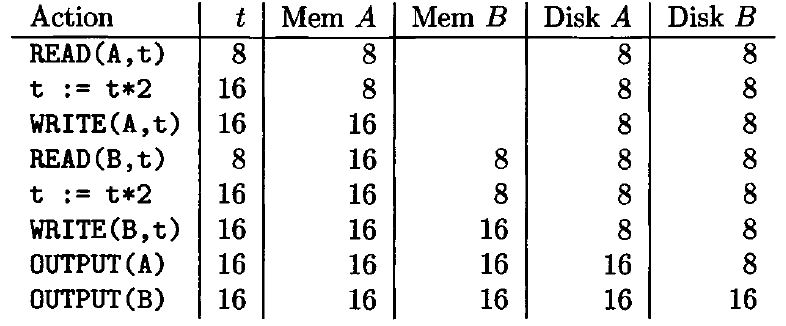
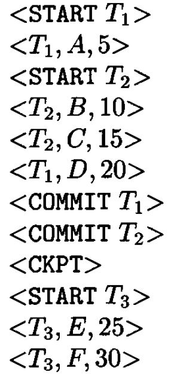
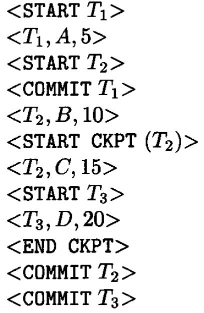
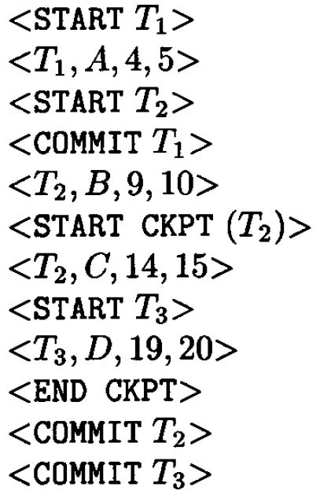
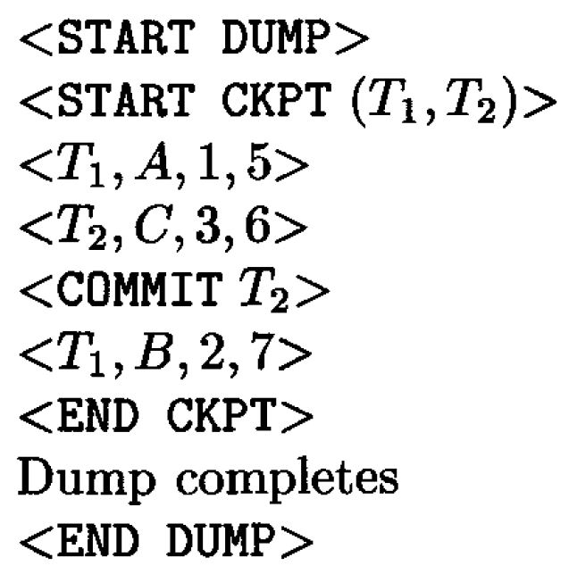

# Data Modelling and Databases - Chapter 17 (Book)

- Author: Ruben Schenk
- Date: 27.05.2021
- Contact: ruben.schenk@inf.ethz.ch

# 17. Coping With System Failures

## 17.1 Issues and Models for Resilient Operation

### 17.1.1 Failure Modes

There are many things that can go wrong as a database is queried and modified. The following items are a catalog of the most important failure modes and what the DBMS can do about them.

#### Erroneous Data Entry

The principal technique for addressing data-entry errors (such as a phone number missing a digit) is to write constraints and triggers that detect data believed to be erroneous.

#### Media Failures

A local failure of a disk, one that changes only a bit or a few bits, can normally be detected by parity checks associated with the sectors of the disk. Head crashes, where the entire disk becomes unreadable. are generally handled by one or both of the following approaches:

1. Use one of the RAID schemes.
2. Maintain an `archive`, a copy of the database on a medium such as tape or optical disk.
3. Instead of an archive, one could keep redundant copies of the database online, distributed among several sites.

#### Catastrophic Failures

In this category are a number of situations in which the media holding the database is completely destroyed, for example due to a fire. The approach of keeping an archive or redundant, distributed copies, will also protect against a catastrophic failure.

#### System Failures

The processes that query and modify the database are called `transactions`. Each transaction has a `state`, which represents what has happened so far in the transaction.

`System failures` are problems that cause the state of a transaction to be lost. Typical system failures are power loss and software errors.

When main memory is lost, the transaction state is lost. That is, we can no longer tell what parts of the transaction, including its database modifications, were made. The principal remedy for the problems that arise due to a system error is logging of all database changes in a separate, nonvolatile log, coupled with recovery when necessary.

### 17.1.2 More About Transactions

In the typical embedded SQL system, transactions begin as soon as operations on the database are executed and end with an explicit `COMMIT` or `ROLLBACK` command.

A transaction must execute atomically, that is, all-or-nothing and as if it were executed at an instant in time. Assuring that transactions are executed correctly is the job of the `transaction manager`, a subsystem that performs several functions, including:

1. Issuing signals to the log manager.
2. ASsuring that concurrently executing transactions do not interfere with each other in ways that introduce errors.

### 17.1.3 Correct Execution of Transactions

A database has a `state`, which is a value for each of its elements. Intuitively, we regard certain states as `consistent`, and others as inconsistent. Consistent states satisfy all constraints of the database schema, such as key constraints and constraints on values. 

A fundamental assumption about transactions is:

- `The Correctness Principle`: If a transaction executes in the absence of any other transaction or system errors, and it starts with the database in a consistent state, then the database is also in a consistent state when the transaction ends.

### 17.1.4 The Primitive Operations of Transactions

In order to study the details of logging algorithms and other transaction-management algorithms, we need a notation that describes all the operations that move data between address spaces. The primitives we shall use are:

1. `INPUT(X)`: Copy the disk block containing database element $X$ to a memory buffer.
2. `READ(X, t)`: Copy the database element $X$ to the transaction's local variable $t$. More precisely, if the block containing database element $X$ is not in a memory buffer then first execute `INPUT(X)`.
3. `WRITE(X, t)`: Copy the value of local variable $t$ to database element $X$ in a memory buffer. More precisely, we might first need to execute `INPUT(X)`.
4. `OUTPUT(X)`: Copy the block containing $X$ from its buffer to disk.

## 17.2 Undo Logging

A `log`  is a file of `log records`, each telling something about what some transaction has done. Our first style of logging - `undo logging` - makes repairs to the database state by undoing the effects of transactions that may not have completed before the crash.  
Additionally, in this section we introduce the basic idea of log records, including the `commit` action and its effect on the database state and log.

### 17.2.1 Log Records

Imagine the log as a file opened for appending only. As transactions execute, the `log manager` has the job of recording in the log each important event. One block of the log at a time is filled with log records, each representing one of these events.

There are several forms of log record that are used with each of the types of logging we discuss in this chapter. These are:

1. $< \text{START } T >$ : This record indicates that transaction $T$ has begun.
2. $< \text{COMMIT } T>$ : Transaction $T$ has completed successfully and will make no more changes to database elements. However, we cannot in general be sure that the changes are already on disk when we see the $< \text{COMMIT } T>$ log record.
3. $< \text{ABORT } T$ : Transaction $T$ could not complete successfully.

For an undo log, the only other kind of log record we need is an `update record`, which is a triple $< T, \, X, \, v>$. The meaning of this record is: transaction $T$ has changed database element $X$, and its former value was $v$.

### 17.2.2 The Undo-Logging Rules

An undo log is sufficient to allow recovery from a system failure, provided transactions and the buffer manager obey two rules:

- $U_1$ : If transaction $T$ modifies database element $X$, then the log record of the form $<T, \, X, \, v>$ must be written to the disk *before* the new value of $X$ is written to disk.
- $U_2$ : If a transaction commits, then its $\text{COMMIT}$ log record must be written to disk only *after* all database elements changed by the transaction have been written to disk, but as soon thereafter as possible.

In order to force log records to disk, the log manager needs a `flush-log` command that tells the buffer manager to copy to disk any log blocks that have not previously been copied to disk or that have been changed since they were last copied.

The following figure shows an example of some actions and their log entries:

 

*Figure 17.3: Actions and their log entries.*

### 17.2.3 Recovery Using Undo Logging

Suppose now that a system failure occurs. The `recovery manager` must use the log to restore the database to some consistent state.

The first task of the recovery manager is to divide the transactions into committed and uncommitted transactions. If there is a log record $< \text{COMMIT } T>$, then by undo rule $U_2$ all changes made by transaction $T$ were previously written to disk.  
However, suppose that we find a $< \text{START } T>$ record on the log but no $< \text{COMMIT } T>$ record. Then there could have been some changes to the database made by $T$ that were written to disk before the crash, while other changes by $T$ either were not made, or were made in the main-memory buffers but not copied to disk. In this case, $T$ is an `incomplete transaction` and must be `undone`.

The recovery manager must scan the log from the end. As it travels, it remembers all those transactions $T$ for which it has seen a $< \text{COMMIT } T>$ record or an $< \text{ABORT } T>$ record. Also, if it sees a record $<T, \, X, \, v>$, then:

1. If $T$ is a transaction whose $\text{COMMIT}$ record has been seen, then do nothing.
2. OTherwise, $T$ is an incomplete transaction, or an aborted transaction. The recover manager must change the value of $X$ in the database to $v$, in case $X$ had been altered just before the crash.

After making these changes, the recovery manager must write a log record $< \text{ABORT } T$ for each incomplete transaction $T$ that was not previously aborted, and then flush the log.

Example: The following figure shows an example of an undo log:

 

*Figure 17.4:  An undo log.*

### 17.2.4 Checkpointing

We might imagine that we could delete the log prior to a $\text{COMMIT}$, but sometimes we cannot. The reason is that often many transactions execute at once. If we truncated the log after one transaction committed, log records pertaining to some other active transaction #T# might be lost and could not be used to undo $T$ if recovery were necessary.  
The simplest way to untangle potential problems is to `checkpoint` the log periodically. In a simple checkpoint, we:

1. Stop accepting new transactions.
2. Wait until all currently active transactions commit or abort and have written a $\text{COMMIT}$ or $\text{ABORT}$ record on the log.
3. Flush the log to disk.
4. Write a log record $<\text{CKPT}>$, and flush the log again.
5. Resume accepting transactions.

During a recovery, we scan the log backwards from the end, identifying incomplete transactions. However, when we find a $<\text{CKPT}>$ record, we know that we have seen all the incomplete transactions.

### 17.2.5 Nonquiescent Checkpointing

A more complex technique known as `nonquiescent checkpointing`, which allows new transactions to enter the system during the checkpoint, is usually preferred. The steps in a nonquiescent checkpoint are:

1. Write a log record $<\text{START CKPT }(T_1,..., \, T_k)>$ and flush the log. Here, $T_1,..., \, T_k$ are the names or identifiers for all the *active* transactions.
2. Wait until all of $T_1,..., \, T_k$ commit or abort, but do not prohibit other transactions from starting.
3. When all of $T_1,..., \, T_k$ have completed, write a log record $<\text{END CKPT}>$ and flush the log.

## 17.3 Redo Logging

The requirement for immediate backup of database elements to disk can be avoided if we use a logging mechanism called `redo logging`. The principal differences between redo and undo logging are:

1. While undo logging cancels the effect of incomplete transactions and ignores committed ones during recovery, redo logging ignores incomplete transactions and repeats the changes made by committed transactions.
2. While undo logging requires us to write changed database elements to disk before the $\text{COMMIT}$ lof record reaches disk, redo logging requires that the $\text{COMMIT}$ record appear on disk before any changed values reach disk.

### 17.3.1 The Redo-Logging Rule

In redo logging the meaning of a log record $<T, \, X, \, v>$ is "*transaction $T$ wrote new value $v$ for database element $X$*".  
For redo logging, the order in which data and log entries reach disk can be described by a single "redo rule", called the `write-ahead logging rule`.

- $R_1$ : Before modifying any database element $X$ on disk, it is necessary that all log records pertaining to this modification of $X$, including both the update record $<T, \, X, \, v>$ and the $<\text{COMMIT } T>$ record, must appear on disk.

### 17.3.2 Recovery With Redo Logging

An important consequence of the redo rule $R_1$ is that unless the log has a $<\text{COMMIT } T>$ record, we know that no changes to the database made by transaction $T$ have been written to disk. Thus, incomplete transactions may be treated during recovery as if they had never occurred.

To recover, using a redo log, after a system crash, we do the following.

1. Identify the committed transactions.
2. Scan the log forward from the beginning. For each log record $<\text{T, \, X, \, v}>$ encountered:
   1. If $T$ is not a committed transaction, do nothing.
   2. If $T$ is committed, write value $v$ for database element $X$.
3. For each incomplete transaction $T$, write an $<\text{ABORT } T>$ record to the log and flush the log.

### 17.3.3 Checkpointing a Redo Log

Redo logs present a checkpointing problem that we do not see with undo logs.  
Regardless of whether the checkpoint is quiescent or nonquiescent, between the start and end of the checkpoint we must write to disk all database elements that have been modified by committed transactions. To do so requires that the buffer manager keep track of which buffers are `dirty`, that is, they have been changed but not written to disk. It is also required to know which transactions modified which buffers.

The steps to perform a nonquiescent checkpoint of a redo log are as follows:

1. Write a log record $<\text{START CKPT } (T_1,..., \, T_k)>$, where $T_1,..., \, T_k$ are all the active (uncommitted) transactions, and flush the log.
2. Write to disk all database elements that were written to buffers but not yet to disk by transactions that had already committed when the $\text{START CKPT}$ record was written to the log.
3. Write an $<\text{END CKPT}>$ record to the log and flush the log.

Example: Fig. 17.8 below shows a possible redo log, in the middle of which a checkpoint occurs:

 

*Figure 17.8: A redo log.*

### 17.3.4 Recovery With a Checkpointed Redo Log

Suppose first that the last checkpoint record on the log before a crash is $<\text{END CKPT}>$.  
Any transaction that is either among the $T_i$'s or that started after the beginning of the checkpoint can still have changes it made not yet migrated to disk, even though the transaction has committed. Thus, we must perform recovery as described in Section 17.3.2, but may limit our attention to the transactions that are either one of the $T_i$'s mentioned in the last $<\text{START CKPT } (T_1,..., \, T_k)>$ or that started after that log record appeared in the log.

Suppose the last checkpoint record on the log is $<\text{START CKPT }(T_1,..., \, T_k)>$. We cannot be sure that committed transactions prior to the start of this checkpoint had their changes written to disk. Thus, we must search back to the previous $<\text{END CKPT}>$ record, find its matching $<\text{START CKPT }(S_1,..., \, S_m)>$ record, and redo all those committed transactions that either started after that $\text{START CKPT}$ or among the $S_i$'s.

## 17.4 Undo/Redo Logging

We shall now see a kind of logging called `undo/redo logging`, that provides increased flexibility to order actions, at the expense of maintaining more information on the log.

### 17.4.1 The Undo/Redo Rules

An undo/redo log has the same sort of log records as the other kinds of log, with one exception. The update record that we write when a database element change value has four components. Record $<T, \, X, \, v, \, w>$ means that transaction $T$ changed the value of database $X$. Its former value was $v$, and its new value is $w$. The constraints that an undo/redo logging system must follow are summarized by the following rule:

- $UR_1$ : Before modifying any database element $X$ on disk because of changes made by some transaction $T$, it is necessary that the update record $<T, \, X, \, v, \, w>$ appear on disk.

Rule $UR_1$ for undo/redo logging thus enforces only the constraints enforced by *both* undo logging and redo logging. In particular, the $<\text{COMMIT } T>$ log record can precede or follow any of the changes to the database elements on disk.

### 17.4.2 Recovery With Undo/Redo Logging

The undo/redo recovery policy is:

1. Redo all the committed transactions in the order earlier-first, and
2. Undo all the incomplete transactions in the order latest-first.

Notice that it is necessary to do both. 

### 17.4.3 Checkpointing an Undo/Redo Log

A nonquiescent checkpoint is somewhat simpler for undo/redo logging than for the other logging methods. We have only to do the following:

1. Write a $<\text{START CKPT } (T_1,..., \, T_k)>$ record to the log, where $T_1,..., \, T_k$ are all the active transactions, and flush the log.
2. Write to disk all the buffers that are `dirty`, i.e., they contain one or more changed database elements.
3. Write an $<\text{END CKPT}>$ record to the log, and flush the log.

The only requirement we must make on transactions is:

- A transaction must not write any values (even to memory buffers) until it is certain not to abort.

Example: Fig. 17.10 below shows an undo/redo log analogous to the redo log of Fig. 17.8:

 

## 17.5 Protecting Against Media Failures

The log can protect us against system failures, where nothing is lost from disk, but temporary data in main memory is lost.  An archiving system, which we cover next, is needed to enable a database to survive losses involving disk-resident data.

### 17.5.1 The Archive

To protect against media failures, we are thus led to a solution involving `archiving` - maintaining a copy of the database separate from the database itself.

Since writing an archive is a lengthy process, we try to avoid copying the entire database at each archiving step. Thus, we distinguish between two levels of archiving:

1. A `full dump`, in which the entire database is copied.
2. An `incremental dump`, in which only those database elements changed since the previous full or incremental dump are copied.

### 17.5.2 Nonquiescent Archiving

The problem with the simple view of archiving in Section 17.5.1 is that most databases cannot be shut down for the period of time (possibly hours) needed to make a backup copy. We thus need to consider `nonquiescent archiving`, which is analogous to nonquiescent checkpointing.

A nonquiescent dump tries to make a copy of the database that existed when the dump began, but database activity may change many database elements ond isk during the minutes or hours that the dump takes.

In more detail, the process of making an archive can be broken into the following steps. We assume that the logging method is either redo or undo/redo. An undo log is not suitable for use with archiving.

1. Write a log record $<\text{START DUMP}>$.
2. Perform a checkpoint appropriate for whichever logging method is being used.
3. Perform a full or incremental dump of the data disks.
4. Make sure that enough of the log has been copied to the secure, remote site that at least the prefix of the log up and including the checkpoint in item will survive a media failure of the database.
5. Write a log record $<\text{END DUMP}>.

Example: Fig. 17.13 below shows a possible undo/redo log of the events during a dump:

 

### 17.5.3 Recovery Using an Archive and Log

We perform the following steps:

1. Restore the database from the archive.
   1. Find the most recent full dump and reconstruct the database from it (i.e., copy the archive into the database).
   2. If there are later incremental dumps, modify the database according to each, earlier first.
2. Modify the database using the surviving log. Use the method of recovery appropriate to the log method being used.

### 17.6 Summary of Chapter 17