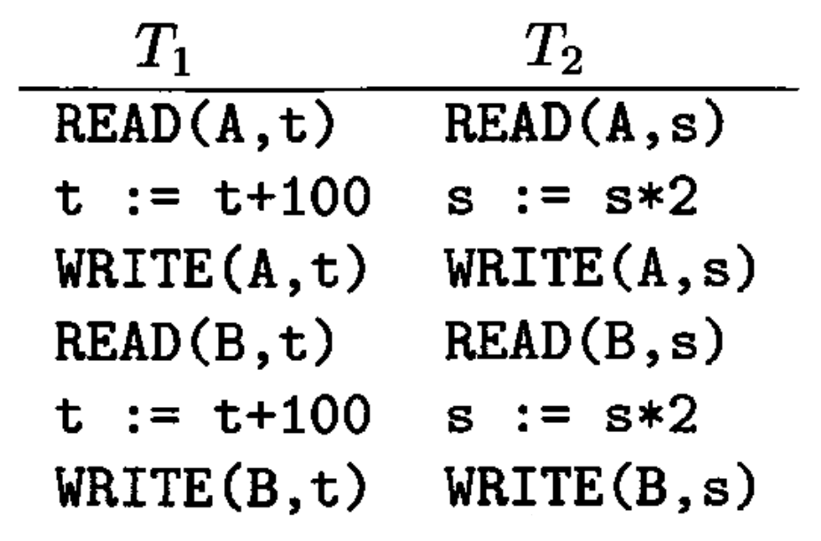
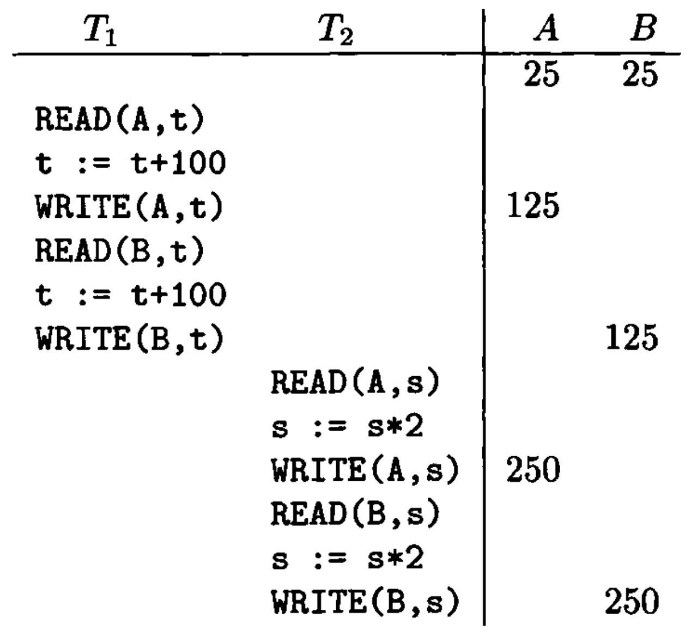
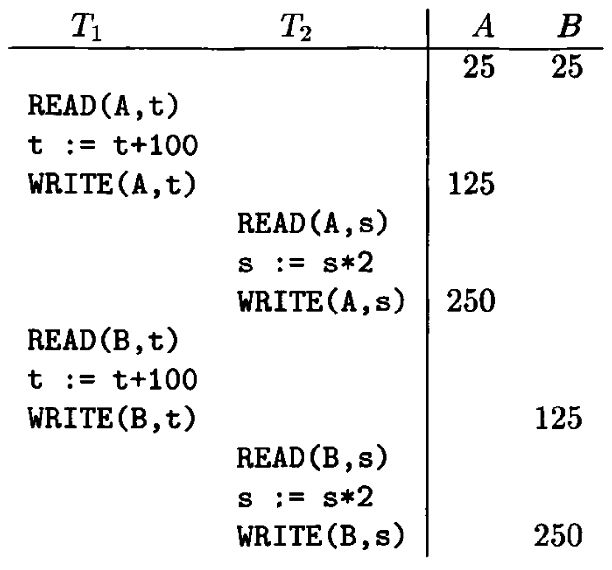
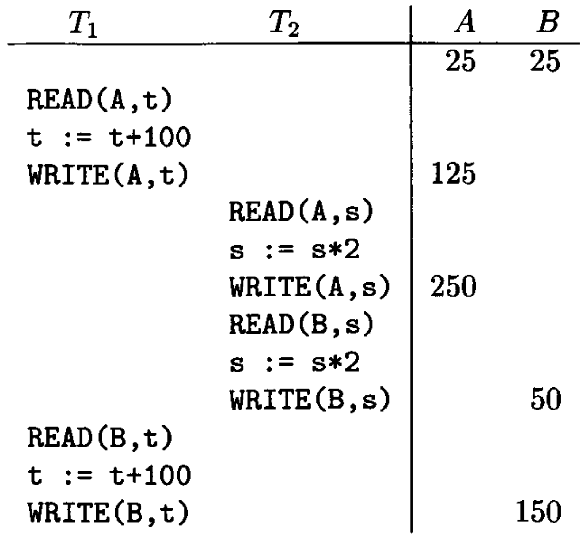
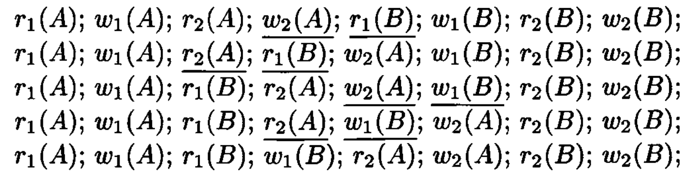
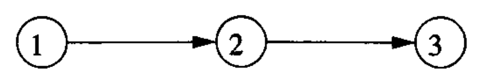

# Data Modelling and Databases - Chapter 18 (Book)

- Author: Ruben Schenk
- Date: 26.05.2021
- Contact: ruben.schenk@inf.ethz.ch

# 18. Concurrency Control

The timing of individual steps of different transactions needs to be regulated in some manner. This regulation is the job of the `scheduler` component of the DBMS, and the genera process of assuring that transactions preserve consistency when executing simultaneously is called `concurrency control`.

We begin by studying how to assure that concurrently executing transactions preserve correctness of the database state. The abstract requirement is called `serializability`, and there is an important, stronger condition called `conflict-serializability` that most schedulers actually enforce.

## 18.1 Serial and Serializable Schedules

### 18.1.1 Schedules

A `schedule` is a sequence of the important actions taken by one or more transactions. When studying concurrency control, the important read and write actions take place in the main-memory buffers, not the disk.

Example: Let us consider two transactions and the effect on the database the execution of those transactions has. We shall assume that the only consistency constraint on the database state is that $A = B$. Since $T_1$ adds $100$ to both $A$ and $B$, and $T_2$ multiplies both $A$ and $B$ by $2$, we know that each transaction, run in isolation, will preserve consistency.  
The important actions of the transactions $T_1$ and $T_2$ are shown in Fig. 18.2:

 

*Figure 18.2: Two transactions.*

### 18.1.2 Serial Schedules

A schedule is `serial` if its actions consist of all the actions of one transaction, then all the actions of another transaction, and so on. No mixing of the actions is allowed.

Example: Fig. 18.3 shows one of the two possible serial schedules of the transactions in Fig. 18.2:

 

*Figure 18.3: Serial schedule in which $T_1$ precedes $T_2$.*

### 18.1.3 Serializable Schedules

In general, we say a schedule $S$ is `serializable` if there is a serial schedule $S'$ such that for every initial database state, the effect of $S$ and $S'$ are the same.

Example: Fig. 18.5 below shows a schedule of our previous example that is serializable but not serial. Since all consistent database states have $A = B = c$ for some constant $c$, it is not hard to deduce that in the schedule of Fig. 18.5, both $A$ and $B$ will be left with the value $2(c + 100)$, and thus consistency is preserved.

 

*Figure 18.5: A serializable, but not serial, schedule.*

On the other hand, consider the schedule of Fig 18.6 below, which is not serializable. The reason we can be sure it is not serializable is that it takes the consistent state $A = B = 25$ and leaves the database in an inconsistent state, where $A = 250$ and $B = 150$.

 

*Figure 18.6: A nonserializable schedule.*

### 18.1.4 The Effect of Transaction Semantics

To simplify the job of the scheduler, it is conventional to assume that:

- Any database element $A$ that a transaction $T$ writes is given a value that depends on the database state in such a way that no arithmetic coincidences occur.

### 18.1.5 A Notation for Transactions and Schedules

If we assume "no coincidences", then only the reads and writes performed by the transaction matter, not the actual values involved. Thus, we shall represent transactions and schedules by a shorthand notation, in which the actions are $r_T(X)$ and $w_T(X)$, meaning that transaction $T$ reads, or respectively writes, database element $X$. Moreover, since we shall usually name our transactions $T_2, \, T_2,... \,$ we adopt the convention that $r_i(X)$ and $w_i(X)$ are synonyms for $r_{T_i}(X)$ and $w_{T_i}(X)$, respectively.

Example: The transactions of Fig. 18.2 can be written as:

$$
T_1: \, r_1(A); \, w_1(A); \, r_1(B); \, w_1(B); \\
T_2: \, r_2(A); \, w_2(A); \, r_2(B); \, w_2(B);
$$

To make the notation precise:

1. An `action` is an expression of the form $r_i(X)$ or $w_i(X)$, meaning that transaction $T_i$ reads or writes, respectively, the database element $X$.
2. A `transaction` $T_i$ is a sequence of actions with subscript $i$.
3. A `schedule` $S$ of a set of transactions $\mathcal{T}$ is a sequence of actions, in which for each transaction $T_i$ in $\mathcal{T}$, the actions of $T_i$ appear in $S$ in the same order that they appear in the definition of $T_i$ itself. We say that $S$ is an `interleaving` of the actions of the transactions of which it is composed.

## 18.2 Conflict-Serializability

Schedulers in commercial systems generally enforce a condition, called "`conflict-serializability`". It is based on the idea of a `conflict`: a pair of consecutive actions in a schedule such that, if their order is interchanged, then the behavior of at least one of the transactions involved can change.

### 18.2.1 Conflicts

In what follows, we assume that $T_i$ and $T_j$ are different transactions, i.e., $i \neq j$:

1. $r_i(X); \, r_j(Y)$ is never a conflict, even if $X = Y$, since neither of these steps change the value of any database element.
2. $r_i(X); \, w_j(Y)$ is not a conflict provided $X \neq Y$, since if $T_j$ should write $Y$ before $T_i$ reads $X$, the value of $X$ is not changed. Also, the read of $X$ by $T_i$ has no effect on the value $T_j$ writes for $Y$.
3. $w_i(X); \, r_j(Y)$ is not a conflict if $X \neq Y$, for the same reason as $(2)$.
4. Similarly, $w_i(X); \, w_j(Y)$ is not a conflict as long as $X \neq Y$.

On the other hand, there are three situations where we may not swap the order of actions:

1. Two actions of the same transaction, e.g., $r_i(X); \, w_i(Y)$, always conflict. The reason is that the order of actions of a single transaction are fixed and may not be recorded.
2. Two writes of the same database element by different transactions conflict. That is, $w_i(X); \, w_j(X)$ is a conflict. If we swap the order, then we leave $X$ with the value computed by $T_i$ instead of $T_j$ as before.
3. A read and a write of the same database element by different transactions also conflict. That is, $r_i(X); \, w_j(X)$ is a conflict, and so is $w_i(X); \, r_j(X)$.

We say that two schedules are `conflict-equivalent` if they can be turned one into the other by a sequence of nonconflicting swaps of adjacent actions. We shall call a schedule `conflict-serializable` if its is conflict-equivalent to a serial schedule. Note that conflict-serializable is a sufficient condition for serializability.

Example: Consider the schedule

$$
r_1(A); \, w_1(A); \, r_2(A); \, w_2(A); \, r_1(B); \, w_1(B); \, r_2(B); \, w_2(B);
$$

from our previous example. We claim this schedule is conflict-serializable. Fig. 18.8 below shows the sequence of swaps in which this schedule is converted to the serial schedule $(T_1, \, T_2)$, where all of $T_1$'s actions precede all those of $T_2$.

 

*Figure 18.8: Converting a conflict-serializable schedule to a serial schedule by swaps of adjacent actions.*

### 18.2.2 Precedence Graphs and a Test for Conflict-Serializability

Given a schedule $S$, involving transactions $T_1$ and $T_2$, perhaps among other transactions, we say that $T_1$ `takes precedence over`$T_2$, written $T_1 <_S T_2$, if there are actions $A_1$ of $T_1$ and $A_2$ of $T_2$, such that:

1. $A_1$ is ahead of $A_2$ in $S$,
2. Both $A_1$ and $A_2$ involve the same database element, and
3. At least one of$A_1$ and $A_2$ is a write action.

We can summarize these precedences in a `precedence graph`. The nodes of the precedence graph are the transactions of a schedule $S$. When the transactions are $T_i$ for various $i$, we shall label the node for $T_i$ by only the integer $i$. There is an arc from node $i$ to $j$ if $T_i <_S T_j$.

Example: The following schedule $S$ involves three transactions, $T_1$, $T_2$, and $T_3$:

$$
S: \, r_2(A); \, r_1(B); \, w_2(A); \, r_3(A); \, w_1(B); \, w_3(A); \, r_2(B); \, w_2(B);
$$

If we look at the actions involving $A$,w e find several reason why $T_2 <_S T_3$. For example, $r_2(A)$ comes ahead of $w_3(A)$. Similarly, if we look at the actions involving $B$, we find that there are several reasons why $T_1 <_S T_2$. For instance, the action $r_1(B)$ comes before $w_2(B)$.  
We therefore end up with the following precedence graph:

 

*Figure 18.9: The precedence graph for the schedule $S$ of the example above.*

To tell whether a schedule $S$ is conflict-serializable, construct the precedence graph for $S$ and ask if there are any cycles. IF so, then $S$ is not conflict-serializable. But if the graph is acyclic, then $S$ is conflict-serializable, and moreover, any topological order of the nodes is conflict-equivalent serial order.

### 18.2.3 Why the Precedence-Graph Test Works

*Left out.*

## 18.3 Enforcing Serializability by Locks

In this section, we introduce the concept of locking with a simple locking scheme. In this scheme, there is only one kind of lock, which transactions must obtain on a database element if they want to perform any operation whatsoever on that element.

### 18.3.1 Locks
