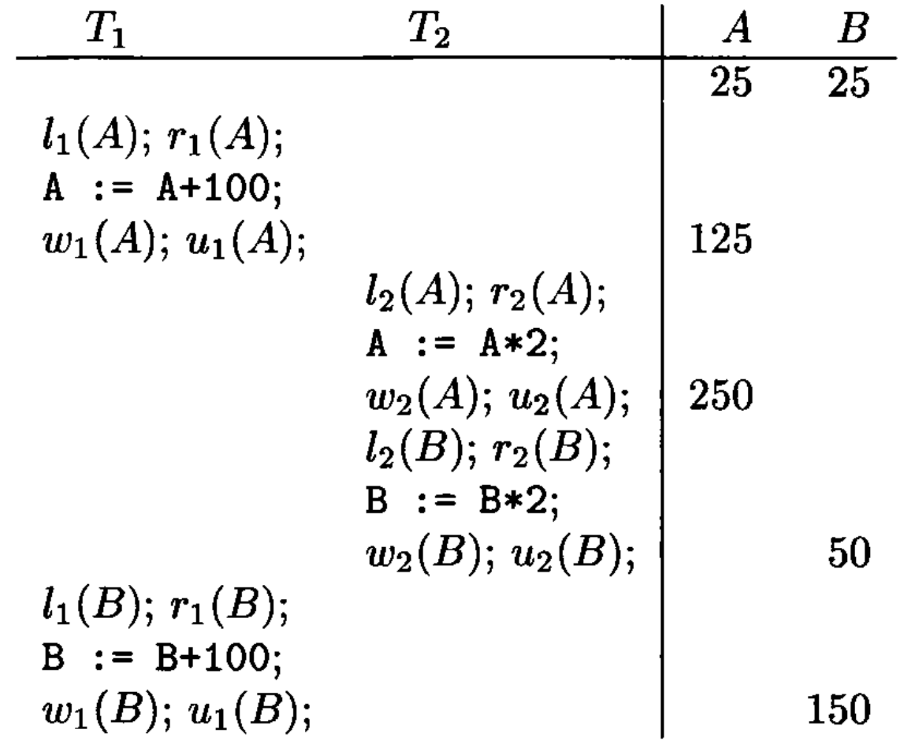
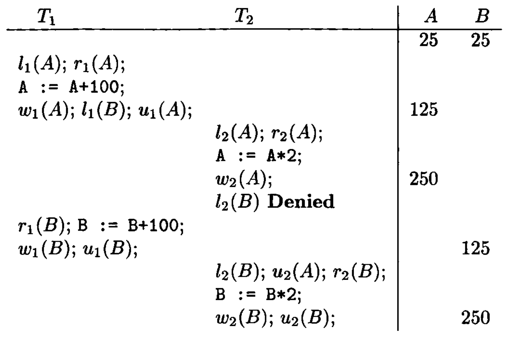
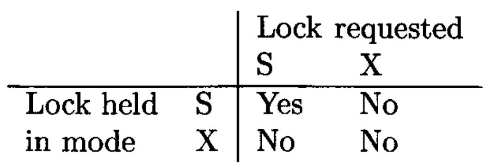
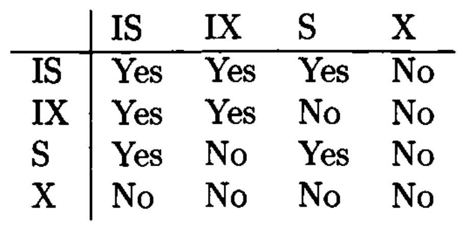

# Data Modelling and Databases - Chapter 18 (Book)

- Author: Ruben Schenk
- Date: 26.05.2021
- Contact: ruben.schenk@inf.ethz.ch

# 18. Concurrency Control

The timing of individual steps of different transactions needs to be regulated in some manner. This regulation is the job of the `scheduler` component of the DBMS, and the genera process of assuring that transactions preserve consistency when executing simultaneously is called `concurrency control`.

We begin by studying how to assure that concurrently executing transactions preserve correctness of the database state. The abstract requirement is called `serializability`, and there is an important, stronger condition called `conflict-serializability` that most schedulers actually enforce.

## 18.1 Serial and Serializable Schedules

### 18.1.1 Schedules

A `schedule` is a sequence of the important actions taken by one or more transactions. When studying concurrency control, the important read and write actions take place in the main-memory buffers, not the disk.

Example: Let us consider two transactions and the effect on the database the execution of those transactions has. We shall assume that the only consistency constraint on the database state is that $A = B$. Since $T_1$ adds $100$ to both $A$ and $B$, and $T_2$ multiplies both $A$ and $B$ by $2$, we know that each transaction, run in isolation, will preserve consistency.  
The important actions of the transactions $T_1$ and $T_2$ are shown in Fig. 18.2:

 

*Figure 18.2: Two transactions.*

### 18.1.2 Serial Schedules

A schedule is `serial` if its actions consist of all the actions of one transaction, then all the actions of another transaction, and so on. No mixing of the actions is allowed.

Example: Fig. 18.3 shows one of the two possible serial schedules of the transactions in Fig. 18.2:

 

*Figure 18.3: Serial schedule in which $T_1$ precedes $T_2$.*

### 18.1.3 Serializable Schedules

In general, we say a schedule $S$ is `serializable` if there is a serial schedule $S'$ such that for every initial database state, the effect of $S$ and $S'$ are the same.

Example: Fig. 18.5 below shows a schedule of our previous example that is serializable but not serial. Since all consistent database states have $A = B = c$ for some constant $c$, it is not hard to deduce that in the schedule of Fig. 18.5, both $A$ and $B$ will be left with the value $2(c + 100)$, and thus consistency is preserved.

 

*Figure 18.5: A serializable, but not serial, schedule.*

On the other hand, consider the schedule of Fig 18.6 below, which is not serializable. The reason we can be sure it is not serializable is that it takes the consistent state $A = B = 25$ and leaves the database in an inconsistent state, where $A = 250$ and $B = 150$.

 

*Figure 18.6: A nonserializable schedule.*

### 18.1.4 The Effect of Transaction Semantics

To simplify the job of the scheduler, it is conventional to assume that:

- Any database element $A$ that a transaction $T$ writes is given a value that depends on the database state in such a way that no arithmetic coincidences occur.

### 18.1.5 A Notation for Transactions and Schedules

If we assume "no coincidences", then only the reads and writes performed by the transaction matter, not the actual values involved. Thus, we shall represent transactions and schedules by a shorthand notation, in which the actions are $r_T(X)$ and $w_T(X)$, meaning that transaction $T$ reads, or respectively writes, database element $X$. Moreover, since we shall usually name our transactions $T_2, \, T_2,... \,$ we adopt the convention that $r_i(X)$ and $w_i(X)$ are synonyms for $r_{T_i}(X)$ and $w_{T_i}(X)$, respectively.

Example: The transactions of Fig. 18.2 can be written as:

$$
T_1: \, r_1(A); \, w_1(A); \, r_1(B); \, w_1(B); \\
T_2: \, r_2(A); \, w_2(A); \, r_2(B); \, w_2(B);
$$

To make the notation precise:

1. An `action` is an expression of the form $r_i(X)$ or $w_i(X)$, meaning that transaction $T_i$ reads or writes, respectively, the database element $X$.
2. A `transaction` $T_i$ is a sequence of actions with subscript $i$.
3. A `schedule` $S$ of a set of transactions $\mathcal{T}$ is a sequence of actions, in which for each transaction $T_i$ in $\mathcal{T}$, the actions of $T_i$ appear in $S$ in the same order that they appear in the definition of $T_i$ itself. We say that $S$ is an `interleaving` of the actions of the transactions of which it is composed.

## 18.2 Conflict-Serializability

Schedulers in commercial systems generally enforce a condition, called "`conflict-serializability`". It is based on the idea of a `conflict`: a pair of consecutive actions in a schedule such that, if their order is interchanged, then the behavior of at least one of the transactions involved can change.

### 18.2.1 Conflicts

In what follows, we assume that $T_i$ and $T_j$ are different transactions, i.e., $i \neq j$:

1. $r_i(X); \, r_j(Y)$ is never a conflict, even if $X = Y$, since neither of these steps change the value of any database element.
2. $r_i(X); \, w_j(Y)$ is not a conflict provided $X \neq Y$, since if $T_j$ should write $Y$ before $T_i$ reads $X$, the value of $X$ is not changed. Also, the read of $X$ by $T_i$ has no effect on the value $T_j$ writes for $Y$.
3. $w_i(X); \, r_j(Y)$ is not a conflict if $X \neq Y$, for the same reason as $(2)$.
4. Similarly, $w_i(X); \, w_j(Y)$ is not a conflict as long as $X \neq Y$.

On the other hand, there are three situations where we may not swap the order of actions:

1. Two actions of the same transaction, e.g., $r_i(X); \, w_i(Y)$, always conflict. The reason is that the order of actions of a single transaction are fixed and may not be recorded.
2. Two writes of the same database element by different transactions conflict. That is, $w_i(X); \, w_j(X)$ is a conflict. If we swap the order, then we leave $X$ with the value computed by $T_i$ instead of $T_j$ as before.
3. A read and a write of the same database element by different transactions also conflict. That is, $r_i(X); \, w_j(X)$ is a conflict, and so is $w_i(X); \, r_j(X)$.

We say that two schedules are `conflict-equivalent` if they can be turned one into the other by a sequence of nonconflicting swaps of adjacent actions. We shall call a schedule `conflict-serializable` if its is conflict-equivalent to a serial schedule. Note that conflict-serializable is a sufficient condition for serializability.

Example: Consider the schedule

$$
r_1(A); \, w_1(A); \, r_2(A); \, w_2(A); \, r_1(B); \, w_1(B); \, r_2(B); \, w_2(B);
$$

from our previous example. We claim this schedule is conflict-serializable. Fig. 18.8 below shows the sequence of swaps in which this schedule is converted to the serial schedule $(T_1, \, T_2)$, where all of $T_1$'s actions precede all those of $T_2$.

 

*Figure 18.8: Converting a conflict-serializable schedule to a serial schedule by swaps of adjacent actions.*

### 18.2.2 Precedence Graphs and a Test for Conflict-Serializability

Given a schedule $S$, involving transactions $T_1$ and $T_2$, perhaps among other transactions, we say that $T_1$ `takes precedence over`$T_2$, written $T_1 <_S T_2$, if there are actions $A_1$ of $T_1$ and $A_2$ of $T_2$, such that:

1. $A_1$ is ahead of $A_2$ in $S$,
2. Both $A_1$ and $A_2$ involve the same database element, and
3. At least one of$A_1$ and $A_2$ is a write action.

We can summarize these precedences in a `precedence graph`. The nodes of the precedence graph are the transactions of a schedule $S$. When the transactions are $T_i$ for various $i$, we shall label the node for $T_i$ by only the integer $i$. There is an arc from node $i$ to $j$ if $T_i <_S T_j$.

Example: The following schedule $S$ involves three transactions, $T_1$, $T_2$, and $T_3$:

$$
S: \, r_2(A); \, r_1(B); \, w_2(A); \, r_3(A); \, w_1(B); \, w_3(A); \, r_2(B); \, w_2(B);
$$

If we look at the actions involving $A$,w e find several reason why $T_2 <_S T_3$. For example, $r_2(A)$ comes ahead of $w_3(A)$. Similarly, if we look at the actions involving $B$, we find that there are several reasons why $T_1 <_S T_2$. For instance, the action $r_1(B)$ comes before $w_2(B)$.  
We therefore end up with the following precedence graph:

 

*Figure 18.9: The precedence graph for the schedule $S$ of the example above.*

To tell whether a schedule $S$ is conflict-serializable, construct the precedence graph for $S$ and ask if there are any cycles. IF so, then $S$ is not conflict-serializable. But if the graph is acyclic, then $S$ is conflict-serializable, and moreover, any topological order of the nodes is conflict-equivalent serial order.

### 18.2.3 Why the Precedence-Graph Test Works

*Left out.*

## 18.3 Enforcing Serializability by Locks

In this section, we introduce the concept of locking with a simple locking scheme. In this scheme, there is only one kind of lock, which transactions must obtain on a database element if they want to perform any operation whatsoever on that element.

### 18.3.1 Locks

A locking scheduler, like most types of scheduler, enforces conflict-serializability, which as we leaned is a more stringent condition that correctness, or even serializability.

When a scheduler uses `locks`, transactions must request and release locks, in addition to reading and writing database elements. The use of locks must be proper in two senses:

- `Consistency of Transactions`: Actions and locks must relate in the expected ways:
    1. A transaction can only read or write an element if it previously way granted a lock on that element and hasn't yet released the lock.
    2. If a transaction locks an element, it must later unlock that element.
- `Legality of Schedules`: Locks must have their intended meaning: no two transactions may have locked the same element without having first released the lock.

We shall extend our notation for actions to include locking and unlocking actions:

- $l_i(X):$ Transaction $T_i$ requests a lock on database element $X$.
- $u_i(X):$ Transaction $T_i$ releases its lock on database element $X$.

Thus, the `consistency` condition for transactions can be stated as: "*Whenever a transaction $T_i$ has an action $r_i(X)$ or $w_i(X)$, then there is a previous action $l_i(X)$ with no intervening action $u_i(X)$, and there is a subsequent $u_i(X)$.*"

The `legality of schedules` is stated as: "*If there are actions $l_i(X)$ followed by $l_j(X)$ in a schedule, then somewhere between these actions there must be an action $u_i(X)$.*"

Example: Let us consider the two transactions $T_1$ and $T_2$ that were introduce at the beginning of this chapter. Then Fig. 18.12 below shows one legal schedule of these two transactions:

 

*Figure 18.12: A legal schedule of consistent transactions. Unfortunately it is not serializable.*

### 18.3.2 The Locking Scheduler

It is the job of the a scheduler based on locking to grant requests if and only if the request will result in a legal schedule. If a request is not granted, the requesting transaction is delayed. It waits until the scheduler grants its request at a later time. To aid its decisions, the scheduler has a `lock table` that tells, for every database element, the transaction that currently holds a ock on that element.

### 18.3.3 Two-Phase Locking

There is a surprising condition, called `two-phase locking (2PL)` under which we can guarantee that a legal schedule of consistent transactions is conflict-serializable:

- In every transaction, all lock actions precede all unlock actions.

The "two phases" referred to by 2PL are thus the first phase, where locks are obtained, and the second phase, where locks are relinquished. A transaction that obeys the 2PL condition is said to be a `two-phase-locked transaction`, or 2PL transaction.

 

*Figure 18.13: The locking scheduler delays requests that would result in an illegal schedule.*

### 18.3.4 Why Two-Phase Locking Works

*Left out.*

## 18.4 Locking Systems With Several Lock Modes

The locking scheme of Section 18.3 illustrates the important ideas behind locking, but it is too simple to be a practical scheme. The main problem is that a transaction $T$ must take a lock on a database element $X$ even if it only wants to read $X$ and not write it.

We are thus motivated to introduce the most common locking scheme, where there are two different kinds of locks, one for reading (called a `shared lock`), and one for writing (called an `exclusive lock`).

### 18.4.1 Shared and Exclusive Locks

Let us consider a locking scheduler that uses two different kinds of locks: `shared locks` and `exclusive locks`. For any database element $X$ there can be either one exclusive lock on $X$, or no exclusive locks but any number of shared locks. If we want to write $X$, we need to have an exclusive lock on $X$, but if we wish only to read $X$ we may have either a shared or exclusive lock on $X$.

We shall use $sl_i(X)$ to mean "transaction $T_i$ requests a shared lock on database element $X$" and $xl_i(X)$ for "$T_i$ requests an exclusive lock on $X$". We continue to use $u_i(X)$ to mean that $T_i$ unlocks $X$.

The three kinds of requirements - consistency and 2PL for transactions, and legality of schedules - each have their counterpart for a shared/exclusive lock system. We summarize these requirements here:

1. `Consistency of transactions`: A transaction may not write without holding an exclusive lock, and you may not read without holding some lock. More precisely, in any transaction $T_i$,
   1. A read action $r_i(X)$ must be preceded by $sl_i(X)$ or $xl_i(X)$, with no intervening $u_i(X)$.
   2. A write action $w_i(X)$ must be preceded by $xl_i(X)$, with no intervening $u_i(X)$.

    All locks must be followed by an unlock of the same element.
2. `Two-phase locking of transactions`: Locking must precede unlocking. To be more precise, in any two-phase locked transaction $T_i$, no action $sl_i(X)$ or $xl_i(X)$ can be preceded by an action $u_i(Y)$, for any $Y$.
3. `Legality of schedules`: An element may either be locked exclusively by one transaction or by several in shared mode, but not both. More precisely:
   1. If $xl_i(X)$ appears in a schedule, then there cannot be a following $xl_j(X)$ or $sl_j(X)$, for some $j$ other than $i$, without an intervening $u_i(X)$.
   2. If $sl_i(X)$ appears in a schedule, then there cannot be a following $xl_j(X)$, for $j \neq i$, without an intervening $u_i(X)$.

Note that we do allow one transaction to request and hold both shared and exclusive locks on the same element, provided its doing so does not conflict with the locks of other transactions.

### 18.4.2 Compatibility Matrices

A `compatibility matrix` is a convenient way to describe lock-management policies. It has a row and column for each lock mode.

The rule for using a compatibility matrix for lock-granting decisions is:

- We can grant the lock on $X$ in mode $C$ if and only if for every row $R$ such that there is already a lock on $X$ in mode $R$ by some other transaction, then there is a "Yes" in column $C$.

Example: Fig. 18.14 is the compatibility matrix for shared ($S$) and exclusive ($X$) locks. The column for $S$ says that we can grant a shared lock on an element if the only locks held on that element currently are shared locks. The column for $X$ says that we can grant an exclusive lock only if there are no other locks held currently.

 

*Figure 18.16: The compatibility matrix for shared and exclusive locks.*

### 18.4.3 Upgrading Locks

*Left out.*

### 18.4.4 Update Locks

*Left out.*

### 18.4.5 Increment Locks

*Left out.*

## 18.5 An Architecture for a Locking Scheduler

*Left out.*

## 18.6 Hierarchies of Database Elements

### 18.6.1 Locks With Multiple Granularity

Recall that the term "database element" was purposely left undefined, because different systems use different sizes of database elements to lock, such as tuples, pages or blocks, and relations.

### 18.6.2 Warning Locks

The solution to the problem of managing locks at different granularities involves a new kind of lock called a "warning". These locks are useful when the database elements form a nested or hierarchical structure. There, we see three levels of database elements:

1. Relations are the largest lockable elements.
2. Each relation is composed of one or more block or pages, on which its tuples are stored.
3. Each block contains one or more tuples.

The rules for managing locks on a hierarchy of database elements constitute the `warning protocol`, which involves both "ordinary" locks and "warning" locks. We shall describe the lock scheme where the ordinary locks are $S$ and $X$ (shared and exclusive). The warning locks will be denoted by prefix $I$ (for "intention to") to the ordinary locks, for example $IS$ represents the intention to obtain a shared lock on a subelement. The rules of the warning protocol are:

1. To place and ordinary $S$ or $X$ lock on any element, we must begin at the root of the hierarchy.
2. If wea re at the element that we want to lock, we need look no further. We request an $S$ or $X$ lock on that element.
If the element we wish to lock is further down the hierarchy, then we place a warning at this node. That is, if we want to get a shared lock on a subelement we request an $IS$ lock at this node, and if we want an exclusive lock on a subelement, we request an $IX$ lock on this node. When the lock on the current node is granted, we proceed to the appropriate child. We then repeat step $(2)$ or step $(3)$, as appropriate, until we reach the desired node.

In order to decide whether or not one of these locks can be granted, we use the compatibility matrix of Fig. 18.28 below:

 

*Figure 18.28: Compatibility matrix for shared, exclusive, and intention locks.*

### 18.6.3 Phantoms and Handling Insertions Correctly

When transactions create new subelements of a lockable element, there are some opportunities to go wrong. The problem is that we can only lock existing items. There is no way to lock database elements that do not exist but might later be inserted.

A `phantom tuple` is one that should have been locked but wasn't, because it didn't exist at the time the locks were taken. There is, however, a simple way to avoid the occurrence of phantoms. We must regard the insertion or deletion of a tuple as a write operation on the relation as a whole. Thus,w e must obtain an $X$ on the relation before executing a insertion or deletion.

## 18.7 The Tree Protocol

Like section 18.6, this section deals with data in the form of a tree. However, here, the nodes of the tree do not from a hierarchy based on containment. Rather, database elements are disjoint pieces of data, but the only way to get to a node is through its parents. B-trees are an important example of this sort of data.

### 18.7.1 Motivation for Tree-Based Locking

Let us consider a B-tree index in a system that treats individual nodes as lockable database elements.

If we use a standard set of lock modes, like shared, exclusive, and update locks, and we use two-phase locking, then concurrent use of the B-tree is almost impossible.

In most situations, we can deduce almost immediately that a B-tree node will not be rewritten, even if the transaction inserts or deletes a tuple.  
Thus, as soon as a transaction moves to a child of the root and observes the situation that rules out a rewrite of the root, we would like to release the lock on the root. The same observation applies to the lock on any interior node of the B-tree.

### 18.7.2 Rules for Access to Tree-Structured Data

The following restrictions on locks from the `tree protocol`. We assume that there is only one kind of lock, represented by lock requests of the form $l_i(X)$. 

1. A transaction's first lock may be at any node of the tree.
2. Subsequent locks may be only acquired if the transaction currently has a lock on the parent node.
3. Nodes may be unlocked at any time.
4. A transaction may not relock a node on which it has released a lock, even if it still holds a lock on the node's parent.

### 18.7.3 Why the Tree Protocol Works

*Left out.*
