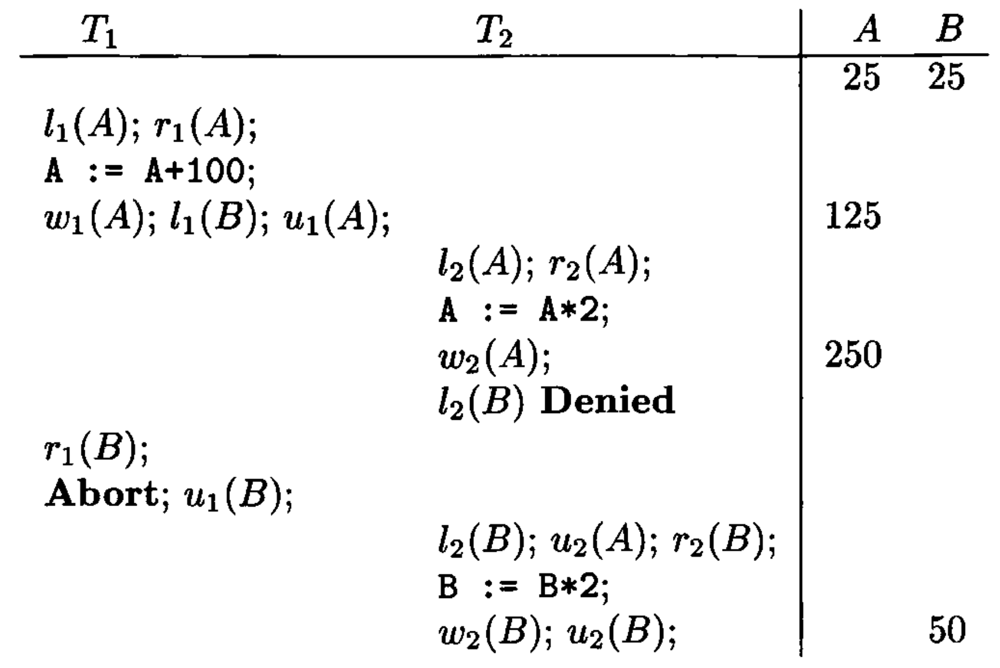
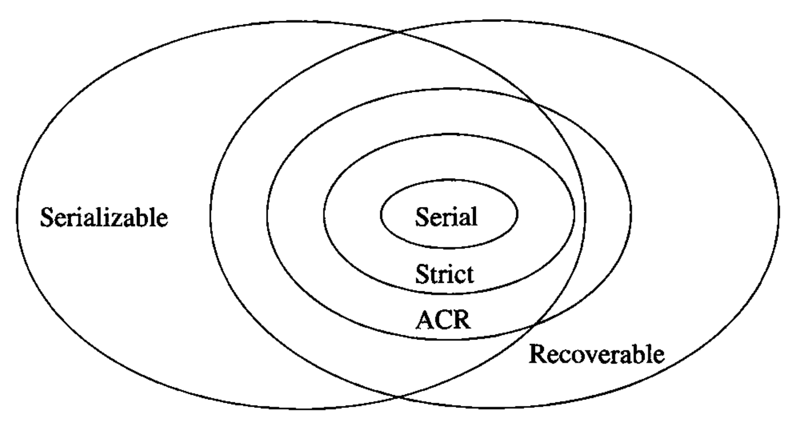

# Data Modelling and Databases - Chapter 19 (Book)

- Author: Ruben Schenk
- Date: 27.05.2021
- Contact: ruben.schenk@inf.ethz.ch

# 19. More About Transaction Management

## 19.1 Serializability and Recoverability

### 19.1.1 The Dirty-Data Problem

Recall that data is `dirty` if it has been written by a transaction that is not yet committed. The dirty data could appear either in the buffers, or on disk, or both. Either can cause trouble.

 

Example: Let us consider the serializable schedule from Fig. 18.13,  but suppose that after reading $B$, $T_1$ has to abort for some reason.  
$T_2$ has now read data that does not represent a consistent state of the database. That is, $T_2$ read the value of $A$ that $T_1$ changed, but read the value of $B$ that existed prior to $T_1$'s actions.

### 19.1.2 Cascading Rollback

As we see from the example above, if dirty data is available to transactions, then we sometimes have to perform a `cascading rollback`. That is, when a transaction $T$ aborts, we must determine which transactions have read data written by $T$, abort them, and recursively abort any transactions that have read data written by an aborted transaction.

As we have noted, a timestamp-based scheduler with a commit bit prevents a transaction that may have read dirty data from proceeding, so there is no possibility of cascading rollback with such a scheduler.

### 19.1.3 Recoverable Schedules

For any of the logging methods we have discussed in Chapter 17 to allow recovery, the set of transactions that are regarded as committed after recovery must be consistent. That is, if a transaction $T_1$ is, after recovery, regarded as committed, and $T_1$ used a value written by $T_2$, then $T_2$ must also remain committed, after recovery. Thus, we define:

- A schedule is `recoverable` if each transaction commits only after each transaction from which it has read has committed.

### 19.1.4 Schedules That Avoid Cascading Rollback

Recoverable schedules sometimes require cascading rollback. To guarantee the absence of cascading rollback, we need a stronger condition than recoverability. We say that:

- A schedule `avoids cascading rollback` (or is an `ACR schedule`) if transactions may read only values written by committed transactions.

Put another way, an ACR schedule forbids the reading of dirty data. As for recoverable schedules, we assume that "committed" means that the log's commit record has reached disk.

### 19.1.5 Managing Rollbacks Using Locking

In the common case that the scheduler is lock-based, there is a simple and commonly used way to guarantee that there are no cascading rollbacks:

- `Strict Locking:` A transaction must not release any exclusive locks until the transaction has either committed or aborted, and the commit or abort log record has been flushed to disk.

A schedule of transactions that follow the strict-locking rule is called a `strict schedule. Two important properties of these schedules are:

1. *Every strict schedule is ACR.*
2. *Every strict schedule is serializable.*

With these observations, we can now picture the relationships among the different kinds of schedules we have seen so far. The containments are suggested in Fig. 19.3 below:

 

### 19.1.6 Group Commit

Under some circumstances, we can avoid reading dirty data even if we do not flush every commit record on the log to disk immediately. As long as we flush log records in the order that they are written, we can release locks as soon as the commit record is written to the log in a buffer.

This policy, often called `group commit`, is:

- Do not release locks until the transaction finished, and the commit log record at least appear in a buffer.
- Flush log blocks in the order that they were created.

Group commit, like the policy of requiring "recoverable schedules" as discussed in Section 19.1.3, guarantees that there is never a read of dirty data.

### 19.1.7 Logical Logging

*Left out.*

### 19.1.8 Recovery From Logical Logs

*Left out.*
