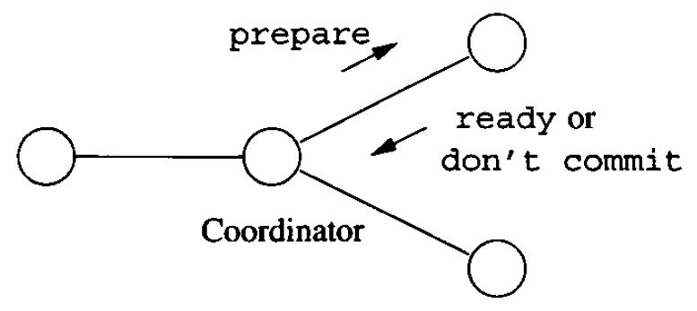

# Data Modelling and Databases - Chapter 20 (Book)

- Author: Ruben Schenk
- Date: 30.05.2021
- Contact: ruben.schenk@inf.ethz.ch

# 20. Parallel and Distributed Databases

## 20.1 Parallel Algorithms on Relations

In this section, we shall review the principal architectures for parallel machines. We then concentrate on the "shared-nothing" architecture, which appears to be the most cost effective for database operations, although it may not be superior for other parallel applications.

### 20.1.1 Models of Parallelism

At the heat of all parallel machines is a collection of processors. Often the number of processors $p$ is large, in the hundreds or thousands.  
Additionally, parallel computers all have some communications facility for passing information among processors. In our diagrams, we show the communication as if there were a shared bus for all the elements of the machines.

We might classify parallel architectures into three broad groups:

#### Shared-Memory Machines

In this architecture each processor has access to all the memory of all processors. That is, there is a single physical address space for the entire machine, rather than one address space for each processors.

Large machines of this class are of the `NUMA` (nonuniform memory access) type, meaning that it takes somewhat more time for a processor to access data in a memory that belongs to some other processor than it does to access its own memory.

#### Shared-Disk Machines

In this architecture, every processor has its own memory, which is not accessible directly from other processors. However, the disks are accessible from any of the processors through the communication network.  
This architecture today appears in two forms, depending on the units of transfer between the disks and processors. Disk farms called `network attached storage (NAS)` store and transfer files. The alternative, `storage area networks (SAN)` transfer disk blocks to and from the processor.

#### Shared-Nothing Machines

Here, all processors have their own memory and their own disk or disks. All communication is via the network, from processor to processor.

The shared-nothing architecture is the most commonly used architecture for database systems. Shared-nothing machines are relatively inexpensive to build. One buys racks of commodity machines and connects them with the network connection that is typically built into the rack. Multiple racks can be connected by an external network.

### 20.1.2 Tuple-at-a-Time Operations in Parallel

*Left out.*

### 20.1.3 Parallel Algorithms for Full-Relation Operations

*Left out.*

### 20.1.4 Performance of Parallel Algorithms

*Left out.*

## 20.2 The Map-Reduce Parallelism Framework

*Left out.*

## 20.3 Distributed Databases

The difference between a distributed system and a shared-nothing parallel system is in the assumption about the cost of communication. Shared-nothing parallel systems usually have a message-passing cost that is small compared with disk accesses and other costs. In a distributed system, the processors are typically physically distant, rather than in the same room.

### 20.3.1 Distribution of Data

One important reason to distribute data is that the organization is itself distributed among many sites, and the sites each have data tha is germane primarily to that site. For example, a bank may has many branches. Each branch will keep a database of accounts maintained at that branch. The bank many also have data that is kept in the central office, such as employee records and policies such as current interest rates.

In some cases, what we might think of logically as a single relation has been partitioned among many sites. For example, the chain of stores might be imagined to have a single sales relation, such as:

```
    Sales(item, date, price, purchaser)
```

However, this relation does not exist physically. Rather, it is the union of a number of relations with the same schema, one at each of the stores in the chain. These `relations` are called `fragments`, and the partitioning of a logical relation into physical fragments is called `horizontal decomposition` of the relation $\text{Sales}$.  
In other situations, a distributed database appears to have partitioned a relation `vertically`, by decomposing what might be one logical relation into two or more, each with a subset of the attributes, and with each relation at a different site.

### 20.3.2 Distributed Transactions

A consequence of the distribution of data is that a transaction may involve processes at several sites.  
A transaction consists of communicating `transaction components`, each at a different site and communicating with the local scheduler and logger.

### 20.3.3 Data Replication

One important advantage of a distributed system is the ability to `replicate` data, that is, to make copies of the data at different sites.  
However, there are several problems that must be faced when data is replicated.

1. How do we keep copies identical?
2. How do we decide where and how many copies to keep?
3. What happens when there is a communication failure in the network, and different copies of the same data have the opportunity to evolve separately and must then be reconciled when the network reconnects?

## 20.4 Distributed Query Processing

*Left out.*

## 20.5 Distributed Commit

In this section, we shall address the problem of how a distributed transaction that has components at several sites can execute atomically.

### 20.5.1 Supporting Distributed Atomicity

We shall begin with an example that illustrates the problems that might arise.

Example: Consider our example of a chain of stores mentioned in Section 20.3. Suppose a manager of the chain wants to query all the stores, find the inventory of toothbrushes at each, and issue instructions to move toothbrushes from store to store in order to balance the inventory. The operation is done by a single global transaction $T$ that has component $T_i$ at the $i$th store and a component $T_0$ at the office where the manager is located. The sequence of activities performed by $T$ are summarized below:

1. Component $T_0$ is created at the site of the manager.
2. $T_0$ sends messages to all the stores instructing them to create components $T_i$.
3. Each $T_i$ executes a query at store $i$ to discover the number of toothbrushes in inventory and reports this number to $T_0$.
4. $T_0$ takes these numbers and determines what shipments of toothbrushes are desired. $T_0$ then sends messages such as "store 10 should ship 500 toothbrushes to store 7" to the appropriate stores.
5. Stores receiving instructions update their inventory and perform the shipments.

Suppose a bug in the algorithm to redistribute toothbrushes might cause store 10 to be instructed to ship more toothbrushes than it has. $T_{10}$ will therefore abort, and no toothbrushes will be shipped from store 10. However, $T_7$ detects no problems and commits at store 7. updating its inventory to reflect the supposedly shipped toothbrushes.

### 20.5.2 Two-Phase Commit

In order to avoid the problems suggested in the previous section, distributed DBMS's use a complex protocol for deciding whether or not to commit a distributed transaction. In this section, we shall describe the basic idea behind these protocols, called `two-phase commit`.

Several salient points about the two-phase commit protocol follow:

- In a two-phase commit, we assume that each site logs actions at that site, but there is no global log.
- We also assume that one site, called the `coordinator`, plays a special role in deciding whether or not the distributed transaction an commit.

#### Phase 1

In phase 1 of the two-phase commit, the coordinator for a distributed transaction $T$ decides when to attempt to commit $T$. PResumably the attempt to commit occurs after the component of $T$ at the coordinator site is ready to commit, but in principle the steps must be carried out even if the coordinator's component wants to abort. The coordinator polls the sites of all components of the transaction $T$ to determine their wishes regarding the commit/abort decision, as follows:

1. The coordinator places a log record $< \text{Prepare } T>$ on the log at its site.
2. The coordinator sends to each component's site the message $\text{prepare } T$.
3. Each site receiving the message $\text{prepare } T$ decides whether to commit or abort its component of $T$.
4. If a site wants to commit its components, it must enter a state called `precommitted`. Once in the precommitted state, the site cannot abort its components of $T$ without a directive to do so from the coordinator. The following steps are done to be precommitted:
   1. Perform whatever steps are necessary to be sure the local component of $T$ will not have to abort, even if there is a system failure followed by recovery at the site.
   2. Place the record $<\text{Ready } T>$ on the local log and flush the log to disk.
   3. Send to the coordinator the message $\text{ready } T$.
5. If, instead, the site wants to abort its component of $T$, then it logs the record $<\text{Don't commit } T>$ and sends the message $\text{don't commit }$ $T$ to the coordinator.

The messages oh phase 1 are summarized in Fig. 20.12 below:

<br>

*Figure 20.12: Messages in phase 1 of two-phase commit.*

#### Phase 2

The second phase begins when responses $\text{ready}$ or $\text{don't commit}$ are received from each site by the coordinator. However, it is possible that some site fails to respond. It may be down, or it has been disconnected by the network. In that case, after a suitable timeout period, the coordinator will treat the site as if it had send $\text{don't commit}$.

1. If the coordinator has received $\text{ready } T$ from all components of $T$, then it decides to commit $T$. The coordinator logs $<\text{Commit } T>$ at its site and then sends message $\text{commit } T$ to all sites involved in $T$.
2. However, if the coordinator has received $text{don't commit } T$ from one or more sites, it logs $<\text{Abort } T>$ at its site and then sends $\text{abort } T$ messages to all sites involved in $T$.
3. If a site receives a $\text{commit } T$ message, it commits the component of $T$ at that site, logging $<\text{Commit } T>$ as it does.
4. If a site receives the message $\text{abort } T$, it aborts $T$ and writes the log record $<\text{Abort } T>$.

The messages of phase 2 are summarized in Fig. 20.13:

<br>

### 20.5.3 Recovery of Distributed Transactions

There are several cases to consider, depending on the last log entry for $T$:

1. If the last log record for $T$ was $<\text{Commit } T>$, then $T$ must have been committed by the coordinator. It may be necessary to redo the component of $T$ at the recovering site.
2. If the last log record is $<\text{Abort } T>$, then similarly we know that the global decision was to abort $T$. If the log method requires it, we undo the component of $T$ at the recovering site.
3. If the last log record is $<\text{Don't commit } T>$, then the site knows that the global decision mus have been to abort $T$. If necessary, effects of $T$ on the local database are undone.
4. The hard case is when the last log record for $T$ is $<\text{Read } T>$. Now, the recovering site does not know whether the global decision was to commit or abort $T$. The site might communicate any other site to find out about the global decision. In the worst case, no other site can be contacted, and the local component of $T$ must be kept active until the commit/abort decision is determined.
5. It may also be the case that the local log has no records about $T$ that come from the actions of the two-phase commit protocol. If so, then the recovering site may unilaterally decide to abort its component of $T$, which is consistent with all logging methods.

If the failed site is the coordinator, we need to elect a new leader. The matter of `leader election` is in its own right a complex problem of distributed systems, beyond the scope of this book.  
Once we found a new leader, the new leader polls the sites for information about each distributed transaction $T$. Each site reports the last record on its log concerning $T$, if there is one. The possible cases are:

1. Some site has $<\text{Commit } T>$ on its log. Then the original coordinator must have wanted to send $\text{commit } T$ messages everywhere, and it is safe to commit $T$.
2. Similarly, if some site has $<\text{Abort } T>$ on its log, then the original coordinator must have decided to abort $T$, and it is safe for the new coordinator to order that action.
3. Suppose now that no site has $<\text{Commit } T>$ or $<\text{Abort } T>$ on its log, but at least one sit does *not* have $<\text{Ready } T>$ on its log. Then since actions are logged before the corresponding messages are sent, we know that the old coordinator never received $\text{ready } T$ from this site and therefore could not have decided to commit.
4. The most problematic situation is when there is no $<\text{Commit } T>$ or $<\text{Abort } T>$ to be found, but every surviving site has $<\text{Ready } T>$. Now, we cannot be sure whether the old coordinator found some reason to abort $T$ or not. Thus, the new coordinator is not able to decided whether to commit or abort $T$ and must wait until the original coordinator recovers.

## 20.6 Distributed Locking

*Left out.*

## 20.7 Peer-to-Peer Distributed Search

*Left out.*

## 20.8 Summary of Chapter 20

#### Parallel Machines

Parallel machines can be characterized as shared-memory, shared-disk, or shared-nothing. 

#### Distributed Data

In a distributed database, data may be partitioned horizontally (one relation has its tuples spread over several sites) or vertically (a relation's schema is decomposed into several schemas whose relations are at different sites).

#### Distributed Transactions

In a distributed database, one logical transaction may consist of components, each executing at a different site. To preserve consistency, these components must all agree on whether to commit or abort the logical transaction.

#### Two-Phase Commit

This algorithm enables transaction components to decide whether to commit or abort, often allowing a resolution even in the face of a system crash. In the first phase, a coordinator component polls the components whether they want to commit or abort. In the second phase, the coordinator tells the components to commit if and only if all have expressed a willingness to commit.
