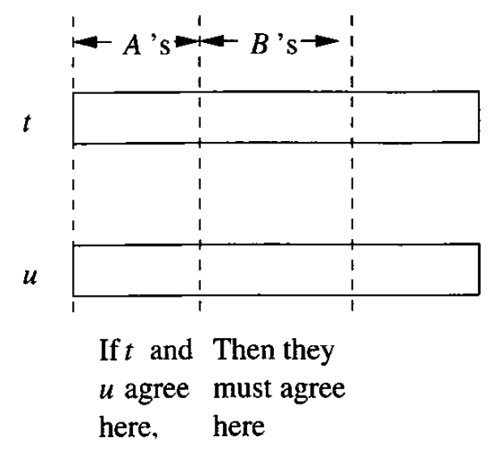
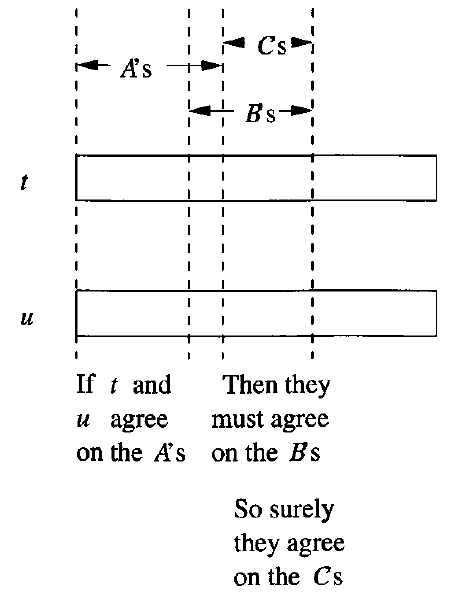

# Data Modelling and Databases - Chapter 3 (Book)

- Author: Ruben Schenk
- Date: 13.05.2021
- Contact: ruben.schenk@inf.ethz.ch

# 3. Design Theory for Relational Databases

## 3.1 Functional Dependencies

There is a design theory for relations that lets us examine a design carefully and make improvements based on a few simple principles. The theory begins by having us state the constraints that apply to the relation. The most common constraint is the "functional dependency", a statement of a type that generalizes the idea of a key for a relation.

Later in this chapter, we shall see how this theory gives us simple tools to improve our designs by the process of "decomposition" of relations: the replacement of one relation by several, whose sets of attributes together include all the attributes of the original.

### 3.1.1 Definition of Functional Dependency

A `functional dependency (FD)` on a relation $R$ is a statement of the form:

> *If two tuples of $R$ agree on all of the attributes $A_1, \, A_2,..., \, A_n$, then they must also agree on all of another list of attributes $B_1, \, B_2,..., \, B_m$.*

We write this FD formally as $A_1 A_2 \cdots A_n \rightarrow B_1 B_2 \cdots B_m$ and say that

$$
"A_1, \, A_2,..., \, A_n \text{ functionally determine } B_1, \, B_2,..., \, B_m"
$$

 

If we can be sure every instance of a relation $R$ will be one in which a given FD is true, then we say that $R$ `satisfies` the FD. It is common for the right side of an FD to be a single attribute.

Example: Let us consider the relation *Movies1(title, year, length, genre, studioName, starName)*. To see what is wrong with the design, we first determine the functional dependencies that hold for the relation. We claim that the following FD folds:

$$
\text{title year } \rightarrow \text{ length genre studioName}
$$

Informally, this FD says that if two tuples have the same value in their *title* and *year* components, then these tuples must also have the same values in their *length*, *genre*, and *studioName* components.

On the other hand, we observe that the statement

$$
\text{title year } \rightarrow \text{ starName}
$$

is false. It is not a functional dependency. Given a movie, it is entirely possible that there is more than one star for the movie listed in our database.

### 3.1.2 Key of Relations

We say a set of one or more attributes $\{A_1, \, A_2,..., , A_n \}$ is a `key` for a relation $R$ if:

1. Those attributes functionally determine all other attributes of the relation. That is, it is impossible for two distinct tuples of $R$ to agree on all of $A_1, \, A_2,..., \, A_n$.
2. No proper subset of $\{A_1, \, A_2,..., \, A_n \}$ functionally determines all other attributes of $R$, i.e., a key must be `minimal`.

When a key consists of a single attribute $A$, we often say that $A$ (rather than $\{A \}$) is a key.

### 3.1.3 Superkeys

A set of attributes that contains a key is called a `superkey`, short for "superset of a key". Thus, every key is a superkey. However, some superkeys are not (minimal) keys. Note that every superkey satisfies the first condition of a key: it functionally determines all other attributes of the relation. However, a superkey need not satisfy the second condition: minimality.

Example: In our *Movies1* relation, there are many superkeys. Not only is the key

$$
\{\text{title, year, starName} \}
$$

a superkey, but any superset of this set of attributes, such as

$$
\{\text{title, year, starName, length, studioName}\}
$$

is a superkey.

## 3.2 Rules About Functional Dependencies

In this section, we shall learn how to `reason` about FD's. That is, suppose we are told of a set of FD's that a relation satisfies. OFten, we can deduce that the relation must satisfy certain other FD's. This ability to discover additional FD's is essential when we discuss the design of good relation schemas in Section 3.3.

### 3.2.1 Reasoning About Functional Dependencies

Let us begin with a motivating example that will show us how we can infer a functional dependency from other given FD's.

Example: If we are told that a relation $R(A, \, B, \, C)$ satisfies the FD's $A \rightarrow B$ and $B \rightarrow C$, then we can deduce that $R$ also satisfies the FD $A \rightarrow C$.

To prove that $A \rightarrow C$, we must consider two tuples of $R$ that agree on $A$ and prove they also agree on $C$.

Let the tuples agreeing on attribute $A$ be $(a, \, b_1, \, c_1)$ and $(a, \, b_2, \, c_2)$. Since $R$ satisfies $A \rightarrow B$, and these tuples agree on $A$, they must also agree on $B$. That is, $b_1 = b_2 = b$, and the tuples are really $(a, \, b, \, c_1)$ and $(a, \, b, \, c_2)$. Similarly, since $R$ satisfies $B \rightarrow C$, and the tuples agree on $B$, they agree on $C$. Thus, $c_1 = c_2 = c$, i.e., the tuples do agree on $C$, and that is the FD $A \rightarrow C$ we wanted to prove.

FD's can often be presented in several different ways, without changing the set of legal instances of the relation. We say:

- Two sets of FD's $S$ and $T$ are `equivalent` if the set of relation instances satisfying $S$ is exactly the same as the set of relation instances satisfying $T$.
- More generally, a set of FD's $S$ `follows` from a set of FD's $T$ if every relation instance that satisfies all the FD's in $T$ also satisfies all the FD's in $S$.

Note that two sets of FD's $S$ and $T$ are equivalent if and only if $S$ follows from $T$, and $T$ follows from $S$.

### 3.2.2 The Splitting/Combining Rule

Recall that we commented that the FD:

$$
A_1 A_2 \cdots A_n \rightarrow B_1 B_2 \cdots B_m
$$

is equivalent to the set of FD's:

$$
A_1 A_2 \cdots A_n \rightarrow B_1, \quad A_1 A_2 \cdots A_n \rightarrow B_2, \quad ... \quad A_1 A_2 \cdots A_n \rightarrow B_m
$$

That is, we may split attributes on the right side so that only one attribute appears on the right of each FD. Likewise, we can replace a collection of FD's having a common left side by a single FD with the same left side and all the right sides combined into one set of attributes.

- We can replace FD $A_1 A_2 \cdots A_n \rightarrow B_1 B_2 \cdots B_m$ by a set of FD's $A_1 A_2 \cdots A_n \rightarrow B_i$ for $i = 1, \, 2,..., \, m$. We call this transformation the `splitting rule`.
- We can replace a set of FD's $A_1 A_2 \cdots A_n \rightarrow B_i$ for $i = 1, \, 2,..., \, m$ by the single FD $A_1 A_2 \cdots A_n \rightarrow B_1 B_2 \cdots B_m$. We call this transformation the `combining rule`.

Example: In a previous example, the set of FD's:

$$
\text{title year } \rightarrow \text{ length} \\
\text{title year } \rightarrow \text{ genre} \\
\text{title year } \rightarrow \text{ studioName} \\
$$

is equivalent to the single FD:

$$
\text{title year } \rightarrow \text{ length genre studioName} \\
$$

that we asserted there.

### 3.2.3 Trivial Functional Dependencies

A constraint of any kind on a relation is said to be `trivial` if it holds for every instance of the relation, regardless of what other constraints are assume. When the constraints are FD's, it is easy to tell whether an FD is trivial. They are the FD's $A_1 A_2 \cdots A_n \rightarrow B_1 B_2 \cdots B_m$ such that

$$
\{B_1, \, B_2, ..., \, B_m \} \subseteq \{A_1, \, A_2,..., \, A_n \}
$$

That is, a trivial FD has a right side that is a subset of its left side. For example,

$$
\text{title year } \rightarrow \text{ title}
$$

is a trivial FD, as is

$$
\text{title } \rightarrow \text{ title}
$$

There is an intermediate situation in which some, but not all, of the attributes on the right side of an FD are also on the left. This FD is not trivial, but it can be simplified by removing from the right side of an FD those attributes that appear on the left. That is:

- The FD $A_1 A_2 \cdots A_n \rightarrow B_1 B_2 \cdots B_m$ is equivalent to

    $$
    A_1 A_2 \cdots A_n \rightarrow C_1 C_2 \cdots C_k
    $$

    where the $C$'s are all those $B$'s that are not also $A$'s.

We call this rule, illustrated in the figure below, the `trivial-dependency rule`.

 

### 3.2.4 Computing the Closure of Attributes

Before proceeding to other rules, we shall give a general principle from which all true rules follow. Suppose $\{A_1, \, A_2,..., \, A_n \}$ is a set of attributes and $S$ is a set of FD's.

The `closure` of $\{A_1, \, A_2,..., \, A_n \}$ under the FD's in $S$ is the set of attributes $B$ such that every relation that satisfies all the FD's in set $S$ also satisfies $A_1 A_2 \cdots A_n \rightarrow B$. We denote the closure of a set of attributes $A_1 A_2 \cdots A_n$ by $\{A_1, \, A_2,..., \, A_n \}^+$. Note that $A_1, \, A_2,..., \, A_n$ are always in $\{A_1, \, A_2,..., \, A_n \}^+$ because the FD $A_1 A_2 \cdots A_n \rightarrow A_i$ is trivial when $i$ is one of $1, \, 2,..., \, n.$

#### Algorithm 3.7: Closure of a Set of Attributes

**INPUT:** A set of attributes $\{A_1, \, A_2,..., \, A_n \}$ and a set of FD's $S$.

**OUTPUT:** The closure $\{A_1, \, A_2,..., \, A_n \}^+.$

1. If necessary, split the FD's of $S$, so each FD in $S$ has a single attribute on the right.
2. Let $X$ be a set of attributes that eventually will become the closure. Initialize $X$ to be $\{A_1, \, A_2,..., \, A_n \}$.
3. Repeatedly search for some FD

    $$
    B_1 B_2 \cdots B_m \rightarrow C
    $$

    such that all of $B_1, \, B_2,..., \, B_m$ are in the set of attributes $X$, but $C$ is not. Add $C$ to the set of $X$ and repeat the search. Since $X$ can only grow, and the number of attributes of any relation schema must be finite, eventually nothing more can be added to $X$, and this step ends.
4. The set $X$, after no more attributes can be added to it, is the correct value of $\{A_1, \, A_2,..., \, A_n \}^+$.

By computing the closure of any set of attributes, we can test whether any given FD $A_1 A_2 \cdots A_n \rightarrow B$ follows from a set of FD's $S$. More generally, $A_1 A_2 \cdots A_n \rightarrow B_1 B_2 \cdots B_m$ follows from set of FD's $S$ if and only if all of the $B_1, \, B_2,..., \, B_m$ are in

$$
\{A_1, \, A_2,..., \, A_n \}^+
$$

### 3.2.5 Why the Closure Algorithm Works

In this section, we shall show why Algorithm 3.7 correctly decides whether or not an FD $A_1 A_2 \cdots A_n \rightarrow B$ follows from a given set of FD's $S$. There are two parts to the proof:

1. We must show that Algorithm 3.7 does not claim too much. That is, we must show that if $A_1 A_2 \cdots A_n \rightarrow B$ is asserted by the closure test, then $A_1 A_2 \cdots A_n \rightarrow B$ holds in any relation that satisfies all the FD's in $S$.
2. We must prove that Algorithm 3.7 does not fail to discover a FD that truly follows from the set of FD's $S$.

#### Why the Closure Algorithm Claims only True FD's

We can prove by induction on the number of times that we apply the growing operation of Step 3 that for every attribute $D$ in $X$, the FD $A_1 A_2 \cdots A_n \rightarrow D$ holds.

**Basis:** The basic case is when there are zero steps. Then $D$ must be one of $A_1, \, A_2,..., \, A_n$, and surely $A_1 A_2 \cdots A_n \rightarrow D$ holds in any relation, because it is a trivial FD.

**Induction:** For the induction, suppose $D$ was added when we used the FD $B_1 B_2 \cdots B_m \rightarrow D$ of $S$. We know by the inductive hypothesis is that $R$ satisfies $A_1 A_2 \cdots A_n \rightarrow B_1 B_2 \cdots B_m$. Now, suppose two tuples of $R$ agree on all of $A_1, \, A_2,..., \, A_n$. Then since $R$ satisfies $A_1 A_2 \cdots A_n \rightarrow B_1 B_2 \cdots B_m$, the two tuples must agree on all of $B_1, \, B_2,..., \, B_m$. Since $R$ satisfies $B_1 B_2 \cdots B_m \rightarrow D$, we also know these two tuples agree on $D$. Thus, $R$ satisfies $A_1 A_2 \cdots A_n \rightarrow D$.

#### Why the Closure Algorithm Discovers All True FD's

Suppose $A_1 A_2 \cdots A_n \rightarrow B$ were an FD Algorithm 3.7 says does not follow from set $S$. WE must show that FD $A_1 A_2 \cdots A_n \rightarrow B$ really doesn't follow from $S$. That is, we must show that there is at least one relation instance that satisfies all the FD's in $S$, and yet does not satisfy $A_1 A_2 \cdots A_n \rightarrow B$.

This instance $I$ is actually quite simple to construct. It is shown in the table below. $I$ has only two tuples: $t$ and $s$. The two tuples agree in all the attributes of $\{A_1, \, A_2,..., , A_n \}^+$, and they disagree in all other attributes. We must show first that $I$ satisfies all the FD's of $S$. and then that it does not satisfy $A_1 A_2 \cdots A_n \rightarrow B$.

|      | $\{A_1, \, A_2,..., , A_n \}^+$ | Other Attributes |
| :--- | :-----------------------------: | :--------------: |
| $t:$ | $111 \cdots 11$                 | $000 \cdots 00$  |
| $s:$ | $111 \cdots 11$                 | $111 \cdots 11$  |

Suppose there were some FD $C_1 C_2 \cdots C_k \rightarrow D$ in set $S$ that instance $I$ does not satisfy. Since $I$ has only two tuples, $t$ and $s$, those must be the two tuples that violate $C_1 C_2 \cdots C_k \rightarrow D$. That is, $t$ and $s$ agree in all the attributes of $\{C_1, \, C_2,..., \, C_k \}$, yet disagree on $D$. If we examine the table above, we see that all of $C_1, \, C_2,..., , C_k$ must be among the attributes of $\{A_1, \, A_2,..., \, A_n \}$, because those are the only attributes on which $t$ and $s$ agree. Likewise, $D$ must be among the other attributes, because only on those attributes do $t$ and $s$ disagree.

But then we did not compute the closure correctly. $C_1 C_2 \cdots C_k \rightarrow D$ should have been applied when $X$ was $\{A_1, \, A_2, ..., \, A_n\}$ to add $D$ to $X$. We conclude that $C_1 C_2 \cdots C_k \rightarrow D$ cannot exist, i.e. instance $I$ satisfies $S$.

Second, we must show that $I$ does not satisfy $A_1 A_2 \cdots A_n \rightarrow B$. However, this part is easy. Surely, we know that $B$ is not in $\{A_1, \, A_2,.., \, A_n \}^+$, so $B$ is one of the attributes on which $t$ and $s$ disagree. Thus, $I$ does not satisfy $A_1 A_2 \cdots A_n \rightarrow B$.

### 3.2.6 The Transitive Rule

The `transitive rule` lets us cascade two FD's, and generalizes the observation of a previous example:

- If $A_1 A_2 \cdots A_n \rightarrow B_1 B_2 \cdots B_m$ and $B_1 B_2 \cdots B_m \rightarrow C_1 C_2 \cdots C_k$ hold in relation $R$, then $A_1 A_2 \cdots A_n \rightarrow C_1 C_2 \cdots C_k$ also holds in $R$.

If some of the $C$'s are among the $A$'s, we may eliminate them from the right side by the trivial-dependencies rule.

Example: The following table shows another version of the *Movies* relation:

| $title$       | $year$ | $length$ | $genre$ | $studioName$ | $studioAddr$ |
| :------------ | :----- | :------- | :------ | :----------- | :----------- |
| Star Wars     | 1977   | 124      | sciFi   | Fox          | Hollywood    |
| Eight Below   | 2005   | 120      | drama   | Disney       | Buena Vista  |
| Wayne's World | 1992   | 95       | comedy  | Paramount    | Hollywood    |

Two of the FD's that we might reasonably claim to hold are:

$$
\text{title year } \rightarrow \text{ studioName} \\
\text{studioName } \rightarrow \text{ studioAddr}
$$

The transitive rule allows us to combine the two FD's above to get a new FD:

$$
\text{title year } \rightarrow \text{ studioAddr}
$$

### 3.2.7 Closing Sets of Functional Dependencies

Sometimes we have a choice of which FD's we use to represent the full set of FD's for a relation. If we are given a set of FD's $S$, then any set of FD's equivalent to $S$ is said to be a `basis` for $S$. To avoid some of the explosion of possible bases, we shall limit ourselves to considering only bases whose FD's have singleton right sides. If we have any basis, we can apply the splitting rule to make the right sides be singletons. A `minimal basis` for a relation is a basis $B$ that satisfies three conditions:

1. All the FD's in $B$ have singleton right sides.
2. If any FD is removed from $B$, the result is no longer a basis.
3. If for any FD in $B$ we remove one or more attributes from the left side of $F$, the result is no longer a basis.

### 3.2.8 Projecting Functional Dependencies

Suppose we have a relation $R$ with set of FD's $S$, and we project $R$ by computing $R_1 = \pi_L (R)$, for some list of attributes $R$. What FD's hold in $R_1$?

The answer is obtained in principle by computing the `projection of functional dependencies` $S$, which is all FD's that:

1. Follow from $S$, and
2. Involve only attributes of $R_1$

Since there may be a larger number of such FD's, and many of them may be redundant, we are free to simplify that set of FD's if we wish. The simple algorithm is summarized below:

#### Algorithm 3.12: Projecting a Set of Functional Dependencies

**INPUT:** A relation $R$ and a second relation $R_1$ computed by the projection $R_1 = \pi_L (R)$. Also, a set of FD's $S$ that hold in $R$.

**OUTPUT:** The set of FD's that hold in $R_1$.

**METHOD:**

1. Let $T$ be the eventual output set of FD's. Initially, $T$ is empty.
2. For each set of attributes $X$ that is a subset of the attributes of $R_1$, compute $X^+$. This computation is performed with respect to the set of FD's $S$, and may involve attributes that are in the schema of $R$ but not in $R_1$. Add to $T$ all nontrivial FD's $X \rightarrow A$ such that $A$ is both in $X^+$ and an attribute of $R_1$.
3. Now, $T$ is a basis for the FD's that hold in $R_1$, but may not be a minimal basis. We may construct a minimal basis by modifying $T$ as follows:
   1. If there is an FD $F$ in $T$ that follows from the other FD's in $T$, remove $F$ from $T$.
   2. Let $Y \rightarrow B$ be an FD in $T$, with at least two attributes in $Y$, and let $Z$ be $Y$ with one of its attributes removed. If $Z \rightarrow B$ follows from the FD's in $T$ (including $Y \rightarrow B$), then replace $Y \rightarrow B$ by $Z \rightarrow B$.
   3. Repeat the above steps in all possible way until no more changes to $T$ can be made.

## 3.3 Design of Relational Database Schemas

Careless selection of relational database schema can lead to redundancy and related anomalies. In this section, we shall tackle the problem of design of good relation schemas in the following stages:

1. We first explore in more details the problems that arise when our schema is poorly designed.
2. Then, we introduce the idea of "decomposition", breaking a relation schema into two smaller schemas.
3. Next, we introduce "Boyce-Codd normal form", or "BCNF", a condition on a relation schema that eliminates these problems.
4. These points are tied together when we explain how to assure the BCNF condition by decomposing relation schemas.

### 3.3.1 Anomalies

Problems such as redundancy that occur when we try to cram too much into a single relation are called `anomalies`. The principal kind of anomalies that we encounter are:

1. `Redundancy`. Information may be repeated unnecessarily in several tuples.
2. `Update Anomalies`. We may change information in one tuple but leave the same information unchanged in another.
3. `Deletion Anomalies`. If a set of values becomes empty, we may lose other information as a side effect.

### 3.3.2 Decomposing Relations

The accepted way to eliminate these anomalies is to `decompose` relations. Decomposition of $R$ involves splitting the attributes of $R$ to make the schemas of two new relations.

Given a relation $R(A_1, \, A_2, ..., \, A_n)$, we may `decompose` $R$ into two relations $S(B_1, \, B_2,..., \, B_m)$ and $T(C_1, \, C_2,..., \, C_k)$ such that:

1. $\{A_1, \, A_2,..., \, A_n \} = \{B_1, \, B_2,..., \, B_m \} \cup \{C_1, \, C_2,..., \, C_k \}$.
2. $S = \pi_{B_1, \, B_2,..., \, B_m}(R)$
3. $T = \pi_{C_1, \, C_2,..., \, C_k}(R)$

Example: Let us decompose the *Movies1* relation shown below.

| $title$            | $year$ | $length$ | $genre$ | $studioName$ | $starName$    |
| :----------------- | :----- | :------- | :------ | :----------- | :------------ |
| Star Wars          | 1997   | 124      | sciFi   | Fox          | Carrie Fisher |
| Star Wars          | 1997   | 124      | sciFi   | Fox          | Mark Hamill   |
| Star Wars          | 1997   | 124      | sciFi   | Fox          | Harrison Ford |
| Gone With the Wind | 1939   | 231      | drama   | MGM          | Vivien Leigh  |
| Wayne's World      | 1992   | 95       | comedy  | Paramount    | Dana Carvey   |
| Wayne's World      | 1992   | 95       | comedy  | Paramount    | Mike Meyers   |

Our choice, whose merit will be seen in Section 3.3.3, is to use:

1. A relation called *Movies2*, whose schema is all the attributes except for *starName*.
2. A relation called *Movies3*, whose schema consists of the attributes *title*, *year*, and *starName*.

The projection of *Movies1* onto these two new schemas is shown below:

| $title$            | $year$ | $length$ | $genre$ | $studioName$ |
| :----------------- | :----- | :------- | :------ | :----------- |
| Star Wars          | 1977   | 124      | sciFi   | Fox          |
| Gone With the Wind | 1939   | 231      | drama   | MGM          |
| Wayne's World      | 1992   | 95       | comedy  | Paramount    |

a) The relation *Movies2*.

| $title$            | $year$ | $starName$    |
| :----------------- | :----- | :------------ |
| Star Wars          | 1977   | Carrie Fisher |
| Star Wars          | 1977   | Mark Hamill   |
| Star Wars          | 1977   | Harrison Ford |
| Gone With the Wind | 1939   | Vivien Leigh  |
| Wayne's World      | 1992   | Dana Carvey   |
| Wayne's World      | 1992   | Mike Meyers   |

b) The relation *Movies3*.

Notice how this decomposition eliminates the anomalies we mentioned in Section 3.3.1.

### 3.3.3 Boyce-Codd Normal Form

The goal of decomposition is to replace a relation by several that do not exhibit anomalies. There is, it turns out, a simple condition under which the anomalies discussed above can be guaranteed not to exist. This condition is called `Boyce-Codd normal form`, or `BCNF`.

- A relation $R$ is in BCNF if and only if: whenever there is a nontrivial FD $A_1 A_2 \cdots A_n \rightarrow B_1 B_2 \cdots B_m$ for $R$, it is the case that $\{A_1, \, A_2,..., \, A_n \}$ is a superkey for $R$.

That is, the left side of every nontrivial FD must be a superkey. Recall that a superkey need not be minimal. Thus, an *equivalent statement of the BCNF condition is that the left side of every nontrivial FD must contain a key.*

Example: Relation *Movies1* from above is not in BCNF. To see why, we first need to determine what sets of attributes are keys. We argued in a previous example, that $\{\text{title, year, starName} \}$ is the only key for *Movies1*.

However, consider the FD

$$
\text{title year } \rightarrow \text{ length genre studioName}
$$

which holds in *Movies1* according to a previous discussion.

Unfortunately, the left side of the above FD is not a superkey. Thus, the existence of this FD violates the BCNF condition and tells us *Movies1* is not in BCNF.

### 3.3.4 Decomposition into BCNF

By repeatedly choosing suitable decompositions, we can break any relation schema into a collection of subsets of its attributes with the following important properties:

1. These subsets are the schemas of relations in BCNF.
2. The data in the original relation is represented faithfully by the data in the relations that are the result of the decomposition, in a sense to be made precise in Section 3.4.1.

The decomposition strategy we shall follow is to look for nontrivial FD $A_1 A_2 \cdots A_n \rightarrow B_1 B_2 \cdots B_m$ that violates BCNF, i.e., $\{A_1, \, A_2,..., \, A_n \}$ is not a superkey. We shall add to the right side as many attributes as are functionally determined by $\{A_1, \, A_2,..., \, A_n \}$.

Example: Consider a relation with schema

$$
\{\text{title, year, studioName, president, presAddr}\}
$$

That is, each tuple of this relation tells about a movie, its studio, the president of the studio, and the address of the president of the studio. Three FD's that we would assume in this relation are

$$
\text{title year } \rightarrow \text{ studioName} \\
\text{studioName } \rightarrow \text{ president} \\
\text{president } \rightarrow \text{ presAddr} 
$$

By closing sets of these five attributes, we discover that $\{\text{title, year} \}$ is the only key for this relation. Thus, the last two FD's above violate BCNF. Suppose we choose to decompose starting with

$$
\text{studioName } \rightarrow \text{ president}
$$

First, we add to the right side of this functional dependency any other attributes in the closure of studioName. That closure includes *presAddr*, so our final choice of FD for the decomposition is:

$$
\text{studioName } \rightarrow \text{ president presAddr}
$$

The decomposition based on this FD yields the following two relation schemas:

$$
\{\text{title, year, studioName} \} \\
\{\text{studioName, president, presAddr} \}
$$

If we use Algorithm 3.12 to project FD's, we determine that the FD's for the first relation has a basis:

$$
\text{title year } \rightarrow \text{ studioName}
$$

while the second has:

$$
\text{studioName } \rightarrow \text{president} \\
\text{president } \rightarrow \text{presAddr}
$$

The sole key for the first relation is $\{\text{title, year} \}$, and it is therefore in BCNF. However, the second has $\{\text{studioName} \}$ for its only key but also the FD:

$$
\text{president } \rightarrow \text{ presAddr}
$$

which is a BCNF violation. Thus, we must decompose again, this time using the above FD. The resulting three relation schemas, all in BCNF, are:

$$
\{\text{title, year, studioName} \} \\
\{\text{studioName, president} \} \\
\{\text{president, presAddr} \}
$$

In general, we must keep applying the decomposition rule as many times as needed, until all our relations are in BCNF.

#### Algorithm 3.20: BCNF Decomposition Algorithm

**INPUT:** A relation $R_0$with a set of functional dependencies $S_0$.

**OUTPUT:** A decomposition of $R_0$ into a collection of relations, all of which are in BCNF.

**METHOD:** The following steps can be applied recursively to any relation $R$ and set of FD's $S$. Initially, apply them with $R=R_0$ and $S=S_0$.
 
1. Check whether $R$ is in BCNF. If som nothing more needs to be done. Return $\{R \}$ as the answer. 
2. If there are BCNF violations, let one be $X \rightarrow Y$. Use Algorithm 3.7 to compute $X^+$. Choose $R_1=X^+$ as one relation schema and let $R_2$ have attributes $X$ and those attributes of $R$ that are not in $X^+$.
3. Use Algorithm 3.12 to compute the sets of FD's for $R_1$ and $R_2$, let these be $S_1$ and $S_2$ respectively.
4. Recursively decompose $R_1$ and $R_2$ using this algorithm. Return the union of the results of these decompositions.

## 3.4 Decomposition: The Good, Bad, and Ugly

So far, we observed that before we decompose a relation schema into BCNF, it can exhibit anomalies. That's the "good". But decomposition can also have some bad, if not downright ugly, consequences. In this section, we shall consider three distinct properties we would like a decomposition to have.

1. `Elimination of Anomalies` by decomposition as in Section 3.3.
2. `Recoverability of Information`. Can we recover the original relation from the tuples in its decomposition?
3. `Preservation of Dependencies`. If we check the projected FD's in the relations of the decomposition, can we be sure that when we reconstruct the original relation fro, the decomposition by joining, the result will satisfy the original FD's?

### 3.4.1 Recovering Information from a Decomposition

Since we learned that every two-attribute relation is in BCNF, why did we have to go through the trouble of Algorithm 3.20?  
The answer is that the data in the decomposed relations, even if their tuples were each the projection of a relation instance of $R$, might not allow us to join the relations of the decomposition and get the instance $R$ back. If we do get $R$ back, then we say the decomposition has a `lossless join`.

Ti simplify the situation, consider a relation $R(A, \, B, \, C)$ and an FD $b \rightarrow C$ that is a BCNF violation. The decomposition based on the FD $B \rightarrow C$ separates the attributes into relations $R_1(A, \, B)$ and $R_2(B, \, C)$.  
Consider what happens if there are two tuples of $R$, say $t = (a, \, b, \, c)$ and $v = (d, \, b, \, e)$. When we project $t$ onto $R_1 (A, \, B)$ we get $u = (a, \, b)$, and when we project $v$ onto $R_2(B, \, C)$ we get $w = (b, \, e)$. These tuples also match in the natural join, and the resulting tuple is $x = (a, \, b, \, e)$. Is it possible that $x$ is a bogus tuple? That is, could $(a, \, b, , e)$ not be a tuple of $R$?  
Since we assume the FD $B \rightarrow C$ for relation $R$, the answer is "no".

Since $t$ is in $R$, it must be that $x$ is in $R$. Put another way, as long as FD $B \rightarrow C$ holds, the joining of two projected tuples cannot produce a bogus tuple. Rather, every tuple produced by the natural join is guaranteed to be a tuple of $R$.

This argument works in general. We assumed $A, \, B,$ and $C$ were each single attributes, but the same argument would apply if they were any sets of attributes $X, \, Y,$  and $Z$. That is, if $Y \rightarrow Z$ holds in $R$, whose attributes are $X \cup Y \cup Z,$ then $R = \pi_{X \cup Y}(R) \bowtie \pi_{Y \cup Z}(R)$.

We may conclude:

> If we decompose a relation according to Algorithm 3.20, then the original relation can be recovered exactly by the natural join.

### 3.4.2 The Chase Test for Lossless Join

In Section 3.4.1 we argued why a particular decomposition, that of $R(A, \, B, \, C)$ into $\{A, \, B \}$ and $\{B, \, C \}$, with a particular FD, $B \rightarrow C$, had a lossless join.

Now consider a more general situation. We have decomposed relation $R$ into relations with sets of attributes $S_1, \, S_2,..., \, S_k$. We have a given set of FD's $F$ that hold in $R$. Is it true that if we project $R$ onto the relations of the decomposition, then we can recover $R$ by taking the natural join of all these relations? That is, is it true that $\pi_{S_1}(R) \bowtie \pi_{S_2}(R) \bowtie \cdots \bowtie \pi_{S_k}(R) = R$? Three important things to remember are:

- The natural join is associative and commutative. It does not matter in what order we join the projections. We shall get the same relation as a result.
- Any tuple $t$ in $R$ is surely in $\pi_{S_1}(R) \bowtie \pi_{S_2}(R) \bowtie \cdots \bowtie \pi_{S_k}(R)$.
- As a consequence, $\pi_{S_1}(R) \bowtie \pi_{S_2}(R) \bowtie \cdots \bowtie \pi_{S_k}(R) = R$ when the FD's in $F$ hold for $R$ if and only if every tuple in the join is also in $R$.

The `chase` test for a lossless join is just an organized way to see whether a tuple $t$ in $\pi_{S_1}(R) \bowtie \pi_{S_2}(R) \bowtie \cdots \bowtie \pi_{S_k}(R)$ can be proved, using the FD's in $F$, also to be a tuple in $R$. If $t$ is in the join, then there must be tuples in $R$, say $t_1, \, t_2,..., \, t_k$, such that $t$ is in the join of the projections of each $t_i$ onto the set of attributes of $S_i$, for $i = 1, \, 2,..., \, k$. We therefore know that $t_i$ agrees with $t$ on the attributes of $S_i$, but $t_i$ has unknown values in its components not in $S_i$.

We draw a picture of what we know, called a `tableau`. Assuming $R$ has attributes $A, \, B,...$ we use $a, \, b,...$ for the components of $t$. For $t_i$, we use the same letter as $t$ in the components that are in $S_i$, but we subscript the letter with $i$ if the component is not in $i$. In that way, $t_i$ will agree with $t$ for the attributes of $S_i$, but have a unique value - one that can appear nowhere else in the tableau - for other attributes.

Example: Suppose we have relation $R(A, \, B, \, C, \, D)$, which we have decomposed into relations with sets of attributes $S_1 = \{A, \, D \}$, $S_2 = \{A, \, C \}$, and $S_3 = \{B, \, C, \, D \}$. Then the tableau for this decomposition is shown in the table below:

| $A$   | $B$   | $C$   | $D$   |
| :---- | :---- | :---- | :---- |
| $a$   | $b_1$ | $c_1$ | $d$   |
| $a$   | $b_2$ | $c$   | $d_2$ |
| $a_3$ | $b$   | $c$   | $d$   |

The first row corresponds to set of attributes $A$ and $D$. Notice that the components for attributes $A$ and $D$ are the unsubscripted letter $a$ and $d$. However, for the other attributes, $b$ and $c$, we add the subscript $1$ to indicate that they are arbitrary values.

Remember that our original goal is to use the given set of FD's $F$ to prove that $t$ is really in $R$. In order to do so, we "chase" the tableau by applying the FD's in $F$ to equate symbols in the tableau whenever we can. If we discover that one of the rows is actually the same as $t$, then we have proved that any tuple $t$ in the join of the projections was actually a tuple of $R$.

Example: Let us continue with the decomposition of the previous example, and suppose the given FD's are $A \rightarrow B$, $B \rightarrow C$, and $CD \rightarrow A$. Start with the tableau above. SInce the first two rows agree in their $A$-components, the FD $A \rightarrow B$ tells us they must also agree in their $B$-components. That is, $b_1 = b_2$. Then the resulting tableau is:

| $A$   | $B$   | $C$   | $D$   |
| :---- | :---- | :---- | :---- |
| $a$   | $b_1$ | $c_1$ | $d$   |
| $a$   | $b_1$ | $c$   | $d_2$ |
| $a_3$ | $b$   | $c$   | $d$   |

Now, we see that the first two rows have equal $B$-values, and so we may use the FD $B \rightarrow C$ to deduce that their $C$-components, $c_1$ and $c$, are the same.

| $A$   | $B$   | $C$   | $D$   |
| :---- | :---- | :---- | :---- |
| $a$   | $b_1$ | $c$   | $d$   |
| $a$   | $b_2$ | $c$   | $d_2$ |
| $a_3$ | $b$   | $c$   | $d$   |

Next, we observe that the first and third rows agree in both columns $C$ and $D$. Thus, we may apply the FD $CD \rightarrow A$ to deduce that these rows also have the same $A$-value, that is, $a = a_3$:

| $A$   | $B$   | $C$   | $D$   |
| :---- | :---- | :---- | :---- |
| $a$   | $b_1$ | $c_1$ | $d$   |
| $a$   | $b_2$ | $c$   | $d_2$ |
| $a$   | $b$   | $c$   | $d$   |

At this point, we see that the last row has become equal to $t$, that is, $(a, \, b, \, c, \, d)$. We have proved that if $R$ satisfies the FD's $A \rightarrow B, \, B \rightarrow C,$ and $CD \rightarrow A,$ then whenever we project onto $\{A, \, D \}, \, \{A, \, C \},$ and $\{B, \, C, \, D \}$ and rejoin, what we get must have been in $R$.

### 3.4.3 Why the Chase Works

There are two issues to address:

1. Then the chase result in a row that matches the tuple $t$, why must the join be lossless?
2. When, after applying FD's whenever we can, we still find no row of all unsubscripted variables, why must be the join not be lossless?

Question $(1)$ is easy to answer. The chase process itself is a proof that one of the projected tuples from $R$ must in fact be the tuple $t$ that is produced by the join. We also know that every tuple in $R$ is sure to come back if we project and join. Thus, the chase has proved that the result of projection and join is exactly $R$.

For the second question, suppose that we eventually derive a tableau without an unsubscripted row, and that this tableau does not allow us to apply any of the FD's to equate any symbols. We know that the $i$th row has unsubscripted symbols in the attributes of $S_i$, the $i$th relation of the decomposition. Thus, when we project this relation onto the $S_i$'s and take the natural join, we get the tuple with all unsubscripted variables. This tuple is not in $R$, so we conclude that the join is not lossless.

### 3.4.4 Dependency Preservation

We mentioned that it is not possible, in some cases, to decompose a relation into BCNF relations that have both the lossless-join and dependency-preservation properties. Below is an example where we need to make a tradeoff between preserving dependencies and BCNF.

Example: Suppose we have a relation *Bookings* with attributes:

1. *title*, the name of a movie.
2. *theater*, the name of a theater where the movie is being shown.
3. *city*, the city where the theater is located.

The intend behind a tuple $(m, \, t, \, c)$ is that the movie with title $m$ is currently being shown at theater $t$ in city $c$. We might reasonably assert the following FD's:

$$
\text{theater } \rightarrow \text{ city} \\
\text{title city } \rightarrow \text{ theater}
$$

The first say that a theater is located in one city. The second is not obvious but is based on the common practice of not booking a movie into two theaters in the same city. We shall assert this FD if only for the sake of the example.

On the other hand, two of the three sets of two attributes are keys. Clearly $\{\text{title, city} \}$ is a key because of the given FD that says these attributes functionally determine *theater*. It is also true that $\{\text{theater, title} \}$ is a key, because its closure includes *city* due ti the given FD $\text{theater } \rightarrow \text{ city}$.

We conclude that the only two keys are

$$
\{\text{title, city} \} \\
\{\text{theater, title} \}
$$

Now we immediately see a BCNF violation. We are given the functional dependency $\text{theater } \rightarrow \text{ city}$, but its left side is not a superkey. We are therefore tempted to decompose, using this BCNF-violating FD, into two relation schemas:

$$
\{\text{theater, city} \} \\
\{\text{theater, title} \}
$$

There is a problem with this decomposition, concerning the FD

$$
\text{title city } \rightarrow \text{ theater}
$$

There could be current relations for the decomposed schemas that satisfy the FD $\text{theater } \rightarrow \text{ city}$ but that, when joined, yield a relation not satisfying $\text{title city } \rightarrow \text{ theater}$. For instance, the two relations

| $theater$ | $city$     |
| :-------- | :--------- |
| Guild     | Menlo Park |
| Park      | Menlo Park |

and

| $theater$ | $title$ |
| :-------- | :------ |
| Guild     | Antz    |
| Park      | Antz    |

are permissible according to the FD's that apply to each of the above relations, but when we join them we get two tuples

| $theater$ | $city$     | $title$ |
| :-------- | :--------- | :------ |
| Guild     | Menlo Park | Antz    |
| Park      | Menlo Park | Antz    |

that violates the FD $\text{title city } \rightarrow \text{ theater}$.

## 3.5 Third Normal Form

The solution to the problem illustrated in the previous example is to relax our BCNF requirement slightly, in order to allow the occasional relation schema that cannot be decomposed into BCNF relations without our losing the ability to check the FD's. This relaxed condition is called "third normal form".

### 3.5.1 Definition of Third Normal Form

A relation $R$ is in `third normal form (3NF)` if:

- Whenever $A_1 A_2 \cdots A_n \rightarrow B_1 B_2 \cdots B_m$ is a nontrivial FD, either

    $$
    \{A_1, \, A_2,..., \, A_n \}
    $$

    is a superkey, or those of $B_1, \, B_2,..., \, B_m$ that are not among the $A$'s, are each a member of some key (not necessarily the same key).

An attribute that is a member of some key is often said to be `prime`. Thus, the 3NF condition can be stated as "for each nontrivial FD, either the left side is a superkey, or the right side consists of prime attributes only".

### 3.5.2 The Synthesis Algorithm for 3NF Schemas

We can now explain and justify how we decompose a relation $R$ into a set of relations such that:

1. The relations of the decomposition are all in 3NF.
2. The decomposition has a lossless join.
3. The decomposition has the dependency-preservation property.

#### Algorithm 3.26: Synthesis of Third-Normal-Form Relations With a Lossless Join and Dependency Preservation

**INPUT:** A relation $R$ and a set $F$ of functional dependencies that hold for $R$.

**OUTPUT:** A decomposition of $R$ into a collection of relations, each of which is in 3NF. The decomposition has the lossless-join and dependency-preservation properties.

**METHOD:** Perform the following steps:

1. Find a minimal basis for $F$, say $G$.
2. For each functional dependency $X \rightarrow A$ in $G$, use $XA$ as the schema of one of the relations in the decomposition.
3. If none of the relation schemas from Step 2 is a superkey for $R$, add another relation whose schema is a key for $R$.

### 3.5.3 Why the 3NF Synthesis Algorithm Works

We need to show three things: that the lossless-join and dependency-preservation properties hold, and that all the relations of the decomposition are in 3NF.

1. `Lossless Join`. Star with a relation of the decomposition whose set of attributes $K$ is a superkey. Consider the sequence of FD's that are used in Algorithm 3.7. to expand $K$ to become $K^+$. Since $K$ is a superkey, we know $K^+$ is all the attributes. The same sequence of FD applications on the tableau cause the subscripted symbols in the row corresponding to $K$ to be equated to unsubscripted symbols in the same order as the attributes were added to the closure. Thus, the chase test concludes that the decomposition is lossless.
2. `Dependency Preservation`. Each FD of the minimal basis has all its attributes in some relation of the decomposition. Thus, each dependency can be checked in the decomposed relations.
3. `Third Normal Form`. If we have to add a relation whose schema is a key, then this relation is surely in 3NF. The reason is that all attributes of this relation are prime, and thus no violation of 3NF could be present in this relation.

## 3.6 Multivalued Dependencies

A "multivalued dependency" is an assertion that two attributes or sets of attributes are independent of one another. This condition is, as we shall see, a generalization of the notion of functional dependency, in the sense that every FD implies the corresponding multivalued dependency.

### 3.6.1 Attribute Independence and Its Consequent Redundancy

There are occasional situations where we design a relation schema and find it is in BCNF, yet the relation has a kind of redundancy that is not related to FD's. The most common source of redundancy in BCNF schemas is an attempt to put two or more set-valued properties of the key into a single relation.

Example: In this example, we shall suppose that stars may have several addresses, which we break into street and city components. The set of addresses is one of the set-valued properties this relation will store. The second set-valued property of stars that we shall put into this relation is the set of titles and years of movies in which the star appeared.

| $name$    | $street$      | $city$    | $title$             | $year$ |
| :-------- | :------------ | :-------- | :------------------ | :----- |
| C. Fisher | 123 Maple St. | Hollywood | Star Wars           | 1977   |
| C. Fisher | 5 Locust Ln.  | Malibu    | Star Wars           | 1977   |
| C. Fisher | 123 Maple St. | Hollywood | Empire Strikes Back | 1980   |
| C. Fisher | 5 Locust Ln.  | Malibu    | Empire Strikes Back | 1980   |
| C. Fisher | 123 Maple St. | Hollywood | Return of the Jedi  | 1983   |
| C. Fisher | 5 Locust Ln.  | Malibu    | Return of the Jedi  | 1983   |

*Figure 3.10: Sets of addresses independent from movies.*

There is no reason to associate an address with one movie and not another. Thus, the only way to express the fact that addresses and movies are independent properties of stars is to have each address appear with each movie. But when we repeat address and movie facts in all combinations, there is obvious redundancy.

Yet there is no BCNF violation in the relation suggested by *Fig. 3.10*. There are, in fact, no nontrivial FD's at all.

We leave it to the reader to check that none of the five attributes is functionally determined by the other four. Since there are no nontrivial FD's, it follows that all five attributes form the only key and that there are no BCNF violations.

### 3.6.2 Definition of Multivalued Dependencies

A `multivalued dependency (MVD)` is a statement about some relation $R$ that when you fix the values for one set of attributes, then the values in certain other attributes are independent of the values of all other attributes in the relation. More precisely, we say the MVD

$$
A_1 A_2 \cdots A_n \twoheadrightarrow B_1 B_2 \cdots B_m
$$

holds for a relation $R$ if when we restrict ourselves to the tuples of $R$ that have particular values for each of the attributes among the $A$'s, then the set of values we find among the $B$'s is independent of the set of values we find among the attributes of $R$ that are not among the $A$'s or $B$'s. Still more precisely, we say this MVD holds if

- For each pair of tuples $t$ and $u$ of relation $R$ that agree on all the $A$'s, we can find in $R$ some tuple $v$ that agrees:
  1. With both $t$ and $u$ on the $A$'s,
  2. With $t$ on the $B$'s, and
  3. With $u$ on all attributes of $R$ that are not among the $A$'s or $B$'s.

Example: In a previous example we encountered an MVD that in our notation is expressed:

$$
\text{name } \twoheadrightarrow \text{ street city}
$$

That is, for each star's name, the set of addresses appears in conjunction with each of the star's movies. For an example of how the formal definition of this MVD applies, consider the first and fourth tuples from *Fig. 3.10*:

| $name$    | $street$      | $city$    | $title$             | $year$ |
| :-------- | :------------ | :-------- | :------------------ | :----- |
| C. Fisher | 123 Maple St. | Hollywood | Star Wars           | 1977   |
| C. Fisher | 5 Locust Ln.  | Malibu    | Empire Strikes Back | 1980   |

If we let the first tuple be $t$ and the second be $u$, then the MVD asserts that we must also find in $R$ the tuple that has name *C. Fisher*, a street and city that agree with the first tuple, and other attributes (*title* and *year*) that agree with the second tuple. There is indeed such a tuple, it is the third tuple of *Fig. 3.10*.

### 3.6.3 Reasoning About Multivalued Dependencies

There are a number of rules about MVD's that are similar to the rules we learned for FD's in Section 3.2. For example, MVD's obey:

- `Trivial MVD's`. The MVD
    $$
    A_1 A_2 \cdots A_n \twoheadrightarrow B_1 B_2 \cdots B_m
    $$

    holds in any relation if $\{B_1, \, B_2,..., \, B_m \} \subseteq \{A_1, \, A_2,.., \, A_n \}$.
- The `transitive rule` which say that if $A_1 A_2 \cdots A_n \twoheadrightarrow B_1 B_2 \cdots B_m$ and $B_1 B_2 \cdots B_m \twoheadrightarrow C_1 C_2 \cdots C_k$ hold for some relation, then so does
    $$
    A_1 A_2 \cdots A_n \twoheadrightarrow C_1 C_2 \cdots C_k
    $$

    Any $C$'s that are also $A$'s must be deleted from the right side.

On the other hand, MVD's do not obey the splitting part of the splitting/combining rule.  
However, there are several new rules dealing with MVD's that we can learn.

- `FD Promotion`. Every FD is an MVD. That is, if

    $$
    A_1 A_2 \cdots A_n \rightarrow B_1 B_2 \cdots B_m
    $$

    then $A_1 A_2 \cdots A_n \twoheadrightarrow B_1 B_2 \cdots B_m$.
- `Complementation Rule`. If $A_1 A_2 \cdots A_n \twoheadrightarrow B_1 B_2 \cdots B_m$ is an MVD for relation $R$, then $R$ also satisfies $A_1 A_2 \cdots A_n \twoheadrightarrow C_1 C_2 \cdots C_k$, where the $C$'s are all attributes of $R$ not among the $A$'s and $B$'s.

An interesting consequence of the complementation rule is that there are some other MVD's that are trivial, but that look distinctly nontrivial.

- `More Trivial MVD's`. IF all the attributes of relation $R$ are

    $$
    \{A_1, \, A_2,..., \, A_n, \, B_1, \, B_2,..., \, B_m \}
    $$

    then $A_1 A_2 \cdots A_n \twoheadrightarrow B_1 B_2 \cdots B_m$ holds in $R$.

### 3.6.4 Fourth Normal Form
The redundancy that we found in Section 3.6.1 to be cause by MVD's can be eliminated if we use these dependencies for decomposition. In this section we shall introduce a new normal form, called "fourth normal form".

The "fourth normal form" condition is essentially the BCNF condition, but applied to MVD's instead of FD's. Formally:

- A relation $R$ is in `fourth normal form (4NF)` if whenever
    
    $$
    A_1 A_2 \cdots A_n \twoheadrightarrow B_1 B_2 \cdots B_m
    $$

    is a nontrivial MVD, $\{A_1, \, A_2,..., \, A_n \}$ is a superkey.

That is, if a relation is in 4NF, then every nontrivial MVD is really an FD with a superkey on the left.

Example: The relation of *Fig. 3.10* violates the 4NF condition. For example,

$$
\text{name } \twoheadrightarrow \text{ street city}
$$

is a nontrivial MVD, yet *name* by itself is not a superkey. In fact, the only key for this relation is all the attributes.

### 3.6.5 Decomposition into Fourth Normal Form

The 4NF decomposition algorithm is quite analogous to the BCNF decomposition algorithm.

#### Algorithm 3.33: Decomposition into Fourth Normal Form

**INPUT:** A relation $R_0$ with a set of functional and multivalued dependencies $S_0$.

**OUTPUT:** A decomposition of $R_0$ into relations all of which are in 4NF. THe decomposition has the lossless-join property.

**METHOD:** Do the following steps, with $R = R_0$ and $S = S_0$:

1. Find a 4NF violation in $R$, say $A_1 A_2 \cdots A_n \twoheadrightarrow B_1 B_2 \cdots B_m$, where

    $$
    \{A_1, \, A_2,..., \, A_n \}
    $$

    is not a superkey. Note this MVD could be a true MVD in $S$, or it could be derived from the corresponding FD $A_1 A_2 \cdots A_n \rightarrow B_1 B_2 \cdots B_m$ in $S$, since every FD is an MVD. If there is none, return. $R$ by itself is a suitable decomposition.
2. If there is such a 4NF violation, break the schema for the relation $R$ that has the 4NF violation into two schemas:
   1. $R_1$, whose schema is $A$'s and the $B$'s.
   2. $R_2$, whose schema is the $A$'s and all attributes of $R$ that are not among the $A$'s or $B$'s.
3. Find the FD's and MVD's that hold in $R_1$ and $R_2$. Recursively decompose $R_1$ and $R_2$ with respect to their projected.

Example: Let us continue with the previous example. We observed that

$$
\text{name } \twoheadrightarrow \text{ street city}
$$

was a 4NF violation. The decomposition rule above tells us to replace the five-attribute schema by one schema that has only the three attributes in the above MVD and another schema that consists of the side, *name*, plus the attributes that do not appear in the MVD. We get the following two schemas:

$$
\{\text{name, street, city} \} \\
\{\text{name, title, year} \}
$$

In each schema there are no nontrivial multivalued (or functional) dependencies, so they are in 4NF.

Should one or both schemas of the decomposition not be in 4NF, we would have had to decompose the non-4NF schema(s).

### 3.6.6 Relationships Among Normal Forms

As we have mentioned, 4NF implies BCNF, which in turn implies 3NF. Thus. the sets of relation schemas (including dependencies) satisfying the three normal forms are related.

A way to compare the normal forms is by the guarantees they make about the set of relations that result from a decomposition into a normal form. These observations are summarized in the table below:

| Property                           | 3NF | BCNF | 4NF |
| ---------------------------------: | :-- | :--- | :-- |
| Eliminates redundancy due to FD's  | No  | Yes  | Yes |
| Eliminates redundancy due to MVD's | No  | No   | Yes |
| Preserves FD's                     | Yes | No   | No  |
| Preserves MVD's                    | No  | No   | No  |

## 3.7 An Algorithm for Discovering MVD's

Reasoning about MVD's, or combinations of MVD's and FD's, is rather more difficult that reasoning about FD's alone. For FD's, we have Algorithm 3.7. to decide whether or not an FD follows from some given FD's. In this section, we shall first show that the closure algorithm is really the same as the chase algorithm we studied in Section 3.4.2.

### 3.7.1 The Closure and the Chase

In Section 3.2.4 we saw how to take a set of attributes $X$ and compute its closure $X^+$ of all attributes that functionally depend on $X$. In that manner, we can test whether an FD $X \rightarrow Y$ follows from a given set of FD's $F$, by closing $X$ with respect to $F$ and seeing whether $Y \subseteq X^+$. WE could see the closure as a variant of the chase, in which the starting tableau and the goal condition are different from what we used in Section 3.4.2.

A chase-based test for whether $X \rightarrow Y$ follows from $F$ can be summarized as:

1. Start with a tableau having two rows that agree only on $X$.
2. Chase the tableau using the FD's of $F$.
3. If the final tableau agrees in all columns of $Y$, then $X \rightarrow Y$ holds. Otherwise it does not.

Example: Let us repeat an example with a relation

$$
R(A, \, B, \, C, \, D, \, E, \, F)
$$

with FD's $AB \rightarrow C, \, BC \rightarrow AD, \, D \rightarrow E,$ and $CF \rightarrow B$. WE want to test whether $AB \rightarrow D$ holds. Start with the tableau:

| $A$ | $B$ | $C$   | $D$   | $E$   | $F$   |
| :-: | :-: | :---: | :---: | :---: | :---: |
| $a$ | $b$ | $c_1$ | $d_1$ | $e_1$ | $f_1$ |
| $a$ | $b$ | $c_2$ | $d_2$ | $e_2$ | $f_2$ |

We can apply $AB \rightarrow C$ to infer $c_1 = c_2$. The resulting tableau is:

| $A$ | $B$ | $C$   | $D$   | $E$   | $F$   |
| :-: | :-: | :---: | :---: | :---: | :---: |
| $a$ | $b$ | $c_1$ | $d_1$ | $e_1$ | $f_1$ |
| $a$ | $b$ | $c_1$ | $d_2$ | $e_2$ | $f_2$ |

Next, apply $BC \rightarrow AD$ to infer that $d_1 = d_2$, and apply $D \rightarrow E$ to infer $e_1 = e_2$. At this point, the tableau is:

| $A$ | $B$ | $C$   | $D$   | $E$   | $F$   |
| :-: | :-: | :---: | :---: | :---: | :---: |
| $a$ | $b$ | $c_1$ | $d_1$ | $e_1$ | $f_1$ |
| $a$ | $b$ | $c_1$ | $d_1$ | $e_1$ | $f_2$ |

and we can go no further. Since the two tuples now agree in the D column, we know that $AB \rightarrow D$ does follow from the given FD's.

### 3.7.2 Extending the Chase to MVD's
