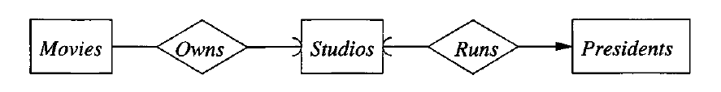
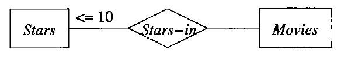
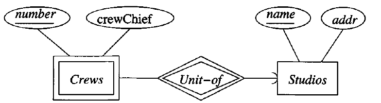
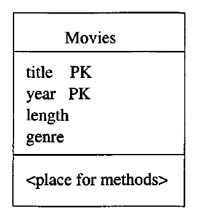
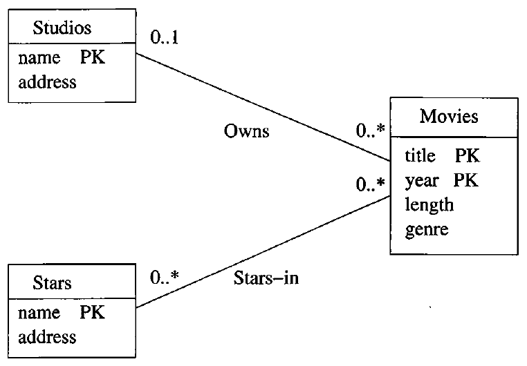
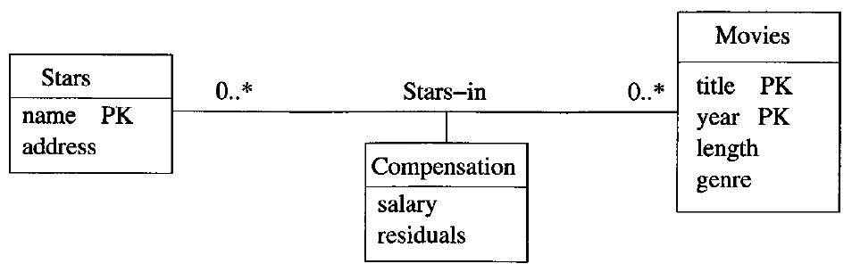
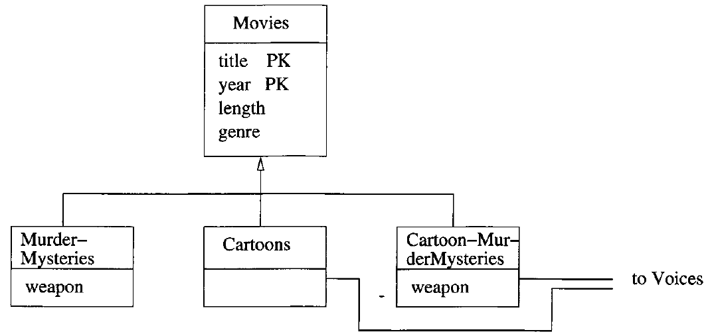
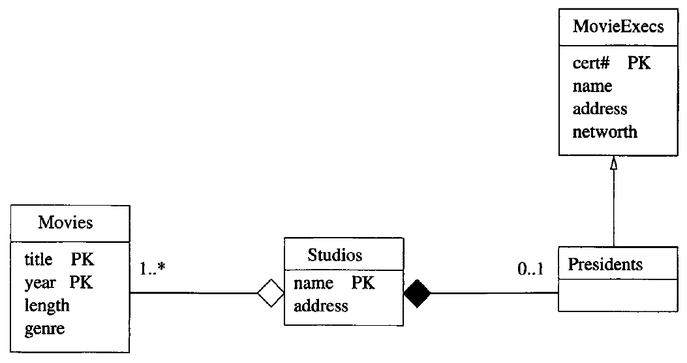

# Data Modelling and Databases - Chapter 4 (Book)
- Author: Ruben Schenk
- Date: 02.05.2021
- Contact: ruben.schenk@inf.ethz.ch

# 4. High-Level Database Models
## 4.1 The Entity/Relationship Model
In the `entity-relationship model` (or `E/R model`) the structure of data is represented graphically, as an "entity-relationship diagram", using three principal element types:
1. *Entity sets*,
2. *Attributes*, and
3. *Relationships*.

### 4.1.1 Entity Sets
An `entity` is an abstarct object of some sort, and a collection of similar entities forms an `entity set`. An entity in some way resembles an "object" in the sense of object-oriented programming.

In our movie-database example, each movie is an entity, and the set of all movies constitutes an entity set.

### 4.1.2 Attributes
Entity sets have associated `attributes`, which are properties of the entities in that set. For instance, the entity set *Movies* might be given attributes such as *title* and *length*.

In our version of E/R model, we shall assume that attributes are of primitive types, such as strings, integers, or reals. There are other variants of this model in which attributes can have some limited structure.

### 4.1.3 Relationships
`Relationships` are connections among two or more entity sets. for isntance, if *Movies* and *Stars* are two entity sets, we could have a relationship *Stars-in* that connects movies and stars.

While `binary relationships`, those between two entity sets, are by far the most common type of relationship, the E/R model allows relationships ti involve any number of entity sets.

### 4.1.4 Entity-Relationship Diagrams
An `E/R diagram` is a graph representing entity sets, attributes, and relationships. Elements of each of these kinds are represented by nodes of the graph as follows:
- Entity sets are represented by rectangles
- Attributes are represented by ovals
- Relationships are represented by diamonds

Edges connect an entity set to its attributes and also connect a relationship to its entity sets.

Example: The following figure is an E/R diagram that represents a simple database about movies. The entity sets are *Movies*, *Stars*, and *Studios*:

 

### 4.1.5 Instances
We may imagine that a database described by an E/R diagram contains particular data, an `instance` of the database.

For each entity set, the database instance will have a particular finite set of entities. Each of these entities has particular values for each attribute. A relationship $R$ that connects $n$ entity sets $E_1, \, E_2,..., \, E_n$ may be imagined to have an "instance" that consists of a finite set of tuples $(e_1, \, e_2,..., \ e_n)$, where each $e_i$ is chosen from the entities that are in the current instance of entity set $E_i$. We regard each of these tuples as *connected* by relationship $R$.

This sets of tuples is called the `relationship set` for $R$.

### 4.1.6 Multiplicity of Binary E/R Relationships
Suppose $R$ is a relationship connecting entity sets $E$ and $F$. Then:
- If each member of $E$ can be connected by $R$ to at most one member of $F$, then we say that $R$ is `many-to-one` from $E$ to $F$. Similarly, if instead a member of $F$ can be connected by $R$ to at most one member of $E$, then we say $R$ is `one-to-many` from $E$ to $F$.
- If $R$ is both many-to-one from $E$ to $F$ and many-to-one from $F$ to $E$, then we say that $R$ is `one-to-one`.
- If $R$ is neither many-to-one from $E$ to $F$ or from $F$ to $E$, then we say $R$ is `many-to-many`.

In this book, we use an arrow to describe that a connection is "at most one".

### 4.1.7 Multiway Relationships
The E/R model makes it convenient to define relationships involving more than two entity sets. In practice, ternary (three way) or higher-degree relationships are rare, but they occasionally are necessary to reflect the true state of affairs.

### 4.1.8 Roles in Relationships
It is possible that one entity set appears two or more times in a single relationship. If so, we draw as many lines from the relationship to the entity set as the entitiy set appears in the relationship. Each line to the entity set represents a different `role` that the entity set plays in the relationship. We therefore label the edges between the entity set and relationship by names, which we call "roles".

### 4.1.9 Attributes on Relationships
Sometimes it is convenient, or even essential, to *associate attributes with a relationship*, rather than with any of the entity sets that the relationship connects.

In general, we may place one or more attributes on any relationship. The values of these attributes are functionally determined by the entire tuple in the relationship set for that relation.

It is never necessary to place attributes on relationships. We can instead invent a new entity set, whose entities have the attributes ascribed to the relationship.

### 4.1.10 Converting Multiway Relationships to Binary
There are some data models, such as UML and ODL that limit relationships to be binary. Thus, while the E/R model does not require binary relationships, it is useful to observe that any relationship connecting more than two entity sets can be converted to a collection of binary, many-one relationships.

To do so, we introduce a new entity set whose entities we may think of as tuples of the relationship set for the multiway relationship. We call this entity set a `connecting entity set`. We then introduce many-one relationships from the connecting entity set to each of the entity sets that provide components of tuples in the original, multiway relationship.

### 4.1.11 Subclasses in the E/R Model
Often, an entity set contains certain entities that have special properties not associated with all members of the set. If so, we find it useful to define certain special-case entitiy sets, or `subclasses`, each with its own special attributes and/or relationships. We connect an entity set to its subclasses using a relationship called `isa`.

An `isa` relationship is a special kind of relationship, and to emphasize that it is unlike other relationships, we use a special notation: a triangle.

Example:

 

While, in principle, a collection of entity sets connected by `isa` relationships could have any structure, we shall limit isa-structures to trees, in which there is one `root` entity set that is the most general, with progressively more specialized entity sets extending below the root in a tree.

## 4.2 Design Principles
### 4.2.1 Faithfulness
First and foremost, the design should be faithful to the specifications of the application. That is, entity sets and their attributes should reflect reality.

### 4.2.2 Avoiding Redundancy
For instance, we have used a relationship *Owns* between movies and studios. We might also choose to have an attribute *studioName* of entity set *Movies*. While there is nothing illegal about doing so, it is dangerous for several reasons:
1. Doing so leads to repetition of a fact, with the result that extra space is required to represent the data.
2. There is an update-anomaly potential, since we might change the realtionship but not the attribute, or vice-versa.

### 4.2.3 Simplicity Counts
Avoid introducing more elements into your design than is absolutely necessary.

### 4.2.4 Choosing the Right relationships
Entity sets can be connected in various ways by relationships. However, adding to our design every possible relationship is not often a good idea. Doing so can lead to redundancy, update anomalies, and deletion anomalies, where the connected pairs or sets of entities for one relationship can be deduced from one or more other relationships.

### 4.2.5 Picking the Right Kind of Element
Sometimes we have options regarding the type of design element used to represent a real-world concept. Many of these choices are between using attributes and using entity set/relationship combinations. In general, an attribute is simpler to implement than either an entity set or a relationship. However, making everything an attribute will usually get us into trouble.

## 4.3 Constraints in the E/R Model
### 4.3.1 Keys in the E/R Model
A `key` for an entity set $E$ is a set $K$ of one or more attributes such that, given any two distinct entities $e_1$ and $e_2$ in $E$, $e_1$ and $e_2$ cannot have identical values for each of the attributes in the key $K$.

Some important points to remember are:
- Every entity set must have a key, although in some cases, the key may actually belong to another entity set.
- There can be more than one possible key for entity set. However, it is customary to pick one key as the `primary key`.
- When an entity set is involved in an isa-hierarchy, we require that the root entity set has all the attributes needed for a key, and that the key for each entity is found from its component in the root entity set.

### 4.3.2 Representing Keys in the E/R Model
In our E/R-diagram notation, we `underline` the attributes belonging to a key for an entity set. There is no notation for representing the situation where there are several keys for an entity set, we underline only the primary key.

You should also be aware that in some unusual situations, the attributes forming the key for an entity set do not belong to the entity set itself. We shall defer this matter, called *weak entity sets*, until Section 4.4.

### 4.3.3 Referential Integrity
`Referential-integrity constraints` says that a value appearing in one context must also appear in another.

The arrow notation in E/R diagrams is able to indicate whether a relationship is expected to support referential integrity in one or more directions. Suppose $R$ is a relationship from entity set $E$ to entity set $F$. A rounded arrow-head pointing to $F$ indicates not only that the relatiosnhips is many-to-one from $E$ to $F$, but that the entity of set $F$ related to a given entity of set $E$ is required to exist.

Example:

 

### 4.3.4 Degree Constraints
In the E/R model, we can attach a bounding number to the edges that connect a relationship to an entity set, indicating limits on the number of entities that can be connected to any one entity of the related entity set.

 

## 4.4 Weak Entity Sets
It is possible for an entity set's key to be composed of attributes, some or all of which belong to another entity set. Such an entity set is called a `weak entity set`.

### 4.4.1 Causes of Weak Entity Sets
There are two principal reasons we need weak entity sets. First, sometimes entity sets faill into a hierarchy based on classifications unrelated to the isa-hierarchy. If entities of set $E$ are subunits of entities in set $F$, then it is possible that the names of $E$-entities are not unique until we take into account the name of the $F$-entity to which the $E$ entity is subordinate.

Example: A movie studio might have several film crews. The crews might be designated by a given studio as *crew 1*, *crew 2*, and so on. However, other studios might use the same designations for crews. Therefore, to name a crew uniquely, we need to give both the name of the studio to which the crew belongs and its number.

 

The double-rectangle indicates a weak entity set, and the double-diamond indicates a many-to-one relationship that helps provide the key for the weak entity set.

### 4.4.2 Requirements for Weak Entity Sets
We cannot obtain key attributes for a weak entity set indiscriminately. Rather, if $E$ is a weak entity set then its key consists of:
1. Zero or more of its own attributes, and
2. Key attributes from entity sets that are reached by certain many-to-one relationships from $E$ to other entity sets. These many-to-one relationships are called `supporting relationships` for $E$, and the entity sets reached from $E$ are `supporting entity sets`.

In order for $R$, a many-to-one relationship from $E$ to some entity set $F$, to be a supporting relationship for $E$, the following conditions must be obeyed
1. $R$ must be binary, many-to-one relationship from $E$ to $F$.
2. $R$ must have referential integrity from $E$ to $F$. That is, for every $E$-entity, there must be exactly one existing $F$-entity related to it by $R$.
3. The attributes that $F$ supplies for the key of $E$ must be key attributes of $F$.
4. However, if $F$ is itself weak, then some or all of the key attributes of $F$ supplied to $E$ will be key attributes of one or more entity sets of $F$ to which $F$ is connected by a supporting relationship.
5. If there are several different supporting relationships from $E$ to the same entity set $F$, then each relationship is used to supply a copy of the key attributes of $F$ to help form the key of $E$.

### 4.4.3 Weak Entity Set Notation
We shall adopt the following conventions to indicate that an entity set is weak and to declare its key attributes:
1. If an entity set is weak, it will be shown as a rectangle with a double border.
2. Its supporting many-to-one relationships will be shown as diamonds with a double border.
3. If an entity set supplies any attributes for its own key, then those attributes will be underlined.

## 4.5 From E/R Diagrams to Relational Designs
To a first approximation, converting an E/R design to a relational database schema is straightforward:
- Turn each entity set into a relation with the saem set of attributes, and
- Replace a relationship by a relation whose attributes are the keys for the connected entity sets.

While these two rules cover much of the ground, there are also several special situations that we need to deal with, including:
- Weak entity sets cannot be translated straightforwardly to relations
- "Isa" relationships and subclasses require careful treatment
- Sometimes, we do well to combine two relationships, especially the relation for an entity set $E$ and the relation that comes from a many-to-one relationship from $E$ to some other entity set.

### 4.5.1 From Entity Sets to Relations
For each non-weak entity set, we shall create a relation of the same name and with the same set of attributes. This relation will not have any indication of the relationships in which the entity set participates.

### 4.5.2 From E/R Relationships to Relations
Relationships in the E/R model are also represented by relations. The relation for a given relationship $R$ has the following attributes:
1. For each entity set involved in relationship $R$, we take its key attribute or attributes as part of the schema of the relation for $R$.
2. If the relationship has attributes, then these are also attributes of relation $R$.

If one entity set is involved several times in a relationship, in different roles, then its key attributes each appear as many times as there are roles. We must rename the attributes to avoid name duplication.

### 4.5.3 Combining Relations
One common situation where we might want to combine relations occurs when there is an entity set $E$ with a many-to-one relationship $R$ from $E$ to $F$. The relations from $E$ and $R$ will each have the key for $E$ in their relations chema. In addition, the relation for $E$ will have in its schema the attributes of $E$ that are not in the key, and the realtion for $R$ will have the key attributes of $F$ and any attributes of $R$ itself. Becuase $R$ is many-to-one, all these attributes are functionally determined by the key for $E$, and we can combine them into one relation with a schema consisting of:
1. All attributes of $E$.
2. They key attributes of $F$.
3. Any attributes belonging to relationship $R$.

### 4.5.4 Handling Weak Entity Sets
When a weak entity set appears in an E/R diagram, we need to do three things differently:
1. The relation for the weak entity set $W$ itself must include not only the attributes of $W$ but also the key attributes of the supporting entity sets.
2. The relation for any relationship in which the weak entity set $W$ appears must use as a key for $W$ all of its key attributes, including those of other entity sets that contribute to $W$'s key.
3. However, a supporting relationship $R$, from the weak entity set $W$ to a supporting entity set, need not be converted to a relation at all.

The phenomenon, that a supporting relationship needs no relation, is universal for weak entity sets. The following is a modified rule for converting to relations entity sets that are weak:
- If $W$ is a weak entity set, construct for $W$ a relation whose schema consists of:
    1. All attributes of $W$.
    2. All attributes of supporting relationships for $W$.
    3. For each supporting relationship for $W$, say a many-to-one relationship from $W$ to entity set $E$, all the key attributes of $E$.
- Do not construct a relation for any supporting relationship  for $W$.

## 4.6 Converting Subclass Structures to Relations
When we have an `isa-hierarchy` of entity sets, we are presented with several choices of strategy for conversion to relations. Recall we assume that:
- There is a root entity set for the hierarchy,
- This entity set has a key that serves to identify every entity represented by the hierarchy, and
- A given entity may have components that belong to the entity sets of any subtree of the hierarchy, as long as that subtree includes the root.

We shall consider each different approach in turn.

### 4.6.1 E/R-Style Conversion
Our first approach is to create a relation for each entity set, as usual. If the entity set $E$ is not the root of the hierarchy, then the relation for $E$ will include the key attributes at the root, to identify the entity represented by each tuple, plus all the attributes of $E$.

Note, however, that although we spoke of "isa" as a relationship, it is unlike other relationships, in that it connects components of a single entity, not distinct entities. Thus, we do not create a relation for "isa".

### 4.6.2 An Object-Oriented Approach
An alternative strategy for converting isa-hierarchies to relations is to enumerate all the possible subtrees of the hierarchy. For each, create one relation that represents entities having components in exactly those subtrees. The schema for this relation has all the attributes of any entity set in the subtree.

### 4.6.3 Using Null Values to Combine Relations
There is one more approach to representing information about a hierarchy of entity sets. If we are allowed to use NULL as a value in tuples, we can handle a hierarchy of entity sets with a single relation. This relation has all the attributes belonging to any entity set of the hierarchy. An entity is then represented by a single tuple. This tuple has NULL in each attribute that is not defined for that entity.

### 4.6.4 Comparison of Approaches
Each of the three aproaches, which we shall refer to as "straight-E/R", "object-oriented", and "nulls", respectively, have advantages and disadvantages. Here is alist of the principal issues:
1. It can be expensive to answer queries involving several relations, so we would prefer to find all the attributes we needed to answer a query in one relation. The nulls approach uses only one relation for all the attributes, so it has an advantage in this regard.
2. We would like not to use too many relations. Here again ,the nulls method shines, since it requires only one relation. However, there is a difference between the other two methods, since in the straight-E/R approach, we use only one relation per entity set in the hierarchy. In the object-oriented approach, if we have a root and $n$ children, then there are $2^n$ different classes of entities, and we need that many relations.
3. We would like to minimize space and avoid repreating information. Since the object-oriented method uses only one tuple per entity, and that tuple has components for only those attributes that make sense for the entity, this approach offers the minimum possible space usage. The nulls approach also has only one tuple per entity, but these tuples are "long", i.e., they have components for all attributes, whether or not they are appropriate for a given entity. The straight-E/R method has several tuples for each entity, but only the key attributes are repeated. Thus, this method could use either more or less space than the nulls method.

## 4.7 Unified Modeling Language
`UML (Unified Modeling Language)` was developed originally as a graphical notation for describing software designs in an object-oriented style. It has been extended, with some modifications, to be a popular notation for describing database designs, and it is this portion of UML that we shall study here.

Following a comparison between UML and E/R terminology:

| UML               | E/R Model                    |
| :---------------- | :--------------------------- |
| Class             | Entity set                   |
| Association       | Binary relationship          |
| Association Class | Attributes on a relationship |
| Subclass          | Isa hierarchy                |
| Aggregation       | Many-to-one relationship     |
| Composition       | Many-to-one relationship with referential integrity |

### 4.7.1 UML Classes
A `class` in UML is similar to an entity set in the E/R model. The notation for a class is rather different, however:

 

The box for a class is divided into three parts. At the top is the `name` of the class. The middle has the `attributes`, which are like instance variables of a class. The bottom portion is for `methods`. Neither the E/R model nor the relational model provides methods. However, they are an important concept, and one that actually appears in modern relational systems, called "object-relational" DBMS's.

In this section, we shall not use methods in our design.

### 4.7.2 Keys for UML Classes
As for entity sets, we can declare one `key` for a UML class. To do soe, we follow each attribute in the key by the letters `PK`, standing for "primary key".

### 4.7.3 Associations
A binary relationship between classes is called an `association`. There is no analog of multiway relationships in UML. Rather, a multiway relationship has to be broken into binary relationships.

 

Every association has constraints on the number of objects from each of its classes that can be connected to an object of other class. We indicate these constraints by a label of the form $m..n$ at each end. The meaning of this label is that each object at the other end is connected to at least $m$ and at most $n$ objects at this end. In addition:
- A $*$ in palce of $n$, as in $m..*$, stands for "infinity".
- A $*$ alone, in place of $m..n$, stands for the range $0..*$, that is, no constraint at all on the number of objects.
- If there is no label at all at an end of an association edge, then the label is taken to be $1..1$, i.e., "exactly one".

### 4.7.4 Self-Associations
An association can have both ends at the same class. Such an association is called a `self-association`. To distinguish the two roles played by one class in a self-association, we give the association two names, one for each end.

### 4.7.5 Association Classes
We can attach attributes to an association in much the way we did in the E/R model. In UML, we create a new class, called an `association class`, and attach it to the middle of the association.

 

The association class has its own name, but its attributes may be thought of as attributes of the association to which it attaches.

### 4.7.6 Subclasses in UML
Any UML class can have a hierarchy of subclasses below it. The primary key comes from the root of the hierarchy, just as with E/R hierarchies. UML permits a class $C$ to have four different kinds of subclasses below it, depending on our choices of answers to two questions:
1. `Complete` versus `Partial`. Is every object in the class $C$ a member of some subclass? If so, the subclasses are *complete*, otherwise they are *partial* or *incomplete*.
2. `Disjoint` versus `Overlapping`. Are the subclasses *disjoint* (an object cannot be in two of the subclasses)? If an object can be in two or more of the subclasses, then the subclasses are said to be *overlapping*.

To represent the class/subclass relationship in UML diagrams, we use a triangular, open arrow pointing to the superclass. The subclasses are usually connected by a horizontal line, feeding into the arrow.

 

### 4.7.7 Aggregations and Compositions
An `aggregation` is a line between two classes that ends in an open diamond at one end. The implication of the diamond is that the label at the end must be $0..1$, i.e., the aggregation is a many-to-one association from the class at the opposite end to the class at the diamond end.

A `composition` is similar to an association, but the label at the diamond end must be $1..1$. that is, every object at the opposite end from the diamond must be connected to exactly one object at the diamond end. Compositions are distinguished by making the diamond be solid black.

 