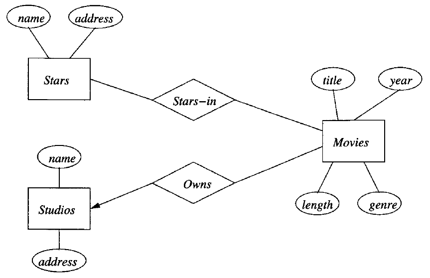
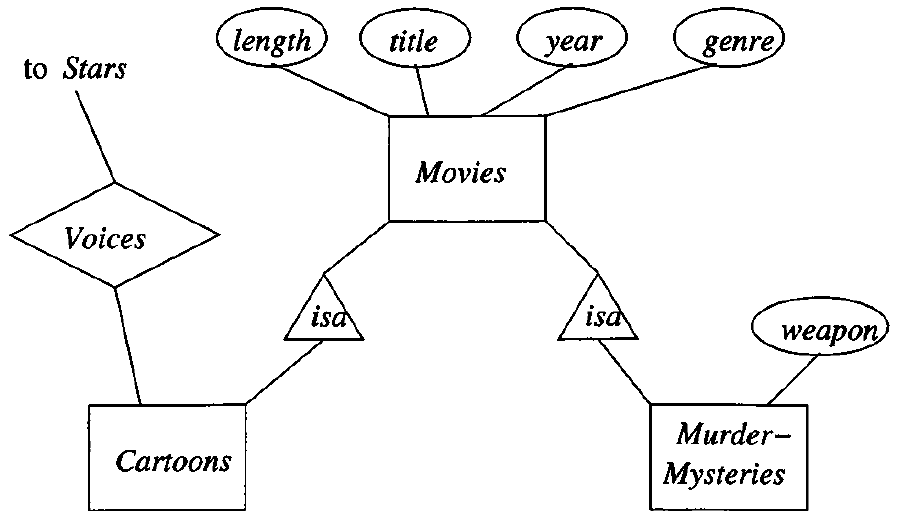

# Data Modelling and Databases - Chapter 4 (Book)
- Author: Ruben Schenk
- Date: 02.05.2021
- Contact: ruben.schenk@inf.ethz.ch

# 4. High-Level Database Models
## 4.1 The Entity/Relationship Model
In the `entity-relationship model` (or `E/R model`) the structure of data is represented graphically, as an "entity-relationship diagram", using three principal element types:
1. *Entity sets*,
2. *Attributes*, and
3. *Relationships*.

### 4.1.1 Entity Sets
An `entity` is an abstarct object of some sort, and a collection of similar entities forms an `entity set`. An entity in some way resembles an "object" in the sense of object-oriented programming.

In our movie-database example, each movie is an entity, and the set of all movies constitutes an entity set.

### 4.1.2 Attributes
Entity sets have associated `attributes`, which are properties of the entities in that set. For instance, the entity set *Movies* might be given attributes such as *title* and *length*.

In our version of E/R model, we shall assume that attributes are of primitive types, such as strings, integers, or reals. There are other variants of this model in which attributes can have some limited structure.

### 4.1.3 Relationships
`Relationships` are connections among two or more entity sets. for isntance, if *Movies* and *Stars* are two entity sets, we could have a relationship *Stars-in* that connects movies and stars.

While `binary relationships`, those between two entity sets, are by far the most common type of relationship, the E/R model allows relationships ti involve any number of entity sets.

### 4.1.4 Entity-Relationship Diagrams
An `E/R diagram` is a graph representing entity sets, attributes, and relationships. Elements of each of these kinds are represented by nodes of the graph as follows:
- Entity sets are represented by rectangles
- Attributes are represented by ovals
- Relationships are represented by diamonds

Edges connect an entity set to its attributes and also connect a relationship to its entity sets.

Example: The following figure is an E/R diagram that represents a simple database about movies. The entity sets are *Movies*, *Stars*, and *Studios*:

 

### 4.1.5 Instances
We may imagine that a database described by an E/R diagram contains particular data, an `instance` of the database.

For each entity set, the database instance will have a particular finite set of entities. Each of these entities has particular values for each attribute. A relationship $R$ that connects $n$ entity sets $E_1, \, E_2,..., \, E_n$ may be imagined to have an "instance" that consists of a finite set of tuples $(e_1, \, e_2,..., \ e_n)$, where each $e_i$ is chosen from the entities that are in the current instance of entity set $E_i$. We regard each of these tuples as *connected* by relationship $R$.

This sets of tuples is called the `relationship set` for $R$.

### 4.1.6 Multiplicity of Binary E/R Relationships
Suppose $R$ is a relationship connecting entity sets $E$ and $F$. Then:
- If each member of $E$ can be connected by $R$ to at most one member of $F$, then we say that $R$ is `many-to-one` from $E$ to $F$. Similarly, if instead a member of $F$ can be connected by $R$ to at most one member of $E$, then we say $R$ is `one-to-many` from $E$ to $F$.
- If $R$ is both many-to-one from $E$ to $F$ and many-to-one from $F$ to $E$, then we say that $R$ is `one-to-one`.
- If $R$ is neither many-to-one from $E$ to $F$ or from $F$ to $E$, then we say $R$ is `many-to-many`.

In this book, we use an arrow to describe that a connection is "at most one".

### 4.1.7 Multiway Relationships
The E/R model makes it convenient to define relationships involving more than two entity sets. In practice, ternary (three way) or higher-degree relationships are rare, but they occasionally are necessary to reflect the true state of affairs.

### 4.1.8 Roles in Relationships
It is possible that one entity set appears two or more times in a single relationship. If so, we draw as many lines from the relationship to the entity set as the entitiy set appears in the relationship. Each line to the entity set represents a different `role` that the entity set plays in the relationship. We therefore label the edges between the entity set and relationship by names, which we call "roles".

### 4.1.9 Attributes on Relationships
Sometimes it is convenient, or even essential, to *associate attributes with a relationship*, rather than with any of the entity sets that the relationship connects.

In general, we may place one or more attributes on any relationship. The values of these attributes are functionally determined by the entire tuple in the relationship set for that relation.

It is never necessary to place attributes on relationships. We can instead invent a new entity set, whose entities have the attributes ascribed to the relationship.

### 4.1.10 Converting Multiway Relationships to Binary
There are some data models, such as UML and ODL that limit relationships to be binary. Thus, while the E/R model does not require binary relationships, it is useful to observe that any relationship connecting more than two entity sets can be converted to a collection of binary, many-one relationships.

To do so, we introduce a new entity set whose entities we may think of as tuples of the relationship set for the multiway relationship. We call this entity set a `connecting entity set`. We then introduce many-one relationships from the connecting entity set to each of the entity sets that provide components of tuples in the original, multiway relationship.

### 4.1.11 Subclasses in the E/R Model
Often, an entity set contains certain entities that have special properties not associated with all members of the set. If so, we find it useful to define certain special-case entitiy sets, or `subclasses`, each with its own special attributes and/or relationships. We connect an entity set to its subclasses using a relationship called `isa`.

An `isa` relationship is a special kind of relationship, and to emphasize that it is unlike other relationships, we use a special notation: a triangle.

Example:

 

While, in principle, a collection of entity sets connected by `isa` relationships could have any structure, we shall limit isa-structures to trees, in which there is one `root` entity set that is the most general, with progressively more specialized entity sets extending below the root in a tree.

## 4.2 Design Principles
### 4.2.1 Faithfulness
First and foremost, the design should be faithful to the specifications of the application. That is, entity sets and their attributes should reflect reality.

### 4.2.2 Avoiding Redundancy
For instance, we have used a relationship *Owns* between movies and studios. We might also choose to have an attribute *studioName* of entity set *Movies*. While there is nothing illegal about doing so, it is dangerous for several reasons:
1. Doing so leads to repetition of a fact, with the result that extra space is required to represent the data.
2. There is an update-anomaly potential, since we might change the realtionship but not the attribute, or vice-versa.

### 4.2.3 Simplicity Counts
Avoid introducing more elements into your design than is absolutely necessary.

### 4.2.4 Choosing the Right relationships
Entity sets can be connected in various ways by relationships. However, adding to our design every possible relationship is not often a good idea. Doing so can lead to redundancy, update anomalies, and deletion anomalies, where the connected pairs or sets of entities for one relationship can be deduced from one or more other relationships.

### 4.2.5 Picking the Right Kind of Element
Sometimes we have options regarding the type of design element used to represent a real-world concept. Many of these choices are between using attributes and using entity set/relationship combinations. In general, an attribute is simpler to implement than either an entity set or a relationship. However, making everything an attribute will usually get us into trouble.