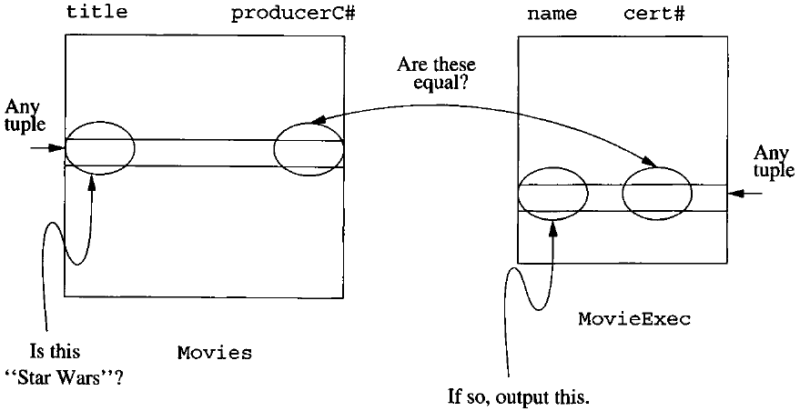

# Data Modelling and Databases - Chapter 6 (Book)
- Author: Ruben Schenk
- Date: 08.03.2021
- Contact: ruben.schenk@inf.ethz.ch


# 6. The Database Language SQL
## 6.1 Simple Queries in SQL
One of the simplest forms of queries in SQL is to ask for those tuples of some relation that satisfy a condition. Such a query is analogous to a selection in relational algebra. this simple query uses the three keywords `SELECT`, `FROM`, and `WHERE` that characterize SQL.

Example: As our first query, let us ask about the relation

```sql
    Movies(title, year, length, genre, studioName, producerNum)
```
for all movies produced by Disney Studios in 1990. In SQL, we say:

```sql
    /* Code 6.1: Simple SQL query. */
    SELECT *
    FROM Movies
    WHERE studioName = 'Disney' AND year = 1990;
```

- The `FROM` clause gives the relation or relations to which the query refers.
- The `WHERE` clause is a condition, much like a selection-condition in relational algebra. Tuples must satisfy the condition in order to match the query.
- The `SELECT` clause tells which attributes of the tuples matching the condition are produced as part of the answer. The `*` in this example indicates that the entire tuples isproduced.

### 6.1.1 Projection in SQL
In place of the `*` of the `SELECT` clause, we may list some of the attributes of the relation mentioned in the `FROM` clause. The result will be projected onto the attributes listed.

Example: Suppose we wish to modify the query of Code 6.1 to produce only the movie title and length. We may write:

```sql
    /* Code 6.2: Projection in SQL. */
    SELECT title, length
    FROM Movies
    WHERE studioName = 'Disney' AND year = 1990;
```

Sometimes, we wish to produce a relation with column headers different from the attributes of the realtion mentioned in the `FROM` clause. We may follow the name of the attribute by the keyword `AS` and an `alias`, which becomes the header in the result relation.

Example: We can modify Code 6.2 to produce a realtion with attrbiutes `name` and `duration` in place of `title` and `length`.

```sql
    /* Code 6.3: Attribute renaming in queries. */
    SELECT title AS name, length AS duration
    FROM Movies
    WHERE studioName = 'Disney' AND year = 1990;
```

Another option in the `SELECT` clause is to use an expression in place of an attribute.

Example: Suppose we want outputs as in Code 6.3, but with the length in hours. We might replace the `SELECT` clause of that example with:

```sql
    /* Code 6.4: Expressions in SELECT clauses.*/
    SELECT title as name, length*0.16667 AS lengthInHours
```

Remark: SQL is *case insensitive*, meaning that it treats upper- and lower-case letters as the same letter. Only inside quotes does SQL make a distinction between upper- and lower-case letters.

### 6.1.2 Selection in SQL
The selection operator of relational algebra, and much more, is available thorug the `WHERE` clause of SQL. We may build expressions by comparing valuesusing the six common comparison operators: `=, <>, <, >, <=,` and `>=`. The last four operators are as in C, but `<>` is the SQL sym,bol for "*not equal to*" (!=) and `=` in SQL is equality (==).

We may also apply the usual arithmetic operators `+, *,` and so on, to numeric values before we compare them. We may apply the `concatenation` operator `||` to string. For example `'foo' || 'bar'` has value `'foobar'`.

The simple SQL queries that we have seen so far all have the form:

```sql
    /*Code 6.5: SQL Queries and Relational Algebra. */
    SELECT L
    FROM R
    WHERE C
```

in which $L$ is a list of epxression, $R$ is a relation, and $C$ is a condition. The meaning of any such expression is the same as that of the relational-algebra expression:

$$\pi_L(\sigma_C(R))$$

### 6.1.3 Comparison of Strings
Two strings are equal if they are the same sequence of characters. When comparing strings with differen declarations (`CHAR`, `VARCHAR`, etc.), only the actual strings are compared. SQL ignores any "pad" characters.

When we compare strings by on of the "less than" operators, such as `<` or `>=`, we are asking whether one precedes the other in lexicographic order.

### 6.1.4 Pattern Matching in SQL
SQL also provides the capability to compare strings on the basis of a simple pattern match. An alternative from of comparison expression is

```sql
    /* Code 6.6: Pattern Matching in SQL. */
    s LIKE p
```

where $s$ is a string and $p$ is a `pattern`, that is, a string with the optional use of the two special characters `%` and `_`. Ordinary characters ion $p$ match only themselves in $s$. But `%` in $p$ can match any sequence of 0 or more characters in $s$, and `_` in $p$ matches any one character in $s$.

Similary, `s NOT LIKE p` is true if and only if string $s$ does not match pattern $p$.

Example: We remember a movie "Star *something*", and we remember that the something has four letters. What could this movie be? We can retrieve all such names with the query:

```sql
    /* Code 6.7: Patter matching. */
    SELECT title
    FROM Movies
    WHERE title LIKE 'Star ____';
```

Remark: The convention taken by SQL is that two consecutive apostrophes in a string represent a single apostrophe and do not end the string. Thus, `''s` in a pattern is matched by a single apostrophe followed by an `s`.

### 6.1.5 Dates and Times
A `date` constant is represented by the keyword `DATE` followed by a quoted string of a special form. For example, `'1948-05-14'` follows the required form, i.e. is of the form `'YYYY-MM-DD'`. 

A `time` constant is represented similarly by the keyword `TIME` and a quoted string. For example, `'15:00:02.5'` is of the required form.

To combine dates and times we use a value of type `TIMESTAMP`. These values consist of the keyword TIMESTAMP, a date value, and a time value. Thus, `TIMESTAMP '1948-05-14 12:00:00'` represents noon on May 14, 1948.

### 6.1.6 Null Values and Comparisons Involving NULL
SQL allows attributes to have a special value `NULL`, which is called the *null value*. The most common interpretations for the null value are:
- *Value unknown*
- *Value inapplicable*
- *Value withheld*

In `WHERE` clauses, we must be prepared for the possibility that a component of some tuple we are examining may be NULL. We must remember that:
1. When we operate on a `NULL` and any value, including another `NULL`, using an arithmetic operator like $\times$ or $+$, the result is `NULL`.
2. When we compare a `NULL` value and any value, including another NULL, using a comparison operator like $=$ or $>$, the result is `UNKNOWN`.

The correct way to ask if $x$ has the value `NULL` is with the expression `x IS NULL`. Similarly, `x IS NOT NULL` has the value `TRUE` unless the value of $x$ is `NULL`.

### 6.1.7 The Truth-Value UNKNOWN
We have just seen that when NULL values occur, comparisons can yield a third truth-value: `UNKNOWN`. We must now learn how the logical operators behave on combinations of all three truth-values.

The rules is easy if we think of TRUE as $1$, FALSE as $0$, and UNKNOWN as $1/2$. Then:
- The AND of two truth-values is the minimum of those values.
- The OR of two truth-values is the maximum of those values.
- The negation of truth-value $v$ is $1-v$.

### 6.1.8 Ordering the Output
To get output in `sorted order`, we may add to the select-from-where statement a clause:

```sql
    ORDER BY <list of attributes>
```

The order is by default *ascending*, but we can get the output highest-first by appending the keyword `DESC` to an attribute. The `ORDER BY` clause follows the `WHERE` clause and any other clauses (i.e. the optional `GROUP BY` and `HAVING` clauses, which are introduced in Section 6.4).

Example: To get the movies listed by length, shortest first, and among movies equal length, alphabetically, we can say:

```sql
    /* Code 6.11: Sorting in SQL. */
    SELECT *
    FROM Movies
    WHERE studioName = 'Disney' AND year = 1990
    ORDER BY length, title;
```

## 6.2 Queries Involving More Than One Relation
Much of the power of relational algebra comes from its ability to combine two or more relations through joins, products, unions, intersections, and differences.

### 6.2.1 Products and Joins in SQL
SQL has a simple way to couple relations in one query: list each relation in the FROM clause. Then, the SELECT and WHERE clauses can refer to the attributes of any of the relations in the FROM clause.

Example: Suppose we want to know the name of the producer of *Star Wars*. We can phrase this in one query about the pair of relations *Movies* and *MovieExec* as follows:

```sql
    /* Code 6.12: Coupling relations in SQL. */
    SELECT name
    FROM Movies, MovieExec
    WHERE title = 'Star Wars' AND producerNum = certNum;
```

The interpretation of the above query is shown in the picture below:

<br>

### 6.2.2 Disambiguating Attributes
Sometimes we ask a query involving several relations, and among these relations are two or more attributes with the same name. If so, we need a way to indicate which of these attributes is meant by a use of their shared name. SQL solves this problem by allowing us to place a relation name and a dot in front of an attribute.

Example: The two relations

```sql
    MovieStar(name, address, gender, birthdate)
    MovieExec(name, address, certNum, netWorth)
```

each have attributes *name* and *address*. Suppose we wish to find pairs consisting of a star and an executive with the same address. The following query does the job:

```sql
    /* Code 6.13: Relations with the same attributes. */
    SELECT MovieStar.name, MovieExec.name
    FROM MovieStar, MovieExec
    WHERE MovieStar.address = MovieExec.address;
```

### 6.2.3 Tuple Variables
Disambiguating attributes by prefixing the relation name works as long as the query involves combining several different relations. However, sometimes we need to ask a query that invovles two or more tuples from the same relation.

We may lis a relation $R$ as many times as we need to in the FROM clause, but we need a way to refer to each occurrence of $R$. SQL allows us to define, for each occurrence of $R$ in the FROM clause, an "alias" which we shall refer to as a `tuple variable`.

Example: We might want to know about two stars who share an address. The following query does exactly that:

```sql
    /* Code 6.14: Tuple variables. */
    SELECT Star1.name, Star2.name
    FROM MovieStar Star1, MovieStar Star2
    WHERE Star1.address = Star2.address
            AND Star1.name < Star2.name;
```

The second condition in the WHERE clause, *Star1.name < Star2.name*, makes sure that we do  produce each star name paired with itself and each pair of stars only once.

### 6.2.4 Interpreting Multirelation Queries
There are several ways to define the meaning of the select-from-where expressions that we have just covered.

#### Nested Loops
If there are several tuple varaibles, we may imagine nested loops, one for each tuple variable, in which the varaibles each range over the tuples of their respective relations. For each assignment of tuples to the tuple varaibles, we decide whether the WHERE clause is true.

#### Parallel Assignment
There is an equivalent definition in which we do not explicitly create nested loops ranging over the tuple variables. Rather, we consider in arbitrary order, or in parallel, all possible assignments of tuples from the appropriate relations to the tuple variables.

#### Conversion to Relational Algebra
A third approach is to relate the SQL query to relational algebra. We start with the tuple varaibles in the FROM clause and take the Cartesian product of their relations. <br>
Having created the product, we apply a selection operator to it by converting the WHERE clause to a selection condition on the abvious way. <br>
Finally, we create from the SELECT clause a list of expressions for a final projection operation.

### 6.2.5 Union, Intersection, and Difference of Queries
Sometimes we wish to combine relations using the `set operations` of realtional algebra: union, intersection, and difference. The keywords used are `UNION`, `INTERSECT`, and `EXCEPT` for $\cup, \, \cap,$ and $-,$ respectively. Words like UNION are used between two queries, and those queries msut be parenthesized.

Example: Suppose we wanted the name and addresses of all female movie stars who are also movie executives with a networth over $ 10'000'000:

```sql
    /* Code 6.16: INTERSECT in SQL queries. */
    (SELECT name, address
     FROM MovieStar
     WHERE gender = 'F')
        INTERSECT
    (SELECT name, address
     FROM MovieExec
     WHERE netWorth > 10000000);
```

## 6.3 Subqueries
In SQL, one query can be used in various ways to help in the evaluation of another. A query that is part of another is called a `subquery`. There are a number of ways that subqueries can be used:
1. Subqueries can return a single constant, and this constant can be compared with another value in a WHERE clause.
2. Subqueries can return relations that can be used in various ways in WHERE clauses.
3. Subqueries can appear in FROM clauses, followed by a tuple variable that represents the tuples in the reult of the subquery.