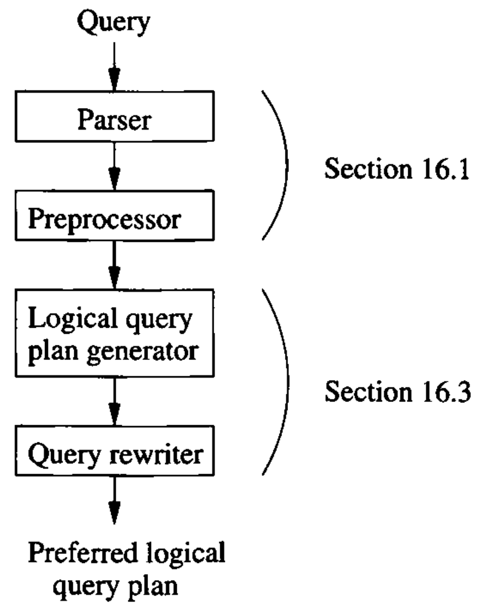
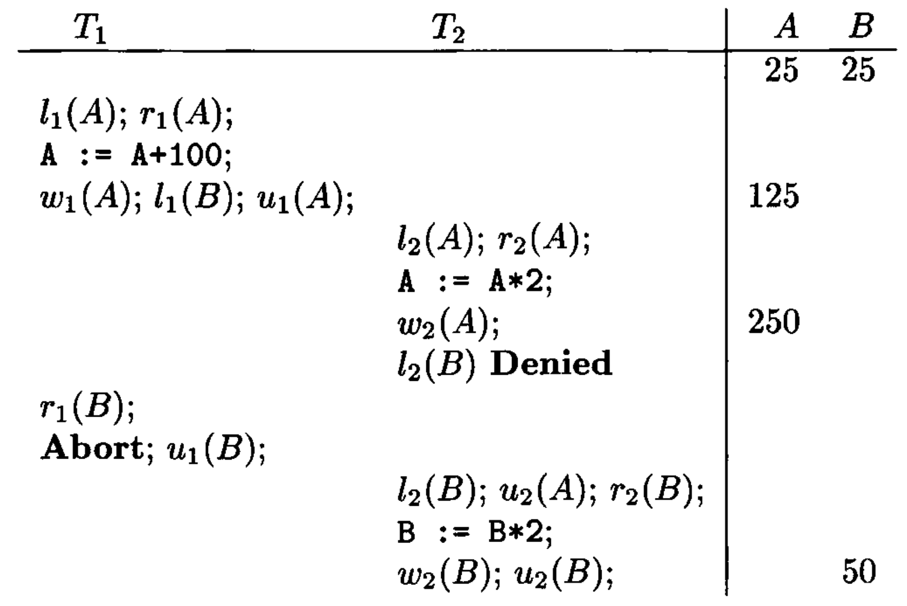

# Data Modelling and Databases - Book Summary

- Author: Ruben Schenk
- Date: 31.05.2021
- Contact: ruben.schenk@inf.ethz.ch

# 2. The Relational Model of Data

## 2.1 An Overview of Data Models

### 2.1.1 What is a Data Model?

A `data model` is a notation for describing data or information. The description generally consists of three parts:

1. *Structure of the data*: In the database world, data models are at somewhat higher level than data structures, and are sometimes referred to as *conceptual model* to emphasize the difference in level.
2. *Operations on the data*: We are generally allowed to perform a limited set of `queries` (operations that retrieve information) and `modifications` (operations that change the database).
3. *Constraints on the data*: Database data models usually have a way to describe limitations on what the data can be.

### 2.1.3 The Relational Model in Brief

The relational model is based on tables. The structure portion of the relational model might appear to resemble an array of structs in C, where the column headers are the field names, and each of the rows represent the values of one struct in the array.

## 2.2 Basics of the Relational Model

The relational model gives us a single way to represent data: as a two-dimensional table called a `relation`.

In this section, we shall introduce the most important terminology regarding relations, and illustrate them with the *Movies* relation:

| `title`            | `year` | `length` | `genre` |
| :----------------- | :----: | :------: | :-----: |
| Gone With the Wind | 1939   | 231      | drama   |
| Star Wars          | 1977   | 124      | sciFi   |
| Wayne's World      | 1992   | 95       | comedy  |
*Table 2.3: The relation 'Movies'*

### 2.2.1 Attributes

The columns of a relation are named by `attributes`, in Tab. 2.3 the attributes are *title, year, length* and *genre*.

### 2.2.2 Schemas

The name of a relation and the set of attributes for a relation is called the `schema` for that relation. Thus, the schema for relation *Movies* as above is

> Movies(title, year, length genre)

The set of schemas for the relations of a database is called a `relational database schema`, or just `database schema`.

### 2.2.3 Tuples

The rows of a relation, other than the header row containing the attribute names, are called `tuples`. A tuple has one component for each attribute of the relation.  
For example,

> (Gone With the Wind, 1939, 231, drama)

is the first tuple of Tab. 2.3.

### 2.2.4 Domains

The relational mode requires that each component of each tuple to be *atomic*, that is, it must be of some elementary type such as integer or string.  
It is further assumed that associated with each attribute of a relation is a `domain`, that is, a particular elementary type.

It is possible to include the domain, or data type, for each attribute in a relation schema. We shall do so by appending a colon and a type after attributes:

> Movies(title:string, year:integer, length:integer, genre:string)

### 2.2.5 Equivalent Representations of a Relation

One important remark is that relations are sets of tuples, not lists of tuples. Thus *the order in which the tuples of a relation are represented is immaterial.*

### 2.2.6 Relation Instances

A relation about movies is not static, rather, relations change over time. It is less common for the schema of a relation to change though. However, there are situations where we might want to add or delete attributes.  
Schema changes, while possible in commercial database systems, can be very expensive, because each of perhaps millions of tuples need to be rewritten to add or delete components.

We shall call a set of tuples for a given relation an `instance` of that relation. For example, in 1990, the relation *Movies* did not contain the tuple for *Wayne's World*. However, a conventional database system maintains only one version of any relation: the set of tuples that are in the relation "now". This instance of the relation is called the `current relation`.

### 2.2.7 Keys of Relations

There are many constraints on relations that the relational model allows us to place on database schemas. However, one kind of constraint is so fundamental that we shall introduce if there: `key constraints`. A set of attributes forms a `key` for a relation if we do not allow two tuples in a relation instance to have the same values in all the attributes of the key.

We distinguish further between `candidate keys`, which is the minimal set of fields that identify each tuple uniquely, and `primary key`, which is one chosen candidate key, marked in the schema by underlining it.

We indicate the attribute or attributes that form a key for a relation ny underlining the key attribute(s). For example, the *Movies* relation could have its schema written as:

> Movies(<ins>title</ins>, <ins>year</ins>, length, genre)

While we might be sure that *title* and *year* can serve as a key for *Movies*, many real-world databases use artificial keys, doubting that it is safe to make any assumption about the values of attributes outside their control.

> Short summaries of some keywords:
>
> - Relation: 2D representation of data
> - Database schema: A set of relation schemas
> - Relation schema: Name and a set of attributes (or fields or columns)
> - Attribute: Name and domain (e.g., integer, string, etc.)
> - Tuples: A row of a relation containing the attribute names
> - Key: Set of attributes that uniquely identify each tuple

## 2.3 Defining a Relation Schema in SQL

SQl is the principal language used to describe and manipulate relational databases. There are two aspects to SQL:

1. The `Data-Definition` sublanguage for declaring database schemas and
2. The `Data-Manipulation` sublanguage for querying databases and for modifying the database.

### 2.3.1 Relations in SQL

SQL makes a distinction between three kinds of relations.

1. Stored relations, which are called `tables`. These are the kind of relations we deal with ordinarily - a relation that exists in the database.
2. `Views`, which are relations defined by computation. These relations are not stored, but are constructed when needed.
3. `Temporary tables`, which are constructed by the SQL language processor when it performs its job of executing queries and data modifications.

### 2.3.2 Data Types

Let us introduce the primitive data types that are supported by SQL systems:

- `CHAR(n)` denotes a fixed-length string of up to $n$ characters. `VARCHAR(n)` also denotes a string of up to $n$ characters, with the difference being, that `CHAR` implies that store strings are padded to make $n$ characters.
- `BIT(n)` denotes a bit of strings of length $n$ and `BIT VARYING(n)` denotes bit strings of length up to $n$.
- `BOOLEAN` denotes an attribute whose value is logical. It can either be `TRUE`, `FALSE`, or `UNKNOWN`.
- `INT` or `INTEGER` denotes typical integer values.
- `FLOAT` or `REAL` are used for typical floating-point numbers. A higher precision can be obtained with the type `DOUBLE PRECISION`. `DECIMAL(n, d)` allows values that consist of $n$ decimal digits, with the decimal point assumed to be $d$ positions from the right.
- `DATE` and `TIME` are used to represent dates and times respectively. Dates are a quoted string of the form `'2021-03-02'` and times is a quoted string of the form `'13:52:31.5'`, where we may continue with a decimal point and as many significant digits as we want.

### 2.3.3 Simple Table Declarations

The simplest form of declaration of a relational schema consists of the key-words `CREATE TABLE` as shown below:

```SQL
    /* Code 2.7: SQL declaration of the table 'Movies' */
    CREATE TABLE Movies (
        title           CHAR(100),
        releaseYear     INT,
        lengthMin       INT,
        genre           CHAR(10),
        studioName      CHAR(30),
        producerNum     INT
    );
```

### 2.3.4 Modifying Relation Schemas

We can delete a relation $R$ by the SQL statement `DROP TABLE R;`.  
More frequently than we would drop a relation, we may need to modify the schema of an existing relation. These modifications are done by a statement that begins with the keyword `ALTER TABLE` and the name of the relation. We then have several options, the most important of which are:

- `ADD` followed by an attribute name and its data type
- `DROP` followed by an attribute name

For example we could modify the *Movie* relation by adding an attribute *rating* with:

```sql
    ALTER TABLE Movies ADD rating INT;
```

As another example, the `ALTER TABLE` statement:

```sql
    ALTER TABLE Movies DROP studioName;
```

deletes the *studioName* attribute.

### 2.3.5 Default Values

When we create or modify tuples, we sometimes do not have values for all components. In general, any place we declare an attribute and its data type, we may add the keyword `DEFAULT`and an appropriate value. The value is either `NULL` or a constant.

As an example, we might want to use *?* as a default for *studioName* and *NULL* as a default *producerNum*. We could replace the declarations of *studioName* and *producerNum* in Code 2.7 by:

```sql
    studioName      CHAR(30) DEFAULT '?',
    producerNum     INT DEFAULT 0
```

### 2.3.6 Declaring Keys

There are two way to declare an attribute or set of attributes to be a key in the `CREATE TABLE` statement that defines a stored relation:

1. We may declare one attribute to be a key when that attribute is listed in the relation schema.
2. We may add to the list of items declared in the schema an additional declaration that say a particular attribute or set of attributes forms the key.

Remark: If the key consists of more than one attribute, we have to use method (2).

There are two declarations that may be used to indicate keyness:

- `PRIMARY KEY`, or
- `UNIQUE`

If `PRIMARY KEY` is used, then attributes in $S$, where $S$ is the set of keys, are not allowed to have *NULL* as a value. *NULL* is permitted if the set $S$ is declared as `UNIQUE`, however.

```sql
    /* Code 2.9: Making 'fullName' the key. */
    CREATE TABLE MovieStar (
        fullName    CHAR(30) PRIMARY KEY,
        address     VARCHAR(255),
        gender      CHAR(1),
        birthdate   DATE
    );

    /* Code 2.11: Making 'title' and 'releaseYear' be the key of 'Movies'. */
    CREATE TABLE Movies (
        title           CHAR(100),
        releaseYear     INT,
        lengthMin       INT,
        genre           CHAR(10),
        studioName      CHAR(30),
        producerNum     INT,
        PRIMARY KEY (title, releaseYear)
    );
```

## 2.4 An Algebraic Query Language

To begin our study of operations on relations, we shall learn about a special algebra, called `relational algebra`, that consists of some simple but powerful ways to construct new relations from given relations.  
Relational algebra is not used today as a query language in commercial DBMS's. Rather, the "real" query language, SQL, incorporates relational algebra at its center.

### 2.4.2 What is an Algebra?

An algebra consists of operators and atomic operands. For instance, in the algebra of arithmetic, the atomic operands are variables like $x$ and constants like $15$. The operators are the usual arithmetic ones: addition, subtraction, multiplication, and division. Any algebra allows us to build `expressions` by applying operators to atomic operands and/or other expressions of the algebra.

Relational algebra is another example of an algebra. Its atomic operands are:

1. Variables that stand for relations.
2. Constants, which are finite relations.

### 2.4.3 Overview of Relational Algebra

The operations of the traditional relational algebra fall into four broad classes:

- The usual *set operations* - union, intersection, and difference - applied to relations.
- Operations that *remove parts of a relation*: "selection" eliminates some rows, and "projection" eliminates some columns.
- Operations that *combine the tuples of two relations*, including "Cartesian product" and various kinds of "join".
- An operation called "*renaming*" that does not affect the tuples, but changes the relation schema.

We generally shall refer to expressions of relational algebra as `queries`.

### 2.4.4 Set Operations on Relations

The three operations `union`, `intersection`, and `difference` are defined as follows on arbitrary sets $R$ and $S$:

- $R \cup S$, the `union`, is the set of elements that are in $R$ or $S$ or both.
- $R \cap S$, the `intersection`, is the set of elements that are in both $R$ and $S$.
- $R - S$, the `difference`. is the set of elements that are in $R$ but not in $S$.

When we apply these operations to relations, we need to put some conditions on $R$ and $S$:

1. $R$ and $S$ must have schemas with identical sets of attributes, and the domains for each attribute must be the same in $R$ and $S$.
2. Before we compute a set-theoretic operation of sets of tuples, the columns of $R$ and $S$ must be ordered so that the order of attributes is the same for both relations.

### 2.4.5 Projection

The `projection` operator is used to produce from a relation $R$ a new relation that has only some of $R$'s columns. The value of expression $\pi_{A_1, \, A_2,..., \, A_n}(R)$ is a relation that has only the columns for attributes $A_1, \, A_2,..., \, A_n$ of $R$.

Example: Assume the following relation *Movies*:

| title         | year | length | genre  | studioName | producerNum |
| :------------ | :--: | :----- | :----- | :--------- | :---------- |
| Star Wars     | 1977 | 124    | sciFi  | Fox        | 12345       |
| Galaxy Quest  | 1999 | 104    | comedy | DreamWorks | 67890       |
| Wayne's World | 1992 | 95     | comedy | Paramount  | 99999       |

*Figure 2.13: The relation 'Movies'.*

We can now project this relation onto the first three attributes with the following expression:

$$\pi_{\text{title, year, length}}(\text{Movies})$$

The resulting relation is

|title          | year | length |
| :------------ | :--: | :----- |
| Star Wars     | 1977 | 124    |
| Galaxy Quest  | 1999 | 104    |
| Wayne's World | 1992 | 95     |

The result of the expression $\pi_{\text{genre}}(\text{Movies})$ is:

| genre  |
| :----- |
| sciFi  |
| comedy |

Remark: Notice that there are only two tuples in the resulting relation, since in the relational algebra of sets, duplicate tuples are always eliminated.

### 2.4.6 Selection

The `selection` operator, applied to a relation $R$, produces a new relation with a subset of $R$'s tuples. The tuples in the resulting relations are those that satisfy some condition $C$ that involves the attributes of $R$. We denote this operation by $\sigma_C(R)$.  
$C$ is a conditional expression of the type with which we are familiar from conventional programming languages. The only difference is that the operands in condition $C$ are either constants or attributes of $R$.

Example: Let the relation *Movies* be as in Fig. 2.13. Then the value of expression $\sigma_{\text{length} \geq 100}(\text{Movies})$ is

| title         | year | length | genre  | studioName | producerNum |
| :------------ | :--: | :----- | :----- | :--------- | :---------- |
| Star Wars     | 1977 | 124    | sciFi  | Fox        | 12345       |
| Galaxy Quest  | 1999 | 104    | comedy | DreamWorks | 67890       |

Another example would be the expression

$$\sigma_{\text{length} \geq 100 \text{ AND studioName } = \text{ 'FOX'}}(\text{Movies})$$

which results in the following relation:

| title         | year | length | genre  | studioName | producerNum |
| :------------ | :--: | :----- | :----- | :--------- | :---------- |
| Star Wars     | 1977 | 124    | sciFi  | Fox        | 12345       |

### 2.4.7 Cartesian Product

The `Cartesian product` of two sets $R$ and $S$ is the set of pairs that can be formed by choosing the first element of the pair to be any element of $R$ and the second any element of $S$.

To disambiguate an attribute $A$ that is in the schemas of both $R$ and $S$, we use $R.A$ ofr the attribute from $R$ and $S.A$ for the attribute from $S$.

Example: Consider the following two relations:

|  A  |  B  |
| :-: | :-: |
|  1  |  2  |
|  3  |  4  |

*Figure 2.14: (a) Relation $R$*

|  B  |  C  |  D  |
| :-: | :-: | :-: |
|  2  |  5  |  6  |
|  4  |  7  |  8  |
|  9  |  10 |  11 |

*Figure 2.14: (b) Relation $S$*

Then the result of the expression $R \times S$ is given by:

|  A  | R.B | S.B |  C  |  D  |
| :-: | :-: | :-: | :-: | :-: |
|  1  |  2  |  2  |  5  |  6  |
|  1  |  2  |  4  |  7  |  8  |
|  1  |  2  |  9  |  10 |  11 |
|  3  |  4  |  2  |  5  |  6  |
|  3  |  4  |  4  |  7  |  8  |
|  3  |  4  |  9  |  10 |  11 |

*Figure 2.14: (c) Result of $R \times S$*

### 2.4.8 Natural Joins

Often we find a need to `join` them by pairing only those tuples that match in some way. The simplest sort of match is the `natural join` of two relations $R$ and $S$, denoted $R \bowtie S$, in which we pair only those tuples from $R$ and $S$ that agree in whatever attributes are common to the schemas of $R$ and $S$.

More precisely, let $A_1, \, A_2,..., \, A_n$ be all the attributes that are in both the schema $R$ and the schema of $S$. Then a tuple $r$ from $R$ and a tuple $s$ from $S$ are successfully paired if and only if $r$ and $s$ agree on each of the attributes $A_1, \, A_2,..., \, A_n$.

If two tuples $r$ and $s$ are successfully paired, then the resulting tuple is called the `joined tuple`. A tuple that fails to pair with any tuple of the other relation in a join is said to be a `dangling tuple`.

Example: The natural join of the relations $R$ and $S$ from Fig. 2.14(a) and (b) is:

|  A  |  B  |  C  |  D  |
| :-: | :-: | :-: | :-: |
|  1  |  2  |  5  |  6  |
|  3  |  4  |  7  |  8  |

### 2.4.9 Theta-Joins

It is sometimes desireable to pair tuples from two relations on some other basis. For that purpose, we have a related notation called the `theta-join`. Historically, the "theta" refers to an arbitrary condition, which we shall represent by $C$.  
The notation for a theta-join of relations $R$ and $S$ based on condition $C$ is $R \bowtie_C S$. The result of this operation is constructed as follows:

1. Take the product of $R$ and $S$.
2. Select from the product only those tuples that satisfy the condition $C$.

Example: Let $C := R.B < S.B$, then the result of the expression $R \bowtie_{R.B < S.B} S$ with the relations $R$ and $S$ as in Fig. 2.14(a) and (b) is:

|  A  | R.B | S.B |  C  |  D  |
| :-: | :-: | :-: | :-: | :-: |
|  1  |  2  |  4  |  7  |  8  |
|  1  |  2  |  9  |  10 |  11 |
|  3  |  4  |  9  |  10 |  11 |

### 2.4.10 Combining Operations to Form Queries

Relational algebra, like all algebras, allows us to form expressions of arbitrary complexity by applying operations to the result of other operations. One can construct expressions of relational algebra by applying operators to subexpressions, using parentheses when necessary to indicate grouping of operands.

Example: Suppose we want to know, from our *Movies* relation, "What are the titles and years of movies made by Fox that are at least 100 minutes long?". One way to compute the answer to this query is:

1. Select those *Movies* tuples that have $\text{length} \geq 100$.
2. Select those *Movies* tuples that have $\text{studioName } = \text{ 'Fox'}$.
3. Compute the intersection of $(1)$ and $(2)$.
4. Project the relation from $(3)$ onto the attributes *title* and *year*.

Alternatively, we could represent the same expression in a conventional, linear notation, with parentheses. The formula:

$$\pi_{\text{title, year}} \Big(\sigma_{\text{length } \geq 100}(\text{Movies}) \cap \sigma_{\text{studioName } = \text{ 'Fox'}}(\text{Movies}) \Big)$$

represents the same expression.

### 2.4.11 Naming and Renaming

We shall use the operator $\rho_{S(A_1, \, A_2,..., \, A_n)}(R)$ to rename a relation $R$. The resulting relation has exactly the same tuples as $R$, but the name of the relation is $S$. Moreover, the attributes of the result relation $S$ are named $A_1, \, A_2,..., \, A_n$.

If we only want to change the name of the relation to $S$ and leave the attributes as they are in $R$, we can just say $\rho_S(R)$.

### 2.4.12 Relationships Among Operations

Some of the operations that we described in Section 2.4 can be expressed in terms of other relational-algebra operations.

`Intersection` can be expressed in terms of set difference:

$$R \cap S = R - (R - S)$$

`Theta-join` can be expressed by product and selection:

$$R \bowtie_C S = \sigma_C (R \times S)$$

Let $C$ be of the form $R.A_1 = S.A_1 \text{ AND } R.A_2 = S.A_2 \text{ AND } ...$, where $A_1, \, A_2,..., \, A_n$ are all the attributes appearing in the schemas of both $R$ and $S$. Let $L$ bet the list of attributes in the schema of $R$ followed by those attributes in the schema of $S$ that are not also in the schema of $R$. Then we can represent `natural join` by:

$$R \bowtie S = \pi_L \Big(\sigma_C (R \times S) \Big)$$

# 3. Design Theory for Relational Databases

## 3.1 Functional Dependencies

There is a design theory for relations that lets us examine a design carefully and make improvements based on a few simple principles. The theory begins by having us state the constraints that apply to the relation. The most common constraint is the "functional dependency", a statement of a type that generalizes the idea of a key for a relation.

Later in this chapter, we shall see how this theory gives us simple tools to improve our designs by the process of "decomposition" of relations: the replacement of one relation by several, whose sets of attributes together include all the attributes of the original.

### 3.1.1 Definition of Functional Dependency

A `functional dependency (FD)` on a relation $R$ is a statement of the form:

> *If two tuples of $R$ agree on all of the attributes $A_1, \, A_2,..., \, A_n$, then they must also agree on all of another list of attributes $B_1, \, B_2,..., \, B_m$.*

We write this FD formally as $A_1 A_2 \cdots A_n \rightarrow B_1 B_2 \cdots B_m$ and say that

$$
"A_1, \, A_2,..., \, A_n \text{ functionally determine } B_1, \, B_2,..., \, B_m"
$$

<br>

If we can be sure every instance of a relation $R$ will be one in which a given FD is true, then we say that $R$ `satisfies` the FD. It is common for the right side of an FD to be a single attribute.

Example: Let us consider the relation *Movies1(title, year, length, genre, studioName, starName)*. To see what is wrong with the design, we first determine the functional dependencies that hold for the relation. We claim that the following FD folds:

$$
\text{title year } \rightarrow \text{ length genre studioName}
$$

Informally, this FD says that if two tuples have the same value in their *title* and *year* components, then these tuples must also have the same values in their *length*, *genre*, and *studioName* components.

On the other hand, we observe that the statement

$$
\text{title year } \rightarrow \text{ starName}
$$

is false. It is not a functional dependency. Given a movie, it is entirely possible that there is more than one star for the movie listed in our database.

### 3.1.2 Key of Relations

We say a set of one or more attributes $\{A_1, \, A_2,..., , A_n \}$ is a `key` for a relation $R$ if:

1. Those attributes functionally determine all other attributes of the relation. That is, it is impossible for two distinct tuples of $R$ to agree on all of $A_1, \, A_2,..., \, A_n$.
2. No proper subset of $\{A_1, \, A_2,..., \, A_n \}$ functionally determines all other attributes of $R$, i.e., a key must be `minimal`.

When a key consists of a single attribute $A$, we often say that $A$ (rather than $\{A \}$) is a key.

### 3.1.3 Superkeys

A set of attributes that contains a key is called a `superkey`, short for "superset of a key". Thus, every key is a superkey. However, some superkeys are not (minimal) keys. Note that every superkey satisfies the first condition of a key: it functionally determines all other attributes of the relation. However, a superkey need not satisfy the second condition: minimality.

Example: In our *Movies1* relation, there are many superkeys. Not only is the key

$$
\{\text{title, year, starName} \}
$$

a superkey, but any superset of this set of attributes, such as

$$
\{\text{title, year, starName, length, studioName}\}
$$

is a superkey.

## 3.2 Rules About Functional Dependencies

In this section, we shall learn how to `reason` about FD's. That is, suppose we are told of a set of FD's that a relation satisfies. OFten, we can deduce that the relation must satisfy certain other FD's. This ability to discover additional FD's is essential when we discuss the design of good relation schemas in Section 3.3.

### 3.2.1 Reasoning About Functional Dependencies

Let us begin with a motivating example that will show us how we can infer a functional dependency from other given FD's.

Example: If we are told that a relation $R(A, \, B, \, C)$ satisfies the FD's $A \rightarrow B$ and $B \rightarrow C$, then we can deduce that $R$ also satisfies the FD $A \rightarrow C$.

To prove that $A \rightarrow C$, we must consider two tuples of $R$ that agree on $A$ and prove they also agree on $C$.

Let the tuples agreeing on attribute $A$ be $(a, \, b_1, \, c_1)$ and $(a, \, b_2, \, c_2)$. Since $R$ satisfies $A \rightarrow B$, and these tuples agree on $A$, they must also agree on $B$. That is, $b_1 = b_2 = b$, and the tuples are really $(a, \, b, \, c_1)$ and $(a, \, b, \, c_2)$. Similarly, since $R$ satisfies $B \rightarrow C$, and the tuples agree on $B$, they agree on $C$. Thus, $c_1 = c_2 = c$, i.e., the tuples do agree on $C$, and that is the FD $A \rightarrow C$ we wanted to prove.

FD's can often be presented in several different ways, without changing the set of legal instances of the relation. We say:

- Two sets of FD's $S$ and $T$ are `equivalent` if the set of relation instances satisfying $S$ is exactly the same as the set of relation instances satisfying $T$.
- More generally, a set of FD's $S$ `follows` from a set of FD's $T$ if every relation instance that satisfies all the FD's in $T$ also satisfies all the FD's in $S$.

Note that two sets of FD's $S$ and $T$ are equivalent if and only if $S$ follows from $T$, and $T$ follows from $S$.

### 3.2.2 The Splitting/Combining Rule

Recall that we commented that the FD:

$$
A_1 A_2 \cdots A_n \rightarrow B_1 B_2 \cdots B_m
$$

is equivalent to the set of FD's:

$$
A_1 A_2 \cdots A_n \rightarrow B_1, \quad A_1 A_2 \cdots A_n \rightarrow B_2, \quad ... \quad A_1 A_2 \cdots A_n \rightarrow B_m
$$

That is, we may split attributes on the right side so that only one attribute appears on the right of each FD. Likewise, we can replace a collection of FD's having a common left side by a single FD with the same left side and all the right sides combined into one set of attributes.

- We can replace FD $A_1 A_2 \cdots A_n \rightarrow B_1 B_2 \cdots B_m$ by a set of FD's $A_1 A_2 \cdots A_n \rightarrow B_i$ for $i = 1, \, 2,..., \, m$. We call this transformation the `splitting rule`.
- We can replace a set of FD's $A_1 A_2 \cdots A_n \rightarrow B_i$ for $i = 1, \, 2,..., \, m$ by the single FD $A_1 A_2 \cdots A_n \rightarrow B_1 B_2 \cdots B_m$. We call this transformation the `combining rule`.

Example: In a previous example, the set of FD's:

$$
\text{title year } \rightarrow \text{ length} \\
\text{title year } \rightarrow \text{ genre} \\
\text{title year } \rightarrow \text{ studioName} \\
$$

is equivalent to the single FD:

$$
\text{title year } \rightarrow \text{ length genre studioName} \\
$$

that we asserted there.

### 3.2.3 Trivial Functional Dependencies

A constraint of any kind on a relation is said to be `trivial` if it holds for every instance of the relation, regardless of what other constraints are assume. When the constraints are FD's, it is easy to tell whether an FD is trivial. They are the FD's $A_1 A_2 \cdots A_n \rightarrow B_1 B_2 \cdots B_m$ such that

$$
\{B_1, \, B_2, ..., \, B_m \} \subseteq \{A_1, \, A_2,..., \, A_n \}
$$

That is, a trivial FD has a right side that is a subset of its left side. For example,

$$
\text{title year } \rightarrow \text{ title}
$$

is a trivial FD, as is

$$
\text{title } \rightarrow \text{ title}
$$

There is an intermediate situation in which some, but not all, of the attributes on the right side of an FD are also on the left. This FD is not trivial, but it can be simplified by removing from the right side of an FD those attributes that appear on the left. That is:

- The FD $A_1 A_2 \cdots A_n \rightarrow B_1 B_2 \cdots B_m$ is equivalent to

    $$
    A_1 A_2 \cdots A_n \rightarrow C_1 C_2 \cdots C_k
    $$

    where the $C$'s are all those $B$'s that are not also $A$'s.

We call this rule, illustrated in the figure below, the `trivial-dependency rule`.

<br>

### 3.2.4 Computing the Closure of Attributes

Before proceeding to other rules, we shall give a general principle from which all true rules follow. Suppose $\{A_1, \, A_2,..., \, A_n \}$ is a set of attributes and $S$ is a set of FD's.

The `closure` of $\{A_1, \, A_2,..., \, A_n \}$ under the FD's in $S$ is the set of attributes $B$ such that every relation that satisfies all the FD's in set $S$ also satisfies $A_1 A_2 \cdots A_n \rightarrow B$. We denote the closure of a set of attributes $A_1 A_2 \cdots A_n$ by $\{A_1, \, A_2,..., \, A_n \}^+$. Note that $A_1, \, A_2,..., \, A_n$ are always in $\{A_1, \, A_2,..., \, A_n \}^+$ because the FD $A_1 A_2 \cdots A_n \rightarrow A_i$ is trivial when $i$ is one of $1, \, 2,..., \, n.$

#### Algorithm 3.7: Closure of a Set of Attributes

**INPUT:** A set of attributes $\{A_1, \, A_2,..., \, A_n \}$ and a set of FD's $S$.

**OUTPUT:** The closure $\{A_1, \, A_2,..., \, A_n \}^+.$

1. If necessary, split the FD's of $S$, so each FD in $S$ has a single attribute on the right.
2. Let $X$ be a set of attributes that eventually will become the closure. Initialize $X$ to be $\{A_1, \, A_2,..., \, A_n \}$.
3. Repeatedly search for some FD

    $$
    B_1 B_2 \cdots B_m \rightarrow C
    $$

    such that all of $B_1, \, B_2,..., \, B_m$ are in the set of attributes $X$, but $C$ is not. Add $C$ to the set of $X$ and repeat the search. Since $X$ can only grow, and the number of attributes of any relation schema must be finite, eventually nothing more can be added to $X$, and this step ends.
4. The set $X$, after no more attributes can be added to it, is the correct value of $\{A_1, \, A_2,..., \, A_n \}^+$.

By computing the closure of any set of attributes, we can test whether any given FD $A_1 A_2 \cdots A_n \rightarrow B$ follows from a set of FD's $S$. More generally, $A_1 A_2 \cdots A_n \rightarrow B_1 B_2 \cdots B_m$ follows from set of FD's $S$ if and only if all of the $B_1, \, B_2,..., \, B_m$ are in

$$
\{A_1, \, A_2,..., \, A_n \}^+
$$

### 3.2.5 Why the Closure Algorithm Works

In this section, we shall show why Algorithm 3.7 correctly decides whether or not an FD $A_1 A_2 \cdots A_n \rightarrow B$ follows from a given set of FD's $S$. There are two parts to the proof:

1. We must show that Algorithm 3.7 does not claim too much. That is, we must show that if $A_1 A_2 \cdots A_n \rightarrow B$ is asserted by the closure test, then $A_1 A_2 \cdots A_n \rightarrow B$ holds in any relation that satisfies all the FD's in $S$.
2. We must prove that Algorithm 3.7 does not fail to discover a FD that truly follows from the set of FD's $S$.

#### Why the Closure Algorithm Claims only True FD's

We can prove by induction on the number of times that we apply the growing operation of Step 3 that for every attribute $D$ in $X$, the FD $A_1 A_2 \cdots A_n \rightarrow D$ holds.

**Basis:** The basic case is when there are zero steps. Then $D$ must be one of $A_1, \, A_2,..., \, A_n$, and surely $A_1 A_2 \cdots A_n \rightarrow D$ holds in any relation, because it is a trivial FD.

**Induction:** For the induction, suppose $D$ was added when we used the FD $B_1 B_2 \cdots B_m \rightarrow D$ of $S$. We know by the inductive hypothesis is that $R$ satisfies $A_1 A_2 \cdots A_n \rightarrow B_1 B_2 \cdots B_m$. Now, suppose two tuples of $R$ agree on all of $A_1, \, A_2,..., \, A_n$. Then since $R$ satisfies $A_1 A_2 \cdots A_n \rightarrow B_1 B_2 \cdots B_m$, the two tuples must agree on all of $B_1, \, B_2,..., \, B_m$. Since $R$ satisfies $B_1 B_2 \cdots B_m \rightarrow D$, we also know these two tuples agree on $D$. Thus, $R$ satisfies $A_1 A_2 \cdots A_n \rightarrow D$.

#### Why the Closure Algorithm Discovers All True FD's

Suppose $A_1 A_2 \cdots A_n \rightarrow B$ were an FD Algorithm 3.7 says does not follow from set $S$. WE must show that FD $A_1 A_2 \cdots A_n \rightarrow B$ really doesn't follow from $S$. That is, we must show that there is at least one relation instance that satisfies all the FD's in $S$, and yet does not satisfy $A_1 A_2 \cdots A_n \rightarrow B$.

This instance $I$ is actually quite simple to construct. It is shown in the table below. $I$ has only two tuples: $t$ and $s$. The two tuples agree in all the attributes of $\{A_1, \, A_2,..., , A_n \}^+$, and they disagree in all other attributes. We must show first that $I$ satisfies all the FD's of $S$. and then that it does not satisfy $A_1 A_2 \cdots A_n \rightarrow B$.

|      | $\{A_1, \, A_2,..., , A_n \}^+$ | Other Attributes |
| :--- | :-----------------------------: | :--------------: |
| $t:$ | $111 \cdots 11$                 | $000 \cdots 00$  |
| $s:$ | $111 \cdots 11$                 | $111 \cdots 11$  |

Suppose there were some FD $C_1 C_2 \cdots C_k \rightarrow D$ in set $S$ that instance $I$ does not satisfy. Since $I$ has only two tuples, $t$ and $s$, those must be the two tuples that violate $C_1 C_2 \cdots C_k \rightarrow D$. That is, $t$ and $s$ agree in all the attributes of $\{C_1, \, C_2,..., \, C_k \}$, yet disagree on $D$. If we examine the table above, we see that all of $C_1, \, C_2,..., , C_k$ must be among the attributes of $\{A_1, \, A_2,..., \, A_n \}$, because those are the only attributes on which $t$ and $s$ agree. Likewise, $D$ must be among the other attributes, because only on those attributes do $t$ and $s$ disagree.

But then we did not compute the closure correctly. $C_1 C_2 \cdots C_k \rightarrow D$ should have been applied when $X$ was $\{A_1, \, A_2, ..., \, A_n\}$ to add $D$ to $X$. We conclude that $C_1 C_2 \cdots C_k \rightarrow D$ cannot exist, i.e. instance $I$ satisfies $S$.

Second, we must show that $I$ does not satisfy $A_1 A_2 \cdots A_n \rightarrow B$. However, this part is easy. Surely, we know that $B$ is not in $\{A_1, \, A_2,.., \, A_n \}^+$, so $B$ is one of the attributes on which $t$ and $s$ disagree. Thus, $I$ does not satisfy $A_1 A_2 \cdots A_n \rightarrow B$.

### 3.2.6 The Transitive Rule

The `transitive rule` lets us cascade two FD's, and generalizes the observation of a previous example:

- If $A_1 A_2 \cdots A_n \rightarrow B_1 B_2 \cdots B_m$ and $B_1 B_2 \cdots B_m \rightarrow C_1 C_2 \cdots C_k$ hold in relation $R$, then $A_1 A_2 \cdots A_n \rightarrow C_1 C_2 \cdots C_k$ also holds in $R$.

If some of the $C$'s are among the $A$'s, we may eliminate them from the right side by the trivial-dependencies rule.

Example: The following table shows another version of the *Movies* relation:

| $title$       | $year$ | $length$ | $genre$ | $studioName$ | $studioAddr$ |
| :------------ | :----- | :------- | :------ | :----------- | :----------- |
| Star Wars     | 1977   | 124      | sciFi   | Fox          | Hollywood    |
| Eight Below   | 2005   | 120      | drama   | Disney       | Buena Vista  |
| Wayne's World | 1992   | 95       | comedy  | Paramount    | Hollywood    |

Two of the FD's that we might reasonably claim to hold are:

$$
\text{title year } \rightarrow \text{ studioName} \\
\text{studioName } \rightarrow \text{ studioAddr}
$$

The transitive rule allows us to combine the two FD's above to get a new FD:

$$
\text{title year } \rightarrow \text{ studioAddr}
$$

### 3.2.7 Closing Sets of Functional Dependencies

Sometimes we have a choice of which FD's we use to represent the full set of FD's for a relation. If we are given a set of FD's $S$, then any set of FD's equivalent to $S$ is said to be a `basis` for $S$. To avoid some of the explosion of possible bases, we shall limit ourselves to considering only bases whose FD's have singleton right sides. If we have any basis, we can apply the splitting rule to make the right sides be singletons. A `minimal basis` for a relation is a basis $B$ that satisfies three conditions:

1. All the FD's in $B$ have singleton right sides.
2. If any FD is removed from $B$, the result is no longer a basis.
3. If for any FD in $B$ we remove one or more attributes from the left side of $F$, the result is no longer a basis.

### 3.2.8 Projecting Functional Dependencies

Suppose we have a relation $R$ with set of FD's $S$, and we project $R$ by computing $R_1 = \pi_L (R)$, for some list of attributes $R$. What FD's hold in $R_1$?

The answer is obtained in principle by computing the `projection of functional dependencies` $S$, which is all FD's that:

1. Follow from $S$, and
2. Involve only attributes of $R_1$

Since there may be a larger number of such FD's, and many of them may be redundant, we are free to simplify that set of FD's if we wish. The simple algorithm is summarized below:

#### Algorithm 3.12: Projecting a Set of Functional Dependencies

**INPUT:** A relation $R$ and a second relation $R_1$ computed by the projection $R_1 = \pi_L (R)$. Also, a set of FD's $S$ that hold in $R$.

**OUTPUT:** The set of FD's that hold in $R_1$.

**METHOD:**

1. Let $T$ be the eventual output set of FD's. Initially, $T$ is empty.
2. For each set of attributes $X$ that is a subset of the attributes of $R_1$, compute $X^+$. This computation is performed with respect to the set of FD's $S$, and may involve attributes that are in the schema of $R$ but not in $R_1$. Add to $T$ all nontrivial FD's $X \rightarrow A$ such that $A$ is both in $X^+$ and an attribute of $R_1$.
3. Now, $T$ is a basis for the FD's that hold in $R_1$, but may not be a minimal basis. We may construct a minimal basis by modifying $T$ as follows:
   1. If there is an FD $F$ in $T$ that follows from the other FD's in $T$, remove $F$ from $T$.
   2. Let $Y \rightarrow B$ be an FD in $T$, with at least two attributes in $Y$, and let $Z$ be $Y$ with one of its attributes removed. If $Z \rightarrow B$ follows from the FD's in $T$ (including $Y \rightarrow B$), then replace $Y \rightarrow B$ by $Z \rightarrow B$.
   3. Repeat the above steps in all possible way until no more changes to $T$ can be made.

## 3.3 Design of Relational Database Schemas

Careless selection of relational database schema can lead to redundancy and related anomalies. In this section, we shall tackle the problem of design of good relation schemas in the following stages:

1. We first explore in more details the problems that arise when our schema is poorly designed.
2. Then, we introduce the idea of "decomposition", breaking a relation schema into two smaller schemas.
3. Next, we introduce "Boyce-Codd normal form", or "BCNF", a condition on a relation schema that eliminates these problems.
4. These points are tied together when we explain how to assure the BCNF condition by decomposing relation schemas.

### 3.3.1 Anomalies

Problems such as redundancy that occur when we try to cram too much into a single relation are called `anomalies`. The principal kind of anomalies that we encounter are:

1. `Redundancy`. Information may be repeated unnecessarily in several tuples.
2. `Update Anomalies`. We may change information in one tuple but leave the same information unchanged in another.
3. `Deletion Anomalies`. If a set of values becomes empty, we may lose other information as a side effect.

### 3.3.2 Decomposing Relations

The accepted way to eliminate these anomalies is to `decompose` relations. Decomposition of $R$ involves splitting the attributes of $R$ to make the schemas of two new relations.

Given a relation $R(A_1, \, A_2, ..., \, A_n)$, we may `decompose` $R$ into two relations $S(B_1, \, B_2,..., \, B_m)$ and $T(C_1, \, C_2,..., \, C_k)$ such that:

1. $\{A_1, \, A_2,..., \, A_n \} = \{B_1, \, B_2,..., \, B_m \} \cup \{C_1, \, C_2,..., \, C_k \}$.
2. $S = \pi_{B_1, \, B_2,..., \, B_m}(R)$
3. $T = \pi_{C_1, \, C_2,..., \, C_k}(R)$

Example: Let us decompose the *Movies1* relation shown below.

| $title$            | $year$ | $length$ | $genre$ | $studioName$ | $starName$    |
| :----------------- | :----- | :------- | :------ | :----------- | :------------ |
| Star Wars          | 1997   | 124      | sciFi   | Fox          | Carrie Fisher |
| Star Wars          | 1997   | 124      | sciFi   | Fox          | Mark Hamill   |
| Star Wars          | 1997   | 124      | sciFi   | Fox          | Harrison Ford |
| Gone With the Wind | 1939   | 231      | drama   | MGM          | Vivien Leigh  |
| Wayne's World      | 1992   | 95       | comedy  | Paramount    | Dana Carvey   |
| Wayne's World      | 1992   | 95       | comedy  | Paramount    | Mike Meyers   |

Our choice, whose merit will be seen in Section 3.3.3, is to use:

1. A relation called *Movies2*, whose schema is all the attributes except for *starName*.
2. A relation called *Movies3*, whose schema consists of the attributes *title*, *year*, and *starName*.

The projection of *Movies1* onto these two new schemas is shown below:

| $title$            | $year$ | $length$ | $genre$ | $studioName$ |
| :----------------- | :----- | :------- | :------ | :----------- |
| Star Wars          | 1977   | 124      | sciFi   | Fox          |
| Gone With the Wind | 1939   | 231      | drama   | MGM          |
| Wayne's World      | 1992   | 95       | comedy  | Paramount    |

a) The relation *Movies2*.


| $title$            | $year$ | $starName$    |
| :----------------- | :----- | :------------ |
| Star Wars          | 1977   | Carrie Fisher |
| Star Wars          | 1977   | Mark Hamill   |
| Star Wars          | 1977   | Harrison Ford |
| Gone With the Wind | 1939   | Vivien Leigh  |
| Wayne's World      | 1992   | Dana Carvey   |
| Wayne's World      | 1992   | Mike Meyers   |

b) The relation *Movies3*.

Notice how this decomposition eliminates the anomalies we mentioned in Section 3.3.1.

### 3.3.3 Boyce-Codd Normal Form

The goal of decomposition is to replace a relation by several that do not exhibit anomalies. There is, it turns out, a simple condition under which the anomalies discussed above can be guaranteed not to exist. This condition is called `Boyce-Codd normal form`, or `BCNF`.

- A relation $R$ is in BCNF if and only if: whenever there is a nontrivial FD $A_1 A_2 \cdots A_n \rightarrow B_1 B_2 \cdots B_m$ for $R$, it is the case that $\{A_1, \, A_2,..., \, A_n \}$ is a superkey for $R$.

That is, the left side of every nontrivial FD must be a superkey. Recall that a superkey need not be minimal. Thus, an *equivalent statement of the BCNF condition is that the left side of every nontrivial FD must contain a key.*

Example: Relation *Movies1* from above is not in BCNF. To see why, we first need to determine what sets of attributes are keys. We argued in a previous example, that $\{\text{title, year, starName} \}$ is the only key for *Movies1*.

However, consider the FD

$$
\text{title year } \rightarrow \text{ length genre studioName}
$$

which holds in *Movies1* according to a previous discussion.

Unfortunately, the left side of the above FD is not a superkey. Thus, the existence of this FD violates the BCNF condition and tells us *Movies1* is not in BCNF.

### 3.3.4 Decomposition into BCNF

By repeatedly choosing suitable decompositions, we can break any relation schema into a collection of subsets of its attributes with the following important properties:

1. These subsets are the schemas of relations in BCNF.
2. The data in the original relation is represented faithfully by the data in the relations that are the result of the decomposition, in a sense to be made precise in Section 3.4.1.

The decomposition strategy we shall follow is to look for nontrivial FD $A_1 A_2 \cdots A_n \rightarrow B_1 B_2 \cdots B_m$ that violates BCNF, i.e., $\{A_1, \, A_2,..., \, A_n \}$ is not a superkey. We shall add to the right side as many attributes as are functionally determined by $\{A_1, \, A_2,..., \, A_n \}$.

Example: Consider a relation with schema

$$
\{\text{title, year, studioName, president, presAddr}\}
$$

That is, each tuple of this relation tells about a movie, its studio, the president of the studio, and the address of the president of the studio. Three FD's that we would assume in this relation are

$$
\text{title year } \rightarrow \text{ studioName} \\
\text{studioName } \rightarrow \text{ president} \\
\text{president } \rightarrow \text{ presAddr} 
$$

By closing sets of these five attributes, we discover that $\{\text{title, year} \}$ is the only key for this relation. Thus, the last two FD's above violate BCNF. Suppose we choose to decompose starting with

$$
\text{studioName } \rightarrow \text{ president}
$$

First, we add to the right side of this functional dependency any other attributes in the closure of studioName. That closure includes *presAddr*, so our final choice of FD for the decomposition is:

$$
\text{studioName } \rightarrow \text{ president presAddr}
$$

The decomposition based on this FD yields the following two relation schemas:

$$
\{\text{title, year, studioName} \} \\
\{\text{studioName, president, presAddr} \}
$$

If we use Algorithm 3.12 to project FD's, we determine that the FD's for the first relation has a basis:

$$
\text{title year } \rightarrow \text{ studioName}
$$

while the second has:

$$
\text{studioName } \rightarrow \text{president} \\
\text{president } \rightarrow \text{presAddr}
$$

The sole key for the first relation is $\{\text{title, year} \}$, and it is therefore in BCNF. However, the second has $\{\text{studioName} \}$ for its only key but also the FD:

$$
\text{president } \rightarrow \text{ presAddr}
$$

which is a BCNF violation. Thus, we must decompose again, this time using the above FD. The resulting three relation schemas, all in BCNF, are:

$$
\{\text{title, year, studioName} \} \\
\{\text{studioName, president} \} \\
\{\text{president, presAddr} \}
$$

In general, we must keep applying the decomposition rule as many times as needed, until all our relations are in BCNF.

#### Algorithm 3.20: BCNF Decomposition Algorithm

**INPUT:** A relation $R_0$with a set of functional dependencies $S_0$.

**OUTPUT:** A decomposition of $R_0$ into a collection of relations, all of which are in BCNF.

**METHOD:** The following steps can be applied recursively to any relation $R$ and set of FD's $S$. Initially, apply them with $R=R_0$ and $S=S_0$.

1. Check whether $R$ is in BCNF. If som nothing more needs to be done. Return $\{R \}$ as the answer. 
2. If there are BCNF violations, let one be $X \rightarrow Y$. Use Algorithm 3.7 to compute $X^+$. Choose $R_1=X^+$ as one relation schema and let $R_2$ have attributes $X$ and those attributes of $R$ that are not in $X^+$.
3. Use Algorithm 3.12 to compute the sets of FD's for $R_1$ and $R_2$, let these be $S_1$ and $S_2$ respectively.
4. Recursively decompose $R_1$ and $R_2$ using this algorithm. Return the union of the results of these decompositions.

## 3.4 Decomposition: The Good, Bad, and Ugly

So far, we observed that before we decompose a relation schema into BCNF, it can exhibit anomalies. That's the "good". But decomposition can also have some bad, if not downright ugly, consequences. In this section, we shall consider three distinct properties we would like a decomposition to have.

1. `Elimination of Anomalies` by decomposition as in Section 3.3.
2. `Recoverability of Information`. Can we recover the original relation from the tuples in its decomposition?
3. `Preservation of Dependencies`. If we check the projected FD's in the relations of the decomposition, can we be sure that when we reconstruct the original relation fro, the decomposition by joining, the result will satisfy the original FD's?

### 3.4.1 Recovering Information from a Decomposition

Since we learned that every two-attribute relation is in BCNF, why did we have to go through the trouble of Algorithm 3.20?  
The answer is that the data in the decomposed relations, even if their tuples were each the projection of a relation instance of $R$, might not allow us to join the relations of the decomposition and get the instance $R$ back. If we do get $R$ back, then we say the decomposition has a `lossless join`.

Ti simplify the situation, consider a relation $R(A, \, B, \, C)$ and an FD $b \rightarrow C$ that is a BCNF violation. The decomposition based on the FD $B \rightarrow C$ separates the attributes into relations $R_1(A, \, B)$ and $R_2(B, \, C)$.  
Consider what happens if there are two tuples of $R$, say $t = (a, \, b, \, c)$ and $v = (d, \, b, \, e)$. When we project $t$ onto $R_1 (A, \, B)$ we get $u = (a, \, b)$, and when we project $v$ onto $R_2(B, \, C)$ we get $w = (b, \, e)$. These tuples also match in the natural join, and the resulting tuple is $x = (a, \, b, \, e)$. Is it possible that $x$ is a bogus tuple? That is, could $(a, \, b, , e)$ not be a tuple of $R$?  
Since we assume the FD $B \rightarrow C$ for relation $R$, the answer is "no".

Since $t$ is in $R$, it must be that $x$ is in $R$. Put another way, as long as FD $B \rightarrow C$ holds, the joining of two projected tuples cannot produce a bogus tuple. Rather, every tuple produced by the natural join is guaranteed to be a tuple of $R$.

This argument works in general. We assumed $A, \, B,$ and $C$ were each single attributes, but the same argument would apply if they were any sets of attributes $X, \, Y,$  and $Z$. That is, if $Y \rightarrow Z$ holds in $R$, whose attributes are $X \cup Y \cup Z,$ then $R = \pi_{X \cup Y}(R) \bowtie \pi_{Y \cup Z}(R)$.

We may conclude:

> If we decompose a relation according to Algorithm 3.20, then the original relation can be recovered exactly by the natural join.

### 3.4.2 The Chase Test for Lossless Join

In Section 3.4.1 we argued why a particular decomposition, that of $R(A, \, B, \, C)$ into $\{A, \, B \}$ and $\{B, \, C \}$, with a particular FD, $B \rightarrow C$, had a lossless join.

Now consider a more general situation. We have decomposed relation $R$ into relations with sets of attributes $S_1, \, S_2,..., \, S_k$. We have a given set of FD's $F$ that hold in $R$. Is it true that if we project $R$ onto the relations of the decomposition, then we can recover $R$ by taking the natural join of all these relations? That is, is it true that $\pi_{S_1}(R) \bowtie \pi_{S_2}(R) \bowtie \cdots \bowtie \pi_{S_k}(R) = R$? Three important things to remember are:

- The natural join is associative and commutative. It does not matter in what order we join the projections. We shall get the same relation as a result.
- Any tuple $t$ in $R$ is surely in $\pi_{S_1}(R) \bowtie \pi_{S_2}(R) \bowtie \cdots \bowtie \pi_{S_k}(R)$.
- As a consequence, $\pi_{S_1}(R) \bowtie \pi_{S_2}(R) \bowtie \cdots \bowtie \pi_{S_k}(R) = R$ when the FD's in $F$ hold for $R$ if and only if every tuple in the join is also in $R$.

The `chase` test for a lossless join is just an organized way to see whether a tuple $t$ in $\pi_{S_1}(R) \bowtie \pi_{S_2}(R) \bowtie \cdots \bowtie \pi_{S_k}(R)$ can be proved, using the FD's in $F$, also to be a tuple in $R$. If $t$ is in the join, then there must be tuples in $R$, say $t_1, \, t_2,..., \, t_k$, such that $t$ is in the join of the projections of each $t_i$ onto the set of attributes of $S_i$, for $i = 1, \, 2,..., \, k$. We therefore know that $t_i$ agrees with $t$ on the attributes of $S_i$, but $t_i$ has unknown values in its components not in $S_i$.

We draw a picture of what we know, called a `tableau`. Assuming $R$ has attributes $A, \, B,...$ we use $a, \, b,...$ for the components of $t$. For $t_i$, we use the same letter as $t$ in the components that are in $S_i$, but we subscript the letter with $i$ if the component is not in $i$. In that way, $t_i$ will agree with $t$ for the attributes of $S_i$, but have a unique value - one that can appear nowhere else in the tableau - for other attributes.

Example: Suppose we have relation $R(A, \, B, \, C, \, D)$, which we have decomposed into relations with sets of attributes $S_1 = \{A, \, D \}$, $S_2 = \{A, \, C \}$, and $S_3 = \{B, \, C, \, D \}$. Then the tableau for this decomposition is shown in the table below:

| $A$   | $B$   | $C$   | $D$   |
| :---- | :---- | :---- | :---- |
| $a$   | $b_1$ | $c_1$ | $d$   |
| $a$   | $b_2$ | $c$   | $d_2$ |
| $a_3$ | $b$   | $c$   | $d$   |

The first row corresponds to set of attributes $A$ and $D$. Notice that the components for attributes $A$ and $D$ are the unsubscripted letter $a$ and $d$. However, for the other attributes, $b$ and $c$, we add the subscript $1$ to indicate that they are arbitrary values.

Remember that our original goal is to use the given set of FD's $F$ to prove that $t$ is really in $R$. In order to do so, we "chase" the tableau by applying the FD's in $F$ to equate symbols in the tableau whenever we can. If we discover that one of the rows is actually the same as $t$, then we have proved that any tuple $t$ in the join of the projections was actually a tuple of $R$.

Example: Let us continue with the decomposition of the previous example, and suppose the given FD's are $A \rightarrow B$, $B \rightarrow C$, and $CD \rightarrow A$. Start with the tableau above. SInce the first two rows agree in their $A$-components, the FD $A \rightarrow B$ tells us they must also agree in their $B$-components. That is, $b_1 = b_2$. Then the resulting tableau is:

| $A$   | $B$   | $C$   | $D$   |
| :---- | :---- | :---- | :---- |
| $a$   | $b_1$ | $c_1$ | $d$   |
| $a$   | $b_1$ | $c$   | $d_2$ |
| $a_3$ | $b$   | $c$   | $d$   |

Now, we see that the first two rows have equal $B$-values, and so we may use the FD $B \rightarrow C$ to deduce that their $C$-components, $c_1$ and $c$, are the same.

| $A$   | $B$   | $C$   | $D$   |
| :---- | :---- | :---- | :---- |
| $a$   | $b_1$ | $c$   | $d$   |
| $a$   | $b_2$ | $c$   | $d_2$ |
| $a_3$ | $b$   | $c$   | $d$   |

Next, we observe that the first and third rows agree in both columns $C$ and $D$. Thus, we may apply the FD $CD \rightarrow A$ to deduce that these rows also have the same $A$-value, that is, $a = a_3$:

| $A$   | $B$   | $C$   | $D$   |
| :---- | :---- | :---- | :---- |
| $a$   | $b_1$ | $c_1$ | $d$   |
| $a$   | $b_2$ | $c$   | $d_2$ |
| $a$   | $b$   | $c$   | $d$   |

At this point, we see that the last row has become equal to $t$, that is, $(a, \, b, \, c, \, d)$. We have proved that if $R$ satisfies the FD's $A \rightarrow B, \, B \rightarrow C,$ and $CD \rightarrow A,$ then whenever we project onto $\{A, \, D \}, \, \{A, \, C \},$ and $\{B, \, C, \, D \}$ and rejoin, what we get must have been in $R$.

### 3.4.3 Why the Chase Works

There are two issues to address:

1. Then the chase result in a row that matches the tuple $t$, why must the join be lossless?
2. When, after applying FD's whenever we can, we still find no row of all unsubscripted variables, why must be the join not be lossless?

Question $(1)$ is easy to answer. The chase process itself is a proof that one of the projected tuples from $R$ must in fact be the tuple $t$ that is produced by the join. We also know that every tuple in $R$ is sure to come back if we project and join. Thus, the chase has proved that the result of projection and join is exactly $R$.

For the second question, suppose that we eventually derive a tableau without an unsubscripted row, and that this tableau does not allow us to apply any of the FD's to equate any symbols. We know that the $i$th row has unsubscripted symbols in the attributes of $S_i$, the $i$th relation of the decomposition. Thus, when we project this relation onto the $S_i$'s and take the natural join, we get the tuple with all unsubscripted variables. This tuple is not in $R$, so we conclude that the join is not lossless.

### 3.4.4 Dependency Preservation

We mentioned that it is not possible, in some cases, to decompose a relation into BCNF relations that have both the lossless-join and dependency-preservation properties. Below is an example where we need to make a tradeoff between preserving dependencies and BCNF.

Example: Suppose we have a relation *Bookings* with attributes:

1. *title*, the name of a movie.
2. *theater*, the name of a theater where the movie is being shown.
3. *city*, the city where the theater is located.

The intend behind a tuple $(m, \, t, \, c)$ is that the movie with title $m$ is currently being shown at theater $t$ in city $c$. We might reasonably assert the following FD's:

$$
\text{theater } \rightarrow \text{ city} \\
\text{title city } \rightarrow \text{ theater}
$$

The first say that a theater is located in one city. The second is not obvious but is based on the common practice of not booking a movie into two theaters in the same city. We shall assert this FD if only for the sake of the example.

On the other hand, two of the three sets of two attributes are keys. Clearly $\{\text{title, city} \}$ is a key because of the given FD that says these attributes functionally determine *theater*. It is also true that $\{\text{theater, title} \}$ is a key, because its closure includes *city* due ti the given FD $\text{theater } \rightarrow \text{ city}$.

We conclude that the only two keys are

$$
\{\text{title, city} \} \\
\{\text{theater, title} \}
$$

Now we immediately see a BCNF violation. We are given the functional dependency $\text{theater } \rightarrow \text{ city}$, but its left side is not a superkey. We are therefore tempted to decompose, using this BCNF-violating FD, into two relation schemas:

$$
\{\text{theater, city} \} \\
\{\text{theater, title} \}
$$

There is a problem with this decomposition, concerning the FD

$$
\text{title city } \rightarrow \text{ theater}
$$

There could be current relations for the decomposed schemas that satisfy the FD $\text{theater } \rightarrow \text{ city}$ but that, when joined, yield a relation not satisfying $\text{title city } \rightarrow \text{ theater}$. For instance, the two relations

| $theater$ | $city$     |
| :-------- | :--------- |
| Guild     | Menlo Park |
| Park      | Menlo Park |

and

| $theater$ | $title$ |
| :-------- | :------ |
| Guild     | Antz    |
| Park      | Antz    |

are permissible according to the FD's that apply to each of the above relations, but when we join them we get two tuples

| $theater$ | $city$     | $title$ |
| :-------- | :--------- | :------ |
| Guild     | Menlo Park | Antz    |
| Park      | Menlo Park | Antz    |

that violates the FD $\text{title city } \rightarrow \text{ theater}$.

## 3.5 Third Normal Form

The solution to the problem illustrated in the previous example is to relax our BCNF requirement slightly, in order to allow the occasional relation schema that cannot be decomposed into BCNF relations without our losing the ability to check the FD's. This relaxed condition is called "third normal form".

### 3.5.1 Definition of Third Normal Form

A relation $R$ is in `third normal form (3NF)` if:

- Whenever $A_1 A_2 \cdots A_n \rightarrow B_1 B_2 \cdots B_m$ is a nontrivial FD, either

    $$
    \{A_1, \, A_2,..., \, A_n \}
    $$

    is a superkey, or those of $B_1, \, B_2,..., \, B_m$ that are not among the $A$'s, are each a member of some key (not necessarily the same key).

An attribute that is a member of some key is often said to be `prime`. Thus, the 3NF condition can be stated as "for each nontrivial FD, either the left side is a superkey, or the right side consists of prime attributes only".

### 3.5.2 The Synthesis Algorithm for 3NF Schemas

We can now explain and justify how we decompose a relation $R$ into a set of relations such that:

1. The relations of the decomposition are all in 3NF.
2. The decomposition has a lossless join.
3. The decomposition has the dependency-preservation property.

#### Algorithm 3.26: Synthesis of Third-Normal-Form Relations With a Lossless Join and Dependency Preservation

**INPUT:** A relation $R$ and a set $F$ of functional dependencies that hold for $R$.

**OUTPUT:** A decomposition of $R$ into a collection of relations, each of which is in 3NF. The decomposition has the lossless-join and dependency-preservation properties.

**METHOD:** Perform the following steps:

1. Find a minimal basis for $F$, say $G$.
2. For each functional dependency $X \rightarrow A$ in $G$, use $XA$ as the schema of one of the relations in the decomposition.
3. If none of the relation schemas from Step 2 is a superkey for $R$, add another relation whose schema is a key for $R$.

### 3.5.3 Why the 3NF Synthesis Algorithm Works

We need to show three things: that the lossless-join and dependency-preservation properties hold, and that all the relations of the decomposition are in 3NF.

1. `Lossless Join`. Star with a relation of the decomposition whose set of attributes $K$ is a superkey. Consider the sequence of FD's that are used in Algorithm 3.7. to expand $K$ to become $K^+$. Since $K$ is a superkey, we know $K^+$ is all the attributes. The same sequence of FD applications on the tableau cause the subscripted symbols in the row corresponding to $K$ to be equated to unsubscripted symbols in the same order as the attributes were added to the closure. Thus, the chase test concludes that the decomposition is lossless.
2. `Dependency Preservation`. Each FD of the minimal basis has all its attributes in some relation of the decomposition. Thus, each dependency can be checked in the decomposed relations.
3. `Third Normal Form`. If we have to add a relation whose schema is a key, then this relation is surely in 3NF. The reason is that all attributes of this relation are prime, and thus no violation of 3NF could be present in this relation.

## 3.6 Multivalued Dependencies

A "multivalued dependency" is an assertion that two attributes or sets of attributes are independent of one another. This condition is, as we shall see, a generalization of the notion of functional dependency, in the sense that every FD implies the corresponding multivalued dependency.

### 3.6.1 Attribute Independence and Its Consequent Redundancy

There are occasional situations where we design a relation schema and find it is in BCNF, yet the relation has a kind of redundancy that is not related to FD's. The most common source of redundancy in BCNF schemas is an attempt to put two or more set-valued properties of the key into a single relation.

Example: In this example, we shall suppose that stars may have several addresses, which we break into street and city components. The set of addresses is one of the set-valued properties this relation will store. The second set-valued property of stars that we shall put into this relation is the set of titles and years of movies in which the star appeared.

| $name$    | $street$      | $city$    | $title$             | $year$ |
| :-------- | :------------ | :-------- | :------------------ | :----- |
| C. Fisher | 123 Maple St. | Hollywood | Star Wars           | 1977   |
| C. Fisher | 5 Locust Ln.  | Malibu    | Star Wars           | 1977   |
| C. Fisher | 123 Maple St. | Hollywood | Empire Strikes Back | 1980   |
| C. Fisher | 5 Locust Ln.  | Malibu    | Empire Strikes Back | 1980   |
| C. Fisher | 123 Maple St. | Hollywood | Return of the Jedi  | 1983   |
| C. Fisher | 5 Locust Ln.  | Malibu    | Return of the Jedi  | 1983   |

*Figure 3.10: Sets of addresses independent from movies.*

There is no reason to associate an address with one movie and not another. Thus, the only way to express the fact that addresses and movies are independent properties of stars is to have each address appear with each movie. But when we repeat address and movie facts in all combinations, there is obvious redundancy.

Yet there is no BCNF violation in the relation suggested by *Fig. 3.10*. There are, in fact, no nontrivial FD's at all.

We leave it to the reader to check that none of the five attributes is functionally determined by the other four. Since there are no nontrivial FD's, it follows that all five attributes form the only key and that there are no BCNF violations.

### 3.6.2 Definition of Multivalued Dependencies

A `multivalued dependency (MVD)` is a statement about some relation $R$ that when you fix the values for one set of attributes, then the values in certain other attributes are independent of the values of all other attributes in the relation. More precisely, we say the MVD

$$
A_1 A_2 \cdots A_n \twoheadrightarrow B_1 B_2 \cdots B_m
$$

holds for a relation $R$ if when we restrict ourselves to the tuples of $R$ that have particular values for each of the attributes among the $A$'s, then the set of values we find among the $B$'s is independent of the set of values we find among the attributes of $R$ that are not among the $A$'s or $B$'s. Still more precisely, we say this MVD holds if

- For each pair of tuples $t$ and $u$ of relation $R$ that agree on all the $A$'s, we can find in $R$ some tuple $v$ that agrees:
  1. With both $t$ and $u$ on the $A$'s,
  2. With $t$ on the $B$'s, and
  3. With $u$ on all attributes of $R$ that are not among the $A$'s or $B$'s.

Example: In a previous example we encountered an MVD that in our notation is expressed:

$$
\text{name } \twoheadrightarrow \text{ street city}
$$

That is, for each star's name, the set of addresses appears in conjunction with each of the star's movies. For an example of how the formal definition of this MVD applies, consider the first and fourth tuples from *Fig. 3.10*:

| $name$    | $street$      | $city$    | $title$             | $year$ |
| :-------- | :------------ | :-------- | :------------------ | :----- |
| C. Fisher | 123 Maple St. | Hollywood | Star Wars           | 1977   |
| C. Fisher | 5 Locust Ln.  | Malibu    | Empire Strikes Back | 1980   |

If we let the first tuple be $t$ and the second be $u$, then the MVD asserts that we must also find in $R$ the tuple that has name *C. Fisher*, a street and city that agree with the first tuple, and other attributes (*title* and *year*) that agree with the second tuple. There is indeed such a tuple, it is the third tuple of *Fig. 3.10*.

### 3.6.3 Reasoning About Multivalued Dependencies

There are a number of rules about MVD's that are similar to the rules we learned for FD's in Section 3.2. For example, MVD's obey:

- `Trivial MVD's`. The MVD
    $$
    A_1 A_2 \cdots A_n \twoheadrightarrow B_1 B_2 \cdots B_m
    $$

    holds in any relation if $\{B_1, \, B_2,..., \, B_m \} \subseteq \{A_1, \, A_2,.., \, A_n \}$.
- The `transitive rule` which say that if $A_1 A_2 \cdots A_n \twoheadrightarrow B_1 B_2 \cdots B_m$ and $B_1 B_2 \cdots B_m \twoheadrightarrow C_1 C_2 \cdots C_k$ hold for some relation, then so does
    $$
    A_1 A_2 \cdots A_n \twoheadrightarrow C_1 C_2 \cdots C_k
    $$

    Any $C$'s that are also $A$'s must be deleted from the right side.

On the other hand, MVD's do not obey the splitting part of the splitting/combining rule.  
However, there are several new rules dealing with MVD's that we can learn.

- `FD Promotion`. Every FD is an MVD. That is, if

    $$
    A_1 A_2 \cdots A_n \rightarrow B_1 B_2 \cdots B_m
    $$

    then $A_1 A_2 \cdots A_n \twoheadrightarrow B_1 B_2 \cdots B_m$.
- `Complementation Rule`. If $A_1 A_2 \cdots A_n \twoheadrightarrow B_1 B_2 \cdots B_m$ is an MVD for relation $R$, then $R$ also satisfies $A_1 A_2 \cdots A_n \twoheadrightarrow C_1 C_2 \cdots C_k$, where the $C$'s are all attributes of $R$ not among the $A$'s and $B$'s.

An interesting consequence of the complementation rule is that there are some other MVD's that are trivial, but that look distinctly nontrivial.

- `More Trivial MVD's`. IF all the attributes of relation $R$ are

    $$
    \{A_1, \, A_2,..., \, A_n, \, B_1, \, B_2,..., \, B_m \}
    $$

    then $A_1 A_2 \cdots A_n \twoheadrightarrow B_1 B_2 \cdots B_m$ holds in $R$.

### 3.6.4 Fourth Normal Form
The redundancy that we found in Section 3.6.1 to be cause by MVD's can be eliminated if we use these dependencies for decomposition. In this section we shall introduce a new normal form, called "fourth normal form".

The "fourth normal form" condition is essentially the BCNF condition, but applied to MVD's instead of FD's. Formally:

- A relation $R$ is in `fourth normal form (4NF)` if whenever
  
    $$
    A_1 A_2 \cdots A_n \twoheadrightarrow B_1 B_2 \cdots B_m
    $$

    is a nontrivial MVD, $\{A_1, \, A_2,..., \, A_n \}$ is a superkey.

That is, if a relation is in 4NF, then every nontrivial MVD is really an FD with a superkey on the left.

Example: The relation of *Fig. 3.10* violates the 4NF condition. For example,

$$
\text{name } \twoheadrightarrow \text{ street city}
$$

is a nontrivial MVD, yet *name* by itself is not a superkey. In fact, the only key for this relation is all the attributes.

### 3.6.5 Decomposition into Fourth Normal Form

The 4NF decomposition algorithm is quite analogous to the BCNF decomposition algorithm.

#### Algorithm 3.33: Decomposition into Fourth Normal Form

**INPUT:** A relation $R_0$ with a set of functional and multivalued dependencies $S_0$.

**OUTPUT:** A decomposition of $R_0$ into relations all of which are in 4NF. THe decomposition has the lossless-join property.

**METHOD:** Do the following steps, with $R = R_0$ and $S = S_0$:

1. Find a 4NF violation in $R$, say $A_1 A_2 \cdots A_n \twoheadrightarrow B_1 B_2 \cdots B_m$, where

    $$
    \{A_1, \, A_2,..., \, A_n \}
    $$

    is not a superkey. Note this MVD could be a true MVD in $S$, or it could be derived from the corresponding FD $A_1 A_2 \cdots A_n \rightarrow B_1 B_2 \cdots B_m$ in $S$, since every FD is an MVD. If there is none, return. $R$ by itself is a suitable decomposition.
2. If there is such a 4NF violation, break the schema for the relation $R$ that has the 4NF violation into two schemas:
   1. $R_1$, whose schema is $A$'s and the $B$'s.
   2. $R_2$, whose schema is the $A$'s and all attributes of $R$ that are not among the $A$'s or $B$'s.
3. Find the FD's and MVD's that hold in $R_1$ and $R_2$. Recursively decompose $R_1$ and $R_2$ with respect to their projected.

Example: Let us continue with the previous example. We observed that

$$
\text{name } \twoheadrightarrow \text{ street city}
$$

was a 4NF violation. The decomposition rule above tells us to replace the five-attribute schema by one schema that has only the three attributes in the above MVD and another schema that consists of the side, *name*, plus the attributes that do not appear in the MVD. We get the following two schemas:

$$
\{\text{name, street, city} \} \\
\{\text{name, title, year} \}
$$

In each schema there are no nontrivial multivalued (or functional) dependencies, so they are in 4NF.

Should one or both schemas of the decomposition not be in 4NF, we would have had to decompose the non-4NF schema(s).

### 3.6.6 Relationships Among Normal Forms

As we have mentioned, 4NF implies BCNF, which in turn implies 3NF. Thus. the sets of relation schemas (including dependencies) satisfying the three normal forms are related.

A way to compare the normal forms is by the guarantees they make about the set of relations that result from a decomposition into a normal form. These observations are summarized in the table below:

| Property                           | 3NF | BCNF | 4NF |
| ---------------------------------: | :-- | :--- | :-- |
| Eliminates redundancy due to FD's  | No  | Yes  | Yes |
| Eliminates redundancy due to MVD's | No  | No   | Yes |
| Preserves FD's                     | Yes | No   | No  |
| Preserves MVD's                    | No  | No   | No  |

## 3.7 An Algorithm for Discovering MVD's

Reasoning about MVD's, or combinations of MVD's and FD's, is rather more difficult that reasoning about FD's alone. For FD's, we have Algorithm 3.7. to decide whether or not an FD follows from some given FD's. In this section, we shall first show that the closure algorithm is really the same as the chase algorithm we studied in Section 3.4.2.

### 3.7.1 The Closure and the Chase

In Section 3.2.4 we saw how to take a set of attributes $X$ and compute its closure $X^+$ of all attributes that functionally depend on $X$. In that manner, we can test whether an FD $X \rightarrow Y$ follows from a given set of FD's $F$, by closing $X$ with respect to $F$ and seeing whether $Y \subseteq X^+$. WE could see the closure as a variant of the chase, in which the starting tableau and the goal condition are different from what we used in Section 3.4.2.

A chase-based test for whether $X \rightarrow Y$ follows from $F$ can be summarized as:

1. Start with a tableau having two rows that agree only on $X$.
2. Chase the tableau using the FD's of $F$.
3. If the final tableau agrees in all columns of $Y$, then $X \rightarrow Y$ holds. Otherwise it does not.

Example: Let us repeat an example with a relation

$$
R(A, \, B, \, C, \, D, \, E, \, F)
$$

with FD's $AB \rightarrow C, \, BC \rightarrow AD, \, D \rightarrow E,$ and $CF \rightarrow B$. WE want to test whether $AB \rightarrow D$ holds. Start with the tableau:

| $A$ | $B$ | $C$   | $D$   | $E$   | $F$   |
| :-: | :-: | :---: | :---: | :---: | :---: |
| $a$ | $b$ | $c_1$ | $d_1$ | $e_1$ | $f_1$ |
| $a$ | $b$ | $c_2$ | $d_2$ | $e_2$ | $f_2$ |

We can apply $AB \rightarrow C$ to infer $c_1 = c_2$. The resulting tableau is:

| $A$ | $B$ | $C$   | $D$   | $E$   | $F$   |
| :-: | :-: | :---: | :---: | :---: | :---: |
| $a$ | $b$ | $c_1$ | $d_1$ | $e_1$ | $f_1$ |
| $a$ | $b$ | $c_1$ | $d_2$ | $e_2$ | $f_2$ |

Next, apply $BC \rightarrow AD$ to infer that $d_1 = d_2$, and apply $D \rightarrow E$ to infer $e_1 = e_2$. At this point, the tableau is:

| $A$ | $B$ | $C$   | $D$   | $E$   | $F$   |
| :-: | :-: | :---: | :---: | :---: | :---: |
| $a$ | $b$ | $c_1$ | $d_1$ | $e_1$ | $f_1$ |
| $a$ | $b$ | $c_1$ | $d_1$ | $e_1$ | $f_2$ |

and we can go no further. Since the two tuples now agree in the D column, we know that $AB \rightarrow D$ does follow from the given FD's.

### 3.7.2 Extending the Chase to MVD's

The method of inferring an FD using the chase can be applied to infer MVD's as well.

If we want to infer some MVD $X \twoheadrightarrow Y$ from given FD's and MVD's, we start with the tableau consisting of two tuples that agree in $X$ and disagree in all attributes not in the set $X$. We apply the given FD's to equate symbols, and we apply the given MVD's to swap the values in certain attributes between two existing rows of the tableau in order to add new rows to the tableau. If we ever discover that one of the original tuples, with its components for $Y$ replaced by those of the other original tuple, is in the tableau, then we have inferred the MVD.

Let the two initial rows of the tableau for the test of $X \twoheadrightarrow Y$ have the unsubscripted letters in $X$. Let the first row also have unsubscripted letters in $Y$, and let the second row have the unsubscripted letters in all attributes not in $X$ or $Y$. Fill in the other positions of the rows with new symbols that each occur only once.

Example: Suppose we have a relation $R(A, \, B, \, C, \, D)$ with given dependencies $A \rightarrow B$ and $B \twoheadrightarrow C$. We wish to prove that $A \twoheadrightarrow C$ holds in $R$. Start with the two-row tableau that represents $A \twoheadrightarrow C$:

| $A$ | $B$   | $C$   | $D$   |
| :-: | :---: | :---: | :---: |
| $a$ | $b_1$ | $c$   | $d_1$ |
| $a$ | $b$   | $c_2$ | $d$   |

Notice that our target row is $(a, \, b, \, c, \, d)$. Both rows of the tableau have the unsubscripted letter in the column $A$. The first row has the unsubscripted letter in $C$, and the second row has unsubscripted letter in the remaining columns.  
We first apply the FD $A \rightarrow B$ to infer that $b = b_1$. We must therefore replace the subscripted $B_1$ by the unsubscripted $b$. The tableau becomes:

| $A$ | $B$ | $C$   | $D$   |
| :-: | :-: | :---: | :---: |
| $a$ | $b$ | $c$   | $d_1$ |
| $a$ | $b$ | $c_2$ | $d$   |

Next,w e apply the MVD $B \twoheadrightarrow C$, since the two rows now agree in the $B$ column. We swap the $C$ columns to get two new rows which we add to the tableau, which becomes:

| $A$ | $B$ | $C$   | $D$   |
| :-: | :-: | :---: | :---: |
| $a$ | $b$ | $c$   | $d_1$ |
| $a$ | $b$ | $c_2$ | $d$   |
| $a$ | $b$ | $c_2$ | $d_1$ |
| $a$ | $b$ | $c$   | $d$   |

We have now a row with all unsubscripted symbols, which proves that $A \twoheadrightarrow C$ holds in relation $R$.

### 3.7.3 Why the Chase Works for MVD's

The arguments are essentially the same as we have given before. Each steps of the chase, whether it equates symbols or generates new rows, is a true observation about tuples of the given relation $R$ that is justified by the FD and MVD that we apply in that step. Thus, a positive conclusion of the chase is always a proof that the concluded FD or MVD holds in $R$.

When the chase ends in failure - the goal row (for an MVD) or the desired equality of symbols (for an FD) is not produced - then the final tableau is a counterexample.

### 3.7.4 Projecting MVD's

Recall that our reason for wanting to infer MVD's was to perform a cascade of decompositions leading to 4NF relations. To do that task, we need to be able to project the given dependencies onto the schemas of the two relations that we get in the first step of the decomposition. Only then can we know whether they are in 4NF or need to be decomposed further.

Example: Suppose we have a relation $R(A, \, B, \, C, \, D, \, E)$ that we decompose, and let one of the relations of the decomposition be $S(A, \, B, \, C)$. Suppose that the MVD $A \twoheadrightarrow CD$ holds in $R$. Does this mVD imply any dependency in $S$ ? We claim that $A \twoheadrightarrow C$ holds in $S$, as does $A \twoheadrightarrow B$ (by the complementation rule).

Often, our search for FD's and MVD's in the projected relations does not have to be completely exhaustive. Here are some simplifications:

1. It is surely not necessary to check the trivial FD's and MVD's.
2. For FD's, we can restrict ourselves to looking for FD's with a singleton right side, because of the combining rule for FD's.
3. An FD or MVD whose left side does not contain the left side of any given dependency surely cannot hold, since there is no way for its chase test to get started. That is, the two rows with which you start the test are unchanged by the given dependencies.

## 3.8 Summary for Chapter 3

#### Functional Dependencies

A `functional dependency` is a statement that two tuples of a relation that agree on some particular set of attributes must also agree on some other particular set of attributes.

#### Keys of a Relation

A `superkey` for a relation is a set of attributes that functionally determines all the attributes of the relation. A `key` is a superkey, no proper subset of which is also a superkey.

#### Reasoning About Functional Dependencies

There are many rules that let us infer that one FD $X \rightarrow A$ holds in any relation instance that satisfies some other given set of FD's. To verify that $X \rightarrow A$ holds, compute the closure of $X$, using the given FD's to expand $X$ until it includes $A$.

#### Minimal Basis for a set of FD's

For any set of FD's, there is at least one `minimals basis`, which is a set of FD's equivalent to the original, with singleton right sides, no FD that can be eliminated while preserving equivalence, and no attribute in a left side that can be eliminated while preserving equivalence

#### Boyce-Codd Normal Form

A relation is in `BCNF` if the only nontrivial FD's say that some superkey functionally determines one or more of the other attributes.

#### Lossless-Join Decomposition

A useful property of a decomposition is that the original relation can be recovered exactly by taking the natural join of the relations in the decomposition.

#### Dependency-Preserving Decomposition

Another desireable property of a decomposition is that we can check all the functional dependencies that hold in the original relation by checking FD's in the decomposed relations.

#### Third Normal Form

Sometimes decomposition into BCNF cal lose the dependency-preservation property. A relaxed form of BCNF, called 3NF, allows an FD $X \rightarrow A$ even if $X$ is not a superkey, provided $A$ is a member of some key.

#### The Chase

We can test whether a decomposition has the lossless-join property by setting up a tableau - a set of rows that represent tuples of the original relation. We chase a tableau by applying the given functional dependencies to infer that certain pairs of symbols must be the same.

#### Synthesis Algorithm for 3NF

If we take a minimal basis for a given set of FD's, turn each of these FD's into a relation, and add a key for the relation, if necessary, the result is a decomposition into 3NF that has the lossless-join and dependency-preservation properties.

#### Multivalued Dependencies

A `multivalued dependency` is a statement that two sets of attributes in a relation have sets of values that appear in all possible combinations.

#### Fourth Normal Form

MVD's can also cause redundancy in a relation. 4NF is like BCNF, but also forbids nontrivial MVD's whose left side is not a superkey.

#### Reasoning About MVD's 

We can infer MVD's and FD's from a given set of MVD's and FD's by a chase process.

# 4. High-Level Database Models

## 4.1 The Entity/Relationship Model

In the `entity-relationship model` (or `E/R model`) the structure of data is represented graphically, as an "entity-relationship diagram", using three principal element types:

1. *Entity sets*,
2. *Attributes*, and
3. *Relationships*.

### 4.1.1 Entity Sets

An `entity` is an abstract object of some sort, and a collection of similar entities forms an `entity set`. An entity in some way resembles an "object" in the sense of object-oriented programming.

In our movie-database example, each movie is an entity, and the set of all movies constitutes an entity set.

### 4.1.2 Attributes

Entity sets have associated `attributes`, which are properties of the entities in that set. For instance, the entity set *Movies* might be given attributes such as *title* and *length*.

In our version of E/R model, we shall assume that attributes are of primitive types, such as strings, integers, or reals. There are other variants of this model in which attributes can have some limited structure.

### 4.1.3 Relationships

`Relationships` are connections among two or more entity sets. for instance, if *Movies* and *Stars* are two entity sets, we could have a relationship *Stars-in* that connects movies and stars.

While `binary relationships`, those between two entity sets, are by far the most common type of relationship, the E/R model allows relationships ti involve any number of entity sets.

### 4.1.4 Entity-Relationship Diagrams

An `E/R diagram` is a graph representing entity sets, attributes, and relationships. Elements of each of these kinds are represented by nodes of the graph as follows:

- Entity sets are represented by rectangles
- Attributes are represented by ovals
- Relationships are represented by diamonds

Edges connect an entity set to its attributes and also connect a relationship to its entity sets.

Example: The following figure is an E/R diagram that represents a simple database about movies. The entity sets are *Movies*, *Stars*, and *Studios*:

<br>

### 4.1.5 Instances

We may imagine that a database described by an E/R diagram contains particular data, an `instance` of the database.

For each entity set, the database instance will have a particular finite set of entities. Each of these entities has particular values for each attribute. A relationship $R$ that connects $n$ entity sets $E_1, \, E_2,..., \, E_n$ may be imagined to have an "instance" that consists of a finite set of tuples $(e_1, \, e_2,..., \ e_n)$, where each $e_i$ is chosen from the entities that are in the current instance of entity set $E_i$. We regard each of these tuples as *connected* by relationship $R$.

This sets of tuples is called the `relationship set` for $R$.

### 4.1.6 Multiplicity of Binary E/R Relationships

Suppose $R$ is a relationship connecting entity sets $E$ and $F$. Then:

- If each member of $E$ can be connected by $R$ to at most one member of $F$, then we say that $R$ is `many-to-one` from $E$ to $F$. Similarly, if instead a member of $F$ can be connected by $R$ to at most one member of $E$, then we say $R$ is `one-to-many` from $E$ to $F$.
- If $R$ is both many-to-one from $E$ to $F$ and many-to-one from $F$ to $E$, then we say that $R$ is `one-to-one`.
- If $R$ is neither many-to-one from $E$ to $F$ or from $F$ to $E$, then we say $R$ is `many-to-many`.

In this book, we use an arrow to describe that a connection is "at most one".

### 4.1.7 Multiway Relationships

The E/R model makes it convenient to define relationships involving more than two entity sets. In practice, ternary (three way) or higher-degree relationships are rare, but they occasionally are necessary to reflect the true state of affairs.

### 4.1.8 Roles in Relationships

It is possible that one entity set appears two or more times in a single relationship. If so, we draw as many lines from the relationship to the entity set as the entity set appears in the relationship. Each line to the entity set represents a different `role` that the entity set plays in the relationship. We therefore label the edges between the entity set and relationship by names, which we call "roles".

### 4.1.9 Attributes on Relationships

Sometimes it is convenient, or even essential, to *associate attributes with a relationship*, rather than with any of the entity sets that the relationship connects.

In general, we may place one or more attributes on any relationship. The values of these attributes are functionally determined by the entire tuple in the relationship set for that relation.

It is never necessary to place attributes on relationships. We can instead invent a new entity set, whose entities have the attributes ascribed to the relationship.

### 4.1.10 Converting Multiway Relationships to Binary

There are some data models, such as UML and ODL that limit relationships to be binary. Thus, while the E/R model does not require binary relationships, it is useful to observe that any relationship connecting more than two entity sets can be converted to a collection of binary, many-one relationships.

To do so, we introduce a new entity set whose entities we may think of as tuples of the relationship set for the multiway relationship. We call this entity set a `connecting entity set`. We then introduce many-one relationships from the connecting entity set to each of the entity sets that provide components of tuples in the original, multiway relationship.

### 4.1.11 Subclasses in the E/R Model

Often, an entity set contains certain entities that have special properties not associated with all members of the set. If so, we find it useful to define certain special-case entity sets, or `subclasses`, each with its own special attributes and/or relationships. We connect an entity set to its subclasses using a relationship called `isa`.

An `isa` relationship is a special kind of relationship, and to emphasize that it is unlike other relationships, we use a special notation: a triangle.

Example:

<br>

While, in principle, a collection of entity sets connected by `isa` relationships could have any structure, we shall limit isa-structures to trees, in which there is one `root` entity set that is the most general, with progressively more specialized entity sets extending below the root in a tree.

## 4.2 Design Principles

### 4.2.1 Faithfulness

First and foremost, the design should be faithful to the specifications of the application. That is, entity sets and their attributes should reflect reality.

### 4.2.2 Avoiding Redundancy

For instance, we have used a relationship *Owns* between movies and studios. We might also choose to have an attribute *studioName* of entity set *Movies*. While there is nothing illegal about doing so, it is dangerous for several reasons:

1. Doing so leads to repetition of a fact, with the result that extra space is required to represent the data.
2. There is an update-anomaly potential, since we might change the relationship but not the attribute, or vice-versa.

### 4.2.3 Simplicity Counts

Avoid introducing more elements into your design than is absolutely necessary.

### 4.2.4 Choosing the Right relationships

Entity sets can be connected in various ways by relationships. However, adding to our design every possible relationship is not often a good idea. Doing so can lead to redundancy, update anomalies, and deletion anomalies, where the connected pairs or sets of entities for one relationship can be deduced from one or more other relationships.

### 4.2.5 Picking the Right Kind of Element

Sometimes we have options regarding the type of design element used to represent a real-world concept. Many of these choices are between using attributes and using entity set/relationship combinations. In general, an attribute is simpler to implement than either an entity set or a relationship. However, making everything an attribute will usually get us into trouble.

## 4.3 Constraints in the E/R Model

### 4.3.1 Keys in the E/R Model

A `key` for an entity set $E$ is a set $K$ of one or more attributes such that, given any two distinct entities $e_1$ and $e_2$ in $E$, $e_1$ and $e_2$ cannot have identical values for each of the attributes in the key $K$.

Some important points to remember are:

- Every entity set must have a key, although in some cases, the key may actually belong to another entity set.
- There can be more than one possible key for entity set. However, it is customary to pick one key as the `primary key`.
- When an entity set is involved in an isa-hierarchy, we require that the root entity set has all the attributes needed for a key, and that the key for each entity is found from its component in the root entity set.

### 4.3.2 Representing Keys in the E/R Model

In our E/R-diagram notation, we `underline` the attributes belonging to a key for an entity set. There is no notation for representing the situation where there are several keys for an entity set, we underline only the primary key.

You should also be aware that in some unusual situations, the attributes forming the key for an entity set do not belong to the entity set itself. We shall defer this matter, called *weak entity sets*, until Section 4.4.

### 4.3.3 Referential Integrity

`Referential-integrity constraints` says that a value appearing in one context must also appear in another.

The arrow notation in E/R diagrams is able to indicate whether a relationship is expected to support referential integrity in one or more directions. Suppose $R$ is a relationship from entity set $E$ to entity set $F$. A rounded arrow-head pointing to $F$ indicates not only that the relationships is many-to-one from $E$ to $F$, but that the entity of set $F$ related to a given entity of set $E$ is required to exist.

Example:

<br>

### 4.3.4 Degree Constraints

In the E/R model, we can attach a bounding number to the edges that connect a relationship to an entity set, indicating limits on the number of entities that can be connected to any one entity of the related entity set.

<br>

## 4.4 Weak Entity Sets

It is possible for an entity set's key to be composed of attributes, some or all of which belong to another entity set. Such an entity set is called a `weak entity set`.

### 4.4.1 Causes of Weak Entity Sets

There are two principal reasons we need weak entity sets. First, sometimes entity sets fail into a hierarchy based on classifications unrelated to the isa-hierarchy. If entities of set $E$ are subunits of entities in set $F$, then it is possible that the names of $E$-entities are not unique until we take into account the name of the $F$-entity to which the $E$ entity is subordinate.

Example: A movie studio might have several film crews. The crews might be designated by a given studio as *crew 1*, *crew 2*, and so on. However, other studios might use the same designations for crews. Therefore, to name a crew uniquely, we need to give both the name of the studio to which the crew belongs and its number.

<br>

The double-rectangle indicates a weak entity set, and the double-diamond indicates a many-to-one relationship that helps provide the key for the weak entity set.

### 4.4.2 Requirements for Weak Entity Sets

We cannot obtain key attributes for a weak entity set indiscriminately. Rather, if $E$ is a weak entity set then its key consists of:

1. Zero or more of its own attributes, and
2. Key attributes from entity sets that are reached by certain many-to-one relationships from $E$ to other entity sets. These many-to-one relationships are called `supporting relationships` for $E$, and the entity sets reached from $E$ are `supporting entity sets`.

In order for $R$, a many-to-one relationship from $E$ to some entity set $F$, to be a supporting relationship for $E$, the following conditions must be obeyed:

1. $R$ must be binary, many-to-one relationship from $E$ to $F$.
2. $R$ must have referential integrity from $E$ to $F$. That is, for every $E$-entity, there must be exactly one existing $F$-entity related to it by $R$.
3. The attributes that $F$ supplies for the key of $E$ must be key attributes of $F$.
4. However, if $F$ is itself weak, then some or all of the key attributes of $F$ supplied to $E$ will be key attributes of one or more entity sets of $F$ to which $F$ is connected by a supporting relationship.
5. If there are several different supporting relationships from $E$ to the same entity set $F$, then each relationship is used to supply a copy of the key attributes of $F$ to help form the key of $E$.

### 4.4.3 Weak Entity Set Notation

We shall adopt the following conventions to indicate that an entity set is weak and to declare its key attributes:

1. If an entity set is weak, it will be shown as a rectangle with a double border.
2. Its supporting many-to-one relationships will be shown as diamonds with a double border.
3. If an entity set supplies any attributes for its own key, then those attributes will be underlined.

## 4.5 From E/R Diagrams to Relational Designs

To a first approximation, converting an E/R design to a relational database schema is straightforward:

- Turn each entity set into a relation with the same set of attributes, and
- Replace a relationship by a relation whose attributes are the keys for the connected entity sets.

While these two rules cover much of the ground, there are also several special situations that we need to deal with, including:

- Weak entity sets cannot be translated straightforwardly to relations
- "Isa" relationships and subclasses require careful treatment
- Sometimes, we do well to combine two relationships, especially the relation for an entity set $E$ and the relation that comes from a many-to-one relationship from $E$ to some other entity set.

### 4.5.1 From Entity Sets to Relations

For each non-weak entity set, we shall create a relation of the same name and with the same set of attributes. This relation will not have any indication of the relationships in which the entity set participates.

### 4.5.2 From E/R Relationships to Relations

Relationships in the E/R model are also represented by relations. The relation for a given relationship $R$ has the following attributes:

1. For each entity set involved in relationship $R$, we take its key attribute or attributes as part of the schema of the relation for $R$.
2. If the relationship has attributes, then these are also attributes of relation $R$.

If one entity set is involved several times in a relationship, in different roles, then its key attributes each appear as many times as there are roles. We must rename the attributes to avoid name duplication.

### 4.5.3 Combining Relations

One common situation where we might want to combine relations occurs when there is an entity set $E$ with a many-to-one relationship $R$ from $E$ to $F$. The relations from $E$ and $R$ will each have the key for $E$ in their relations schema. In addition, the relation for $E$ will have in its schema the attributes of $E$ that are not in the key, and the relation for $R$ will have the key attributes of $F$ and any attributes of $R$ itself. Because $R$ is many-to-one, all these attributes are functionally determined by the key for $E$, and we can combine them into one relation with a schema consisting of:

1. All attributes of $E$.
2. They key attributes of $F$.
3. Any attributes belonging to relationship $R$.

### 4.5.4 Handling Weak Entity Sets

When a weak entity set appears in an E/R diagram, we need to do three things differently:

1. The relation for the weak entity set $W$ itself must include not only the attributes of $W$ but also the key attributes of the supporting entity sets.
2. The relation for any relationship in which the weak entity set $W$ appears must use as a key for $W$ all of its key attributes, including those of other entity sets that contribute to $W$'s key.
3. However, a supporting relationship $R$, from the weak entity set $W$ to a supporting entity set, need not be converted to a relation at all.

The phenomenon, that a supporting relationship needs no relation, is universal for weak entity sets. The following is a modified rule for converting to relations entity sets that are weak:

- If $W$ is a weak entity set, construct for $W$ a relation whose schema consists of:
    1. All attributes of $W$.
    2. All attributes of supporting relationships for $W$.
    3. For each supporting relationship for $W$, say a many-to-one relationship from $W$ to entity set $E$, all the key attributes of $E$.
- Do not construct a relation for any supporting relationship  for $W$.

## 4.6 Converting Subclass Structures to Relations

When we have an `isa-hierarchy` of entity sets, we are presented with several choices of strategy for conversion to relations. Recall we assume that:

- There is a root entity set for the hierarchy,
- This entity set has a key that serves to identify every entity represented by the hierarchy, and
- A given entity may have components that belong to the entity sets of any subtree of the hierarchy, as long as that subtree includes the root.

We shall consider each different approach in turn.

### 4.6.1 E/R-Style Conversion

Our first approach is to create a relation for each entity set, as usual. If the entity set $E$ is not the root of the hierarchy, then the relation for $E$ will include the key attributes at the root, to identify the entity represented by each tuple, plus all the attributes of $E$.

Note, however, that although we spoke of "isa" as a relationship, it is unlike other relationships, in that it connects components of a single entity, not distinct entities. Thus, we do not create a relation for "isa".

### 4.6.2 An Object-Oriented Approach

An alternative strategy for converting isa-hierarchies to relations is to enumerate all the possible subtrees of the hierarchy. For each, create one relation that represents entities having components in exactly those subtrees. The schema for this relation has all the attributes of any entity set in the subtree.

### 4.6.3 Using Null Values to Combine Relations

There is one more approach to representing information about a hierarchy of entity sets. If we are allowed to use NULL as a value in tuples, we can handle a hierarchy of entity sets with a single relation. This relation has all the attributes belonging to any entity set of the hierarchy. An entity is then represented by a single tuple. This tuple has NULL in each attribute that is not defined for that entity.

### 4.6.4 Comparison of Approaches

Each of the three approaches, which we shall refer to as "straight-E/R", "object-oriented", and "nulls", respectively, have advantages and disadvantages. Here is a list of the principal issues:

1. It can be expensive to answer queries involving several relations, so we would prefer to find all the attributes we needed to answer a query in one relation. The nulls approach uses only one relation for all the attributes, so it has an advantage in this regard.
2. We would like not to use too many relations. Here again ,the nulls method shines, since it requires only one relation. However, there is a difference between the other two methods, since in the straight-E/R approach, we use only one relation per entity set in the hierarchy. In the object-oriented approach, if we have a root and $n$ children, then there are $2^n$ different classes of entities, and we need that many relations.
3. We would like to minimize space and avoid repeating information. Since the object-oriented method uses only one tuple per entity, and that tuple has components for only those attributes that make sense for the entity, this approach offers the minimum possible space usage. The nulls approach also has only one tuple per entity, but these tuples are "long", i.e., they have components for all attributes, whether or not they are appropriate for a given entity. The straight-E/R method has several tuples for each entity, but only the key attributes are repeated. Thus, this method could use either more or less space than the nulls method.

## 4.7 Unified Modeling Language

`UML (Unified Modeling Language)` was developed originally as a graphical notation for describing software designs in an object-oriented style. It has been extended, with some modifications, to be a popular notation for describing database designs, and it is this portion of UML that we shall study here.

Following a comparison between UML and E/R terminology:

| UML               | E/R Model                    |
| :---------------- | :--------------------------- |
| Class             | Entity set                   |
| Association       | Binary relationship          |
| Association Class | Attributes on a relationship |
| Subclass          | Isa hierarchy                |
| Aggregation       | Many-to-one relationship     |
| Composition       | Many-to-one relationship with referential integrity |

### 4.7.1 UML Classes

A `class` in UML is similar to an entity set in the E/R model. The notation for a class is rather different, however:

<br>

The box for a class is divided into three parts. At the top is the `name` of the class. The middle has the `attributes`, which are like instance variables of a class. The bottom portion is for `methods`. Neither the E/R model nor the relational model provides methods. However, they are an important concept, and one that actually appears in modern relational systems, called "object-relational" DBMS's.

In this section, we shall not use methods in our design.

### 4.7.2 Keys for UML Classes

As for entity sets, we can declare one `key` for a UML class. To do soe, we follow each attribute in the key by the letters `PK`, standing for "primary key".

### 4.7.3 Associations

A binary relationship between classes is called an `association`. There is no analog of multiway relationships in UML. Rather, a multiway relationship has to be broken into binary relationships.

<br>

Every association has constraints on the number of objects from each of its classes that can be connected to an object of other class. We indicate these constraints by a label of the form $m..n$ at each end. The meaning of this label is that each object at the other end is connected to at least $m$ and at most $n$ objects at this end. In addition:

- A $*$ in place of $n$, as in $m..*$, stands for "infinity".
- A $*$ alone, in place of $m..n$, stands for the range $0..*$, that is, no constraint at all on the number of objects.
- If there is no label at all at an end of an association edge, then the label is taken to be $1..1$, i.e., "exactly one".

### 4.7.4 Self-Associations

An association can have both ends at the same class. Such an association is called a `self-association`. To distinguish the two roles played by one class in a self-association, we give the association two names, one for each end.

### 4.7.5 Association Classes

We can attach attributes to an association in much the way we did in the E/R model. In UML, we create a new class, called an `association class`, and attach it to the middle of the association.

<br>

The association class has its own name, but its attributes may be thought of as attributes of the association to which it attaches.

### 4.7.6 Subclasses in UML

Any UML class can have a hierarchy of subclasses below it. The primary key comes from the root of the hierarchy, just as with E/R hierarchies. UML permits a class $C$ to have four different kinds of subclasses below it, depending on our choices of answers to two questions:

1. `Complete` versus `Partial`. Is every object in the class $C$ a member of some subclass? If so, the subclasses are *complete*, otherwise they are *partial* or *incomplete*.
2. `Disjoint` versus `Overlapping`. Are the subclasses *disjoint* (an object cannot be in two of the subclasses)? If an object can be in two or more of the subclasses, then the subclasses are said to be *overlapping*.

To represent the class/subclass relationship in UML diagrams, we use a triangular, open arrow pointing to the superclass. The subclasses are usually connected by a horizontal line, feeding into the arrow.

<br>

### 4.7.7 Aggregations and Compositions

An `aggregation` is a line between two classes that ends in an open diamond at one end. The implication of the diamond is that the label at the end must be $0..1$, i.e., the aggregation is a many-to-one association from the class at the opposite end to the class at the diamond end.

A `composition` is similar to an association, but the label at the diamond end must be $1..1$. that is, every object at the opposite end from the diamond must be connected to exactly one object at the diamond end. Compositions are distinguished by making the diamond be solid black.

<br>

## 4.8 From UML Diagrams to Relations

### 4.8.1 UML-to-Relations Basics

Here is an outline of the points that should be familiar from our discussion in Section 4.5:

- `Classes to Relations`: For each class, create a relation whose name is the name of the class, and whose attributes are the attributes of the class.
- `Associations to Relations`: For each association, create a relation with the name of that association. The attributes of the relation are the key attributes of the two connected classes.

### 4.8.2 From UML subclasses to Relations

The three options enumerated in Section 4.6 apply to `UML subclass hierarchies` as well. Recall these options are "E/R style", "object-oriented", and "nulls". Here are some considerations:

1. If a hierarchy is disjoint at every level, then an object-oriented representation is suggested.
2. If the hierarchy is both complete and disjoint at every level, then the task is even simpler. If we use the object-oriented approach, then we have only to construct relations for the classes at the leaves of the hierarchy.
3. If the hierarchy is large and overlapping at some or all levels, then the E/R approach is indicated.

### 4.8.3 From Aggregations and Compositions to Relations

Aggregations and compositions are really types of many-to-one associations. Thus, one approach to their representation in a relational database schema is to convert them as we do for any association in Section 4.8.1.

However, there is a hidden assumption that this implementation of aggregations and compositions is undesirable. Recall from Section 4.5.3 that when we have an entity set $E$ and a many-to-one relationship $R$ from  $E$ to another entity set $F$, we have the option - some would say the obligation - to combine the relation for $E$ with the relation for $R$. That is, the one relation constructed from $E$ and $R$ has all the attributes of $E$ plus the key attributes of $F$.

We suggest that aggregations and compositions be treated routinely in this manner.

### 4.8.4 The UML Analog of Weak Entity Sets

We have not mentioned a UML notation that corresponds to the double-border notation for `weak entity sets` in the E/R model. There is a sense in which none is needed. The reason is that UML, unlike E/R, draws on the tradition of object-oriented systems, which takes the point of view that each object has its own `object-identity`.

However, it is also possible, in UML, to use a composition as we used supporting relationships for weak entity sets in the E/R model. This composition goes from the "weak" class to the "supporting" class. We shall use a special notation for a `supporting composition`: a small box attached to the *weak* class with "PK" in it will serve as the anchor for the supporting composition.

<br>

## 4.9 Object Definition Language

`ODL (Object Definition Language)` is a text-based language for specifying the structure of databases in object-oriented terms. Like UML, the class is the central concept in ODL. Classes in ODL have a name, attributes, and methods, just as UML classes do. Relationships, which are analogous to UML's associations, are not an independent concept in ODL, but are embedded within classes as an additional family of properties.

### 4.9.1 Class Declarations

A `declaration` of a `class` in ODL, in its simplest form, is:

```odl
    class <name> {
        <list of properties>
    };
```

A `property` can be an *attribute*, a *relationship*, or a *method*.

### 4.9.2 Attributes in ODL

The simplest kind of property is the `attribute`. In ODL, attributes need not be of simple types, such as integers and strings. ODL has a type system, described in Section 4.9.6, that allows us to form structured types and collection types. For example, an attribute `address` might have a structured type with fields for the street, city, and zip code.

Example: We might define the classes *Movie* and *Star* in the following way:

```odl
    class Movie {
        attribute string title;
        attribute integer year;
        attribute integer length;
        attribute enum Genres {drama, comedy, sciFi, teen} genre;
    }

    class Star {
        attribute string name;
        attribute Struct Addr
            {string street, string city} address;
    }
```

### 4.9.3 Relationships in ODL

An ODL relationship is declared inside a class declaration, by the keyword `relationship`, a type, and the name of the relationship. The type of a relationship describes what a single object of the class is connected to by the relationship. Typically, this type is either another class (many-to-one) or a collection type (many-to-many).

Example: We want each *Movie* object to connect the set of *Star* objects that are its stars:

```odl
    relationship Set<Star> stars;
```

### 4.9.4 Inverse Relationships

Just as we might like to access the stars of a given movie, we might like to know the movies in which a given star acted. To get this information into *Star* objects, we can add the line

```odl
    relationship Set<Movie> starredIn;
```

to the declaration of class *Star*.

We expect that if a star $S$ is in the *stars* set for movie $M$, then movie $M$ is in the *starredIn* set for star $S$. We indicate this connection between the relationships *stars* and *starredIn* by placing in each of their declarations the keyword `inverse` and the name of the other relationship.

### 4.9.5 Multiplicity of Relationships

Like the binary relationships of the E/R model, a pair of inverse relationships in ODL can be classified as either many-to-many, many-to-one in either direction, or one-to-one. The type declarations for the pair of relationships tells us which (either defined as a class or a set).

### 4.9.6 Types in ODL

ODL offers the database designer a type system similar to that found in C or other conventional programming languages. In ODL, the basis consists of:

1. `Primitive types`: integer, float, character, character string, boolean, and *enumerations*.
2. `Class names`, such as *Movie*, or *Star*, which represent types that are actually structures.

These types are combined into structured types using the following `type constructors`:

- Set of type $T$, denoted as `Set<T>`
- Bag of type $T$, denoted as `Bag<T>`
- List of type $T$, denoted as `List<T>`
- Array of $i$ elements of type $T$, denoted as `Array<T, i>`
- Dictionary, denoted as `Dictionary<T, S>`, where each pair consists of a value of the *key type* $T$ and a value of the *range type* $S$.
- Structures. If $T_1, \, T_2,..., \, T_n$ are types, and $F_1, \ F_2,..., \, F_n$ are names of fields, then `Struct N {T1 F1, T2 F2,..., Tn Fn}` denotes the type named $N$ whose elements are structures with $n$ fields. The $i$th field is named $F_i$ and has type $T_i$.

### 4.9.7 Subclasses in ODL

We can declare one class $C$ to be a `subclass` of another class $D$. To do so, follow the name $C$ in its declaration with the keyword `extends` and the name $D$. Then, class $C$ inherits all the properties of $D$, and may have additional properties of its own.

Example: We can create a subclass *Cartoon* for *Movie* with the ODL declaration:

```odl
    class Cartoon extends Movie {
        relationship Set<Star> voices;
    }
```

### 4.9.8 Declaring Keys in ODL

The declaration of a `key` or keys for a class is optional. The reason is that ODL, being object-oriented, assumes that all objects have an object-identity.

In ODL we may declare one or more attributes to be a key for a class by using the keyword `key` or `keys` followed by the attribute or attributes forming keys.

Example: To declare that the set of two attributes *title* and *year* form a key for class *Movie*, we could begin its declaration by:

```odl
    class Movie (key (title, year)) {...};
```

The ODL standard also allows properties other than attributes to appear in keys. There is no fundamental problem with a method or relationship being declared a key or part of a key, since keys are advisory statements that the DBMS can take advantage of or not, as it wishes.

## 4.10 From ODL Designs to Relational Designs

ODL was actually intended as the data-definition part of a language standard for object oriented DBMS's, analogous to the *SQL CREATE TABLE* statement.
However, it is also possible to see ODL as a text-based, high-level design notation, from which we eventually derive a relational database schema. Thus, in this section we shall consider how to convert ODL designs into relational designs.

But, some new problems arise for ODL, including:

1. Entity sets must have keys, but there is no such guarantee for ODL classes.
2. While attributes in E/R, UML, and the relational model are of primitive type, there is no such constraint for ODL attributes.

### 4.10.1 From ODL Classes to Relations

As a starting point, let us assume that our goal is to have one relation for each class and for that relation to have one attribute for each property. We shall see many ways in which this approach must be modified. The restrictions we assume are:

1. All properties of the class are attributes (not relationships or methods)
2. The types of the attributes are primitive (no structures or sets)

We can create an artificial attribute to represent the object-identity and serve as a key for the relation.

### 4.10.2 Complex Attributes in Class

Even when a class' properties are all attributes we may have some difficulty converting the class to a relation. The reason is that attributes in ODL can have complex types such as structures, sets, bags, or lists.

Record structures whose fields are themselves primitive are the easiest to handle. We simply expand the structure definition, making one attribute of the relation for each field of the structure.

### 4.10.3 Representing Set-Valued Attributes

Values in ODL can also be built using type constructors *Set*, *Bag*, *List*, *Array*, and *Dictionary*.

One approach to representing a set of values for an attribute $A$ is to make one tuple for each value. That tuple includes the appropriate values for all the other attributes besides $A$. This approach works, although it is likely to produce unnormalized relations.

### 4.10.4 Representing Other Type Constructors

Besides record structures and sets, an ODL class definition could use *Bag*, *List*, *Array*, or *Dictionary* to construct values. To represent bags, we might introduce a *count* attribute, for lists we might introduce a *position* attribute, etc.

### 4.10.5 Representing ODL Relationships

Usually, an ODL class definition will contain relationships to other ODL classes. As in the E/R model, we can create for each relationship a new relation that connects the keys of the two related classes. However, in ODL, relationships come in inverse pairs, and we must create only one relation for each pair.

## 4.1.11 Summary of Chapter 4

#### The Entity-Relationship Model

In the E/R model we describe entity sets, relationships among entity sets, and attributes of entity sets and relationships.

#### Entity-Relationship Diagrams

We use rectangles, diamonds, and ovals to draw entity sets, relationships, and attributes, respectively.

#### Multiplicity of Relationships

Binary relationships can be one-one, many-one, or many-many.

#### Good Design

Designing database effectively requires that we represent the real world faithfully, that we select appropriate elements, and that we avoid redundancy.

#### Subclasses

The E/R model uses a special relationship *isa* to represent the fact that one entity set is a special case of another.

#### Weak Entity Sets

These require attributes of some supporting entity set to identify their own entities.

#### Converting Entity Sets to Relations

The relation for an entity set has one attribute for each attribute of the entity set. An exception is a weak entity set.

#### Converting Relationships to Relations

The relation for an E/R relationship has attributes corresponding to the key attributes of each entity set that participates in the relationship.

#### Converting Isa Hierarchies to Relations

There are several different approaches such as creating a relation for each entity set with the key attributes of the hierarchy's root plus the attributes of the entity set itself.

#### Unified Modeling Language

In UML, we describe classes and associations between classes. Classes are analogous to E/R entity sets, and associations are like binary E/R relationships.

#### UML Subclass Hierarchies

UML permits classes to have subclasses, with inheritance from the superclass.

#### Converting UML Diagrams to Relations

The methods are similar to those used for the E/R model. Classes become relations and associations become relations connecting the keys of the associated classes.

#### Object Definition Language

This language is a notation for formally describing the schemas of databases in an object-oriented style.

#### ODL Relationships

A relationship in ODL must be binary. It is represented, in the two classes it connects, by names that are declared to be inverse of one another.

#### The ODL Type System

ODL allows types to be constructed by applying one of the type constructors.

#### Keys in ODL

Keys are optional in ODL.

#### Converting ODL Classes to Relations

The method is the same as for E/R or UML, except if the class has attributes of complex type.

#### Converting ODL Relationships to Relations

The method is the same as for E/R relationships, except that we must first pair ODL relationships and their inverses, and create only one relation for the pair.

# 6. The Database Language SQL

## 6.1 Simple Queries in SQL

One of the simplest forms of queries in SQL is to ask for those tuples of some relation that satisfy a condition. Such a query is analogous to a selection in relational algebra. this simple query uses the three keywords `SELECT`, `FROM`, and `WHERE` that characterize SQL.

Example: As our first query, let us ask about the relation

```sql
    Movies(title, year, length, genre, studioName, producerNum)
```

for all movies produced by Disney Studios in 1990. In SQL, we say:

```sql
    /* Code 6.1: Simple SQL query. */
    SELECT *
    FROM Movies
    WHERE studioName = 'Disney' AND year = 1990;
```

- The `FROM` clause gives the relation or relations to which the query refers.
- The `WHERE` clause is a condition, much like a selection-condition in relational algebra. Tuples must satisfy the condition in order to match the query.
- The `SELECT` clause tells which attributes of the tuples matching the condition are produced as part of the answer. The `*` in this example indicates that the entire tuples is produced.

### 6.1.1 Projection in SQL

In place of the `*` of the `SELECT` clause, we may list some of the attributes of the relation mentioned in the `FROM` clause. The result will be projected onto the attributes listed.

Example: Suppose we wish to modify the query of Code 6.1 to produce only the movie title and length. We may write:

```sql
    /* Code 6.2: Projection in SQL. */
    SELECT title, length
    FROM Movies
    WHERE studioName = 'Disney' AND year = 1990;
```

Sometimes, we wish to produce a relation with column headers different from the attributes of the relation mentioned in the `FROM` clause. We may follow the name of the attribute by the keyword `AS` and an `alias`, which becomes the header in the result relation.

Example: We can modify Code 6.2 to produce a relation with attributes `name` and `duration` in place of `title` and `length`.

```sql
    /* Code 6.3: Attribute renaming in queries. */
    SELECT title AS name, length AS duration
    FROM Movies
    WHERE studioName = 'Disney' AND year = 1990;
```

Another option in the `SELECT` clause is to use an expression in place of an attribute.

Example: Suppose we want outputs as in Code 6.3, but with the length in hours. We might replace the `SELECT` clause of that example with:

```sql
    /* Code 6.4: Expressions in SELECT clauses.*/
    SELECT title as name, length*0.16667 AS lengthInHours
```

Remark: SQL is *case insensitive*, meaning that it treats upper- and lower-case letters as the same letter. Only inside quotes does SQL make a distinction between upper- and lower-case letters.

### 6.1.2 Selection in SQL

The selection operator of relational algebra, and much more, is available through the `WHERE` clause of SQL. We may build expressions by comparing values using the six common comparison operators: `=, <>, <, >, <=,` and `>=`. The last four operators are as in C, but `<>` is the SQL sym,bol for "*not equal to*" (!=) and `=` in SQL is equality (==).

We may also apply the usual arithmetic operators `+, *,` and so on, to numeric values before we compare them. We may apply the `concatenation` operator `||` to string. For example `'foo' || 'bar'` has value `'foobar'`.

The simple SQL queries that we have seen so far all have the form:

```sql
    /*Code 6.5: SQL Queries and Relational Algebra. */
    SELECT L
    FROM R
    WHERE C
```

in which $L$ is a list of expression, $R$ is a relation, and $C$ is a condition. The meaning of any such expression is the same as that of the relational-algebra expression:

$$\pi_L(\sigma_C(R))$$

### 6.1.3 Comparison of Strings

Two strings are equal if they are the same sequence of characters. When comparing strings with different declarations (`CHAR`, `VARCHAR`, etc.), only the actual strings are compared. SQL ignores any "pad" characters.

When we compare strings by on of the "less than" operators, such as `<` or `>=`, we are asking whether one precedes the other in lexicographic order.

### 6.1.4 Pattern Matching in SQL

SQL also provides the capability to compare strings on the basis of a simple pattern match. An alternative from of comparison expression is

```sql
    /* Code 6.6: Pattern Matching in SQL. */
    s LIKE p
```

where $s$ is a string and $p$ is a `pattern`, that is, a string with the optional use of the two special characters `%` and `_`. Ordinary characters ion $p$ match only themselves in $s$. But `%` in $p$ can match any sequence of 0 or more characters in $s$, and `_` in $p$ matches any one character in $s$.

Similarly, `s NOT LIKE p` is true if and only if string $s$ does not match pattern $p$.

Example: We remember a movie "Star *something*", and we remember that the something has four letters. What could this movie be? We can retrieve all such names with the query:

```sql
    /* Code 6.7: Patter matching. */
    SELECT title
    FROM Movies
    WHERE title LIKE 'Star ____';
```

Remark: The convention taken by SQL is that two consecutive apostrophes in a string represent a single apostrophe and do not end the string. Thus, `''s` in a pattern is matched by a single apostrophe followed by an `s`.

### 6.1.5 Dates and Times

A `date` constant is represented by the keyword `DATE` followed by a quoted string of a special form. For example, `'1948-05-14'` follows the required form, i.e. is of the form `'YYYY-MM-DD'`.

A `time` constant is represented similarly by the keyword `TIME` and a quoted string. For example, `'15:00:02.5'` is of the required form.

To combine dates and times we use a value of type `TIMESTAMP`. These values consist of the keyword TIMESTAMP, a date value, and a time value. Thus, `TIMESTAMP '1948-05-14 12:00:00'` represents noon on May 14, 1948.

### 6.1.6 Null Values and Comparisons Involving NULL

SQL allows attributes to have a special value `NULL`, which is called the *null value*. The most common interpretations for the null value are:

- *Value unknown*
- *Value inapplicable*
- *Value withheld*

In `WHERE` clauses, we must be prepared for the possibility that a component of some tuple we are examining may be NULL. We must remember that:

1. When we operate on a `NULL` and any value, including another `NULL`, using an arithmetic operator like $\times$ or $+$, the result is `NULL`.
2. When we compare a `NULL` value and any value, including another NULL, using a comparison operator like $=$ or $>$, the result is `UNKNOWN`.

The correct way to ask if $x$ has the value `NULL` is with the expression `x IS NULL`. Similarly, `x IS NOT NULL` has the value `TRUE` unless the value of $x$ is `NULL`.

### 6.1.7 The Truth-Value UNKNOWN

We have just seen that when NULL values occur, comparisons can yield a third truth-value: `UNKNOWN`. We must now learn how the logical operators behave on combinations of all three truth-values.

The rules is easy if we think of TRUE as $1$, FALSE as $0$, and UNKNOWN as $1/2$. Then:

- The AND of two truth-values is the minimum of those values.
- The OR of two truth-values is the maximum of those values.
- The negation of truth-value $v$ is $1-v$.

### 6.1.8 Ordering the Output

To get output in `sorted order`, we may add to the select-from-where statement a clause:

```sql
    ORDER BY <list of attributes>
```

The order is by default *ascending*, but we can get the output highest-first by appending the keyword `DESC` to an attribute. The `ORDER BY` clause follows the `WHERE` clause and any other clauses (i.e. the optional `GROUP BY` and `HAVING` clauses, which are introduced in Section 6.4).

Example: To get the movies listed by length, shortest first, and among movies equal length, alphabetically, we can say:

```sql
    /* Code 6.11: Sorting in SQL. */
    SELECT *
    FROM Movies
    WHERE studioName = 'Disney' AND year = 1990
    ORDER BY length, title;
```

## 6.2 Queries Involving More Than One Relation

Much of the power of relational algebra comes from its ability to combine two or more relations through joins, products, unions, intersections, and differences.

### 6.2.1 Products and Joins in SQL

SQL has a simple way to couple relations in one query: list each relation in the FROM clause. Then, the SELECT and WHERE clauses can refer to the attributes of any of the relations in the FROM clause.

Example: Suppose we want to know the name of the producer of *Star Wars*. We can phrase this in one query about the pair of relations *Movies* and *MovieExec* as follows:

```sql
    /* Code 6.12: Coupling relations in SQL. */
    SELECT name
    FROM Movies, MovieExec
    WHERE title = 'Star Wars' AND producerNum = certNum;
```

The interpretation of the above query is shown in the picture below:

<br>

### 6.2.2 Disambiguating Attributes

Sometimes we ask a query involving several relations, and among these relations are two or more attributes with the same name. If so, we need a way to indicate which of these attributes is meant by a use of their shared name. SQL solves this problem by allowing us to place a relation name and a dot in front of an attribute.

Example: The two relations

```sql
    MovieStar(name, address, gender, birthdate)
    MovieExec(name, address, certNum, netWorth)
```

each have attributes *name* and *address*. Suppose we wish to find pairs consisting of a star and an executive with the same address. The following query does the job:

```sql
    /* Code 6.13: Relations with the same attributes. */
    SELECT MovieStar.name, MovieExec.name
    FROM MovieStar, MovieExec
    WHERE MovieStar.address = MovieExec.address;
```

### 6.2.3 Tuple Variables

Disambiguating attributes by prefixing the relation name works as long as the query involves combining several different relations. However, sometimes we need to ask a query that involves two or more tuples from the same relation.

We may lis a relation $R$ as many times as we need to in the FROM clause, but we need a way to refer to each occurrence of $R$. SQL allows us to define, for each occurrence of $R$ in the FROM clause, an "alias" which we shall refer to as a `tuple variable`.

Example: We might want to know about two stars who share an address. The following query does exactly that:

```sql
    /* Code 6.14: Tuple variables. */
    SELECT Star1.name, Star2.name
    FROM MovieStar Star1, MovieStar Star2
    WHERE Star1.address = Star2.address
            AND Star1.name < Star2.name;
```

The second condition in the WHERE clause, *Star1.name < Star2.name*, makes sure that we do  produce each star name paired with itself and each pair of stars only once.

### 6.2.4 Interpreting Multirelation Queries

There are several ways to define the meaning of the select-from-where expressions that we have just covered.

#### Nested Loops

If there are several tuple variables, we may imagine nested loops, one for each tuple variable, in which the variables each range over the tuples of their respective relations. For each assignment of tuples to the tuple variables, we decide whether the WHERE clause is true.

#### Parallel Assignment

There is an equivalent definition in which we do not explicitly create nested loops ranging over the tuple variables. Rather, we consider in arbitrary order, or in parallel, all possible assignments of tuples from the appropriate relations to the tuple variables.

#### Conversion to Relational Algebra

A third approach is to relate the SQL query to relational algebra. We start with the tuple variables in the FROM clause and take the Cartesian product of their relations.  
Having created the product, we apply a selection operator to it by converting the WHERE clause to a selection condition on the obvious way.  
Finally, we create from the SELECT clause a list of expressions for a final projection operation.

### 6.2.5 Union, Intersection, and Difference of Queries

Sometimes we wish to combine relations using the `set operations` of relational algebra: union, intersection, and difference. The keywords used are `UNION`, `INTERSECT`, and `EXCEPT` for $\cup, \, \cap,$ and $-,$ respectively. Words like UNION are used between two queries, and those queries must be parenthesized.

Example: Suppose we wanted the name and addresses of all female movie stars who are also movie executives with a networth over $ 10'000'000:

```sql
    /* Code 6.16: INTERSECT in SQL queries. */
    (SELECT name, address
     FROM MovieStar
     WHERE gender = 'F')
        INTERSECT
    (SELECT name, address
     FROM MovieExec
     WHERE netWorth > 10000000);
```

## 6.3 Subqueries

In SQL, one query can be used in various ways to help in the evaluation of another. A query that is part of another is called a `subquery`. There are a number of ways that subqueries can be used:

1. Subqueries can return a single constant, and this constant can be compared with another value in a WHERE clause.
2. Subqueries can return relations that can be used in various ways in WHERE clauses.
3. Subqueries can appear in FROM clauses, followed by a tuple variable that represents the tuples in the result of the subquery.

### 6.3.1 Subqueries that Produce Scalar Values

An atomic value that can appear as one component of a tuple is referred to as a `scalar`.

Sometimes we might deduce from information about keys, of from other information, that there will be only a single value is produced from a select-from-where expression. If so, we can use this expression, surrounded by parentheses, as if it were a constant.

### 6.3.2 Conditions Involving Relations

There are a number of SQL operators that we can apply to a relation $R$ and produce a boolean result. However, the relation $R$ must be expressed as a subquery. As a trick, if we want to apply these operators to a stored table `Foo`, we can use the subquery `(SELECT * FROM Foo)`.

Following are the definitions of the `operators`:

- `EXISTS R` is a condition that is true if and only if $R$ is not empty.
- `s IN R` is true if and only if $s$ is equal to one of the values in $R$. Likewise, `s NOT IN R` is true if and only if $s$ is equal to no value in $R$.
- `s > ALL R` is true if and only if $s$ is greater than every value in unary relation $R$ (we might replace `>` with any of the five comparison operators).
- `s > ANY R` is true if and only if $s$ is greater than at least one value in unary relation $R$ (again, we might replace `>` by any comparison operator).

### 6.3.3 Conditions Involving Tuples

A tuple in SQL is represented by a parenthesized list of scalar values. If a tuple $t$ has the same number off components as a relation $R$, then it makes sense to compare $t$ and $R$ in expressions of the type listed in the previous section.

Example: A query asking for all the producers of movies in which Harrison Ford stars could look like this:

```sql
    /* Code 6.20: Subqueries. */
    SELECT name
    FROM MovieExec
    WHERE certNum IN
        (SELECT producerNum
         FROM  Movies
         WHERE (title, year) IN
            (SELECT movieTitle, movieYear
             FROM StarsIn
             WHERE starName = 'Harrison Ford')
        );
```

It is important to note that we should analyze any query with *subqueries from the inside out.*

Incidentally, the nested query of *Code 6.20* can, like many nested queries, be written as a single select-from-where expression with relations in the FROM clause for each of the relations mentioned in the main query or a subquery:

```sql
    /* Code 6.20: continuation. */
    SELECT name
    FROM MovieExec, Movies, StarsIn
    WHERE certNum = producerNum AND
          title = movieTitle AND
          year = movieYear AND
          starName = 'Harrison Ford'
```

### 6.3.4 Correlated Subqueries

A more complicated use of nested subqueries requires the subquery to be evaluated many times, once for each assignment of a value to some term in the subquery that comes from a tuple variable outside the subquery. A subquery of this type is called a `correlated` subquery.

Example: Consider the following query finding movie titles that appear more than once:

```sql
    /* Code 6.21: Correlated subqueries. */
    SELECT title
    FROM Movies Old
    WHERE year < ANY
          (SELECT year
           FROM Movies
           WHERE title = OLd.title);
```

When writing a correlated query it is important that we be aware of the `scoping rules` for names. In general, an attribute in a subquery belongs to one of the tuple variables in that subquery's FROM clause if some tuple variable's relation has that attribute in its schema. If not, we look at the immediately surrounding subquery, then to the one surrounding that, and so on.

However, we can arrange for an attribute to belong to another tuple variable if we prefix it by that tuple variable and a dot. That is why we introduced the alias *Old* for the *Movies* relation of the outer query.

### 6.3.4 Subqueries in FROM Clauses

Another use for subqueries is as relations in a FROM clause. In a FROM list, instead of a stored relation, we may use a parenthesized subquery. Since we don't have a name for the result of this subquery, we must give it a tuple-variable alias.

Example: Let us reconsider the problem of *Code 6.20*, where we wrote a query that finds the producers of Harrison Ford's movies:

```sql
    SELECT name
    FROM MovieExec, (SELECT producerNum
                     FROM Movies, StarsIn
                     WHERE title = movieTitle AND
                           year = movieYear AND
                           starName = 'Harrison Ford'
                    ) Prod
    WHERE certNum = Prod.producerNum;
```

### 6.3.6 SQL Join Expressions

We can construct relations by a number of variations on the join operator applied to two relations. These variants include products, natural joins, theta-joins, and outerjoins.

#### Cross Join

The simplest form of join expression is a `cross join`; that term is a synonym for what we called a Cartesian product. We might write:

```sql
    Movies CROSS JOIN StarsIn;
```

#### Theta-Join

A more conventional `theta-join` is obtained with the keyword `ON`. We put `JOIN` between two relation names $R$ and $S$ and follow them by `ON` and a condition. The meaning of `JOIN...ON` is that the product of $R \times S$ is followed by a selection of whatever condition follows `ON`.

Example: Suppose we want to join the relations *Movies* and *StarsIn* with the condition that the only tuples to be joined are those that refer to the same movie. We can ask this query with:

```sql
    /* Code 6.23: Theta-Join */
    Movies JOIN StarsIn ON
            title = movieTitle AND year = movieYear;
```

### 6.3.7 Natural Joins

As we recall from Section 2.4.8, a `natural join` differs from a theta-join in that:

1. The join condition is that all pairs of attributes from the two relations having a common name are equated, and there are no other conditions.
2. One of each pair of equated attributes is projected out.

The SQL natural join behaves exactly this way. Keywords `NATURAL JOIN` appear between the relations to express the $\bowtie$ operator. We might write:

```sql
    MovieStar NATURAL JOIN MovieExec;
```

### 6.3.8 Outerjoins

The `outerjoin` operator was introduced in a previous section as a way to augment the result of a join by the dangling tuples, padded with null values. In SQL, we can specify an outerjoin; NULL is used as the null value.

Example: Suppose we wish to take the outerjoin of the two relations *MovieStar* and *MovieExec*. SQL refers to the standard outerjoin, which pads dangling tuples from both of its argument,a s a *full outerjoin*. The syntax is as follows:

```sql
    MovieStar NATURAL FULL OUTER JOIN MovieExec;
```

If we want `left-` or `right-outerjoin` we add the appropriate word `LEFT` or `RIGHT` in place of `FULL`.

## 6.4 Full-Relation Operations

In this section we shall study some operations that act on relations as a whole, rather than on tuples individually or in small numbers.

### 6.4.1 Eliminating Duplicates

SQL's notion of relations differs from the abstract notion of relations presented in Section 2.2. A relation, being a set, cannot have more than one copy of any given tuple. When a SQL query creates a new relation, the SQL system does not ordinarily eliminate duplicates.

Assume we form the Cartesian product of two relations, test each tuple with the WHERE clause and then give the passing tuples to the output for projection according to the SELECT clause. This projection may cause the same tuple to result from different tuples of the product, and if so, each copy of the resulting tuple is printed in its turn.

If we do not wish `duplicates` in the result, then we may follow the keyword `SELECT` by the keyword `DISTINCT`. That word tells SQL to produce only once copy of any tuple.

### 6.4.2 Duplicates in Unions, Intersections, and Differences

The union, intersection, and difference operations normally eliminate duplicates. That is, bags are converted to sets, and the set versions of the operation is applied.

In order to prevent the elimination of duplicates, we must follow the operator `UNION`. `INTERSECT`, or `EXCEPT` by the keyword `ALL`.

### 6.4.3 Grouping and Aggregation in SQL

In a previous section we introduced the grouping-and-aggregation operator $\gamma$ for our extended relational algebra. SQL provides all the capability of the $\gamma$ operator through he use of `aggregation` operators in SELECT clauses and a special `GROUP BY` clause.

### 6.4.4 Aggregation Operators

SQL uses the five aggregation operators `SUM`, `AVG`, `MIN`, `MAX`, and `COUNT`. These operators are used by applying them to a scalar-valued expression, typically a column name, in a SELECT clause. One exception is the expression `COUNT(*)`, which counts all the tuples in the constructed relation.

In addition, we have the option of eliminating duplicates from the column before applying the aggregation operator by using the keyword `DISTINCT`, e.g. `COUNT(DISTINCT)` or `SUM(DISTINCT x)`.

### 6.4.5 Grouping

To group tuples, we use a `GROUP BY` clause, following the WHERE clause. The keywords `GROUP BY` are followed by a list of *grouping attributes*. Whatever aggregation operators are used in the SELECT clause are applied only within the groups.

Example: The problem of finding the sum of the lengths of all movies for each studio is expressed by:

```sql
    /* Code 6.31: Grouping in SQL. */
    SELECT studioNAme, SUM(length)
    FROM Movies
    GROUP BY studioName;
```

### 6.4.6 Grouping, Aggregation, and Nulls

When the tuples have nulls, there are a few rules we must remember:

- The value NULL is ignored in any aggregation (except for `COUNT(*)`).
- On the other hand, NULL is treated as an ordinary value when forming groups. That is, we can have a group in which one or more of the grouping attributes are assigned the value NULL.
- When we perform any aggregation except count over an empty bag of values, the result is NULL. The count of an empty bag is 0.

### 6.4.7 HAVING Clauses

Sometimes we might want to choose our groups based on some aggregate property of the group itself. The latter clause consists of the keyword `HAVING` followed by a condition about the group.

Example: Suppose we want to print the total film length for only those producers who made at least one film prior to 1930, then we might propose the following query:

```sql
    /* Code 6.34: HAVING clauses ion SQL. */
    SELECT name, SUM(length)
    FROM MovieExec, Movies
    WHERE producerNum = certNum
    GROUP BY name
    HAVING MIN(year) < 1930;
```

There are several rules we must remember about HAVING clauses:

- An aggregation in a HAVING clause applies only to the tuples of the group being tested
- Any attribute of relations in the FROM clause may be aggregated in the HAVING clause, but only those attributes that are in the GROUP BY list may appear unaggregated in the HAVING clause (the same rule applies for the SELECT clause)

## 6.6 Transactions in SQL

### 6.6.1 Serializability

Example: Assume you want to choose a seat for a flight. Then there might a relation such as:

```sql
    Flights(fltNo, fltDate, seatNo, seatStatus)
```

upon which we can issue the query:

```sql
    SELECT seatNo
    FROM Flights
     WHERE fltNo = 123 AND fltDate = DATE '2008-12-25'
        AND seatStatus = 'available';
```

When the customer clicks on an empty seat, say 22A, the seat may be reserved with the following query:

```sql
    UPDATE Flights
    SET seatStatus = 'occupied'
    WHERE fltNo = 123 AND fltDate = DATE '2008-12-25' AND seatNo = '22A';
```

However we run into a problem, when two customers each first issue the first query (both see seat 22A as available) and then one-by-one issue the second query. This results in both reserving the same seat.

The problem is solved in SQL by the notion of a "transaction", which is informally a group of operations that need to be performed together. SQL allows the programmer to state that a certain transaction must be `serializable` with respect to other transactions. That is, these transactions must behave as if they were run `serially` - one at a time, with no overlap.

### 6.6.2 Atomicity

It is possible for a single operation to put the database in an unacceptable state if there is a hardware or software "crash" while the operation is executing.

Example: Consider transferring CHF 100 from the account numbered 123 to the account 456. We might execute the following steps:

1. Add CHF 10 to account 456 by the SQL update statement:

    ```sql
        UPDATE Accounts
        SET balance = balance + 100
        WHERE acctNo = 456;
    ```

2. Subtract CHF 100 from account 123 by SQL update statement:

    ```sql
        UPDATE Accounts
        SET balance = balance - 100
        WHERE acctNo = 123;
    ```

Now, if there is a failure between step 1 and step 2, we have a problem, namely, the bank gave CHF 100 "away".

The problem is that certain combinations of database operations, like the two updates of the previous example, need to be done `atomically`, that is, either they are both done or neither is done.

### 6.6.3 Transactions

The solution to the problem of serialization and atomicity posed in the previous sections is to group database operations into `transactions`. A transaction is a collection of one or more operations on the database that must be executed atomically.

The SQL command `START TRANSACTION` is used to mark the beginning of a transaction. There are two ways to end a transaction:

1. The SQL statement `COMMIT` causes the transaction to end successfully. Whatever changes to the database were caused by the SQL statement or statements since the current transaction began are installed permanently in the database.
2. The SQL statement `ROLLBACK` causes the transaction to abort. Any changes made in response to the SQL statements of the transaction are undone.

### 6.6.4 Read-Only Transactions

When a transaction only reads data and does not write data, we have more freedom to let the transaction execute in parallel with other transactions. If we tell the SQL execution system that our current transaction is `read-only`, that is, it will never change the database, then it is quite possible that the SQL system will be able to take advantage of that knowledge.

We tell the SQL system that the next transaction is read-only by:

```sql
    SET TRANSACTION READ ONLY;
```

We can also inform SQL that the coming transaction may write data by the statement

```sql
    SET TRANSACTION READ WRITE;
```

However, this option is the default.

### 6.6.5 Dirty Reads

`Dirty data` is a common term for data written by a transaction that has not yet committed. A `dirty read` is a read of dirty data written by another transaction. The risk in reading dirty data is that the transaction that wrote it may eventually abort.

SQL allows us to specify that dirty reads are acceptable for a given transaction. We use the `SET TRANSACTION` statement that we discussed previously. The appropriate from for a transaction like that is:

```sql
    SET TRANSACTION READ WRITE
        ISOLATION LEVEL READ UNCOMMITTED;
```

The statement above does two things:

1. The first line declares that the transaction may write data
2. The second line declares that the transmission may run with "isolation level" `read-uncommitted`. That is, the transaction is allowed to read dirty data.

### 6.6.6 Other Isolation Levels

SQL provides a total of four `isolation levels`. We have already seen serializable and read-uncommitted. The other two are `read-committed` and `repeatable-read`. They can be set by:

```sql
    SET TRANSACTION ISOLATION LEVEL READ COMMITTED;
```

```sql
    SET TRANSACTION ISOLATION LEVEL REPEATABLE READ;
```

For each, the default is that transactions are read-write, so we can add `READ ONLY` to either statement, if appropriate. Incidentally, we also have the option of specifying:

```sql
    SET TRANSACTION ISOLATION LEVEL SERIALIZABLE;
```

However, that is the SQL default and need not be stated explicitly.

The `read-committed` isolation level, as its name implies, forbids the reading of dirty data. However, it does allow a transaction running at this isolation level to issue the same query several times and get different answers, as long as the answer reflects data that has been written by transactions that already committed.

Under `repeatable-read isolation`, if a tuple is retrieved the first time, then we can be sure that the identical tuple will be retrieved again if the query is repeated. However, it is also possible that a second or subsequent execution of the same query will retrieve `phantom tuples`. The latter are tuples that result from insertions into the database while our transaction is executing.

Following is a summary of the differences between the four SQL isolation levels:

| Isolation Level  | Dirty Reads | Non-repeatable Reads | Phantoms    |
| :--------------- | :---------: | :------------------: | :---------: |
| Read Uncommitted | Allowed     | Allowed              | Allowed     |
| Read Committed   | Not Allowed | Allowed              | Allowed     |
| Repeatable Read  | Not Allowed | Not Allowed          | Allowed     |
| Serializable     | Not Allowed | Not Allowed          | Not Allowed |

## 6.7 Summary of Chapter 6

#### SQL

The language `SQL` is the principal query language for relational database systems. The most recent full standard is called SQL-99 or SQL3.

#### Select-From-Where Queries

The most common form of SQL query has the form `select-from-where`. It allows us to take the product of several relations (the `FROM` clause), apply a condition to the tuples of the result (the `WHERE` clause), and produce desired components (the `SELECT` clause).

#### Subqueries

Select-from-where queries can also be used as `subqueries` within a WHERE clause of `FROM` clause of another query. The operators `EXISTS`, `IN`, `ALL`, and `ANY` may be used to express boolean-valued conditions about the relations that are the result of a subquery in a `WHERE` clause.

#### Set Operations on Relations

We can take the union, intersection, or difference of relations by connecting the relations, or connecting queries defining the relations, with the keywords `UNION`, `INTERSECT`, and `EXCEPT`, respectively.

#### Join Expressions

SQL has operators such as `NATURAL JOIN` that may be applied to relations, either as queries by themselves or to define relations in a `FROM` clause.

#### Null Values

SQL provides a special value `NULL` that appears in components of tuples for which no concrete value is available. The arithmetic and logic of `NULL` is unusual. Comparison of any value to `NULL`, even another `NULL`, gives the truth value `UNKNOWN`.

#### Outerjoins

SQL provides an `OUTER JOIN` operator that joins relations but also includes in the result dangling tuples from one or both relations; the dangling tuples are padded with `NULL`'s in the resulting relation.

##### The Bag Model of Relations

SQL actually regards relations as bags of tuples, not sets of tuples. We can force elimination of duplicate tuples with the keyword `DISTINCT`, while keyword `ALL` allows the result to be a bag in certain circumstances where bags are not the default.

#### Aggregations

The values appearing in once column of a relation can be summarized (`aggregated`) by using one of the keywords `SUM`, `AVG`, `MIN`, `MAX`, or `COUNT`. Tuples can be partitioned prior to aggregation with the keywords `GROUP BY`. Certain groups can be eliminated with a clause introduced by the keyword `HAVING`.

#### Modification Statements

SQL allows us to change the tuples in a relation. We may `INSERT` (add new tuples), `DELETE` (remove tuples), or `UPDATE` (change some of the existing tuples), by writing SQL statements using one of these three keywords.

#### Transactions

SQL allows the programmer to group SQL statements into `transactions`, which may be committed or rolled back (aborted).

#### Isolation Levels

SQL defines four `isolation levels` called, from most stringent to least stringent: *serializable* (the transaction must appear to run either completely before or completely after each other transaction), *repeatable-read* (every tuple read in response to a query will reappear if the query is repeated), *read-committed* (only tuples written by transactions that have already committed may be seen by this transaction), and *read-uncommitted* (no constraint on what the transaction may see).

# 7. Constraints and Triggers

In this chapter we shall cover those aspects of SQL that let us create *active* elements. An `active` element is an expression or statement that we write once and store in the database, expecting the element ot execute at appropriate times.

SQL provides a variety of techniques for expressing `integrity constraints` as part of the database schema. In this chapter we shall study the principal methods.

## 7.1 Keys and Foreign Keys

Recall from Section 2.3.6 that SQL allows us to define an attribute or attributes to be a key for a relation with the keywords `PRIMARY KEY` or `UNIQUE`. SQL also uses the term *key* in connection with certain referential-integrity constraints.

These constraints, called `foreign-key constraints`, assert that a value appearing in one relation must also appear in the primary-key component(s) of another relation.

### 7.1.1 Declaring Foreign-Key Constraints

A foreign key constraint is an assertion that values for certain attributes must make sense. In SQL we may declare an attribute or attributes of one relation to be a `foreign key`, referencing some attribute(s) of a second relation. The implication of this declaration is twofold:

1. The referenced attribute(s) of the second relation must be declared UNIQUE or the PRIMARY KEY for this relation.
2. Values of the foreign key appearing in the first relation must also appear in the referenced attributes of some tuple.

As for primary keys, we have two ways to declare a foreign key:

1. If the foreign key is a single attribute we may follow its name and type by a declaration that it *references" some attribute of some table. The form of the declaration is

    ```sql
        REFERENCES <table>(<attribute>)
    ```

2. Alternatively, we may append to the list of attributes in a CREATE TABLE statement one or more declarations stating that a set of attributes is a foreign key. The form of this declaration is:

    ```sql
        FOREIGN KEY (<attributes>) REFERENCES <table>(<attributes>)
    ```

Example: Suppose we wish to declare the relation `Studio(name, address, presCNum)` whose primary key is *name* and which has a foreign key *presCNum* that references *certNum* of the relation `MovieExec(name, address, certNum, netWorth)`. We may declare *presCNum* directly to reference *certNum* as follows:

```sql
    /* Code 7.1: Foreign keys in SQL. */
    CREATE TABLE Studio (
        name CHAR(30) PRIMARY KEY,
        address VARCHAR(255),
        presCNum INT REFERENCES MovieExec(certNum)
    );
```

An alternative form is to add the foreign key declaration separately, as

```sql
    /* Code 7.1: Continuation. */
    CREATE TABLE Studio (
        name CHAR(30) PRIMARY KEY,
        address VARCHAR(255),
        presCNum INT,
        FOREIGN KEY (presCNum) REFERENCES MovieExec(certNum)
    );
```

### 7.1.2 Maintaining Referential Integrity

Referring to example 7.1 from above, the DBMS will prevent the following actions:

- We try to insert a new *Studio* tuple whose *presCNum* value is not *NULL* and is not the *certNum* component of any *MovieExec* tuple.
- We try to update a *Studio* tuple to change the *presCNum* component to a non-NULL value that is not the *certNum* component of any *MovieExec* tuple.
- We try to delete a *MovieExec* tuple, and its *certNum* component, which ius not NULL, appears as the *presCNum* component of one or more *Studio* tuples.
- We try to update a *MovieExec* tuple in a way that changes the *certNum* value, and the old *certNum* is the value of *presCNum* of some movie studio.

For the first two modifications, where the change is to the relation where the foreign-key constraint is declared, there is no alternative. The system has to reject the violating modification.

For changes to the referenced relation, of which the last two modifications are examples, the designer can choose among three options:

1. `The Default Policy: Reject Violating Modifications`. SQL has a default policy that any modification violating the referential integrity constraint is rejected.
2. `The Cascade Policy`. Under this policy, changes to the referenced attribute(s) are mimicked at the foreign key.
3. `The Set-Null Policy`. Here, when a modification to the referenced relation affects a foreign-key value, the latter is changed to NULL.

These options may be chosen for deletes and updates, independently, and they are stated with the declaration of the foreign key. We declare them with `ON DELETE` or `ON UPDATE` followed by our choice of `SET NULL` or `CASCADE`.

Example: We might modify our code example 7.1 the following way:

```sql
    /* Code 7.2: Policy on changes to referenced relations. */
    CREATE TABLE Studio (
        name CHAR(30) PRIMARY KEY,
        address VARCHAR(255),
        presCNum INT REFERENCES MovieExec(certNum)
            ON DELETE SET NULL
            ON UPDATE CASCADE
    );
```

### 7.1.3 Deferred Checking of Constraints

Assume the situation of code example 7.1.Now, Arnold Schwarzenegger decides to found a movie studio, called *La Vista Studios*, of which he will naturally be the president. If we execute the insertion

```sql
    INSERT INTO Studio
    VALUES('La Vista', 'New York', 23456);
```

we are in trouble. The reason is that there is no tuple of *MovieExec* with certificate number $23456$, so there is an obvious violation of the foreign-key constraint.  
One possible fix is to first insert the tuple for *La Vista* without a president's certificate, as:

```sql
    INSERT INTO Studio(name, address)
    VALUES('La Vista', 'New York');
```

This change avoids the constraint violation. However, we must insert a tuple for Arnold Schwarzenegger into *MovieExec*, with his correct certificate number before we can apply an update statement such as

```sql
    UPDATE Studio
    SET presCNum = 23456
    WHERE name = 'La Vista';
```

Of course, inserting Arnold Schwarzenegger and his certificate number into *MovieExec* before inserting *La Vista* into *Studio* will surely protect against a foreign-key violation in this case. However, there are cases of `circular constraints` that cannot be fixed by judiciously ordering the database modification steps we make.

The problem shown in the example above can be solved as follows:

1. First, we must group the two insertions (one into *Studio* and the other into *MovieExec*) into a single transactions.
2. Then, we need a way to tell the DBMS not to check the constraints until after the whole transaction has finished its actions and is about to commit.

To inform the DBMS about point $(2)$, the declaration of any constraint (e.g., key, foreign-key, etc.) may be followed by one of `DEFERRABLE` or `NOT DEFERRABLE`. The later is the default, and means that every time a database modification statement is executed, the constraint is checked immediately afterwards. However, if we declare a constraint to be DEFERRABLE, then we have the option of having it wait until a transaction is complete before checking the constraint.

We follow the keyword DEFERRABLE by either `INITIALLY DEFERRED` or `INITIALLY IMMEDIATE`. In the former case, checking will be deferred to just before each transaction commits. In the latter case, the check will be made immediately after each statement.

## 7.2 Constraints on Attributes and Tuples

Within a SQL CREATE TABLE statement, we can declare two kinds of constraints:

1. A constraint on a single attribute.
2. A constraint on a tuple as a whole.

We will introduce the different types of constraints in the following subchapters.

### 7.2.1 Not-Null Constraints

One simple constraint to associate with an attribute is `NOT NULL`. The effect is to disallow tuples in which this attribute is NULL. The constraint is declared by the keywords `NOT NULL` following the declaration of the attribute in a CREATE TABLE statement.

### 7.2.2 Attribute-BAsed CHECK Constraints

More complex constraints can be attached to an attribute declaration by the keyword `CHECK` and a parenthesized condition that must hold for every value of this attribute. In principle the condition can be anything that could follow WHERE in a SQL query.

An attribute-based `CHECK` constraint is checked *whenever any tuple gets a new value for this attribute*. The new value could be introduced by any update for the tuple, or it could be part of an inserted tuple.

Example: Suppose we want to require that certificate numbers be at least six digits. We could modify Code 7.1 to:

```sql
    /* Code 7.6: Attribute CHECKS. */
    presCNum INT REFERENCES MovieExec(certNum)
                    CHECK (presCNum >= 100000)
```

### 7.2.3 Tuple-Base CHECK Constraints

To declare a constraint on the tuples of a single table $R$, we may add to the list of attributes and key or foreign-key declarations, in $R$'s CREATE TABLE statement, the keyword `CHECK` followed by a parenthesized condition. This condition can be anything that could appear in a WHERE clause. It is interpreted as a condition about a tuple in the table $R$.

The condition of a tuple-base `CHECK` constraint is *checked every time a tuple is inserted into* $R$ *and every time a tuple of* $R$ *is updated*.  
However, if the condition mentions some other relation in a subquery, and a change to that relation causes the condition to become false for some tuple in $R$, the check does not inhibit this change. In fact, even a deletion from $R$ can cause the condition to become false, if $R$ is mentioned in a subquery.

Example: Assume we want to put a constraint on the tuples of the *MovieStar* relation, namely that if the star's gender is male, then his name must not begin with 'Ms.'. We can introduce this constraint the following way:

```sql
    /* Code 7.8: Tuple CHECKS. */
    CREATE TABLE MovieStar (
        name CHAR(30) PRIMARY KEY,
        address VARCHAR(255),
        gender CHAR(1),
        birthdate DATE,
        CHECK (gender = 'F' OR name NOT LIKE 'Ms.%')
    );
```

### 7.2.4 Comparison of Tuple- and Attribute-Based Constraints

If a constraint on a tuple involves more than one attribute of that tuple, then it must be written as a tuple-based constraint. However, if the constraint involves only one attribute of the tuple, then it can be written as either a tuple- or attribute- based constraint.

When only one attribute of the tuple is involved, then the condition checked is the same, regardless of whether a tuple- or attribute-based constraint is written. However, the *tuple-based constraint will be checked more frequently than the attribute-based constraint* - whenever any attribute of the tuple changes, rather than only when the attribute mentioned in the constraint changes.

## 7.3 Modification of Constraints

It is possible to add, modify, or delete constraints at any time. The way to express such modifications depends on whether the constraint involved is associated with an attribute, a table, or a database schema.

### 7.3.1 Giving Names to Constraints

In order to modify or delete an existing constraint, it is necessary that the constraint has a name. TO do so, we precede the constraint by the keyword `CONSTRAINT` and a name for the constraint.

Example: Assume we want to check that the gender attribute in the *MovieStar* relation is either *F* or *M*. We can introduce this check the following way:

```sql
    /* Code 7.9: Giving names to constraints. */
    gender CHAR(1) CONSTRAINT NoAndro CHECK (gender IN ('F', 'M'))
```

### 7.3.2 Altering Constraints on Tables

We mentioned in a previous section that we can switch the checking of a constraint from immediate to deferred or vice-versa with a `SET CONSTRAINT` statement. Other changes to constraints are effected with an ALTER TABLE statement.

`ALTER TABLE` statements can affect constraints in several ways. You may drop a constraint with keyword `DROP` and the name of the constraint to be dropped. You may also add a constraint with the keyword `ADD`, followed by the constraint to be added.  
Note, however, that the added constraint must be of a kind that can be associated with tuples, such as tuple-based constraints, key, or foreign-key constraints. Also note that you cannot add a constraint to a table unless it holds at that time for every tuple in the table.

Example: Let us see how we would drop and add some constraints on the relation *MovieStar*. The following sequence of statements drops the *NoAndro* constraint and adds it again:

```sql
    /* Code 7.10: Dropping and adding constraints to a relation. */
    ALTER TABLE MovieStar DROP CONSTRAINT NoAndro;

    ALTER TABLE MovieStar ADD CONSTRAINT NoAndro
        CHECK (gender IN ('F', 'M'));
```

## 7.4 Assertions

The most powerful forms of active elements in SQL are not associated with particular tuples or components of tuples. These elements, called `triggers` and `assertions`, are part of the database schema, on a par with tables.

- An `assertion` is a boolean-valued SQL expression that must be true at all times.
- A `trigger` is a series of actions that are associated with certain events, such as insertion into a particular relation, and that are performed whenever events arise.

### 7.4.1 Creating Assertions

The SQL standard proposes a simple form of `assertions` that allows us to enforce any condition (expression that can follow WHERE). Like other schema elements, we declare an assertion with a CREATE statement. The form of an assertion is:

```sql
    CREATE ASSERTION <assertion-name> CHECK (<condition>)
```

The condition in an assertion must be true when the assertion is created and must remain true. Any database modification that causes it to become false will be rejected.

### 7.4.2 Using Assertions

There is a difference between the way we write tuple-based CHECK constraints and the way we write assertions. Tuple-based checks can refer directly to the attributes of that relation in whose declaration they appear. An assertion has no such privilege. Any attributes referred to in the condition must be introduced in the assertion, typically by mentioning their relation in a select-from-where expression.

Example: Suppose we wish to require that no one can become the president of a studio unless their net worth is at least 10'000'000 dollars. We can declare an assertion to the effect that the set of movies studios with presidents having a net worth less than 10'000'000 dollars is empty. This assertion is shown in the following example code:

```sql
    /* Code 7.11: Assertions in SQL. */
    CREATE ASSERTION RichPres CHECK
        (NOT EXISTS
            (SELECT Studio.name
             FROM Studio, MovieExec
             WHERE presCNum = certNum AND netWorth < 10000000
            )
        );
```

As a final point, it is possible to drop an assertion. The statement to do so follows the pattern for any database schema element:

```sql
    DROP ASSERTION <assertion name>
```

### 7.4.3 Comparison of Constraints

The following table lists the principal differences among attribute-based checks, tuple-based checks, and assertions.

| Type of Constraint    | Where Declared             | When Activated                               | Guaranteed to Hold? |
| :-------------------- | :------------------------- | :------------------------------------------- | :------------------ |
| Attribute-based CHECK | With attribute             | On insertion to relation or attribute update | Not if subqueries   |
| Tuple-based CHECK     | Element of relation schema | On insertion to relation or tuple update     | Not if subqueries   |
| Assertion             | Element of database schema | On any change to any mentioned relation      | Yes                 |

## 7.5 Triggers

`Triggers`, sometimes called `event-condition-action rules` or `ECA rules`, differ from the kinds of constraints discussed previously in three ways.

1. Triggers are only awakened when certain `events`, specified by the database programmer, occur. The sorts of events allowed are usually insert, delete, or update to a particular relation.
2. Once awakened by its triggering event, the trigger tests a `condition`. If the condition doesn't hold, then nothing else associated with the trigger happens in response to this event.
3. If the condition of the trigger is satisfied, the `action` associated with the trigger is performed by the DBMS.

### 7.5.1 Triggers in SQL

The SQL trigger statement gives the user a number of different options in the event, condition, and action parts. Here are the principal features:

1. The check of the trigger's condition and the action of the trigger may be executed either on the *state of the database* that exists before the triggering event itself is executed or on the state that exists after the triggering event is executed.
2. The condition and action can refer to both old and/or new values of tuples that were updated in the triggering event.
3. It is possible to define update events that are limited to a particular attribute or set of attributes.
4. The programmer has an option of specifying that the trigger executes either:
   1. Once for each modified tuple (a `row-level trigger`), or
   2. Once for all the tuples that are changed in one SQL statement (a `statement-level trigger`).

We now look at some details of the syntax for triggers with the following example code:

```sql
    /* Code 7.13: A SQL trigger. */
    1: CREATE TRIGGER NetWorthTrigger
    2: AFTER UPDATE OF netWorth ON MovieExec
    3: REFERENCING
    4:   OLD ROW AS OldTuple,
    5:   NEW ROW AS NewTuple
    6: FOR EACH ROW
    7: WHEN (OldTuple.netWorth > NewTuple.netWorth)
    8:   UPDATE MovieExec
    9:   SET netWorth = OldTuple.netWorth
    10:  WHERE certNum = NewTuple.certNum;
```

- Line (1) introduced the declaration with the keywords CREATE TRIGGER and the name of the trigger
- Line (2) then gives the triggering event, namely the update of the *netWorth*
- Lines (3) - (5) set up a way for the condition and action portions of the trigger to talk about both the old tuple and the new tuple
- Line (6) expresses the requirement that this trigger is executed once for each updated tuple
- Line (7) is the condition part of the trigger
- Lines (8) - (10) form the action portion

### 7.5.2 The Options for Trigger Design

In the points that follow, we shall outline the options that are offered by triggers and how to express these options.

- In line (2) we may replace AFTER by BEFORE, in which case the WHEN condition is tested on the database state that exists before the triggering event is executed.
- Besides UPDATE, other possible triggering events are INSERT and DELETE. The *OF netWorth* clause in line (2) is optional for UPDATE events and is not permitted for INSERT or DELETE events.
- The WHEN clause is optional. If it is missing, then the action is executed whenever the trigger is awakened.
- While we showed a single SQL statement as an action, there can be any number of such statements, separated by semicolons and surrounded by BEGIN ... END.
- If we omit the FOR EACH ROW on line (6) or replace it by the default FOR EACH STATEMENT, then a row-level trigger becomes a statement-level trigger. It is executed once whenever a statement of the appropriate type is executed, no matter how many rows it actually affects.
- In a statement-level trigger, we cannot refer to old and new tuples directly. However, any trigger can refer to the relation of old tuples and the relation of new tuples, using declarations such as *OLD TABLE AS OldStuff* and *NEW TABLE AS NewStuff*.

## 7.6 Summary of Chapter 7

#### Referential-Integrity Constraints

WE can declare that a value appearing in some attribute or set of attributes must also appear in the corresponding attribute(s) of some tuple of the same or another relation. To do so, we use a `REFERENCES` or `FOREIGN KEY` declaration in the schema.

#### Attribute-Based Check Constraints

We can place a constraint on the value of any attribute by adding the keyword `CHECK` and the condition to be checked after the declaration of that attribute in its relation schema.

#### Tuple-Based Check Constraints

We can place a constraint on the tuples of a relation by adding the keyword `CHECK` and the condition to be checked to the declaration of the relation itself.

#### Modifying Constraints

A tuple-based check can be added or deleted with an `ALTER` statement for the appropriate table.

#### Assertions

We can declare an `assertion` as an element of a database schema. The declaration gives a condition to be checked.

#### Invoking the Checks

Assertions are checked whenever there is a change to one of the relations involved. Attribute- and tuple-based checks are only checked when the attribute or relation to which they apply changes by insertion or update.

#### Triggers

The SQL standard includes `triggers` that specify certain events that awaken them. Once awakened, a condition can be checked, and if true, a specified sequence of actions will be executed.

# 8. Views and Indexes

We begin this chapter by introducing virtual views, which are relations that are defined by a query over other relations. Virtual views are not stored in the database, but can be queried as if they existed. The query processor will replace the view by its definition in order to execute the query.

Views can also be materialized, in the sense that they are constructed periodically from the database and stored there. The existence of these materialized views can be speed up the execution of queries.

## 8.1 Virtual Views

Relations that are defined with a CREATE TABLE statement actually exist in the database. They are *persistent*, in the sense that they can be expected to exist indefinitely and not to change unless they are explicitly told to change by a SQL modification statement.

There is another class of SQL relations, called `(virtual) views`, that do not exist physically. Rather, they are defined by an expression much like a query.

### 8.1.1 Declaring Views

The simplest form of `view definition` is:

```sql
    CREATE VIEW <view-name> AS <view-definition>;
```

The view definition is an SQL query.

Example: Suppose we want to have a view that is part of the *Movies* relation, specifically, the titles and years of the movies made by Paramount Studios. We can define this view by:

```sql
    /* Code 8.1: Views in SQL. */
    CREATE VIEW ParamountMovies AS
        SELECT title, year
        FROM Movies
        WHERE studioName = 'Paramount';
```

### 8.1.2 Querying Views

A view may be queried exactly as if it were a stored table. We mention its name in a FROM clause and rely on the DBMS to produce the needed tuples by operating on the relations used to define the virtual view.

Example: We may query the view *ParamountMovies* just as if it were a stored table, for instance:

```sql
    /* Code 8.3: Querying virtual views. */
    SELECT title
    FROM ParamountMovies
    WHERE year = 1979;
```

finds the movies made by Paramount in 1979.

### 8.1.3 Renaming Attributes

Sometimes, we might prefer to give a view's attributes names of our own choosing. We may specify the attributes of the view by listing them, surrounded by parentheses, after the name of the view in the CREATE VIEW statement.

Example: For instance, we could write:

```sql
    CREATE VIEW MovieProd(movieTitle, prodName) AS
        SELECT title, name
        FROM Movies, MovieExec
        WHERE producerNum = certNum;
```

## 8.2 Modifying Views

In limited circumstances it is possible to execute an insertion, deletion, or update to a view. At first, this idea makes no sense at all, since the view does not exist the way a base table (stored relation) does.

For many views, it is simply not possible to do that. However, for sufficiently simple views, called `updatable views`, it is possible to translate modification of the view into an equivalent modification on the base table, and the modification can be done to the base table instead.

### 8.2.1 View Removal

An extreme modification of a view is to `delete` it altogether. This modification may be done whether or not the view is updatable. A typical `DROP` statement is

```sql
    DROP VIEW ParamountMovies;
```

Note that this statement *deletes the definition of the view*, so we may no longer make queries or issue modification commands involving this view. However dropping the view does not affect any tuples of the underlying relation *Movies*.

### 8.2.2 Updatable View

SQL provides a formal definition of when modifications to a view are permitted. The SQL rules are complex, but roughly, they permit modifications on views that are defined by selecting (using SELECT, not SELECT DISTINCT) some attributes from one Relation $R$. Some important technical points:

- The WHERE clause must not involve $R$ in a subquery.
- The FROM clause can only consist of one occurrence of $R$ and no other relation.
- The list in the SELECT clause must include enough attributes that for every tuple inserted into the view, we can fill the other attributes out with NULL values or the proper default.

Example: Suppose we insert into view *ParamountMovies* a tuple like:

```sql
    /* Code 8.5: Inserting into views. */
    INSERT INTO ParamountMovies
    VALUES('Star Trek', 1979);
```

The insertion on *ParamountMovies* is executed as if it were the same insertion on *Movies*:

```sql
    /* 8.5: Continuation. */
    INSERT INTO Movies(title, year)
    VALUES('Star Trek', 1979);
```

We may also `delete` from an updatable view. The deletion, like the insertion, is passed through to the underlying relation $R$. However, to make sure that only tuples that can be seen in the view are deleted, we add (using the `AND`) the condition of the WHERE clause in the view to the WHERE clause of the deletion.

Example: Suppose we wish to delete from the updatable *ParamountMovies* view all movies with "Trek" in their titles:

```sql
/* Code 8.6: Deletion via updatable views. */
    DELETE FROM ParamountMovies
    WHERE title LIKE '%Trek%';
```

This deletion is translated into an equivalent deletion on the *Movies* base table:

```sql
    /* Code 8.6: Continuation. */
    DELETE FROM Movies
    WHERE title LIKE '%Trek%' AND studioName = 'Paramount';
```

Similarly, an `update` one an updatable view is passed through to the under lying relation.

### 8.2.3 Instead-Of Triggers on Views

When a trigger is defined on a view, we can use `INSTEAD OF` in place of `BEFORE` or `AFTER`. If we do so, then when an event awakens the trigger, the action of the trigger is done instead of the event itself. That is, an instead-of trigger intercepts attempts to modify the view and in its place performs whatever action the database designer deems appropriate.

Example: Let us consider the following instead-of trigger:

```sql
    /* Code 8.8: Instead-of triggers in SQL. */
    CREATE TRIGGER ParamountInsert
    INSTEAD OF INSERT ON ParamountMovies
    REFERENCING NEW ROW AS NewRow
    FOR EACH ROW
    INSERT INTO Movies(title, year, studioName)
    VALUES(NewRow.title, NewRow.year, 'Paramount');
```

Much of the trigger is unsurprising. We see the keyword `INSTEAD OF` on line (2), establishing that an attempt to insert into *ParamountMovies* will never take place. Rather, lines (5) and (6) is the action that replaces the attempted insertion.

## 8.3 Indexes in SQL

An `index` on an attribute $A$ of a relation is a data structure that makes it efficient to find those tuples that have a fixed value for attribute $A$. We could think of the index as a binary search tree of *(key, value)* paris, in which a key $a$ (one of the values that attribute $A$ may have) is associated with a value that is the set of locations of the tuples that have $a$ in the component of attribute $A$.

We shall refer to the attributes of the index as the `index key` when a distinction needs to be made.

### 8.3.1 Motivation for Indexes

When relations are very large, it becomes expensive to scan all the tuples of a relation to find those tuples that match a given condition.

For example, consider the following query:

```sql
    SELECT *
    FROM Movies
    WHERE studioName = `Disney` AND year = 1990;
```

The naive way to implement this query is to get all 10'000 tuples and test the condition of the WHERE clause on each. It would be much more efficient if we had some way of getting only the 200 tuples from the year 1990 and testing each of them to see if the studio was Disney.

### 8.3.2 Declaring Indexes

Suppose we want to have an index on attribute *year* for the relation *Movies*. Then we say:

```sql
    CREATE INDEX YearIndex ON Movies(year);
```

The result will be that an index whose name is *YearIndex* will be created on attribute *year* of the relation *Movies*. Henceforth, SQL queries that specify a year may be executed by the SQL query processor in such a way that only those tuples of *Movies* with the specified year are ever examined.

Example: Since *title* and *year* form a key for *Movies*, we might expect it to be common that values for both these attributes will be specified, or neither will. The following is a typical declaration of an index on these two attributes:

```sql
    /* Code 8.10: Indexes in SQL. */
    CREATE INDEX KeyIndex ON Movies(title, year);
```

If we wish to `delete the index`, we simply use its name in a statement like:

```sql
    DROP INDEX YearIndex;
```

## 8.4 Selection of Indexes

Choosing which indexes to create requires the database designer to analyze a trade-off. In practice this choice is one of principal factors that influence whether a database design gives acceptable performance. Two important factors to consider are:

- The existence of an index on an attribute may speed up greatly the execution of queries on the respective attribute.
- On the other hand, every index built for one or more attribute makes insertions, deletions, and updates to the respective relation more complex and time-consuming.

### 8.4.1 A Simple Cost Model

To understand how to choose indexes for a database, we first need to know where the time is spent answering queries. For the moment, let us state that the tuples of a relation are normally distributed among many pages of a disk. Therefore, to examine even one tuple requires that the whole page be brought into main memory.

### 8.4.2 Some Useful Indexes

Often, the most useful index we can put on a relation is an `index on its key`. There are two reasons:

1. Queries in which a value for the key is specified are common.
2. Since there is at most one tuple with a given key value, the index returns either nothing or one location for a tuple. Thus, at most one page must be retrieved to get that tuple into main memory.

There are two situations in which an index can be effective, even if it is not on a key:

1. If the attribute is almost a key, that is, relatively few tuples have a given value for that attribute.
2. If the tuples are *clustered* on that attribute. We `cluster` a relation on an attribute by grouping the tuples with a common value for that attribute onto as few pages as possible.

### 8.4.3 Calculating the Best Index to Create

It might seem that the more indexes we create, the more likely it is that an index useful for a given query will be available. However, if modifications are the most frequent action, then we should be very conservative about creating indexes, since each modification on a relation $R$ forces us to change any index on one or more of the modified attributes of $R$.

Following an example of how to calculate the best index:  
Let us consider the relation `StarsIn(movieTitle, movieYear, starName)`. Suppose that there are three database operations that we sometimes perform on this relation:

```sql
    /* Q1 */
    SELECT movieTitle, movieYear
    FROM StarsIn
    WHERE starName = 2;
    /* for some constant s */
```

```sql
    /* Q2 */
    SELECT starName
    FROM StarsIn
    WHERE movieTitle = t AND movieYear = y;
    /* for some constants t and y */
```

```sql
    /* I */
    INSERT INTO StarsIn VALUES(t, y, s);
    /* for some constants t, y, and s. */
```

Let us make the following assumptions about the data:

1. `StarsIn` occupies $10$ pages, so if we need to examine the entire relation the cost is $10$.
2. On the average, a star has appeared in 3 movies and a movie has3 stars.
3. Even with an index, it will take 3 disk accesses to find the 3 tuples for a star or movie.
4. One disk access is needed to read a page of the index. If an index page must be modified, then another disk access is needed to write back the modified page (for example in an insertion).

The following table gives the costs of each of the three operations:

| Action  | No Index          | Star Index | Movie Index | Both Indexes    |
| ------: | :---------------: | :--------: | :---------: | :-------------: |
| $Q_1$   | $10$              | $4$        | $10$        | $4$             |
| $Q_2$   | $10$              | $10$       | $4$         | $4$             |
| $I$     | $2$               | $4$        | $4$         | $6$             |
| Average | $2 + 8p_1 + 8p_2$ | $4 + 6p_2$ | $4 + 6p_1$  | $6-2p_1 - 2p_2$ |

The final row gives the average cost of an action, on the assumption that the fraction of the time we do $Q_1$ is $p_1$ and the fraction of the time we do $Q_2$ is $p_2$, therefore, the fraction of the time we do $I$ is $1-p_1-p_2$. Depending on $p_1$ and $p_2$, any of the four choices of index/no index can yield the best average cost for the three actions.

### 8.4.4 Automatic Selection of Indexes to Create

Tuning a database is a process that includes not only index selection, but the choice of many different parameters. There are a number of tools that have been designed to take the responsibility from the database designer and have the system tune itself, or at least advise the designer on good choices.

Here is an outline of how the index-selection portion of tuning advisors work:

1. The first step is to establish the query workload. We may be able to examine a log and find a set of representative queries and database modifications for the database at hand.
2. The designer may be offered the opportunity to specify some constraints, e.g., indexes that must, or must not, be chosen.
3. The tuning advisor generates a set of possible `candidate indexes`, and evaluates each one. Typical queries are given to the query optimizer of the DBMS.
4. The index set resulting in the lowest cost for the given workload is suggested to the designer, or it is automatically created.

## 8.5 Materialized Views

A view describes how a new relation can be constructed from base tables by executing a query on those tables. If a view is used frequently enough, it may even be efficient to `materialize` it, that is, to maintain its value at all times.

In principle, the DBMS needs to recompute a materialized view every time one of its base tables changes in any way. For simple views, it is possible to limit the number of times we need to consider changing the materialized view.

Example: Suppose we frequently want to find the name of the producer of a given movie. We might find it advantageous to materialize a view as follows:

```sql
    /* Code 8.15: Materialized views. */
    CREATE MATERIALIZED VIEW MovieProd AS
        SELECT title, year, name
        FROM Movies, MovieExec
        WHERE producerNum = certNum
```

It is important to note that many common types of materialized views do allow the view to be maintained `incrementally`. That is, we never have to reconstruct the whole view from scratch. Rather, insertions, deletions, and updates to a base table can be implemented in a join view by a small number of queries to the base tables followed by modification statements on the materialized view.

### 8.5.2 Periodic Maintenance of Materialized Views

There is another setting in which we may use materialized views, yet not have to worry about the cost or complexity of maintaining them up-to-date as the underlying base tables change. For example, an analyst may not need the exact current state of a database for its analysis.

What is usually done is to create materialized views, but not to try to keep them up-to-date as the base tables change. Rather, the materialized views are reconstructed periodically (typically each night), when other activity in the database is low. The materialized views are only used by analysts, and their data might be out of date by as much as 24 hours.

### 8.5.3 Rewriting Queries to Use Materialized Views

A materialized view can be referred to in the FROM clause of a query, just as a virtual view can. However, because a materialized view is stored in the database, it is possible to rewrite a query to use a materialized view, even if that view was not mentioned in the query as written.

Suppose we have a materialized view $V$ defined by a query of the form

```sql
    SELECT L_v
    FROM R_v
    WHERE C_v
```

where $L_V$ is a list of attributes, $R_V$ is a list of relations, and $C_V$ is a condition. Similarly, suppose we have a query $Q$ of the same form:

```sql
    SELECT L_q
    FROM R_q
    WHERE C_q
```

Here are the conditions under which we can replace part of the query $Q$ by the view $V$:

1. The relations in list $R_V$ all appear in the list $R_Q$.
2. The condition $C_Q$ is equivalent $C_V \text{ AND } C$ for some condition $C$.
3. If $C$ is needed, then the attributes of relations on list $R_V$ that $C$ mentions are attributes on the list $L_V$.
4. Attributes on the list $L_Q$ that come from relations on the list $R_V$ are also on the list $L_V$.

If all these conditions are met, then we can rewrite $Q$ to use $V$, as follows:

1. Replace the list $R_Q$ by $V$ and the relations are in list $R_Q$ but not on $R_V$.
2. Replace $C_Q$ by $C$. If $C$ is not needed (i.e., $C_V = C_Q$), then there is no WHERE clause.

### 8.5.4 Automatic Creation of Materialized Views

The ideas that were discussed in Section 8.4.4 for indexes can apply as well to materialized views. We first need to establish or approximate the query workload. An automated materialized-view-selection advisor needs to generate `candidate views`. The process can be limited if we remember that there is no point in creating a materialized view that does not help for at least one query of our expected workload.

We can limit ourselves to candidate materialized views that:

1. Have a list of relations in the FROM clause that is a subset of those in the FROM clause of at least one query of the workload.
2. Have a WHERE clause that is the AND Of conditions that each appear in at least one query.
3. Have a list of attributes in the SELECT clause that is sufficient to be used in at least one query.

## 8.6 Summary of Chapter 8

#### Virtual Views

A `virtual view` is a definition of how one relation (the *view*) may be constructed logically from tables stored in the database or other views.

#### Updatable Views

Some virtual views on a single relation are `updatable`, meaning that we can insert into, delete from, and update the view as if it were a stored table.

#### Instead-Of-Triggers

SQL allows a special type of trigger to apply to a virtual view.

#### Indexes

While not part of the SQL standard, commercial SQL systems allow the declaration of `indexes` on attributes.

#### Choosing Indexes

While indexes speed up queries, they slow down database modifications, since the indexes on the modified relations must also be modified.

#### Automatic Index Selection

Some DBMS's offer tools that choose indexes for a database automatically.

#### Materialized Views

Instead of treating a view as a query on base tables, we can use the query as a definition of an additional stored relation, whose value is a function of the values of the base tables.

#### Maintaining Materialized Views

As the base tables change, we must make the corresponding changes to any materialized view whose value is affected by the change.

#### Rewriting Queries to Use Materialized Views

The condition under which a query can be rewritten to use a materialized view are complex. However, if the query optimizer can perform such rewritings, then an automatic design tool can consider the improvement in performance that results from creating materialized views.

# 10. Advanced Topics in Relational Databases

## 10.1 Security and User Authorization in SQL

SQL postulates the existence of `authorization ID's`, which are essentially user names. SQL also has a special authorization ID called `PUBLIC`, which includes any user. Authorization ID's may be granted privileges, much as they would be in the file system environment maintained by an operating system.

### 10.1.1 Privileges

SQL defines nine types of privileges: SELECT, INSERT, DELETE, UPDATE, REFERENCES, USAGE, TRIGGER, EXECUTE, and UNDER.

The first four of these apply to a relation, which may be either a base table or a view. As their names imply, they give the holder of the privilege the right to query (select from) the relation, insert into the relation, delete from the relation, and update tuples of the relation, respectively.  
SELECT, INSERT, and UPDATE may also have an associated list of attributes, for instance, SELECT(name, addr). If so, then only those attributes may be seen in a selection, specified in an insertion, or changed in an update, respectively.

The REFERENCES privilege on a relation is the right to refer to that relation in an integrity constraint. These constraints may take any of the forms mentioned in Chapter 7, such as assertions, attribute- or tuple-based checks, or referential integrity constraints. The REFERENCES privilege may also have an attached list of attributes, in which case only those attributes may be referenced in a constraint.

USAGE is a privilege that applies to several kinds of schema elements other than relations and assertions. It is the right to use that element in one's own declarations.

The TRIGGER privilege on a relation is the right to define triggers on that relation.

EXECUTE is the right to execute a piece of code, such as a PSM procedure or function.

Finally, UNDER is the right to create subtypes of a given type.

### 10.1.2 Creating Privileges

There are two aspects to the awarding of privileges: how they are created initially, and how they are passed from user to user.  
First, SQL elements such as schemas or modules have an owner. The owner of something has all privileges associated with that thing. There are three points at which ownership is established in SQL:

1. When a schema is created, it and all the tables and other schema elements in it are owned by the user who created it.
2. When a session is initiated by a CONNECT statement, there is an opportunity to indicated the user with an AUTHORIZATION clause.
3. When a module is created, there is an option to give it an owner by using an AUTHORIZATION clause.

### 10.1.3 The Privilege-Checking Process

As we saw above, each module, schema, and session has an associated user. In SQL terms, there is an associated authorization ID for each. Any SQL operation has two parties:

1. The database elements upon which the operation is performed and
2. The agent that causes the operation.

The privileges available to the agent derive from a particular authorization ID called the `current authorization ID`. That ID is either

1. The module authorization ID, if the module that the agent is executing has an authorization ID, or
2. The session authorization ID if not.

We may execute the SQL operation only if the current authorization ID possesses all the privileges needed to carry out the operation on the database elements involved.

### 10.1.4 Granting Privileges

So far, the only way we have seen to have privileges on a database element is to be the creator or owner of that element. SQL provides a `GRANT` statement to allow one user to give a privilege to another. The first user retains the privilege granted, as well. Thus, `GRANT` can be thought of as "*copy a privilege*".

There is one important difference between granting privileges and copying. Each privilege has an associated `grant option`. That is, one user may have a privilege like SELECT on table *Movies* "with grant option". Then the first user may grant the privilege SELECT on *Movies* to a third user.

A `grant statement` has the form:

```sql
    GRANT <privilege list> ON <database element> TO <user list>
```

possibly followed by `WITH GRANT OPTION`.  
The database element is typically a relation, either a base table or a view. If it is another kind of element, the name of the element is preceded by the type of that element, e.g., ASSERTION.

### 10.1.5 Grant Diagrams

Because of the complex web of grants and overlapping privileges that may result from a sequence of grants, it is useful to represent grants by a graph called a `grant diagram`. A SQL system maintains a representation of this diagram to keep track of both privileges and their origins.

The nodes of a grant diagram correspond to a user and a privilege. A user may hold two privileges, one of which is strictly more general than the other (e.g., SELECT on $R$ and SELECT on $R(A)$). These two privileges are also represented by two different nodes.

If user $U$ grants privileges $P$ to user $V$, and this grant was based on the fact that $U$ holds privilege $Q$ ($Q$ could be $P$ with hte grant option, or it could be some generalization of $P$), then we create an arc from the node for $U/Q$ to the node $V/P$.

Example: Following an example of a grant diagram:

<br>

### 10.1.6 Revoking Privileges

A granted privilege can be revoked at any time. The revoking of privileges may be required to `cascade`, in the sense that revoking a privilege with the grant option that has been passed on to other users may require those privileges to be revoked too. The simple form of a `revoke statement` begins with:

```sql
    REVOKE <privilege list> ON <database element> FROM <user list>
```

The statement ends with one of the following:

1. `CASCADE`. If chosen, then when the specified privileges are revoked, we also revoke any privileges that were granted only because of the revoked privileges.
2. `RESTRICT`. In this case, the revoke statement cannot be executed if the cascading rule described in the previous item would result in the revoking of any privileges due to the revoked privileges having been passed on to others.

It is permissible to replace `REVOKE` by `REVOKE GRANT OPTION FOR`, in which case the core privileges themselves remain, but the option to grant them to others removed.

## 10.2 Recursion in SQL

### 10.2.1 Defining Recursive Relations in SQL

The `WITH` statement in SQL allows us to define temporary relations, recursive or not. To define a recursive relation, the relation can be used within the WITH statement itself. A simple form of the WITH statement is:

```sql
    WITH R AS <definition of R> <query involving R>
```

That is, one defines a temporary relation named $R$, and then uses $R$ in some query. The temporary relation is not available outside the query that is part of the WITH statement.

Example: The figure below shows a graph representing some flights of two hypothetical airlines.

<br>

The simplest recursive question we can ask is "For what pairs of cities $(x, y)$ is it possible to get from city $x$ to city $y$ by taking one or more flights?" Before writing this query in recursive SQL, it is useful to express the recursion in the Datalog notation of Section 5.3.

The following two Datalog rules describe a relation $Reaches(x,y)$  that contains exactly these pairs of cities.

$$
Reaches(x,y) \leftarrow Flights(a,x,y,d,r) \\
Reaches(x,y) \leftarrow Reaches(x,z) \land Reaches(z,y)
$$

The first rule says that $Reaches$ contains those pairs of cities for which there is a direct flight from the first to the second. The airline $a$, departure time $d$, and arrival time $r$ ar arbitrary in this rule. The second rule says that if you can reach from city $x$ to city $z$ and you can reach from $z$ to city $y$, then you can reach from $x$ to $y$.

From the two Datalog rules for $Reaches$ we can develop a SQL query that produces the relation $Reaches$. This SQL query places the Datalog rules for $Reaches$ in a WITH statement, and follows it by a query:

```sql
    /* Code 10.8: Recursive definitions in SQL. */
    WITH RECURSIVE Reaches(frm, to) AS
            (SELECT from, to FROM Flights)
        UNION
            (SELECT R1.frm, R2.to
             FROM Reaches R1, Reaches R2
             WHERE R1.to = R2.frm)
    SELECT * FROM Reaches;
```

### 10.2.2 Problematic Expressions in Recursive SQL

The SQL standard for recursion does not allow an arbitrary collection of mutually recursive relations to be written in a WITH clause. There is a small matter that the standard requires only that *linear* recursion be supported.

Furthermore, to be a legal SQL recursion, the definition of a recursive relation $R$ may be involve only the use of mutually recursive relation $S$ (including $R$ itself) if that use is *monotone in $S$. A use of $S$ is `monotone` if adding an arbitrary tuple to $S$ might add one or more tuples to $R$, or it might leave $R$ unchanged, but it can never cause any tuple to be deleted from $R$.

***The rest of chapter 10 is left out of this summary for the time being. It seems that is is not relevant for the exam.***

# 13. Secondary Storage Management

Database systems always involve secondary storage - the disks and other device that store large amounts of data that persist over time. This chapter summarizes what we need to know about how a typical computer system manages storage. We review the memory hierarchy of devices with progressively slower access but larger capacity.

## 13.1 The Memory Hierarchy

We begin this section by examining the memory hierarchy of a computer system. We then focus on disks, by far the most common device at the "secondary-storage" level of the hierarchy.

### 13.1.1 The Memory Hierarchy

A schematic of the `memory hierarchy` ish shown in the figure below:

<br>

*Figure 13.1: The memory hierarchy.*

Here are brief descriptions of the levels, from the lowest, or fastest-smallest level, up.

1. `Cache`: A typical machine has a megabyte or more of cache storage. `On-board cache` is found on the same chip as the microprocessor itself, and additional `level-2 cache` is found on another chip. Cached data can be accessed by the processor in a *few nanoseconds*.
2. `Main Memory`: In the center of the action is the computer's main memory. We may think of everything that happens in the computer - instruction executions and data manipulations - as working on information that is resident in main memory. Typical times to move data from main memory to the processor oe cache are in the *10-100 nanosecond* range.
3. `Secondary Storage`: Secondary storage is typically magnetic disk, a device we shall consider in detail in Section 13.2. In 2008, single disk units have capacities of up to a terabyte. The time to transfer a single byte between disk and main memory is around *10 milliseconds*.
4. `Tertiary Storage`: There are databases much larger than what can be stored on the disk(s) of a single machine, or even several machines. To serve such needs, tertiary storage devices have been developed to hold data volumes measured in terabytes. Retrieval takes *seconds or minutes*, but capacities in the petabyte range are possible.

### 13.1.2 Transfer of Data Between Levels

Normally, data moves between adjacent levels of the hierarchy. At the secondary and tertiary levels, accessing the desired data or finding the desired place to store data takes a great deal of time.

Important for understanding the operation of a database system is the fact that the disk is organized into `disk blocks` (or just *blocks*, or as in operating systems, *pages*) of perhaps 4-64 kilobytes. Entire blocks are moved to or from a continuous section of main memory called a `buffer`.  
At a lower level, movement between main memory and cache is by units of `cache lines`, typically 32 or consecutive bytes. The hope is that entire cache lines will be used together.

### 13.1.3 Volatile and Nonvolatile Storage

An additional distinction among storage devices is whether they are `volatile` or `nonvolatile`. A volatile device "forgets" what is stored in it when the power goes off. A nonvolatile device, on the other hand, is expected to keep its contents intact even for long periods when the device is turned off or there is a power failure.

Magnetic and optical materials hold their data in the absence of power. Thus, essentially all secondary and tertiary storage devices are nonvolatile. On the other hand, main memory is generally volatile.

### 13.1.4 Virtual Memory

Typical software executes in `virtual-memory`, an address space that is typically 32 bits, i.e., there are $2^{32}$ bytes, or 4 gigabytes, in a virtual memory. The operating system manages virtual memory, keeping some of it in main memory and the rest on the disk.

The path in Fig. 13.1 does not represent the typical way data in a database is managed, since a DBMS manages the data itself. However, there is increasing interest in `main-memory database system`, which do indeed manage their data through virtual memory, relying on the operating system to bring needed data into main memory through the paging mechanism.

## 13.2 Disks

The use of secondary storage is one of the important characteristics of a DBMS, and secondary storage is almost exclusively based on magnetic disks. Thus, we must examine the operation of disks in detail.

### 13.2.1 Mechanics of Disks

The two principal moving pieces of a disk drive are shown in Fig. 13.2 below. They are a `disk assembly` and a `head assembly`. The disk assembly consists of one or more circular `platters` that rotate around a central spindle. The upper and lower surfaces of the platters are covered with a thin layer of magnetic material, on which bits are stored.

The disk is organized into `tracks`, which are concentric circles on a single platter. The tracks that are at fixed radius from the center, among all the surfaces, form one `cylinder`.

Tracks are organized into `sectors`, which are segments of the circle separated by `gaps` that are not magnetized to represent either $0$'s or $1$'s.

<br>

*Figure 13.2.: A typical disk.*

<br>

*Figure 13.3: Top view of a disk surface.*

The second movable piece shown in Fig 13.2, the head assembly, holds the `disk heads`. For each surface there is one head, riding extremely close to the surface but never touching it. A head reads the magnetism passing under it, and can also alter the magnetism to write information on the disk.

Example: The *Megatron 747* disk has the following characteristics, which are typical of a large vintage-2008 disk drive:

- There are eight platters providing sixteen surfaces.
- There are $2^{16}$, or $65'536$, tracks per surface.
- There are (on average) $2^8 = 256$ sectors per track.
- There are $2^{12} = 4096$ bytes per sector.

The capacity of the disk is the product of 16 surfaces, times 65'536 tracks, times 265 sectors, times 4096 bytes, or $2^{40}$ bytes. The Megatron 747 is thus a terabyte disk.

### 13.2.2 The Disk Controller

One or more disk drives are controlled by a `disk controller`, which is a small processor capable of:

1. Controlling the mechanical actuator that moves the head assembly, to position the heads at a particular radius.
2. Selecting a sector from among all those in the cylinder at which the heads are positioned.
3. Transferring bits between the desired sector and the computer's main memory.
4. Possibly, buffering an entire track or more in local memory of the disk controller.

### 13.2.3 Disk Access Characteristics

`Accessing` (reading or writing) a block requires three steps, and each step has an associated delay.

1. The disk controller positions the head assembly at the cylinder containing the track on which the block is located. The time to do so is the `seek time`.
2. The disk controller waits while the first sector of the block moves under the head. This time is called the `rotational latency`.
3. All the sectors and the gaps between them pass under the head, while the disk controller reads or writes data in these sectors. This delay is called the `transfer time`.

The sum of the seek time, rotational latency, and transfer time is the `latency` of the disk.

## 13.3 Accelerating Access to Secondary Storage

Just because a disk takes an average of, say, 10 milliseconds to access a block, it does not follow that an application such as a database system will get the data it requests 10 milliseconds after the request is sent to the disk controller.  
In the worst case, a request for a disk access arrives more than once every 10 milliseconds, and these requests back up indefinitely. In that case, the `scheduling latency` becomes infinite.

There are several things we can do to decrease the average time a disk access takes, and thus improve the `throughput`. 

We consider a number of techniques for speeding up typical database accesses to disk:
1. Place blocks that are accessed together on the same cylinder, so we can often avoid seek time.
2. Divide the data among several smaller disks rather than one large one.
3. "Mirror" a disk: making two or more copies of the data on different disks. This strategy lets us access several blocks at once.
4. Use a disk-scheduling algorithm, either in the operating system, in the DBMS, or in the disk controller.
5. Prefetch blocks to main memory in anticipation of their later use.

### 13.3.1 The I/O Model of Computation

Let us imagine a simple computer running a DBMS and trying to serve a number of users. For the moment, assume our computer has one processor, one disk controller, and one disk. The database itself is much too large to fit in main memory.  
The following rule, which defines the `I/O model of computation`, can be assumed:

> `Dominance of I/O cost`: The time taken to perform a disk access is much larger than the time likely to be used manipulating the data in main memory. Thus, the number of block accesses (*Disk I/O's*) is a good approximation to the time needed by the algorithm and should be minimized.

### 13.3.2 Organizing Data by Cylinders

Since seek time represents about half the time it takes to access a block, it makes sense to store data that is likely to be accessed together, such as relations, on a single cylinder, or on as many adjacent cylinders as are needed. In fact, if we choose to read all the blocks on a single track or on a cylinder consecutively, then we can neglect all but the first seek time and the first rotational latency.

### 13.3.3 Using Multiple Disks

We can often improve the performance of our system if we replace one disk, with many heads locked together, by several disks with their independent heads.

Using several disks can increase the ability of a database system to handle heavy loads of disk-access requests. However, as long as the system is not overloaded, there is no change in how long it takes to perform any single block access. If we have several disks, then the technique know as `striping` will speed up access to large database objects - those that occupy a large number of blocks.

### 13.3.4 Mirroring Disks

There are situations where it makes sense to have two or more disks hold identical copies of data. The disks are said to be `mirrors` of each other. One important motivation is that the data will survive a head crash by either disk, since it is still readable on a mirror of the disk that crashed.

If we have $n$ disks, each holding the same data, then the rate at which we can read blocks goes up by a factor of $n$, since the disk controller can assign a read request to any of the $n$ disks.

### 13.3.5 Disk Scheduling and the Elevator Algorithm

Another effective way to improve the throughput of a disk system is to have the disk controller choose which of several requests to execute first.

A simple and effective way to schedule large numbers of block requests is known as the `elevator algorithm`. We think of the disk head as making sweeps across the disk, from innermost to outermost cylinder and then back again, just as an elevator makes vertical sweeps from the bottom to top of a building and back again.  As heads pass a cylinder, they stop if there are one or more requests for blocks on that cylinder. All those blocks are read or written, as requested.

### 13.3.6 Prefetching and Large-Scale Buffering

Our final suggestion for speeding up some secondary-memory algorithm is called `prefetching` or sometimes `double buffering`. In some applications we can predict the order in which blocks will be requested from disk. If so, then we can load them into main memory buffers before they are needed.

## 13.4 Disk Failures

In this section we shall consider the ways in which disks can fail and what can be done to mitigate these failures.

1. The most common form of failure is an `intermittent failure`, where an attempt to read or write a sector is unsuccessful, but with repeated tries we are able to read or write successfully.
2. A more serious form of failure is one in which a bit or bits are permanently corrupted, and it becomes impossible to read a sector correctly no matter how many times we try. This form of error is called `media decay`.
3. A related type of error is a `write failure`, where we attempt to write a sector, but we can neither write successfully nor can we retrieve the previously written sector.
4. The most serious form of disk failure is a `Disk crash? , where the entire disk becomes unreadable, suddenly and permanently.

### 13.4.1 Intermittent Failures

An intermittent failure occurs if we try to read a sector, but the correct content of that sector is not delivered to the disk controller.

Similarly, the controller may attempt to write a sector, but the contents of the sector are not what was intended. The only way to check that the write was correct is to let the disk go around again and read the sector.  
However, instead of performing the complete comparison at the disk controller, it is simpler to read the sector and see if a good sector was read.

### 13.4.2 Checksums

How a reading operation can determine the good/bad status of a sector may appear mysterious at first. Each sector has some additional bits, called the `checksum`, that are set depending oh the values of the data bits stored in that sector. IF, on reading, we find that the checksum is not proper for the data bits, then we know there is an error in reading.

### 13.4.3 Stable Storage

While checksums will almost certainly detect the existence of a media failure or a failure to read or write correctly, it does not help us correct the error.

To deal with this problem, we can implement a policy known as `stable storage` on a disk or on several disks. The general idea is that sectors are paired, and each pair represents one sector-contents $X$. We shall refer to the pair of sectors representing $X$ as the "left" and "right" copies, $X_L$ and $X_R$.

We shall assume that if the read function returns a good value $w$ for either $X_L$ or $X_R$, then $w$ is the true value of $X$. The stable-storage writing policy is:

1. Write the value of $X$ into $X_L$. Check that the value has status "good", ie.e. the parity-check bits are correct in the written copy. IF after a set number of write attempts, we have not successfully written $X$ into $X_L$, assume that there is a media failure in this sector.
2. Repeat $(1)$ for $X_R$.

The stable-storage reading policy is to alternate trying to read $X_L$ and $X_R$, until a good value is returned.

### 13.4.4 Error-Handling Capabilities of Stable Storage

The policies described in the previous section are capable of compensating for several different kinds of errors. We shall outline them here:

1. `Media failures`: IF, after storing $X$ in sectors $X_L$ and $X_R$, one of them undergoes a media failure and becomes permanently unreadable, we can always read $X$ from the other.
2. `Write failure`: Suppose that as we write $X$, there is a system failure. When the system becomes available and we examine $X_L$ and $X_R$, we are sure to be able to determine either the old or new value of $X$.

### 13.4.5 Recover from Disk Crashes

The most serious mode of failure for disks is the "disk crash" or "head crash", where data is permanently destroyed. If the data was not backed up on another medium, such as a tape backup system, then there is nothing we can do to recover the data.

Several schemes have been developed to reduce the risk of data loss by disk crashes. The common term for this class of strategies is `Redundant Arrays of Independent Disks (RAID)`.

The rate at which disk crashes occur is generally measured by the `mean time to failure`, the time after which 50% of a population of disks can be expected to fail and be unrecoverable.  
In the remainder of this section, we shall study the most common schemes. Each of these schemes starts with one or more disks that hold the data (we call these the `data disks`) and adding one or more disks that hold information that is completely determined by the contents of the data disks. The latter are called `redundant disks`.

### 13.4.6 Mirroring as a Redundancy Technique

The simplest scheme is to mirror each disk. We shall call one of the disks the `data disk`, while the other is the `redundant disk`. Mirroring, as a protection against data loss, is often referred to as `RAID level 1`.

### 13.4.7 Parity Blocks

While mirroring disks is an effective way to reduce the probability of a disk crash involving data loss, it used as many redundant disks as there are data disks. Another approach, often called `RAID level 4`, uses only one redundant disk, no matter how many data disks there are.

In the redundant disk, the $i$th block consists of parity checks for the $i$th blocks of all the data disks. That is, the $j$th bits of all the $i$th blocks, including both the data disks and the redundant disk, must have an even number of $1$'s among them.

#### Reading

Reading blocks from a data disk is no different from reading blocks from any disk.

#### Writing

When we write a new block of data disk, we need not only to change that block, but we need to change the corresponding block of the redundant disk so it continues to hold the parity checks for the corresponding blocks of all the data disks.

#### Failure Recovery

Let us consider what we would do if one of the disks crashed. If it is the redundant disk, we swap in anew disk, and recompute the redundant blocks. If the failed disk is one of the data disks, then we need to swap in a good disk and recompute its data from the other disks.

Since we know that the number of $1$'s among corresponding bits of all disks is even, it follows that:

- The bit in any position is the modulo-2 sum of all the bits in the corresponding positions of all the other disks.

### 13.4.8 An Improvement: RAID 5

The RAID level 4 strategy effectively preserves data unless there are two almost simultaneous disk crashes.  
However, as we observed, the rule for recovery is the same as for the data disks and redundant disks: take the modulo-2 sum of corresponding bits of the other disks. Thus, we do not have to treat one disk as the redundant disk and the others as data disks. Rather, we could treat each disk as the redundant disk for some of the blocks. This improvement os often called `RAID level 5`.

### 13.4.9 Coping With Multiple Disk Crashes

There is a theory of error-correcting codes that allows us to deal with any number of disk crashes - data or redundant - if we use enough redundant disks. This strategy leads to highest RAID "level", `RAID level 6`.

<br>

*Figure 13.10: Redundancy patter for a system that can recover from two simultaneous disk crashed.*

The meaning of each of the three rows of $0$'s and $1$'s is that if we look at the corresponding bits from all seven disks, and restrict our attention to those disks that have $1$ in that row, then the modulo-2 sum of these bits must be $0$.

For the matrix of *Fig. 13.10*, this rule implies:

1. The bits of disk 5 are the modulo-2 sum of the corresponding bits of disks 1, 2, and 3.
2. The bits of disk 6 are the modulo-2 sum of the corresponding bits of disks 1, 2, and 4.
3. The bits of disk 7 are the modulo-2 sum of the corresponding bits of disks 1, 3, and 4.

## 13.5 Arranging Data on Disk

We now turn to the matter of how disks are used to store databases. A data element such as a tuple or object is represented by a `record`, which consists of consecutive bytes in some disk block.

It is normal for a disk block to hold only elements of one relation, although there are organizations where blocks hold on tuples of several relations.

### 13.5.1 Fixed-Length Records

The simplest sort of record consists of fixed-length `fields`, one for each attribute of the represented tuple.  
It is common to begin all fields at a multiple of 4 or 8, as appropriate. Space not used by the previous field is wasted.

Often, the record begins with a `header`, a fixed-length region where information about the record itself is kept. For example, we may want to keep in the record:

1. A pointer to the schema for the data stored in the record.
2. The length of the record.
3. Timestamps indicating the time the record was last modified, or last read.
4. Pointers to the fields of the record.

```sql
    /* Code 13.15: A SQL table declaration. */
    CREATE TABLE MovieStar(
        name CHAR(30) PRIMARY KEY,
        address VARCHAR(255),
        gender CHAR(1),
        birthdate DATE
    );
```

Example: *Code 13.15.* repeats our running *MovieStar* schema. Let us assume all fields must start at a byte that is a multiple of four. Tuples of this relation have a header and the following four fields:

1. The first field is for *name*, and this field requires 30 bytes. We allocate therefore 32 bytes for the *name*.
2. The next attribute is *address*. A *VARCHAR* attribute requires a fixed-length segment of bytes,w ith one more byte than the maximum length for the string's endmarker. Thus, we need 256 bytes for *address*.
3. Attribute *gender* is a single byte. We allocate therefore 4 bytes.
4. Attribute *birthdate* is a SQL *DATE* value, which is a 10-byte string. We shall allocate 12 bytes to its field.

The header of the record will hold:

1. A pointer to the record schema.
2. The record length.
3. A timestamp indicating when the record was created.

We shall assume each of these items is 4 bytes long. *Fig. 13.16* shows the layout of the record for a *MovieStar* tuple. The length of the record is 316 bytes.

<br>

*Figure 13.16: Layout of records for tuples of the MovieStar* relation. *

### 13.5.2 Packing Fixed-Length Records into Blocks

Records representing tuples of a relation are stored in blocks of the disk and moved into main memory when we need to access or update them. The layout of a block that holds records is suggested in the figure below:

<br>

*Figure 13.17: A typical block holding records.*

In addition to the records, there is a `block header` holding information such as:

1. Links to one or more other blocks that are part of a network of blocks.
2. Information about the role played by this block in such a network.
3. Information about which relation the tuples of this block belong to.
4. A "directory" giving the offset of each record in the block.
5. Timestamps indicating the time of the block's last modification and/or access.

## 13.6 Representing Block and Record Addresses

When in main memory, the address of a block is the virtual-memory address of its first byte, and the address of a record within that block is the virtual-memory address of the first byte of that record.

### 13.6.1 Addresses in Client-Server Systems

Commonly, a database system consists of a `server` process that provides data from secondary storage to one or more `client` processes that are applications using the data.

The client application uses a conventional "virtual" address space, typically 32 bits, or about 4 billion different addresses.s

The server's data lives in a `database address space`. The addresses of this space refer to blocks, and possibly to offsets within the block. There are several way that addresses in this address space can be represented:

1. `Physical Addresses`. These are byte strings that let us determine the place within the secondary storage system where the block or record can be found. One or more bytes of the physical address are used to indicate each of:

    - The host to which the storage is attached,
    - An identifier for the disk or other device on which the block is located,
    - The number of the cylinder of the disk,
    - The number of the track within the cylinder,
    - The number of the block within the track, and
    - The offset of the beginning of the record within the block.

2. `Logical Address`. Each block or record has a "logical address", which is an arbitrary string of bytes of some fixed length. A `map table`, stored on disk in a known location, relates logical to physical addresses, as suggested in the figure below:

<br>

*Figure 13.18: A map table translates logical to physical addresses.*

### 13.6.2 Logical and Structured Addresses

One might wonder what the purpose of logical addresses could be. All the information needed for a physical address is found in the map table, and following logical pointers to records requires consulting the map table and then going to the physical address.  
If we use a map table, then all pointers to the record refer to this map table, and all we have to do when we move or delete the record is to change the entry for that record in the table.

Many combinations of logical and physical addresses are possible as well, yielding `structured address schemes`. For instance, one could use a physical address for the block, and add the key value for the record being referred to.

A similar, and very useful, combination of physical and logical addresses is to keep in each block an `offset table` that holds the offsets of the records within the block as shown in the figure below:

<br>

### 13.6.3 Pointer Swizzling

Often, pointers or addresses are part of records. This situation is not typical for records that represent tuples of a relation, but it is common for tuples that represent objects.s

As we mentioned earlier, every block, record, object, or other referenceable data item has two forms of address: its `database address` in the server's address space, and a `memory address` if the item is currently copied in virtual memory.  
When in secondary storage, we must use the database address. When the item is in the main memory, we can refer to the item by either its database address or its memory address.

Following a database address is much more time-consuming. We need a table that translates from all those database addresses that are currently in virtual memory to their current memory address. Such a table is called a `translation table`.

To avoid the cost of translating from database addresses to memory addresses, several techniques have been developed that are collectively known as `pointer swizzling`. The general idea is that when we move a block from secondary to main memory, pointers within the block may be "swizzled", that is, translated from the database address space to the virtual address space.

### 13.6.4 Returning Blocks to Disk

When a block is moved from memory back to disk, any pointers within that block must be "unswizzled", that is, their memory address must be replaced by the corresponding database address.

### 13.6.5 Pinned Records and Blocks

A block in memory is said to be `pinned` if it cannot at the moment be written back to disk safely. A bit telling whether or not a block is pinned can be located in the header of the block.

If block $B_1$ has within it a swizzled pointer to some data item in block $B_2$, then we must be very careful about moving block $B_2$ back to disk and reusing its main-memory buffer. The reason is that, should we follow the pointer in $B_1$, it will lead us to the buffer, which no longer holds $B_2$.  
A block, like $B_2$, that is referred to by a swizzled pointer from somewhere else is therefore pinned.

Therefore, when we write a block back to disk, we not only need to "unswizzle" any pointers in that block, but also make sure it is not pinned.

## 13.7 Variable-Length Data and Records

Until now, we have made the simplifying assumptions that records have a fixed schema, and that the schema is a list of fixed-length fields. However, in practice, we also may wish to represent:

1. `Data items whose size varies`
2. `Repeating fields`
3. `Variable-format records`
4. `Enormous fields`

### 13.7.1 Records With Variable-Length Fields

If one or more fields of a record have variable length, then the record must contain enough information to let us find any field of the record. A simple but effective scheme is to put all fixed-length fields ahead of the variable-length fields. We then place in the record header:

1. The length of the record.
2. Pointers to the beginnings of all the variable-length fields other than the first.

### 13.7.2 Records With Repeating Fields

A similar situation occurs if a record contains a variable number of occurrences of a field $F$, but the field itself is of fixed length.  It is sufficient to group all occurrences of field $F$ together and put in the record header a pointer to the first. If $F$ is of length $L$, then we add to the offset for the field $F$ all integer multiplies of $L$, starting at $0$, then $L$, $2L$, $3L$, and so on.

### 13.7.3 Variable-Format Records

An even more complex situation occurs when records do not have a fixed schema. The simplest representation of variable-format records is a sequence of `tagged fields`, each of which consists of the value of the field preceded by information about the role of this field, such as:

1. The attribute or field name,
2. The type of the field, if it is not apparent from the field name and some readily available schema information, and
3. The length of the field, if it is not apparent from the type.

### 13.7.4 Records That Do Not Fit in a Block

Today, DBMS's frequently are used to manage datatypes with large values, often values that do not fit in one block. Typical examples are video or audio clips.

The portion of a record that appears in one block is called a `record fragment`. A record with two or more fragments is called `spanned`, and records that do not cross a block boundary are `unspanned`.  

### 13.7.5 BLOBs

Now, let us consider the representation of truly large values for records or fields of records. The common example includes images in various formats, movies in formats such as MPEG, or signals of all sorts.  
Such values are often called `binary, large objects` or `BLOBs`.

A BLOB must be stored on a sequence of blocks. Often we prefer that these blocks are allocated consecutively on a cylinder or cylinders of the disk, so the BLOB may be retrieved efficiently.  
Moreover, it is possible that the BLOB needs to be retrieved so quickly, that storing it on one disk does not allow us to retrieve it fast enough. Then, it is necessary to `stripe` the BLOB across several disks, that is, to alternate blocks of the BLOB among these disks.

### 13.7.6 Column Stores

An alternative to storing tuples as records is to store each column as a record. Since an entire column of a relation may occupy far more than a single block, these records may span many blocks, much as long files do.

If we store relations by columns, it is often possible to `compress` data, then the values all have a known type. For example, an attribute *gender* in a relation might have type *CHAR(1)*, but we would use four bytes in a tuple-based record. However, if all we are storing is a sequence of *gender* values, then it would make sense to store the column by a sequence of bits. If we did so, we would compress the data by a factor of 32.

## 13.8 Record Modifications

Insertions, deletions, and updates of records often create special problems. These problems are most severe when the records change their length, but they come up even when records and fields are all of fixed length.

### 13.8.1 Insertion

If we can find room for the inserted record in the block at hand, then we simply slide the records within the block and adjust the pointers in the offset table.  
However, there may be no room in the block for the new record, in which case we have to find room outside the block. There are two major approaches to solving this problem, as well as combinations of these approaches:

1. `Find space on a "nearby" block`: For example, if block $B_1$ has no available space for a record that needs to be inserted in sorted order into that block, then look at the following block $B_2$.
2. `Create an overflow block`: In this scheme, each block $B$ has in its header a place for a pointer to an `overflow` block where additional records that theoretically belong in $B$ can be placed.

### 13.8.2 Deletion

When we delete a record, we may be able to reclaim its space. We need to make use of this fact by either sliding around blocks  by changing the offset or by maintaining an available-space list in the block header.

There is one additional complication involved in deletion which we must remember. There may be pointers to the deleted record, and if so, we don't want these pointers to dangle or wind up pointing to a new record that is put into the place of the deleted record.  
The usual technique is to place a `tombstone` in place of the record. This tombstone is permanent, it must exist until the entire database is reconstructed.

### 13.8.3 Update

When a fixed length record is updated, there is no effect on the storage system, because we know it can occupy exactly the same space it did before the update.

If the update record is longer than the old version, then we may need to create more space on its block. This process may involve sliding records or even the creation of an overflow block.  
Conversely, if the record shrinks because of the update, we have the same opportunities as with a deletion to recover or consolidate space.

## 13.9 Summary of Chapter 13

#### Memory Hierarchy

A computer system uses storage components ranging over many orders of magnitude in speed, capacity, and cost per bit.

#### Disks/Secondary Storage

`Secondary storage` devices are principally magnetic disks with multigigabyte capacities.

#### Blocks and Sectors

Tracks are divided into sectors, which are separated by unmagnetized gaps. Sectors are the unit of reading and writing from the disk. Blocks are logical units of storage used by an application such as DBMS.

#### Disk Controller

The disk controller is a processor that controls one or more disk units.

#### Disk Access Time

The latency of a disk is the time between a request to read or write a block, and the time the access is completed.

#### Speeding Up Disk Access

The techniques for accessing disk blocks faster include dividing the data among several disks (striping), mirroring disks, and organizing data that will be accessed together by tracks or cylinders.

#### Elevator Algorithm

We can also speed accesses by queueing access requests and handling them in an order that allows the heads to make one sweep across the disk.

#### Disk Failure Modes

To avoid loss of data, systems must be able to handle errors. The principal types of disk failure are intermittent, permanent, and the disk crash, where the entire disk becomes unreadable.

#### Checksums

By adding a parity check, intermittent failures and permanent failures can be detected, although not corrected.

#### Stable Storage

By making two copies of all data and being careful about the order in which those copies are written, a single disk can be used to protect against almost all permanent failures of a single sector.

#### RAID

These schemes allow data to survive a disk crash.

#### Records

Records are composed of several fields plus a record header. The header contains information about the record, possibly including such matters as a timestamp, schema information, and a record length.

#### Blocks

Records are generally stored within blocks. A block header, with information about that block, consumes some of the space in the block, with the remainder occupied by one or more records.

#### Spanned Records

If records are longer than blocks, or we wish to make use of leftover space within blocks, then we can break records into two or more fragments, one on each block.

#### BLOBs

Very large values, such as images and videos, are called BLOBs. These values must be stored across many blocks and many require specialized storage techniques such as reserving a cylinder or striping the blocks of the BLOB.

#### Database Addresses

Data managed by a DBMS is found among several storage devices, typically disks. To locate blocks and records in this storage system, we can use physical addresses, which are a description of the device number, cylinder track, sector(s), and possibly byte within a sector.

#### Pointer Swizzling

When disk blocks are brought to main memory, the database addresses need to be translated to memory addresses, if pointers are to be followed. The translation is called swizzling.

#### Tombstones

When a record is deleted, pointers to it will dangle. A tombstone in place of the deleted record warns the system that the record is no longer there.

#### Pinned Blocks

For various reasons, including the fact that a block may contain sizzled pointers, it may be unacceptable to copy a block from memory back to its place on disk.

# 14. Index Structures

## 14.1 Index-Structure Basics

Storage structures consist of `files`, which are similar to the files used by operating systems. A `data file` may be used to store a relation, for example. The data file may have one or more `index files`. Each index file associates values of the search key with pointers to the data-file records that have that value for the attribute of the search key.

### 14.1.1 Sequential Files

A `sequential file` is created by sorting the tuples of a relation by their primary key. The tuples are then distributed among blocks, in this order.

### 14.1.2 Dense Indexes

If records are sorted, we can build on them a `dense index`, which is a sequence of blocks holding only the key of the records and pointers to the records themselves.

Since keys and pointers presumably take much less space than complete records, we expect to use many fewer blocks for the index than the file itself.

Example: Fig. 14.2 below suggests a dense index on a sorted file.

<br>

*Figure 14.2: A dense index file (left) on a sequential data file (right).*

Given key value $K$, we search the index blocks for $K$, and when we find it, we follow the associated pointer to the record with key $K$.  
Since the keys are sorted, we can use binary search to find $K$. If there are $n$ blocks of the index, we only look at $\log_2 n$ of them.

### 14.1.3 Sparse Indexes

A `sparse index` typically has only one key-pointer pair per block of the data file. You can only use a sparse index if the data file is sorted by the search key, while a dense index can be used for any search key.

Example: Fig. 14.3 below shows a sparse index.

<br>

*Figure 14.3: A sparse index on a sequential file.*

To find the record with a search-key value $K$, we search the sparse index for the largest key less than or equal to $K$. Since the index file is sorted by key, binary search can locate this entry. We follow the associated pointer to a data block. Now, we must search this block for the record with key $K$.

### 14.1.4 Multiple Levels of Index

An index file can cover many blocks. By putting an index on the index, we can make the use of the first level index more efficient.

Fig. 14.4 below extends Fig. 14.3 by adding a second index level. The same idea would let us place a third-level index on the second level, and so on.

<br>

*Figure 14.4: Adding a second level of sparse index.*

### 14.1.5 Secondary Indexes

A `secondary index` is distinguished from the primary index in that a secondary index does not determine the placement of records in the data file. Rather, the secondary index tells us the current location of records.

Therefore, secondary indexes are always `dense`. Since they do not influence location, we could not use it to predict the location of any record whose key was not mentioned in the index file explicitly.

Example: Fig. 14.5 below shows a typical secondary file. The data file is shown with two records per block. The records have only their search key shown.

<br>

*Figure 14.5: A secondary index.*

### 14.1.6 Applications of Secondary Indexes

A common structure needing secondary indexes is the `clustered file` which we shall explore in the following example:

Example: Consider our standard movie and studio relations:

```sql
    Movie(title, year, length, genre, studioName, producerCNum)
    Studio(name, address, presCNum)
```

Suppose further that the most common form of query is:

```sql
    SELECT title, year
    FROM Movie, Studio
    WHERE presCNum = zzz AND Movie.studioName = Studio.name;
```

That is, given the president of a studio (through his presCNum given by $zzz$), we need to find all the movies made by that studio. 

We can create a `clustered file structure` for both relations *Studio* and *Movie*, as suggested by Fig. 14.6 below. Following each *Studio* tuple are all the *Movie* tuples for all the movies owned by that studio.

<br>

*Figure 14.6: A clustered file with each studio clustered with the movies made by that studio.*

### 14.1.7 Indirection in Secondary Indexes

A convenient way to avoid repeating values is to use a level of indirection, called `buckets`, between the secondary index file and the data file. 

As shown in Fig. 14.7. below, there is one pair of each search key $K$. The pointer of this pair goes to a position in a "bucket file", which holds the "bucket" for $K$. Following this position, until the next position pointed to by the index, are pointers to all the records with search-key value $K$.

<br>

*Figure 14.7: Saving space by using indirection in a secondary index.*

### 14.1.8 Document Retrieval and Inverted Indexes

*Left out.*

## 14.2 B-Trees

While one or two levels of index are often very helpful in speeding up queries, there is a more general structure that is commonly used in commercial systems. This family of data structures is called `B-trees`, and the particular variant that is most often used is known as a `B+ tree`. In essence:

- B-trees automatically maintain as many levels of index as appropriate for the size of the file being indexed.
- B-trees manage the space on the blocks they use so that every block is between half used and completely full.

### 14.2.1 The Structure of B-Trees

A B-tree organizes its blocks into a tree that is `balanced`, meaning that all paths from the root to a leaf have the same length. Fig. 14.13 shows an entire B-tree as an example.

<br>

*Figure 14.13: A B-tree.*

There is a parameter $n$ associated with each B-tree index, and this parameter determines the layout of all blocks of the B-tree. Each block will have space for $n$ search-key values and $n+1$ pointers.

There are several important rules about what can appear in the blocks of a B-tree:

- The keys in leaf nodes are copies of keys from the data file.
- At the root, there are at least two used pointers.
- At a leaf, the last pointer points to the next block to with the next higher keys. Among the other $n$ pointers in a leaf block, at least $\lfloor (n+1) /2 \rfloor$ of these pointers are used and point to data records. An example of a leaf node is shown in Fig. 14.11.
- At an interior node, all $n + 1$ pointers can be used to point to B-tree blocks at the next lower level. At least $\lceil (n+1) / 2 \rceil$ of them are actually used. An example of an interior node is shown in Fig. 14.12.

<br>

*Figure 14.11: A typical leaf of a B-tree.*

<br>

*Figure 14.12: A typical interior node of a B-tree.*

### 14.2.2 Applications of B-Trees

The B-tree is a powerful tool for building indexes. The sequence of pointers at the leaves of a B-tree can play the role of any of the pointer sequences coming out of an index file that we learned about in Section 14.1. Here are some examples:

1. The search key of the B-tree is the primary key for the data file, and the index is dense. That is, there is one key-pointer pair in a leaf for every record of the data file.
2. The data file is sorted by its primary key, and the B-tree is a sparse index with one key-pointer pair at a leaf for each block of the data file.
3. The data file is sorted by an attribute that is not a key, and this attribute is the search key for the B-tree. For each key value $K$ that appears in the data file there is one key-pointer pair at a leaf.

### 14.2.3 Lookup in B-Trees

We for now suppose that the B-tree is a dense index, so every search-key value that appears in the data file will also appear at a leaf.  
Suppose we have a B-tree index and we want to find a record with search-key value $K$. We search for $K$ recursively, starting at the root and ending at a leaf. The search procedure is:

**BASIS:** If we are at a leaf, look among the keys there. If the $i$th key is $K$, then the $i$th pointer will take us to the desired record.

**INDUCTION:** If we are at an interior node with keys $K_1, \, K_2,..., \, K_n$, follow the rules given in Section 14.2.1 to decide which of the children of this node should next be examined. That is, there is only one child that could lead to a leaf with key $K$. If $K < K_1$, then it is the first child, if $K_1 \leq K \leq < K_2$, it is the second child, and so on. Recursively apply the search procedure at this child.

### 14.2.4 Range Queries

B-trees are useful not only for queries in which a single value of the search key is sought, but for queries in which a range of values are asked for, called `range queries`.

If we want to find all keys in the range $[a, \, b]$ at the leaves of a B-tree, we do a lookup to find the key $a$. Whether or not it exists, we are led to a leaf where $a$ could be, and we search the leaf for keys that are $a$ or greater. Each such key we find has an associated pointer to one of the records whose key is in the desired range. As long as we do not find a key greater than $b$ in the current block, we follow the pointer to the next leaf and repeat our search for keys in the range $[a, \, b]$.

### 14.2.5 Insertion Into B-Trees

The insertion is, in principle, recursive:

- We try to find a place for the new key in the appropriate leaf, and we put it there if there is room.
- If there is no room in the proper leaf, we split the leaf into two and divide the keys between the two new nodes, so each is half full or just over half full.
- The splitting of nodes at one level appears to the level above as if a new key-pointer pair needs to be inserted at the higher level. We may just recursively apply this strategy to insert at the next level.
- As an exception, if we try to insert into the root, and there is no room, then we split the root into two nodes and create a new root at the next higher level.

When we split a node and insert it into its parent, we need to be careful how the keys are managed. First, suppose $N$ is a leaf whose capacity is $n$ keys. Also suppose we are trying to insert an $(n+1)$st key and its associated pointer. We create a new node $M$, which will be the sibling of $N$, immediately to its right. The first $\lceil (n+1) / 2 \rceil$ key-pointer pairs, in sorted order of the keys, remain with $N$, while the other key-pointer pairs move to $M$. Note that both nodes $N$ and $M$ are left with a sufficient number of key-pointer pars - at least $\lfloor (n+1) / 2 \rfloor$ pairs.  
Now, suppose $N$ is an interior node whose capacity is $n$ keys and $n+1$ pointers, and $N$ has just been assigned $n+2$ pointers because of a node splitting below. We do the following:

1. Create a new node $M$, which will be the sibling of $N$, immediately to its right.
2. Leave at $N$ the first $\lceil (n+2) / 2 \rceil$ pointers, in sorted order, and move to $M$ the remaining $\lfloor (n+2) / 2 \rfloor$ pointers.
3. The first $\lceil n / 2 \rceil$ keys stay with $N$, while the last $\lfloor n / 2 \rfloor$ keys move to $M$. Note that there is always one key in the middle left over, it goes with neither $N$ nor $M$. The leftover key $K$ indicates the smallest key reachable via the first of $M$'s children. Although this key doesn't appear in $N$ or $M$, it is associated with $M$, in the sense that it represents the smallest key reachable via $M$. Therefore $K$ will be inserted into the parent of $N$ and $M$ to divide searches between those two nodes.

Example: Fig. 14.15 and Fig. 14.16 below show how the insertion of key $40$ would work in our example B-tree.

<br>

*Figure 14.15: Beginning the insertion of key 40.*

<br>

*Figure 14.16: Completing the insertion of key 40.*

### 14.2.6 Deletion From B-Trees

If the B-tree node from which a deletion occurred still has at least the minimum number of keys and pointers, then there is nothing more to be done. However, it is possible that the node was right at the minimum occupancy before the deletion, so after deletion the constraint on the number of keys is violated. We then need to do one of two things for a node $N$ whose contents are subminimum, one case requires a requires a recursive deletion up the tree:

1. If one of the adjacent siblings of node $N$ has more than the minimum number of keys and pointers, then one key-pointer can be moved to $N$, keeping the order of keys intact. Possibly, the keys at the parent of $N$ must be adjusted to reflect the new situation. 
2. The hard case is when neither adjacent sibling can be used ot provide an extra key for $N$. However, in that case, we have two adjacent nodes, $N$ and a sibling $M$, the latter has the minimum number of keys and the former has fewer than the minimum. Therefore, together they have no more keys and pointers than are allowed in a single node. We merge these two nodes, effectively deleting one of them. We need to adjust the keys at the parent, and then delete a key and pointer at the parent. If the parent is still full enough, then we are done. If not, then we recursively apply the deletion algorithm at the parent.

Example: Fig. 14.17 below shows hwo deleting of key $7$ would look like in our example B-tree.

<br>

*Figure 14.17: Deletion of key 7.*

### 14.2.7 Efficiency of B-Trees

B-trees allow lookup, insertion, and deletion of records using very few disk I/O's per file operation. First, we should observe that if $n$, the number of keys per block, is reasonably large, then splitting and merging of blocks will be rare events.

However, every search of records with a given search key requires us to go from the root down to a leaf, to find a pointer to the record. Since we are only reading B-tree blocks, the number of disk I/O's will be the number of levels the B-tree has, plus the one (for lookup) or two (for insert or delete) disk I/O's needed for manipulation of the record itself.  
For a typical size of keys, pointers, and blocks, three levels are sufficient for all but the largest databases. Thus, we shall generally take $3$ as the number of levels for a B-tree.

## 14.3 Hash Tables

We assume the reader has seen the hash table used as a main-memory data structure. In such a structure there is a `hash function h` that takes a search key (the `hash key`) as an argument and computes from it an integer in the range $0$ to $B-1$, where $B$ is the number of `buckets`. A `bucket array`, which is an array indexed from $0$ to $B-1$, holds the headers of $B$ linked lists, one for each bucket of the array. If a record has a search key $K$, then we store the record by linking it to the bucket list for the bucket numbered $h(K)$.

### 14.3.1 Secondary-Storage Hash Tables

A `hash table` holding a very large number of records and kept in secondary storage, differs from the main-memory version in small but important ways. First, the bucket array consists of blocks, rather than pointers to the headers of lists.

Records that are hashed by the has function $h$ to a certain bucket are put in the block for that bucket. If a bucket has too many records, a chain of overflow blocks can be added to the bucket to hold more records.

Example: Fig. 14.20 below shows a hash table. To keep our illustrations simple, we assume that a block can hold only two records, and that $B = 4$. For example, $h(d) = 0$ and $h(b) = 2$.

<br>

*Figure 14.20: A hash table.*

### 14.3.2 Insertion Into a Hash Table

When a new record with search key $K$ must be inserted, we compute $h(K)$. If the bucket numbered $h(K)$ has space, then we insert the record into the block for this bucket, or into one of the overflow blocks on its chain if there is no room in the first block. If none of the blocks of the chain for bucket $h(K)$ has room, we add a new overflow block to the chain and store a new record there.

Example: Suppose we add to the hash table of Fig. 14.20 a record with key $g$, and $h(g) = 1$. The insertion is shown in Fig. 14.21 below.

<br>

### 14.3.3 Hash-Table Deletion

Deletion of the record with search key $K$ follows the same pattern as insertion. We go to the bucket numbered $h(K)$ and search for records with that search key. Any that we find are deleted. If we are able to move records around among blocks, then after deletion we may optionally consolidate the blocks of a bucket into one fewer block.

### 14.3.4 Efficiency of Hash Table Indexes

Ideally, there are enough buckets that most of them fit on one block. If so, then the typical lookup takes only one disk I/O, and insertion or deletion from the file takes only two disk I/O's.

However, if the file grows, then we shall eventually reach a situation where there are many blocks in the chain for a typical bucket. If so, then we need to search a long list of blocks, taking at least one disk I/O per block.

The hash tables we have examined so fare are called `static hash tables`, because $B$, the number of buckets, never changes. However, there are several kind s of `dynamic hash tables`, where $B$ is allowed to vary so it approximates the number of records divided by the number of records that fit on a block.

### 14.3.5 Extensible Hash Tables

Our first approach to dynamic hashing is called `extensible hash tables`. The major additions to the simpler static hash table structure are:

1. There is a level of indirection for the buckets. That is, an array of pointers to blocks represents the buckets, instead of the array holding thd data blocks themselves.
2. The array of pointers can grow. Its length is always a power of $2$, so in a growing step the number of buckets doubles.
3. However, there does not have to be a data block for each bucket. Certain buckets can share a block if the total number or records in those buckets can fit in the block.
4. The hash function $h$ computes for each key a sequence of $k$ bits for some large $k$, say 32. However, the bucket numbers will at all times use some smaller number of bits, say $i$ bits, from the beginning or end of this sequence. The bucket array will have $2^i$ entries when $i$ is the number of bits used.

### 14.3.6 Insertion Into Extensible Hash Tables

*Left out.*

### 14.3.7 Linear Hash Tables

*Left out.*

### 14.3.8 Insertion Into Linear Hash Tables

*Left out.*

## 14.4 Multidimensional Indexes

*Left out, does not seem relevant for the course.*

## 14.5 Hash Structures for Multidimensional Data

*Left out, does not seem relevant for the course.*

## 14.6 Tree Structures for Multidimensional Data

*Left out, does not seem relevant for the course.*

## 14.7 Bitmap Indexes

*Left out, does not seem relevant for the course.*

## 14.8 Summary of Chapter 14

#### Sequential Files

Several simple file organizations begin by sorting the data file according to some sort key and placing an index on this file.

#### Dense and Sparse Indexes

Dense indexes have a key-pointer pair for every record in the data file, while sparse indexes have one key-pointer pair for each block of the data file.

#### Multilevel Indexes

It is sometimes useful to put an index on the index file itself, an index file on that, and so one. Higher levels of index must be sparse.

#### Secondary Indexes

An index on a search key $K$ can be created even if the data file is not sorted by $K$. Such an index must be dense.

#### B-trees

These structures are essentially multilevel indexes, with graceful growth capabilities. Blocks with $n$ keys and $n+1$ pointers are organized in a tree, with the leaves pointing to records.

#### Hash Tables

We can create hash tables out of blocks in secondary memory, much as we can create main-memory hash tables. A hash function maps search-key values to buckets, effectively partitioning the records of a data file into many small groups.

# 15. Query Execution

The `query processor` is the group of components of a DBMS that turns user queries and data-modification commands into a sequence of database operations and executes those operations.

#### Preview of Query Compilation

To set the context for query execution, we offer a very brief outline of the content of the next chapter:

1. `Parsing`. A `parse tree` for the query is constructed.
2. `Query Rewrite`. The parse tree is converted to an initial query plan, which is usually an algebraic representation of the query.
3. `Physical Plan Generation`. The abstract query plan from (2), often called a `logical query plan`, is turned into a `physical query plan` by selecting algorithms to implement each of the operators of the logical plan, and by selecting an order of execution for these operators.

Parts (2) and (3) are often called the `query optimizer`, and these are the hard parts of the query compilation.

<br>

*Figure 15.2: Outline of query compilation.*

## 15.1 Introduction to Physical-Query-Plan Operators

### 15.1.1 Scanning Tables

Perhaps the most basic thing we can do in a physical query plan is to read the entire contents of a relation $R$. There are two basic approaches to locating the tuples of a relation $R$:

1. In many cases, the relation $R$ is stored in an area of secondary memory, with its tuples arranged in blocks. The blocks containing the tuples of $R$ are known to the system, and it is possible to get the blocks one by one. This operation is called `table-scan`.
2. If there is an index on any attribute of $R$, we may be able to use this index to get all the tuples of $R$. This operation is called `index-scan`.

### 15.1.2 Sorting While Scanning Tables

The physical-query-plan operator `sort-scan` takes a relation $R$ and a specification of the attributes on which the sort is to be made, and produces $R$ in that sorted order. There are several ways that sort-scan can be implemented, for example if there is a B-tree index on the attribute to be sorted by.

### 15.1.3 The Computation Model for Physical Operators

We shall use the number of disk I/O's as our measure of cost for an operation. When comparing algorithms for the same operations, we shall make an assumption that may be surprising at first:

- We assume that the arguments of any operator are found on disk, but the result of the operator is left in main memory.

### 15.1.4 Parameters for Measuring Costs

Now, let us introduce the parameters (sometimes called statistics) that we use to express the cost of an operator.

$M$ will denote the number of main-memory buffers available to an execution of a particular operator.  
We shall furthermore make the simplifying assumption that data is accessed one block at a time from disk.  
There are three parameter families, $B$, $T$, and $V$:

- When describing the size of a relation $R$, we most often are concerned with the number of blocks that are needed to hold all the tuples of $R$. This number of blocks will be denoted $B(R)$. Usually, we assume that $R$ is `clustered`, that is, it is stored in $B$ blocks or in approximately $B$ blocks.
- Sometimes, we also need to know the number of tuples in $R$, and we denote this quantity by $T(R)$.
- Finally, we shall sometimes want to refer to the number of distinct values that appear in a column of a relation. If $R$ is a relation, and one of its attributes is $a$, then $V(R, \, a)$ is the number of distinct values of the column for $a$ in $R$.

### 15.1.5 I/O Cost for Scan Operators

IF relation $R$ is clustered, then the number of disk I/O's for the table-scan operator is approximately $B$. Likewise, if $R$ fits in main-memory, we can implement sort-scan by reading $R$ into memory and performing an in-memory sort, again requiring only $B$ disk I/O's.

However, if $R$ is distributed among tuples of other relations, then a table-scan for $R$ may require reading as many blocks as there are tuples of $R$, that is, the I/O cost is $T$.

### 15.1.6 Iterators for Implementation of Physical Operators

Many physical operators can be implemented as an `iterator`, which is a group of three methods that allows a consumer of the result of the physical operator to get the result one tuple at a time. The three methods forming the iterator for an operation are:

1. `Open()`. This method starts the process of getting tuples, but does not get a tuple.
2. `GetNext()`. This method returns the next tuple in the result and adjusts data structures as necessary to allow subsequent tuples to be obtained.
3. `Close()`. This method ends the iteration after all tuples, or all tuples that the consumer wanted, have been obtained.

Example: Perhaps the simplest iterator is the one that implements the table-scan operator. Fig. 15.3 sketches the three methods for this iterator.

```sql
    Open() {
        b := the first block of R;
        t := the first tuple of block b;
    }

    GetNext() {
        IF (t is past the last tuple on block b) {
            increment b to the next block;
            IF (there is no next block) {
                RETURN NotFound;
            } ELSE /* b is a new block */ {
                t := first tuple on block b;
            }
        } /* now we are ready to return t and increment */
        oldt := t;
        increment t to the next tuple of b;
        RETURN oldt;
    }

    CLOSE() {

    }
```

*Figure 15.3: Iterator methods for the table-scan operator over relation R.*

Example: Let us consider another example of how iterators can be combined by calling other iterators. The operation is the bag union $R \cup S$, in which we produce first all the tuples of $R$ and then all the tuples of $S$, without regard for the existence of duplicates. The iterator methods for the union are sketched in Fig. 15.4.

```sql
    Open() {
        R.Open();
        CurRel := R;
    }

    GetNext() {
        IF (CurRel = R) {
            t := R.GetNext();
            IF (t <> NotFound) /* R is not exhausted */ {
                RETURN T;
            } ELSE /* R is exhausted */ {
                S.Open;
                CurRel = S;
            }
        }
        /* here, we must read from S */
        RETURN S.GetNext();
        /* notice that if S is exhausted, S.GetNext()
        will return NotFound, which is the correct
        action for our GetNext as well */
    }

    Close() {
        R.Close();
        S.Close();
    }
```

*Figure 15.4: Building a union iterator from iterators $\mathcal{R}$ and $\mathcal{S}$.*

## 15.2 One-Pass Algorithms

The choice of algorithm for each operator is an essential part of the process of transforming a logical query plan into a physical query plan. While many algorithms for operators have been proposed, they largely fall into three classes:

1. Sorting-based methods
2. Hash-based methods
3. Index-based methods

In addition, we can divide algorithms for operators into three "degrees" of difficulty and cost:

1. Some methods involve reading the data only once from disk. These are the `one-pass` algorithms.
2. Some methods work for data that is too large to fit in available main memory bur not for the largest imaginable data sets. These `two-pass` algorithms are characterized by reading data a first time from disk, processing it in some way, writing it to disk, and then reading it a second time for further processing during the second pass.
3. Some methods work without a limit on the size of the data. These methods use three or more passes to do their jobs, and are natural, recursive generalizations of the two-pass algorithms.

In this section, we shall concentrate on the one-pass methods. HEre and subsequently, we shall classify operators into three broad groups:

1. `Tuple-at-a-time, unary operations`. These operations - selection and projection - do not require an entire relation, or even a large part of it, in memory at once.
2. `Full-relation, unary operations`. These one-argument operations require seeing all or most of the tuples in memory at once, so one-pass algorithms are limited to relations that are approximately of size $M$ or less. The operations of this class are $\gamma$ (the grouping operator) and $\delta$ (the duplicate-elimination operator).
3. `Full-relation, binary operations`. All other operations are in this class: set and bag versions of union, intersection, difference, joins, and products.

### 15.2.1 One-Pass Algorithms for Tuple-at-a-Time Operations

The tuple-at-a-time operations $\sigma (R)$ and $\pi (R)$ have obvious algorithms, regardless of whether the relation fits in main memory. WE read the blocks of $R$ one at a time into an input buffer, perform the operation on each tuple, and move the selected tuple or the projected tuples to the output buffer.

### 15.2.2 One-Pass Algorithms for Unary, Full-Relation Operations

Now, let us consider the unary operations that apply to relations as a whole, rather than to one tuple at a time: duplicate elimination ($\sigma$) and grouping ($\gamma$).

#### Duplicate Elimination

To eliminate duplicates, we can read each block of $R$ one at a time, but for each tuple we need to make a decision as to whether we have already seen this tuple before or not. To support this decision, we need to keep in memory one copy of every tuple we have seen. One memory buffer holds one block of $R$'s tuples, and the remaining $M-1$ buffers can be used to hold a single copy of every tuple seen so far.  
When a new tuple from $R$ is considered, we compare it with all tuples seen so far, and if it is not equal to any of these tuples we both copy it to the output and add it to the in-memory list of tuples we have seen.

<br>

*Figure 15.6: Managing memory for a one-pass duplicate-elimination.*

#### Grouping

A grouping operation $\gamma_L$ gives us zero or more grouping attributes and presumably one or more aggregated attributes. If we create in main memory one entry for each group, then we can scan the tuples of $R$, one block at a time. The `entry` for a group consists of values for the grouping attributes and an accumulated value or values for each aggregations.  
When all tuples of $R$ have been read into the input buffer and contributed to the aggregations for their group, we can produce the output by writing the tuple for each group.

### 15.2.3 One-Pass Algorithms for Binary Operations

*Left out.*

## 15.3 Nested-Loop Joins

### 15.3.1 Tuple-Based Nested-Loop Join

The simplest variation of nested-loop join has loops that range over individual tuples of the relations involved. In this algorithm, which we call `tuple-based nested-loop join`, we compute the join $R(X, \, Y) \Join S(Y, \, Z)$ as follows:

```
    FOR each tuple s in S DO
        FOR each tuple r in R DO
            IF r and s join to make a tuple t THEN
                output t;
```

If we are careless about how we buffer the blocks of relations $R$ and $S$, then this algorithm could require as many as $T(R)T(S)$ disk I/O's.

### 15.3.2 An Iterator for Tuple-Based Nested-Loop Join

One advantage of a nested-loop join is that it fits well into an iterator framework, and thus allows us to avoid storing intermediate relations on disk in some situations.

### 15.3.3 Block-Based Nested-Loop Join Algorithm

We can improve on the tuple-based nested-loop join of Section 15.3.1 if we compute $R \Join S$ by:

1. Organizing access to both argument relations by blocks, and
2. Using as much main memory as we can store tuples belonging to the relation $S$, the relation of the outer loop.

The algorithm of Fig. 15.8 is sometimes called "nested-block join". We shall continue to call it simply `nested-loop join`, since it is the variant of the nested-loop idea most commonly implemented in practice.

```
    FOR each chunk of M-1 block of S DO BEGIN
        read these blocks into main-memory buffers;
        organize their tuples into a search structure whose
            search key is the common attributes of R and S;
        FOR each block b of R DO BEGIN
            read b into main memory;
            FOR each tuple t of b DO BEGIN
                find the tuples of S in main memory that join with t;
                output the join of t with each of these tuples;
            END;
        END;
    END;
```

*Figure 15.8: The nested-loop join algorithm.*

### 15.3.4 Analysis of Nested-Loop Join

*Left out.*

### 15.3.5 Summary of Algorithms so Far

The main-memory and disk I/O's requirements for the algorithms we have discussed in Sections 15.2 and 15.3 are shown in Fig. 15.9 below:

| Operators                                  | Approximate $M$ required | Disk I/O      | Section |
| :----------------------------------------- | :----------------------: | :-----------: | :-----: |
| $\sigma, \, \pi$                             | 1                        | $B$           | 15.2.1  |
| $\gamma, \, \delta$                        | $B$                      | $B$           | 15.2.2  |
| $\cup, \, \cap, \, -, \, \times. \, \Join$ | $\min(B(R), \, B(S))$    | $B(R) + B(S)$ | 15.2.3  |
| $\Join$                                    | any $M \geq 2$           | $B(R)B(S)/M$  | 15.3.3  |

*Figure 15.9: Main memory and disk I/O requirements for one-pass and nested-loop algorithms.*

## 15.4 Two-Pass Algorithms Based on Sorting

We shall now concentrate on `two-pass algorithms`, where data from the operand relations is read into main memory, processed in some way, written out to disk again, and then reread from disk to complete the operation.

### 15.4.1 Two-Phase, Multiway Merge-Sort

It is possible to sort very large relations in two passes using an algorithm called `Two-Phase, Multiway Merge-Sort (TPMMS)`. Suppose we have $M$ main-memory buffers to use for the sort. TPMMS sorts a relation $R$ as follows:

- *Phase 1:* Repeatedly fill the $M$ buffers with new tuples from $R$ and sort them, using any main-memory sorting algorithm. Write out each *sorted sublist* to secondary storage.
- *Phase 2:* Merge the sorted sublists. For this phase to work, there can be at most $M-1$ sorted sublists, which limits the size of $R$.

### 15.4.2 Duplicate Elimination Using Sorting
To perform the $\delta(R)$ operation in two passes, we sort the tuples of $R$ in sublists as in TPMMS. In the second pass, we use the available main memory to hold one block from each sorted sublist and one output block, as we did for TPMMS.  
However, instead of sorting on the second pass, we repeatedly select the first unconsidered tuple $t$ among all the sorted sublists. We write one copy of $t$ to the output and eliminate from the input blocks all occurrences of $t$. Thus, the output will consist of exactly one copy of any tuple in $R$. They will in fact be produced in sorted order.

### 15.4.3 Grouping and Aggregation Using Sorting

*Left out.*

### 15.4.4 A Sort-Based Union Algorithm

*Left out.*

### 15.4.5 Sort-Based Intersection and Difference

*Left out.*

### 15.4.6 A Simple Sort-Based Join Algorithm

There are several ways that sorting can be used to join large relations. Given relations $R(X, \, Y)$ and $S(Y, /, Z)$ to join, and given $M$ blocks of main memory for buffers,w e do the following:

1. Sort $R$, using TPMMS with $Y$ as the sort key.
2. Sort $S$ similarly.
3. Merge the sorted $R$ and $S$. We use only two buffers: one for the current block of $R$ and the other for the current block of $S$. The following steps are done repeatedly:
   1. Find the least value $y$ of the join attributes $Y$ that is currently at the front of the blocks of $R$ and $S$.
   2. If $y$ does not appear at the front of the other relation, then remove the tuples with sort key $y$.
   3. Otherwise, identify all the tuples from both relations having sort key $y$. If necessary, read blocks from the sorted $R$ and/or $S$, until we ware sure there are no more $y$'s in either relation.
   4. Output all the tuples that can be formed by joining tuples from $R$ and $S$ that have a common $Y$-value $y$.
   5. If either relation has no more unconsidered tuples in main memory, reload the buffer for that relation.
   
### 15.4.7 Analysis of Simple Sort-Join

*Left out.*

### 15.4.8 A More Efficient Sort-Based Join

*Left out.*

### 15.4.9 Summary of Sort-Based Algorithms

In Fig. 15.11 is a table of the analysis of the algorithms we have discussed in Section 15.4.

| Operators                    | Approximate $M$ required     | Disk I/O         | Section                 |
| :--------------------------- | :--------------------------: | :--------------: | :---------------------: |
| $\tau, \, \gamma, \, \delta$ | $\sqrt{B}$                   | $3B$             | 15.4.1, 15.4.2, 15.4.3  |
| $\cup, \, \cap, \, -$        | $\sqrt{B(R) + B(S)}$         | $3(B(R) + B(S))$ | 15.4.4, 15.4.5          |
| $\Join$                      | $\sqrt{\max(B(R), \, B(S))}$ | $5(B(R)+B(S))$   | 15.4.6                  |
| $\Join$                      | $\sqrt{B(R)+B(S)}$           | $3(B(R)+B(S))$   | 15.4.8                  |

*Figure 15.11: Main memory and disk I/O requirements for sort-based algorithms.*

## 15.5 Two-Pass Algorithms Based on Hashing
There is a family of hash-based algorithms that attack the same problems as in Section 15.4. The essential idea behind all these algorithms is as follows.  
If the data is too big to store in main-memory buffers, hash all the tuples of the argument to arguments using an appropriate hash key. For all the common operations, there is a way to select the hash key so all the tuples that need to be considered together when we perform the operation fall into the same bucket. We then perform the operation by working on one bucket at a time.

In effect, we have reduced the size of the operands by a factor equal to the number of buckets, which is roughly $M$.

### 15.5.1 Partitioning Relations by Hashing

To begin, let us review the way we would take a relation $R$ and, using $M$ buffers, partition $R$ into $M-1$ buckets of roughly equal size. We associate one buffer with each bucket. Each tuple $t$ in the block is hashed to bucket $h(t)$ and copied to the appropriate buffer. If that buffer is full, we write it out to disk, and initialize another block for the same bucket.

### 15.5.2 A Hash-Based Algorithm for Duplicate Elimination

Consider duplicate elimination, that is, the operation $\delta(R)$. We hash $R$ to $M-1$ buckets. Note that two copies of the same tuple $t$ will hash to the same bucket. Thus, we can examine one bucket at a time, perform $\delta$ on that bucket in isolation, and take as the answer the union of $\delta(R_i)$, where $R_i$ is the portion of $R$ that hashes to the $i$th bucket. The one-pass algorithm of Section 15.2.2 can be used to eliminate duplicates from each $R_i$ in turn and write out the resulting unique tuples.

### 15.5.3 Hash-Based Grouping and Aggregation

To perform the $\gamma_L(R)$ operation, we again start by hashing all the tuples of $R$ to $M-1$ buckets. However, in order to make sure that all tuples of the same group wind up in the same bucket, we must choose a hash function that depends only on the grouping attributes of the list $L$.

Having partitioned $R$ into buckets, we can then use the one-pass algorithm for $\gamma$ from Section 15.2.2 to process each bucket in turn.

### 15.5.4 Hash-Based Union, Intersection, and Difference

*Left out.*

### 15.5.5 The Hash-Join Algorithm

To compute $R(X, \, Y) \Join S(Y, \, Z)$ using a two-pass, hash-based algorithm, we act almost as for the other binary operations discussed in Section 15.5.4. The only difference is that we must use as the hash key just the join attributes $Y$. Then we can be sure that if tuples of $R$ and $S$ join, they will wind up in corresponding buckets $R_i$ and $S_i$ for sone $i$. A one-pass join of all pairs of corresponding buckets completes this algorithm, which we call `hash-join`.

### 15.5.6 Saving Some Disk I/O's

*Left out.*

### 15.5.7 Summary of Hash-Based Algorithms

Fig. 15.13 gives the memory requirements and disk I/O's needed by each of the algorithms discussed in this section.

| Operators             | Approximate $M$ required | Disk I/O                   | Section        |
| :-------------------- | :----------------------: | :------------------------: | :------------: |
| $\gamma, \, \delta$   | $\sqrt{B}$               | $3B$                       | 15.5.2, 15.5.3 |
| $\cup, \, \cap, \, -$ | $\sqrt{B(S)}$            | $3(B(R) + B(S))$           | 15.5.4         |
| $\Join$               | $\sqrt{B(S)}$            | $3(B(R)+B(S))$             | 15.5.5         |
| $\Join$               | $\sqrt{B(S)}$            | $(3-2M/B(S))(B(R) + B(S))$ | 15.5.6         |

Notice that the requirements for sort-based and the corresponding hash-based algorithms are almost the same. The significant differences between the two approaches are:

1. Hash-based algorithms for binary operations have a size requirement that depends only on the smaller of two arguments rather than on the sum of the argument sizes.
2. Sort-based algorithms sometimes allow us to produce a result in sorted order and take advantage of that sort later.
3. Hash-based algorithms depend on the buckets being of equal size.
4. In sort-based algorithms, the sorted sublists may be written to consecutive blocks of the disk if we organize the disk properly. Thus, one of the three disk I/O's per block my require little rotational latency or seek time.

## 15.6 Index-Based Algorithms
The existence of an index on one or more attributes of a relation make available some algorithms that would not be feasible without the index.

### 15.6.1 Clustering and Nonclustering Indexes

Recall from Section 15.1.3 that a relation is "clustered" if its tuples are packed into roughly as few blocks as can possibly hold those tuples.

We may also speak of `clustering indexes`, which are indexes on an attribute or attributes such that all the tuples with a fixed value for the search key of this index appear on roughly as few blocks can hold them.

<br>

### 15.6.2 Index-Based Selection

Suppose that the condition $C$ is of the form $a = v$, where $a$ is an attribute for which an index exists, and $v$ is a value. Then one can search the index with value $v$ and get pointers to exactly those tuples of $R$ that have $a$-value $v$. These tuples constitute the result $\sigma_{a = v}(R)$, so all we have to do is retrieve them.  
If the index on $R.a$ is a clustering index, then the number of disk I/O's to retrieve the set $\sigma_{a = v}(R)$ will average $B(R)/V(R, \, a)$. Let us consider what happens when the index on $R.a$ is nonclustering. To a first approximation, each tuple we retrieve will be on a different block, and we must access $T(R)/V(R, \, a)$ tuples. Thus, $T(R)/V(R, \, a)$ is an estimate of the number of disk I/O's we need.

### 15.6.3 Joining by Using an Index

Let us examine the natural join $R(X, \, Y) \Join S(Y, \, Z)$.  
For our first index-based join algorithm, suppose that $S$ has an index on the attributes $Y$. Then one way to compute the join is to examine each block of $R$, and within each block consider each tuple $t$. Let $t_Y$ be the component or components of $t$ corresponding to the attributes $Y$. Use the index to find all those tuples of $S$ that have $t_Y$ in their $Y$-components. These are exactly the tuples of $S$ that join with tuple $t$ of $R$, so we output the join of each of these tuples with $t$.

### 15.6.4 Joins USing a Sorted Index

When the index is a B-tree, or any other structure from which we easily can extract the tuples of a relation in sorted order, we have a number of other opportunities to use the index. Perhaps the simplest is when we want to compute $R(X, \, Y) \Join S(Y, \, Z)$, and we have such an index on $Y$ for either $R$ or $S$. WE can then perform an ordinary sort-join, but we do not have to perform the intermediate step of sorting one of the relations on $Y$.

As an extreme case, if we have sorting indexes on $Y$ for both $R$ and $S$, then we need to perform only the final step of the simple sort-based join of Section 15.4.6. This method is sometimes called `zig-zag join`.

## 15.7 Buffer Management

We have assumed that operators on relations have available some number $M$ of main-memory buffers that they can use to store needed data.  
The central task of making main-memory buffers available to processes, such as queries, that act on the database is given to the `buffer manager`. It is the responsibility of the buffer manager to allow processes to get the memory they need, while minimizing the delay and unsatisfiable requests.

### 15.7.1 Buffer Management

There are two broad architectures for a buffer manager:

1. The buffer manager controls main memory directly, as in many relational DBMS's, or
2. The buffer manager allocates buffers in virtual memory, allowing the operating system to decide which buffers are actually in main memory at any time and which are in the "swap space" on disk that the operating system manages.

Whichever approach a DBMS uses, the same problem arises: the buffer manager should limit the number of buffers in use so they fit in the available main memory.  
Normally, the number of buffers is a parameter set when the DBMS is initialized. We would expect that this number is set so that the buffers occupy the available main memory, regardless of whether the buffers are allocated in main or virtual memory. In what follows, we shall not concern ourselves with which mode of buffering is used, and simply assume that there is a fixed-size `buffer pool`, a set of buffers available to queries and other database actions.

### 15.7.2 Buffer Management Strategies

The critical choice that the buffer manager must make is what block to throw out of the buffer pool when a buffer is needed for a newly requested block. The `buffer-replacement strategies` in common use may be familiar to you from other applications of scheduling policies, such as in operating systems. These include:

#### Least-Recently Used (LRU)

The `LRU` rule is to throw out the block that has not been read or written for the longest time. This method requires that the buffer manager maintain a table indicating the last time the block in each buffer was accessed.

#### First-In-First-Out (FIFO)

When a buffer is needed, under the FIFO policy the buffer that has been occupied the longest by the same block is emptied and used for the new block. In this approach, the buffer manager needs to know only the time at which the block currently occupying a buffer was loaded into that buffer.

#### The "Clock" Algorithm ("Second Chance")

This algorithm is a commonly implemented, efficient approximation to LRU. Think of the buffers as arranged in a circle. A "hand" points to one of the buffers, and will rotate clockwise if it needs to find a buffer in which to place a disk block. Each buffer has an associated "flag", which is either 0 or 1. Buffers with a 0 flag are vulnerable to having their contents sent back to disk, buffers with a 1 are not. When a block us read into a buffer, its flag is set to 1. Likewise, when the contents of a buffer is accessed, its flag is set to 1. When the buffer manager needs a buffer for a enw block, it looks for the first 0 it can find, rotating clockwise. If it passes 1's,it sets them to 0.

<br>

*Figure 15.17: The clock algorithm visits buffers in a round-robin fashion and replaces $01 \cdots 1$ with $10 \cdots 0$.

### 15.7.3 The Relationship Between Physical Operator Selection and Buffer Management

The query optimizer will eventually select a set of physical operators that will be used to execute a given query. This selection of operators may assume that a certain number of buffers $M$ is available for execution of each of these operators. However, as we have seen, the buffer manager may not be willing or able to guarantee the availability of these $M$ buffers when the query is executed.

## 15.8 Algorithms Using More Than Two Passes

While two passes are enough for operations on all but the largest relations, we should observe that the principal techniques discussed in Section 15.4 and 15.5 generalize to algorithms that, by using an many passes as necessary, can process relations of arbitrary size.

#### 15.8.1 Multipass Sort-Based Algorithms

Suppose we have $M$ main-memory buffers available to sort a relation $R$, which we shall assume is stored clustered. Then do the following:

**BASIS:** If $R$ fits in $M$ blocks, then read $R$ into main memory, sort it using any main-memory sorting algorithm, and write the sorted relation to disk.

**INDUCTION:** If $R$ does not fit into main memory, partition the blocks holding $R$ into $M$ groups, which we shall call $R_1, \, R_2,..., \, R_M$. Recursively sort $R_i$ for each $i = 1, \, 2,..., \, M$. Then, merge the $M$ sorted sublists, as in Section 15.4.1.

If we are not merely sorting $R$, but performing a unary operation such as $\gamma$ or $\delta$ on $R$, then we modify the above in the following way:

- For $\delta$, output one copy of each distinct tuple, and skip over copies of the tuple.
- For a $\gamma$, sort on the grouping attributes only, and combine the tuples with a given value of these grouping attributes in the appropriate manner.

### 15.8.2 Performance of Multipass, Sort-Based Algorithms

*Left out.*

### 15.8.3 Multipass Hash-Based Algorithms

There is a corresponding recursive approach to using hashing for operations on large relations. We hash the relation or relations into $M-1$ buckets. WE then apply the operation to each bucket individually. We can describe this approach recursively as:

**BASIS:** For a unary operation, if the relation fits in $M$ buffers, read it into memory and perform the operation. FOr a binary operation, if either relation fits in $M-1$ buffers, perform the operation by reading this relation into main memory and then read the second relation, one block at a time, into the $M$th buffer.

**INDUCTION:** If no relation fits in main memory, then hash each relation into $M-1$ buckets. Recursively perform the operation on each bucket or corresponding pair of buckets, and accumulate the output from each bucket or pair.

### 15.8.4 Performance of Multipass Hash-Based Algorithms

*Left out.*

## 15.9 Summary of Chapter 15

#### Query Processing

Queries are compiled, which involves extensive optimization, and then executed.

#### Query Plans

Queries are compiled first into `logical query plans`, which are often like expressions of relational algebra, and then converted to a `physical query plan` by selecting an implementation for each operation, ordering joins and making other discussions.

#### Table Scanning

To access the tuples of a relation, there are several possible physical operators. The `table-scan` operator simply reads each block holding tuples of the relation. `Index-scan` uses an index to find tuples, and `sort-scan` produces the tuples in sorted order.

#### Iterators

Several operations involved in the execution of a query can be meshed conveniently if we think of their execution as performed by an iterator. This mechanism consists of three methods, to open the construction of a relation, to produce the next tuple of the relation, and to close the construction.

#### One-Pass Algorithms

As long as one of the arguments of a relational-algebra operator can fit in main memory, we can execute the operator by reading the smaller relation to memory, and reading the other argument one block at a time.

#### Nested-Loop Join

This simple join algorithm works even when neither argument fits in main memory. It reads as much as it can of the smaller relation into memory, and compares that with the entire argument. This process is repeated until all of the smaller relation has had its run in memory.

#### Two-Pass Algorithms

Except for nested-loop join, most algorithms for arguments that are too large to fit into memory are either sort-based, hash-based, or index-based.

#### Sort-Based Algorithms

These partition their arguments into main-memory-sized, sorted sublists. The sorted sublists are then merged appropriately to produce the desired result.

#### Hash-Based Algorithms

These use a hash function to partition the arguments into buckets. The operation is then applied to the buckets individually or in pairs.

#### Index-Based Algorithms

The use of an index is an excellent way to speed up a selection whose condition equates the indexed attribute to a constant.

#### The Buffer Manager

The availability of blocks of memory is controlled by the buffer manager. When a new buffer is needed in memory, the buffer manager uses one ot the familiar replacement policies to decide which buffer is returned to disk.

#### Multipass Algorithms

The two-pass algorithms based on sorting or hashing have natural recursive analogs that take three or more passes and will work for larger amounts of data.

# 16. The Query Compiler

We shall now take up the architecture of the query compiler and its optimizer. There are three broad steps that the query processor must take:

1. The query, written in a language like SQL, is `parsed`, that is, turned into a parse tree representing the structure of the query in a useful way.
2. The parse tree is transformed into an expression tree of relational algebra, which we term a `logical query plan`.
3. The logical query plan must be turned into a `physical query plan`, which indicates not only the operations performed, but the order in which they are performed, the algorithm used to perform each step, etc.

## 16.1 Parsing and Preprocessing

The first stages of query compilation are illustrated in Fig. 16.1:

<br>

### 16.1.1 Syntax Analysis and Parse Trees

Tje job of the parser is to take text written in a language such as SQL and convert it to a `parse tree`, which is a tree whose nodes correspond to either:

1. `Atoms`, which are lexical elements such as keywords (e.g. *SELECT*), names of attributes or relations, constants, parentheses, operators such as $+$ or $<$, and other schema elements, or
2. `Syntactic categories`, which are names for families of query subparts. WE shall represent syntactic categories by triangular brackets around a name. For example, $<\text{Query}>$ will be used to represent some queries in the common select-from-where form, and $<\text{Condition}>$ will represent any expression that is a condition.

If a node is an atom, then it has no children. However, if the node is a syntactic category, then its children are described by one of the `rules` of the grammar for the language.

### 16.1.2 A Grammar for a Simple Subset of SQL

We shall illustrate the parsing process by giving some rules that describe a small subset of SQL queries.

#### Queries

The syntactic category $<\text{Query}>$ is intended to represent some of the queries of SQL. We give it only one rule:

```sql
 <Query> ::= SELECT <SelList> FROM <FromList> WHERE <Condition>
```

Symbol $::=$ means "*can be expressed as*"

Note this rule does not provide for the various optional clauses such as *GROUP BY, HAVING,* or *ORDER BY*, nor for options such as *DISTINCT* after *SELECT*, nor for query expressions using *UNION, JOIN,* or other binary operators.

#### Select-Lists

```sql
    <SelList> ::= <Attribute>, <SelList>
    <SelList> ::= <Attribute>
```

These two rules say that a select-list can be any comma-separated list of attributes. Either a single attribute or an attribute, a comma, and any list of on ore more attributes.

#### From-Lists

```sql
    <FromList> ::= <Relation>, <FromList>
    <FromList> ::= <Relation>
```

Here, a from-list is defined to be any comma-separated list of relations.

#### Conditions

The rules we shall use are:

```sql
    <Condition> ::= <Condition> AND <Condition>
    <Condition> ::= <Attribute> IN ( <Query> )
    <Condition> ::= <Attribute> = <Attribute>
    <Condition> ::= <Attribute> LIKE <Pattern>
```

Although we have listed more rules for conditions than for other categories, these rules only scratch the surface of the forms of conditions.

#### Base Syntactic Categories

Syntactic categories $<\text{Attribute}>$, $<\text{Relation}>$, and $<\text{Pattern}>$ are special, in that they are not defined by grammatical rules, but by rules about the atoms for which they can stand:

- $<\text{Attribute}>$ can be any string of characters that identifies an attribute of the current database schema.
- $<\text{Relation}>$ can be replaced by any string of characters that makes sense as a relation in the current schema.
- $<\text{Pattern}>$ can be replaced by any quoted string that is a legal SQL patter.

Example: REcall two relations from the running movies example:

```sql
    StarsIn(movieTitle, movieYear, starName)
    MovieStar(name, address, gender, birthdate)
```

Our study of parsing and query rewriting will center around the query "*find the titles of movies that have at least one star born in 1960*".  
The SQL for this variation of the query is shown in Fig. 16.2:

```sql
    SELECT movieTitle
    FROM StarsIn
    WHERE starName IN (
        SELECT name
        FROM MovieStar
        WHERE birthdate LIKE '%1960'
    )
```

*Figure 16.2: Find the movies with stars born in 1960.*

The parse tree for the query of Fig. 16.2, according to the grammar we have sketched, is shown in Fig. 16.3:

<br>

*Figure 16.3: The parse tree for Fig. 16.2.*

### 16.1.3 The Processor

The `preprocessor` has several important functions. If a relation used in the query is actually a virtual viw, then each use of this relation in the form-list must be replaced by a parse tree that describes the view.

The preprocessor is also responsible for `semantic checking`. Even if the query is valid syntactically, it actually may violate one or more semantic rules on the use of names. For instance, the preprocessor must:

1. `Check relation uses`: Every relation mentioned in a FROM-clause must be a relation or view in the current schema.
2. `Check and resolve attribute uses`: Every attribute that is mentioned in the SELECT- or WHERE-clause must be an attribute of some relation in the current scope.
3. `Check types`: All attributes must be of a type appropriate to their uses.

### 16.1.4 Preprocessing Queries Involving Views

When an operand in a query is a virtual view, the preprocessor needs to replace the operand by a piece of parse tree that represents how the view is constructed from base tables.

To form the query over base tables, we substitute, for each leaf in the tree for $Q$ that is a view, the root of a copy of the three that defines that view.

Example: Let us consider the view definition of a previous example. Recall the definition of view *ParamountMovies* is:

```sql
    CREATE VIEW ParamountMovies AS
        SELECT title, year
        FROM Movies
        WHERE studioName = 'Paramount';
```

The tree in Fig. 16.7 is relational-algebra expression for the query:

<br>

*Figure 16.7: Expression tree for view ParamountMovies.*

The query of our previous example was:

```sql
    SELECT title
    FROM ParamountMovies
    WHERE year = 1979;
```

This query has the expression tree shown in Fig. 16.8 below:

<br>

*Figure 16.8: Expression tree for the query.*

We substitute the tree of Fig. 16.7 for the leaf *ParamountMovies* in Fig 16.8. The resulting thee is shown in Fig 16.9 below:

<br>

*Figure 16.9: Expressing the query in terms of base tables.*

## 16.2 Algebraic Laws for Improving Query Plans

### 16.2.1 Commutative and Associative Laws

A `commutative law` about an operator says that it does not matter in which order you present the arguments of the operator, the result will be the same. For instance, $+$ and $\times$ are commutative operators of arithmetic. More precisely, $x+y = y+x$ and $x \times y = y \times x$ for any number $x$ and $y$.

An `associative law` about an operator says that we may group two uses of the operator either from the left or the right. For instance $+$ and $\times$ are associative arithmetic operations, meaning that $(x + y) + z = (x + (y + z))$ and $(x \times y) \times z = x \times (y \times z)$.

Several operators of relational algebra are both associative and commutative. Particularly:

- $R \times S = S \times R$ and $(R \times S) \times T = R \times (S \times T)$
- $R \Join S = S \Join R$ and $(R \Join S) \Join T = R \Join (S \Join T)$
- $R \cup S = S \cup R$ and $(R \cup S) \cup T = R \cup (S \cup T)$
- $R \cap S = S \cap R$ and $(R \cap S) \cap T = R \cap (S \cap T)$

Note that these laws hold for both sets and bags.

### 16.2.2 Laws Involving Selection

Since selections tend to reduce the size of relations markedly, one of the most important rules of efficient query processing is to move the selections down the tree as far as they will go without changing what the expression does.

Our first two laws for $\sigma$ are the `splitting laws`:

- $\sigma_{C_1 \text{ AND } C_2} (R) = \sigma_{C_1}(\sigma_{C_2}(R))$
- $\sigma_{C_1 \text{ OR } C_2} = (\sigma_{C_1}(R)) \cup_S (\sigma_{C_2}(R))$

However, the second law, for $\text{OR}$, only work if the relation $R$ is a set.  
Notice that the order of $C_1$ and $C_2$ is flexible. WE can swap the order of any sequence of $\sigma$ operators:

- $\sigma_{C_1}(\sigma_{C_2}(R)) = \sigma_{C_2}(\sigma_{C_1}(R))$

The next family of laws involving $\sigma$ allows us to push selections through the binary operators: product, union, intersection, difference, and join. There are three types of laws:

1. For union, the selection must be pushed to both arguments.
2. For a difference, the selection must be pushed to the first argument and optionally may be pushed to the second.
3. For the other operators it is only required that the selection be pushed to one argument.

Thus, the law for union is:

- $\sigma_{C}(R \cup S) = \sigma_{C}(R) \cup \sigma_C (S)$

For difference, one version of the law is:

- $\sigma_C(R - S) = \sigma_C(R) - S$
- $\sigma_C(R - S) = \sigma_C(R) - \sigma_C(S)$

The next laws allow the selection to be pushed to one or both arguments. We shall show the laws below assuming that the relation $R$ has all the attributes mentioned in $C$:

- $\sigma_C(R \times S) = \sigma_C(R) \times S$
- $\sigma_C(R \Join S) = \sigma_C(R) \Join S$
- $\sigma_C (R \Join_D S) = \sigma_C(R) \Join_D S$
- $\sigma_C(R \cap S) = \sigma_C(R) \cap S$

If $C$ has only attributes of $S$, then we can instead write:

- $\sigma_C(R \times S) = R \times \sigma_C(S)$

Should relations $R$ and $S$ both happen to have all attributes of $C$, then we can use laws such as:

- $\sigma_C(R \Join S) = \sigma_C(R) \Join \sigma_C(S)$

### 16.2.3 Pushing Selections

As we illustrated, pushing a selection down an expression tree is oen of the most powerful tools of the query optimizer. However, when queries involve virtual views, it is sometimes necessary to first move a selection as far up the tree as it can go, and then push the selection down all possible branches.

### 16.2.4 Laws Involving Projection

Projections, like selections, can be pushed down through many other operators. Pushing projections differs from pushing selections in that when we push projections, it is quite usual for the projection also to remain where it is.

To describe the transformations of extended projection, we need to introduce some terminology. Consider e term $R \rightarrow x$ on the list for a projection, where $E$ is an attribute or an expression involving attributes and constants. We say all attributes mentioned in $E$ are `input attributes` of the projection, and $x$ is an `output attribute`.  
If a projection list consists only of attributes, with no renaming or expressions other than a single attribute, then we say the projection is `simple`.

The principle behind laws for projection is that:

- We may introduce a projection anywhere in an expression tree, as long as it eliminates only attributes that are neither used by an operator above nor are in the result of the entire expression.

We introduce the following laws:

- $\pi_L(R \Join S) = \pi_L(\pi_M(R) \Join \pi_N(S))$, where $M$ and $N$ are the join attributes and the input attributes in $L$ that are found among the attributes of $R$ and $S$, respectively.
- $\pi_L(R \Join_C S) = \pi_L(\pi_M(R) \Join_C \pi_N(S))$, where $M$ and $N$ are the join attributes and the input attributes of $R$ and $S$, respectively.
- $\pi_L(R \times S) = \pi_L(\pi_M(R) \times \pi_N(S))$, where $M$ and $N$ are the lists of all attributes of $R$ and $S$, respectively, that are input attributes of $L$.

We can perform a projection entirely before a bag union. That is:

- $\pi_L(R \cup_B S) = \pi_L(R) \cup_B \pi_L (S)$

It is also possible to push a projection below a selection:

- $\pi_L(\sigma_C(R)) = \pi_L(\sigma_C(\pi_M(R)))$, where $M$ is the list of attributes that are either input attributes of $L$ or mentioned in condition $C$.

### 16.2.5 Laws About Joins and Products

There are a few additional laws that follow directly from the definition of the join:

- $R \Join_C S = \sigma_C(R \times S)$
- $R \Join S = \pi_L(\sigma_C(R \times S))$, where $C$ is the condition that equates each pair of attributes from $R$ and $S$ with the same name, and $L$ is a list that includes one attribute from each equated pair and all other attributes of $R$ and $S$.

### 16.2.6 Laws Involving Duplicate Elimination

The operator $\delta$, which eliminates duplicates from a bag, can be pushed thorough many, but not all operators.

- $\delta(R) = R$ if $R$ has no duplicates.

Several laws that push $\delta$ through other operators are:

- $\delta(R \times S) = \delta(R) \times \delta (S)$
- $\delta(R \Join S) = \delta(R) \Join \delta(S)$
- $\delta(R \Join_C S) = \delta(R) \Join_C \delta(S)$
- $\delta(\sigma_C(R)) = \sigma_C(\delta(R))$

We can also move the $\delta$ to either or both of the arguments of an intersection:

- $\delta(R \cap_B S) = \delta(R) \cap_B S = R \cap_B \delta(S) = \delta(R) \cap_B \delta(S)$

On the other hand, $\delta$ generally cannot be pushed through the operators $\cup_B$, $-_B$, or $\pi$.

### 16.2.7 Laws Involving Grouping and Aggregation

When we consider the operator $\gamma$, we cannot state laws in the generality that we used for the other operators. One exception is the law, that $\gamma$ absorbs a $\delta$. Precisely:

- $\delta(\gamma_L(R)) = \gamma_L(R)$

Another general rule is:

- $\gamma_L(R) = \gamma_L(\pi_M(R))$ if $M$ is a list containing at least all those attributes of $R$ that are mentioned in $L$.

Furthermore, let us call an operator $\gamma_L$ `duplicate-impervious` if the only aggregations in $L$ are $\text{MIN}$ and/or $\text{MAX}$. Then:

- $\gamma_L(R) = \gamma_L(\delta(R))$ provided $\gamma_L$ is duplicate-impervious.

## 16.3 From Parse Trees to Logical Query Plans

We now resume our discussion of the query compiler. Having constructed a parse tree for a query, we next need to turn thr parse tree into the preferred logical query plan.

The first step is to replace the nodes and structures of the parse tree by an operator or operators of relational algebra.  
The second step is to take the relational-algebra expression produced by the first step and to turn it into an expression that we expect can be converted to the most efficient physical query plan.

### 16.3.1 Conversion to Relational Algebra

We shall now describe informally some rules for transforming SQL parse trees to algebraic logical query plans.

- If we have $<\text{Query}>$ with a $<\text{Condition}>$ that has no subqueries, then we may replace the entire construct - the select-list, from-list, and condition - by a relational-algebra expression consisting from bottom to top of:
    1. The product of all the relations mentioned in the $<\text{FromList}>$, which is the argument of:
    2. A selection $\sigma_C$, where $C$ is the $<\text{Condition}>$ expression in the construct being replaced, which in turn is the argument of:
    3. A projection $\pi_L$, where $L$ is the list of attributes in the $<\text{SelList}>$

### 16.3.2 Removing Subqueries From Conditions

For parse trees with a $<\text{Condition}>$ that has a subquery, we shall introduce an intermediate form of operator, between the syntactic categories of the parse tree and the relational-algebra  operators that apply to relations. This operator is often called `two-argument selection`. We shall represent a two-argument selection in a transformed parse tree by a node labeled $\sigma$, with no parameter. Below this node is a left child that represents the relation $R$ upon which the selection is being performed, and a right child that is an expression for the condition applied to each tuple of $R$.

### 16.3.3 Improving the Logical Query Plan

When we convert our query to relational algebra we obtain one possible logical query plan. The next step is to rewrite the plan using the algebraic laws outlined in Section 16.2.

### 16.3.4 Grouping Associative/Commutative Operators

An operator that is associative and commutative operators may be thought of as having any number of operands. Thinking of an operator such as join as having any number of operands lets us reorder those operands so that when the multiway join is executed as a sequence of binary joins, they take less time than if we had executed the joins in the order implied by the parse tree.

Natural joins and theta-joins can also be combined with each other under certain circumstances:

1. We must replace the natural joins with theta-joins that equate the attributes of the same name.
2. We must add a projection to eliminate duplicate copies of attributes of the same name.
3. The theta-join conditions must be associative.

## 16.4 Estimating the Cost of Operations

*Left out.*

## 16.5 Introduction to Cost-Based Plan Selection

*Left out.*

## 16.6 Choosing an Order for Joins

*Left out.*

## 16.7 Completing the Physical-Query-Plan

We have parsed the query, converted it to an initial logical query plan, and improved that logical query plan.

There are still several steps needed to turn the logical plan into a complete physical plan. The principle issues that we must yet cover are:

1. Selection of algorithms to implement the operations of the query plan.
2. Decisions regarding when intermediate results will be *materialized*, and when they will be *pipelined*.
3. Notation for physical-query-plan operators, which must include details regarding access methods for stored relations and algorithms for implementation of relational-algebra operators.

### 16.7.1 Choosing a Selection Method

*Left out.*

### 16.7.2 Choosing a Join Method

*Left out.*

### 16.7.3 Pipelining Versus Materialization

*Left out.*

### 16.7.4 Pipelining Unary Operations

*Left out.*

### 16.7.5 Pipelining Binary Operations

*Left out.*

### 16.7.6 Notation for Physical Query Plans

We shall now catalog the various operators that are typically found in physical query plans. Unlike the relational algebra, whose notation is fairly standard, each DBMS will use its own internal notation for physical query plans.

#### Operators for Leaves

Each relation $R$ that is a leaf operand of the logical-query-plan tree will be replaced by a scan operator. The options are:

1. $\text{TableScan}(R):$ All blocks holding tuples of $R$ are read in arbitrary order.
2. $\text{SortScan}(R, \, L):$ Tuples of $R$ are read in order, sorted according to the attributes on list $L$.
3. $\text{IndexScan}(R, \, C):$ Here, $C$ is a condition of the form $A \theta c$, where $A$ is an attribute of $R$, $\theta$ is a comparison such as $=$ or $<$, and $c$ is a constant. Tuples of $R$ are accessed through and index an attribute $A$.
4. $\text{IndexScan}(R, \, A):$ Here, $A$ is an attribute of $R$. The entire relation $R$ is retrieved via an index on $R.A$. This operator behaves like $\text{TableScan}$.

#### Physical Operators for Selection

A logical operator $\sigma_C(R)$ is often combined, or partially combined, with the access method for relation $R$, when $R$ is a stored relation.  
The notation we shall use for the various selection implementations are:

1. We may simply replace $\sigma_C(R)$ by the operator $\text{Filter}(C)$. If $R$ is a stored or materialized relation, we must use an operator, $\text{TableScan}$ or $\text{SortScan}(R, \, L)$, to access $R$.
2. If condition $C$ can be expressed as $A \theta c \text{ AND } D$ for some other condition $D$, and there is an index on $R.A$, then we may:
   1. Use the operator $\text{IndexScan}(R, \, A \theta c)$ to access $R$, and
   2. Use $\text{Filter}(D)$ in place of the selection $\sigma_C(R)$.

#### Physical Sort Operators

Sorting of a relation can occur at any point in the physical query plan. We have already introduced the $\text{SortScan}(R, \, L)$ operator, which reads a stored relation $R$ and produces it sorted according to the list of attributes $L$.

#### Other Relational-Algebra Operations

All other operations are replaced by a suitable physical operator. These operators can be given designations that indicate:

1. The operation being performed, e.g., join or grouping.
2. Necessary parameters, e.g., the condition in theta-join or the list of elements in a grouping.
3. A general strategy for the algorithm: sort-based, hash-based, or index-based, e.g.
4. A decision about the number of passes to be used: one-pass, two-pass, or multipass.
5. An anticipated number of buffers the operation will require.

Example: Fig 16.39 shows a physical plan for a previously introduced example:

<br>

*Figure 16.39: A physical plan from a previous example.*

#### 16.7.7 Ordering of Physical Operations

Our final topic regarding physical query plans is the matter of order of operations. The physical query plan is generally represented as a tree, and trees imply something about the order of operations, since data must flow up the tree.

The following rules summarize the ordering of events implicit in a physical-query-plan tree:

1. Break the tree into subtrees at each edge that represents materialization. The subtrees will be executed one-at-a-time.
2. Order the execution of the subtrees in a bottom-up, left-to-right manner.
3. Execute all nodes of each subtree using a network of iterators. Thus, all the nodes in one subtree are executed simultaneously, with $\text{GetNext}$ calls among their operators determining the exact order of events.

## 16.8 Summary of Chapter 16

#### Compilation of Queries

`Compilation` turns a query into a physical query plan, which is a sequence of operations that can be implemented by the query-execution engine.

#### The Parser

The first step in processing a SQL is to `parse` it, as one would for code in any programming language. The result of parsing is a `parse tree`.

#### View Expansion

Queries that refer to virtual views must have these references in the parse tree replaced by the tree for the expression that defines the view.

#### Semantic Checking

A `preprocessor` examines the parse tree, checks that the attributes, relation names, and types make sense, and resolves attribute references.

#### Conversion to a Logical Query Plan

The query processor must convert the semantically checked parse tree to an algebraic expression. Much of the conversion to relational algebra is straight forward.

#### Algebraic Transformations

There are many ways that a logical query plan can be transformed to a better plan using algebraic transformations.

#### Choosing a Logical Query Plan

The query processor must select that query plan that is most likely to lead to an efficient physical plan.

#### Physical Plans for Selection

If possible, a selection should be broken into an index scan of the relation to which the selection is applied, followed by a filter operation.

#### Pipelining Versus Materialization

Ideally, the result of each physical operator is consumed by another operator, with the result being passed between the two in main memory, perhaps using an iterator to control the flow of data from one to the other. However, sometimes there is an advantage to storing the result of one operator to save space in main memory for other operators.

# 17. Coping With System Failures

## 17.1 Issues and Models for Resilient Operation

### 17.1.1 Failure Modes

There are many things that can go wrong as a database is queried and modified. The following items are a catalog of the most important failure modes and what the DBMS can do about them.

#### Erroneous Data Entry

The principal technique for addressing data-entry errors (such as a phone number missing a digit) is to write constraints and triggers that detect data believed to be erroneous.

#### Media Failures

A local failure of a disk, one that changes only a bit or a few bits, can normally be detected by parity checks associated with the sectors of the disk. Head crashes, where the entire disk becomes unreadable. are generally handled by one or both of the following approaches:

1. Use one of the RAID schemes.
2. Maintain an `archive`, a copy of the database on a medium such as tape or optical disk.
3. Instead of an archive, one could keep redundant copies of the database online, distributed among several sites.

#### Catastrophic Failures

In this category are a number of situations in which the media holding the database is completely destroyed, for example due to a fire. The approach of keeping an archive or redundant, distributed copies, will also protect against a catastrophic failure.

#### System Failures

The processes that query and modify the database are called `transactions`. Each transaction has a `state`, which represents what has happened so far in the transaction.

`System failures` are problems that cause the state of a transaction to be lost. Typical system failures are power loss and software errors.

When main memory is lost, the transaction state is lost. That is, we can no longer tell what parts of the transaction, including its database modifications, were made. The principal remedy for the problems that arise due to a system error is logging of all database changes in a separate, nonvolatile log, coupled with recovery when necessary.

### 17.1.2 More About Transactions

In the typical embedded SQL system, transactions begin as soon as operations on the database are executed and end with an explicit `COMMIT` or `ROLLBACK` command.

A transaction must execute atomically, that is, all-or-nothing and as if it were executed at an instant in time. Assuring that transactions are executed correctly is the job of the `transaction manager`, a subsystem that performs several functions, including:

1. Issuing signals to the log manager.
2. ASsuring that concurrently executing transactions do not interfere with each other in ways that introduce errors.

### 17.1.3 Correct Execution of Transactions

A database has a `state`, which is a value for each of its elements. Intuitively, we regard certain states as `consistent`, and others as inconsistent. Consistent states satisfy all constraints of the database schema, such as key constraints and constraints on values. 

A fundamental assumption about transactions is:

- `The Correctness Principle`: If a transaction executes in the absence of any other transaction or system errors, and it starts with the database in a consistent state, then the database is also in a consistent state when the transaction ends.

### 17.1.4 The Primitive Operations of Transactions

In order to study the details of logging algorithms and other transaction-management algorithms, we need a notation that describes all the operations that move data between address spaces. The primitives we shall use are:

1. `INPUT(X)`: Copy the disk block containing database element $X$ to a memory buffer.
2. `READ(X, t)`: Copy the database element $X$ to the transaction's local variable $t$. More precisely, if the block containing database element $X$ is not in a memory buffer then first execute `INPUT(X)`.
3. `WRITE(X, t)`: Copy the value of local variable $t$ to database element $X$ in a memory buffer. More precisely, we might first need to execute `INPUT(X)`.
4. `OUTPUT(X)`: Copy the block containing $X$ from its buffer to disk.

## 17.2 Undo Logging

A `log`  is a file of `log records`, each telling something about what some transaction has done. Our first style of logging - `undo logging` - makes repairs to the database state by undoing the effects of transactions that may not have completed before the crash.  
Additionally, in this section we introduce the basic idea of log records, including the `commit` action and its effect on the database state and log.

### 17.2.1 Log Records

Imagine the log as a file opened for appending only. As transactions execute, the `log manager` has the job of recording in the log each important event. One block of the log at a time is filled with log records, each representing one of these events.

There are several forms of log record that are used with each of the types of logging we discuss in this chapter. These are:

1. $< \text{START } T >$ : This record indicates that transaction $T$ has begun.
2. $< \text{COMMIT } T>$ : Transaction $T$ has completed successfully and will make no more changes to database elements. However, we cannot in general be sure that the changes are already on disk when we see the $< \text{COMMIT } T>$ log record.
3. $< \text{ABORT } T$ : Transaction $T$ could not complete successfully.

For an undo log, the only other kind of log record we need is an `update record`, which is a triple $< T, \, X, \, v>$. The meaning of this record is: transaction $T$ has changed database element $X$, and its former value was $v$.

### 17.2.2 The Undo-Logging Rules

An undo log is sufficient to allow recovery from a system failure, provided transactions and the buffer manager obey two rules:

- $U_1$ : If transaction $T$ modifies database element $X$, then the log record of the form $<T, \, X, \, v>$ must be written to the disk *before* the new value of $X$ is written to disk.
- $U_2$ : If a transaction commits, then its $\text{COMMIT}$ log record must be written to disk only *after* all database elements changed by the transaction have been written to disk, but as soon thereafter as possible.

In order to force log records to disk, the log manager needs a `flush-log` command that tells the buffer manager to copy to disk any log blocks that have not previously been copied to disk or that have been changed since they were last copied.

The following figure shows an example of some actions and their log entries:

<br>

*Figure 17.3: Actions and their log entries.*

### 17.2.3 Recovery Using Undo Logging

Suppose now that a system failure occurs. The `recovery manager` must use the log to restore the database to some consistent state.

The first task of the recovery manager is to divide the transactions into committed and uncommitted transactions. If there is a log record $< \text{COMMIT } T>$, then by undo rule $U_2$ all changes made by transaction $T$ were previously written to disk.  
However, suppose that we find a $< \text{START } T>$ record on the log but no $< \text{COMMIT } T>$ record. Then there could have been some changes to the database made by $T$ that were written to disk before the crash, while other changes by $T$ either were not made, or were made in the main-memory buffers but not copied to disk. In this case, $T$ is an `incomplete transaction` and must be `undone`.

The recovery manager must scan the log from the end. As it travels, it remembers all those transactions $T$ for which it has seen a $< \text{COMMIT } T>$ record or an $< \text{ABORT } T>$ record. Also, if it sees a record $<T, \, X, \, v>$, then:

1. If $T$ is a transaction whose $\text{COMMIT}$ record has been seen, then do nothing.
2. OTherwise, $T$ is an incomplete transaction, or an aborted transaction. The recover manager must change the value of $X$ in the database to $v$, in case $X$ had been altered just before the crash.

After making these changes, the recovery manager must write a log record $< \text{ABORT } T$ for each incomplete transaction $T$ that was not previously aborted, and then flush the log.

Example: The following figure shows an example of an undo log:

<br>

*Figure 17.4:  An undo log.*

### 17.2.4 Checkpointing

We might imagine that we could delete the log prior to a $\text{COMMIT}$, but sometimes we cannot. The reason is that often many transactions execute at once. If we truncated the log after one transaction committed, log records pertaining to some other active transaction #T# might be lost and could not be used to undo $T$ if recovery were necessary.  
The simplest way to untangle potential problems is to `checkpoint` the log periodically. In a simple checkpoint, we:

1. Stop accepting new transactions.
2. Wait until all currently active transactions commit or abort and have written a $\text{COMMIT}$ or $\text{ABORT}$ record on the log.
3. Flush the log to disk.
4. Write a log record $<\text{CKPT}>$, and flush the log again.
5. Resume accepting transactions.

During a recovery, we scan the log backwards from the end, identifying incomplete transactions. However, when we find a $<\text{CKPT}>$ record, we know that we have seen all the incomplete transactions.

### 17.2.5 Nonquiescent Checkpointing

A more complex technique known as `nonquiescent checkpointing`, which allows new transactions to enter the system during the checkpoint, is usually preferred. The steps in a nonquiescent checkpoint are:

1. Write a log record $<\text{START CKPT }(T_1,..., \, T_k)>$ and flush the log. Here, $T_1,..., \, T_k$ are the names or identifiers for all the *active* transactions.
2. Wait until all of $T_1,..., \, T_k$ commit or abort, but do not prohibit other transactions from starting.
3. When all of $T_1,..., \, T_k$ have completed, write a log record $<\text{END CKPT}>$ and flush the log.

## 17.3 Redo Logging

The requirement for immediate backup of database elements to disk can be avoided if we use a logging mechanism called `redo logging`. The principal differences between redo and undo logging are:

1. While undo logging cancels the effect of incomplete transactions and ignores committed ones during recovery, redo logging ignores incomplete transactions and repeats the changes made by committed transactions.
2. While undo logging requires us to write changed database elements to disk before the $\text{COMMIT}$ lof record reaches disk, redo logging requires that the $\text{COMMIT}$ record appear on disk before any changed values reach disk.

### 17.3.1 The Redo-Logging Rule

In redo logging the meaning of a log record $<T, \, X, \, v>$ is "*transaction $T$ wrote new value $v$ for database element $X$*".  
For redo logging, the order in which data and log entries reach disk can be described by a single "redo rule", called the `write-ahead logging rule`.

- $R_1$ : Before modifying any database element $X$ on disk, it is necessary that all log records pertaining to this modification of $X$, including both the update record $<T, \, X, \, v>$ and the $<\text{COMMIT } T>$ record, must appear on disk.

### 17.3.2 Recovery With Redo Logging

An important consequence of the redo rule $R_1$ is that unless the log has a $<\text{COMMIT } T>$ record, we know that no changes to the database made by transaction $T$ have been written to disk. Thus, incomplete transactions may be treated during recovery as if they had never occurred.

To recover, using a redo log, after a system crash, we do the following.

1. Identify the committed transactions.
2. Scan the log forward from the beginning. For each log record $<\text{T, \, X, \, v}>$ encountered:
   1. If $T$ is not a committed transaction, do nothing.
   2. If $T$ is committed, write value $v$ for database element $X$.
3. For each incomplete transaction $T$, write an $<\text{ABORT } T>$ record to the log and flush the log.

### 17.3.3 Checkpointing a Redo Log

Redo logs present a checkpointing problem that we do not see with undo logs.  
Regardless of whether the checkpoint is quiescent or nonquiescent, between the start and end of the checkpoint we must write to disk all database elements that have been modified by committed transactions. To do so requires that the buffer manager keep track of which buffers are `dirty`, that is, they have been changed but not written to disk. It is also required to know which transactions modified which buffers.

The steps to perform a nonquiescent checkpoint of a redo log are as follows:

1. Write a log record $<\text{START CKPT } (T_1,..., \, T_k)>$, where $T_1,..., \, T_k$ are all the active (uncommitted) transactions, and flush the log.
2. Write to disk all database elements that were written to buffers but not yet to disk by transactions that had already committed when the $\text{START CKPT}$ record was written to the log.
3. Write an $<\text{END CKPT}>$ record to the log and flush the log.

Example: Fig. 17.8 below shows a possible redo log, in the middle of which a checkpoint occurs:

<br>

*Figure 17.8: A redo log.*

### 17.3.4 Recovery With a Checkpointed Redo Log

Suppose first that the last checkpoint record on the log before a crash is $<\text{END CKPT}>$.  
Any transaction that is either among the $T_i$'s or that started after the beginning of the checkpoint can still have changes it made not yet migrated to disk, even though the transaction has committed. Thus, we must perform recovery as described in Section 17.3.2, but may limit our attention to the transactions that are either one of the $T_i$'s mentioned in the last $<\text{START CKPT } (T_1,..., \, T_k)>$ or that started after that log record appeared in the log.

Suppose the last checkpoint record on the log is $<\text{START CKPT }(T_1,..., \, T_k)>$. We cannot be sure that committed transactions prior to the start of this checkpoint had their changes written to disk. Thus, we must search back to the previous $<\text{END CKPT}>$ record, find its matching $<\text{START CKPT }(S_1,..., \, S_m)>$ record, and redo all those committed transactions that either started after that $\text{START CKPT}$ or among the $S_i$'s.

## 17.4 Undo/Redo Logging

We shall now see a kind of logging called `undo/redo logging`, that provides increased flexibility to order actions, at the expense of maintaining more information on the log.

### 17.4.1 The Undo/Redo Rules

An undo/redo log has the same sort of log records as the other kinds of log, with one exception. The update record that we write when a database element change value has four components. Record $<T, \, X, \, v, \, w>$ means that transaction $T$ changed the value of database $X$. Its former value was $v$, and its new value is $w$. The constraints that an undo/redo logging system must follow are summarized by the following rule:

- $UR_1$ : Before modifying any database element $X$ on disk because of changes made by some transaction $T$, it is necessary that the update record $<T, \, X, \, v, \, w>$ appear on disk.

Rule $UR_1$ for undo/redo logging thus enforces only the constraints enforced by *both* undo logging and redo logging. In particular, the $<\text{COMMIT } T>$ log record can precede or follow any of the changes to the database elements on disk.

### 17.4.2 Recovery With Undo/Redo Logging

The undo/redo recovery policy is:

1. Redo all the committed transactions in the order earlier-first, and
2. Undo all the incomplete transactions in the order latest-first.

Notice that it is necessary to do both. 

### 17.4.3 Checkpointing an Undo/Redo Log

A nonquiescent checkpoint is somewhat simpler for undo/redo logging than for the other logging methods. We have only to do the following:

1. Write a $<\text{START CKPT } (T_1,..., \, T_k)>$ record to the log, where $T_1,..., \, T_k$ are all the active transactions, and flush the log.
2. Write to disk all the buffers that are `dirty`, i.e., they contain one or more changed database elements.
3. Write an $<\text{END CKPT}>$ record to the log, and flush the log.

The only requirement we must make on transactions is:

- A transaction must not write any values (even to memory buffers) until it is certain not to abort.

Example: Fig. 17.10 below shows an undo/redo log analogous to the redo log of Fig. 17.8:

<br>

## 17.5 Protecting Against Media Failures

The log can protect us against system failures, where nothing is lost from disk, but temporary data in main memory is lost.  An archiving system, which we cover next, is needed to enable a database to survive losses involving disk-resident data.

### 17.5.1 The Archive

To protect against media failures, we are thus led to a solution involving `archiving` - maintaining a copy of the database separate from the database itself.

Since writing an archive is a lengthy process, we try to avoid copying the entire database at each archiving step. Thus, we distinguish between two levels of archiving:

1. A `full dump`, in which the entire database is copied.
2. An `incremental dump`, in which only those database elements changed since the previous full or incremental dump are copied.

### 17.5.2 Nonquiescent Archiving

The problem with the simple view of archiving in Section 17.5.1 is that most databases cannot be shut down for the period of time (possibly hours) needed to make a backup copy. We thus need to consider `nonquiescent archiving`, which is analogous to nonquiescent checkpointing.

A nonquiescent dump tries to make a copy of the database that existed when the dump began, but database activity may change many database elements ond isk during the minutes or hours that the dump takes.

In more detail, the process of making an archive can be broken into the following steps. We assume that the logging method is either redo or undo/redo. An undo log is not suitable for use with archiving.

1. Write a log record $<\text{START DUMP}>$.
2. Perform a checkpoint appropriate for whichever logging method is being used.
3. Perform a full or incremental dump of the data disks.
4. Make sure that enough of the log has been copied to the secure, remote site that at least the prefix of the log up and including the checkpoint in item will survive a media failure of the database.
5. Write a log record $<\text{END DUMP}>.

Example: Fig. 17.13 below shows a possible undo/redo log of the events during a dump:

<br>

### 17.5.3 Recovery Using an Archive and Log

We perform the following steps:

1. Restore the database from the archive.
   1. Find the most recent full dump and reconstruct the database from it (i.e., copy the archive into the database).
   2. If there are later incremental dumps, modify the database according to each, earlier first.
2. Modify the database using the surviving log. Use the method of recovery appropriate to the log method being used.

## 17.6 Summary of Chapter 17

#### Logging

A record of every important action of a transaction - beginning, changing a database element, committing, or aborting - is stored on a log.

#### Recovery

When a system crash occurs, the log is used to repair the database, restoring it to a consistent state.

#### Logging Methods

The three principal methods for logging are undo, redo, and undo/redo, named for the ways that they are allowed to fix the database during recovery.

#### Undo Logging

This methods logs the old value, each time a database element is changed. With `undo logging`, a new value of a database element can be written to disk only after the log record for the change has reached disk, but before the commit record for the transaction performing the change reaches disk.

#### Redo Logging

Here, only the new value of database elements is logged. With this form of logging, values of a database element can be written to disk only after both the log record of its change and the commit record for its transaction have reached disk.

#### Undo/Redo Logging

In this method, both old and new values are logged. Undo/redo logging is more flexible than the other methods, since it requires only that the log record of a change appear on the disk before the change itself does. There is no requirement about when the commit record appears.

#### Checkpointing

Since all recovery methods require, in principle, looking at the entire log, the DBMS must occasionally checkpoint the log, to assure that no log records prior to the checkpoint will be needed during a recovery.

#### Nonquiescent Checkpointing

To avoid shutting down the system while a checkpoint is made, techniques associated with each logging method allow the checkpoint to be made while the system is in operation and database changes are occurring.

#### Archiving

While logging protects against system failures involving only the loss of main memory, archiving is necessary to protect against failures where the contents of disk are lost. Archives are copies of the database stored in a safe place.

#### Incremental Backups

Instead of copying the entire database to an archive periodically, a single complete backup can be followed by several incremental backups, where only the changed data is copied to the archive.

#### Nonquiescent Archiving

We can create a backup of the data while the database is in operation. The necessary techniques involve making log records of the beginning and end of the archiving, as well as performing a checkpoint for the log during the archiving.

#### Recovery From Media Failures

When a disk is lost, it may be restored by starting with a full backup of the database, modifying it according to any later incremental backups, and finally recovering to a consistent database state by using an archived copy of the log.

# 18. Concurrency Control

The timing of individual steps of different transactions needs to be regulated in some manner. This regulation is the job of the `scheduler` component of the DBMS, and the genera process of assuring that transactions preserve consistency when executing simultaneously is called `concurrency control`.

We begin by studying how to assure that concurrently executing transactions preserve correctness of the database state. The abstract requirement is called `serializability`, and there is an important, stronger condition called `conflict-serializability` that most schedulers actually enforce.

## 18.1 Serial and Serializable Schedules

### 18.1.1 Schedules

A `schedule` is a sequence of the important actions taken by one or more transactions. When studying concurrency control, the important read and write actions take place in the main-memory buffers, not the disk.

Example: Let us consider two transactions and the effect on the database the execution of those transactions has. We shall assume that the only consistency constraint on the database state is that $A = B$. Since $T_1$ adds $100$ to both $A$ and $B$, and $T_2$ multiplies both $A$ and $B$ by $2$, we know that each transaction, run in isolation, will preserve consistency.  
The important actions of the transactions $T_1$ and $T_2$ are shown in Fig. 18.2:

<br>

*Figure 18.2: Two transactions.*

### 18.1.2 Serial Schedules

A schedule is `serial` if its actions consist of all the actions of one transaction, then all the actions of another transaction, and so on. No mixing of the actions is allowed.

Example: Fig. 18.3 shows one of the two possible serial schedules of the transactions in Fig. 18.2:

<br>

*Figure 18.3: Serial schedule in which $T_1$ precedes $T_2$.*

### 18.1.3 Serializable Schedules

In general, we say a schedule $S$ is `serializable` if there is a serial schedule $S'$ such that for every initial database state, the effect of $S$ and $S'$ are the same.

Example: Fig. 18.5 below shows a schedule of our previous example that is serializable but not serial. Since all consistent database states have $A = B = c$ for some constant $c$, it is not hard to deduce that in the schedule of Fig. 18.5, both $A$ and $B$ will be left with the value $2(c + 100)$, and thus consistency is preserved.

<br>

*Figure 18.5: A serializable, but not serial, schedule.*

On the other hand, consider the schedule of Fig 18.6 below, which is not serializable. The reason we can be sure it is not serializable is that it takes the consistent state $A = B = 25$ and leaves the database in an inconsistent state, where $A = 250$ and $B = 150$.

<br>

*Figure 18.6: A nonserializable schedule.*

### 18.1.4 The Effect of Transaction Semantics

To simplify the job of the scheduler, it is conventional to assume that:

- Any database element $A$ that a transaction $T$ writes is given a value that depends on the database state in such a way that no arithmetic coincidences occur.

### 18.1.5 A Notation for Transactions and Schedules

If we assume "no coincidences", then only the reads and writes performed by the transaction matter, not the actual values involved. Thus, we shall represent transactions and schedules by a shorthand notation, in which the actions are $r_T(X)$ and $w_T(X)$, meaning that transaction $T$ reads, or respectively writes, database element $X$. Moreover, since we shall usually name our transactions $T_2, \, T_2,... \,$ we adopt the convention that $r_i(X)$ and $w_i(X)$ are synonyms for $r_{T_i}(X)$ and $w_{T_i}(X)$, respectively.

Example: The transactions of Fig. 18.2 can be written as:

$$
T_1: \, r_1(A); \, w_1(A); \, r_1(B); \, w_1(B); \\
T_2: \, r_2(A); \, w_2(A); \, r_2(B); \, w_2(B);
$$

To make the notation precise:

1. An `action` is an expression of the form $r_i(X)$ or $w_i(X)$, meaning that transaction $T_i$ reads or writes, respectively, the database element $X$.
2. A `transaction` $T_i$ is a sequence of actions with subscript $i$.
3. A `schedule` $S$ of a set of transactions $\mathcal{T}$ is a sequence of actions, in which for each transaction $T_i$ in $\mathcal{T}$, the actions of $T_i$ appear in $S$ in the same order that they appear in the definition of $T_i$ itself. We say that $S$ is an `interleaving` of the actions of the transactions of which it is composed.

## 18.2 Conflict-Serializability

Schedulers in commercial systems generally enforce a condition, called "`conflict-serializability`". It is based on the idea of a `conflict`: a pair of consecutive actions in a schedule such that, if their order is interchanged, then the behavior of at least one of the transactions involved can change.

### 18.2.1 Conflicts

In what follows, we assume that $T_i$ and $T_j$ are different transactions, i.e., $i \neq j$:

1. $r_i(X); \, r_j(Y)$ is never a conflict, even if $X = Y$, since neither of these steps change the value of any database element.
2. $r_i(X); \, w_j(Y)$ is not a conflict provided $X \neq Y$, since if $T_j$ should write $Y$ before $T_i$ reads $X$, the value of $X$ is not changed. Also, the read of $X$ by $T_i$ has no effect on the value $T_j$ writes for $Y$.
3. $w_i(X); \, r_j(Y)$ is not a conflict if $X \neq Y$, for the same reason as $(2)$.
4. Similarly, $w_i(X); \, w_j(Y)$ is not a conflict as long as $X \neq Y$.

On the other hand, there are three situations where we may not swap the order of actions:

1. Two actions of the same transaction, e.g., $r_i(X); \, w_i(Y)$, always conflict. The reason is that the order of actions of a single transaction are fixed and may not be recorded.
2. Two writes of the same database element by different transactions conflict. That is, $w_i(X); \, w_j(X)$ is a conflict. If we swap the order, then we leave $X$ with the value computed by $T_i$ instead of $T_j$ as before.
3. A read and a write of the same database element by different transactions also conflict. That is, $r_i(X); \, w_j(X)$ is a conflict, and so is $w_i(X); \, r_j(X)$.

We say that two schedules are `conflict-equivalent` if they can be turned one into the other by a sequence of nonconflicting swaps of adjacent actions. We shall call a schedule `conflict-serializable` if its is conflict-equivalent to a serial schedule. Note that conflict-serializable is a sufficient condition for serializability.

Example: Consider the schedule

$$
r_1(A); \, w_1(A); \, r_2(A); \, w_2(A); \, r_1(B); \, w_1(B); \, r_2(B); \, w_2(B);
$$

from our previous example. We claim this schedule is conflict-serializable. Fig. 18.8 below shows the sequence of swaps in which this schedule is converted to the serial schedule $(T_1, \, T_2)$, where all of $T_1$'s actions precede all those of $T_2$.

<br>

*Figure 18.8: Converting a conflict-serializable schedule to a serial schedule by swaps of adjacent actions.*

### 18.2.2 Precedence Graphs and a Test for Conflict-Serializability

Given a schedule $S$, involving transactions $T_1$ and $T_2$, perhaps among other transactions, we say that $T_1$ `takes precedence over`$T_2$, written $T_1 <_S T_2$, if there are actions $A_1$ of $T_1$ and $A_2$ of $T_2$, such that:

1. $A_1$ is ahead of $A_2$ in $S$,
2. Both $A_1$ and $A_2$ involve the same database element, and
3. At least one of$A_1$ and $A_2$ is a write action.

We can summarize these precedences in a `precedence graph`. The nodes of the precedence graph are the transactions of a schedule $S$. When the transactions are $T_i$ for various $i$, we shall label the node for $T_i$ by only the integer $i$. There is an arc from node $i$ to $j$ if $T_i <_S T_j$.

Example: The following schedule $S$ involves three transactions, $T_1$, $T_2$, and $T_3$:

$$
S: \, r_2(A); \, r_1(B); \, w_2(A); \, r_3(A); \, w_1(B); \, w_3(A); \, r_2(B); \, w_2(B);
$$

If we look at the actions involving $A$,w e find several reason why $T_2 <_S T_3$. For example, $r_2(A)$ comes ahead of $w_3(A)$. Similarly, if we look at the actions involving $B$, we find that there are several reasons why $T_1 <_S T_2$. For instance, the action $r_1(B)$ comes before $w_2(B)$.  
We therefore end up with the following precedence graph:

<br>

*Figure 18.9: The precedence graph for the schedule $S$ of the example above.*

To tell whether a schedule $S$ is conflict-serializable, construct the precedence graph for $S$ and ask if there are any cycles. IF so, then $S$ is not conflict-serializable. But if the graph is acyclic, then $S$ is conflict-serializable, and moreover, any topological order of the nodes is conflict-equivalent serial order.

### 18.2.3 Why the Precedence-Graph Test Works

*Left out.*

## 18.3 Enforcing Serializability by Locks

In this section, we introduce the concept of locking with a simple locking scheme. In this scheme, there is only one kind of lock, which transactions must obtain on a database element if they want to perform any operation whatsoever on that element.

### 18.3.1 Locks

A locking scheduler, like most types of scheduler, enforces conflict-serializability, which as we leaned is a more stringent condition that correctness, or even serializability.

When a scheduler uses `locks`, transactions must request and release locks, in addition to reading and writing database elements. The use of locks must be proper in two senses:

- `Consistency of Transactions`: Actions and locks must relate in the expected ways:
    1. A transaction can only read or write an element if it previously way granted a lock on that element and hasn't yet released the lock.
    2. If a transaction locks an element, it must later unlock that element.
- `Legality of Schedules`: Locks must have their intended meaning: no two transactions may have locked the same element without having first released the lock.

We shall extend our notation for actions to include locking and unlocking actions:

- $l_i(X):$ Transaction $T_i$ requests a lock on database element $X$.
- $u_i(X):$ Transaction $T_i$ releases its lock on database element $X$.

Thus, the `consistency` condition for transactions can be stated as: "*Whenever a transaction $T_i$ has an action $r_i(X)$ or $w_i(X)$, then there is a previous action $l_i(X)$ with no intervening action $u_i(X)$, and there is a subsequent $u_i(X)$.*"

The `legality of schedules` is stated as: "*If there are actions $l_i(X)$ followed by $l_j(X)$ in a schedule, then somewhere between these actions there must be an action $u_i(X)$.*"

Example: Let us consider the two transactions $T_1$ and $T_2$ that were introduce at the beginning of this chapter. Then Fig. 18.12 below shows one legal schedule of these two transactions:

<br>

*Figure 18.12: A legal schedule of consistent transactions. Unfortunately it is not serializable.*

### 18.3.2 The Locking Scheduler

It is the job of the a scheduler based on locking to grant requests if and only if the request will result in a legal schedule. If a request is not granted, the requesting transaction is delayed. It waits until the scheduler grants its request at a later time. To aid its decisions, the scheduler has a `lock table` that tells, for every database element, the transaction that currently holds a ock on that element.

### 18.3.3 Two-Phase Locking

There is a surprising condition, called `two-phase locking (2PL)` under which we can guarantee that a legal schedule of consistent transactions is conflict-serializable:

- In every transaction, all lock actions precede all unlock actions.

The "two phases" referred to by 2PL are thus the first phase, where locks are obtained, and the second phase, where locks are relinquished. A transaction that obeys the 2PL condition is said to be a `two-phase-locked transaction`, or 2PL transaction.

<br>

*Figure 18.13: The locking scheduler delays requests that would result in an illegal schedule.*

### 18.3.4 Why Two-Phase Locking Works

*Left out.*

## 18.4 Locking Systems With Several Lock Modes

The locking scheme of Section 18.3 illustrates the important ideas behind locking, but it is too simple to be a practical scheme. The main problem is that a transaction $T$ must take a lock on a database element $X$ even if it only wants to read $X$ and not write it.

We are thus motivated to introduce the most common locking scheme, where there are two different kinds of locks, one for reading (called a `shared lock`), and one for writing (called an `exclusive lock`).

### 18.4.1 Shared and Exclusive Locks

Let us consider a locking scheduler that uses two different kinds of locks: `shared locks` and `exclusive locks`. For any database element $X$ there can be either one exclusive lock on $X$, or no exclusive locks but any number of shared locks. If we want to write $X$, we need to have an exclusive lock on $X$, but if we wish only to read $X$ we may have either a shared or exclusive lock on $X$.

We shall use $sl_i(X)$ to mean "transaction $T_i$ requests a shared lock on database element $X$" and $xl_i(X)$ for "$T_i$ requests an exclusive lock on $X$". We continue to use $u_i(X)$ to mean that $T_i$ unlocks $X$.

The three kinds of requirements - consistency and 2PL for transactions, and legality of schedules - each have their counterpart for a shared/exclusive lock system. We summarize these requirements here:

1. `Consistency of transactions`: A transaction may not write without holding an exclusive lock, and you may not read without holding some lock. More precisely, in any transaction $T_i$,
   1. A read action $r_i(X)$ must be preceded by $sl_i(X)$ or $xl_i(X)$, with no intervening $u_i(X)$.
   2. A write action $w_i(X)$ must be preceded by $xl_i(X)$, with no intervening $u_i(X)$.

    All locks must be followed by an unlock of the same element.
2. `Two-phase locking of transactions`: Locking must precede unlocking. To be more precise, in any two-phase locked transaction $T_i$, no action $sl_i(X)$ or $xl_i(X)$ can be preceded by an action $u_i(Y)$, for any $Y$.
3. `Legality of schedules`: An element may either be locked exclusively by one transaction or by several in shared mode, but not both. More precisely:
   1. If $xl_i(X)$ appears in a schedule, then there cannot be a following $xl_j(X)$ or $sl_j(X)$, for some $j$ other than $i$, without an intervening $u_i(X)$.
   2. If $sl_i(X)$ appears in a schedule, then there cannot be a following $xl_j(X)$, for $j \neq i$, without an intervening $u_i(X)$.

Note that we do allow one transaction to request and hold both shared and exclusive locks on the same element, provided its doing so does not conflict with the locks of other transactions.

### 18.4.2 Compatibility Matrices

A `compatibility matrix` is a convenient way to describe lock-management policies. It has a row and column for each lock mode.

The rule for using a compatibility matrix for lock-granting decisions is:

- We can grant the lock on $X$ in mode $C$ if and only if for every row $R$ such that there is already a lock on $X$ in mode $R$ by some other transaction, then there is a "Yes" in column $C$.

Example: Fig. 18.14 is the compatibility matrix for shared ($S$) and exclusive ($X$) locks. The column for $S$ says that we can grant a shared lock on an element if the only locks held on that element currently are shared locks. The column for $X$ says that we can grant an exclusive lock only if there are no other locks held currently.

<br>

*Figure 18.16: The compatibility matrix for shared and exclusive locks.*

### 18.4.3 Upgrading Locks

*Left out.*

### 18.4.4 Update Locks

*Left out.*

### 18.4.5 Increment Locks

*Left out.*

## 18.5 An Architecture for a Locking Scheduler

*Left out.*

## 18.6 Hierarchies of Database Elements

### 18.6.1 Locks With Multiple Granularity

Recall that the term "database element" was purposely left undefined, because different systems use different sizes of database elements to lock, such as tuples, pages or blocks, and relations.

### 18.6.2 Warning Locks

The solution to the problem of managing locks at different granularities involves a new kind of lock called a "warning". These locks are useful when the database elements form a nested or hierarchical structure. There, we see three levels of database elements:

1. Relations are the largest lockable elements.
2. Each relation is composed of one or more block or pages, on which its tuples are stored.
3. Each block contains one or more tuples.

The rules for managing locks on a hierarchy of database elements constitute the `warning protocol`, which involves both "ordinary" locks and "warning" locks. We shall describe the lock scheme where the ordinary locks are $S$ and $X$ (shared and exclusive). The warning locks will be denoted by prefix $I$ (for "intention to") to the ordinary locks, for example $IS$ represents the intention to obtain a shared lock on a subelement. The rules of the warning protocol are:

1. To place and ordinary $S$ or $X$ lock on any element, we must begin at the root of the hierarchy.
2. If wea re at the element that we want to lock, we need look no further. We request an $S$ or $X$ lock on that element.
If the element we wish to lock is further down the hierarchy, then we place a warning at this node. That is, if we want to get a shared lock on a subelement we request an $IS$ lock at this node, and if we want an exclusive lock on a subelement, we request an $IX$ lock on this node. When the lock on the current node is granted, we proceed to the appropriate child. We then repeat step $(2)$ or step $(3)$, as appropriate, until we reach the desired node.

In order to decide whether or not one of these locks can be granted, we use the compatibility matrix of Fig. 18.28 below:

<br>

*Figure 18.28: Compatibility matrix for shared, exclusive, and intention locks.*

### 18.6.3 Phantoms and Handling Insertions Correctly

When transactions create new subelements of a lockable element, there are some opportunities to go wrong. The problem is that we can only lock existing items. There is no way to lock database elements that do not exist but might later be inserted.

A `phantom tuple` is one that should have been locked but wasn't, because it didn't exist at the time the locks were taken. There is, however, a simple way to avoid the occurrence of phantoms. We must regard the insertion or deletion of a tuple as a write operation on the relation as a whole. Thus,w e must obtain an $X$ on the relation before executing a insertion or deletion.

## 18.7 The Tree Protocol

Like section 18.6, this section deals with data in the form of a tree. However, here, the nodes of the tree do not from a hierarchy based on containment. Rather, database elements are disjoint pieces of data, but the only way to get to a node is through its parents. B-trees are an important example of this sort of data.

### 18.7.1 Motivation for Tree-Based Locking

Let us consider a B-tree index in a system that treats individual nodes as lockable database elements.

If we use a standard set of lock modes, like shared, exclusive, and update locks, and we use two-phase locking, then concurrent use of the B-tree is almost impossible.

In most situations, we can deduce almost immediately that a B-tree node will not be rewritten, even if the transaction inserts or deletes a tuple.  
Thus, as soon as a transaction moves to a child of the root and observes the situation that rules out a rewrite of the root, we would like to release the lock on the root. The same observation applies to the lock on any interior node of the B-tree.

### 18.7.2 Rules for Access to Tree-Structured Data

The following restrictions on locks from the `tree protocol`. We assume that there is only one kind of lock, represented by lock requests of the form $l_i(X)$. 

1. A transaction's first lock may be at any node of the tree.
2. Subsequent locks may be only acquired if the transaction currently has a lock on the parent node.
3. Nodes may be unlocked at any time.
4. A transaction may not relock a node on which it has released a lock, even if it still holds a lock on the node's parent.

### 18.7.3 Why the Tree Protocol Works

*Left out.*

## 18.8 Concurrency Control by Timestamps

Next, we shall consider two methods other than locking that are used in some systems to assure serializability of transactions:

1. `Timestamping`: Assign a "timestamp" to each transaction. Record the timestamps of the transactions that last read and write each database element, and compare these values with the transactions timestamps, to assure that the serial schedule according to the transactions' timestamps is equivalent to the actual schedule of the transactions.
2. `Validation`: Examine timestamps of the transaction and the database elements when a transaction is about to commit. This process is called "validation" of the transaction. The serial schedule that orders transactions according to their validation time must be equivalent to the actual schedule.

Both these approaches are `optimistic`, in the sense that they assume that no unserializable behavior will occur and only fix things up when a violation is apparent.

### 18.8.1 Timestamps

To use timestamping as a concurrency-control method, the scheduler needs to associate with each transaction $T$ its `timestamp` $\text{TS}(T)$, and each database element $X$ two timestamps and an additional bit:

1. $\text{RT}(X)$, the `read time` of $X$, which is the highest timestamp of a transaction that has read $X$.
2. $\text{WT}(X)$, the `write time` of $X$, which is the highest timestamp of a transaction that has written $X$.
3. $\text{C}(X)$, the `commit bit` for $X$, which is true if and only if the most recent transaction to write $X$ has already committed.

### 18.8.2 Physically Unrealizable Behaviors

Another job of the scheduler is to check that whenever a read or write occurs, what happens in real time could have happened if each transaction had executed instantaneously at the moment of its timestamp. If not, we say the behavior is `physically unrealizable`. There are two kinds of problems that can occur:

1. `Read too late`: Transaction $T$ tries to read database element $X$, but the write time of $X$ indicates that the current value of $X$ was written after $T$ theoretically expired. That is, $\text{TS}(T) < \text{WT}(X)$.
2. `Write too late`: Transaction $T$ tries to write database element $X$. However, the read time of $X$ indicates that some other transaction should have read the value written by $T$, but read some other value instead. That is, $\text{WT}(X) < \text{TS}(T) < \text{RT}(X)$.

### 18.8.3 Problems With Dirty Data

There is a class of problems that the commit bit is designed to solve. One of these problems is a `dirty read`. There. transaction $T$ reads $X$, and $X$ was last written by $U$. The timestamp of $U$ is less than that of $T$, and the read by $T$ occurs after the write by $U$ in real time, so the event seems to be physically realizable. However, it is possible that after $T$ reads the value of $X$ written by $U$, transaction $U$ will abort. Perhaps, $U$ encounters an error condition in its own data.

Thus, although there is nothing physically unrealizable about $T$ reading $X$, it is better to delay $T$'s read until $U$ commits or aborts. We can tell that $U$ is not committed because the commit bit $\text{C}(X)$ will be false.

### 18.8.4 The Rules for Timestamp-Based Scheduling

We can now summarize the rules that a scheduler using timestamps must follow to make sure that nothing physically unrealizable may occur.

The rules are as follows:

1. Suppose the scheduler receives a request $r_T(X)$
   1. If $\text{TS}(T) \geq \text{WT}(X)$, the read is physically realizable.
      1. If $\text{C}(X)$ is true, grant the request. If $\text{TS}(T) > \text{RT}(X)$, set $\text{RT}(x) := \text{TS}(T)$, otherwise do not change $\text{RT}(X)$.
      2. If $\text{C}(X)$ is false, delay $T$ until $\text{C}(X)$ becomes true, or the transaction that wrote $X$ aborts.
   2. If $\text{TS}(T) < \text{WT}(X)$, the read is physically unrealizable. Rollback $T$, that is, abort $T$ and restart it with a new, larger timestamp.
2. Suppose the scheduler receives a request $w_T(X)$.
   1. If $\text{TS} \geq \text{RT}(X)$ and $\text{TS}(T) \geq \text{WT}(X)$, the write is physically realizable and must be performed.
      1. Write the new value for $X$,
      2. Set $\text{WT}(X) := \text{TS}(T)$, and
      3. Set $\text{C}(X) := \text{false}$.
   2. If $\text{TS}(T) \geq \text{RT}(X)$, but $\text{TS}(T) < \text{WT}(X)$, then the write is physically realizable, but there is already a later value in $X$. If $\text{C}(X)$ is true, then the previous writer of $X$ is committed, and we simply ignore the write by $T$. We allow $T$ to proceed and make no change to the database. However, if $\text{C}(X)$ is false, then we must delay $T$ as in point $1.1.2$.
   3. If $\text{TS}(T) < \text{RT}(X)$, then the write is physically unrealizable, and $T$ must be rolled back.
3. Suppose the scheduler receives a request to commit $T$. It must find all the database elements $X$ written by $T$, and set $\text{C}(X) := \text{true}$.
4. Suppose the scheduler receives a request to abort $T$ or decides to rollback $T$ as in $1.2$ or $2.3$. Then any transaction that was waiting on an element $X$ that $T$ wrote must repeat its attempt to read or write.

### 18.8.5 Multiversion Timestamps

*Left out.*

### 18.8.6 Timestamps Versus Locking

*Left out.*

## 18.9 Concurrency COntrol by Validation

Validation is another type of optimistic concurrency control, where we allow transactions to access data without locks, and at the appropriate time we check that the transaction has behave in a serializable manner. Validation differs from timestamping principally in that the scheduler maintains a record of what active transactions are doing, rather than keeping read and write times for all database elements.

### 18.9.1 Architecture of a Validation-Based Scheduler

When validation is used as the concurrency-control mechanism, the scheduler must be told for each transaction $T$ the sets of database elements $T$ reads and writes, the `read set`, $\text{RS}(T)$, and the `write set`, $\text{WS}(T)$, respectively. Transactions are executed in three phases:

1. `Read`: In the first phase, the transaction reads from the database all the elements in its read set.
2. `Validate`: In the second phase, the scheduler validates the transaction by comparing its read and write sets with those of other transactions.
3. `Write`: In the third phase, the transaction writes to the database its values for the elements in its write set.

To support the decision whether to validate a transaction, the scheduler maintains three sets:

1. $\text{START}$, the set of transactions that have started, but not yet completed validation. For each transaction $T$ in this set, the scheduler maintains $\text{START}(T)$, the time at which $T$ started.
2. $\text{VAL}$, the set of transactions that have been validated but not yet finished the writing of phase 3. For each transaction $T$ in this set, the scheduler maintains both $\text{START}(T)$ and $\text{VAL}(T)$, the time at which $T$ validated.
3. $\text{FIN}$, the set of transactions that have completed phase 3. For these transactions $T$, the scheduler records $\text{START}(T)$, $\text{VAL}(T)$, and $FIN(T)$, the time at which $T$ finished. In principle this set grows, but as we shall see, we do not have to remember transactions $T$ if $\text{FIN}(T) < \text{START}(U)$ for any active transaction $U$.

### 18.8.2 The Validation Rules

We may summarize with the following rules for validating a transaction $T$:

- Check that $\text{RS}(T) \cap \text{WS}(U) = \emptyset$ for any previously validated $U$ that did not finish before $T$ started, i.e., if $\text{FIN}(U) > \text{START}(T)$.
- Check that $\text{WS}(T) \cap \text{WS}(U) = \emptyset$ for any previously validated $U$ that did not finish before $T$ validated, i.e., if $\text{FIN}(U) > \text{VAL}(T)$.

### 18.9.3 Comparison of Three Concurrency-Control Mechanisms

The three approaches to serializability that we have considered - locks, timestamps, and validation - each have their advantages. First, they can be compared for their storage utilization:

- *Locks*: Space in the lock table is proportional to the number of database elements locked.
- *Timestamps*: In a naive implementation, space is needed for read- and write-times with every database element, whether or not it is currently accessed.
- *Validation*: Space is used for timestamps and read/write sets for each currently active transaction.

We can also compare methods for their effect on the ability of transactions to complete without delay. The performance of the three methods depends on whether `interaction` among transactions, that is the likelihood that a transaction will access an element that is also being accessed by a concurrent transaction, is high or low:

- Locking delays transactions but avoids rollbacks, even when interaction is high. Timestamps and validation to not delay transactions, but can cause them to rollback, which is a more serious from of delay and also wastes resources.
- If interference is low, then neither timestamps nor validation will cause many rollbacks.
- When a rollback is necessary, timestamps catch some problems earlier than validation, which always lets a transaction do all its internal work before considering whether the transaction must rollback.

## 18.10 Summary of Chapter 18

#### Consistent Database States

Database states that obey whatever implied or declared constraints the designers intended are called `consistent`.

#### Consistency of Concurrent Transactions

It is normal for several transactions to have access to a database at the same time. It is the job of the scheduler to assure that concurrently operating transactions also preserve the consistency of the database.

### Schedules

Transactions are broken into actions, mainly reading and writing from the database. A sequence of these actions from one or more transactions is called a `schedule`.

#### Serial Schedules

If transactions execute one at a time, the schedule is said to be `serial`.

#### Serializable Schedules

A schedule that is equivalent in its effect on the database to some serial schedule is said to be `serializable`.

#### Conflict-Serializability

A simple-to-test, sufficient condition for serializability is that the schedule can be made serial by a sequence of swaps of adjacent actions without conflicts. Such a schedule is called `conflict-serializable`.

#### Precedence Graphs

An easy test for conflict-serializability is to construct a `precedence graph` for the schedule. Nodes correspond to transactions, and there is an arc $T \rightarrow U$ if some action $T$ in the schedule conflicts with a later action of $U$. A schedule is conflict-serializable if and only if the precedence graph is acyclic.

#### Locking

The most common approach to assuring serializable schedules is to lock database elements before accessing them, and to release the lock after finishing access to the element.

#### Two-Phase Locking

Locking by itself does not assure serializability. However, `two-phase locking`, in which all transactions first enter a phase where they only acquire locks, and then enter a phase where they only release locks, will guarantee serializability.

#### Lock Modes

To avoid locking out transactions unnecessarily, systems usually use several lock modes, with different rules for each mode about when a lock can be granted.

#### Compatibility Matrices

A compatibility matrix is a useful summary of when it is legal to grant a lock in a certain lock mode.

#### Locking Elements With a Granularity Hierarchy

When both large and small elements - relations, disk blocks, and tuples, perhaps - may need to be locked, a warning system of locks enforces serializability.

#### Locking Elements Arranged in a Tree

If database elements are only accessed by moving down a tree, as in a B-tree index, then a non-two-phase locking strategy can enforce serializability.

# 19. More About Transaction Management

## 19.1 Serializability and Recoverability

### 19.1.1 The Dirty-Data Problem

Recall that data is `dirty` if it has been written by a transaction that is not yet committed. The dirty data could appear either in the buffers, or on disk, or both. Either can cause trouble.

<br>

Example: Let us consider the serializable schedule from Fig. 18.13,  but suppose that after reading $B$, $T_1$ has to abort for some reason.  
$T_2$ has now read data that does not represent a consistent state of the database. That is, $T_2$ read the value of $A$ that $T_1$ changed, but read the value of $B$ that existed prior to $T_1$'s actions.

### 19.1.2 Cascading Rollback

As we see from the example above, if dirty data is available to transactions, then we sometimes have to perform a `cascading rollback`. That is, when a transaction $T$ aborts, we must determine which transactions have read data written by $T$, abort them, and recursively abort any transactions that have read data written by an aborted transaction.

As we have noted, a timestamp-based scheduler with a commit bit prevents a transaction that may have read dirty data from proceeding, so there is no possibility of cascading rollback with such a scheduler.

### 19.1.3 Recoverable Schedules

For any of the logging methods we have discussed in Chapter 17 to allow recovery, the set of transactions that are regarded as committed after recovery must be consistent. That is, if a transaction $T_1$ is, after recovery, regarded as committed, and $T_1$ used a value written by $T_2$, then $T_2$ must also remain committed, after recovery. Thus, we define:

- A schedule is `recoverable` if each transaction commits only after each transaction from which it has read has committed.

### 19.1.4 Schedules That Avoid Cascading Rollback

Recoverable schedules sometimes require cascading rollback. To guarantee the absence of cascading rollback, we need a stronger condition than recoverability. We say that:

- A schedule `avoids cascading rollback` (or is an `ACR schedule`) if transactions may read only values written by committed transactions.

Put another way, an ACR schedule forbids the reading of dirty data. As for recoverable schedules, we assume that "committed" means that the log's commit record has reached disk.

### 19.1.5 Managing Rollbacks Using Locking

In the common case that the scheduler is lock-based, there is a simple and commonly used way to guarantee that there are no cascading rollbacks:

- `Strict Locking:` A transaction must not release any exclusive locks until the transaction has either committed or aborted, and the commit or abort log record has been flushed to disk.

A schedule of transactions that follow the strict-locking rule is called a `strict schedule. Two important properties of these schedules are:

1. *Every strict schedule is ACR.*
2. *Every strict schedule is serializable.*

With these observations, we can now picture the relationships among the different kinds of schedules we have seen so far. The containments are suggested in Fig. 19.3 below:

<br>

### 19.1.6 Group Commit

Under some circumstances, we can avoid reading dirty data even if we do not flush every commit record on the log to disk immediately. As long as we flush log records in the order that they are written, we can release locks as soon as the commit record is written to the log in a buffer.

This policy, often called `group commit`, is:

- Do not release locks until the transaction finished, and the commit log record at least appear in a buffer.
- Flush log blocks in the order that they were created.

Group commit, like the policy of requiring "recoverable schedules" as discussed in Section 19.1.3, guarantees that there is never a read of dirty data.

### 19.1.7 Logical Logging

*Left out.*

### 19.1.8 Recovery From Logical Logs

*Left out.*

## 19.2 Deadlocks

A `deadlock` occurs when each of several transactions is waiting for a resource held by one of the others, and none can make progress.

### 19.2.1 Deadlock Detection by Timeout

When a deadlock exists, it is generally impossible to repair the situation so that all transactions involved can proceed. Thus, at least one of the transactions will have to be aborted and restarted.  
The simplest way to detect and resolve deadlocks is with a `timeout`. Put a limit on how long a transaction may be active, and if a transaction exceeds this time, roll it back.

### 19.2.2 The Waits-For Graph

Deadlocks that are caused by transactions waiting for locks held by another can be detected by a `waits-for graph`, indicating which transactions are waiting for locks held by another transaction. This graph can be used either to detect deadlocks after they have formed or to prevent deadlocks from ever forming.

If there are no cycles in the waits-for graph, then each transaction can complete eventually.  
However, if there is a cycle, then no transaction in the cycle can ever make progress, so there is a deadlock.

### 19.2.3 Deadlock Prevention by Ordering Elements

*Left out.*

### 19.2.4 Detecting Deadlocks by Timestamps

*Left out.*

### 19.2.5 Comparison of Deadlock-Management Methods

*Left out.*

## 19.3 Long-Duration Transactions

*Left out.*

## 19.4 Summary of Chapter 19

#### Dirty Data

Data that has been written, either into main-memory buffers or on disk, by a transaction that has not yet committed is called `dirty`.

#### Cascading Rollback

A combination of logging and concurrency control that allows a transaction to read dirty data may have to `roll back` transactions that read such data from a transaction that alter aborts.

#### Strict Locking

The `strict locking` policy requires transactions to hold their locks until not only have they committed, but the commit record on the log has been flushed to disk.

#### Group Commit

We can relax the strict-locking condition that requires commit record to reach disk if we assure that log records are written to disk in the order that they are written.

#### Restoring Database State After an Abort

If a transaction aborts but has written values to buffers, then we can restore old values either from the log or from the disk copy of the database.

#### Logical Logging

For large database elements such as fisk blocks, it saves much space if we record old and new values of the log incrementally, that is, by indicating only the changes.

#### Deadlocks

`Deadlocks` occur when each of a set of transactions is waiting for a resource, such as a lock, currently held by another transaction in the set.

#### Waits-For Graphs

Create a node for each waiting transaction, with an arc to the transaction it is waiting for. The existence of a deadlock is the same as the existence of one or more cycles in the waits-for graph.

# 20. Parallel and Distributed Databases

## 20.1 Parallel Algorithms on Relations

In this section, we shall review the principal architectures for parallel machines. We then concentrate on the "shared-nothing" architecture, which appears to be the most cost effective for database operations, although it may not be superior for other parallel applications.

### 20.1.1 Models of Parallelism

At the heat of all parallel machines is a collection of processors. Often the number of processors $p$ is large, in the hundreds or thousands.  
Additionally, parallel computers all have some communications facility for passing information among processors. In our diagrams, we show the communication as if there were a shared bus for all the elements of the machines.

We might classify parallel architectures into three broad groups:

#### Shared-Memory Machines

In this architecture each processor has access to all the memory of all processors. That is, there is a single physical address space for the entire machine, rather than one address space for each processors.

Large machines of this class are of the `NUMA` (nonuniform memory access) type, meaning that it takes somewhat more time for a processor to access data in a memory that belongs to some other processor than it does to access its own memory.

#### Shared-Disk Machines

In this architecture, every processor has its own memory, which is not accessible directly from other processors. However, the disks are accessible from any of the processors through the communication network.  
This architecture today appears in two forms, depending on the units of transfer between the disks and processors. Disk farms called `network attached storage (NAS)` store and transfer files. The alternative, `storage area networks (SAN)` transfer disk blocks to and from the processor.

#### Shared-Nothing Machines

Here, all processors have their own memory and their own disk or disks. All communication is via the network, from processor to processor.

The shared-nothing architecture is the most commonly used architecture for database systems. Shared-nothing machines are relatively inexpensive to build. One buys racks of commodity machines and connects them with the network connection that is typically built into the rack. Multiple racks can be connected by an external network.

### 20.1.2 Tuple-at-a-Time Operations in Parallel

*Left out.*

### 20.1.3 Parallel Algorithms for Full-Relation Operations

*Left out.*

### 20.1.4 Performance of Parallel Algorithms

*Left out.*

## 20.2 The Map-Reduce Parallelism Framework

*Left out.*

## 20.3 Distributed Databases

The difference between a distributed system and a shared-nothing parallel system is in the assumption about the cost of communication. Shared-nothing parallel systems usually have a message-passing cost that is small compared with disk accesses and other costs. In a distributed system, the processors are typically physically distant, rather than in the same room.

### 20.3.1 Distribution of Data

One important reason to distribute data is that the organization is itself distributed among many sites, and the sites each have data tha is germane primarily to that site. For example, a bank may has many branches. Each branch will keep a database of accounts maintained at that branch. The bank many also have data that is kept in the central office, such as employee records and policies such as current interest rates.

In some cases, what we might think of logically as a single relation has been partitioned among many sites. For example, the chain of stores might be imagined to have a single sales relation, such as:

```
    Sales(item, date, price, purchaser)
```

However, this relation does not exist physically. Rather, it is the union of a number of relations with the same schema, one at each of the stores in the chain. These `relations` are called `fragments`, and the partitioning of a logical relation into physical fragments is called `horizontal decomposition` of the relation $\text{Sales}$.  
In other situations, a distributed database appears to have partitioned a relation `vertically`, by decomposing what might be one logical relation into two or more, each with a subset of the attributes, and with each relation at a different site.

### 20.3.2 Distributed Transactions

A consequence of the distribution of data is that a transaction may involve processes at several sites.  
A transaction consists of communicating `transaction components`, each at a different site and communicating with the local scheduler and logger.

### 20.3.3 Data Replication

One important advantage of a distributed system is the ability to `replicate` data, that is, to make copies of the data at different sites.  
However, there are several problems that must be faced when data is replicated.

1. How do we keep copies identical?
2. How do we decide where and how many copies to keep?
3. What happens when there is a communication failure in the network, and different copies of the same data have the opportunity to evolve separately and must then be reconciled when the network reconnects?

## 20.4 Distributed Query Processing

*Left out.*

## 20.5 Distributed Commit

In this section, we shall address the problem of how a distributed transaction that has components at several sites can execute atomically.

### 20.5.1 Supporting Distributed Atomicity

We shall begin with an example that illustrates the problems that might arise.

Example: Consider our example of a chain of stores mentioned in Section 20.3. Suppose a manager of the chain wants to query all the stores, find the inventory of toothbrushes at each, and issue instructions to move toothbrushes from store to store in order to balance the inventory. The operation is done by a single global transaction $T$ that has component $T_i$ at the $i$th store and a component $T_0$ at the office where the manager is located. The sequence of activities performed by $T$ are summarized below:

1. Component $T_0$ is created at the site of the manager.
2. $T_0$ sends messages to all the stores instructing them to create components $T_i$.
3. Each $T_i$ executes a query at store $i$ to discover the number of toothbrushes in inventory and reports this number to $T_0$.
4. $T_0$ takes these numbers and determines what shipments of toothbrushes are desired. $T_0$ then sends messages such as "store 10 should ship 500 toothbrushes to store 7" to the appropriate stores.
5. Stores receiving instructions update their inventory and perform the shipments.

Suppose a bug in the algorithm to redistribute toothbrushes might cause store 10 to be instructed to ship more toothbrushes than it has. $T_{10}$ will therefore abort, and no toothbrushes will be shipped from store 10. However, $T_7$ detects no problems and commits at store 7. updating its inventory to reflect the supposedly shipped toothbrushes.

### 20.5.2 Two-Phase Commit

In order to avoid the problems suggested in the previous section, distributed DBMS's use a complex protocol for deciding whether or not to commit a distributed transaction. In this section, we shall describe the basic idea behind these protocols, called `two-phase commit`.

Several salient points about the two-phase commit protocol follow:

- In a two-phase commit, we assume that each site logs actions at that site, but there is no global log.
- We also assume that one site, called the `coordinator`, plays a special role in deciding whether or not the distributed transaction an commit.

#### Phase 1

In phase 1 of the two-phase commit, the coordinator for a distributed transaction $T$ decides when to attempt to commit $T$. PResumably the attempt to commit occurs after the component of $T$ at the coordinator site is ready to commit, but in principle the steps must be carried out even if the coordinator's component wants to abort. The coordinator polls the sites of all components of the transaction $T$ to determine their wishes regarding the commit/abort decision, as follows:

1. The coordinator places a log record $< \text{Prepare } T>$ on the log at its site.
2. The coordinator sends to each component's site the message $\text{prepare } T$.
3. Each site receiving the message $\text{prepare } T$ decides whether to commit or abort its component of $T$.
4. If a site wants to commit its components, it must enter a state called `precommitted`. Once in the precommitted state, the site cannot abort its components of $T$ without a directive to do so from the coordinator. The following steps are done to be precommitted:
   1. Perform whatever steps are necessary to be sure the local component of $T$ will not have to abort, even if there is a system failure followed by recovery at the site.
   2. Place the record $<\text{Ready } T>$ on the local log and flush the log to disk.
   3. Send to the coordinator the message $\text{ready } T$.
5. If, instead, the site wants to abort its component of $T$, then it logs the record $<\text{Don't commit } T>$ and sends the message $\text{don't commit }$ $T$ to the coordinator.

The messages oh phase 1 are summarized in Fig. 20.12 below:

<br>

*Figure 20.12: Messages in phase 1 of two-phase commit.*

#### Phase 2

The second phase begins when responses $\text{ready}$ or $\text{don't commit}$ are received from each site by the coordinator. However, it is possible that some site fails to respond. It may be down, or it has been disconnected by the network. In that case, after a suitable timeout period, the coordinator will treat the site as if it had send $\text{don't commit}$.

1. If the coordinator has received $\text{ready } T$ from all components of $T$, then it decides to commit $T$. The coordinator logs $<\text{Commit } T>$ at its site and then sends message $\text{commit } T$ to all sites involved in $T$.
2. However, if the coordinator has received $text{don't commit } T$ from one or more sites, it logs $<\text{Abort } T>$ at its site and then sends $\text{abort } T$ messages to all sites involved in $T$.
3. If a site receives a $\text{commit } T$ message, it commits the component of $T$ at that site, logging $<\text{Commit } T>$ as it does.
4. If a site receives the message $\text{abort } T$, it aborts $T$ and writes the log record $<\text{Abort } T>$.

The messages of phase 2 are summarized in Fig. 20.13:

<br>

### 20.5.3 Recovery of Distributed Transactions

There are several cases to consider, depending on the last log entry for $T$:

1. If the last log record for $T$ was $<\text{Commit } T>$, then $T$ must have been committed by the coordinator. It may be necessary to redo the component of $T$ at the recovering site.
2. If the last log record is $<\text{Abort } T>$, then similarly we know that the global decision was to abort $T$. If the log method requires it, we undo the component of $T$ at the recovering site.
3. If the last log record is $<\text{Don't commit } T>$, then the site knows that the global decision mus have been to abort $T$. If necessary, effects of $T$ on the local database are undone.
4. The hard case is when the last log record for $T$ is $<\text{Read } T>$. Now, the recovering site does not know whether the global decision was to commit or abort $T$. The site might communicate any other site to find out about the global decision. In the worst case, no other site can be contacted, and the local component of $T$ must be kept active until the commit/abort decision is determined.
5. It may also be the case that the local log has no records about $T$ that come from the actions of the two-phase commit protocol. If so, then the recovering site may unilaterally decide to abort its component of $T$, which is consistent with all logging methods.

If the failed site is the coordinator, we need to elect a new leader. The matter of `leader election` is in its own right a complex problem of distributed systems, beyond the scope of this book.  
Once we found a new leader, the new leader polls the sites for information about each distributed transaction $T$. Each site reports the last record on its log concerning $T$, if there is one. The possible cases are:

1. Some site has $<\text{Commit } T>$ on its log. Then the original coordinator must have wanted to send $\text{commit } T$ messages everywhere, and it is safe to commit $T$.
2. Similarly, if some site has $<\text{Abort } T>$ on its log, then the original coordinator must have decided to abort $T$, and it is safe for the new coordinator to order that action.
3. Suppose now that no site has $<\text{Commit } T>$ or $<\text{Abort } T>$ on its log, but at least one sit does *not* have $<\text{Ready } T>$ on its log. Then since actions are logged before the corresponding messages are sent, we know that the old coordinator never received $\text{ready } T$ from this site and therefore could not have decided to commit.
4. The most problematic situation is when there is no $<\text{Commit } T>$ or $<\text{Abort } T>$ to be found, but every surviving site has $<\text{Ready } T>$. Now, we cannot be sure whether the old coordinator found some reason to abort $T$ or not. Thus, the new coordinator is not able to decided whether to commit or abort $T$ and must wait until the original coordinator recovers.

## 20.6 Distributed Locking

*Left out.*

## 20.7 Peer-to-Peer Distributed Search

*Left out.*

## 20.8 Summary of Chapter 20

#### Parallel Machines

Parallel machines can be characterized as shared-memory, shared-disk, or shared-nothing. 

#### Distributed Data

In a distributed database, data may be partitioned horizontally (one relation has its tuples spread over several sites) or vertically (a relation's schema is decomposed into several schemas whose relations are at different sites).

#### Distributed Transactions

In a distributed database, one logical transaction may consist of components, each executing at a different site. To preserve consistency, these components must all agree on whether to commit or abort the logical transaction.

#### Two-Phase Commit

This algorithm enables transaction components to decide whether to commit or abort, often allowing a resolution even in the face of a system crash. In the first phase, a coordinator component polls the components whether they want to commit or abort. In the second phase, the coordinator tells the components to commit if and only if all have expressed a willingness to commit.
