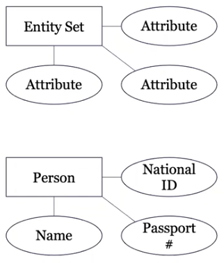
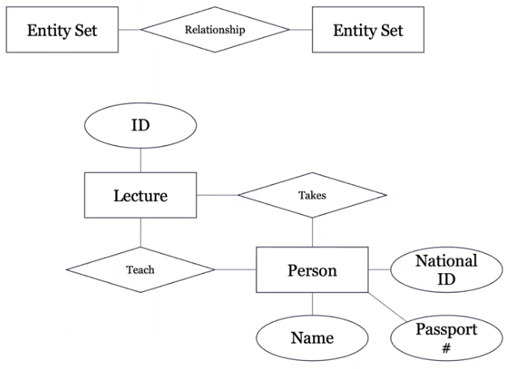
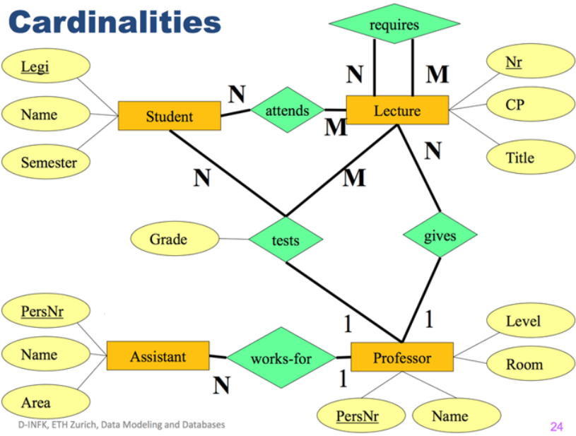
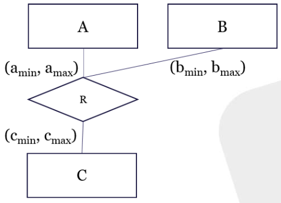

# Data Modelling and Databases - Week 4 (Lectures)
- Author: Ruben Schenk
- Date: 29.04.2021
- Contact: ruben.schenk@inf.ethz.ch

# Recap
## Learning Resources
Following are three really good Katacoda Tutorials:
1. https://www.katacoda.com/zhangce/scenarios/sql1
2. https://katacoda.com/dkoutsou/scenarios/sql-interactive-part-1
3. https://katacoda.com/dkoutsou/scenarios/sql-interactive-part-2

# Entity-Relationship Model
## Conceptual Modeling, Logical Modeling, and Physical Modeling
The process of implementing a real-world application includes modeling a DB. Modeling a DB goes through the following stages:
1. *Conceptual Modeling:* Capture the domain to be represented
2. *Logical Modeling:* Mapping the concepts to a concrete logical representation
3. *Physical Modeling:* Implementation in a concrete hardware

## Conceptual Modeling using Entity-Relationship Model
### Basic Concept
An `Entity-Relationship Model` models an application in the following three element types:
- `Entity sets`: A set of similar entities, where an `entity` is defined as an object in the real world that is dishtinguishable from other objects. "*Similar*" means that entities in the same entity set share the same attributes (E.g. "Professor" is an entity set, "ProfA" is an entity).
- `Attributes`: E.g. ID and name of a professor.
- `Relationships`: Relationships are connections among two or more entity sets, e.g. relationship between professor and lecture.

An `ER-Diagram` is a graphical way of representing entities and the relationships among them.

 

 

`Primary keys` are underlined in an ER-Diagram.

#### Formal Semantics of ER-Diagram
An ER-Diagram is a constraint language, defining the set of *valid DB instances*.
All the values the DB can take is given by $\mathcal{D} = \mathcal{B} \cup \Delta$, where:
- $\mathcal{B}:$ concrete values (Int, String, etc.)
- $\Delta :$ abstarct values (corresponding to an entity)

We can then furthermore define:
- Entity set $E :$ 1-ary predicate $E(x)$, i.e. $E(x)$ is true if $x$ is of entity type $E$
- Attribute $A :$ binary predicate $A(x, \, y)$, i.e. $A(x, \, y)$ is true if $x$ has attribute $y$
- n-ary relation $R :$ n-ary predicate $R(x_1,..., \, x_n)$, i.e. $R(x_1,..., \, x_n)$ is true if $(x_1,..., \, x_n)$ participate in $R$

#### Cardinality in ER-Diagrams
For relationships we distinguish between different types:
- 1-to-many
- 1-to-1
- many-to-many
- many-to-1

Example:

 

We can also have a more expressive notation, called `(min, max)-notation`:

 

This specifies the following constraints:
- $\forall x_A . A(x_A) \Rightarrow \exists^{\geq a_{min}, \leq a_{max}} x'_B,x'_C.R(x_A,x'_B,x'_C)$
- etc.

#### Weak Entities in ER-Diagrams
Some entity's existence relies on other entities. E.g., both buildings CAB and HG have a room with number F 1. So how can we uniquely identify those two rooms?

We therefore say that *Room* is a `weak entity` relying on *Building*. The key of *Room* would be *(Bld#, Room#)*.

#### Design Principles of ER-Diagrams
When designing ER-diagrams, one should follow the following rules:
- Attribute vs. Entity
  - Entity if the concept has more than one relationship
  - Attribute if the concept has only 1:1 relationship
- Partitioning of ER-Models
  - Most realistic models are larger than a page
  - Partition by domains (library, research, finances, etc.)
- Good vs Bad models
  - Do not model redundancy or tricks to improve performance
  - Less entities is better
  - Remember the `C4 rule`: *concise, correct, complete, comprehensive*

One might use https://erdplus.com/ to design simple ER-diagrams.

## Logical Modeling
### ER-Diagram to Relational Model
#### Principles
- Entities become relations
- Relationships become relations
- Entity sets become tables
- Attributes of entity sets become attributes of the table
- Merge relations with the same key

Note that when there is no cardinality constraints, a `relationship becomes a table`, containing the keys of all participating entity sets.