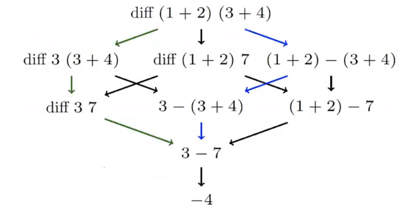
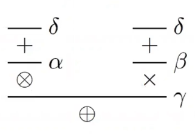
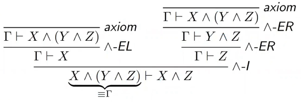

# Formal Methods and Functional Programming - Week 1 (Lectures)
- Author: Ruben Schenk
- Date: 04.03.2021
- Contact: ruben.schenk@inf.ethz.ch

# Introduction
## Basic concepts in functional programming
One important notion in functional programming is that functions have no side effect, i.e. $f(x)$ always returns the same value (for the same $x$). This allows us to reason as in mathematics, i.e. if $f(0) = 2$ then $f(0) + f(0) = 2 + 2$.

The above mentioned property is called `referential transparency`, i.e. *an expression evaluates to the same value in every context.*

Another basic concept is that we use `recursion instead of iteration`. This can be shown with an easy example of `gcd`. In Java we might use an iterative function:

```java
    public static int gcd (int x, int y) {
        while(x != y) {
            if (x > y) {
                x = x - y;
            } else {
                y = y - x;
            }
        }
        return x;
    }
```

whereas in functional programming we strictly use recursion:

```haskell
    gcd x y
        | x == y    = x
        | x > y     = gcd (x - y) y
        | otherwise = gcd x (x - y)
```

## Introduction to functional programming
### Expression evaluation
In general, expression evaluation in Haskell works the same way as in mathematics, e.g. for $f(x, y) = x-y$, if we want to compute $f(5, 7)$ we substitute $5$ for $x$ and $7$ for $y$.

We differ between two types of `evaluation strategies`:
- `Eager evaluation`, where we evaluate arguments first (corresponds to the *green path* in the picture below)
- `Lazy evaluation`, which is used in Haskell, where we evaluate expression from the left and *only when needed* (corresponds to the blue path in the picture below)



### Syntax and Types
The basic syntax of Haskell consists of the following two rules:
- Functions consist of different cases:

```haskell
    functionName x1 ... x2
        | guard1 = expr1
        | guard2 = expr2
        ...
        | guardm = exprm
```

- Programs consist of several definitions:

```haskell
    myConstant = 5

    aFunction y1 ... ym
        | guard1 = expr1
        | guard2 = expr2

    anotherFunction z1 ... zk
        ...
```

In Haskell, *indentation determines separation of definitions:
- All function definitions must start at the same indentation level.
- If a definition requires $n > 1$ lines, we indent the lines $2$ to $n$ further.

Following an example of a recommended layout:

```haskell
    f1 x1 x2
        | a long guard which may go over
          a number of lines
              = a long expression that also can
                go over several lines
        | g2  = e2
        | g3  = e3
```

Spaces are therefore very important, one should ***not use tabs!***

In Haskell we can use the following `types`:
- `Int` for integers with at least the range of $\{-2^{29},..., \, 2^{29}-1\}$ and the functions `+, *, ^, -, div, mod, abs`
- `Integer` for unbounded integers and the same functions as `Int`
- `Bool` with the values `True, False` and the binary operators `&&, ||` and the unary operator `not`
- `Char` for single characters as expected, i.e. `'a', 'b', 'c', ...`
- `String` for strings as expected, i.e. `"hello", "wordl", ...`
- `Doubles` for double precision numbers and functions like `+, -, *, /, abs, acos, ...`

We furthermore examine the type `tuple` more in detatil. Tuples are represented in `()` brackets. For example we might represente a student as a triple with his name, student id, and starting year as follows:

```haskell
    (String, Int, Int)
```

The above example is also called a `type constructor`. We can build and `element` of a student if we give it specific values, i.e.

```haskell
    ("Ueli Naef", 1234, 2015)
```

The above example is also called a `term constructor`. Functions can take tuples as arguments and/or return tupled values as shown in the example below:

```haskell
    addPair :: (Int, Int) -> Int
    addPair (x, y) = x + y
    -----------------------------
    ? addPair (3, 4)
    7
```

### Function scope
Functions have a `global scope`, i.e. a function can be called from any other function.

We can force a `local scope` with the keywords `let` and `where` as shown in the example below:

```haskell
    f x = let sq y = y * y
          in sq x + sq x
```

In the above code, `f x` is defined as `sq x + sq x` where `sq y` is *locally* defined as `y * y`.  This means that we can evaluate `f 10` but not `sq 10`.

The keyword `where` comes directly after a function definition and is used to define bindings over all guards:

```haskell
    f p1 p2 ... pm
        | g1 = e1
        | g2 = e2
        ...
        | gk = ek
        where
            v1 = r1
            v2 = r2
            ...
```

# Natural Deduction
To carry out `formal reasoning` about systems we need three essential parts:
1. Language
2. Semantics
3. Deductive system for carrying out proofs

As an introduction to this topic we look at an abstract example of a formal proof:
- Language: $\mathcal{L} = \{\bigoplus, \, \bigotimes, \, +, \, \times \}$
- Rules:
  - $\alpha$ : If $+$, then $\bigotimes$.
  - $\beta$ : If $+$, then $\times$.
  - $\gamma$ : If $\bigotimes$ and $\times$, then $\bigoplus$.
  - $\delta$ : $+$ holds.

Given the task "*Prove $+$*" we can proceed as follows:
1. $+$ holds by $\delta$
2. $\bigotimes$ holds by $\alpha$ with $1$.
3. $\times$ holds by $\beta$ with $1$.
4. $\bigoplus$ holds by $\gamma$ with $2$ and $3$.

Now, in a `deductive proof system` our rules look the following way:

$$
\frac{+}{\bigotimes} \alpha \qquad \frac{+}{\times} \beta \qquad \frac{\bigotimes \quad \times}{\bigoplus} \gamma \qquad \frac{}{+} \delta 
$$

Our prove can then be displayed as a `derivation tree` (following in *Parwitz style*):



We now change the rules a little bit and look at another example of a formal proof:
- Language: $\mathcal{L} = \{\bigoplus, \, \bigotimes, \, +, \, \times \}$
- Rules:
  - $\alpha$ : If $+$, then $\bigotimes$.
  - $\beta$ : If $+$, then $\times$.
  - $\gamma$ : If $\bigotimes$ and $\times$, then $\bigoplus$.
  - $\delta$ : **We may assume $+$ when proving $\bigotimes$.**

Our linear proof changes therefore to:
1. **Assume** $+$ holds by $\delta$
2. $\bigotimes$ holds by $\alpha$ with $1$.
3. $\times$ holds by $\beta$ with $1$.
4. $\bigoplus$ holds by $\gamma$ with $2$ and $3$.

In our deductive proof system we now change our rules as follows:

$$
\frac{\Gamma \vdash +}{\Gamma \vdash \bigotimes} \alpha \qquad \frac{\Gamma \vdash +}{\Gamma \vdash \times} \beta \qquad \frac{\Gamma \vdash \bigotimes \quad \Gamma \vdash \times}{\Gamma \vdash \bigoplus} \gamma \qquad \frac{\Gamma, + \vdash \bigoplus}{\Gamma \vdash \bigoplus} \delta 
$$

Here, $\Gamma$ stands for some assumption. The first rule, read bottom-up, therefore reads as "*To prove $\bigotimes$ holds under some assumption $\Gamma$, it suffices to show that $+$ holds under the same assumption $\Gamma$.*"

Our derivation tree, now in *Gentzen-style*, looks as follows:


## Propositional logic
### Syntax
The formal definition is given by:
- Let a set $\mathcal{V}$ of variables be given. Then $\mathcal{L}_P$, the `language of propositional logic`, is the smallest set where:
  - $X \in \mathcal{L}_P$ if $X \in \mathcal{V}$
  - $\bot \in \mathcal{L}_P$.
  - $A \land B \in \mathcal{L}_P$ if $A \in \mathcal{L}_P$ and $B \in \mathcal{L}_P$.
  - $A \lor B \in \mathcal{L}_P$ if $A \in \mathcal{L}_P$ and $B \in \mathcal{L}_P$.
  - $A \to B \in \mathcal{L}_P$ if $A \in \mathcal{L}_P$ and $B \in \mathcal{L}_P$.

### Semantics
A `valuation` $\sigma : \mathcal{V} \to \{\text{True, False} \}$ is a function mapping variables to truth values. We furthermore let `Valuations` be the set of valuations.

`Satisfiability` describes the smalles relation $\vDash \,\subseteq Valuations \times \mathcal{L}_P$ such that:
- $\sigma \vDash X$ if $\sigma(X) = \text{True}$
- $\sigma \vDash A \land B$ if $\sigma \vDash A$ and $\sigma \vDash B$
- $\sigma \vDash A \lor B$ if $\sigma \vDash A$ or $\sigma \vDash B$
- $\sigma \vDash A \to B$ if whenerver $\sigma \vDash A$ then $\sigma \vDash B$

We note here that $\sigma \nvDash \bot$, for every $\sigma \in Valuations$.

> A formula $A \in \mathcal{L}_P$ is `satisfiable` if 
> $$\sigma \vDash A, \text{ for some valuation } \sigma$$

> A formula $A \in \mathcal{L}_P$ is `valid` (a `tautology`) if
> $$\sigma \vDash A, \text{ for all valuations } \sigma$$

We furthermore respect `semantic entailment`, that is, $A_1,..., \, A_n \vDash A$ if for all $\sigma$, if $\sigma \vdash A_1,..., \, \sigma \vDash A_n$, then $\sigma \vDash A$.

### Requirement for a deductive system
For a deductive system we require that *syntactic entailment* $\vdash$ (derivation rules) and *semantic entailment* $\vDash$ (truth tables) agree. This requirement has two parts. For $H \equiv A_1,..., \, A_n$ some collection of formulae:
1. `Soundness`: If $H \vdash A$ can be derived, then $H \vDash A$
2. `Completeness`: If $H \vDash A$, then $H \vdash A$ can be derived

### Natural deduction for propositional formulae
We define three keywords for natural deduction:
- `Sequent`: An assertion of the form $A_1,..., \, A_n \vdash A$ where all $A, \, A_1, \, A_2,..., \, A_n$ are propositional formulae
- `Axiom`: A starting point for building derivation trees of the form
  $$\frac{}{..., \, A,... \vdash A} \, \, axiom$$
- `Proof` (of $A$):  A derivation tree with root $\vdash A$

### Conjunction rules

We distinguish betwee ntwo kinds of `rules`:
- `introduce`, denoted with $-I$, which introduce a connective
- `eliminate`, denoted by $-EL$ or $-ER$, which eliminate connectives

Example:

$$ \frac{\Gamma \vdash A \quad \Gamma \vdash B}{\Gamma \vdash A \land B} \, \land - I, \qquad \frac{\Gamma \vdash A \land B}{\Gamma \vdash A} \, \land - EL, \qquad \frac{\Gamma \vdash A \land B}{\Gamma \vdash B} \, \land - ER$$

Example derivation:



### Implication rules

We have the following two `implication rules`:

$$\frac{\Gamma, \, A \vdash B}{\Gamma \vdash A \to B} \,  \to - I, \qquad \frac{\Gamma \vdash A \to B \quad \Gamma \vdash A}{\Gamma \vdash B} \, \to - E$$

### Disjunction rules

We have the following three `disjunction rules`:

$$\frac{\Gamma \vdash A}{\gamma \vdash A \lor B} \, \lor - IL, \qquad \frac{\Gamma \vdash B}{\Gamma \vdash A \lor B} \, \lor - IR$$

$$\frac{\Gamma \vdash A \lor B \quad \Gamma, \, A \vdash C \quad \Gamma, \, B \vdash C}{\Gamma \vdash C} \, \lor - E$$

### Falsity and negation rules

We have the following `falsity rule`:

$$\frac{\Gamma \vdash \bot}{\Gamma \vdash A} \, \bot - E$$

and the following `negation rules` (we define $\neg A$ as $A \to \bot$):

$$\frac{\Gamma \vdash \neg A \quad \Gamma \vdash A}{\Gamma \vdash B} \, \neg - E$$

##  First-order logic
### Syntax
There are two syntactic categories: `terms` and `formulae`.

Furthermore, a `signature` consists of a set of function symbols $\mathcal{F}$ and a aset of predicate symbols $\mathcal{P}$ and we also denote the set of variables as $\mathcal{V}$.

Then *Term*, the `terms of first-order logic`, is the smalles set where
1. $x \in Term$ if $x \in \mathcal{V}$, and
2. $f^n(t_1,..., \, t_n) \in Term$ if $f^n \in \mathcal{F}$ and $t_j \in Term$ for all $1 \leq j \leq n$

*Form*, the `formulae of first-order logic`, is the smallest set where
1. $\bot \in Form$
2. $p^n (t_1,..., \, t_n) \in Form$ if $p^n \in \mathcal{P}$ and $t_j \in Term$, for all $1 \leq j \leq n$
3. $A \circ B \in Form$ if $A \in Form$, $B \in Form$, and $\circ \in \{\land, \, \lor, \, \to \}$
4. $Qx.A \in Form$ if $A \in Form$, $x \in \mathcal{V}$, and $Q \in \{\forall, \, \exists \}$

Each occurrence of each variable in a formula is either `bound` or `free`.

A variable occurrence $x$ in a formula $A$ is `bound` if $x$ occurs within a subformula $B$ of $A$ of the form $\exists x.B$ or $\forall x.B$ and is said to be `free` otherwise.

### $\alpha$ - conversion
We can rename *bound* variables at any time (called $\alpha$`-conversion`). Example:
$$\forall x. \exists y. p(x, \, y) \equiv \forall y. \exists x. p(y, \, x)$$

### Omitting parantheses
For binary operators we have the following binding strengths:
- $\land$ binds stronger than $\lor$ binds stronger than $\to$
- $\to$ associates to the right, $\land$ abd $\lor$ bind to the left
- $\neg$ binds stronger than any binary operator
- Quantifiers extend to the right as far as possible, that is, the end of the line or ")"

### Semantics
A `structure` is a pair $\mathcal{S} = \langle U_{\mathcal{S}}, \, I_{\mathcal{S}} \rangle$ where $U_{\mathcal{S}}$ is a non-empty set, the `universe`, and $I_{\mathcal{S}}$ is a mapping where:
1. $I_{\mathcal{S}}(p^n)$ is an $n$-ary relation on $U_{\mathcal{S}}$, for $p^n \in \mathcal{P}$, and
2. $I_{\mathcal{S}}(f^n)$ is an $n$-ary (total) function on $U_{\mathcal{S}}$, for $f^n \in \mathcal{F}$

As shorthand, we may also write $p^{\mathcal{S}}$ for $I_{\mathcal{S}}(p)$ and $f^{\mathcal{S}}$ for $I_{\mathcal{S}}(f)$.

An `interpretation` is a pair $\mathcal{I} = \langle \mathcal{S}, \, v \rangle$, where $\mathcal{S} = \langle U_{\mathcal{S}}, \, I_{\mathcal{S}} \rangle$ is a structure and $v : \mathcal{V} \to U_{\mathcal{S}}$ a valuation.

The `value` of a term $t$ under the interpretation $\mathcal{I} = \langle \mathcal{S}, \, v \rangle$ is written as $\mathcal{I}(t)$ and defined by
1. $\mathcal{I}(x) = v(x)$, for $x \in \mathcal{V}$, and
2. $\mathcal{I}(f(t_1,..., \, t_n)) = f^{\mathcal{S}}(\mathcal{I}(t_1),..., \, \mathcal{I}(t_n))$

When $\langle \mathcal{S}, \, v \rangle \vDash A$ we say $A$ `is satisfied with respect to` $\langle \mathcal{S}, \, v \rangle$ or $\langle \mathcal{S}, \, v \rangle$ `is a model of` $A$.

When every suitable interpretation is a model, we write $\vDash A$ and say $A$ is `valid`.

$A$ is `satisifable` if there is at leat one model for $A$.

Following an example of a suitable model for

$$\forall x.p(x, \, s(x))$$

- $U_{\mathcal{S}} = \mathcal{N}$
- $p^{\mathcal{S}} = \{(m, \, n) \, | \, m,n \in U_{\mathcal{S}} \text{ and } m < n \}$
- $s^{\mathcal{S}}(x) = x + 1$

