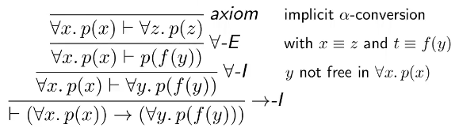
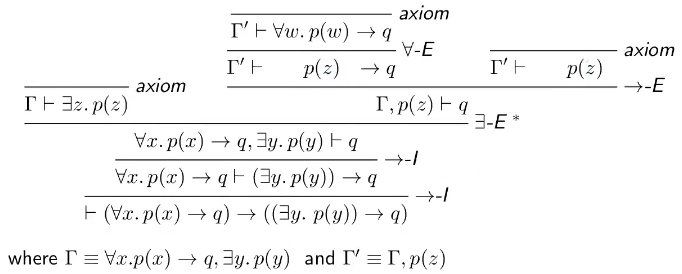

# Formal Methods and Functional Programming - Week 2 (Lectures)
- Author: Ruben Schenk
- Date: 08.03.2021
- Contact: ruben.schenk@inf.ethz.ch

## Substitution
`Substitution` describes replacing in $A$ all occurrences of a *free variable* $x$ with some term $t$. We write $A[x / t]$ to indicate that we substitute $x$ by $t$ in $A$.

Example:
$$A \equiv \exists y.y * x = x * z \to A[x / 2-1] \equiv \exists y.y * (2-1) = (2-1 * z)$$

### Universal quantification
We introduce the following two rules:

$$\frac{\Gamma \vdash A}{\Gamma \vdash \forall x.A} \, \forall - I ^*, \qquad \frac{\Gamma \vdash \forall x.A}{\Gamma \vdash A[x / t]} \, \forall - E$$

For the insertion rule, the side condition * denotes that $x$ cannot be free in any assumption $\Gamma$.

Example:

### Existential quantification

We introduce the following two rules:
$$\frac{\Gamma \vdash A[x / t]}{\Gamma \vdash \exists x-A} \, \exists - I, \qquad \frac{\Gamma \vdash \exists x.A \quad \Gamma, \, A \vdash B}{\Gamma \vdash B} \, \exists - E ^*$$

For the elimination rule, the side condition * denotes that $x$ is neither  free in $B$ nor free in $\Gamma$.

Example:

## Equality
### First order logic with equality
Equality is logical symbol with associated proof rules. We define it with:
- Extended language: $t_1 = t_2 \in Form$ if $t_1, t_2 \in Term$
- Extended definition of $\vDash$ : $\mathcal{I} \vDash t_1 = t_2$ if $\mathcal{I}(t_1) = \mathcal{I}(t_2)$

### Equality
`Equality` is an equivalence rule, shown by the following three rules:

$$\frac{}{\Gamma \vdash t = t} \, ref, \qquad \frac{\Gamma \vdash t = s}{\Gamma \vdash s = t} \, sym, \qquad \frac{\Gamma \vdash t = s \quad \Gamma \vdash s = r}{\Gamma \vdash t = r} \, trans$$

Equality is also a `congruence` on terms and all definable relations:

$$\frac{\Gamma \vdash t_1 = s_1 \quad \cdots \quad \Gamma \vdash t_n = s_n}{\Gamma \vdash f(t_1,..., \, t_n) = f(s_1,..., \, s_n)} \, \text{cong}_1$$

$$\frac{\Gamma \vdash t_1 = s_1 \quad \cdots \quad \Gamma \vdash t_n = s_n \quad \Gamma \vdash p(t_1,..., \, t_n)}{\Gamma \vdash p(s_1,..., \, s_n)} \, \text{cong}_2$$

# Correctness

Correctness is important for programs. But what does `correctness` mean? What properties should hold?
- `Termination`: Important for many, but not all programs
- `Functional behavior`: Function should return "correct" values.

## Termination
If $f$ is defined in terms of functions $g_1,..., \, g_k$, and each $g_j$ terminates, then so does $f$. If we work with recursion, a sufficient condition for termination is: Arguments are smaller along a well-founded order of function's domain.
- An order $>$ on a set $\mathcal{S}$ is `well-founded` iff. there is no infinite decreasing chain chain $x_1 > x_2 > x_3 > \cdots,$ for $x_i \in \mathcal{S}$
- We write $>_{\mathcal{S}}$ to indicate the domain $\mathcal{S}$, i.e. $>_{\mathcal{S}} \subseteq \mathcal{S} \times \mathcal{S}$

### Well-founded relations
We can construct new well-founded relations from existing ones the following way:

Let $R_1$ and $R_2$ be binary relations on a set $S$. The composition of $R_1$ and $R_2$ is defined as

$$R_2 \circ R_1 \equiv \{(a, \, c) \in S \times S \, | \, \exists b \in S.a \, R_1 \, b \land b \, R_2 \, c \}$$.

Remark: For a binary relation $R$, we write $a \, R \, b$ for $(a, \, b) \in R$.

Let $R \subseteq S \times S$. Define:
- $R^1 \equiv R$
- $r^{n + 1} \equiv R \circ R^n,$ for $n \geq 1$
- $R^+ \equiv \bigcup_{n \geq 1} R^n$

So $a \, R^+ \, b$ iff. $a \, R^i \, b$ for some $i \geq 1$.