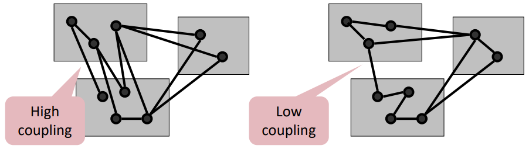
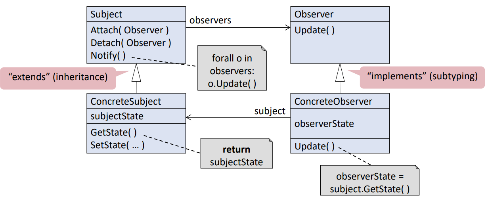
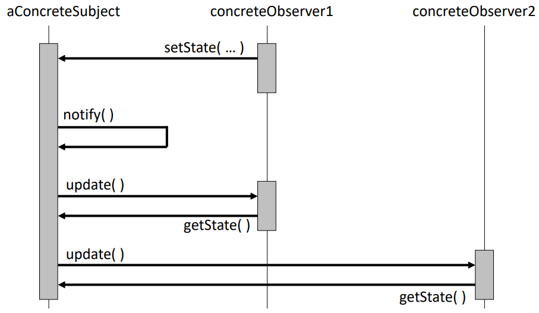
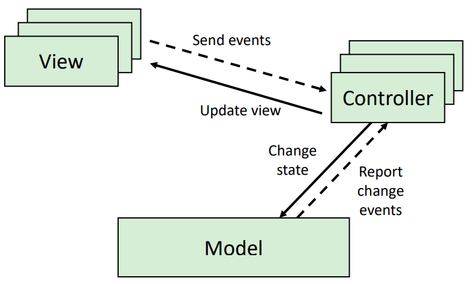
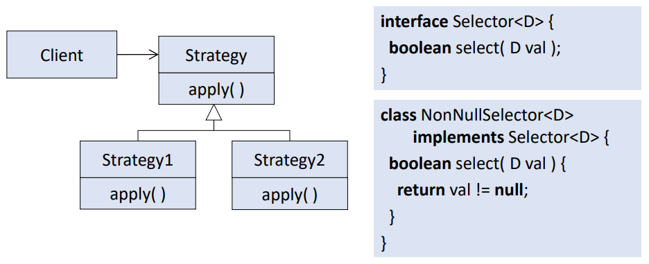
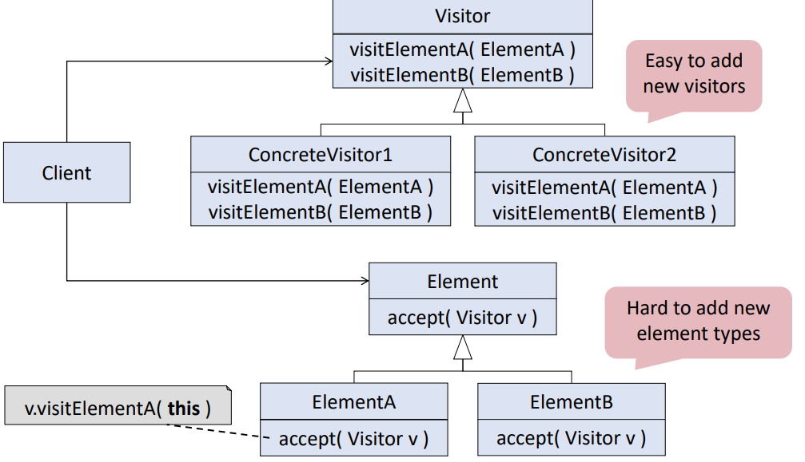

# Rigorous Software Engineering - Lectures
- Author: Ruben Schenk
- Date: 31.03.2021
- Contact: ruben.schenk@inf.ethz.ch
- Current scope: up to and incl. week 4

# 1. Introduction
## 1.2 Challenges
The four key dimensions to the question "Why is Software so Difficult to Get Right?" are:
- *Complexity*: Modern software systems are huge, they are created by many developers over several years. They also have a high number of discrete states and execution paths.
- *Change*: Software systems often deviate from their initial design. Typical changes include: New features, new interfaces, bug fixing, performance tuning.
- *Competing Objectives*: Functionality vs usability, cost vs robustness, performance vs portability, etc.
- *Constraints*: Such as budget, time, staff and their available skills.


## 1.4 Solution Approaches
This course is split up into four parts:
- Part I, Writing clean code: Modularity, Coupling, Design Patterns
- Part II, Software Testing: Metrics, exhaustive, random, functional, structural testing.
- Part III, Software Analysis at Scale: Math, heap, numerical, symbolic execution, concolic execution, fuzzing
- Part IV, Modeling: Model finding, Alloy, applications to memory models

# 2. Documentation
## 2.1 Why should we document?
### 2.1.1 Essential vs Incidental Properties
Source code does not exspress *which properties are stable* during software evolution, moreso, which properties are `essential` and which are `incidental`.

Example: In the following code, is it *essential* that it finds some index $i$ such that $\text{array}[i] = v$ or the *first* index $i$ ?

```java
    int find(int[] array, int v) {
        for(int i = 0; i < array.length; i++) {
            if(array[i] == v) {
                return i;
            } else {
                return -1;
            }
        }
    }
```

If a developer at a later point decides to parallelize this function, it is essential to know whether or not it is important to return the first matching index or just some matching index.

### 2.1.2 Invariants
We look at a simple example code:

```java
    HashMap<String, String> m;
    m = SomeLibrary.foo();
    String s = m.get("key");
```

Now, one might ask whether or not $s$ can be `NULL`.
- What happens if the key is not found in the map? -> The function `.get()` returns `NULL`.
- What if the key is matched? Can the value still be `NULL`?

### 2.1.3 Overriding methods
We first introduce `lazy initialization` shown by the following code snippet:

```java
    class ImageFile {
        String file;        // Path to image
        Image image;        // Loaded file

        ImageFile(String f) {
            file = f;
        }

        Image getImage() {
            if(image == null) {
                // load image
            }
            return image;
        }
    }
```

We see that we do *not* load the image on creating the `ImageFile`, i.e. in the constructor, but only when it's actually needed, i.e. in the `.getImage()` function. This style of coding is callec *lazy initialization*.

We now extend the above code snippet with the following `hashcode` function:

```java
    int hashcode() {
        if(image == null) {
            return file.hashcode();
        } else {
            return image.hashcode() + file.hashcode();
        }
    }
```

And run the following demo:

```java
    void demo(HashMap<ImageFile, String> m, ImageFile f) {
        m.put(f, "Hello");
        Image i = f.getImage();
        int l = m.get(f).length();
    }
```

The problem here is that we first store `"Hello"` with the hashcode of only *file* (since the image is `NULL` at this point) and then try to access the string again, after we loaded the image. But now the hashcode changed, since it now includes the hashcode of the image too (and not only of the file as before).


## 2.2 What to document?
One should document all *essential properties* explicitly:
- For clients: How to use the code? -> Document the interface.
- For implementors: How does the code work? Document the implementation.

### 2.2.1 Interface Documentation
The client interface of a class consists of:
- Constructors
- Methods
- Public fields
- Supertypes

-> We focus on methods here

**Method Call**

Clients need to know `how to call` a method correctly. Example:

```java
    class InputStreamReader {
        int reader(char cbuf[], int offset, int len) throws IOException {
            ...
        }
        ...
    }
```

For the parameters we have some "obvious" restrictions:
- `cbuf` is non-null
- `offset` is non-negative
- `len` is non-negative
- `offset + len` is at most `cbuf.length`

We furthermore have an *input state restriction*, namely that the receiver must be open.

**Method Result**

Clients need to know `what a method returns`. As any example to the code above:
- The method returns $-1$ if the end of the stream has been reached without reading any characters.
- Otherwise, the result indicates how many characters have been read.

**Method Effects**

Clients need to know how a `method affects the state`. Again, to the example above:
- Heap effects: The result characters have been stored in `cbuf`.
- Other effects: The methods throws an `IOException` if the stream is closed or an I/O error occurs.

**Global Properties**
Some implementations have properties that affect all methods.
- *Consistency*: properties of states, e.g. that a list is sorted
- *Evolution*: properties of sequences of states, e.g. that a list is immutable
- *Abbreviations*: requirements or guarantees for all methods, e.g. that a list is not thread-safe

### 2.2.2 Implementation Documentation
Method documentation is mostly similar to interfaces. Data structure documentation is more prominent, i.e. properties of fields, internal sharing, etc. We might also document the algorithms inside the code, e.g. justification of assumptions etc.

Example: We look at the following two classes:

```java
    class ListRep<E> {
        E[] elems;
        boolean shared;
        ...
    }

    class List<E> {
        ListRep<E> rep;
        int len;
    }
```

We might add the following information which could be helpful in the documentation:
- `elemes` is non-null
- `elems` is pointed to by only one object
- When the shared-field is true then shared, elems, and all elements are immutable
- ...

## 2.3 How to document?
There are multiple different ways to document code:

### 2.3.1 Comments
Comments are a simple, flexible and effective way of documenting interfaces and implementations. One might comment the `V get(Object key)` as follows:

```java
    /**
    * Returns the value to which the specified key is mapped, or
    * {@code null} if this map contains no mapping for the key.
    *
    * @param key the key whose associated value is to be returned
    *
    * @return the value to which the specified key is mapped,
    * or {@code null} if this map contains no mapping for the key
    *
    * @throws NullPointerException if the specified key is null
    * and this map does not permit null keys
    */
    V get(Object key);
```

### 2.3.2 Types and Modifiers
Types are a powerful documentation tool and modifiers can express some specific semantic properties.

Example:

```java
    /* Types as documentation tool. */
    HashMap<String, String> m;
    m = SomeLibrary.foo();
    String s = m.get("key");
```

```java
    /* Modifiers as documentation tool. */
    class HashMap<K, V> ... {
        final float loadFactor;
    }
```

### 2.3.3 Effect Systems
Effect systems are extensions of type systems that describe computational effects:
- Read and write effects
- Allocation and de-allocation
- Locking
- Exceptions

Example:

```java
    try {
        int i = isr.read();
    } catch(IOException e) {
        ...
    }
```

### 2.3.4 Metadata
Annotations allow one to attach additional syntactic and semantic information to declarations.

Example:

```java
    @NonNull Image getImage() {
        if(image == null) {
            // load image
        }
        return image;
    }
```

### 2.3.5 Assertions
Assertions specify semantic properties of implementations, i.e. boolean conditions that need to hold.

Example:

```java
    void shrink() {
        ...
        if(rep.shared) {
            rep = new ListRep<E>();
        }
        assert !rep.shared;
        ...
    }
```

### 2.3.6 Contracts
Contracts are stylized assertions for the documentation of interfaces and implementations. This includes:
- Method pre- and postconditions
- Invariants

Example:

```java
    class ImageFile {
        String file;
        invariant file != null;

        Image image;
        invariant old(image) != null ==> old(image) == image;

        ImageFile(String f) requires f != null; {
            file = f;
        }

        Image getImage() ensures result != null; {
            if(image == null) {
                // load image
            }
            return image;
        }
    }
```

# 3. Modularity
One way to master `modularity` is through `decomposition`. The benefits of decomposition are:
- Partition the overall developement effort
- Support independent testing and analysis
- Decouple parts of a system so that changes to one part do not affect other parts
- Enable reuse of components

## 3.1 Coupling
`Coupling` measures the interdependence between different modules.

<br>

- Tightly-coupled modules cannot be developed, tested, cahnged, or reused in isolation
- Low coupling is a key concern when developing correct and maintainable software
  
### 3.1.1 Data Coupling
Consider the following class:

```java
    class Coordinate {
        public double angle, radius;

        public double getX() {
            return Math.cos(angle)*radius;
        }
    }
```

The problem here is that `angle` and `radius` are `public`. This means that every client can directly access and edit the two attributes and therefore the class is coupled to every client:
- Modules that `expose` their `internal` data representation become tightly coupled to their clients
- Data representation is `difficult to change` during maintenance (if for example one client relies on the attributes `radius` and `angle`)

#### Approach 1: Restrict Access to Data
We may change the above class as follows:

```java
    class Coordinate {
        private double radius, angle;
        invariant 0 <= radius;

        public void setRadius(double r) {
            requires 0 <= r;
            {synchronized(this) {radius = r;}}
        }
        ...
    }
```
- `Information hiding`: Hide implementation details behind narrow interface
- `No leaking`: Do not return references to sub-objects
- `No capturing`: Do not store arguments as sub-objects
- `Clone` objects if necessary

#### Design Patterns
`Design patterns` are general, reusable solutions to commonly occuring design problems. They capture the best practices in detailed design.

**Flyweight Pattern** <br>
The `flyweight pattern` maximizes sharing of immutable objects.

<br>

The idea is that the factory takes responsibility for creating and maintaining the flyweights. Clients simply ask the factory for a flyweight `X`, if it exists, the factory returns the key, if not, it creates `X` first and then returns the key.

### 3.1.2 Procedural Coupling
Modules are coupled to other modules whose method they call. This results in the following two problems:
- `Reuse`: Callers cannot be reused without calle modules
- `Adaptation`: Changing signature in callee requires changing caller

Example:

```java
    class Controller {
        Sensor sensor;

        public boolean selfTest() {
            List<LogEntry> log = sensor.log();
            for(LogEntry e : log) {
                if(e.isError()) {return false;}
            }
            return true;
        }
    }

    class Sensor {
        List<LogEntry> log() {return ...;}
    }

    class LogEntry {
        ...
        boolean isError() {...}
    }
```

#### Approach 1: Moving Code

```java
    class Controller {
        Sensor sensor;

        boolean selfTest() {
            return sensor.noError();
        }
    }

    class Sensor {
        List<LogEntry> logData;

        boolean noError() {
            for(LogEntry e : logData) {
                if(e.isError()) {return false;}
            }
            return true;
        }
    }

    class LogEntry {
        ...
        boolean isError() {...}
    }
```
- Moving code may reduce procedural coupling
- It is common to even duplicate functionality to avoid dependencies on other code

#### Design Pattern
**Observer Pattern**

<br>

<br>

#### Approach 2: Event-Based Style
- Components may generate events, and/or register for events of other components using callback
- Generators of events do not know which component will be effected by their events
- Commonly used in user interfaces

Event-based style is usually used within a `model-view-controller architecture`:
- Components
  - `Model` contains the core functionality and data
  - One or more `views` display information to the user
  - One or more `controllers` handle user input
- Communication
  - Change-propagation mechanism via `events` ensures consistency between user interface and model

<br>

### 3.1.3 Class Coupling
The main type of class coupling is `inheritance`. Inheritance couples the subclass to the superclass. Changes in the superclass may break the subclass (also called the `fragile baseclass problem`).

#### Approach 1: Inheritance by Subtyping and Delegation
Multiple inheritance can be repalce by `subtyping and delegation`:

<br>

#### Approach 2: Using Interfaces
- Repalce occurences of class names by `supertypes` (interfaces)
- Use the most general supertype that offers all required operations

For example, instead of the following code

```java
    class SymbolTable {
        TreeMap<Ident, Type> types;

        TreeMap<Ident, Type> getTypes() {
            return types.clone();
        }
    }
```

use the following, more "general" code:

```java
    class SymbolTable {
        Map<Ident, Type> types;

        Map<Ident, Type> getTypes() {
            return types.clone();
        }
    }
```

We still have the problem of `instantiation`, since allocations couple clients to the instantiated class. This problem can be shifted to the client by letting the client allocate:

```java
    class SymbolTable {
        Map<Ident, Type> types;

        SymbolTable(Map<Ident, Type> t) {
            /*Instad of writing "types = new TreeMap<Ident, Type>();" */
            types = t;
        }
    }
```

#### Design Pattern
**Abstract Factory Pattern**

<br>

We can show the above pattern with the following code example:

```java
    interface MapFactory<K, V> {
        Map<K, V> make();
    }

    class TreeMapFactory implements MapFactory<K, V> {
        Map<K, V> make() {
            return new TreeMap<K, V>();
        }
    }

    class SymbolTable {
        MapFactory<Ident, Type> factory;
        Map<Ident, type> types;

        SymbolTable(MapFactory<Ident, Type> f) {
            factory = f;
            types = factory.make();
        }
    }
```

## 3.2 Adaptation
Since software is easy to change, software systems often deviate from their initial design. Typical changes are:
- New features
- New interfaces
- Bug fixing, performance tuning

Through `parametrization`, modules can be prepared for change by allowing clients to influence their behavior. One might make modules parametric in:
- the values they manipualte
- The data structures they operate on
- The types they operate on
- The algorithms they apply

We show as an example a class which is not parametrized:

```java
    class Merger {
        
        // Source of data and numbers of sources is fixed;
        StringStream f1, f2;
        boolean toggle;

        // Type of data is fixed
        String getNext() {
            String res = null;
            do {
                res = (toggle ? f1.getNext() : f2.getNext());
            
            // Filter criterion is fixed
            } while (res == null);

            // Alternation between sources is fixed
            toggle = !toggle;
            return res;
        }
    }
```

We can parametrize this class by using interfaces and factories instead of concrete classes:

```java
    class Merger {
        Filter[] filters;
        int next;

        String getNext() {
            String res = null;
            do {
                res = filters[next].getNext();
            } while(res == null);
        }
        next = (next + 1) % filters.length;
        return res;
    }
```

#### Design Pattern
**Strategy Pattern**

<br>

**Visitor Pattern**

<br>

# 5. Testing

## 5.1 Test Stages

### Unit Testing
Unit testing describes testing individual subsystems (collection of classes or a single class). The goal is to confirm that a subsystem is correctly coded and has  the intended functionality.

following a unit test example with JUnit:

```java
    // To test
    class SavingsAccount {
        ...
        public void deposit(int amount) {...}
        public void withdraw(int amount) {...}
        public int getBalance() {...}
    }

    // Unit test
    public void withdrawTest() {                        // Test driver
        SavingsAccount target = new SavingsAccount();   // Create test data
        target.deposit(300);
        int amount = 100;
        target.withdraw(amount);
        Assert.assertTrue(target.getbalance() == 200);  // Test oracle
    }
```

One might also use `parametrized unit tests`, where test methods take arguments for test data. This results in a decoupling of the test driver from the test data.

## 5.2 Test Strategies
We first look  at the several testing steps:
1. Select what will be tested (What parts of the system? What aspects of the system?)
2. Select test strategy (How is the test data determined?)
3. Define test cases (What is the test data? How is the test carried out?)
4. Create test oracle (What are the expected results? Defined before executing tests)

We will explore different `testing strategies` with the following example in mind:

```java
    // Solving the quadratic equation
    void roots(double a, double b, double c) {
        double q = b*b-4*a*c;
        if(q > 0 && a != 0) {
            int numRoots = 2;
            double r = Math.sqrt(q);
            double x1 = (-b + r) / (2*a);
            double x2 = (-b i-r) / (2*a);
        } else if(q == 0) {
            int numRoots = 1;
            double x1 = -b / (2*a);
        } else {
            int numRoots = 0;
        }
    }
```

#### Strategy 1: Exhaustive Testing
In `exhaustive testing` we check the UUT for all possible inputs. This is usually not feasible, even for trivial programms.

Example: Assume that `double` represents a 64-bit number, then we'd get $(2^{64})^{3} \simeq 10^{58}$ possible values for $a, \, b,$ and $c$.

#### Strategy 2: Random Testing
`Random testing` focuses on selecting test data uniformly. In the example code above we see that the methods fails if $a = 0$ and $b = 0$, however, the likelihood of selecting $a = 0$ and $b = 0$ randomly is $1 / 10^{38}$.

Random testing mainly focuses on generating test data fully automatic. We make the following observations with random testing:
- Advantages:
  - Avoids designer and tester bias
  - Tests robustness, especially handling of invalid inputs and unusual actions
- Disadvantages:
  - Treats all inputs as equally valuable

#### Strategy 3: Functional Testing
`Functional testing` focuses on using requirements knowledge to determine the test cases. 

For example, the task of our previous code is given by: "Given three values $a, \, b, \, c,$ compute all solutions of the equation $ax^2 + bx + c$. We furthermore know:

| Two solutions                       | One solution | No solution |
| :---------------------------------: | :----------: | :---------: |
| $a \neq 0$ and <br> $b^2 - 4ac > 0$ | $a = 0$ and $b \neq 0$ <br> or $a \neq 0$ and <br> $b^2 - 4ac = 0$ | $a = 0, \, b = 0,$ and $c \neq 0$ <br> or $a \neq 0$ and <br> $b^2 - 4ac < 0$ |

The idea with functional testing is to test each one of the three specified cases.

Functional testing focuses on input/output behavior, i.e. to cover all the requirements. It attempts to find incorrect or missing functions, interface errors, and performance errors.

Limititations of this strategy are:
- It does not effetctively detect design and coding errors (e.g. buffer overflow, memory management, etc.)
- It does not reveal errors in the specification (e.g. mising cases)

#### Strategy 4: Structural Testing
The idea of `structural teesting` is to use design knowledge about system structure, algorithms, and data strctures to determine test cases that exercise a large portion of the code.

Structural testing focuses on thoroughness, i.e. covering all of the code. It is, however, not well suited for system tests:
- Focuses on code rather than on requirements, for instance, does not detect missing logic
- Requires design knowledge, which testers and clients do not have and do not care about
- Thoroughness would lead to highly-reduntant tests

In summary we looked at three different strategies, each with a different goal:
- `Functional testing`: Cover all the requirements, black-box
- `Structural testing`: Cover all the code, white-box
- `Reandom testing`: Cover corner cases, black-box
## 5.3 Functional Testing

### 5.3.1 Partition Testing
The idea is to divide test inputs into `equivalence classes`, where each possible input belongs to one equivalence class. The goal is to find classes which have a higher density of failures than other classes.

Example: Given a month and a year, compute the number of days in the given month in the given year. We might partition the inputs as follows:
- Months
  - Months with 28 or 29 days
  - Months with 30 days
  - Months with 31 days
  - Invalid inputs
- Years
  - Standard leap years (year mod 4 = 0)
  - Standard non-leap years (year mod 4 != 0)
  - Special leap years (year mod 400 = 0)
  - Special non-leap years (year mod 100 = 0 and year mod 400 != 0)

### 5.3.2 Selecting Representative Values
Once we have partitioned the input values, we need to select concrete values for the test cases for each equivalence class.

#### Boundary Testing
A large number of errors tent to occur at boundaries of the input domain. One should therefore always check the boundaries of the domain!

### 5.3.3 Combinatorial Testing
Combining equivalence classes and boundary testing leads to many values for each input to test. This can lead to a "combinatorial explosion" when testing all possible combinations.

We want to reduce test cases to make the effort feasible through:
- Semantic constraints
- Combinatorial selection
- Random selection

#### Semantic Constraints
Through eliminating combinations we might be able to reduce the number of possible test cases. Elimination is done by inspecting test cases for unnecessary combinations:
- Especially for invalid values
- Use problem domain knowledge

However, especially when there are many input values, for instance, for the fields of objects, too many combinations still remain.

#### Combinatorial Selection
One might focuses on all `possible combinations` of each pair of inputs isntead on all possible combinations of all inputs.

Example: Consider a method with four boolean parameters:
- Combinatorial testing requires $2^4 = 16$ test cases
- Pairwise-combinations testing requires only 5 test cases: TTTT, TFFF, FTFF, FFTF, FFFTT

I.e. in `pariwise-comninaions` we look that each pair of variables appear in all possible combinations, e.g. in our previous case TT, TF, FT, and FF.

Pairwise-combinations testing reduces the number of test cases significantly while detecting most errors. It should however be combined with other approaches to detect errors that are triggered by more complex interactions among parameters.

## 5.4 Structural Testing
We first look at a motivating example: Given a non-null array of integers, sort the array in-place in ascending order.

```java
    public void sort(int[] a) {
        if(a == null || a.length < 2) {
            // array is trivially sorted
            return;
        }
        // check if array is already sorted
        for(int i = 0; i < a.length - 1; i++) {
            if(a[i] > a[i+1]) {
                break;
            }
        }
        if(i >= a.length - 1) {
            // array is already sorted
            return;
        }
        // use quicksort to sort array
        ...
    }
```

#### Basic Blocks
A `basic block` is a sequence of statements such that the code in a basic block:
- has `one entry point`: no code within it is the destination of a jump instruction anywhere in the program
- has `one exit point`: only the last instruction causes the program to execute code in a different basic block

Furthermore, whenever the first instruction in a basic block is executed, the rest of the instructions are necessarily executed exactly once, in order.

#### Intraprocedural Control Flow Graphs
An `intraprocedural control flow graph`(CFG) of a procedure $p$ is a graph $G = (N, E)$ where:
- $N$ is the set of basic blocks in $p$ plus designated entry and exit blocks
- $E$ contains:
    - an edge from $a$ to $b$ with condition $c$ iff. the execution of basic block $a$ is succeeded by the execution of basic block $b$ if condition $c$ holds
    - and edge $(entry, \, a, \, true)$ if $a$ is the first basic block of $p$
    - edges $(b, \, exit, \, true)$ for each basic block $b$ that ends with a return statement

The CFG can serve as an adequacy criterion for test cases. The more parts are executed, the higher the chance to uncover a bug.

#### Statement Coverage
We can asses the quality of a test suite by measuring how much of the CFG it executes, i.e. number of executed statements over the total number of statements gives you the `statement coverage`.

#### Branch Coverage
The idea is to test all possible branches in the control flow. An edge $(m, \, n, \, c)$ in a CFG is a `branch` iff. there is another edge $(m, \, n', \, c')$ in the CFG with $n \neq n'$. We define the `branch coverage` as the number of executed branches over the total number of branches.

Complete branch coverage implies complete statement coverage. It is the most widely used adequacy criterion in the industry.

#### Path Coverage
The idea is to test all possible paths thorugh the CFG. A `path` is a sequence of nodes $n_1,..., \, n_k$ such that $n_1$ is an entry and $n_k$ is an exit. We define the `path coverage` as the number of executed paths over the total number of paths.

Complete path coverage implies complete statement coverage and complete branch coverage. However, complete path coverage is not feasible for loops.

#### Loop Coverage
The idea is to test for each loop zero, one, and more that one consecutive iterations. The the `loop coverage` is given by the number of executed loops with 0, 1, and more that 2 iteration divided by the total number of loops * 3.

# 6. Static Anaylsis
We will learn a style called `abstract interpolation`, which is a general theory of how to do approximation systematically.

## 6.1 Abstract Interpolation
We can define abstract interpolation with the following steps:
1. Select/define an abstract domain: selected based on the type of properties you want to prove
2. Define abstract semantics for the language w.r.t. to the domain: prove sound w.r.t. concrete semantic
3. Iterate abstract transformers over the abstract domain: until we reach a fixed point

The `fixed point` is the *over-approximation* of the program.

## 6.2 Example Application of Abstract Interpolation
Lets prove an assertion to see how abstract interpolation works. Consider the following code:

```java
    foo(int i) {
1:      int x = 5;
2:      int y = 7;

3:      if(i >= 0) {
4:          y = y + 1;
5:          i = i - 1;
6:          goto 3;
        }
7:      assert 0 <= x + y;
    }
```

### Step 1: Select abstraction
Lets pick the `sign` abstraction, given as follows:

<br>

- $\top$: stands for all possible values
- $-$: stands for the negative values ($\leq 0$)
- $+$: stands for the positive values ($\geq 0$)
- $0$: stands for zero
- $\bot$: unreachable numbers (for now)

An `abstract` program state is a map from variables to elements in the domain. Example:

| pc | x | y | i |
|:--:|:-:|:-:|:-:|
| 2  | + | $\bot$ | $\top$ |

We see that at pc (program counter) 2, i.e. right before the execution of the second line, $x$ is positive, $y$ is bottom, i.e. not yet defined, and $i$ is either positive or negative.

### Step 2: Define Transformers
An `abstract transformer` describes the effect of statement and expression evaluation on an abstract state.

It is important to remember that abstract transformers are defined per `programming language` once and for all, and not per-program! <br>
This means thath any program in the programming language can use the same transformers.

A `correct abstract transformer` should always produce results that are superset of what a concrete transformer would produce.

Example of a sound transformer:

| pc | x | y | i |
|:--:|:-:|:-:|:-:|
| 4  | $\top$ | - | $\top$ |

$\Rightarrow$ `y := y + 1;` $\Rightarrow$

| pc | x | y | i |
|:--:|:-:|:-:|:-:|
| 5  | $\top$ | $\top$ | $\top$ |

It is easy to be `sound` and `imprecise`, simply output $\top$. It is desirable though to be both `sound` and `precise`.

### Step 3: Iterate to a fixed point
To start the analysis we start to iterate with the least abstract element. This means that initially, all 7 states in our code example from above look like:

| pc | x | y | i |
|:--:|:-:|:-:|:-:|
| 1-7  | $\bot$ | $\bot$ | $\bot$ |

After executing some iterations we will see that we get a state which doesn't change anymore, a so called `fixed point`:

<br>

### Step 4: Check property
As we can see, our property we're trying to prove is $(0 \leq x + y)$. As both $x$ and $y$ are positive in pc $7$, we have shown via abstract interpolation, that our assertion holds.

## 6.3 More on Abstract Interpolation
### Joins
When we have two abstract elements $A$ and $B$, we can `join` them to produce their least upper bound, denoted by $A \sqcup B$.

We then have that $A \sqsubseteq A \sqcup B$ and $B \sqsubseteq A \sqcup B$, where $D \sqsubseteq E$ means that $E$ is `more abstract` than $D$.

### Widening
With the interval abstraction we might not reach a fixed point. We therefore introduce a special operator called `widening operator`. It ensures termination at the expense of precision.

Whenever we want to join two states and we see that one variable is increasing, we directly go to infinity. 

Example: Instead of joining $[7, \, 7]$ with $[8, \, 8]$ to $[7, \, 8]$, we widen it to $[7, \, \infty]$.