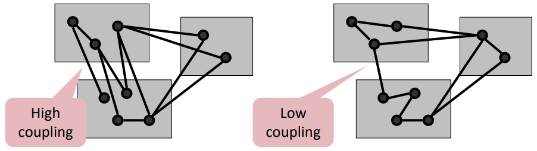
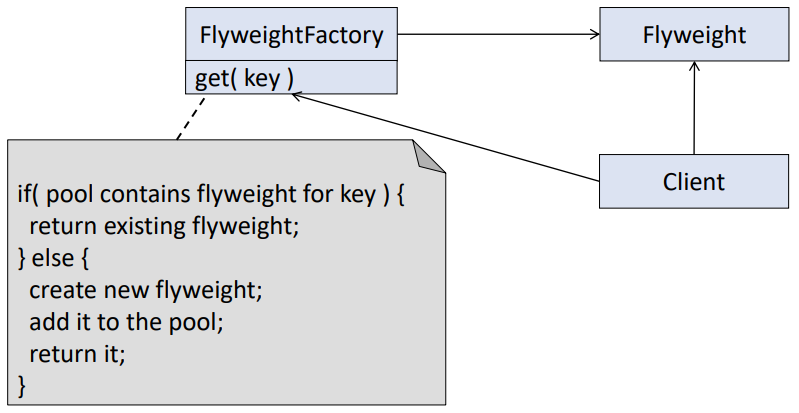
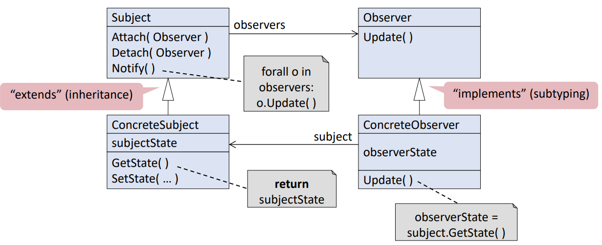
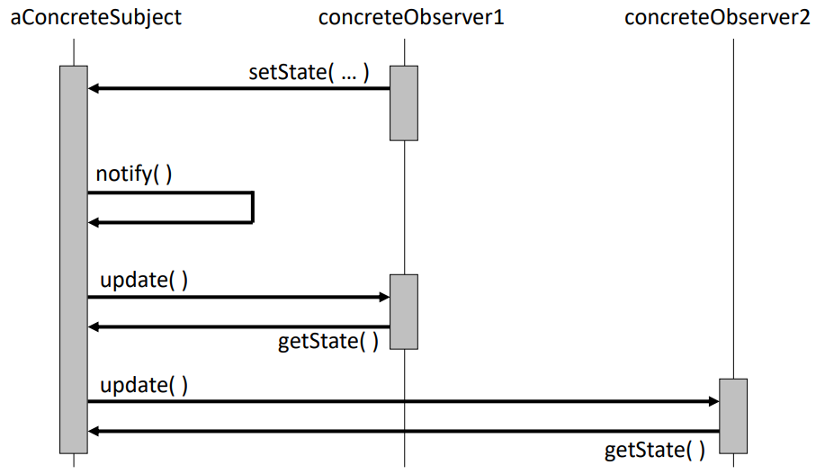
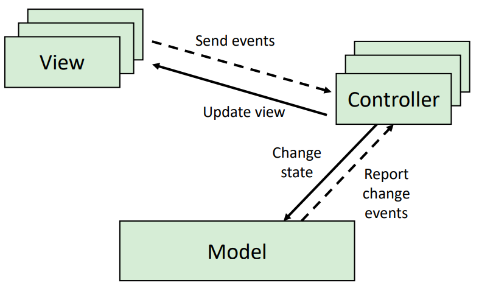
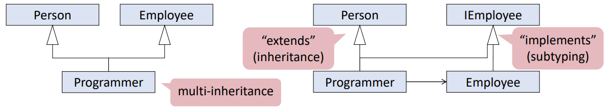
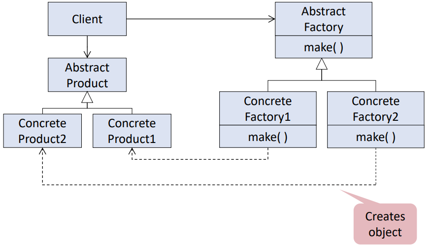
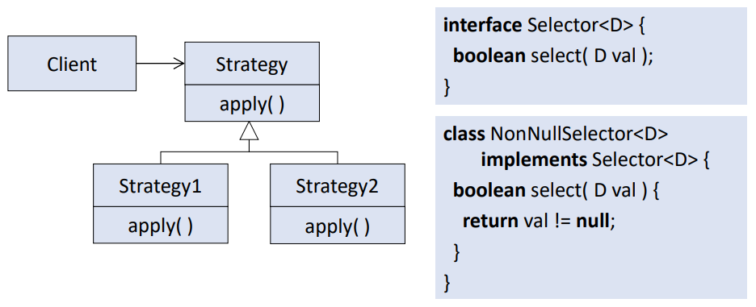
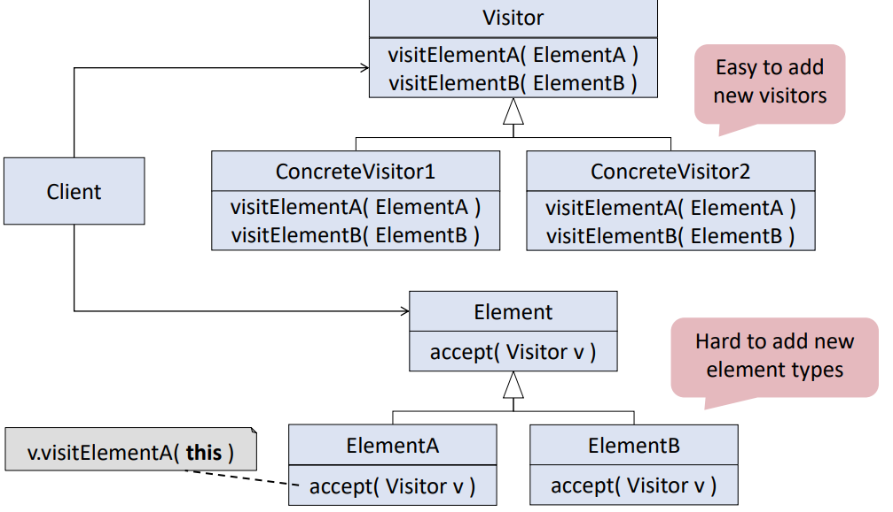

# Rigorous Software Engineering- Week 2 (Lectures)
- Author: Ruben Schenk
- Date: 23.03.2021
- Contact: ruben.schenk@inf.ethz.ch

# 3. Modularity
One way to master `modularity` is through `decomposition`. The benefits of decomposition are:
- Partition the overall developement effort
- Support independent testing and analysis
- Decouple parts of a system so that changes to one part do not affect other parts
- Enable reuse of components

## 3.1 Coupling
`Coupling` measures the interdependence between different modules.

<br>

- Tightly-coupled modules cannot be developed, tested, cahnged, or reused in isolation
- Low coupling is a key concern when developing correct and maintainable software
  
### 3.1.1 Data Coupling
Consider the following class:

```java
    class Coordinate {
        public double angle, radius;

        public double getX() {
            return Math.cos(angle)*radius;
        }
    }
```

The problem here is that `angle` and `radius` are `public`. This means that every client can directly access and edit the two attributes and therefore the class is coupled to every client:
- Modules that `expose` their `internal` data representation become tightly coupled to their clients
- Data representation is `difficult to change` during maintenance (if for example one client relies on the attributes `radius` and `angle`)

#### Approach 1: Restrict Access to Data
We may change the above class as follows:

```java
    class Coordinate {
        private double radius, angle;
        invariant 0 <= radius;

        public void setRadius(double r) {
            requires 0 <= r;
            {synchronized(this) {radius = r;}}
        }
        ...
    }
```
- `Information hiding`: Hide implementation details behind narrow interface
- `No leaking`: Do not return references to sub-objects
- `No capturing`: Do not store arguments as sub-objects
- `Clone` objects if necessary

#### Design Patterns
`Design patterns` are general, reusable solutions to commonly occuring design problems. They capture the best practices in detailed design.

**Flyweight Pattern** <br>
The `flyweight pattern` maximizes sharing of immutable objects.

<br>

The idea is that the factory takes responsibility for creating and maintaining the flyweights. Clients simply ask the factory for a flyweight `X`, if it exists, the factory returns the key, if not, it creates `X` first and then returns the key.

### 3.1.2 Procedural Coupling
Modules are coupled to other modules whose method they call. This results in the following two problems:
- `Reuse`: Callers cannot be reused without calle modules
- `Adaptation`: Changing signature in callee requires changing caller

Example:

```java
    class Controller {
        Sensor sensor;

        public boolean selfTest() {
            List<LogEntry> log = sensor.log();
            for(LogEntry e : log) {
                if(e.isError()) {return false;}
            }
            return true;
        }
    }

    class Sensor {
        List<LogEntry> log() {return ...;}
    }

    class LogEntry {
        ...
        boolean isError() {...}
    }
```

#### Approach 1: Moving Code

```java
    class Controller {
        Sensor sensor;

        boolean selfTest() {
            return sensor.noError();
        }
    }

    class Sensor {
        List<LogEntry> logData;

        boolean noError() {
            for(LogEntry e : logData) {
                if(e.isError()) {return false;}
            }
            return true;
        }
    }

    class LogEntry {
        ...
        boolean isError() {...}
    }
```
- Moving code may reduce procedural coupling
- It is common to even duplicate functionality to avoid dependencies on other code

#### Design Pattern
**Observer Pattern**

<br>

<br>

#### Approach 2: Event-Based Style
- Components may generate events, and/or register for events of other components using callback
- Generators of events do not know which component will be effected by their events
- Commonly used in user interfaces

Event-based style is usually used within a `model-view-controller architecture`:
- Components
  - `Model` contains the core functionality and data
  - One or more `views` display information to the user
  - One or more `controllers` handle user input
- Communication
  - Change-propagation mechanism via `events` ensures consistency between user interface and model

<br>

### 3.1.3 Class Coupling
The main type of class coupling is `inheritance`. Inheritance couples the subclass to the superclass. Changes in the superclass may break the subclass (also called the `fragile baseclass problem`).

#### Approach 1: Inheritance by Subtyping and Delegation
Multiple inheritance can be repalce by `subtyping and delegation`:

<br>

#### Approach 2: Using Interfaces
- Repalce occurences of class names by `supertypes` (interfaces)
- Use the most general supertype that offers all required operations

For example, instead of the following code

```java
    class SymbolTable {
        TreeMap<Ident, Type> types;

        TreeMap<Ident, Type> getTypes() {
            return types.clone();
        }
    }
```

use the following, more "general" code:

```java
    class SymbolTable {
        Map<Ident, Type> types;

        Map<Ident, Type> getTypes() {
            return types.clone();
        }
    }
```

We still have the problem of `instantiation`, since allocations couple clients to the instantiated class. This problem can be shifted to the client by letting the client allocate:

```java
    class SymbolTable {
        Map<Ident, Type> types;

        SymbolTable(Map<Ident, Type> t) {
            /*Instad of writing "types = new TreeMap<Ident, Type>();" */
            types = t;
        }
    }
```

#### Design Pattern
**Abstract Factory Pattern**

<br>

We can show the above pattern with the following code example:

```java
    interface MapFactory<K, V> {
        Map<K, V> make();
    }

    class TreeMapFactory implements MapFactory<K, V> {
        Map<K, V> make() {
            return new TreeMap<K, V>();
        }
    }

    class SymbolTable {
        MapFactory<Ident, Type> factory;
        Map<Ident, type> types;

        SymbolTable(MapFactory<Ident, Type> f) {
            factory = f;
            types = factory.make();
        }
    }
```

## 3.2 Adaptation
Since software is easy to change, software systems often deviate from their initial design. Typical changes are:
- New features
- New interfaces
- Bug fixing, performance tuning

Through `parametrization`, modules can be prepared for change by allowing clients to influence their behavior. One might make modules parametric in:
- the values they manipualte
- The data structures they operate on
- The types they operate on
- The algorithms they apply

We show as an example a class which is not parametrized:

```java
    class Merger {
        
        // Source of data and numbers of sources is fixed;
        StringStream f1, f2;
        boolean toggle;

        // Type of data is fixed
        String getNext() {
            String res = null;
            do {
                res = (toggle ? f1.getNext() : f2.getNext());
            
            // Filter criterion is fixed
            } while (res == null);

            // Alternation between sources is fixed
            toggle = !toggle;
            return res;
        }
    }
```

We can parametrize this class by using interfaces and factories instead of concrete classes:

```java
    class Merger {
        Filter[] filters;
        int next;

        String getNext() {
            String res = null;
            do {
                res = filters[next].getNext();
            } while(res == null);
        }
        next = (next + 1) % filters.length;
        return res;
    }
```

#### Design Pattern
**Strategy Pattern**

<br>

**Visitor Pattern**

<br>

# 5. Testing

## 5.1 Test Stages

### Unit Testing
Unit testing describes testing individual subsystems (collection of classes or a single class). The goal is to confirm that a subsystem is correctly coded and has  the intended functionality.

following a unit test example with JUnit:

```java
    // To test
    class SavingsAccount {
        ...
        public void deposit(int amount) {...}
        public void withdraw(int amount) {...}
        public int getBalance() {...}
    }

    // Unit test
    public void withdrawTest() {                        // Test driver
        SavingsAccount target = new SavingsAccount();   // Create test data
        target.deposit(300);
        int amount = 100;
        target.withdraw(amount);
        Assert.assertTrue(target.getbalance() == 200);  // Test oracle
    }
```

One might also use `parametrized unit tests`, where test methods take arguments for test data. This results in a decoupling of the test driver from the test data.

## 5.2 Test Strategies
We first look  at the several testing steps:
1. Select what will be tested (What parts of the system? What aspects of the system?)
2. Select test strategy (How is the test data determined?)
3. Define test cases (What is the test data? How is the test carried out?)
4. Create test oracle (What are the expected results? Defined before executing tests)

We will explore different `testing strategies` with the following example in mind:

```java
    // Solving the quadratic equation
    void roots(double a, double b, double c) {
        double q = b*b-4*a*c;
        if(q > 0 && a != 0) {
            int numRoots = 2;
            double r = Math.sqrt(q);
            double x1 = (-b + r) / (2*a);
            double x2 = (-b i-r) / (2*a);
        } else if(q == 0) {
            int numRoots = 1;
            double x1 = -b / (2*a);
        } else {
            int numRoots = 0;
        }
    }
```

#### Strategy 1: Exhaustive Testing
In `exhaustive testing` we check the UUT for all possible inputs. This is usually not feasible, even for trivial programms.

Example: Assume that `double` represents a 64-bit number, then we'd get $(2^{64})^{3} \simeq 10^{58}$ possible values for $a, \, b,$ and $c$.

#### Strategy 2: Random Testing
`Random testing` focuses on selecting test data uniformly. In the example code above we see that the methods fails if $a = 0$ and $b = 0$, however, the likelihood of selecting $a = 0$ and $b = 0$ randomly is $1 / 10^{38}$.

Random testing mainly focuses on generating test data fully automatic. We make the following observations with random testing:
- Advantages:
  - Avoids designer and tester bias
  - Tests robustness, especially handling of invalid inputs and unusual actions
- Disadvantages:
  - Treats all inputs as equally valuable

#### Strategy 3: Functional Testing
`Functional testing` focuses on using requirements knowledge to determine the test cases. 

For example, the task of our previous code is given by: "Given three values $a, \, b, \, c,$ compute all solutions of the equation $ax^2 + bx + c$. We furthermore know:

| Two solutions                       | One solution | No solution |
| :---------------------------------: | :----------: | :---------: |
| $a \neq 0$ and <br> $b^2 - 4ac > 0$ | $a = 0$ and $b \neq 0$ <br> or $a \neq 0$ and <br> $b^2 - 4ac = 0$ | $a = 0, \, b = 0,$ and $c \neq 0$ <br> or $a \neq 0$ and <br> $b^2 - 4ac < 0$ |

The idea with functional testing is to test each one of the three specified cases.

Functional testing focuses on input/output behavior, i.e. to cover all the requirements. It attempts to find incorrect or missing functions, interface errors, and performance errors.

Limititations of this strategy are:
- It does not effetctively detect design and coding errors (e.g. buffer overflow, memory management, etc.)
- It does not reveal errors in the specification (e.g. mising cases)

#### Strategy 4: Structural Testing
The idea of `structural teesting` is to use design knowledge about system structure, algorithms, and data strctures to determine test cases that exercise a large portion of the code.

Structural testing focuses on thoroughness, i.e. covering all of the code. It is, however, not well suited for system tests:
- Focuses on code rather than on requirements, for instance, does not detect missing logic
- Requires design knowledge, which testers and clients do not have and do not care about
- Thoroughness would lead to highly-reduntant tests

In summary we looked at three different strategies, each with a different goal:
- `Functional testing`: Cover all the requirements, black-box
- `Structural testing`: Cover all the code, white-box
- `Reandom testing`: Cover corner cases, black-box
## 5.3 Functional Testing

### 5.3.1 Partition Testing
The idea is to divide test inputs into `equivalence classes`, where each possible input belongs to one equivalence class. The goal is to find classes which have a higher density of failures than other classes.

Example: Given a month and a year, compute the number of days in the given month in the given year. We might partition the inputs as follows:
- Months
  - Months with 28 or 29 days
  - Months with 30 days
  - Months with 31 days
  - Invalid inputs
- Years
  - Standard leap years (year mod 4 = 0)
  - Standard non-leap years (year mod 4 != 0)
  - Special leap years (year mod 400 = 0)
  - Special non-leap years (year mod 100 = 0 and year mod 400 != 0)

### 5.3.2 Selecting Representative Values
Once we have partitioned the input values, we need to select concrete values for the test cases for each equivalence class.

#### Boundary Testing
A large number of errors tent to occur at boundaries of the input domain. One should therefore always check the boundaries of the domain!

### 5.3.3 Combinatorial Testing

