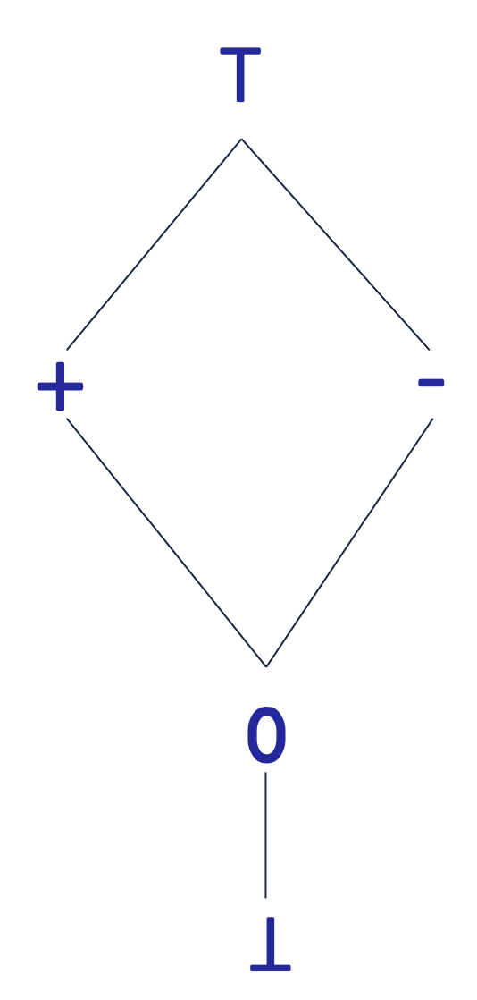
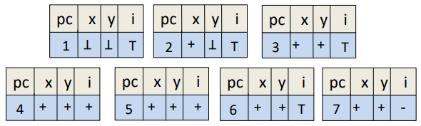

# Rigorous Software Engineering- Week 4 (Lectures)
- Author: Ruben Schenk
- Date: 30.03.2021
- Contact: ruben.schenk@inf.ethz.ch

# 6. Static Anaylsis
We will learn a style called `abstract interpolation`, which is a general theory of how to do approximation systematically.

## 6.1 Abstract Interpolation
We can define abstract interpolation with the following steps:
1. Select/define an abstract domain: selected based on the type of properties you want to prove
2. Define abstract semantics for the language w.r.t. to the domain: prove sound w.r.t. concrete semantic
3. Iterate abstract transformers over the abstract domain: until we reach a fixed point

The `fixed point` is the *over-approximation* of the program.

## 6.2 Example Application of Abstract Interpolation
Lets prove an assertion to see how abstract interpolation works. Consider the following code:

```java
    foo(int i) {
1:      int x = 5;
2:      int y = 7;

3:      if(i >= 0) {
4:          y = y + 1;
5:          i = i - 1;
6:          goto 3;
        }
7:      assert 0 <= x + y;
    }
```

### Step 1: Select abstraction
Lets pick the `sign` abstraction, given as follows:

<br>

- $\top$: stands for all possible values
- $-$: stands for the negative values ($\leq 0$)
- $+$: stands for the positive values ($\geq 0$)
- $0$: stands for zero
- $\bot$: unreachable numbers (for now)

An `abstract` program state is a map from variables to elements in the domain. Example:

| pc | x | y | i |
|:--:|:-:|:-:|:-:|
| 2  | + | $\bot$ | $\top$ |

We see that at pc (program counter) 2, i.e. right before the execution of the second line, $x$ is positive, $y$ is bottom, i.e. not yet defined, and $i$ is either positive or negative.

### Step 2: Define Transformers
An `abstract transformer` describes the effect of statement and expression evaluation on an abstract state.

It is important to remember that abstract transformers are defined per `programming language` once and for all, and not per-program! <br>
This means thath any program in the programming language can use the same transformers.

A `correct abstract transformer` should always produce results that are superset of what a concrete transformer would produce.

Example of a sound transformer:

| pc | x | y | i |
|:--:|:-:|:-:|:-:|
| 4  | $\top$ | - | $\top$ |

$\Rightarrow$ `y := y + 1;` $\Rightarrow$

| pc | x | y | i |
|:--:|:-:|:-:|:-:|
| 5  | $\top$ | $\top$ | $\top$ |

It is easy to be `sound` and `imprecise`, simply output $\top$. It is desirable though to be both `sound` and `precise`.

### Step 3: Iterate to a fixed point
To start the analysis we start to iterate with the least abstract element. This means that initially, all 7 states in our code example from above look like:

| pc | x | y | i |
|:--:|:-:|:-:|:-:|
| 1-7  | $\bot$ | $\bot$ | $\bot$ |

After executing some iterations we will see that we get a state which doesn't change anymore, a so called `fixed point`:

<br>

### Step 4: Check property
As we can see, our property we're trying to prove is $(0 \leq x + y)$. As both $x$ and $y$ are positive in pc $7$, we have shown via abstract interpolation, that our assertion holds.

## 6.3 More on Abstract Interpolation
### Joins
When we have two abstract elements $A$ and $B$, we can `join` them to produce their least upper bound, denoted by $A \sqcup B$.

We then have that $A \sqsubseteq A \sqcup B$ and $B \sqsubseteq A \sqcup B$, where $D \sqsubseteq E$ means that $E$ is `more abstract` than $D$.

### Widening
With the interval abstraction we might not reach a fixed point. We therefore introduce a special operator called `widening operator`. It ensures termination at the expense of precision.

Whenever we want to join two states and we see that one variable is increasing, we directly go to infinity. 

Example: Instead of joining $[7, \, 7]$ with $[8, \, 8]$ to $[7, \, 8]$, we widen it to $[7, \, \infty]$.